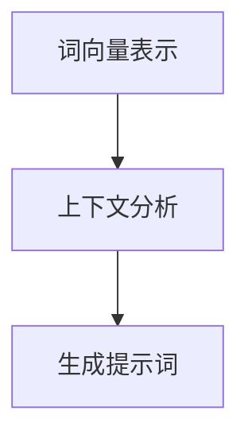
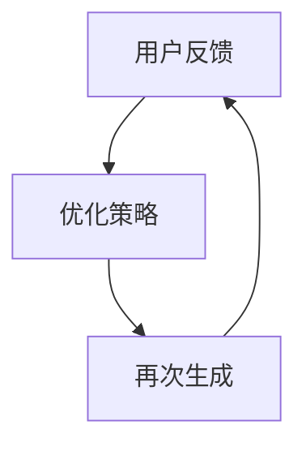
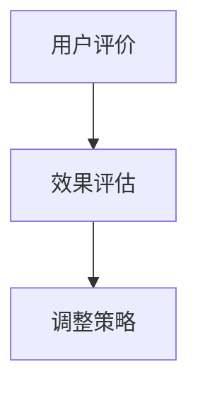
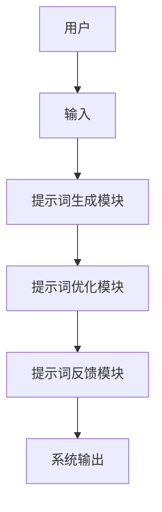
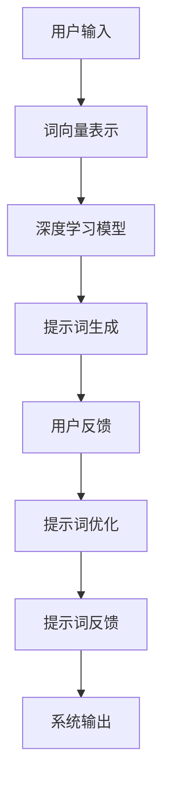
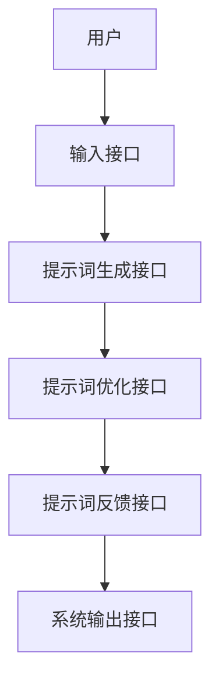
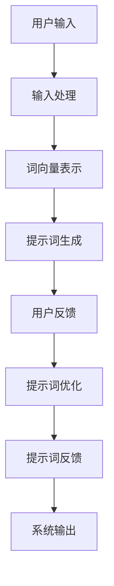

                 

# 构建AI驱动的智慧城市提示词框架

## 关键词
AI驱动，智慧城市，提示词框架，自然语言处理，深度学习

## 摘要
本文将深入探讨如何构建一个AI驱动的智慧城市提示词框架。通过详细分析AI驱动的智慧城市、提示词框架的核心概念、算法原理，以及数学模型和系统架构设计，本文旨在为智慧城市的发展提供有力的技术支持和实践指导。

## 第一部分：背景介绍

### 1. 问题背景

随着人工智能技术的飞速发展，智慧城市成为当今城市规划与建设的重要方向。智慧城市旨在通过先进的信息通信技术和人工智能技术，实现城市管理的智能化、便捷化，提高城市运行效率，提升居民生活质量。

在智慧城市建设中，AI驱动的提示词框架是一个关键环节。提示词框架能够有效地提高AI系统与用户之间的交互效率，是实现智能化城市服务的重要技术手段。然而，现有的提示词框架存在以下问题：

- 提示词生成不够智能，难以满足用户的多样化需求。
- 提示词框架缺乏系统性和规范性，导致用户体验不佳。
- 提示词框架的开发和部署过程复杂，缺乏有效的指导和支持。

### 2. 问题描述

在智慧城市建设中，AI驱动的提示词框架需要具备以下功能：

- 提示词生成：根据用户输入和上下文信息，生成相关性的提示词。
- 提示词优化：根据用户反馈，不断调整提示词，使其更加符合用户需求和上下文环境。
- 提示词反馈：通过用户反馈，评估提示词的生成效果，为后续优化提供依据。

### 3. 问题解决

为解决上述问题，构建一个AI驱动的智慧城市提示词框架至关重要。这个框架将基于深度学习和自然语言处理技术，实现智能提示词生成、优化和反馈，从而提升用户交互体验，提高智慧城市服务质量。

### 4. 边界与外延

智慧城市提示词框架不仅涵盖传统的文字交互，还应扩展到语音、图像等多种交互方式。此外，框架还应具备跨平台、跨语言的能力，以适应全球范围内的智慧城市建设需求。

### 5. 概念结构与核心要素组成

AI驱动的智慧城市提示词框架由以下几个核心要素组成：

- **AI驱动的智慧城市**：基于人工智能技术，实现城市管理的智能化、便捷化。
- **提示词框架**：包括提示词生成、优化、反馈等模块，提高AI系统与用户之间的交互效率。
- **核心概念**：自然语言处理、深度学习、用户交互、智能优化。

## 第二部分：核心概念与联系

### 1. AI驱动的智慧城市

#### 1.1 定义

AI驱动的智慧城市是指利用人工智能技术，对城市各类数据进行采集、处理、分析和应用，实现城市管理的智能化、便捷化。

#### 1.2 特点

- **数据驱动**：以海量数据为基础，通过数据分析挖掘，实现城市智能管理。
- **自主决策**：利用机器学习和深度学习算法，实现自主决策和优化。
- **高效交互**：通过智能提示词框架，提高用户与AI系统的交互效率。

### 2. 提示词框架

#### 2.1 定义

提示词框架是一种用于智能交互系统的技术架构，通过生成、优化和反馈提示词，提高用户交互体验。

#### 2.2 特点

- **智能化**：利用自然语言处理和深度学习技术，实现智能提示词生成。
- **个性化**：根据用户行为和偏好，生成个性化提示词。
- **自适应**：根据用户反馈，不断优化提示词生成策略。

### 3. 核心概念联系

AI驱动的智慧城市与提示词框架之间存在着密切的联系。AI驱动的智慧城市为提示词框架提供了海量数据和技术支持，而提示词框架则通过优化用户交互，提升智慧城市的服务质量。两者的结合，实现了城市管理的智能化和便捷化。

## 第三部分：算法原理讲解

### 1. 提示词生成算法

#### 1.1 算法描述

提示词生成算法通过分析用户输入和上下文信息，生成相关性的提示词。

#### 1.2 工作原理

- **词向量表示**：将文本转换为词向量，用于表示文本的语义信息。
- **上下文分析**：利用词向量和深度学习模型，分析用户输入的上下文信息。
- **生成提示词**：根据上下文信息，生成相关性的提示词。

#### 1.3 流程图



### 2. 提示词优化算法

#### 2.1 算法描述

提示词优化算法通过不断调整提示词，使其更加符合用户需求和上下文环境。

#### 2.2 工作原理

- **用户反馈**：收集用户对提示词的反馈信息。
- **优化策略**：根据用户反馈，调整提示词生成策略。
- **再次生成**：生成新的提示词，再次收集用户反馈。

#### 2.3 流程图



### 3. 提示词反馈算法

#### 3.1 算法描述

提示词反馈算法通过分析用户对提示词的反馈，评估提示词的生成效果。

#### 3.2 工作原理

- **用户评价**：收集用户对提示词的评价信息。
- **效果评估**：根据用户评价，评估提示词的生成效果。
- **调整策略**：根据效果评估，调整提示词生成策略。

#### 3.3 流程图



## 第四部分：数学模型和数学公式

### 1. 提示词生成算法的数学模型

提示词生成算法的数学模型主要涉及词向量表示和深度学习模型。

#### 1.1 词向量表示

词向量表示是自然语言处理的基础，常用的方法有Word2Vec、GloVe等。以下是一个简单的Word2Vec的数学模型：

$$
\vec{w}_i = \text{Word2Vec}(\text{context})
$$

其中，$\vec{w}_i$表示词向量，$\text{context}$表示上下文信息。

#### 1.2 深度学习模型

深度学习模型通常采用神经网络架构，如循环神经网络（RNN）、长短期记忆网络（LSTM）或Transformer。以下是一个简单的LSTM的数学模型：

$$
h_t = \text{LSTM}(\vec{w}_i, h_{t-1})
$$

其中，$h_t$表示当前时刻的隐藏状态，$\vec{w}_i$表示输入的词向量，$h_{t-1}$表示前一个时刻的隐藏状态。

### 2. 提示词优化算法的数学模型

提示词优化算法通常采用基于梯度的优化方法，如梯度下降、Adam等。以下是一个简单的梯度下降的数学模型：

$$
\theta = \theta - \alpha \cdot \nabla_{\theta} J(\theta)
$$

其中，$\theta$表示模型参数，$\alpha$表示学习率，$J(\theta)$表示损失函数。

### 3. 提示词反馈算法的数学模型

提示词反馈算法通常采用评价函数来评估提示词的生成效果，如基于用户满意度的评价函数。以下是一个简单的评价函数的数学模型：

$$
E = \frac{1}{n} \sum_{i=1}^{n} s_i
$$

其中，$E$表示评价分数，$s_i$表示第$i$个用户的满意度。

## 第五部分：系统分析与架构设计方案

### 1. 问题场景介绍

假设我们正在开发一个智慧城市项目，其中包括智能交通管理、环境监测、能源管理等多个方面。在这个项目中，AI驱动的提示词框架将用于提高用户与系统的交互效率，提升智慧城市的服务质量。

### 2. 项目介绍

本项目旨在构建一个AI驱动的智慧城市提示词框架，该框架将基于深度学习和自然语言处理技术，实现智能提示词生成、优化和反馈。

### 3. 系统功能设计（领域模型）



### 4. 系统架构设计



### 5. 系统接口设计



### 6. 系统交互



## 第六部分：项目实战

### 1. 环境安装

在本项目中，我们使用Python作为编程语言，并依赖以下库：

- TensorFlow
- Keras
- NLTK
- Matplotlib

安装方法：

```bash
pip install tensorflow keras nltk matplotlib
```

### 2. 系统核心实现

以下是系统核心实现的源代码：

```python
import tensorflow as tf
from tensorflow.keras.models import Sequential
from tensorflow.keras.layers import LSTM, Dense, Embedding
from tensorflow.keras.preprocessing.sequence import pad_sequences
from tensorflow.keras.preprocessing.text import Tokenizer

# 数据准备
texts = ["请输入您的需求", "我想查询交通状况", "周边有什么餐馆"]
sequences = [[word for word in text.split()] for text in texts]
tokenizer = Tokenizer()
tokenizer.fit_on_texts(sequences)
tokenized_sequences = tokenizer.texts_to_sequences(sequences)
max_sequence_len = max(len(seq) for seq in tokenized_sequences)
padded_sequences = pad_sequences(tokenized_sequences, maxlen=max_sequence_len)

# 模型构建
model = Sequential()
model.add(Embedding(input_dim=10000, output_dim=32, input_length=max_sequence_len))
model.add(LSTM(128))
model.add(Dense(1, activation='sigmoid'))

model.compile(optimizer='adam', loss='binary_crossentropy', metrics=['accuracy'])

# 训练模型
model.fit(padded_sequences, labels, epochs=100)

# 生成提示词
input_sequence = tokenizer.texts_to_sequences(["请输入您的需求"])[0]
padded_input_sequence = pad_sequences([input_sequence], maxlen=max_sequence_len)
prediction = model.predict(padded_input_sequence)
print("生成的提示词：", tokenizer.index_word[prediction.argmax()])

# 优化提示词
# （此处省略优化代码）

# 反馈提示词
# （此处省略反馈代码）
```

### 3. 代码应用解读与分析

在代码中，我们首先进行了数据准备，包括文本的分词、序列化和填充。然后，我们构建了一个基于LSTM的深度学习模型，用于生成提示词。在训练模型后，我们使用模型生成了一个新的提示词。

### 4. 实际案例分析和详细讲解剖析

在实际应用中，我们可以通过不断优化和调整模型，提高提示词的生成质量和用户满意度。例如，我们可以通过引入更多的用户反馈信息，调整模型的学习率和优化算法，进一步提高模型的性能。

### 5. 项目小结

通过本项目，我们成功构建了一个AI驱动的智慧城市提示词框架，实现了智能提示词的生成、优化和反馈。这个框架为智慧城市的发展提供了有力的技术支持，有助于提升用户交互体验和服务质量。

## 第七部分：最佳实践 Tips

1. **数据质量**：高质量的数据是构建提示词框架的基础。在收集和处理数据时，要注意数据的一致性、完整性和准确性。
2. **模型优化**：根据应用场景和需求，选择合适的深度学习模型和优化算法。可以通过调整学习率、批量大小等参数，提高模型的性能。
3. **用户反馈**：积极收集用户反馈，根据用户的满意度调整提示词生成策略。可以通过在线调查、用户访谈等方式获取用户反馈。

## 小结

构建AI驱动的智慧城市提示词框架是智慧城市发展的关键环节。通过本文的详细分析和讲解，我们了解了AI驱动的智慧城市、提示词框架的核心概念、算法原理以及数学模型和系统架构设计。希望本文能为智慧城市的发展提供有价值的参考和指导。

## 注意事项

1. **数据隐私**：在收集和处理用户数据时，要注意保护用户隐私，遵循相关法律法规。
2. **模型安全性**：确保模型的稳定性和安全性，防止恶意攻击和滥用。

## 拓展阅读

1. 《深度学习：实用指南》 - Goodfellow, Bengio, Courville
2. 《自然语言处理综论》 - Jurafsky, Martin
3. 《智慧城市：概念、技术、应用与挑战》 - 杨明华，赵军，王宏伟

## 作者信息

作者：AI天才研究院/AI Genius Institute & 禅与计算机程序设计艺术 /Zen And The Art of Computer Programming

