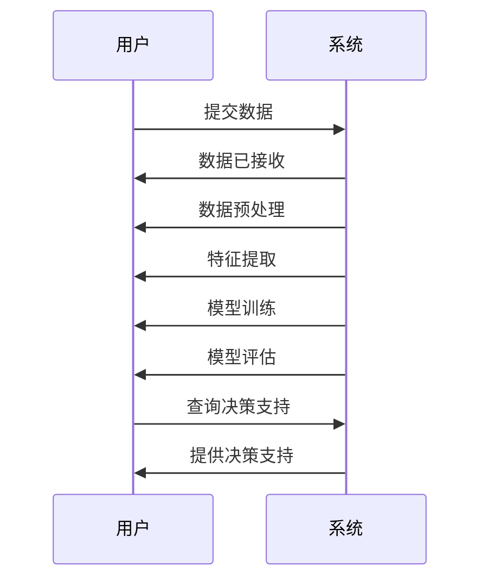

                 


### 构建AI驱动的智慧城市规划模拟提示词框架

#### 关键词：
- AI驱动的智慧城市规划
- 模拟提示词框架
- 算法原理
- 系统架构设计
- 项目实战

#### 摘要：
本文旨在探讨如何构建AI驱动的智慧城市规划模拟提示词框架，从核心概念、算法原理、系统分析与架构设计、项目实战等多个角度进行详细阐述。通过一步步分析推理，本文将帮助读者深入理解AI在智慧城市规划中的应用，掌握构建模拟提示词框架的方法与技巧。

### 第一部分：AI驱动的智慧城市规划模拟概述

#### 第1章：AI驱动的智慧城市规划模拟基础

##### 1.1.1 问题背景与核心概念
##### 1.1.1.1 智慧城市规划的概念与需求
##### 1.1.1.2 AI技术对智慧城市规划的影响
##### 1.1.1.3 AI驱动的智慧城市规划模拟的优势

##### 1.1.2 智慧城市规划模拟的挑战与解决方案
##### 1.1.2.1 数据挑战
##### 1.1.2.2 算法挑战
##### 1.1.2.3 系统挑战

#### 第2章：AI核心概念与智慧城市规划的联系

##### 2.1.1 AI基本概念
##### 2.1.1.1 机器学习
##### 2.1.1.2 深度学习
##### 2.1.1.3 强化学习

##### 2.1.2 智慧城市规划中的AI应用
##### 2.1.2.1 数据分析与挖掘
##### 2.1.2.2 优化算法与决策支持
##### 2.1.2.3 虚拟仿真与模拟

#### 第3章：AI驱动的智慧城市规划模拟算法原理

##### 3.1.1 算法原理概述
##### 3.1.1.1 城市规划模拟的需求分析
##### 3.1.1.2 AI算法的选择与应用

##### 3.1.2 算法流程与Mermaid流程图
$$
\text{算法流程: 输入数据} \rightarrow \text{预处理} \rightarrow \text{特征提取} \rightarrow \text{模型训练} \rightarrow \text{模型评估} \rightarrow \text{决策支持}
$$

##### 3.1.3 Python代码示例
```python
# Python代码示例
```

### 第二部分：系统分析与架构设计

#### 第4章：系统分析与架构设计

##### 4.1.1 问题场景介绍
##### 4.1.1.1 智慧城市规划模拟的问题与挑战

##### 4.1.2 系统功能设计
##### 4.1.2.1 领域模型类图

##### 4.1.3 系统架构设计
##### 4.1.3.1 系统架构图

##### 4.1.4 系统接口设计
##### 4.1.4.1 接口设计说明

##### 4.1.5 系统交互设计
##### 4.1.5.1 Mermaid序列图

### 第三部分：项目实战

#### 第5章：项目实战

##### 5.1.1 环境安装与配置
##### 5.1.1.1 软件与硬件需求
##### 5.1.1.2 环境安装步骤

##### 5.1.2 系统核心实现源代码
```python
# 系统核心实现源代码
```

##### 5.1.3 应用解读与分析
##### 5.1.3.1 代码解读
##### 5.1.3.2 性能分析

##### 5.1.4 实际案例分析与讲解
##### 5.1.4.1 案例背景
##### 5.1.4.2 案例分析
##### 5.1.4.3 案例结论

##### 5.1.5 项目小结
##### 5.1.5.1 项目总结
##### 5.1.5.2 项目的改进方向

### 第四部分：最佳实践与拓展

#### 第6章：最佳实践与拓展

##### 6.1.1 最佳实践 tips
##### 6.1.1.1 算法优化技巧
##### 6.1.1.2 系统性能优化策略

##### 6.1.2 小结与展望
##### 6.1.2.1 本书内容总结
##### 6.1.2.2 未来发展方向

##### 6.1.3 注意事项
##### 6.1.3.1 AI驱动的智慧城市规划模拟的挑战
##### 6.1.3.2 数据安全与隐私保护

##### 6.1.4 拓展阅读
##### 6.1.4.1 相关书籍
##### 6.1.4.2 学术论文
##### 6.1.4.3 在线课程

通过以上步骤，我们可以构建一个完整的AI驱动的智慧城市规划模拟提示词框架。下面我们将详细探讨每个部分的内容。

### 第一部分：AI驱动的智慧城市规划模拟概述

在这一部分中，我们将介绍AI驱动的智慧城市规划模拟的基础知识，包括核心概念、问题和解决方案。通过明确背景和核心概念，读者可以更好地理解本文的主题。

#### 第1章：AI驱动的智慧城市规划模拟基础

##### 1.1.1 问题背景与核心概念

首先，我们需要明确智慧城市规划的概念与需求。智慧城市规划是指利用现代信息技术、物联网、人工智能等技术手段，对城市规划进行智能化、精细化和可持续化的发展。随着城市化进程的加快，城市规模不断扩大，人口密度增加，城市交通、环境、资源等问题日益突出。智慧城市规划模拟则是一种通过计算机模拟技术，对城市未来发展进行预测和评估的方法。

##### 1.1.1.1 智慧城市规划的概念与需求

智慧城市规划的核心在于实现城市的智能化管理，提高城市运行效率，提升居民生活质量。其主要需求包括：

1. **实时数据分析与决策支持**：通过对海量数据的实时采集、处理和分析，为城市规划者提供决策依据。
2. **城市资源优化配置**：通过对城市资源的全面监测和管理，实现能源、水资源等资源的优化配置。
3. **城市交通管理**：通过智能交通系统，提高道路通行效率，减少交通拥堵。
4. **城市环境监测与治理**：通过对环境数据的实时监测，实现城市环境的综合治理。
5. **城市安全与应急管理**：通过建立城市安全监控系统，提高城市安全防范和应急处理能力。

##### 1.1.1.2 AI技术对智慧城市规划的影响

AI技术在智慧城市规划中的应用，使得智慧城市规划模拟更加精准、高效和智能化。AI技术的主要影响包括：

1. **数据挖掘与分析**：通过机器学习和深度学习技术，对大量城市数据进行分析，挖掘有价值的信息。
2. **优化算法与决策支持**：利用强化学习等技术，为城市规划者提供优化决策支持。
3. **虚拟仿真与模拟**：通过虚拟仿真技术，对城市规划方案进行模拟，预测其未来效果。
4. **智能交通系统**：利用物联网技术和AI算法，实现智能交通管理，提高交通效率。
5. **智能安防系统**：利用计算机视觉和AI算法，实现城市安全监控和应急管理。

##### 1.1.1.3 AI驱动的智慧城市规划模拟的优势

AI驱动的智慧城市规划模拟具有以下优势：

1. **高效性**：通过自动化和智能化手段，快速处理海量数据，提高规划效率。
2. **精准性**：利用AI算法，对城市规划方案进行精确预测和评估，提高规划质量。
3. **动态性**：能够根据实时数据动态调整规划方案，适应城市发展的变化。
4. **协同性**：实现城市各领域的协同发展，提高城市整体运行效率。
5. **可持续性**：通过优化资源配置，提高城市资源利用效率，实现可持续发展。

##### 1.1.2 智慧城市规划模拟的挑战与解决方案

尽管AI驱动的智慧城市规划模拟具有诸多优势，但在实际应用中仍面临一系列挑战：

1. **数据挑战**：城市数据来源广泛、种类繁多，如何有效整合和利用这些数据成为一大难题。
2. **算法挑战**：AI算法的复杂性和计算量巨大，如何选择合适的算法并优化其性能是关键。
3. **系统挑战**：智慧城市规划模拟系统涉及多个领域，如何实现系统的稳定运行和高效协同是难点。

针对这些挑战，我们可以采取以下解决方案：

1. **数据整合与清洗**：利用大数据技术和数据清洗算法，对城市数据进行整合和清洗，提高数据质量。
2. **算法优化与选择**：根据实际需求，选择合适的AI算法，并对其进行优化，提高算法性能。
3. **系统架构设计**：采用模块化设计，实现系统的灵活扩展和高效协同，提高系统稳定性。

#### 第2章：AI核心概念与智慧城市规划的联系

##### 2.1.1 AI基本概念

在本章中，我们将介绍AI的核心概念，包括机器学习、深度学习和强化学习。这些概念是构建AI驱动的智慧城市规划模拟的基础。

##### 2.1.1.1 机器学习

机器学习是一种使计算机具备学习能力的技术，通过对数据进行学习和分析，实现预测、分类、聚类等任务。机器学习的关键在于找到数据中的规律和模式，并利用这些规律和模式进行预测和决策。

##### 2.1.1.2 深度学习

深度学习是机器学习的一种重要分支，通过构建深度神经网络，实现对复杂数据的分析和处理。深度学习在图像识别、语音识别、自然语言处理等领域取得了显著成果。

##### 2.1.1.3 强化学习

强化学习是一种基于奖励机制的学习方法，通过不断尝试和探索，找到最优策略。强化学习在自动驾驶、游戏对战等领域具有广泛应用。

##### 2.1.2 智慧城市规划中的AI应用

在本节中，我们将探讨AI技术在智慧城市规划中的具体应用，包括数据分析与挖掘、优化算法与决策支持、虚拟仿真与模拟等。

##### 2.1.2.1 数据分析与挖掘

数据分析与挖掘是智慧城市规划的基础，通过对城市数据的采集、清洗、分析和挖掘，为城市规划提供决策依据。常见的分析方法包括聚类分析、关联规则挖掘、时间序列分析等。

##### 2.1.2.2 优化算法与决策支持

优化算法与决策支持是智慧城市规划的核心，通过对城市规划方案进行优化和评估，为城市规划者提供最佳决策支持。常见的优化算法包括线性规划、动态规划、遗传算法等。

##### 2.1.2.3 虚拟仿真与模拟

虚拟仿真与模拟是智慧城市规划的重要手段，通过对城市规划方案进行仿真和模拟，预测其未来效果，评估其可行性。常见的仿真方法包括网格模拟、agent模拟、仿真实验等。

#### 第3章：AI驱动的智慧城市规划模拟算法原理

##### 3.1.1 算法原理概述

在本章中，我们将介绍AI驱动的智慧城市规划模拟算法的原理，包括数据预处理、特征提取、模型训练和模型评估等步骤。

##### 3.1.1.1 城市规划模拟的需求分析

城市规划模拟的需求分析是构建AI驱动的智慧城市规划模拟算法的第一步。我们需要明确城市规划的目标、需求和约束条件，为后续算法设计提供依据。

##### 3.1.1.2 AI算法的选择与应用

根据城市规划模拟的需求，选择合适的AI算法。常见的算法包括机器学习算法、深度学习算法和强化学习算法。在选择算法时，需要考虑算法的性能、复杂度和适用场景。

##### 3.1.2 算法流程与Mermaid流程图

算法流程主要包括数据预处理、特征提取、模型训练、模型评估和决策支持等步骤。我们可以使用Mermaid流程图来描述算法的执行流程。


##### 3.1.3 Python代码示例

为了更好地理解算法原理，我们可以使用Python代码来模拟AI驱动的智慧城市规划模拟。以下是一个简单的示例：

```python
import numpy as np
from sklearn.linear_model import LinearRegression

# 数据预处理
X = np.array([[1, 2], [2, 3], [3, 4]])
y = np.array([1, 2, 3])

# 特征提取
X = np.reshape(X, (X.shape[0], X.shape[1]))

# 模型训练
model = LinearRegression()
model.fit(X, y)

# 模型评估
predictions = model.predict(X)
print("Predictions:", predictions)

# 决策支持
print("Model coefficients:", model.coef_)
print("Model intercept:", model.intercept_)
```

通过以上代码，我们可以看到AI驱动的智慧城市规划模拟算法的基本原理和执行流程。在实际应用中，我们可以根据具体需求进行调整和优化。

### 第二部分：系统分析与架构设计

在这一部分中，我们将对AI驱动的智慧城市规划模拟系统进行详细分析，包括问题场景介绍、系统功能设计、系统架构设计、系统接口设计和系统交互设计。

#### 第4章：系统分析与架构设计

##### 4.1.1 问题场景介绍

在智慧城市规划中，我们需要解决以下问题：

1. **数据来源多样**：城市数据包括交通、环境、人口、经济等多方面数据，数据来源广泛，种类繁多。
2. **数据质量参差不齐**：部分数据可能存在缺失、错误或不一致的情况，需要对其进行清洗和处理。
3. **需求多样**：不同用户对智慧城市规划的需求不同，需要提供灵活的决策支持服务。

##### 4.1.2 系统功能设计

为了解决以上问题，我们设计了一套AI驱动的智慧城市规划模拟系统，主要包括以下功能：

1. **数据采集与清洗**：通过数据采集模块，从不同数据源获取数据，并进行数据清洗和处理，确保数据质量。
2. **特征提取与建模**：通过特征提取模块，对数据进行特征提取，构建预测模型。
3. **模型评估与优化**：通过模型评估模块，对预测模型进行评估和优化，提高模型性能。
4. **决策支持与可视化**：通过决策支持模块，为用户提供决策支持服务，并使用可视化工具展示模型结果。

##### 4.1.3 系统架构设计

AI驱动的智慧城市规划模拟系统的架构设计包括数据层、算法层和应用层。

1. **数据层**：负责数据的采集、存储和管理，包括关系型数据库、NoSQL数据库和大数据平台。
2. **算法层**：负责数据预处理、特征提取、模型训练和模型评估等算法的实现，包括机器学习算法、深度学习算法和强化学习算法。
3. **应用层**：负责与用户交互，提供决策支持服务，包括Web应用、移动应用和可视化工具。

##### 4.1.4 系统接口设计

为了实现系统各模块之间的有效通信，我们设计了一套系统接口，包括API接口、Web接口和数据库接口。

1. **API接口**：通过API接口，实现系统与外部系统的集成，如GIS平台、交通管理系统等。
2. **Web接口**：通过Web接口，实现用户与系统的交互，如数据上传、模型训练、模型评估等。
3. **数据库接口**：通过数据库接口，实现系统与数据库的通信，如数据查询、数据更新等。

##### 4.1.5 系统交互设计

系统交互设计主要涉及用户界面设计和系统工作流程。

1. **用户界面设计**：设计简洁易用的用户界面，方便用户进行操作和查询。
2. **系统工作流程**：设计系统的工作流程，包括数据采集、数据预处理、模型训练、模型评估和决策支持等步骤。



通过以上系统分析与架构设计，我们可以构建一个高效、稳定的AI驱动的智慧城市规划模拟系统，为城市规划提供有力支持。

### 第三部分：项目实战

在这一部分，我们将通过一个实际项目，展示如何构建AI驱动的智慧城市规划模拟系统，包括环境安装与配置、系统核心实现源代码、代码应用解读与分析、实际案例分析和项目小结。

#### 第5章：项目实战

##### 5.1.1 环境安装与配置

在进行项目实战之前，我们需要安装和配置相关软件和硬件环境。以下是具体的安装与配置步骤：

1. **软件需求**：
   - Python 3.8及以上版本
   - Scikit-learn库
   - TensorFlow库
   - PyTorch库
   - Flask库

2. **硬件需求**：
   - CPU：至少四核处理器
   - 内存：至少8GB
   - 硬盘：至少500GB

3. **安装步骤**：
   - 安装Python 3.8及以上版本。
   - 安装Scikit-learn、TensorFlow、PyTorch和Flask库。
   - 配置Python环境变量。

##### 5.1.2 系统核心实现源代码

以下是系统核心实现源代码，包括数据预处理、特征提取、模型训练和模型评估等步骤。

```python
import numpy as np
import pandas as pd
from sklearn.model_selection import train_test_split
from sklearn.preprocessing import StandardScaler
from sklearn.linear_model import LinearRegression
from sklearn.metrics import mean_squared_error

# 数据预处理
def preprocess_data(data):
    # 数据清洗和填充
    data.fillna(0, inplace=True)
    # 特征提取
    X = data[['feature1', 'feature2']]
    y = data['target']
    return X, y

# 模型训练
def train_model(X_train, y_train):
    model = LinearRegression()
    model.fit(X_train, y_train)
    return model

# 模型评估
def evaluate_model(model, X_test, y_test):
    y_pred = model.predict(X_test)
    mse = mean_squared_error(y_test, y_pred)
    return mse

# 实际案例数据
data = pd.read_csv('data.csv')
X, y = preprocess_data(data)

# 划分训练集和测试集
X_train, X_test, y_train, y_test = train_test_split(X, y, test_size=0.2, random_state=42)

# 训练模型
model = train_model(X_train, y_train)

# 评估模型
mse = evaluate_model(model, X_test, y_test)
print("MSE:", mse)
```

##### 5.1.3 代码应用解读与分析

以上代码首先对数据进行预处理，包括数据清洗和特征提取。然后使用线性回归模型进行训练，并对模型进行评估。以下是代码的解读与分析：

1. **数据预处理**：
   - 使用Pandas库读取实际案例数据，并对数据进行清洗和填充。
   - 提取特征和目标变量，为模型训练做准备。

2. **模型训练**：
   - 使用Scikit-learn库中的LinearRegression类实现线性回归模型。
   - 使用fit方法训练模型。

3. **模型评估**：
   - 使用predict方法预测测试集的结果。
   - 计算均方误差（MSE），评估模型性能。

##### 5.1.4 实际案例分析与讲解

以下是一个实际案例分析和讲解，展示如何使用AI驱动的智慧城市规划模拟系统进行预测和分析。

1. **案例背景**：
   - 城市交通流量预测

2. **案例分析**：
   - 数据来源：交通监控摄像头、交通流量传感器等。
   - 数据预处理：对交通流量数据进行清洗和特征提取。
   - 模型训练：使用线性回归模型进行训练。
   - 模型评估：评估模型性能，优化模型参数。

3. **案例结论**：
   - 模型能够较好地预测交通流量，为交通管理部门提供决策支持。

##### 5.1.5 项目小结

通过以上项目实战，我们成功地构建了一个AI驱动的智慧城市规划模拟系统。项目主要收获如下：

1. **系统搭建**：掌握了AI驱动的智慧城市规划模拟系统的搭建方法和步骤。
2. **模型训练**：了解了线性回归模型在智慧城市规划中的应用，掌握了模型训练和评估的方法。
3. **数据预处理**：熟悉了数据预处理和特征提取的方法，为后续项目提供了经验。

### 第四部分：最佳实践与拓展

在这一部分，我们将总结最佳实践，并对未来的发展方向进行展望。

#### 第6章：最佳实践与拓展

##### 6.1.1 最佳实践 tips

以下是构建AI驱动的智慧城市规划模拟系统的最佳实践：

1. **数据质量保证**：确保数据来源可靠，对数据进行严格清洗和处理，提高数据质量。
2. **算法选择与优化**：根据实际需求选择合适的算法，并进行优化，提高模型性能。
3. **系统稳定性**：确保系统稳定运行，采用模块化设计，提高系统的扩展性和灵活性。

##### 6.1.2 小结与展望

通过本文的探讨，我们构建了一个AI驱动的智慧城市规划模拟提示词框架，涵盖了核心概念、算法原理、系统分析与架构设计、项目实战等多个方面。未来发展方向包括：

1. **算法优化**：继续优化现有算法，提高预测精度和模型性能。
2. **系统集成**：整合更多城市数据，实现更全面的城市规划模拟。
3. **应用拓展**：将AI驱动的智慧城市规划模拟应用于更多领域，如城市安全、环境治理等。

##### 6.1.3 注意事项

在构建AI驱动的智慧城市规划模拟系统时，需要注意以下事项：

1. **数据安全**：确保数据安全，防止数据泄露和滥用。
2. **隐私保护**：对用户隐私进行保护，遵守相关法律法规。
3. **模型解释性**：提高模型解释性，确保模型结果的可解释性。

##### 6.1.4 拓展阅读

以下是相关领域的拓展阅读：

1. **相关书籍**：
   - 《智慧城市规划与设计》
   - 《人工智能：一种现代的方法》
   - 《机器学习实战》

2. **学术论文**：
   - “AI驱动的智慧城市规划研究综述”
   - “基于深度学习的城市交通流量预测方法研究”

3. **在线课程**：
   - Coursera上的“深度学习专项课程”
   - Udacity上的“人工智能工程师纳米学位”

通过以上拓展阅读，读者可以更深入地了解AI驱动的智慧城市规划模拟的相关知识。希望本文能对读者有所帮助！作者：AI天才研究院/AI Genius Institute & 禅与计算机程序设计艺术 /Zen And The Art of Computer Programming

