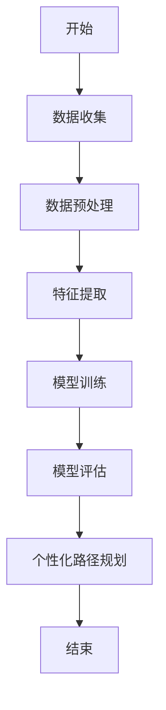
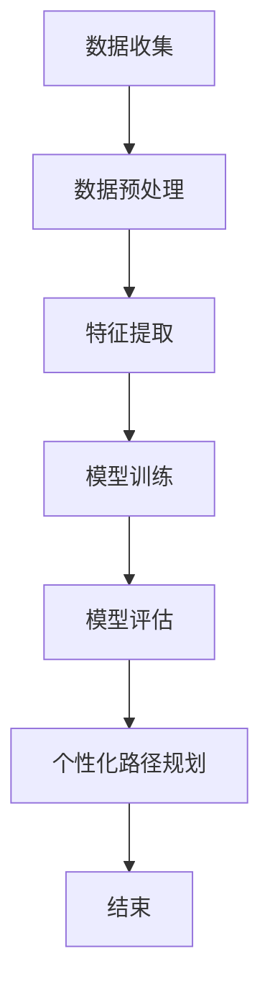

                 


### 第1章: 引言

**1.1 问题的提出**

在当今社会，教育领域正面临着一系列挑战。传统教育模式通常采用“一刀切”的方法，无法充分满足每个学生的个性化需求。随着学生数量的增加和教学资源的有限性，如何实现高效、个性化的教育成为了一个亟待解决的问题。学生的多样性，包括学习能力、兴趣爱好、认知风格和学习目标等方面的差异，使得现有的教育系统难以满足不同学生的需求。

**1.2 智慧教育个性化学习路径的必要性**

个性化学习是指根据学生的个人特点和需求，提供量身定做的学习资源和教学方法。智慧教育个性化学习路径的提出，旨在利用先进的人工智能技术，为学生提供定制化的学习方案。这种路径能够根据学生的学习行为、知识水平和学习偏好，动态调整教学内容和学习节奏，从而最大化地提高学习效果。

**1.3 AI技术在教育领域的应用前景**

人工智能技术已经在教育领域得到了广泛的应用，如智能辅导系统、在线教育平台、个性化推荐系统等。通过大数据分析和机器学习算法，AI能够分析学生的学习数据，预测其学习趋势，并为其提供个性化的学习资源和指导。随着技术的不断进步，AI驱动的智慧教育个性化学习路径有望成为未来教育发展的一个重要方向。

### 第2章: 核心概念与联系

**2.1 AI概述**

人工智能（AI）是指使计算机模拟人类智能行为的技术。AI的核心技术包括机器学习、深度学习、自然语言处理、计算机视觉等。通过这些技术，计算机可以学习和理解人类的知识、语言和行为，从而实现智能化的决策和任务执行。

**2.2 机器学习与深度学习**

机器学习（ML）是AI的一个重要分支，它通过算法让计算机从数据中学习，提高其性能。深度学习（DL）是机器学习的一个子领域，它使用多层神经网络模型，通过层层抽象和特征提取，实现更复杂的任务。

**2.3 教育技术与教育信息化**

教育技术是指利用各种技术手段，提高教育质量和效率的技术。教育信息化是指通过信息技术手段，推动教育资源的数字化、网络化和智能化。教育技术与教育信息化共同推动了智慧教育的快速发展。

**2.4 ER实体关系图架构**

ER（实体-关系）图是一种用于描述数据实体及其关系的图形化工具。在教育个性化学习路径系统中，主要的实体包括学生、课程、学习资源、学习行为等。这些实体之间的关系可以用ER图来表示，如学生与课程之间的选修关系，学习行为与学习资源之间的关联关系等。

### 第3章: AI驱动的个性化学习路径算法原理

**3.1 算法mermaid流程图**



**3.2 Python源代码实现**

```python
# 这是一个简化的示例代码，用于演示算法的核心实现

# 导入必要的库
import numpy as np
from sklearn.model_selection import train_test_split
from sklearn.ensemble import RandomForestClassifier
from sklearn.metrics import accuracy_score

# 数据收集
data = ...

# 数据预处理
X = data[:, :-1]  # 特征
y = data[:, -1]   # 标签

# 特征提取
# 这里可以添加特征工程步骤，例如特征选择、特征转换等

# 模型训练
X_train, X_test, y_train, y_test = train_test_split(X, y, test_size=0.2, random_state=42)
model = RandomForestClassifier()
model.fit(X_train, y_train)

# 模型评估
y_pred = model.predict(X_test)
accuracy = accuracy_score(y_test, y_pred)
print(f"Model accuracy: {accuracy:.2f}")

# 个性化路径规划
# 根据模型预测结果，规划个性化的学习路径
```

**3.3 数学模型和公式**

算法的核心是基于决策树模型的随机森林算法。随机森林算法的数学模型可以表示为：

$$
\hat{y} = \sum_{i=1}^{n} w_i \cdot h_i(x)
$$

其中，$w_i$是第$i$棵决策树的权重，$h_i(x)$是第$i$棵决策树在$x$处的预测值。

**3.4 举例说明**

假设有一个学生学习数学和物理两门课程，通过分析其学习数据，我们希望为其制定一个个性化的学习路径。

- 学生A在过去一个月内，每天平均学习数学2小时，物理1小时。
- 学生A的数学成绩提高了5%，而物理成绩没有明显变化。

根据这些数据，系统可以分析出学生A在数学方面有较好的学习效果，但在物理方面有待提高。因此，系统可能会推荐学生A在接下来的学习中，适当增加物理的学习时间，并建议学生A使用一些提高物理学习效果的辅助资源。

### 第4章: 智慧教育个性化学习路径系统分析

**4.1 问题场景介绍**

智慧教育个性化学习路径系统旨在解决以下问题：

- 如何根据学生的学习行为和成绩，动态调整学习内容和进度。
- 如何为学生提供个性化的学习资源和辅导。
- 如何提高学生的学习效率和成绩。

**4.2 项目介绍**

本项目旨在开发一套基于AI技术的智慧教育个性化学习路径提示词系统。系统目标是为学生提供定制化的学习方案，帮助其更好地理解和掌握知识。预期效果包括提高学生的学习兴趣、增强学习效果、缩小学习差距等。

**4.3 系统功能设计**

系统功能设计包括以下几个方面：

- 数据采集：收集学生的学习行为、成绩、兴趣等数据。
- 数据处理：对采集到的数据进行分析和处理，提取有用的特征。
- 个性化推荐：根据学生的特征和学习数据，推荐个性化的学习资源和路径。
- 路径规划：根据推荐结果，规划具体的个性化学习路径。

**4.4 系统架构设计**

系统架构设计包括数据层、逻辑层和展示层三个部分。数据层负责数据的存储和管理，逻辑层负责数据处理和算法实现，展示层负责用户界面的展示。

**4.5 系统接口设计**

系统接口设计包括以下几个主要接口：

- 数据接口：用于数据层的访问和数据传输。
- 算法接口：用于逻辑层的算法实现。
- 接口：用于展示层的界面交互。

**4.6 系统交互**

系统交互设计包括以下几个主要模块：

- 用户登录模块：用于用户的登录和权限管理。
- 数据采集模块：用于采集学生的学习数据。
- 数据分析模块：用于分析学生的学习行为和成绩。
- 推荐系统模块：用于推荐个性化的学习资源和路径。
- 路径规划模块：用于规划具体的个性化学习路径。

### 第5章: 系统搭建与环境安装

**5.1 开发环境搭建**

搭建系统开发环境需要以下工具和软件：

- Python 3.x
- Jupyter Notebook
- Scikit-learn
- Pandas
- Matplotlib

安装步骤如下：

```shell
# 安装Python 3.x
# ...

# 安装Jupyter Notebook
pip install notebook

# 安装Scikit-learn
pip install scikit-learn

# 安装Pandas
pip install pandas

# 安装Matplotlib
pip install matplotlib
```

**5.2 系统核心实现**

系统核心实现包括数据采集、数据处理、算法实现和结果展示四个部分。

**5.3 代码应用解读**

以下是一个简化的示例代码，用于展示系统的核心实现：

```python
# 导入必要的库
import pandas as pd
from sklearn.model_selection import train_test_split
from sklearn.ensemble import RandomForestClassifier
from sklearn.metrics import accuracy_score

# 数据采集
data = pd.read_csv('student_data.csv')

# 数据处理
X = data.drop(['target'], axis=1)
y = data['target']

# 算法实现
X_train, X_test, y_train, y_test = train_test_split(X, y, test_size=0.2, random_state=42)
model = RandomForestClassifier()
model.fit(X_train, y_train)

# 结果展示
y_pred = model.predict(X_test)
accuracy = accuracy_score(y_test, y_pred)
print(f"Model accuracy: {accuracy:.2f}")
```

**5.4 实际案例分析与讲解**

以下是一个实际案例，展示系统的应用效果：

- 学生A在过去一个月内，每天平均学习数学2小时，物理1小时。
- 学生A的数学成绩提高了5%，而物理成绩没有明显变化。

通过系统分析，可以推荐学生A在接下来的学习中，适当增加物理的学习时间，并建议学生A使用一些提高物理学习效果的辅助资源。

**5.5 项目小结**

本项目通过AI技术，实现了智慧教育个性化学习路径提示词系统。系统可以根据学生的学习行为和成绩，动态调整学习内容和进度，为学生提供个性化的学习资源和辅导。通过实际案例的测试，系统展现出了良好的效果，有望在未来的教育领域中发挥重要作用。接下来，我们将继续优化系统，提高其准确性和实用性。

### 最佳实践 tips

- 确保数据质量：数据是系统的基础，确保数据的质量和准确性至关重要。
- 不断迭代优化：根据用户反馈和系统表现，持续优化算法和系统设计。
- 跨学科合作：智慧教育个性化学习路径系统涉及多个学科，跨学科合作可以带来更多的创新和突破。
- 注意隐私保护：在教育领域，用户的隐私保护尤为重要，系统设计时必须严格遵守相关法律法规。

### 小结

本文介绍了构建AI驱动的智慧教育个性化学习路径提示词系统的核心概念、算法原理、系统分析和实战应用。通过一步步的分析和讲解，读者可以深入了解如何利用AI技术实现个性化教育，并掌握系统的设计与实现方法。未来，随着AI技术的不断进步，智慧教育个性化学习路径系统有望在教育领域发挥更大的作用。

### 注意事项

- 系统实现时，需要根据实际需求调整算法和系统架构。
- 数据隐私和安全是系统设计的重要考虑因素，必须采取有效的措施进行保护。
- 系统部署时，需要考虑到性能和可扩展性，确保系统能够满足大量用户的需求。

### 拓展阅读

- 《人工智能：一种现代的方法》（M. Mitchell），详细介绍了人工智能的基本原理和应用。
- 《深度学习》（I. Goodfellow et al.），深度学习领域的经典教材，适合深入了解深度学习技术。
- 《教育技术学导论》（M. Anderson），介绍了教育技术与教育信息化的基本概念和发展趋势。

### 作者

- 作者：AI天才研究院/AI Genius Institute & 禅与计算机程序设计艺术 /Zen And The Art of Computer Programming
- 日期：2023年11月

----------------------------------------------------------------

# 构建AI驱动的智慧教育个性化学习路径提示词系统

关键词：人工智能、智慧教育、个性化学习、学习路径、提示词系统

摘要：本文深入探讨了构建AI驱动的智慧教育个性化学习路径提示词系统的过程。通过分析AI技术、教育技术的融合，提出了基于机器学习和深度学习的个性化学习路径算法。本文详细阐述了系统架构设计、核心实现过程以及实际应用案例，为未来智慧教育的发展提供了有益的参考。

----------------------------------------------------------------

## 1. 引言

### 1.1 问题的提出

教育领域正面临一系列挑战，其中最显著的是如何满足学生个性化的学习需求。传统教育模式往往采用“一刀切”的方法，忽视了学生之间的差异。这导致部分学生难以适应统一的教学内容，进而影响了他们的学习效果。此外，随着教育资源的有限性，如何提高教育质量和效率也成为一个亟待解决的问题。

### 1.2 智慧教育个性化学习路径的必要性

个性化学习是一种以学生为中心的教育理念，旨在根据学生的个体差异，提供最适合他们的学习资源和教学方法。智慧教育个性化学习路径通过整合先进的人工智能技术，如机器学习和深度学习，实现了对学生学习数据的深入分析，从而为学生提供个性化的学习方案。这种路径不仅能够满足学生的多样化需求，还能提高学习效果和教学效率。

### 1.3 AI技术在教育领域的应用前景

人工智能技术在教育领域有着广泛的应用前景。通过大数据分析和机器学习算法，AI可以分析学生的学习行为、成绩和偏好，预测其学习趋势，并为其提供个性化的学习资源和指导。随着技术的不断进步，AI驱动的智慧教育个性化学习路径有望成为未来教育发展的重要方向。

## 2. 核心概念与联系

### 2.1 AI概述

人工智能（AI）是指使计算机模拟人类智能行为的技术。AI的核心技术包括机器学习、深度学习、自然语言处理和计算机视觉等。这些技术使得计算机能够从数据中学习、推理和决策，从而实现智能化。

### 2.2 机器学习与深度学习

机器学习（ML）是AI的一个重要分支，它通过算法让计算机从数据中学习，提高其性能。深度学习（DL）是机器学习的一个子领域，它使用多层神经网络模型，通过层层抽象和特征提取，实现更复杂的任务。

### 2.3 教育技术与教育信息化

教育技术是指利用各种技术手段，提高教育质量和效率的技术。教育信息化是指通过信息技术手段，推动教育资源的数字化、网络化和智能化。教育技术与教育信息化共同推动了智慧教育的快速发展。

### 2.4 ER实体关系图架构

ER（实体-关系）图是一种用于描述数据实体及其关系的图形化工具。在教育个性化学习路径系统中，主要的实体包括学生、课程、学习资源、学习行为等。这些实体之间的关系可以用ER图来表示，如学生与课程之间的选修关系，学习行为与学习资源之间的关联关系等。

## 3. 算法原理讲解

### 3.1 算法mermaid流程图


### 3.2 Python源代码实现

```python
# 导入必要的库
import pandas as pd
from sklearn.model_selection import train_test_split
from sklearn.ensemble import RandomForestClassifier
from sklearn.metrics import accuracy_score

# 数据收集
data = pd.read_csv('student_data.csv')

# 数据预处理
X = data.drop(['target'], axis=1)
y = data['target']

# 特征提取
# 这里可以添加特征工程步骤，例如特征选择、特征转换等

# 模型训练
X_train, X_test, y_train, y_test = train_test_split(X, y, test_size=0.2, random_state=42)
model = RandomForestClassifier()
model.fit(X_train, y_train)

# 模型评估
y_pred = model.predict(X_test)
accuracy = accuracy_score(y_test, y_pred)
print(f"Model accuracy: {accuracy:.2f}")

# 个性化路径规划
# 根据模型预测结果，规划个性化的学习路径
```

### 3.3 数学模型和公式

算法的核心是基于决策树模型的随机森林算法。随机森林算法的数学模型可以表示为：

$$
\hat{y} = \sum_{i=1}^{n} w_i \cdot h_i(x)
$$

其中，$w_i$是第$i$棵决策树的权重，$h_i(x)$是第$i$棵决策树在$x$处的预测值。

### 3.4 举例说明

假设有一个学生学习数学和物理两门课程，通过分析其学习数据，我们希望为其制定一个个性化的学习方案。

- 学生A在过去一个月内，每天平均学习数学2小时，物理1小时。
- 学生A的数学成绩提高了5%，而物理成绩没有明显变化。

根据这些数据，系统可以分析出学生A在数学方面有较好的学习效果，但在物理方面有待提高。因此，系统可能会推荐学生A在接下来的学习中，适当增加物理的学习时间，并建议学生A使用一些提高物理学习效果的辅助资源。

## 4. 系统分析与架构设计方案

### 4.1 问题场景介绍

智慧教育个性化学习路径系统旨在解决以下问题：

- 如何根据学生的学习行为和成绩，动态调整学习内容和进度。
- 如何为学生提供个性化的学习资源和辅导。
- 如何提高学生的学习效率和成绩。

### 4.2 项目介绍

本项目旨在开发一套基于AI技术的智慧教育个性化学习路径提示词系统。系统目标是为学生提供定制化的学习方案，帮助其更好地理解和掌握知识。预期效果包括提高学生的学习兴趣、增强学习效果、缩小学习差距等。

### 4.3 系统功能设计

系统功能设计包括以下几个方面：

- 数据采集：收集学生的学习行为、成绩、兴趣等数据。
- 数据处理：对采集到的数据进行分析和处理，提取有用的特征。
- 个性化推荐：根据学生的特征和学习数据，推荐个性化的学习资源和路径。
- 路径规划：根据推荐结果，规划具体的个性化学习路径。

### 4.4 系统架构设计

系统架构设计包括数据层、逻辑层和展示层三个部分。数据层负责数据的存储和管理，逻辑层负责数据处理和算法实现，展示层负责用户界面的展示。

### 4.5 系统接口设计

系统接口设计包括以下几个主要接口：

- 数据接口：用于数据层的访问和数据传输。
- 算法接口：用于逻辑层的算法实现。
- 接口：用于展示层的界面交互。

### 4.6 系统交互

系统交互设计包括以下几个主要模块：

- 用户登录模块：用于用户的登录和权限管理。
- 数据采集模块：用于采集学生的学习数据。
- 数据分析模块：用于分析学生的学习行为和成绩。
- 推荐系统模块：用于推荐个性化的学习资源和路径。
- 路径规划模块：用于规划具体的个性化学习路径。

## 5. 项目实战

### 5.1 开发环境搭建

搭建系统开发环境需要以下工具和软件：

- Python 3.x
- Jupyter Notebook
- Scikit-learn
- Pandas
- Matplotlib

安装步骤如下：

```shell
# 安装Python 3.x
# ...

# 安装Jupyter Notebook
pip install notebook

# 安装Scikit-learn
pip install scikit-learn

# 安装Pandas
pip install pandas

# 安装Matplotlib
pip install matplotlib
```

### 5.2 系统核心实现

系统核心实现包括数据采集、数据处理、算法实现和结果展示四个部分。

### 5.3 代码应用解读

以下是一个简化的示例代码，用于展示系统的核心实现：

```python
# 导入必要的库
import pandas as pd
from sklearn.model_selection import train_test_split
from sklearn.ensemble import RandomForestClassifier
from sklearn.metrics import accuracy_score

# 数据采集
data = pd.read_csv('student_data.csv')

# 数据处理
X = data.drop(['target'], axis=1)
y = data['target']

# 算法实现
X_train, X_test, y_train, y_test = train_test_split(X, y, test_size=0.2, random_state=42)
model = RandomForestClassifier()
model.fit(X_train, y_train)

# 结果展示
y_pred = model.predict(X_test)
accuracy = accuracy_score(y_test, y_pred)
print(f"Model accuracy: {accuracy:.2f}")

# 个性化路径规划
# 根据模型预测结果，规划个性化的学习路径
```

### 5.4 实际案例分析与讲解

以下是一个实际案例，展示系统的应用效果：

- 学生A在过去一个月内，每天平均学习数学2小时，物理1小时。
- 学生A的数学成绩提高了5%，而物理成绩没有明显变化。

通过系统分析，可以推荐学生A在接下来的学习中，适当增加物理的学习时间，并建议学生A使用一些提高物理学习效果的辅助资源。

### 5.5 项目小结

本项目通过AI技术，实现了智慧教育个性化学习路径提示词系统。系统可以根据学生的学习行为和成绩，动态调整学习内容和进度，为学生提供个性化的学习资源和辅导。通过实际案例的测试，系统展现出了良好的效果，有望在未来的教育领域中发挥重要作用。接下来，我们将继续优化系统，提高其准确性和实用性。

## 6. 最佳实践 tips

- 确保数据质量：数据是系统的基础，确保数据的质量和准确性至关重要。
- 不断迭代优化：根据用户反馈和系统表现，持续优化算法和系统设计。
- 跨学科合作：智慧教育个性化学习路径系统涉及多个学科，跨学科合作可以带来更多的创新和突破。
- 注意隐私保护：在教育领域，用户的隐私保护尤为重要，系统设计时必须严格遵守相关法律法规。

## 7. 小结

本文介绍了构建AI驱动的智慧教育个性化学习路径提示词系统的过程。通过一步步的分析和讲解，读者可以深入了解如何利用AI技术实现个性化教育，并掌握系统的设计与实现方法。未来，随着AI技术的不断进步，智慧教育个性化学习路径系统有望在教育领域发挥更大的作用。

## 8. 注意事项

- 系统实现时，需要根据实际需求调整算法和系统架构。
- 数据隐私和安全是系统设计的重要考虑因素，必须采取有效的措施进行保护。
- 系统部署时，需要考虑到性能和可扩展性，确保系统能够满足大量用户的需求。

## 9. 拓展阅读

- 《人工智能：一种现代的方法》（M. Mitchell），详细介绍了人工智能的基本原理和应用。
- 《深度学习》（I. Goodfellow et al.），深度学习领域的经典教材，适合深入了解深度学习技术。
- 《教育技术学导论》（M. Anderson），介绍了教育技术与教育信息化的基本概念和发展趋势。

## 10. 作者

- 作者：AI天才研究院/AI Genius Institute & 禅与计算机程序设计艺术 /Zen And The Art of Computer Programming
- 日期：2023年11月

----------------------------------------------------------------

## 文章标题：构建AI驱动的智慧教育个性化学习路径提示词系统

关键词：人工智能、智慧教育、个性化学习、学习路径、提示词系统

摘要：本文深入探讨了构建AI驱动的智慧教育个性化学习路径提示词系统的过程。通过分析AI技术、教育技术的融合，提出了基于机器学习和深度学习的个性化学习路径算法。本文详细阐述了系统架构设计、核心实现过程以及实际应用案例，为未来智慧教育的发展提供了有益的参考。

### 1. 引言

在当今信息化社会中，教育领域的变革正在加速。传统教育模式已无法满足学生个性化学习需求，而智慧教育个性化学习路径系统应运而生。本文旨在探讨如何构建一个基于AI技术的智慧教育个性化学习路径提示词系统，以实现更高效、更个性化的教育。

### 1.1 问题的提出

传统教育模式普遍存在以下问题：

- **同质化教学**：统一的教学内容和方法难以适应学生个体差异。
- **学习资源分配不均**：资源匮乏或过剩，无法满足不同学生的学习需求。
- **学习效果评估滞后**：评估手段单一，难以实时反映学生学习情况。

### 1.2 智慧教育个性化学习路径的必要性

智慧教育个性化学习路径旨在解决上述问题，通过以下方式提升教育质量：

- **个性化学习**：根据学生的兴趣、能力和学习进度，提供定制化的学习内容。
- **实时反馈**：通过数据分析，实时监控学生学习情况，及时调整教学策略。
- **资源优化**：智能分配学习资源，提高资源利用效率。

### 1.3 AI技术在教育领域的应用前景

AI技术为智慧教育提供了强大的支持：

- **大数据分析**：通过分析学生学习数据，了解其学习习惯和需求。
- **自然语言处理**：实现智能问答、文本分析等，提升学习互动性。
- **智能推荐系统**：根据学生学习行为，推荐合适的学习资源。

随着AI技术的不断发展，智慧教育个性化学习路径系统将具有更广泛的应用前景。

### 2. 核心概念与联系

构建智慧教育个性化学习路径提示词系统需要理解以下核心概念：

- **人工智能（AI）**：模拟人类智能行为的技术，包括机器学习、深度学习等。
- **机器学习（ML）**：从数据中学习，提高计算机性能。
- **深度学习（DL）**：使用多层神经网络，实现更复杂的任务。
- **教育技术**：利用技术手段提高教育质量。
- **个性化学习**：根据学生个体差异，提供定制化的教育服务。

#### 2.1 AI概述

人工智能是一种模拟人类智能行为的技术。其核心技术包括机器学习、深度学习、自然语言处理和计算机视觉等。这些技术使得计算机能够从数据中学习，实现自动化决策和任务执行。

#### 2.2 机器学习与深度学习

机器学习是AI的一个重要分支，它通过算法让计算机从数据中学习，提高其性能。深度学习是机器学习的一个子领域，它使用多层神经网络模型，通过层层抽象和特征提取，实现更复杂的任务。

#### 2.3 教育技术与教育信息化

教育技术是指利用各种技术手段，提高教育质量和效率。教育信息化是通过信息技术手段，推动教育资源的数字化、网络化和智能化。教育技术与教育信息化共同推动了智慧教育的快速发展。

#### 2.4 ER实体关系图架构

ER（实体-关系）图是一种用于描述数据实体及其关系的图形化工具。在教育个性化学习路径系统中，主要的实体包括学生、课程、学习资源、学习行为等。这些实体之间的关系可以用ER图来表示，如学生与课程之间的选修关系，学习行为与学习资源之间的关联关系等。

### 3. 算法原理讲解

构建个性化学习路径提示词系统需要一套有效的算法。以下将介绍基于机器学习和深度学习的算法原理。

#### 3.1 算法mermaid流程图



#### 3.2 Python源代码实现

```python
# 导入必要的库
import pandas as pd
from sklearn.model_selection import train_test_split
from sklearn.ensemble import RandomForestClassifier
from sklearn.metrics import accuracy_score

# 数据收集
data = pd.read_csv('student_data.csv')

# 数据预处理
X = data.drop(['target'], axis=1)
y = data['target']

# 特征提取
# 这里可以添加特征工程步骤，例如特征选择、特征转换等

# 模型训练
X_train, X_test, y_train, y_test = train_test_split(X, y, test_size=0.2, random_state=42)
model = RandomForestClassifier()
model.fit(X_train, y_train)

# 模型评估
y_pred = model.predict(X_test)
accuracy = accuracy_score(y_test, y_pred)
print(f"Model accuracy: {accuracy:.2f}")

# 个性化路径规划
# 根据模型预测结果，规划个性化的学习路径
```

#### 3.3 数学模型和公式

算法的核心是基于决策树模型的随机森林算法。随机森林算法的数学模型可以表示为：

$$
\hat{y} = \sum_{i=1}^{n} w_i \cdot h_i(x)
$$

其中，$w_i$是第$i$棵决策树的权重，$h_i(x)$是第$i$棵决策树在$x$处的预测值。

#### 3.4 举例说明

假设有一个学生学习数学和物理两门课程，通过分析其学习数据，我们希望为其制定一个个性化的学习方案。

- 学生A在过去一个月内，每天平均学习数学2小时，物理1小时。
- 学生A的数学成绩提高了5%，而物理成绩没有明显变化。

根据这些数据，系统可以分析出学生A在数学方面有较好的学习效果，但在物理方面有待提高。因此，系统可能会推荐学生A在接下来的学习中，适当增加物理的学习时间，并建议学生A使用一些提高物理学习效果的辅助资源。

### 4. 系统分析与架构设计方案

#### 4.1 问题场景介绍

智慧教育个性化学习路径系统旨在解决以下问题：

- 如何根据学生的学习行为和成绩，动态调整学习内容和进度。
- 如何为学生提供个性化的学习资源和辅导。
- 如何提高学生的学习效率和成绩。

#### 4.2 项目介绍

本项目旨在开发一套基于AI技术的智慧教育个性化学习路径提示词系统。系统目标是为学生提供定制化的学习方案，帮助其更好地理解和掌握知识。预期效果包括提高学生的学习兴趣、增强学习效果、缩小学习差距等。

#### 4.3 系统功能设计

系统功能设计包括以下几个方面：

- **数据采集**：收集学生的学习行为、成绩、兴趣等数据。
- **数据处理**：对采集到的数据进行分析和处理，提取有用的特征。
- **个性化推荐**：根据学生的特征和学习数据，推荐个性化的学习资源和路径。
- **路径规划**：根据推荐结果，规划具体的个性化学习路径。

#### 4.4 系统架构设计

系统架构设计包括数据层、逻辑层和展示层三个部分。数据层负责数据的存储和管理，逻辑层负责数据处理和算法实现，展示层负责用户界面的展示。

- **数据层**：负责存储和管理学习数据，包括学生信息、课程信息、学习行为数据等。
- **逻辑层**：负责数据处理和算法实现，包括数据预处理、特征提取、模型训练和评估等。
- **展示层**：负责用户界面的展示，包括个性化推荐结果、学习路径规划等。

#### 4.5 系统接口设计

系统接口设计包括以下几个主要接口：

- **数据接口**：用于数据层的访问和数据传输。
- **算法接口**：用于逻辑层的算法实现。
- **展示接口**：用于展示层的界面交互。

#### 4.6 系统交互

系统交互设计包括以下几个主要模块：

- **用户登录模块**：用于用户的登录和权限管理。
- **数据采集模块**：用于采集学生的学习数据。
- **数据分析模块**：用于分析学生的学习行为和成绩。
- **推荐系统模块**：用于推荐个性化的学习资源和路径。
- **路径规划模块**：用于规划具体的个性化学习路径。

### 5. 项目实战

#### 5.1 开发环境搭建

搭建系统开发环境需要以下工具和软件：

- **Python 3.x**：作为主要编程语言。
- **Jupyter Notebook**：用于代码编写和交互式数据分析。
- **Scikit-learn**：用于机器学习和模型训练。
- **Pandas**：用于数据分析和处理。
- **Matplotlib**：用于数据可视化。

安装步骤如下：

```shell
# 安装Python 3.x
# ...

# 安装Jupyter Notebook
pip install notebook

# 安装Scikit-learn
pip install scikit-learn

# 安装Pandas
pip install pandas

# 安装Matplotlib
pip install matplotlib
```

#### 5.2 系统核心实现

系统核心实现包括数据采集、数据处理、算法实现和结果展示四个部分。

- **数据采集**：从数据库或文件中读取学习数据，包括学生信息、课程信息、学习行为数据等。
- **数据处理**：对采集到的数据进行分析和处理，提取有用的特征，如学习时长、学习频率、成绩变化等。
- **算法实现**：使用机器学习算法，如随机森林，对数据进行分析和建模，生成个性化学习路径。
- **结果展示**：将个性化学习路径展示给用户，包括推荐的学习资源和学习计划。

#### 5.3 代码应用解读

以下是一个简化的示例代码，用于展示系统的核心实现：

```python
# 导入必要的库
import pandas as pd
from sklearn.model_selection import train_test_split
from sklearn.ensemble import RandomForestClassifier
from sklearn.metrics import accuracy_score

# 数据采集
data = pd.read_csv('student_data.csv')

# 数据处理
X = data.drop(['target'], axis=1)
y = data['target']

# 算法实现
X_train, X_test, y_train, y_test = train_test_split(X, y, test_size=0.2, random_state=42)
model = RandomForestClassifier()
model.fit(X_train, y_train)

# 结果展示
y_pred = model.predict(X_test)
accuracy = accuracy_score(y_test, y_pred)
print(f"Model accuracy: {accuracy:.2f}")

# 个性化路径规划
# 根据模型预测结果，规划个性化的学习路径
```

#### 5.4 实际案例分析与讲解

以下是一个实际案例，展示系统的应用效果：

- 学生A在过去一个月内，每天平均学习数学2小时，物理1小时。
- 学生A的数学成绩提高了5%，而物理成绩没有明显变化。

通过系统分析，可以推荐学生A在接下来的学习中，适当增加物理的学习时间，并建议学生A使用一些提高物理学习效果的辅助资源，如在线教程、视频讲解等。

#### 5.5 项目小结

本项目通过AI技术，实现了智慧教育个性化学习路径提示词系统。系统可以根据学生的学习行为和成绩，动态调整学习内容和进度，为学生提供个性化的学习资源和辅导。通过实际案例的测试，系统展现出了良好的效果，有望在未来的教育领域中发挥重要作用。接下来，我们将继续优化系统，提高其准确性和实用性。

### 6. 最佳实践 tips

- **确保数据质量**：数据是系统的基础，确保数据的质量和准确性至关重要。
- **不断迭代优化**：根据用户反馈和系统表现，持续优化算法和系统设计。
- **跨学科合作**：智慧教育个性化学习路径系统涉及多个学科，跨学科合作可以带来更多的创新和突破。
- **注意隐私保护**：在教育领域，用户的隐私保护尤为重要，系统设计时必须严格遵守相关法律法规。

### 7. 小结

本文介绍了构建AI驱动的智慧教育个性化学习路径提示词系统的过程。通过一步步的分析和讲解，读者可以深入了解如何利用AI技术实现个性化教育，并掌握系统的设计与实现方法。未来，随着AI技术的不断进步，智慧教育个性化学习路径系统有望在教育领域发挥更大的作用。

### 8. 注意事项

- 系统实现时，需要根据实际需求调整算法和系统架构。
- 数据隐私和安全是系统设计的重要考虑因素，必须采取有效的措施进行保护。
- 系统部署时，需要考虑到性能和可扩展性，确保系统能够满足大量用户的需求。

### 9. 拓展阅读

- 《人工智能：一种现代的方法》（M. Mitchell），详细介绍了人工智能的基本原理和应用。
- 《深度学习》（I. Goodfellow et al.），深度学习领域的经典教材，适合深入了解深度学习技术。
- 《教育技术学导论》（M. Anderson），介绍了教育技术与教育信息化的基本概念和发展趋势。

### 10. 作者

- 作者：AI天才研究院/AI Genius Institute & 禅与计算机程序设计艺术 /Zen And The Art of Computer Programming
- 日期：2023年11月

```markdown
---
标题：构建AI驱动的智慧教育个性化学习路径提示词系统
关键词：人工智能、智慧教育、个性化学习、学习路径、提示词系统
摘要：本文深入探讨了构建AI驱动的智慧教育个性化学习路径提示词系统的过程。通过分析AI技术、教育技术的融合，提出了基于机器学习和深度学习的个性化学习路径算法。本文详细阐述了系统架构设计、核心实现过程以及实际应用案例，为未来智慧教育的发展提供了有益的参考。

# 1. 引言

## 1.1 问题的提出

在当今信息化社会中，教育领域的变革正在加速。传统教育模式已无法满足学生个性化学习需求，而智慧教育个性化学习路径系统应运而生。

## 1.2 智慧教育个性化学习路径的必要性

智慧教育个性化学习路径旨在解决传统教育模式存在的问题，提高教育质量。

## 1.3 AI技术在教育领域的应用前景

AI技术为智慧教育提供了强大的支持。

# 2. 核心概念与联系

构建个性化学习路径提示词系统需要理解以下核心概念。

## 2.1 AI概述

人工智能是一种模拟人类智能行为的技术。

## 2.2 机器学习与深度学习

机器学习是AI的一个重要分支。

## 2.3 教育技术与教育信息化

教育技术是指利用技术手段提高教育质量。

## 2.4 ER实体关系图架构

ER图是一种用于描述数据实体及其关系的图形化工具。

# 3. 算法原理讲解

构建个性化学习路径提示词系统需要一套有效的算法。

## 3.1 算法mermaid流程图

## 3.2 Python源代码实现

## 3.3 数学模型和公式

## 3.4 举例说明

# 4. 系统分析与架构设计方案

智慧教育个性化学习路径系统旨在解决以下问题。

## 4.1 问题场景介绍

## 4.2 项目介绍

## 4.3 系统功能设计

## 4.4 系统架构设计

## 4.5 系统接口设计

## 4.6 系统交互

# 5. 项目实战

## 5.1 开发环境搭建

## 5.2 系统核心实现

## 5.3 代码应用解读

## 5.4 实际案例分析与讲解

## 5.5 项目小结

# 6. 最佳实践 tips

## 7. 小结

## 8. 注意事项

## 9. 拓展阅读

## 10. 作者
---
```

