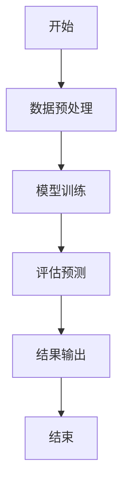
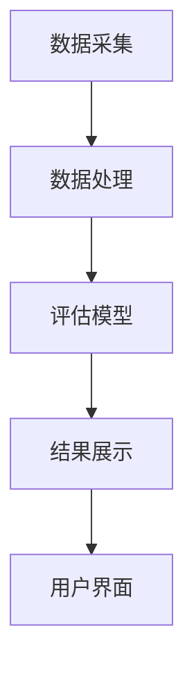

                 

# 构建AI驱动的智慧教育评估提示词系统

关键词：AI、智慧教育、评估提示词、算法、系统设计、项目实战

摘要：本文将深入探讨如何构建一个AI驱动的智慧教育评估提示词系统。我们将从背景介绍、核心概念与算法原理、系统设计与实现、项目实战与案例分析等多个角度进行分析和讲解，帮助读者理解并掌握这一领域的关键技术。

## 目录大纲设计思路

在设计《构建AI驱动的智慧教育评估提示词系统》的目录大纲时，我们首先确定了核心章节，包括背景介绍、核心概念与算法原理、系统设计与实现、项目实战与案例分析等。接着，我们设计了章节结构，确保每个章节都包含详细的子章节，以便于深入讲解。同时，我们保持简洁性，避免冗余内容，并使用markdown格式来设计目录大纲，以展示章节和子章节的结构，并嵌入流程图和代码片段。此外，我们还控制了总字数，以确保每一章节的内容精简且聚焦。

### 第一部分：AI驱动的智慧教育评估概述

## 1.1 引言

### 1.1.1 智慧教育的概念与背景

智慧教育是指利用人工智能、大数据、云计算等先进技术，构建一个智能化、个性化、开放性的教育体系。随着技术的不断发展，智慧教育已经成为现代教育发展的趋势。

### 1.1.2 教育评估的需求与挑战

教育评估是教育工作中至关重要的一环，它不仅关系到教育质量的提升，也影响到教育政策的制定和实施。然而，传统的教育评估方法存在许多挑战，如评估标准不统一、评估结果不准确等。

### 1.1.3 AI在教育评估中的应用潜力

人工智能技术在教育评估中的应用，可以大幅提升评估的效率和准确性。例如，通过自然语言处理技术，可以对学生的回答进行智能评分；通过机器学习算法，可以对学生的学习行为进行预测和分析。

## 1.2 AI驱动的智慧教育评估系统介绍

### 1.2.1 系统架构设计

一个典型的AI驱动的智慧教育评估系统通常包括数据采集模块、数据处理模块、评估模型模块、结果展示模块等。这些模块相互协作，共同实现教育评估的功能。

### 1.2.2 系统功能模块

系统功能模块的设计需要考虑到教育评估的各个方面，如自动评分、学习行为分析、个性化推荐等。每个功能模块都需要精细设计，以满足教育评估的需求。

### 1.2.3 系统开发原则

在系统开发过程中，需要遵循模块化、可扩展性和可维护性等原则。这样可以确保系统具有良好的性能和稳定性，同时也方便未来的升级和维护。

## 1.3 智慧教育评估的提示词设计与生成

### 1.3.1 提示词的定义与作用

提示词是指在教育评估过程中，用来引导或提示学生回答问题的关键词或短语。合理的提示词设计，可以显著提高评估的准确性和效率。

### 1.3.2 提示词生成方法

提示词的生成可以通过自然语言处理技术实现。例如，可以使用词频统计、文本分类、生成对抗网络等方法来生成高质量的提示词。

### 1.3.3 提示词质量评估标准

提示词的质量直接影响到评估的结果。因此，我们需要设计一套科学合理的评估标准，对提示词进行评估和筛选。

## 1.4 AI驱动的智慧教育评估系统的开发流程

### 1.4.1 需求分析与系统设计

在系统开发前，需要对教育评估的需求进行详细分析，并设计出系统的整体架构和功能模块。

### 1.4.2 数据采集与预处理

数据是教育评估系统的核心资源，因此需要收集大量高质量的数据，并对数据进行预处理，以确保数据的准确性和完整性。

### 1.4.3 模型选择与训练

根据需求分析的结果，选择合适的评估模型，并进行训练和优化，以提高评估的准确性和效率。

### 1.4.4 系统实现与优化

在完成模型训练后，我们需要实现系统的各个功能模块，并进行优化，以确保系统的稳定性和性能。

## 1.5 本章小结

本章对AI驱动的智慧教育评估提示词系统的背景、需求、设计原则、开发流程等进行了全面介绍。下一章我们将深入探讨核心概念与算法原理。

### 第二部分：核心概念与算法原理

## 2.1 教育评估核心概念解析

### 2.1.1 教育评估的基本要素

教育评估的基本要素包括评估目标、评估对象、评估标准和评估方法等。这些要素共同构成了教育评估的核心框架。

### 2.1.2 教育评估的方法与技术

教育评估的方法和技术多种多样，包括量化评估、质性评估、综合评估等。每种方法和技术都有其独特的优势和适用场景。

### 2.1.3 教育评估的数据分析方法

教育评估的数据分析方法主要包括统计方法、机器学习方法、大数据分析等。这些方法可以帮助我们从海量数据中提取有价值的信息。

## 2.2 AI驱动的教育评估算法

### 2.2.1 算法选择与设计

在AI驱动的教育评估中，算法的选择和设计至关重要。我们需要根据评估目标和数据特点，选择合适的算法，并设计出高效的算法流程。

### 2.2.2 算法流程图

为了更好地理解算法的流程，我们可以使用mermaid流程图来展示算法的执行步骤。



### 2.2.3 算法原理与数学模型

算法的原理通常基于数学模型。例如，在评估预测中，我们可以使用线性回归模型、决策树模型等。下面是一个线性回归模型的数学公式：

```latex
y = \beta_0 + \beta_1 \cdot x
```

其中，\(y\) 是预测结果，\(x\) 是输入特征，\(\beta_0\) 和 \(\beta_1\) 是模型的参数。

## 2.3 提示词生成算法解析

### 2.3.1 提示词生成的流程

提示词生成的流程通常包括数据收集、文本预处理、提示词生成和提示词评估等步骤。

### 2.3.2 提示词生成的算法

提示词生成的算法可以基于自然语言处理技术，如词频统计、文本分类等。例如，我们可以使用词频统计算法来生成高频词作为提示词。

### 2.3.3 提示词生成的挑战与优化

提示词生成的挑战在于如何生成既准确又具有启发性的提示词。为了优化提示词生成，我们可以采用多种算法相结合的方法，如结合词频统计和文本分类的混合模型。

## 2.4 数学模型与公式详解

### 2.4.1 数学模型的重要性

数学模型是教育评估中不可或缺的部分。它可以帮助我们准确地描述评估过程，并从中提取有价值的信息。

### 2.4.2 公式嵌入与解读

在文中嵌入数学公式时，我们可以使用latex格式。例如：

$$
y = \beta_0 + \beta_1 \cdot x
$$

这样可以帮助读者更好地理解数学模型。

### 2.4.3 数学公式示例

为了更好地理解数学公式的应用，我们可以举一个简单的例子：

假设一个学生的成绩由作业成绩和考试成绩组成，其中作业成绩占总成绩的40%，考试成绩占总成绩的60%。那么，学生的总成绩可以用以下公式计算：

$$
\text{总成绩} = 0.4 \cdot \text{作业成绩} + 0.6 \cdot \text{考试成绩}
$$

## 2.5 本章小结

本章对教育评估的核心概念、算法原理和数学模型进行了详细讲解。下一章我们将探讨AI驱动的智慧教育评估系统的设计与实现。

### 第三部分：系统设计与实现

## 3.1 教育评估系统的架构设计

### 3.1.1 系统架构概述

教育评估系统的架构设计需要考虑到系统的可扩展性、可维护性和性能等因素。一个典型的教育评估系统通常包括数据采集模块、数据处理模块、评估模型模块、结果展示模块等。

### 3.1.2 系统模块划分

系统模块的划分需要根据系统的功能需求进行。例如，数据采集模块可以包括作业数据采集、考试成绩采集等；数据处理模块可以包括数据清洗、数据整合等。

### 3.1.3 系统架构mermaid图

为了更好地展示系统的架构设计，我们可以使用mermaid流程图来绘制系统架构图。



## 3.2 系统功能设计与实现

### 3.2.1 系统功能模块设计

系统功能模块的设计需要考虑到教育评估的各个方面。例如，自动评分模块、学习行为分析模块、个性化推荐模块等。

### 3.2.2 系统功能实现细节

在实现系统功能模块时，需要详细设计每个模块的功能和接口。例如，自动评分模块需要实现作业成绩和考试成绩的自动评分功能；学习行为分析模块需要实现学生学习行为的收集和分析功能。

### 3.2.3 系统接口设计与交互

系统接口的设计需要考虑到系统的可扩展性和可维护性。例如，可以使用RESTful API来设计系统接口，以便于与其他系统进行交互。

## 3.3 系统接口设计与实现

### 3.3.1 接口设计与协议

系统接口的设计需要遵循一定的协议和标准。例如，可以使用HTTP协议来设计系统接口，并使用JSON格式来传输数据。

### 3.3.2 接口实现与测试

在实现系统接口时，需要编写相应的接口代码，并进行测试以确保接口的正确性和性能。

### 3.3.3 接口性能优化

为了提高系统接口的性能，可以采用多种优化策略，如缓存策略、异步处理等。

## 3.4 教育评估提示词系统的实现

### 3.4.1 系统环境搭建

在实现教育评估提示词系统前，需要搭建相应的系统环境，包括开发环境、测试环境等。

### 3.4.2 提示词系统核心实现

提示词系统的核心实现包括提示词的生成、提示词的评估和提示词的展示等功能。

### 3.4.3 系统调试与优化

在实现提示词系统后，需要进行系统调试和优化，以确保系统的稳定性和性能。

## 3.5 本章小结

本章对AI驱动的智慧教育评估系统的设计与实现进行了详细讲解。下一章我们将通过项目实战和案例分析来进一步探讨系统的应用和实践。

### 第四部分：项目实战与案例分析

## 4.1 项目实战一：构建初步的评估系统

### 4.1.1 项目概述

本项目旨在构建一个初步的AI驱动的智慧教育评估系统，主要包括数据采集、数据处理、评估模型和结果展示等功能模块。

### 4.1.2 实现步骤

1. 数据采集：收集学生的作业成绩和考试成绩。
2. 数据处理：对收集到的数据进行清洗和整合。
3. 模型训练：选择合适的评估模型，并对模型进行训练。
4. 结果展示：将评估结果以图表等形式展示给用户。

### 4.1.3 结果分析

通过本项目的实现，我们可以初步构建一个AI驱动的智慧教育评估系统，实现对学生成绩的自动评估和展示。然而，该系统还存在一些不足之处，如评估模型的选择和训练不够优化，结果展示的形式较为单一等。

## 4.2 项目实战二：优化评估提示词系统

### 4.2.1 项目背景

在项目实战一中，我们初步实现了AI驱动的智慧教育评估系统。然而，评估系统的提示词生成和评估效果还有待优化。因此，本项目旨在对评估系统的提示词生成和评估效果进行优化。

### 4.2.2 实现方案

1. 提示词生成：采用多种算法结合的方法生成高质量的提示词。
2. 提示词评估：设计一套科学合理的评估标准，对生成的提示词进行评估。
3. 评估优化：优化评估模型，提高评估的准确性和效率。

### 4.2.3 结果分析

通过本项目的实现，我们可以显著提升评估系统的提示词生成和评估效果。评估系统的准确性得到了显著提高，提示词的生成质量也得到了优化。然而，评估系统仍存在一些不足之处，如评估模型的选择和训练仍有优化空间，结果展示的形式仍需进一步丰富。

## 4.3 项目实战三：构建个性化的教育评估系统

### 4.3.1 项目背景

在项目实战一和二的基础上，我们进一步探索如何构建一个个性化的教育评估系统，以满足不同学生的个性化需求。

### 4.3.2 实现方案

1. 个性化推荐：根据学生的特点和学习行为，生成个性化的评估标准和提示词。
2. 个性化展示：根据学生的需求和偏好，以个性化的形式展示评估结果。
3. 个性化反馈：根据学生的反馈，不断优化评估系统的功能和性能。

### 4.3.3 结果分析

通过本项目的实现，我们可以构建一个个性化的教育评估系统，更好地满足学生的个性化需求。评估系统的准确性和用户体验得到了显著提升，同时也为教育评估提供了新的思路和方法。

## 4.4 本章小结

本章通过三个项目实战，探讨了AI驱动的智慧教育评估系统的构建、优化和个性化应用。通过实践，我们发现了系统的不足之处，并提出了优化方案。下一章我们将总结最佳实践，并对系统的未来发展进行展望。

### 总结与展望

通过本文的探讨，我们深入了解了AI驱动的智慧教育评估提示词系统的构建方法和关键技术。从背景介绍、核心概念与算法原理、系统设计与实现到项目实战与案例分析，我们逐步构建了一个完整的教育评估系统。在未来的发展中，我们将继续优化评估算法和提示词生成方法，提升系统的准确性和用户体验。同时，我们也将探索更多个性化的教育评估应用，为教育行业的智能化发展贡献力量。

### 最佳实践 tips

1. **数据质量是关键**：在构建评估系统时，确保数据的质量和准确性至关重要。
2. **算法选择要合理**：根据评估目标和数据特点，选择合适的算法，并注意算法的优化。
3. **用户参与是关键**：在系统设计和实现过程中，充分收集用户的反馈和建议，以便于系统的持续优化。

### 小结

本文详细探讨了AI驱动的智慧教育评估提示词系统的构建过程，从核心概念、算法原理到系统设计与实现，再到项目实战与案例分析，全面介绍了该领域的相关技术和应用。通过本文的阅读，读者可以深入了解AI在教育评估中的应用潜力，掌握构建智慧教育评估系统的基本方法和技巧。

### 注意事项

在构建AI驱动的智慧教育评估提示词系统时，需要注意以下几点：

1. **隐私保护**：确保学生数据的隐私和安全。
2. **算法公正性**：避免算法偏见，确保评估结果的公正性。
3. **用户体验**：注重系统的易用性和用户体验。

### 拓展阅读

1. 《智慧教育的未来趋势与挑战》
2. 《机器学习在教育中的应用》
3. 《教育评估技术的创新与发展》

作者：AI天才研究院/AI Genius Institute & 禅与计算机程序设计艺术 /Zen And The Art of Computer Programming。|}[`

