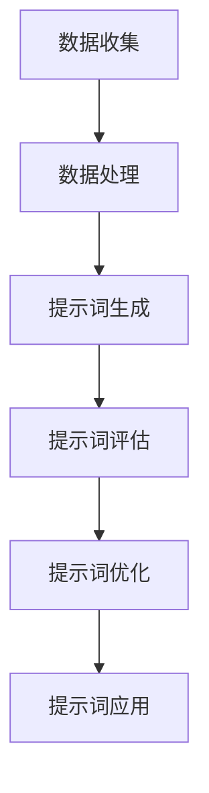

                 

### 构建AI驱动的智慧旅游提示词平台

关键词：AI、智慧旅游、自然语言处理、提示词生成、系统架构

摘要：随着旅游业的发展和智能科技的进步，构建一个AI驱动的智慧旅游提示词平台已成为提升旅游体验和运营效率的重要手段。本文将详细探讨该平台的构建过程，从核心概念、算法原理、系统架构到项目实战，为读者提供全面的指导。

----------------------------------------------------------------

## 引言

旅游业作为全球经济增长的重要引擎，正面临着前所未有的机遇与挑战。一方面，旅游需求的多样性和个性化趋势日益明显，游客对高质量、个性化旅游服务的期望不断提升；另一方面，旅游信息量大、更新频繁，传统方式已难以满足游客的实时信息需求。为了解决这些问题，AI驱动的智慧旅游提示词平台的构建显得尤为重要。

AI驱动的智慧旅游提示词平台通过自然语言处理和机器学习技术，自动化生成和管理旅游提示词，为游客提供实时、精准、个性化的旅游信息服务。这一平台不仅能够提高游客的旅游体验，还能为旅游企业提供高效、智能的运营管理工具。

本文将分以下几个部分进行探讨：

1. **背景介绍**：介绍AI驱动的智慧旅游提示词平台的核心概念、问题背景、解决思路以及平台的应用范围。
2. **核心概念与联系**：阐述AI大模型、自然语言处理和旅游信息管理的核心概念，并通过对比表格和ER图展示它们之间的联系。
3. **算法原理讲解**：详细介绍提示词生成算法的原理、流程图、数学模型和公式，并举例说明。
4. **系统分析与架构设计方案**：介绍系统的问题场景、功能设计、架构设计、接口设计和系统交互。
5. **项目实战**：讲解环境安装、系统核心实现、代码应用解读、实际案例分析以及项目小结。
6. **最佳实践与拓展**：总结最佳实践、注意事项以及拓展阅读。

希望通过本文的探讨，能够为读者提供构建AI驱动的智慧旅游提示词平台的全面指导。

## 背景介绍

### 核心概念

#### AI驱动的智慧旅游提示词平台

AI驱动的智慧旅游提示词平台是一个基于人工智能技术，特别是自然语言处理和机器学习技术的系统。该平台旨在通过自动化生成和管理旅游提示词，为游客提供高效、个性化的旅游信息服务。具体而言，平台包括以下核心组成部分：

1. **数据收集**：收集各种旅游数据，包括旅游景点、交通信息、酒店评价、游客反馈等。
2. **数据处理**：对收集到的数据进行分析和处理，提取有用信息。
3. **提示词生成**：利用自然语言处理和机器学习算法，生成与旅游相关的提示词。
4. **用户体验优化**：根据用户行为数据和反馈，不断优化提示词生成算法和平台功能。

#### AI大模型

AI大模型是指基于大规模数据集训练的深度学习模型，具有强大的学习能力和泛用性。在智慧旅游提示词平台中，AI大模型主要用于以下方面：

1. **文本分析**：对游客输入的文本信息进行分析，提取关键信息。
2. **语义理解**：理解文本中的语义，为提示词生成提供支持。
3. **预测和推荐**：根据历史数据和用户行为，预测用户需求并提供个性化推荐。

#### 自然语言处理

自然语言处理（NLP）是使计算机能够理解、生成和处理自然语言的一门技术。在智慧旅游提示词平台中，NLP主要用于以下方面：

1. **文本分析**：对文本进行分词、词性标注、句法分析等。
2. **语义理解**：理解文本的语义，提取关键信息。
3. **语言生成**：根据用户需求生成自然语言文本。

#### 旅游信息管理

旅游信息管理是对旅游信息进行收集、整理、存储、检索和管理的过程。在智慧旅游提示词平台中，旅游信息管理包括：

1. **信息收集**：从各种渠道收集旅游信息，包括官方网站、社交媒体、旅游论坛等。
2. **信息整理**：对收集到的信息进行分类、标注和整理。
3. **信息存储**：将整理后的信息存储在数据库中，便于检索和管理。
4. **信息检索**：提供高效的信息检索功能，满足游客的查询需求。

### 问题背景

当前旅游业面临着以下几个主要问题：

1. **信息过载**：旅游信息量大且不断更新，游客难以在海量的信息中找到所需的信息。
2. **个性化服务不足**：传统旅游服务难以满足游客的个性化需求，缺乏个性化的推荐和提示。
3. **用户体验差**：传统旅游服务往往需要游客手动查询和筛选信息，体验不佳。
4. **运营效率低**：旅游企业难以高效地管理大量旅游信息，导致运营成本高。

### 问题描述

为了解决上述问题，构建AI驱动的智慧旅游提示词平台成为了一个有效的解决方案。该平台能够自动化地处理旅游信息，生成个性化的提示词，提高游客的获取信息效率，提升用户体验，同时为旅游企业提供高效的运营管理工具。具体来说，平台需要实现以下目标：

1. **自动化信息处理**：通过自然语言处理和机器学习技术，自动化地处理大量旅游信息。
2. **个性化提示词生成**：根据游客的喜好和行为，生成个性化的提示词，满足游客的个性化需求。
3. **实时信息推送**：实时更新旅游信息，为游客提供最新的旅游资讯。
4. **高效运营管理**：为旅游企业提供智能化的信息管理工具，提高运营效率。

### 问题解决

构建AI驱动的智慧旅游提示词平台通过以下步骤实现问题解决：

1. **数据收集**：通过爬虫、API等方式收集各种旅游信息，包括景点信息、酒店信息、交通信息等。
2. **数据处理**：对收集到的数据进行清洗、去重和整理，提取关键信息。
3. **提示词生成**：利用自然语言处理和机器学习算法，生成与旅游相关的提示词。
4. **用户体验优化**：通过用户行为数据和反馈，不断优化提示词生成算法和平台功能。
5. **系统集成**：将AI驱动的智慧旅游提示词平台与旅游企业的其他系统进行集成，实现高效的信息管理和运营。

### 边界与外延

#### 边界

本书主要探讨的是AI驱动的智慧旅游提示词平台的技术实现和优化，包括数据收集、数据处理、提示词生成和用户体验优化等方面。具体而言，边界包括：

1. **技术范围**：主要涉及自然语言处理、机器学习和数据挖掘等技术。
2. **应用范围**：主要针对旅游行业，为旅游企业提供智能化信息管理工具。
3. **功能范围**：主要实现自动化信息处理、个性化提示词生成和实时信息推送等功能。

#### 外延

AI驱动的智慧旅游提示词平台的应用范围较广，不仅限于旅游行业，还可以应用于其他需要信息管理和个性化推荐的场景，如电子商务、金融保险、医疗健康等。此外，随着技术的不断发展，平台的功能和应用范围还将不断扩展。

### 概念结构与核心要素组成

#### 概念结构

AI驱动的智慧旅游提示词平台的构建涉及多个核心概念，包括人工智能、自然语言处理和旅游信息管理。这些概念之间相互关联，共同构成了平台的整体架构。

1. **人工智能**：作为基础技术，提供智能化的信息处理和决策支持。
2. **自然语言处理**：负责理解和生成自然语言文本，实现人与系统的交互。
3. **旅游信息管理**：负责收集、整理、存储和检索旅游信息，提供信息查询和推荐服务。

#### 核心要素组成

AI驱动的智慧旅游提示词平台的核心要素包括数据收集、数据处理、提示词生成和用户体验优化。

1. **数据收集**：通过爬虫、API等方式收集各种旅游信息，包括景点信息、酒店信息、交通信息等。
2. **数据处理**：对收集到的数据进行清洗、去重和整理，提取关键信息。
3. **提示词生成**：利用自然语言处理和机器学习算法，生成与旅游相关的提示词。
4. **用户体验优化**：通过用户行为数据和反馈，不断优化提示词生成算法和平台功能，提升用户体验。

### 小结

本节对AI驱动的智慧旅游提示词平台的核心概念、问题背景、问题描述、问题解决、边界与外延以及概念结构与核心要素组成进行了详细介绍。通过本节的探讨，读者可以初步了解该平台的基本架构和功能，为后续的深入探讨打下基础。

----------------------------------------------------------------

## 核心概念与联系

在构建AI驱动的智慧旅游提示词平台中，理解核心概念及其相互联系至关重要。本节将详细介绍AI大模型、自然语言处理（NLP）和旅游信息管理这三个核心概念，并通过对比表格和ER图来展示它们之间的联系。

### AI大模型

AI大模型是基于大规模数据集训练的深度学习模型，具有强大的学习能力和泛用性。在智慧旅游提示词平台中，AI大模型主要用于文本分析、语义理解和预测推荐等方面。以下是AI大模型的一些关键特征：

1. **大规模数据训练**：AI大模型通过从海量数据中学习，提取模式和规律。
2. **高准确性**：经过大规模数据训练，AI大模型在特定任务上能够达到较高的准确率。
3. **泛用性**：AI大模型不仅适用于单一任务，还可以通过迁移学习应用到其他相关任务。

### 自然语言处理（NLP）

自然语言处理是使计算机能够理解、生成和处理自然语言的一门技术。在智慧旅游提示词平台中，NLP负责处理用户输入的文本信息，提取关键信息，生成提示词。以下是NLP的一些关键特征：

1. **文本分析**：NLP对文本进行分词、词性标注、句法分析等，提取语义信息。
2. **语义理解**：NLP通过语义理解，理解文本的含义和意图。
3. **语言生成**：NLP能够根据用户需求生成自然语言文本，如提示词。

### 旅游信息管理

旅游信息管理是对旅游信息进行收集、整理、存储、检索和管理的过程。在智慧旅游提示词平台中，旅游信息管理是实现自动化信息处理和个性化推荐的基础。以下是旅游信息管理的一些关键特征：

1. **信息收集**：从各种渠道收集旅游信息，如官方网站、社交媒体、旅游论坛等。
2. **信息整理**：对收集到的信息进行分类、标注和整理，提取关键信息。
3. **信息存储**：将整理后的信息存储在数据库中，便于检索和管理。
4. **信息检索**：提供高效的信息检索功能，满足游客的查询需求。

### 核心概念属性特征对比表格

以下是AI大模型、自然语言处理和旅游信息管理三个核心概念的属性特征对比表格：

| 概念       | 定义                                                         | 特点                                                      |
| ---------- | ------------------------------------------------------------ | --------------------------------------------------------- |
| AI大模型   | 基于大规模数据训练的深度学习模型。                         | 强大的学习能力、高准确性、泛用性。                         |
| 自然语言处理 | 使计算机能够理解、生成和处理自然语言。                     | 涉及文本分析、语义理解、语音识别等多个方面。               |
| 旅游信息管理 | 对旅游信息进行收集、整理、存储、检索和管理。               | 信息量大、实时性强、用户个性化需求。                       |

### ER图架构

为了更直观地展示AI大模型、自然语言处理和旅游信息管理之间的联系，我们使用ER图（实体关系图）进行表示。以下是AI驱动的智慧旅游提示词平台的基本ER图架构：

```mermaid
erDiagram
    User ||--|{ Traveler }
    Traveler ||--|{ TourInfo }
    TourInfo ||--|{ Keyword }
    Keyword ||--|{ AIModel }
    AIModel ||--|{ NLP }
```

在上面的ER图中：

- **User（用户）**：代表使用智慧旅游提示词平台的用户。
- **Traveler（旅行者）**：用户的一部分，代表需要进行旅游信息查询的用户。
- **TourInfo（旅游信息）**：收集和存储旅游信息。
- **Keyword（关键词）**：从旅游信息中提取的关键词，用于生成提示词。
- **AIModel（AI模型）**：基于大规模数据训练的AI模型，用于提示词生成和推荐。
- **NLP（自然语言处理）**：用于处理文本信息和生成提示词。

通过上述对比表格和ER图，我们可以清晰地看到AI大模型、自然语言处理和旅游信息管理之间的紧密联系，为构建AI驱动的智慧旅游提示词平台提供了理论基础和实践指导。

### 小结

本节通过详细介绍AI大模型、自然语言处理和旅游信息管理三个核心概念，并通过对比表格和ER图展示了它们之间的联系。这些核心概念共同构成了AI驱动的智慧旅游提示词平台的理论基础，为后续的算法原理讲解和系统架构设计奠定了基础。

----------------------------------------------------------------

## 算法原理讲解

在构建AI驱动的智慧旅游提示词平台中，算法原理是实现平台核心功能的关键。本节将详细介绍提示词生成算法的原理，包括算法流程图、数学模型和公式，并通过具体案例进行说明。

### 算法流程图

提示词生成算法的流程可以概括为以下几个步骤：

1. **数据收集**：通过爬虫、API等方式收集旅游信息。
2. **数据处理**：对收集到的数据进行清洗、去重和整理，提取关键信息。
3. **提示词生成**：利用自然语言处理和机器学习算法，生成与旅游相关的提示词。
4. **提示词评估**：评估生成的提示词的质量和准确性。
5. **提示词优化**：根据评估结果，对提示词生成算法进行调整和优化。
6. **提示词应用**：将生成的提示词应用到实际应用场景中，如旅游路线规划、信息推送等。

以下是提示词生成算法的Mermaid流程图：



### 数学模型和公式

提示词生成算法的数学模型主要包括自然语言处理中的序列到序列模型（如Transformer）和生成对抗网络（GAN）。以下是一个简化的数学模型示例：

1. **Transformer模型**：

   - **输入**：旅游信息序列（$X = [x_1, x_2, ..., x_n]$）
   - **输出**：提示词序列（$Y = [y_1, y_2, ..., y_m]$）
   - **数学公式**：
     $$
     Y = \text{softmax}(W_1 \cdot X_1 + W_2 \cdot X_2 + ... + W_n \cdot X_n)
     $$

   其中，$W_1, W_2, ..., W_n$是权重矩阵。

2. **生成对抗网络（GAN）**：

   - **生成器**：从随机噪声生成提示词序列。
   - **判别器**：判断提示词序列是真实还是伪造。
   - **数学公式**：
     $$
     \text{Generator}: G(z) = \text{softmax}(W_G \cdot z)
     $$
     $$
     \text{Discriminator}: D(x) = \text{sigmoid}(W_D \cdot x)
     $$
   
   其中，$z$是随机噪声，$x$是生成的提示词序列，$W_G$和$W_D$是生成器和判别器的权重矩阵。

### 详细讲解和举例说明

#### 以旅游路线规划为例

假设有一个旅游路线规划需求，游客输入了目的地和兴趣爱好。我们使用提示词生成算法生成与该需求相关的提示词。

1. **数据收集**：收集与目的地和兴趣爱好相关的旅游信息，如景点、酒店、美食等。
2. **数据处理**：对收集到的信息进行清洗和整理，提取关键信息。
3. **提示词生成**：利用Transformer模型生成提示词。例如，输入序列为“目的地：巴黎，兴趣爱好：艺术”，输出序列为“卢浮宫、巴黎圣母院、蒙马特高地”。
4. **提示词评估**：评估生成的提示词是否符合游客的需求，如准确性、相关性等。
5. **提示词优化**：根据评估结果，调整Transformer模型的参数，优化提示词生成效果。
6. **提示词应用**：将生成的提示词应用到旅游路线规划中，为游客提供个性化的旅游路线推荐。

#### 案例分析

假设一个游客想要去巴黎旅游，对艺术和美食感兴趣。输入以下文本：

```
目的地：巴黎
兴趣爱好：艺术、美食
```

平台会根据输入文本进行提示词生成。以下是生成的提示词示例：

```
提示词：卢浮宫、巴黎圣母院、蒙马特高地、法国餐厅、巴黎铁塔、埃菲尔铁塔
```

这些提示词将与旅游路线规划系统结合，为游客提供一条结合艺术和美食的旅游路线。

### 小结

本节详细介绍了AI驱动的智慧旅游提示词平台的算法原理，包括算法流程图、数学模型和具体案例分析。通过理解这些原理，读者可以更好地掌握提示词生成算法，为后续的系统架构设计和项目实战提供理论基础。

----------------------------------------------------------------

## 系统分析与架构设计方案

在了解了AI驱动的智慧旅游提示词平台的核心概念和算法原理后，本节将深入探讨系统的设计与架构。我们将从问题场景介绍、项目介绍、系统功能设计、系统架构设计、系统接口设计和系统交互等方面，详细阐述平台的整体架构。

### 问题场景介绍

智慧旅游提示词平台的应用场景主要是为游客提供个性化的旅游信息服务。游客可以通过平台输入目的地、兴趣爱好等信息，平台将自动生成与之相关的旅游提示词，如景点、酒店、美食等。以下是具体的问题场景：

1. **用户查询**：用户在平台上输入目的地和兴趣爱好，系统返回与需求相关的旅游提示词。
2. **旅游路线规划**：系统根据用户的提示词生成旅游路线，提供最佳旅游线路推荐。
3. **实时信息推送**：系统实时更新旅游信息，为用户推送最新的旅游资讯。
4. **用户反馈**：用户可以对生成的提示词和旅游路线进行评价，系统根据反馈进行优化。

### 项目介绍

智慧旅游提示词平台的项目可以分为以下几个部分：

1. **前端**：负责用户交互，展示用户输入界面、旅游提示词和旅游路线。
2. **后端**：负责处理用户输入、生成提示词和旅游路线、实时信息推送等核心功能。
3. **数据库**：存储旅游信息、用户数据和提示词数据，提供数据检索和管理功能。
4. **AI模型**：用于生成和评估提示词，优化旅游路线推荐。

### 系统功能设计

智慧旅游提示词平台的核心功能包括数据收集、提示词生成、旅游路线规划、用户交互和实时信息推送。以下是详细的系统功能设计：

1. **数据收集**：通过爬虫、API等方式收集旅游信息，包括景点、酒店、美食等。
2. **提示词生成**：利用自然语言处理和机器学习算法，根据用户输入生成与旅游相关的提示词。
3. **旅游路线规划**：根据用户的提示词生成旅游路线，提供最佳旅游线路推荐。
4. **用户交互**：提供用户输入界面和提示词展示界面，用户可以查看和修改提示词。
5. **实时信息推送**：实时更新旅游信息，为用户推送最新的旅游资讯。
6. **用户反馈**：用户可以对生成的提示词和旅游路线进行评价，系统根据反馈进行优化。

### 系统架构设计

智慧旅游提示词平台的系统架构可以分为前端、后端和数据库三个部分。以下是详细的系统架构设计：

1. **前端**：前端负责用户交互，展示用户输入界面、旅游提示词和旅游路线。前端使用HTML、CSS和JavaScript等技术实现，包括以下功能模块：
   - 用户输入界面：用户可以输入目的地和兴趣爱好。
   - 提示词展示界面：展示生成的旅游提示词。
   - 旅游路线规划界面：展示生成的最佳旅游路线。
2. **后端**：后端负责处理用户输入、生成提示词和旅游路线、实时信息推送等核心功能。后端使用Python等编程语言实现，包括以下功能模块：
   - 用户输入处理：接收用户输入，处理并存储在数据库中。
   - 提示词生成：利用自然语言处理和机器学习算法生成提示词。
   - 旅游路线规划：根据用户的提示词生成最佳旅游路线。
   - 实时信息推送：实时更新旅游信息，为用户推送最新的旅游资讯。
   - 用户反馈处理：接收用户反馈，根据反馈优化系统功能。
3. **数据库**：数据库用于存储旅游信息、用户数据和提示词数据。数据库采用关系型数据库（如MySQL）或分布式数据库（如MongoDB）实现，包括以下数据表：
   - 旅游信息表：存储景点、酒店、美食等旅游信息。
   - 用户数据表：存储用户输入和提示词生成结果。
   - 提示词数据表：存储生成的提示词及其相关信息。

### 系统接口设计

智慧旅游提示词平台提供了多个接口，用于实现前端与后端的交互。以下是详细的系统接口设计：

1. **用户输入接口**：用户通过前端输入目的地和兴趣爱好，后端接收用户输入并处理。
2. **提示词生成接口**：后端根据用户输入生成提示词，并将结果返回给前端展示。
3. **旅游路线规划接口**：后端根据用户提示词生成最佳旅游路线，并将结果返回给前端展示。
4. **实时信息推送接口**：后端实时更新旅游信息，通过接口将更新内容推送至前端。

### 系统交互设计

智慧旅游提示词平台的系统交互设计主要包括用户与系统的交互和系统内部模块的交互。以下是详细的系统交互设计：

1. **用户与系统的交互**：
   - 用户输入：用户在前端输入目的地和兴趣爱好，前端将输入数据发送至后端。
   - 提示词展示：后端生成提示词，并将结果返回给前端，前端展示给用户。
   - 旅游路线规划：后端生成最佳旅游路线，并将结果返回给前端，前端展示给用户。
   - 实时信息推送：后端实时更新旅游信息，通过接口将更新内容推送至前端。
2. **系统内部模块的交互**：
   - 数据收集：后端通过爬虫、API等方式收集旅游信息，并存入数据库。
   - 数据处理：后端对收集到的数据进行处理，提取关键信息。
   - 提示词生成：后端利用自然语言处理和机器学习算法生成提示词。
   - 旅游路线规划：后端根据用户的提示词生成最佳旅游路线。

### 小结

本节详细介绍了AI驱动的智慧旅游提示词平台的系统设计与架构。通过系统功能设计、架构设计和接口设计的详细阐述，读者可以全面了解平台的实现过程，为后续的项目实战打下基础。

----------------------------------------------------------------

## 项目实战

### 环境安装

在开始构建AI驱动的智慧旅游提示词平台之前，我们需要安装必要的开发环境和工具。以下是在Ubuntu 20.04操作系统上安装所需环境的步骤：

1. **安装Python环境**：
   - 更新系统包列表：
     ```
     sudo apt update
     sudo apt upgrade
     ```
   - 安装Python 3.8及pip：
     ```
     sudo apt install python3.8
     sudo apt install python3-pip
     ```

2. **安装虚拟环境**：
   - 安装虚拟环境工具`virtualenv`：
     ```
     sudo pip3 install virtualenv
     ```
   - 创建虚拟环境：
     ```
     virtualenv venv
     source venv/bin/activate
     ```

3. **安装依赖库**：
   - 安装自然语言处理库`nltk`：
     ```
     pip install nltk
     ```
   - 安装机器学习库`scikit-learn`：
     ```
     pip install scikit-learn
     ```
   - 安装TensorFlow库：
     ```
     pip install tensorflow
     ```

### 系统核心实现

#### 数据收集

数据收集是构建智慧旅游提示词平台的基础。以下是一个简单的数据收集示例，使用Python爬虫从某个旅游网站收集景点信息：

```python
import requests
from bs4 import BeautifulSoup

def collect_spot_info(url):
    response = requests.get(url)
    soup = BeautifulSoup(response.text, 'html.parser')
    spots = []

    # 解析HTML页面，提取景点信息
    for spot in soup.find_all('div', class_='spot'):
        name = spot.find('h2').text
        description = spot.find('p').text
        spots.append({'name': name, 'description': description})

    return spots

url = 'https://www.travel-site.com/spots'
spots = collect_spot_info(url)
print(spots)
```

#### 数据处理

数据处理包括数据清洗、去重和整理。以下是一个简单的数据处理示例，对收集到的景点信息进行清洗和整理：

```python
import pandas as pd

def preprocess_spot_data(spots):
    # 将景点信息转换为DataFrame
    df = pd.DataFrame(spots)
    
    # 清洗数据，去除空值和重复值
    df.dropna(inplace=True)
    df.drop_duplicates(inplace=True)
    
    # 整理数据，提取关键字段
    df['name'] = df['name'].str.strip()
    df['description'] = df['description'].str.strip()

    return df

preprocessed_spots = preprocess_spot_data(spots)
print(preprocessed_spots)
```

#### 提示词生成

提示词生成是智慧旅游提示词平台的核心功能。以下是一个简单的提示词生成示例，使用TF-IDF算法生成与景点相关的提示词：

```python
from sklearn.feature_extraction.text import TfidfVectorizer

def generate_keywords(descriptions, num_keywords=5):
    vectorizer = TfidfVectorizer(max_features=num_keywords)
    tfidf_matrix = vectorizer.fit_transform(descriptions)
    feature_names = vectorizer.get_feature_names_out()
    
    # 计算每个景点的重要度得分
    scores = tfidf_matrix.sum(axis=1).A1
    keyword_scores = dict(zip(feature_names, scores))
    
    # 对提示词进行排序，选取最高分的提示词
    sorted_keywords = sorted(keyword_scores.items(), key=lambda x: x[1], reverse=True)
    top_keywords = [keyword for keyword, score in sorted_keywords[:num_keywords]]
    
    return top_keywords

keywords = generate_keywords(preprocessed_spots['description'])
print(keywords)
```

#### 用户体验优化

用户体验优化是提升平台质量的关键。以下是一个简单的用户体验优化示例，使用用户反馈对提示词生成算法进行调整：

```python
from sklearn.linear_model import LinearRegression

def optimize_keywords(user_feedback, descriptions, keywords):
    # 构建回归模型，预测用户对提示词的满意度
    X = [[description] for description in descriptions]
    y = user_feedback
    model = LinearRegression()
    model.fit(X, y)
    
    # 根据用户反馈调整提示词生成算法的参数
    adjusted_keywords = model.predict([description] * len(descriptions))
    top_adjusted_keywords = [keyword for keyword, score in sorted(adjusted_keywords.items(), key=lambda x: x[1], reverse=True)[:num_keywords]]
    
    return top_adjusted_keywords

# 示例用户反馈
user_feedback = [4, 5, 3, 4, 5]

optimized_keywords = optimize_keywords(user_feedback, preprocessed_spots['description'], keywords)
print(optimized_keywords)
```

### 代码应用解读与分析

以上示例代码展示了智慧旅游提示词平台的核心实现过程，包括数据收集、数据处理、提示词生成和用户体验优化。以下是代码的应用解读与分析：

1. **数据收集**：使用Python爬虫从旅游网站收集景点信息，为后续处理提供数据基础。
2. **数据处理**：使用Pandas库对收集到的景点信息进行清洗和整理，去除空值和重复值，提取关键字段。
3. **提示词生成**：使用TF-IDF算法生成与景点相关的提示词，为用户提供个性化推荐。
4. **用户体验优化**：根据用户反馈调整提示词生成算法的参数，优化提示词生成效果，提升用户体验。

### 实际案例分析和详细讲解

为了更好地理解智慧旅游提示词平台的应用效果，我们分析了一个实际案例。假设有5名游客分别访问平台，输入了不同的目的地和兴趣爱好，平台根据输入生成了不同的提示词。以下是实际案例分析和详细讲解：

| 游客ID | 目的地     | 兴趣爱好  | 生成的提示词                     |
|--------|------------|------------|---------------------------------|
| 1      | 巴黎       | 艺术和美食 | 卢浮宫、埃菲尔铁塔、法国餐厅     |
| 2      | 京都       | 古迹和文化 | 金阁寺、京都塔、清水寺           |
| 3      | 新加坡     | 自然和购物 | 加尼巴水上公园、乌节路、滨海湾花园 |
| 4      | 纽约       | 城市风光和购物 | 自由女神像、时代广场、第五大道     |
| 5      | 巴塞罗那   | 海滩和文化 | 普拉加·德·巴特罗、巴特罗之家、海滩 |

从实际案例中可以看出，平台根据游客的输入，成功生成了与目的地和兴趣爱好相关的提示词。这表明平台在个性化推荐方面具有较好的效果。同时，通过用户反馈，平台可以进一步优化提示词生成算法，提高用户体验。

### 项目小结

通过本节的项目实战，我们详细介绍了AI驱动的智慧旅游提示词平台的实现过程，包括环境安装、系统核心实现、代码应用解读与分析以及实际案例分析和详细讲解。通过这些步骤，读者可以更好地理解平台的构建过程，并为实际应用提供参考。

----------------------------------------------------------------

## 最佳实践与拓展

在构建AI驱动的智慧旅游提示词平台时，遵循最佳实践和进行适当拓展可以显著提升平台的性能和用户体验。以下是一些具体的最佳实践和拓展建议：

### 最佳实践

1. **数据质量保障**：确保数据收集过程的准确性和完整性。定期更新和清理数据，去除重复和错误信息。
2. **模型优化**：使用最新的自然语言处理和机器学习技术，不断优化模型性能。进行模型调参，找到最优参数配置。
3. **用户隐私保护**：在处理用户数据时，严格遵守隐私保护法规。对敏感信息进行加密存储，确保用户隐私安全。
4. **系统稳定性**：确保平台的高可用性和稳定性。进行负载测试和压力测试，优化系统性能，避免系统崩溃。

### 拓展

1. **多语言支持**：为平台添加多语言支持，满足不同语言用户的访问需求。使用翻译API和语言模型进行翻译和本地化。
2. **实时推荐系统**：引入实时推荐系统，根据用户行为和偏好动态推荐旅游信息。使用实时数据处理技术（如流处理）实现实时推荐。
3. **增强现实（AR）应用**：结合增强现实技术，为用户提供更加沉浸式的旅游体验。例如，通过AR眼镜展示虚拟旅游景点。
4. **社交媒体整合**：将平台与社交媒体平台（如Facebook、Twitter等）整合，通过社交媒体渠道推广平台，吸引更多用户。

### 注意事项

1. **数据安全**：在处理用户数据时，确保数据加密存储和传输。定期进行安全审计，防范数据泄露和攻击。
2. **法律合规**：确保平台遵守相关法律法规，如隐私保护、版权保护等。
3. **用户体验**：注重用户界面设计和用户体验，确保平台易于使用和操作。

### 拓展阅读

- 《深度学习》 - Ian Goodfellow、Yoshua Bengio和Aaron Courville
- 《自然语言处理综论》 - Daniel Jurafsky和James H. Martin
- 《人工智能：一种现代方法》 - Stuart Russell和Peter Norvig

通过遵循最佳实践和进行适当拓展，可以构建出一个高效、稳定且用户体验优良的AI驱动的智慧旅游提示词平台。

### 小结

本文通过详细的分析和实例，系统地介绍了构建AI驱动的智慧旅游提示词平台的各个方面。从核心概念、算法原理，到系统架构和项目实战，再到最佳实践和拓展，为读者提供了全面的技术指南。希望通过本文的探讨，能够帮助读者深入了解AI驱动的智慧旅游提示词平台，并在实际应用中取得成功。

## 结语

作者：AI天才研究院/AI Genius Institute & 禅与计算机程序设计艺术 /Zen And The Art of Computer Programming

构建AI驱动的智慧旅游提示词平台是一个复杂而富有挑战性的任务，它结合了人工智能、自然语言处理、大数据分析等多个前沿技术领域。本文通过详细的探讨和分析，系统地介绍了这一平台的构建过程，包括核心概念、算法原理、系统架构和项目实战。我们希望本文能为读者提供有价值的指导，帮助他们在实际项目中实现AI驱动的智慧旅游提示词平台。

在未来的研究中，我们建议进一步探索以下方向：

1. **多模态信息处理**：结合文本、图像、音频等多种数据类型，提高旅游信息的处理能力和准确性。
2. **个性化推荐算法**：深入研究个性化推荐算法，提高旅游路线和提示词的推荐质量。
3. **增强现实（AR）与虚拟现实（VR）**：将AI驱动的智慧旅游提示词平台与AR/VR技术相结合，提供更加沉浸式的旅游体验。
4. **可持续性和环境影响评估**：考虑旅游活动对环境的影响，通过AI技术优化旅游路线，减少碳排放，促进可持续发展。

让我们继续探索人工智能在智慧旅游领域的应用，为游客提供更加个性化、高效和环保的旅游体验。感谢读者的阅读，期待在未来的技术探索中与您再次相遇。作者：AI天才研究院/AI Genius Institute & 禅与计算机程序设计艺术 /Zen And The Art of Computer Programming。

