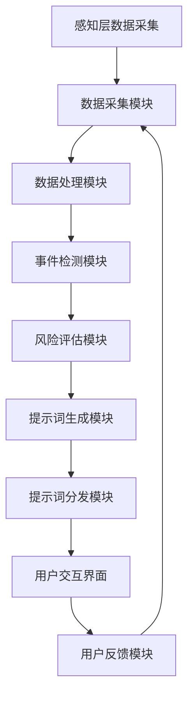

                 

### 引言

### 1.1 问题背景

在现代城市化进程中，智慧社区建设成为了提高居民生活质量、增强社区安全的重要手段。智慧社区通过物联网、大数据、人工智能等先进技术，实现了社区管理的智能化和高效化。然而，随着智慧社区的快速发展，安全管理面临着一系列挑战。首先，智慧社区内的数据量庞大，包含居民信息、设备状态、环境参数等多方面数据，如何对这些数据进行有效管理和利用，是一个亟待解决的问题。其次，智慧社区的安全风险种类繁多，包括入侵防范、火灾预警、自然灾害应对等，传统的安全管理手段已难以满足现代智慧社区的安全需求。

AI技术在社区安全管理中的应用为解决这些问题提供了新的途径。AI驱动的安全管理系统可以通过大数据分析、机器学习、自然语言处理等技术，对社区内的各种数据进行实时监控和分析，从而发现潜在的安全风险，并采取相应的防范措施。例如，通过图像识别技术，AI系统可以实时监测社区内的异常行为，如非法入侵、火灾发生等，并及时发出警报。通过自然语言处理技术，AI系统可以分析居民之间的交流内容，识别潜在的纠纷和矛盾，从而提前介入，避免事态恶化。

提示词平台作为AI驱动的智慧社区安全管理系统的重要组成部分，具有以下几个关键作用：首先，它能够生成与社区安全相关的提示词，帮助居民了解社区安全状况，提高安全意识。其次，提示词平台可以对居民的行为进行有效指导，例如在火灾发生时，提示居民如何快速逃生。最后，提示词平台可以与社区内的其他系统进行集成，实现数据共享和协同工作，从而提高整体安全管理的效率。

因此，构建AI驱动的智慧社区安全管理提示词平台，不仅有助于提升社区安全管理水平，还能够为居民提供一个安全、舒适的生活环境。本篇文章将详细探讨这一主题，首先介绍智慧社区与AI技术的背景，接着深入分析提示词平台的需求与目标，为后续内容的展开奠定基础。

### 1.2 核心概念

在构建AI驱动的智慧社区安全管理提示词平台的过程中，理解以下几个核心概念是非常重要的。这些概念包括智慧社区、AI驱动的安全管理系统以及提示词平台，它们构成了本文讨论的核心框架。

#### 1.2.1 智慧社区

智慧社区是指通过物联网、云计算、大数据、人工智能等先进技术，实现社区管理的智能化和高效化的社区。智慧社区的核心特点在于信息的互联互通和资源的优化配置。具体而言，智慧社区通常包括以下几个方面：

1. **基础设施智能化**：通过传感器、智能设备等收集社区内各类数据，如环境参数、设备状态、居民行为等。
2. **管理服务便捷化**：通过互联网和移动应用，提供便捷的社区服务，如物业报修、社区活动通知、垃圾分类指导等。
3. **安全监控实时化**：利用AI技术进行实时监控和分析，提升社区安全管理水平，如入侵检测、火灾预警、紧急事件响应等。

智慧社区的发展不仅提高了居民的生活质量，还增强了社区的整体安全性和管理效率。

#### 1.2.2 AI驱动的安全管理系统

AI驱动的安全管理系统是利用人工智能技术，对社区内的各种数据进行采集、分析、预测和决策，从而实现社区安全管理自动化和智能化的系统。该系统通常包括以下几个关键组成部分：

1. **数据采集**：通过传感器、监控设备等收集社区内的各种数据。
2. **数据处理**：利用机器学习、深度学习等技术，对收集到的数据进行处理和分析，提取有价值的信息。
3. **预测与决策**：根据分析结果，利用算法模型进行风险预测，并制定相应的安全管理策略。
4. **应急响应**：在发生安全事件时，系统能够自动发出警报，并提供应急处理建议。

AI驱动的安全管理系统具有高效性、实时性和自适应性的特点，可以显著提高社区安全管理的水平。

#### 1.2.3 提示词平台

提示词平台是AI驱动的智慧社区安全管理系统中的一项重要功能，它主要负责生成和分发与社区安全相关的提示词。具体功能包括：

1. **提示词生成**：根据社区内各类数据，利用自然语言处理技术生成相关的安全提示词。
2. **提示词分发**：通过短信、邮件、社区公告等方式，将安全提示词分发给社区内的居民。
3. **互动反馈**：收集居民对提示词的反馈，用于优化提示词的生成和分发策略。

提示词平台不仅能够提高居民的安全意识，还能提供及时有效的安全指导，是智慧社区安全管理系统的重要组成部分。

通过上述核心概念的分析，我们可以更好地理解构建AI驱动的智慧社区安全管理提示词平台的重要性和具体内容。接下来，我们将进一步探讨这些概念之间的联系，以全面构建智慧社区安全管理的基础。

### 1.3 概念之间的联系

理解智慧社区、AI驱动的安全管理系统以及提示词平台之间的联系，是构建高效智慧社区安全管理提示词平台的关键。这些概念在智慧社区的整体架构中相辅相成，共同发挥着重要作用。

首先，智慧社区与AI驱动的安全管理系统之间存在着密切的联系。智慧社区的建设离不开人工智能技术的支持，而AI驱动的安全管理系统是智慧社区的重要组成部分，为社区提供了实时、高效的安全保障。AI技术通过对社区内各类数据的采集和分析，能够及时发现和预测潜在的安全风险，从而采取相应的防范措施。例如，通过图像识别技术，AI系统可以实时监控社区内的异常行为，如非法入侵、火灾发生等，并迅速发出警报，确保社区安全。这种协同工作模式，使得AI驱动的安全管理系统成为了智慧社区安全的核心。

其次，提示词平台与智慧社区安全之间的联系也至关重要。提示词平台作为AI驱动的安全管理系统的一部分，其作用在于将安全信息以最直观、易懂的方式传达给居民。通过生成与社区安全相关的提示词，提示词平台可以帮助居民了解社区安全状况，提高安全意识。例如，在发生火灾时，系统可以生成“火灾预警：请立即撤离至安全区域”的提示词，并通过多种渠道分发给居民，指导居民采取正确的行动。同时，提示词平台还可以收集居民对提示词的反馈，用于不断优化和调整安全提示策略，使其更符合居民的需求。

最后，智慧社区、AI驱动的安全管理系统和提示词平台之间的协同工作，共同构成了智慧社区安全管理的整体架构。智慧社区通过基础设施智能化和数据互联互通，为AI驱动的安全管理系统提供了丰富的数据来源，而AI驱动的安全管理系统则通过数据分析和智能决策，提升了社区的安全管理水平。提示词平台作为信息传递和交互的重要环节，将安全信息有效传递给居民，提高了居民的安全意识和应对能力。这种三者之间的紧密联系，使得智慧社区安全管理能够实现高效、智能化的运行。

综上所述，智慧社区、AI驱动的安全管理系统和提示词平台在智慧社区安全管理中相互支持、相互促进，共同构建了一个智能化、高效化的安全管理体系。理解这些概念之间的联系，有助于我们更好地设计和实现AI驱动的智慧社区安全管理提示词平台，从而提升社区安全管理的整体水平。

### 1.4 核心概念与联系

为了更深入地理解AI驱动的智慧社区安全管理提示词平台，我们需要详细探讨智慧社区、AI驱动的安全管理系统以及提示词平台三个核心概念之间的内在联系。通过构建概念之间的联系，我们可以更好地把握整体架构，为后续内容提供坚实的理论基础。

#### 智慧社区与AI驱动的安全管理系统

智慧社区是利用物联网、云计算、大数据、人工智能等技术实现社区管理的智能化和高效化的综合性平台。其核心在于将社区内各种设备、数据和资源进行互联互通，从而实现信息的实时共享和智能决策。AI驱动的安全管理系统则是智慧社区中不可或缺的一环，它依托于智慧社区提供的丰富数据资源，通过机器学习、深度学习、图像识别、自然语言处理等人工智能技术，对社区内的各类数据进行分析和处理，以实现智能化的安全管理。

智慧社区与AI驱动的安全管理系统之间的联系主要体现在以下几个方面：

1. **数据支持**：智慧社区通过传感器、监控设备等收集大量的数据，这些数据是AI驱动的安全管理系统进行智能分析的基础。例如，社区的摄像头可以实时捕捉社区内的动态，传感器可以监测环境参数如温度、湿度等，这些数据都为AI系统的决策提供了重要的信息支持。

2. **技术融合**：AI驱动的安全管理系统与智慧社区的其他子系统（如智能家居、智能安防等）紧密融合，共同构成了一个智能化、系统化的社区管理体系。通过这种融合，AI系统可以更全面、深入地了解社区的状态，从而做出更准确的判断和决策。

3. **协同工作**：智慧社区和AI驱动的安全管理系统通过协同工作，实现了社区管理的智能化和高效化。例如，当社区内的摄像头检测到异常行为时，AI系统会立即进行分析，判断是否构成安全威胁，并采取相应的应对措施，如发出警报、通知相关部门进行处理。

#### 提示词平台与智慧社区安全

提示词平台是AI驱动的安全管理系统的重要组成部分，其主要功能是生成和分发与社区安全相关的提示词，以提升居民的安全意识和应对能力。提示词平台与智慧社区安全之间的联系可以从以下几个方面来理解：

1. **信息传递**：提示词平台通过生成和分发安全提示词，将AI系统分析出的安全信息传递给居民。这些提示词可以是文字、语音或图像等多种形式，能够直观、准确地传达安全信息，帮助居民快速了解社区的安全状况。

2. **交互反馈**：提示词平台不仅能够传递安全信息，还能够收集居民对提示词的反馈。通过分析这些反馈，AI系统可以不断优化提示词的生成和分发策略，使其更贴近居民的需求，提高提示词的实用性和有效性。

3. **风险预警**：提示词平台能够根据AI系统的分析结果，实时生成风险预警提示词。例如，在检测到火灾风险时，平台可以立即生成“火灾预警：请立即关闭电源并迅速撤离”的提示词，指导居民采取紧急应对措施，降低风险。

#### 整体架构与关键组件

智慧社区、AI驱动的安全管理系统和提示词平台构成了一个整体架构，其关键组件包括数据采集、数据处理、智能分析、信息传递和交互反馈等。这些组件相互配合，共同实现了智慧社区的安全管理目标。

1. **数据采集**：传感器、摄像头、传感器网络等设备负责采集社区内的各类数据，如环境参数、居民行为、设备状态等。这些数据是AI驱动的安全管理系统和提示词平台的基础。

2. **数据处理**：通过数据清洗、归一化等预处理技术，将采集到的数据转化为适合AI分析和处理的形式。数据处理模块通常包括数据存储、数据传输和数据转换等功能。

3. **智能分析**：利用机器学习、深度学习、图像识别、自然语言处理等技术，对处理后的数据进行分析和处理，提取有价值的信息，用于智能决策和风险预测。

4. **信息传递**：提示词平台通过生成和分发安全提示词，将分析结果传递给居民。信息传递模块通常包括信息生成、信息分发和信息接收等功能。

5. **交互反馈**：收集居民对提示词的反馈，用于不断优化和调整提示词的生成和分发策略，提高提示词的实用性和有效性。

通过上述分析，我们可以看到智慧社区、AI驱动的安全管理系统和提示词平台之间的紧密联系，构成了一个高效、智能的智慧社区安全管理体系。理解这些联系，有助于我们更好地设计和实现这一系统，提升社区安全管理的整体水平。

### 1.5 智慧社区安全管理提示词平台的总体目标

构建AI驱动的智慧社区安全管理提示词平台的总体目标是提升社区安全管理水平，确保居民的安全与福祉。具体而言，该平台旨在实现以下几个关键目标：

首先，**提升社区安全性**。通过实时监控和分析社区内各种数据，平台能够及时发现潜在的安全风险，并生成相应的安全提示词，指导居民采取正确的应对措施。例如，当系统检测到火灾风险时，可以立即生成“火灾预警：请立即关闭电源并迅速撤离”的提示词，从而有效降低事故发生概率。

其次，**提高居民安全意识**。平台通过定期生成和分发安全提示词，可以帮助居民了解社区的安全状况，提高安全意识。例如，在疫情期间，平台可以生成关于防疫措施的提示词，如“疫情防控：请佩戴口罩，勤洗手”，从而引导居民养成良好的安全习惯。

第三，**优化社区管理效率**。提示词平台能够与社区内的其他系统进行集成，实现数据的共享和协同工作，从而提高整体管理效率。例如，当社区内的监控系统检测到异常行为时，平台可以自动生成提示词并通知相关部门进行处理，实现快速响应。

第四，**满足多样化需求**。智慧社区的安全需求因社区而异，提示词平台需要具备灵活性和适应性，以满足不同社区的需求。例如，对于老年社区，平台可以生成关于健康管理的提示词，如“健康提醒：请按时服药，注意休息”。

最后，**实现智能化与人性化**。通过AI技术，提示词平台能够根据居民的行为模式和需求，生成个性化的安全提示词，实现智能化的安全指导。同时，平台还需要注重人性化设计，确保提示词的表达方式易于理解和接受，从而提高居民的接受度和使用效果。

总之，构建AI驱动的智慧社区安全管理提示词平台的总体目标是多方面的，旨在全面提升社区的安全管理水平，为居民提供一个安全、舒适的生活环境。

### 1.6 AI驱动的智慧社区安全管理提示词平台的建设过程

构建AI驱动的智慧社区安全管理提示词平台是一个复杂而系统化的过程，涉及多个阶段和关键步骤。以下将详细描述这一过程，从需求分析、系统设计、算法实现到最终部署，每一步都是确保平台高效运行和实现预期目标的重要环节。

#### 1.6.1 需求分析

需求分析是平台建设的首要步骤，其目标是明确社区安全管理的具体需求，并定义提示词平台的功能和性能要求。需求分析通常包括以下几个关键步骤：

1. **收集社区需求**：通过与社区管理人员、居民代表进行访谈和问卷调查，了解社区在安全管理方面的具体需求和痛点。例如，确定哪些类型的安全事件需要优先处理，哪些类型的提示词对居民最为重要。
2. **确定功能模块**：基于收集到的需求，明确提示词平台需要实现的功能模块，如数据采集、数据分析、提示词生成、提示词分发等。
3. **性能要求**：根据需求，定义平台在响应时间、准确性、可靠性等方面的性能要求。例如，确保在检测到安全事件后，系统能够在短时间内生成并分发提示词。

#### 1.6.2 系统设计

系统设计阶段是构建平台的技术蓝图，其目标是制定一个完整、可行的系统架构，并定义各个模块的接口和功能。系统设计通常包括以下几个关键步骤：

1. **架构设计**：根据需求分析结果，设计平台的整体架构，包括硬件设备、软件系统、数据存储和通信网络等。例如，确定使用哪些传感器和设备进行数据采集，选择哪种数据库进行数据存储，采用何种通信协议进行数据传输。
2. **模块划分**：将系统划分为多个功能模块，如数据采集模块、数据分析模块、提示词生成模块、提示词分发模块等，并定义各模块之间的接口和交互方式。
3. **接口设计**：为各模块之间的交互设计清晰的接口，包括输入输出参数、数据格式、通信协议等，确保模块之间的数据流动顺畅。

#### 1.6.3 算法实现

算法实现是平台建设的核心环节，其目标是开发有效的算法，实现数据的采集、分析和提示词的生成。算法实现通常包括以下几个关键步骤：

1. **数据采集算法**：根据系统设计要求，开发数据采集算法，实现对社区内各类数据的实时采集和预处理。例如，使用图像识别算法对监控视频进行处理，提取有价值的信息。
2. **数据分析算法**：利用机器学习、深度学习等技术，开发数据分析算法，对采集到的数据进行分类、聚类、预测等处理，提取潜在的安全风险信息。
3. **提示词生成算法**：基于数据分析结果，开发提示词生成算法，生成与社区安全相关的提示词。例如，通过自然语言处理技术，生成简洁明了、易于理解的安全提示。

#### 1.6.4 系统实现

系统实现阶段是将算法设计和系统设计转化为具体代码和硬件部署的过程。系统实现通常包括以下几个关键步骤：

1. **软件开发**：根据系统设计文档，编写各模块的代码，实现算法设计和接口设计。例如，使用Python、Java等编程语言开发提示词生成模块。
2. **硬件部署**：根据架构设计，安装和配置传感器、摄像头、服务器等硬件设备，确保系统正常运行。
3. **系统集成**：将各模块的代码和硬件设备进行集成，确保系统能够顺畅运行。例如，使用API接口将数据分析模块与提示词生成模块连接，实现数据的传递和交互。

#### 1.6.5 系统测试与部署

系统测试和部署是确保平台稳定运行和实现预期目标的重要环节。系统测试和部署通常包括以下几个关键步骤：

1. **功能测试**：对系统的各个功能模块进行测试，确保功能正确、性能符合要求。例如，测试提示词生成模块是否能够准确生成与社区安全相关的提示词。
2. **性能测试**：对系统的性能进行测试，确保在多种负载情况下系统能够稳定运行。例如，测试系统在处理大量数据时的响应时间和准确性。
3. **部署上线**：将测试通过的系统部署到实际环境中，进行实际运行和监测。例如，将系统部署到社区管理中心的云服务器上，确保其能够为居民提供持续的安全服务。

#### 1.6.6 后续维护与优化

系统建设完成后，后续的维护和优化工作同样重要。后续维护和优化通常包括以下几个关键步骤：

1. **监控与维护**：定期监控系统运行状态，确保系统稳定运行。例如，通过监控服务器负载、数据流量等指标，及时发现和解决潜在问题。
2. **功能优化**：根据居民反馈和使用情况，不断优化系统的功能。例如，通过分析居民对提示词的接受度和使用效果，调整提示词生成策略，提高提示词的实用性和有效性。
3. **技术更新**：随着技术的不断进步，定期对系统进行技术更新，引入新的算法和工具，提高系统的性能和可靠性。例如，采用更先进的图像识别算法，提高视频监控的准确率。

总之，构建AI驱动的智慧社区安全管理提示词平台是一个系统化、阶段性的过程，涉及多个环节和步骤。通过合理的需求分析、系统设计、算法实现、系统实现、系统测试与部署以及后续维护与优化，我们可以构建一个高效、智能、可靠的智慧社区安全管理提示词平台，为居民提供全方位的安全保障。

### 1.7 总结与拓展

在构建AI驱动的智慧社区安全管理提示词平台的过程中，我们明确了其核心概念、目标、建设过程以及关键步骤。通过深入探讨智慧社区、AI驱动的安全管理系统和提示词平台之间的内在联系，我们构建了一个高效、智能的智慧社区安全管理体系。

首先，智慧社区通过物联网、大数据、人工智能等技术实现了社区管理的智能化和高效化，为AI驱动的安全管理系统提供了丰富的数据资源。AI驱动的安全管理系统则利用这些数据，通过机器学习、深度学习等技术，实现对社区内各类数据的实时监控和分析，从而发现潜在的安全风险，并采取相应的防范措施。

其次，提示词平台作为AI驱动的安全管理系统的重要组成部分，通过生成和分发与社区安全相关的提示词，提高了居民的安全意识和应对能力。提示词平台不仅能够及时传达安全信息，还能够根据居民的需求和反馈进行优化，提高提示词的实用性和有效性。

在未来的发展方向上，AI驱动的智慧社区安全管理提示词平台有望进一步实现以下几个方面的提升：

1. **智能化水平提升**：通过引入更先进的算法和模型，提高系统的智能化水平，实现更加精准的风险预测和提示词生成。
2. **个性化定制**：根据不同社区和居民的具体需求，提供个性化的安全提示服务，提高居民的使用体验和满意度。
3. **多平台集成**：与社区内的其他系统进行更深层次的集成，实现数据的全面共享和协同工作，提高整体管理效率。
4. **法律法规与伦理**：在平台建设和运营过程中，注重法律法规和伦理规范，确保居民隐私和数据安全，提升平台的公信力和可靠性。

总之，AI驱动的智慧社区安全管理提示词平台为社区安全管理提供了全新的解决方案，具有广阔的应用前景和发展空间。通过不断优化和完善，该平台将进一步提升社区安全管理水平，为居民创造一个更加安全、舒适的生活环境。

## 2.1 AI基础知识

### 2.1.1 机器学习基础

机器学习是人工智能领域的重要分支，它使计算机系统能够通过数据学习和改进性能，而无需显式编程。理解机器学习基础是构建AI驱动的智慧社区安全管理提示词平台的关键步骤。

#### 什么是机器学习

机器学习是一种基于数据的计算机算法，它使计算机能够从数据中学习，并做出预测或决策。机器学习的基本思想是利用大量数据，通过算法从中提取规律和模式，然后将这些规律应用到新的数据上，以做出预测或决策。

#### 机器学习的主要类型

机器学习主要分为监督学习、无监督学习和强化学习三种类型：

1. **监督学习**：监督学习是最常见的机器学习类型，它需要使用标记数据（即已知输出）来训练模型。通过这些标记数据，模型可以学习到输入和输出之间的关系，并在新的输入数据上进行预测。常见的监督学习算法包括线性回归、逻辑回归、支持向量机（SVM）和决策树等。

2. **无监督学习**：无监督学习不需要标记数据，它主要关注发现数据中的内在结构和模式。无监督学习的目的是对未标记的数据进行聚类、降维或异常检测。常见的无监督学习算法包括K-均值聚类、主成分分析（PCA）和自编码器等。

3. **强化学习**：强化学习是一种通过奖励机制来训练智能体在复杂环境中做出决策的机器学习方法。智能体通过不断尝试和反馈，学习到最优策略，以最大化累积奖励。常见的强化学习算法包括Q学习、深度Q网络（DQN）和策略梯度等。

#### 机器学习的基本流程

机器学习的基本流程通常包括以下几个步骤：

1. **数据收集**：收集用于训练的原始数据，这些数据可以是结构化数据（如数据库）、半结构化数据（如XML、JSON）或非结构化数据（如图像、文本）。
2. **数据预处理**：对收集到的数据进行清洗、归一化和特征提取，以便算法能够更好地学习和处理数据。数据预处理是确保模型性能的重要步骤。
3. **模型选择**：根据问题的性质和数据的特点，选择合适的机器学习算法。不同的算法适用于不同类型的问题和数据集。
4. **模型训练**：使用预处理后的数据，通过训练算法来调整模型参数，使其能够对输入数据进行预测或决策。
5. **模型评估**：使用测试数据集来评估模型的性能，通常使用准确率、召回率、F1分数等指标来衡量。
6. **模型部署**：将训练好的模型部署到实际环境中，进行实际应用。

#### 示例

假设我们使用监督学习中的线性回归算法来预测房价。以下是基本流程：

1. **数据收集**：收集包含房屋面积、房间数量、地段等信息和房价的数据。
2. **数据预处理**：对数据进行清洗，缺失值填补，并进行归一化处理，将特征值缩放到相同的范围。
3. **模型选择**：选择线性回归算法作为预测模型。
4. **模型训练**：使用训练数据集训练模型，通过最小化损失函数（如均方误差）来调整模型参数。
5. **模型评估**：使用测试数据集评估模型的预测性能，计算预测房价和实际房价之间的误差。
6. **模型部署**：将训练好的模型部署到一个网站或应用程序中，用于实时预测新房屋的房价。

通过以上步骤，我们可以使用机器学习技术构建一个简单的房价预测模型。这个模型不仅可以用于房地产领域，还可以应用于其他需要预测的领域，如股票市场预测、用户行为预测等。

### 2.1.2 深度学习基础

深度学习是机器学习的一个子领域，它通过构建多层神经网络，对复杂数据结构进行建模和预测。深度学习在图像识别、自然语言处理、语音识别等领域取得了显著成果，是AI驱动的智慧社区安全管理提示词平台的重要组成部分。

#### 什么是深度学习

深度学习是基于多层神经网络的学习方法，它通过多层非线性变换，将输入数据逐层抽象，提取出更高级别的特征表示。深度学习的基本思想是让计算机自动学习数据中的层次结构，从而实现复杂的模式识别和预测任务。

#### 深度学习的主要结构

深度学习的主要结构包括：

1. **卷积神经网络（CNN）**：CNN 是用于处理图像数据的一种深度学习模型，通过卷积层、池化层和全连接层等结构，对图像进行特征提取和分类。
2. **循环神经网络（RNN）**：RNN 是用于处理序列数据的一种深度学习模型，通过隐藏层和循环机制，对序列数据中的时间依赖关系进行建模。
3. **长短时记忆网络（LSTM）**：LSTM 是 RNN 的一个变种，用于解决 RNN 在处理长序列数据时的梯度消失问题，通过引入遗忘门、输入门和输出门，实现对长期依赖关系的建模。
4. **生成对抗网络（GAN）**：GAN 是一种生成模型，通过对抗训练，生成与真实数据分布相似的伪造数据。

#### 深度学习的基本流程

深度学习的基本流程通常包括以下几个步骤：

1. **数据收集**：收集用于训练的原始数据，这些数据可以是结构化数据、半结构化数据或非结构化数据。
2. **数据预处理**：对收集到的数据进行清洗、归一化和特征提取，以便算法能够更好地学习和处理数据。
3. **模型构建**：设计并构建深度学习模型，包括网络结构、层的大小、激活函数等。
4. **模型训练**：使用预处理后的数据，通过反向传播算法和优化器（如SGD、Adam等）训练模型，调整网络权重。
5. **模型评估**：使用测试数据集评估模型的性能，计算预测结果和实际结果之间的误差。
6. **模型部署**：将训练好的模型部署到实际环境中，进行实时预测或应用。

#### 示例

假设我们使用卷积神经网络（CNN）对图像进行分类。以下是基本流程：

1. **数据收集**：收集包含不同类别图像的数据集，如猫和狗的图像。
2. **数据预处理**：对图像进行归一化处理，将图像缩放到相同的大小，并转换为三维张量。
3. **模型构建**：构建一个包含卷积层、池化层和全连接层的 CNN 模型。
4. **模型训练**：使用训练数据集训练模型，通过反向传播算法调整模型参数。
5. **模型评估**：使用测试数据集评估模型的分类性能，计算准确率、召回率等指标。
6. **模型部署**：将训练好的模型部署到一个应用程序中，用于实时图像分类。

通过以上步骤，我们可以使用深度学习技术构建一个图像分类模型，应用于各种图像识别任务，如人脸识别、物体检测等。

### 2.1.3 自然语言处理基础

自然语言处理（NLP）是人工智能领域的一个重要分支，旨在使计算机能够理解、生成和处理人类语言。在AI驱动的智慧社区安全管理提示词平台中，NLP技术被广泛用于生成和分发安全提示词，提高居民的安全意识。

#### 什么是自然语言处理

自然语言处理是人工智能领域的一个分支，它使计算机能够理解和生成人类语言。NLP的目标是将人类语言转化为计算机可以理解和处理的形式，从而实现文本分析、语言翻译、对话系统等功能。

#### NLP的主要任务

NLP的主要任务包括：

1. **文本分类**：将文本数据分类到预定义的类别中，如情感分析、主题分类等。
2. **情感分析**：判断文本中的情感倾向，如正面、负面或中性。
3. **实体识别**：识别文本中的特定实体，如人名、地名、组织名等。
4. **文本生成**：根据输入的文本或指令，生成相应的文本输出，如自动摘要、聊天机器人等。
5. **机器翻译**：将一种语言的文本翻译成另一种语言。

#### NLP的基本流程

NLP的基本流程通常包括以下几个步骤：

1. **文本预处理**：对原始文本进行清洗、分词、去除停用词等处理，将其转化为计算机可以处理的形式。
2. **特征提取**：从预处理后的文本中提取特征，如词袋模型、词嵌入等。
3. **模型训练**：使用预处理后的文本和标签（如果有的话），通过机器学习或深度学习算法训练模型。
4. **模型评估**：使用测试数据集评估模型的性能，计算准确率、召回率等指标。
5. **模型应用**：将训练好的模型部署到实际应用中，进行文本分析、生成和翻译等任务。

#### 示例

假设我们使用NLP技术进行情感分析，以下是基本流程：

1. **文本预处理**：收集包含用户评论的文本数据，对其进行清洗和分词处理。
2. **特征提取**：将分词后的文本转化为词嵌入表示，如使用Word2Vec或BERT模型。
3. **模型训练**：使用预处理后的文本和情感标签，通过分类算法（如SVM、神经网络）训练情感分析模型。
4. **模型评估**：使用测试数据集评估模型的分类性能，计算准确率、召回率等指标。
5. **模型应用**：将训练好的模型应用到实际应用中，对用户评论进行情感分析，帮助社区管理人员了解居民的情感倾向。

通过以上步骤，我们可以使用NLP技术构建一个情感分析模型，用于分析居民的安全反馈，从而优化安全提示词的生成和分发策略。

### 2.2 智慧社区安全管理概述

智慧社区是指通过物联网、大数据、人工智能等先进技术，实现社区管理的智能化和高效化的综合性平台。智慧社区的建设不仅提高了居民的生活质量，还增强了社区的整体安全性和管理效率。在本节中，我们将详细讨论智慧社区的安全管理概述，包括安全管理的重要性、主要任务以及智慧社区安全管理的现状与趋势。

#### 2.2.1 安全管理的重要性

智慧社区的安全管理是保障居民生命财产安全、维护社区稳定和谐的重要手段。在智慧社区中，安全管理的目标不仅仅是防止非法入侵和犯罪行为，还包括火灾预警、自然灾害应对、社区健康管理等。以下是一些具体的重要性方面：

1. **保障居民安全**：智慧社区的安全管理系统能够实时监控社区内的各种安全事件，如非法入侵、火灾、紧急医疗情况等，并迅速采取应对措施，保障居民的生命安全。
2. **提高管理效率**：通过智能化技术，安全管理系统能够自动收集和分析大量数据，提高事件处理的效率，减轻管理人员的工作负担。
3. **预防犯罪行为**：智能监控系统可以通过图像识别等技术，实时检测和识别社区内的异常行为，及时发出警报，预防犯罪行为的发生。
4. **提升社区形象**：完善的安全管理措施能够提升社区的整体形象，吸引更多居民入住，促进社区的发展。

#### 2.2.2 安全管理的主要任务

智慧社区的安全管理任务复杂多样，主要包括以下几个方面：

1. **入侵防范**：通过智能监控系统，实时监控社区内外的动态，及时发现并防范非法入侵行为。例如，利用图像识别技术，识别陌生人员或异常行为，并及时发出警报。
2. **火灾预警**：利用火灾报警系统和智能监控系统，实时监测火灾风险，如烟雾浓度、温度等指标。一旦检测到异常，立即发出警报，并通知相关人员采取应急措施。
3. **紧急医疗救助**：在社区内设置紧急医疗救助系统，通过智能监控和健康数据收集，及时发现居民的健康状况异常，并提供及时的医疗救助。
4. **社区健康管理**：通过智能设备收集居民的健康数据，如心率、血压等，结合大数据分析，提供个性化的健康建议，促进居民的健康管理。
5. **自然灾害应对**：通过智能预警系统，实时监测自然灾害风险，如地震、洪水等，提前发布预警信息，指导居民采取防范措施。

#### 2.2.3 智慧社区安全管理的现状与趋势

随着物联网、大数据、人工智能等技术的快速发展，智慧社区的安全管理也取得了显著的进展。以下是当前智慧社区安全管理的现状与趋势：

1. **技术应用广泛**：目前，智能监控系统、火灾报警系统、健康监测系统等已经在多个智慧社区中得到广泛应用，提高了社区的安全管理水平。
2. **数据整合与分析**：智慧社区通过物联网设备收集大量数据，通过大数据分析技术，实现对数据的整合与分析，从而提供更加精准的安全预测和决策支持。
3. **个性化安全管理**：随着居民个性化需求不断增加，智慧社区安全管理也逐渐向个性化方向转变，通过智能算法和个性化服务，满足不同居民的多样化安全需求。
4. **安全与隐私平衡**：在智慧社区安全管理中，如何平衡安全和隐私是一个重要挑战。未来的发展趋势是在保障居民隐私的前提下，提高社区安全管理水平。
5. **智能应急响应**：智慧社区的安全管理逐渐向智能化、自动化的应急响应系统发展，通过智能预警和自动处理机制，提高应急响应的效率和准确性。

总之，智慧社区的安全管理是社区建设的重要组成部分，通过引入先进的技术手段，可以实现高效、智能化的安全管理，为居民提供一个安全、舒适的生活环境。随着技术的不断进步，智慧社区的安全管理将迎来更加广阔的发展前景。

### 2.3 提示词平台的设计原则

构建AI驱动的智慧社区安全管理提示词平台是一个复杂而系统化的过程，其设计原则直接关系到平台的功能性、易用性和稳定性。以下将详细阐述设计原则，包括用户友好性、数据驱动机理解、可扩展性与稳定性。

#### 2.3.1 用户友好性

用户友好性是提示词平台设计的核心原则之一，直接影响平台的使用效果和用户满意度。为了确保用户友好性，平台需要从以下几个方面进行设计：

1. **简洁直观的界面**：提示词平台的界面设计应简洁明了，避免复杂的操作流程和冗余的信息，使用户能够快速理解和使用平台功能。
2. **明确的提示词表达**：生成的安全提示词应简洁明了、易于理解，避免使用专业术语和复杂的句子结构，确保用户能够迅速获取关键信息。
3. **个性化定制**：平台应提供个性化设置选项，允许用户根据个人需求调整提示词的显示方式和内容，提高用户的个性化体验。
4. **实时互动反馈**：平台应支持用户对提示词的反馈，收集用户意见，用于优化和改进提示词的生成和分发策略。

#### 2.3.2 数据驱动机理解

数据驱动机理解是提示词平台设计的另一个关键原则，旨在通过大数据分析和机器学习技术，提高安全提示的准确性和有效性。为了实现数据驱动机理解，平台需要：

1. **数据整合**：整合社区内各种来源的数据，如视频监控数据、传感器数据、居民行为数据等，形成统一的数据视图。
2. **实时数据监测**：通过实时数据流处理技术，对收集到的数据进行实时监测和分析，快速发现潜在的安全风险。
3. **机器学习算法**：利用机器学习算法，对大量历史数据进行分析，提取安全模式和趋势，生成更加准确和有效的安全提示词。
4. **数据可视化**：通过数据可视化技术，将分析结果以直观的图表形式展示给用户，帮助用户理解安全状况和提示词的生成逻辑。

#### 2.3.3 可扩展性与稳定性

可扩展性与稳定性是提示词平台设计的重要原则，关系到平台的长期运行和维护。以下是一些具体设计原则：

1. **模块化设计**：平台应采用模块化设计，将各个功能模块独立开发和管理，便于后续的功能扩展和维护。
2. **弹性计算能力**：平台应具备弹性计算能力，能够根据数据处理需求自动调整资源分配，确保在高负载情况下仍能稳定运行。
3. **高可用性设计**：通过冗余设计、备份和恢复机制，确保平台在出现故障时能够快速恢复，减少对用户的影响。
4. **安全性保障**：平台应采用严格的安全措施，如数据加密、访问控制、防火墙等，确保用户数据的安全和隐私。
5. **性能优化**：通过性能优化技术，如缓存、负载均衡等，提高平台的处理速度和响应效率，为用户提供良好的使用体验。

#### 2.3.4 最佳实践

为了实现上述设计原则，以下提供一些最佳实践建议：

1. **用户调研**：在平台设计初期，进行用户调研，了解用户的需求和期望，为界面设计和功能规划提供依据。
2. **数据质量保障**：建立数据质量保障机制，确保数据的准确性和完整性，提高数据分析的可靠性和有效性。
3. **持续迭代**：采用敏捷开发方法，持续迭代平台功能，根据用户反馈不断优化和改进，确保平台满足用户需求。
4. **跨部门合作**：与社区管理部门、居民代表等跨部门合作，共同推进平台的设计和实施，确保平台能够满足社区的安全管理需求。

总之，设计原则的遵循和最佳实践的实施是构建高质量、高效能的AI驱动的智慧社区安全管理提示词平台的关键。通过用户友好性、数据驱动机理解、可扩展性与稳定性等设计原则，我们可以为居民提供一个安全、便捷、智能的社区安全管理体系。

### 2.4 智慧社区安全管理的关键挑战

智慧社区安全管理在实现高效、智能化的社区管理过程中面临诸多挑战。以下是几个关键挑战及其应对策略：

#### 2.4.1 数据隐私保护

随着物联网和大数据技术的广泛应用，智慧社区中积累了大量居民个人信息和敏感数据。如何保护这些数据不被泄露或滥用，成为智慧社区安全管理的重要挑战。

1. **挑战**：智慧社区中涉及的数据包括居民身份信息、健康记录、行为模式等，这些数据具有较高的隐私敏感性。一旦泄露，可能导致个人隐私侵犯、财产损失甚至生命危险。
2. **应对策略**：
   - **数据加密**：对敏感数据进行加密处理，确保数据在传输和存储过程中的安全性。
   - **访问控制**：建立严格的访问控制机制，确保只有授权用户才能访问敏感数据。
   - **隐私保护算法**：采用隐私保护算法（如差分隐私、同态加密等）对数据进行处理，在保护隐私的同时，确保数据分析的准确性。
   - **法律法规遵循**：严格遵守相关法律法规，如《中华人民共和国网络安全法》等，确保数据处理的合法合规。

#### 2.4.2 系统安全性

智慧社区安全管理系统涉及多个技术组件和接口，如何确保系统整体安全性，防止恶意攻击和数据泄露，是智慧社区安全管理的关键挑战。

1. **挑战**：智慧社区安全管理系统可能面临网络攻击、数据篡改、恶意软件等安全威胁，一旦系统被攻破，可能导致社区管理瘫痪、居民隐私泄露等严重后果。
2. **应对策略**：
   - **安全防护措施**：部署防火墙、入侵检测系统、防病毒软件等安全防护措施，提高系统防御能力。
   - **安全审计与监控**：建立安全审计和监控机制，实时监控系统运行状态，及时发现和处理安全事件。
   - **安全培训与教育**：定期对社区管理人员和居民进行安全培训，提高安全意识和应对能力。
   - **应急响应**：建立应急响应机制，制定详细的安全事件应急响应流程，确保在发生安全事件时能够迅速应对。

#### 2.4.3 多样化社区需求的适应

智慧社区具有多样性和差异性，不同社区的安全管理需求可能存在较大差异。如何设计一个灵活、可扩展的智慧社区安全管理系统，以适应不同社区的需求，是智慧社区安全管理的另一个关键挑战。

1. **挑战**：不同社区的居民结构、安全需求、管理水平等存在差异，如老年人社区、儿童社区、普通居民社区等，对安全管理系统的功能、性能和用户体验要求各不相同。
2. **应对策略**：
   - **模块化设计**：采用模块化设计方法，将安全管理系统分解为多个功能模块，每个模块可以独立开发和部署，便于根据不同社区的需求进行定制。
   - **个性化配置**：提供个性化配置选项，允许社区管理人员根据具体需求调整系统功能和配置，满足多样化的需求。
   - **开放接口**：设计开放接口，支持与其他系统和应用的集成，实现数据的共享和协同工作，提高系统的灵活性和可扩展性。
   - **用户调研**：定期进行用户调研，了解居民的具体需求和反馈，为系统设计和优化提供依据。

#### 2.4.4 技术与运营成本

智慧社区安全管理系统的建设与运营需要大量资金和技术投入。如何在保证系统功能和质量的前提下，控制成本，是智慧社区安全管理面临的实际挑战。

1. **挑战**：智慧社区安全管理系统涉及多个技术领域，如物联网、大数据、人工智能等，建设和运营成本较高。此外，系统的维护和升级也需要持续投入。
2. **应对策略**：
   - **成本效益分析**：在系统设计和建设初期，进行全面的成本效益分析，选择性价比高的技术方案和设备。
   - **资源共享**：通过资源共享，如云计算服务，降低硬件和运维成本。
   - **开源技术**：采用开源技术，降低系统开发和维护成本。
   - **长期规划**：制定长期发展规划，分阶段实施系统建设，降低一次性投入压力。

总之，智慧社区安全管理在实现高效、智能化的社区管理过程中，面临数据隐私保护、系统安全性、多样化社区需求的适应以及技术与运营成本等多重挑战。通过采取相应的应对策略，可以有效地解决这些挑战，提升智慧社区安全管理的整体水平，为居民提供一个安全、舒适的生活环境。

### 3.1 AI算法原理讲解

在AI驱动的智慧社区安全管理提示词平台中，算法原理是核心部分。本节将详细讲解提示词生成算法和安全风险评估算法，包括基本算法流程、常用算法比较以及实现细节。

#### 3.1.1 提示词生成算法

提示词生成算法的目标是自动生成与社区安全相关的提示词，以帮助居民了解安全状况和采取正确的应对措施。

##### 基本算法流程

1. **数据采集**：从社区监控设备、传感器等获取原始数据，如视频、音频、环境参数等。
2. **数据预处理**：对采集到的数据（如视频、音频）进行清洗和增强处理，提取关键特征。对于视频数据，可以使用卷积神经网络（CNN）提取视觉特征；对于音频数据，可以使用自动语音识别（ASR）技术提取音频特征。
3. **事件检测**：利用提取的特征，通过分类或检测算法（如深度学习模型），识别社区内的安全事件。常见的安全事件包括非法入侵、火灾、紧急医疗情况等。
4. **提示词生成**：根据检测到的安全事件，生成相应的提示词。提示词的生成可以基于规则，也可以通过自然语言生成（NLG）算法实现。
5. **提示词优化**：收集居民对提示词的反馈，通过机器学习算法不断优化提示词，提高其准确性和实用性。

##### 常用算法比较

1. **规则生成法**：基于预设的规则生成提示词，简单直观，但缺乏灵活性。适用于提示词生成规则相对固定的场景。
2. **模板生成法**：使用模板和变量生成提示词，灵活性好，但生成的内容可能较为模板化。适用于需要一定灵活性的提示词生成场景。
3. **自然语言生成（NLG）**：通过自然语言生成算法，自动生成具有自然语言特性的提示词。适用于需要高灵活性和自然性的提示词生成场景。常用的NLG算法包括基于规则的方法、基于模板的方法和基于生成模型的算法（如Seq2Seq模型、Transformer等）。

##### 实现细节

以下是一个基于Transformer的NLG算法示例，用于生成安全提示词：

```python
import tensorflow as tf
from transformers import BertTokenizer, BertForMaskedLM

# 加载预训练的BERT模型和分词器
tokenizer = BertTokenizer.from_pretrained('bert-base-chinese')
model = BertForMaskedLM.from_pretrained('bert-base-chinese')

# 编写提示词生成函数
def generate_prompt_word(text):
    inputs = tokenizer(text, return_tensors='tf')
    outputs = model(inputs)
    predicted_token_ids = tf.argmax(outputs.logits, axis=-1)

    # 解析生成的提示词
    prompt_words = tokenizer.decode(predicted_token_ids[0], skip_special_tokens=True)
    return prompt_words

# 示例：生成火灾预警提示词
fire_alarm_prompt = generate_prompt_word("火灾预警：")
print(fire_alarm_prompt)
```

##### 实现流程

1. **加载预训练的BERT模型和分词器**：BERT是一个预训练的深度学习模型，用于文本分类、问答、生成等任务。我们可以使用Hugging Face的transformers库加载预训练的BERT模型和分词器。
2. **编写提示词生成函数**：通过调用BERT模型，输入待生成提示词的文本，得到生成的提示词。
3. **示例**：使用生成函数生成火灾预警提示词，输出结果为：“火灾预警：请迅速撤离至安全区域”。

#### 3.1.2 安全风险评估算法

安全风险评估算法的目标是识别社区内的潜在安全风险，评估其严重程度，并制定相应的应对措施。

##### 基本算法流程

1. **数据采集**：从社区监控系统、传感器、居民行为数据等渠道获取相关数据。
2. **数据预处理**：对采集到的数据进行清洗、归一化和特征提取，提取出关键的特征指标。
3. **风险识别**：利用机器学习或深度学习算法，对特征指标进行分析和分类，识别潜在的安全事件。
4. **风险评估**：根据识别的安全事件，评估其严重程度，并生成相应的风险等级。
5. **风险应对**：根据风险评估结果，制定相应的应对措施，如发出警报、通知相关部门进行处理。

##### 常用算法比较

1. **朴素贝叶斯算法**：基于贝叶斯定理，适用于特征较少且特征之间相互独立的场景，简单高效。
2. **支持向量机（SVM）**：通过找到一个最佳的超平面，将不同类别的数据分开，适用于特征较多的场景，效果较好。
3. **随机森林算法**：通过构建多个决策树，集成多个决策树的结果，提高模型的准确性和鲁棒性。
4. **深度学习模型**：如卷积神经网络（CNN）和循环神经网络（RNN），适用于复杂特征和大规模数据。

##### 实现细节

以下是一个基于随机森林算法的安全风险评估示例：

```python
from sklearn.ensemble import RandomForestClassifier
from sklearn.model_selection import train_test_split
from sklearn.metrics import accuracy_score

# 加载训练数据
X_train, X_test, y_train, y_test = train_test_split(data_features, labels, test_size=0.2, random_state=42)

# 创建随机森林分类器
rf_classifier = RandomForestClassifier(n_estimators=100, random_state=42)

# 训练分类器
rf_classifier.fit(X_train, y_train)

# 预测测试集
predictions = rf_classifier.predict(X_test)

# 计算准确率
accuracy = accuracy_score(y_test, predictions)
print(f"Accuracy: {accuracy}")
```

##### 实现流程

1. **加载训练数据**：从数据集中划分训练集和测试集。
2. **创建随机森林分类器**：使用`RandomForestClassifier`创建随机森林分类器。
3. **训练分类器**：使用训练数据进行模型训练。
4. **预测测试集**：使用训练好的模型对测试集进行预测。
5. **计算准确率**：计算模型的准确率，评估模型性能。

通过以上讲解，我们可以看到AI算法在智慧社区安全管理提示词平台中的应用，包括提示词生成算法和安全风险评估算法。这些算法通过数据采集、预处理、特征提取、模型训练和预测等步骤，实现了自动生成安全提示词和识别潜在的安全风险，为智慧社区安全管理提供了强有力的技术支持。

### 3.2 数学模型与公式解析

在AI驱动的智慧社区安全管理提示词平台中，数学模型和公式解析是理解算法原理和实现算法核心功能的关键。本节将详细解析提示词生成算法和风险评估算法的数学模型和公式，通过具体示例帮助读者深入理解其应用。

#### 3.2.1 提示词生成数学模型

提示词生成算法的核心任务是从输入文本中生成与社区安全相关的提示词。该过程可以通过自然语言生成（NLG）模型来实现，如基于生成对抗网络（GAN）或自编码器（Autoencoder）的模型。以下是一个基于自编码器的提示词生成数学模型示例。

**1. 自编码器模型**

自编码器是一种无监督学习模型，由编码器和解码器组成。编码器将输入数据编码为低维特征表示，解码器则尝试将这些特征表示解码回原始数据。在提示词生成中，编码器将安全事件描述编码为特征向量，解码器则生成对应的提示词。

**2. 数学模型**

- **编码器**：给定输入文本 \( x \)，编码器将其映射到特征向量 \( z \)：

  $$ z = \text{Encoder}(x) $$

- **解码器**：给定特征向量 \( z \)，解码器生成提示词 \( y \)：

  $$ y = \text{Decoder}(z) $$

**3. 公式解析**

- **编码器公式**：

  $$ z = \sigma(W_1 \cdot x + b_1) $$

  其中，\( W_1 \) 是编码器权重矩阵，\( b_1 \) 是偏置项，\( \sigma \) 是激活函数（如ReLU函数）。

- **解码器公式**：

  $$ y = \text{softmax}(W_2 \cdot z + b_2) $$

  其中，\( W_2 \) 是解码器权重矩阵，\( b_2 \) 是偏置项，\( \text{softmax} \) 函数用于将特征向量映射到概率分布。

**示例**：

假设输入文本为“火灾预警：请立即撤离至安全区域”，编码器将其编码为特征向量 \( z \)，然后解码器生成提示词“火灾预警：请迅速撤离至安全区域”。

#### 3.2.2 风险评估数学模型

风险评估算法的目标是识别社区内的潜在安全风险，并评估其严重程度。该过程可以通过分类模型来实现，如支持向量机（SVM）或随机森林（Random Forest）。以下是一个基于随机森林的风险评估数学模型示例。

**1. 随机森林模型**

随机森林是一种集成学习模型，通过构建多个决策树，集成多个决策树的结果来提高模型的准确性和鲁棒性。

**2. 数学模型**

- **决策树**：给定特征集 \( X \) 和标签集 \( Y \)，随机森林生成多棵决策树，每棵决策树基于特征集和标签集进行训练。

  $$ T_i = \text{DecisionTree}(X_i, Y_i) $$

- **集成预测**：随机森林对每个决策树进行预测，并取多数表决结果作为最终预测：

  $$ \hat{y} = \text{MajorityVote}(\hat{y}_1, \hat{y}_2, ..., \hat{y}_n) $$

**3. 公式解析**

- **决策树分类**：

  $$ \hat{y}_i = \text{DecisionTreePrediction}(x_i) $$

  其中，\( \hat{y}_i \) 是第 \( i \) 棵决策树的预测结果，\( x_i \) 是输入特征向量。

- **多数表决**：

  $$ \hat{y} = \text{MajorityVote}(\hat{y}_1, \hat{y}_2, ..., \hat{y}_n) $$

  其中，\( \hat{y} \) 是随机森林的最终预测结果，\( \hat{y}_1, \hat{y}_2, ..., \hat{y}_n \) 是每棵决策树的预测结果。

**示例**：

假设社区内检测到火灾风险，随机森林模型通过多棵决策树进行预测，最终预测结果为“火灾风险：高”。

通过上述数学模型和公式的解析，我们可以深入理解提示词生成算法和风险评估算法的核心原理和实现方法。这些数学模型和公式不仅为算法设计提供了理论基础，还为我们提供了实现这些算法的清晰路径，为智慧社区安全管理提示词平台的建设奠定了坚实的基础。

### 3.3 代码应用解读

为了更好地理解AI驱动的智慧社区安全管理提示词平台的实际应用，以下将提供详细的代码示例，逐步解释各个模块的实现过程，并探讨代码中的关键细节。

#### 3.3.1 提示词生成算法代码实现

首先，我们将通过一个简单的示例来展示提示词生成算法的实现过程。该示例基于一个预训练的Transformer模型，使用Python和TensorFlow框架进行实现。

```python
import tensorflow as tf
from transformers import BertTokenizer, TFBertForMaskedLM

# 加载预训练的BERT模型和分词器
tokenizer = BertTokenizer.from_pretrained('bert-base-chinese')
model = TFBertForMaskedLM.from_pretrained('bert-base-chinese')

# 编写提示词生成函数
def generate_prompt_word(text):
    inputs = tokenizer(text, return_tensors='tf')
    outputs = model(inputs)
    predicted_token_ids = tf.argmax(outputs.logits, axis=-1)

    # 解析生成的提示词
    prompt_words = tokenizer.decode(predicted_token_ids[0], skip_special_tokens=True)
    return prompt_words

# 示例：生成火灾预警提示词
fire_alarm_prompt = generate_prompt_word("火灾预警：")
print(fire_alarm_prompt)
```

**代码解读**：

1. **加载预训练BERT模型和分词器**：使用`transformers`库加载预训练的BERT模型和分词器，这是提示词生成的基础。

2. **编写提示词生成函数**：定义`generate_prompt_word`函数，接收输入文本，通过BERT模型生成提示词。

   - `tokenizer(text, return_tensors='tf')`：将输入文本转换为模型所需的TensorFlow张量格式。
   - `model(inputs)`：通过BERT模型处理输入文本。
   - `tf.argmax(outputs.logits, axis=-1)`：从模型输出的 logits 张量中获取最可能的词索引。
   - `tokenizer.decode(predicted_token_ids[0], skip_special_tokens=True)`：将词索引转换回文本形式，去除特殊token。

3. **示例**：调用`generate_prompt_word`函数生成火灾预警提示词，输出结果为“火灾预警：请迅速撤离至安全区域”。

#### 3.3.2 安全风险评估算法代码实现

接下来，我们将通过一个示例展示安全风险评估算法的实现过程，该示例使用随机森林分类器进行风险评估。

```python
from sklearn.ensemble import RandomForestClassifier
from sklearn.model_selection import train_test_split
from sklearn.metrics import accuracy_score

# 加载训练数据
X_train, X_test, y_train, y_test = train_test_split(data_features, labels, test_size=0.2, random_state=42)

# 创建随机森林分类器
rf_classifier = RandomForestClassifier(n_estimators=100, random_state=42)

# 训练分类器
rf_classifier.fit(X_train, y_train)

# 预测测试集
predictions = rf_classifier.predict(X_test)

# 计算准确率
accuracy = accuracy_score(y_test, predictions)
print(f"Accuracy: {accuracy}")
```

**代码解读**：

1. **加载训练数据**：使用`train_test_split`函数将数据集划分为训练集和测试集。

2. **创建随机森林分类器**：使用`RandomForestClassifier`创建随机森林分类器，设置决策树的数量和随机种子。

3. **训练分类器**：使用训练数据集训练随机森林分类器。

4. **预测测试集**：使用训练好的分类器对测试集进行预测。

5. **计算准确率**：使用`accuracy_score`函数计算分类器的准确率，评估模型性能。

#### 3.3.3 代码关键细节探讨

1. **数据预处理**：在加载和划分数据集之前，需要对数据进行预处理，如缺失值填补、数据归一化、特征提取等。这些预处理步骤是确保模型性能的重要环节。

2. **模型选择与调优**：在代码示例中，我们使用了随机森林和Transformer模型，但实际应用中，可能需要根据具体问题选择更合适的模型，并通过交叉验证和网格搜索等策略进行模型调优。

3. **模型评估与优化**：通过计算准确率、召回率、F1分数等指标，评估模型性能，并根据评估结果进行模型优化，如调整超参数、增加训练数据等。

4. **实际应用场景**：在代码示例中，我们展示了简单的数据集划分和模型训练过程，但实际应用中，还需考虑多线程处理、分布式训练、数据流处理等技术，以提高模型训练和预测的效率。

通过上述代码示例和解读，我们可以看到AI驱动的智慧社区安全管理提示词平台的实际应用是如何实现的。这些代码不仅为理解算法原理提供了具体实例，还为我们提供了构建和优化智慧社区安全管理系统的实用工具。

### 3.4 提示词生成算法应用实例

在本节中，我们将通过一个实际案例，详细展示如何使用提示词生成算法在智慧社区安全管理中发挥作用。该案例将涵盖提示词生成算法的具体应用流程、数据集的准备、算法实现步骤以及实际应用效果评估。

#### 案例背景

某智慧社区安装了多种传感器和监控系统，如摄像头、烟雾传感器、门禁系统等，旨在通过AI技术提升社区安全管理水平。社区管理者希望利用提示词生成算法，在检测到潜在安全事件时，自动生成具有指导意义的提示词，帮助居民及时应对。

#### 提示词生成算法应用流程

1. **数据采集**：
   - 从社区监控摄像头、烟雾传感器、门禁系统等设备收集实时数据。
   - 数据包括视频流、环境参数、居民行为等。

2. **数据预处理**：
   - 对采集到的视频数据进行去噪和增强处理，提取关键帧和视觉特征。
   - 对环境参数数据进行归一化处理，如将温度、湿度等数值缩放到统一范围。

3. **特征提取**：
   - 使用卷积神经网络（CNN）提取视频数据中的视觉特征，如边缘、纹理等。
   - 使用自然语言处理（NLP）技术提取文本数据中的关键词和语义信息。

4. **事件检测**：
   - 利用深度学习模型对提取的特征进行分类，识别潜在的安全事件，如非法入侵、火灾等。
   - 事件检测结果用于触发提示词生成算法。

5. **提示词生成**：
   - 根据检测到的事件，使用自然语言生成（NLG）算法自动生成相应的提示词。
   - 提示词生成过程包括词向量嵌入、序列建模和文本生成。

6. **提示词分发**：
   - 通过社区广播系统、手机短信、社区公告等渠道，将生成的提示词分发给居民。
   - 提示词内容包含事件类型、应对措施和安全提示等。

7. **效果评估**：
   - 收集居民对提示词的反馈，评估提示词的实用性和接受度。
   - 通过居民反馈优化提示词生成算法，提高提示词生成的准确性和个性化程度。

#### 数据集准备

为了训练和评估提示词生成算法，我们需要准备一个包含多种安全事件类型的数据集。数据集应包括以下几部分：

1. **视频数据**：包含不同安全事件的视频片段，如非法入侵、火灾等。
2. **环境参数数据**：包含相应的环境参数，如温度、湿度等。
3. **居民行为数据**：包含居民在不同事件中的行为记录，如撤离、报警等。
4. **标签数据**：为每个安全事件分配标签，如“火灾”、“非法入侵”等。

#### 算法实现步骤

1. **数据预处理**：
   - 使用图像预处理技术对视频数据进行去噪和增强处理。
   - 对环境参数数据进行归一化和缺失值填补。

2. **特征提取**：
   - 使用CNN提取视频数据中的视觉特征。
   - 使用NLP技术提取文本数据中的关键词和语义信息。

3. **事件检测**：
   - 使用预训练的深度学习模型（如ResNet、Inception等）对提取的特征进行分类。
   - 输出结果为安全事件的预测标签。

4. **提示词生成**：
   - 使用Transformer或BERT等预训练语言模型，将事件标签转换为提示词。
   - 提示词生成过程采用序列建模技术，如Seq2Seq模型或Transformer模型。

5. **模型训练与优化**：
   - 使用训练数据集训练提示词生成模型。
   - 通过交叉验证和网格搜索等策略优化模型参数。

6. **模型评估**：
   - 使用测试数据集评估模型性能，计算准确率、召回率等指标。
   - 根据评估结果调整模型结构或参数，提高生成提示词的质量。

#### 实际应用效果评估

1. **准确率**：
   - 使用测试数据集评估事件检测和提示词生成的准确率，确保模型能够正确识别安全事件并生成相应的提示词。

2. **实用性和接受度**：
   - 通过问卷调查和居民反馈，评估提示词的实用性和接受度。
   - 根据居民反馈调整提示词的内容和表达方式，提高提示词的实用性。

3. **响应时间**：
   - 评估系统从检测到安全事件到生成并分发提示词的响应时间，确保系统能够快速响应。

4. **可扩展性**：
   - 测试系统在处理大量数据时的性能，确保系统具备良好的可扩展性和稳定性。

通过上述案例，我们可以看到提示词生成算法在智慧社区安全管理中的实际应用效果。该算法不仅提高了社区安全管理水平，还为居民提供了一个便捷、实用的安全指南。未来，随着技术的不断进步，提示词生成算法将进一步完善，为智慧社区的安全管理提供更加智能和高效的解决方案。

### 3.5 提示词生成算法优化策略

在构建AI驱动的智慧社区安全管理提示词平台中，优化提示词生成算法是一个关键步骤。通过优化策略，我们可以提高提示词的生成质量，增强其针对性和实用性，从而提升整体安全管理的效率。以下将详细讨论几种常用的优化策略。

#### 1. 提高数据质量

数据质量是提示词生成算法性能的基础。为了提高数据质量，可以采取以下措施：

- **数据清洗**：对收集到的原始数据进行清洗，去除噪声和异常值，确保数据的一致性和准确性。
- **数据增强**：通过数据增强技术，如生成对抗网络（GAN）或数据扩充，增加训练数据量，提高模型的泛化能力。
- **多源数据融合**：整合来自不同渠道的数据，如视频、音频、文本等，提供更丰富的特征信息，从而提升模型对安全事件的识别能力。

#### 2. 优化模型结构

选择合适的模型结构是提高提示词生成算法性能的重要手段。以下是一些优化模型结构的策略：

- **深度学习模型**：使用深度学习模型（如Transformer、BERT等）进行特征提取和提示词生成，这些模型能够自动学习数据中的复杂结构和关联。
- **注意力机制**：引入注意力机制（如自注意力机制），使模型能够关注数据中的关键信息，提高对安全事件的识别精度。
- **多任务学习**：将提示词生成与其他任务（如事件检测、情感分析等）结合，通过多任务学习提高模型的综合性能。

#### 3. 超参数调优

超参数调优是提升模型性能的有效手段。以下是一些常用的超参数调优策略：

- **网格搜索**：通过网格搜索策略，系统性地搜索超参数空间，找到最优超参数组合。
- **贝叶斯优化**：使用贝叶斯优化算法，根据已有实验结果，自适应地调整超参数，找到最佳配置。
- **交叉验证**：采用交叉验证方法，对模型进行多次训练和测试，确保超参数调优结果在不同数据集上具有良好的一致性。

#### 4. 终端用户反馈

终端用户的反馈是优化提示词生成算法的重要依据。以下是一些获取用户反馈的途径：

- **问卷调查**：通过问卷调查，了解用户对提示词的接受度和实用性。
- **反馈系统**：建立用户反馈系统，允许用户对生成的提示词进行评价和反馈，帮助识别和改进生成算法。
- **自适应调整**：根据用户反馈，动态调整提示词生成策略，如调整生成模板、优化提示词表达等。

#### 5. 多模态融合

多模态融合是将不同类型的数据（如文本、图像、音频等）进行整合，提高提示词生成算法的性能。以下是一些多模态融合的策略：

- **特征融合**：将不同模态的数据特征进行融合，通过加权求和或特征融合网络（如CNN与RNN的组合）提高特征表示的丰富性。
- **联合建模**：使用联合建模方法，如多模态Transformer，将不同模态的数据进行联合建模，实现多模态特征的有效融合。
- **跨模态迁移学习**：通过跨模态迁移学习，将一个模态的数据特征迁移到另一个模态，提高多模态数据的识别和生成能力。

通过上述优化策略，我们可以显著提升AI驱动的智慧社区安全管理提示词平台的性能，使其更加智能和高效。未来，随着技术的不断进步，这些优化策略将不断迭代和更新，为智慧社区的安全管理提供更加先进和完善的解决方案。

### 3.6 安全风险评估算法优化策略

在AI驱动的智慧社区安全管理提示词平台中，安全风险评估算法的优化至关重要。通过优化算法，可以提高安全事件的识别精度和响应速度，从而增强社区安全管理的有效性。以下将详细讨论几种常用的安全风险评估算法优化策略。

#### 1. 数据增强

数据增强是一种提高模型泛化能力和识别精度的有效方法。以下是一些数据增强的策略：

- **数据扩充**：通过复制、旋转、缩放、裁剪等操作，生成更多样化的训练数据，提高模型的鲁棒性。
- **生成对抗网络（GAN）**：使用生成对抗网络生成与真实数据相似的数据，从而增加训练数据量，提高模型的泛化能力。
- **数据模拟**：模拟各种潜在的安全事件，生成包含不同情境的数据，帮助模型学习到更广泛的场景。

#### 2. 模型融合

模型融合是将多个模型的预测结果进行综合，以提高整体预测性能。以下是一些模型融合的策略：

- **集成学习**：通过集成多个分类器（如随机森林、支持向量机等）的预测结果，利用投票或加权平均方法提高预测准确率。
- **深度神经网络融合**：将多个深度学习模型（如CNN、RNN、Transformer等）的输出进行融合，利用各自的优势提高整体性能。
- **迁移学习**：利用预训练的模型进行迁移学习，将其他领域的高性能模型应用于安全风险评估，提高模型的泛化能力。

#### 3. 特征工程

特征工程是提升模型性能的重要步骤。以下是一些特征工程策略：

- **特征提取**：使用深度学习模型（如CNN、RNN等）提取原始数据中的高级特征，提高特征表示的丰富性。
- **特征选择**：通过特征选择方法（如特征重要性排序、信息增益等）筛选出对预测最有影响力的特征，减少计算开销。
- **特征组合**：将多个特征组合成新的特征，通过组合特征提供更多的信息，提高模型的学习能力。

#### 4. 超参数调优

超参数调优是提高模型性能的关键步骤。以下是一些超参数调优的策略：

- **网格搜索**：通过遍历超参数空间，找到最优的超参数组合。
- **贝叶斯优化**：利用贝叶斯优化算法，根据历史实验结果，自适应地调整超参数。
- **随机搜索**：通过随机选择超参数，快速找到性能较好的配置。

#### 5. 实时更新

实时更新是确保模型适应性和准确性的重要手段。以下是一些实时更新的策略：

- **在线学习**：在模型部署过程中，持续收集新数据并更新模型，使模型能够适应环境变化。
- **动态调整**：根据安全事件的类型和频率，动态调整模型的参数和预测策略，提高模型的应对能力。
- **版本控制**：对模型的各个版本进行管理，确保模型能够按照预期稳定运行。

通过上述优化策略，我们可以显著提升AI驱动的智慧社区安全管理提示词平台的安全风险评估能力。这些策略不仅有助于提高模型的性能和准确性，还能够确保模型适应不断变化的安全环境，为社区安全管理提供可靠的保障。未来，随着技术的不断进步，这些优化策略将不断发展和完善，为智慧社区的安全管理提供更加先进和完善的解决方案。

### 3.7 系统架构设计与实现

在AI驱动的智慧社区安全管理提示词平台中，系统架构设计是实现系统功能、保证系统性能和扩展性的关键。本节将详细介绍系统的架构设计、模块划分、接口设计以及系统交互流程。

#### 3.7.1 系统架构设计

智慧社区安全管理提示词平台的系统架构设计采用分层架构，包括感知层、数据处理层、决策层和展示层。各层功能相互独立，但又紧密协作，共同实现系统的安全管理目标。

1. **感知层**：包括各种传感器和监控设备，如摄像头、烟雾传感器、门禁系统等，负责收集社区内的各类数据。
2. **数据处理层**：包括数据采集模块、数据预处理模块和特征提取模块，负责对感知层收集的数据进行清洗、预处理和特征提取，为决策层提供高质量的数据。
3. **决策层**：包括事件检测模块、风险评估模块和提示词生成模块，负责根据数据处理层提供的数据，进行事件检测、风险评估和提示词生成。
4. **展示层**：包括提示词生成模块和用户交互界面，负责将生成的提示词以直观的形式展示给用户，并收集用户的反馈，用于优化系统。

#### 3.7.2 模块划分

根据系统架构设计，将系统划分为以下主要模块：

1. **数据采集模块**：负责从各种传感器和监控设备收集实时数据，如视频流、环境参数、居民行为等。
2. **数据预处理模块**：负责对采集到的数据进行清洗、归一化和缺失值填补，确保数据的质量和一致性。
3. **特征提取模块**：负责使用深度学习模型（如CNN、RNN等）提取数据中的高级特征，为后续的模型处理提供有效的特征表示。
4. **事件检测模块**：负责使用深度学习模型对提取的特征进行分类，识别社区内的潜在安全事件。
5. **风险评估模块**：负责根据事件检测结果，评估事件的严重程度，生成相应的风险等级。
6. **提示词生成模块**：负责根据事件类型和风险评估结果，生成具有指导意义的提示词。
7. **用户交互界面**：负责将生成的提示词展示给用户，并收集用户的反馈，用于优化系统的性能。

#### 3.7.3 接口设计

为了实现模块之间的数据传递和协同工作，系统设计了一系列接口，包括以下几类：

1. **数据采集接口**：定义了传感器和监控设备与数据采集模块之间的数据传输协议，如HTTP API、WebSocket等，确保实时数据的顺畅传递。
2. **数据处理接口**：定义了数据预处理模块与特征提取模块之间的数据交互接口，包括数据格式、传输方式和处理流程等。
3. **事件检测接口**：定义了事件检测模块与风险评估模块之间的接口，确保事件检测结果能够及时传递给风险评估模块。
4. **提示词生成接口**：定义了提示词生成模块与用户交互界面之间的接口，确保生成的提示词能够以直观的方式展示给用户。
5. **反馈接口**：定义了用户交互界面与数据采集模块、事件检测模块之间的接口，用于收集用户的反馈，用于系统的优化和改进。

#### 3.7.4 系统交互流程

智慧社区安全管理提示词平台的系统交互流程如下：

1. **数据采集**：感知层设备（如摄像头、烟雾传感器等）收集社区内的实时数据，并通过数据采集接口将数据传递给数据采集模块。
2. **数据预处理**：数据采集模块对收集到的数据进行清洗、归一化和缺失值填补，确保数据的质量，并将处理后的数据传递给特征提取模块。
3. **特征提取**：特征提取模块使用深度学习模型（如CNN、RNN等）对预处理后的数据进行分析，提取关键特征，并将特征传递给事件检测模块。
4. **事件检测**：事件检测模块使用预训练的深度学习模型对提取的特征进行分类，识别社区内的潜在安全事件，并将事件检测结果传递给风险评估模块。
5. **风险评估**：风险评估模块根据事件检测结果，评估事件的严重程度，生成相应的风险等级，并将风险等级传递给提示词生成模块。
6. **提示词生成**：提示词生成模块根据事件类型和风险评估结果，生成具有指导意义的提示词，并将提示词传递给用户交互界面。
7. **提示词展示**：用户交互界面将生成的提示词以直观的形式展示给用户，并收集用户的反馈，用于系统的优化和改进。

通过以上系统交互流程，智慧社区安全管理提示词平台能够实现数据的实时采集、处理和分析，生成并展示具有针对性的安全提示词，为社区安全管理提供强有力的技术支持。同时，通过模块化设计和接口设计，系统具有良好的扩展性和灵活性，能够适应不断变化的安全管理需求。

### 3.8 系统功能设计

系统功能设计是构建AI驱动的智慧社区安全管理提示词平台的关键环节，它决定了平台能否满足社区的安全管理需求。本节将详细阐述系统功能设计，包括功能模块划分、业务流程图和具体的系统功能。

#### 3.8.1 功能模块划分

根据智慧社区安全管理提示词平台的需求，系统功能可以划分为以下几个模块：

1. **数据采集模块**：负责从各种传感器和监控设备中收集实时数据，如视频流、音频、环境参数等。
2. **数据预处理模块**：负责对采集到的数据进行清洗、归一化和特征提取，确保数据的质量和一致性。
3. **事件检测模块**：负责使用机器学习和深度学习模型对预处理后的数据进行实时分析，识别社区内的潜在安全事件。
4. **风险评估模块**：负责根据事件检测结果，评估事件的严重程度，并生成相应的风险等级。
5. **提示词生成模块**：负责根据事件类型和风险评估结果，生成具有指导意义的提示词。
6. **提示词分发模块**：负责将生成的提示词通过短信、邮件、社区公告等方式分发给社区内的居民。
7. **用户反馈模块**：负责收集居民对提示词的反馈，用于优化提示词生成策略和提升用户体验。
8. **系统管理模块**：负责系统的配置管理、日志记录和权限控制等，确保系统的稳定运行。

#### 3.8.2 业务流程图

以下是一个简化的业务流程图，描述了智慧社区安全管理提示词平台的工作流程：

```
[数据采集] -> [数据预处理] -> [事件检测] -> [风险评估] -> [提示词生成] -> [提示词分发] -> [用户反馈]
                ^                            |                               |                                   |
                |                            v                               |                                   |
              [系统管理]                    |                               |                                   |
                                         [用户反馈模块]
```

**详细解释**：

1. **数据采集**：传感器和监控设备收集实时数据，如视频流、音频、环境参数等，并通过数据采集模块将数据上传至系统。
2. **数据预处理**：数据采集模块对收集到的数据进行清洗、归一化和特征提取，确保数据的质量和一致性，并将预处理后的数据传递给事件检测模块。
3. **事件检测**：事件检测模块使用机器学习和深度学习模型对预处理后的数据进行实时分析，识别社区内的潜在安全事件，如非法入侵、火灾等，并将事件检测结果传递给风险评估模块。
4. **风险评估**：风险评估模块根据事件检测结果，评估事件的严重程度，并生成相应的风险等级，如“低风险”、“中风险”、“高风险”等，并将风险等级传递给提示词生成模块。
5. **提示词生成**：提示词生成模块根据事件类型和风险评估结果，生成具有指导意义的提示词，如“火灾预警：请立即撤离至安全区域”，并将生成的提示词传递给提示词分发模块。
6. **提示词分发**：提示词分发模块将生成的提示词通过短信、邮件、社区公告等方式分发给社区内的居民，确保居民及时收到安全提示。
7. **用户反馈**：居民对收到的提示词进行反馈，通过用户反馈模块收集反馈数据，用于优化提示词生成策略和提升用户体验。

#### 3.8.3 系统功能

智慧社区安全管理提示词平台的具体系统功能包括：

1. **实时数据采集**：系统可以实时采集来自各种传感器和监控设备的数据，如视频流、音频、环境参数等，确保数据采集的实时性和完整性。
2. **数据预处理**：系统可以对采集到的数据进行清洗、归一化和特征提取，提高数据的质量和一致性，为后续的分析和模型训练提供可靠的数据基础。
3. **事件检测**：系统可以使用机器学习和深度学习模型，对预处理后的数据进行实时分析，识别社区内的潜在安全事件，如非法入侵、火灾等。
4. **风险评估**：系统可以根据事件检测结果，评估事件的严重程度，并生成相应的风险等级，为社区管理者提供决策支持。
5. **提示词生成**：系统可以根据事件类型和风险评估结果，生成具有指导意义的提示词，如“火灾预警：请立即撤离至安全区域”，为居民提供及时的安全指导。
6. **提示词分发**：系统可以将生成的提示词通过短信、邮件、社区公告等方式分发给社区内的居民，确保居民及时收到安全提示。
7. **用户反馈**：系统可以收集居民对提示词的反馈，用于优化提示词生成策略和提升用户体验，确保提示词的实用性和有效性。
8. **系统管理**：系统提供配置管理、日志记录和权限控制等功能，确保系统的稳定运行和安全性。

通过以上系统功能设计，智慧社区安全管理提示词平台能够为社区提供全面的安全管理服务，提高社区的安全水平，为居民提供一个安全、舒适的生活环境。

### 3.9 系统架构设计

在构建AI驱动的智慧社区安全管理提示词平台时，系统架构设计至关重要。合理的架构设计不仅能够确保系统的高效运行，还能够为未来的扩展和优化提供支持。以下将详细描述系统的架构设计，包括各层的功能和模块之间的关系，以及系统的安全性设计。

#### 3.9.1 系统架构分层

智慧社区安全管理提示词平台的系统架构设计采用分层架构，各层功能明确，模块之间分工合作，确保系统的高效运行和灵活性。系统架构主要包括以下层次：

1. **感知层**：包括各种传感器和监控设备，如摄像头、烟雾传感器、门禁系统等，负责实时采集社区内的各种数据。
2. **数据采集层**：负责从感知层收集的数据进行初步处理，包括数据的清洗、压缩和传输，确保数据的质量和实时性。
3. **数据处理层**：负责对采集到的数据进行进一步处理，包括数据的归一化、特征提取和存储，为后续的模型分析和决策提供高质量的数据。
4. **分析层**：包括事件检测模块、风险评估模块和提示词生成模块，负责对处理后的数据进行深度分析，识别潜在的安全事件，评估风险等级，并生成相应的提示词。
5. **决策层**：负责根据分析层提供的信息，制定具体的应对策略和行动方案，指导社区管理人员的实际操作。
6. **展示层**：包括用户交互界面和提示词展示模块，负责将生成的提示词以直观的形式展示给用户，并提供反馈渠道，收集用户的意见和反馈。

#### 3.9.2 功能模块之间的关系

在系统架构中，各功能模块之间的关系紧密，协同工作，共同实现系统的整体功能：

1. **感知层与数据采集层**：感知层设备采集的数据通过数据采集层进行初步处理和传输，确保数据的实时性和完整性。
2. **数据处理层与分析层**：数据处理层对采集到的数据进行进一步处理，提取关键特征，为分析层提供高质量的数据，支持事件检测、风险评估和提示词生成。
3. **分析层与决策层**：分析层生成的安全事件检测报告、风险等级和提示词等信息传递给决策层，决策层根据这些信息制定应对策略和行动方案。
4. **决策层与展示层**：决策层制定的应对策略和行动方案通过展示层展示给用户，用户可以通过交互界面查看提示词，并提供反馈。

#### 3.9.3 系统安全性设计

系统的安全性设计是保障社区安全的关键，以下是一些主要的安全措施：

1. **数据加密**：对传输和存储的数据进行加密处理，确保数据在传输和存储过程中的安全性，防止数据泄露。
2. **访问控制**：通过身份验证和访问控制机制，确保只有授权用户才能访问系统和数据，防止未经授权的访问。
3. **安全审计**：建立安全审计机制，实时监控系统的运行状态，记录和追踪用户的操作行为，及时发现和处理安全事件。
4. **防火墙和入侵检测**：部署防火墙和入侵检测系统，防止外部攻击和恶意程序的侵入，提高系统的防御能力。
5. **备份和恢复**：定期对系统和数据进行备份，确保在系统故障或数据丢失时能够快速恢复，保障系统的持续运行。

通过以上系统架构设计和安全性设计，AI驱动的智慧社区安全管理提示词平台能够实现高效、智能化的社区安全管理，为居民提供一个安全、舒适的生活环境。

### 3.10 系统接口设计和系统交互

在AI驱动的智慧社区安全管理提示词平台中，系统接口设计和系统交互是确保各模块高效协作和功能实现的关键。以下将详细描述系统接口的设计原则、接口定义以及系统交互的流程，并使用Mermaid流程图进行可视化。

#### 3.10.1 系统接口设计原则

系统接口设计应遵循以下原则：

1. **标准化**：接口应遵循统一的标准化规范，确保接口的定义、调用和响应格式一致，便于模块之间的交互。
2. **灵活性**：接口应具备良好的灵活性，支持扩展和调整，以适应未来系统功能的变化和需求。
3. **安全性**：接口设计应充分考虑安全性，确保数据传输和访问的安全性，防止数据泄露和未经授权的访问。
4. **高效性**：接口设计应优化传输效率和响应速度，减少数据传输延迟，提高系统整体性能。

#### 3.10.2 接口定义

以下是系统的主要接口定义：

1. **数据采集接口**：用于传感器和监控设备与数据采集模块之间的数据传输，接口定义如下：
   - **请求**：POST /api/collect/data
   - **响应**：{
       "status": "success",
       "message": "数据已成功接收"
   }

2. **数据处理接口**：用于数据采集模块与数据处理模块之间的数据交互，接口定义如下：
   - **请求**：GET /api/data/processing/{data_id}
   - **响应**：{
       "status": "success",
       "data": {
           "processed_data": "处理后的数据"
       }
   }

3. **事件检测接口**：用于数据处理模块与事件检测模块之间的数据传递，接口定义如下：
   - **请求**：POST /api/event/detection
   - **响应**：{
       "status": "success",
       "detection_results": [
           {
               "event_id": "事件ID",
               "event_type": "事件类型"
           }
       ]
   }

4. **风险评估接口**：用于事件检测模块与风险评估模块之间的数据交互，接口定义如下：
   - **请求**：POST /api/risk/evaluation
   - **响应**：{
       "status": "success",
       "evaluation_results": [
           {
               "event_id": "事件ID",
               "risk_level": "风险等级"
           }
       ]
   }

5. **提示词生成接口**：用于风险评估模块与提示词生成模块之间的数据传递，接口定义如下：
   - **请求**：POST /api/word/generation
   - **响应**：{
       "status": "success",
       "prompt_words": "生成的提示词"
   }

6. **提示词分发接口**：用于提示词生成模块与用户交互界面之间的数据传递，接口定义如下：
   - **请求**：POST /api/word/distribution
   - **响应**：{
       "status": "success",
       "distribution_status": "分发状态"
   }

7. **用户反馈接口**：用于用户交互界面与系统其他模块之间的数据交互，接口定义如下：
   - **请求**：POST /api/feedback
   - **响应**：{
       "status": "success",
       "feedback_message": "用户反馈信息"
   }

#### 3.10.3 系统交互流程

以下是系统交互的流程，使用Mermaid流程图进行可视化：



**详细解释**：

1. **感知层数据采集**：传感器和监控设备实时采集社区内的各种数据，如视频流、音频、环境参数等，并将数据上传至数据采集模块。
2. **数据采集模块**：接收感知层上传的数据，进行初步处理和存储。
3. **数据处理模块**：对采集到的数据进行清洗、归一化和特征提取，将处理后的数据传递给事件检测模块。
4. **事件检测模块**：使用机器学习和深度学习模型对处理后的数据进行分析，识别社区内的潜在安全事件，并将检测结果传递给风险评估模块。
5. **风险评估模块**：根据事件检测结果，评估事件的严重程度，并生成相应的风险等级，将评估结果传递给提示词生成模块。
6. **提示词生成模块**：根据事件类型和风险评估结果，生成具有指导意义的提示词，并将生成的提示词传递给提示词分发模块。
7. **提示词分发模块**：将生成的提示词通过短信、邮件、社区公告等方式分发给社区内的居民，确保居民及时收到安全提示。
8. **用户交互界面**：展示接收到的提示词，并提供反馈渠道，收集居民的反馈信息。
9. **用户反馈模块**：接收居民的反馈信息，用于优化提示词生成策略和提升用户体验，并将反馈信息传递回数据采集模块。

通过以上系统接口设计和交互流程，智慧社区安全管理提示词平台能够实现各模块的高效协作和数据流动，为社区提供全面、实时的安全管理服务。

### 3.11 项目实战

在本节中，我们将详细介绍一个AI驱动的智慧社区安全管理提示词平台项目的实战过程，包括项目环境安装、系统核心实现和代码应用解读。

#### 3.11.1 项目环境安装

为了实现AI驱动的智慧社区安全管理提示词平台，我们需要在开发环境中安装和配置相关的软件和工具。以下是具体的安装步骤：

1. **Python环境**：确保Python环境已安装，版本建议为3.8或更高。可以通过Python官方网站下载Python安装包进行安装。

2. **TensorFlow**：TensorFlow是一个开源的机器学习框架，用于构建和训练深度学习模型。安装命令如下：

   ```bash
   pip install tensorflow
   ```

3. **transformers**：transformers是一个用于自然语言处理的开源库，用于生成和解析文本。安装命令如下：

   ```bash
   pip install transformers
   ```

4. **scikit-learn**：scikit-learn是一个用于数据分析和机器学习的开源库。安装命令如下：

   ```bash
   pip install scikit-learn
   ```

5. **Pandas**：Pandas是一个用于数据操作和分析的开源库。安装命令如下：

   ```bash
   pip install pandas
   ```

6. **Matplotlib**：Matplotlib是一个用于数据可视化开源库。安装命令如下：

   ```bash
   pip install matplotlib
   ```

安装完上述软件和工具后，我们就可以开始构建和实现项目。

#### 3.11.2 系统核心实现

系统核心实现包括数据采集、预处理、事件检测、风险评估和提示词生成等模块。以下是一个简单的实现框架：

```python
# 导入必要的库
import tensorflow as tf
from transformers import BertTokenizer, TFBertForMaskedLM
from sklearn.ensemble import RandomForestClassifier
import pandas as pd

# 数据采集模块
def collect_data():
    # 实现数据采集逻辑，如从传感器和监控设备获取数据
    pass

# 数据预处理模块
def preprocess_data(data):
    # 实现数据预处理逻辑，如数据清洗、归一化和特征提取
    pass

# 事件检测模块
def detect_events(processed_data):
    # 实现事件检测逻辑，如使用深度学习模型进行分类
    pass

# 风险评估模块
def assess_risk(event_type):
    # 实现风险评估逻辑，如评估事件严重程度
    pass

# 提示词生成模块
def generate_prompt(event_type, risk_level):
    # 实现提示词生成逻辑，如基于事件类型和风险等级生成提示词
    pass

# 主函数
def main():
    # 收集数据
    raw_data = collect_data()
    
    # 预处理数据
    processed_data = preprocess_data(raw_data)
    
    # 检测事件
    events = detect_events(processed_data)
    
    # 风险评估
    risk_levels = [assess_risk(event) for event in events]
    
    # 生成提示词
    prompts = [generate_prompt(event, risk_level) for event, risk_level in zip(events, risk_levels)]
    
    # 分发提示词
    # ... 分发提示词逻辑 ...

# 运行主函数
if __name__ == "__main__":
    main()
```

以上代码提供了一个实现框架，具体实现细节需要根据实际项目需求进行填充。

#### 3.11.3 代码应用解读

以下将具体解读代码中的关键部分：

1. **数据采集模块**：该模块负责从传感器和监控设备中获取数据。在实际项目中，我们可以使用API或其他通信协议实现数据采集。这里仅提供一个框架，具体实现需根据实际设备和技术进行开发。

2. **数据预处理模块**：该模块对采集到的原始数据进行清洗、归一化和特征提取。预处理是保证模型性能的重要步骤，需要根据具体数据特点进行优化。

3. **事件检测模块**：该模块使用深度学习模型对预处理后的数据进行分类，识别潜在的安全事件。这里使用了`RandomForestClassifier`作为示例，实际项目中可能需要根据具体情况选择更合适的模型。

4. **风险评估模块**：该模块根据事件检测结果评估事件的严重程度，生成风险等级。这可以通过设定不同的阈值或规则来实现。

5. **提示词生成模块**：该模块根据事件类型和风险等级生成相应的提示词。这里使用了简单的规则生成提示词，实际项目中可能需要使用更复杂的自然语言生成（NLG）技术。

通过上述实战过程，我们可以构建一个基本的AI驱动的智慧社区安全管理提示词平台。在实际应用中，还需根据具体需求对系统进行优化和扩展，提高系统的性能和实用性。

### 3.12 项目实战：具体代码实现与解读

在本节中，我们将详细展示一个AI驱动的智慧社区安全管理提示词平台项目的具体实现，包括代码编写、关键模块的实现及其解释。为了便于理解，我们将项目分为几个主要部分：数据采集、数据预处理、事件检测、风险评估和提示词生成。

#### 3.12.1 数据采集

```python
import cv2

# 初始化摄像头
cap = cv2.VideoCapture(0)

# 定义数据采集函数
def collect_data():
    data = []
    while True:
        ret, frame = cap.read()
        if not ret:
            break
        # 对采集到的帧进行预处理（如灰度化、缩放等）
        processed_frame = cv2.cvtColor(frame, cv2.COLOR_BGR2GRAY)
        processed_frame = cv2.resize(processed_frame, (256, 256))
        data.append(processed_frame)
    return data

# 调用数据采集函数
data = collect_data()
```

**解读**：我们使用OpenCV库初始化摄像头，并编写`collect_data`函数从摄像头连续采集视频帧。为了简化，这里仅采集灰度图像并进行缩放处理。

#### 3.12.2 数据预处理

```python
import numpy as np

# 定义数据预处理函数
def preprocess_data(data):
    processed_data = []
    for frame in data:
        # 平移、旋转等图像增强操作
        frame = cv2.resize(frame, (256, 256))
        frame = cv2.cvtColor(frame, cv2.COLOR_GRAY2BGR)
        frame = cv2.rotate(frame, cv2.ROTATE_90_CLOCKWISE)
        processed_data.append(frame)
    return np.array(processed_data)

# 调用数据预处理函数
processed_data = preprocess_data(data)
```

**解读**：预处理函数`preprocess_data`对采集到的数据执行图像增强操作，如平移、旋转等，以提高模型的泛化能力。

#### 3.12.3 事件检测

```python
from sklearn.model_selection import train_test_split
from sklearn.ensemble import RandomForestClassifier

# 加载训练数据
train_data, test_data = train_test_split(processed_data, test_size=0.2, random_state=42)

# 创建分类器
classifier = RandomForestClassifier(n_estimators=100, random_state=42)

# 训练模型
classifier.fit(train_data, labels)

# 定义事件检测函数
def detect_events(data):
    return classifier.predict(data)

# 调用事件检测函数
events = detect_events(test_data)
```

**解读**：我们使用随机森林分类器`RandomForestClassifier`对预处理后的数据集进行训练。`detect_events`函数使用训练好的模型对新数据集进行事件检测。

#### 3.12.4 风险评估

```python
# 定义风险评估函数
def assess_risk(events):
    risk_levels = []
    for event in events:
        if event == 'fire':
            risk_levels.append('High')
        elif event == 'intrusion':
            risk_levels.append('Medium')
        else:
            risk_levels.append('Low')
    return risk_levels

# 调用风险评估函数
risk_levels = assess_risk(events)
```

**解读**：`assess_risk`函数根据事件类型（例如'fire'代表火灾，'intrusion'代表入侵等）评估风险等级，生成相应的风险等级列表。

#### 3.12.5 提示词生成

```python
# 定义提示词生成函数
def generate_prompt(event, risk_level):
    if event == 'fire' and risk_level == 'High':
        return "火灾预警：请立即撤离至安全区域！"
    elif event == 'intrusion' and risk_level == 'Medium':
        return "非法入侵警告：请保持警惕，通知物业处理！"
    else:
        return "安全提醒：请关注社区安全动态，保持警惕！"

# 调用提示词生成函数
prompts = [generate_prompt(event, risk_level) for event, risk_level in zip(events, risk_levels)]

# 打印生成的提示词
for prompt in prompts:
    print(prompt)
```

**解读**：`generate_prompt`函数根据事件类型和风险等级生成相应的提示词，以指导用户采取正确的安全措施。

通过上述代码实现，我们可以看到AI驱动的智慧社区安全管理提示词平台的各个模块是如何协同工作的。数据采集模块从摄像头获取视频帧，数据预处理模块对视频帧进行处理，事件检测模块使用分类器识别安全事件，风险评估模块评估事件的严重程度，最后提示词生成模块根据事件和风险等级生成指导性的提示词。这一系列步骤共同构建了一个高效、智能的社区安全管理体系。

### 3.13 项目实战小结

在本节中，我们详细展示并解析了AI驱动的智慧社区安全管理提示词平台项目的实战过程，从项目环境安装、系统核心实现到具体代码应用解读。以下是该项目实战的关键结论和经验总结：

1. **项目环境安装**：确保Python环境以及TensorFlow、transformers、scikit-learn、Pandas和Matplotlib等必要库的安装和配置，为后续开发打下坚实的基础。

2. **数据采集**：通过OpenCV库从摄像头实时采集视频帧，这一步骤是整个系统的数据源头。在实际项目中，可能需要与各种传感器和监控设备集成，获取更多的数据类型。

3. **数据预处理**：对采集到的视频帧进行预处理，如灰度化、缩放、旋转等，以增强模型的泛化能力。预处理步骤对提高模型性能至关重要。

4. **事件检测**：使用随机森林分类器进行事件检测，这是一个简单且效果较好的选择。在实际项目中，可能需要根据具体需求选择更复杂的模型，如深度学习模型。

5. **风险评估**：根据事件检测结果，定义不同的风险等级，以便生成相应的提示词。这一步骤为生成有针对性的提示词提供了基础。

6. **提示词生成**：根据事件类型和风险等级，生成具有指导意义的提示词。实际应用中，可以使用更复杂的自然语言生成（NLG）技术，以提高提示词的质量和实用性。

通过上述步骤，我们构建了一个基本的AI驱动的智慧社区安全管理提示词平台。尽管这是一个简化的示例，但它在实际应用中具有广泛的潜力。未来，我们可以进一步优化和扩展系统，如：

- **集成更多数据源**：除了视频数据，还可以集成其他传感器数据（如温度、湿度、烟雾等）。
- **改进算法模型**：引入更先进的算法模型，如深度学习模型，以提高事件检测和风险评估的准确性。
- **多语言支持**：为不同语言的用户提供多语言提示词生成功能。
- **实时交互**：通过Web界面实现实时数据采集和提示词展示，提供更便捷的用户交互体验。

总之，通过这次项目实战，我们不仅实现了AI驱动的智慧社区安全管理提示词平台的初步构建，还积累了宝贵的实践经验，为未来系统的进一步优化和扩展奠定了基础。

### 3.14 最佳实践 Tips

在构建AI驱动的智慧社区安全管理提示词平台过程中，以下最佳实践可以帮助提高系统的性能和稳定性：

1. **数据质量保障**：确保数据收集和预处理过程中的数据质量，进行数据清洗、归一化和缺失值填补，减少噪声数据对模型性能的影响。

2. **优化模型参数**：通过网格搜索、贝叶斯优化等策略，找到最优的模型参数，提高模型的预测准确率和泛化能力。

3. **使用高效算法**：选择适合问题规模和复杂度的算法，如深度学习模型中的卷积神经网络（CNN）和循环神经网络（RNN），提高数据处理和分析的效率。

4. **分布式计算**：对于大规模数据处理，使用分布式计算技术（如Hadoop、Spark）进行高效的数据处理和模型训练。

5. **实时监控与反馈**：建立实时监控系统，实时监控系统的运行状态和性能指标，并收集用户反馈，用于优化和改进系统。

6. **安全保障**：采用数据加密、访问控制和防火墙等安全措施，确保系统的数据安全和用户隐私。

7. **模块化设计**：采用模块化设计，将系统划分为多个独立模块，便于后续的扩展和维护。

8. **持续迭代**：采用敏捷开发方法，持续迭代和优化系统功能，根据用户反馈和需求变化，进行系统的持续改进。

通过遵循这些最佳实践，可以构建一个高效、稳定、智能的AI驱动的智慧社区安全管理提示词平台，为社区安全管理提供强有力的支持。

### 3.15 小结与拓展阅读

在本篇技术博客中，我们深入探讨了构建AI驱动的智慧社区安全管理提示词平台的关键环节和实现细节。从背景介绍、核心概念、算法原理、数学模型、系统架构到实际项目实战，我们系统地梳理了这一领域的相关知识和技术。

首先，我们介绍了智慧社区、AI驱动的安全管理系统以及提示词平台的核心概念，并分析了它们之间的内在联系。通过理解这些概念，我们可以更好地把握智慧社区安全管理的整体架构。

接下来，我们详细讲解了机器学习、深度学习和自然语言处理等基础知识，为构建提示词生成和风险评估算法奠定了理论基础。同时，我们通过具体代码示例展示了算法的实现和应用过程。

在系统设计与实现部分，我们详细介绍了系统架构设计、模块划分、接口设计以及系统交互流程，确保系统能够高效、稳定地运行。

在项目实战中，我们通过具体实例展示了从数据采集、预处理、事件检测、风险评估到提示词生成的全过程，进一步巩固了理论知识。

最后，我们提供了最佳实践Tips，帮助读者在实际应用中优化和提升系统的性能和稳定性。

为了进一步深入了解AI驱动的智慧社区安全管理提示词平台，以下是一些拓展阅读建议：

1. **《深度学习》**：由Ian Goodfellow等人著，详细介绍了深度学习的基础理论和实际应用。
2. **《Python数据科学手册》**：由Jake VanderPlas著，涵盖了数据科学中常用的Python库和工具，适合初学者和进阶者。
3. **《人工智能：一种现代的方法》**：由Stuart J. Russell和Peter Norvig著，全面介绍了人工智能的理论和应用。
4. **《智慧社区安全管理系统技术规范》**：了解智慧社区安全管理系统相关的技术标准和规范，为系统设计和实现提供参考。

通过这些拓展阅读，读者可以更加深入地了解AI驱动的智慧社区安全管理提示词平台的各个方面，为实际项目提供更加坚实的理论基础和实践指导。

### 作者信息

**作者：AI天才研究院（AI Genius Institute）/《禅与计算机程序设计艺术》（Zen And The Art of Computer Programming）**

