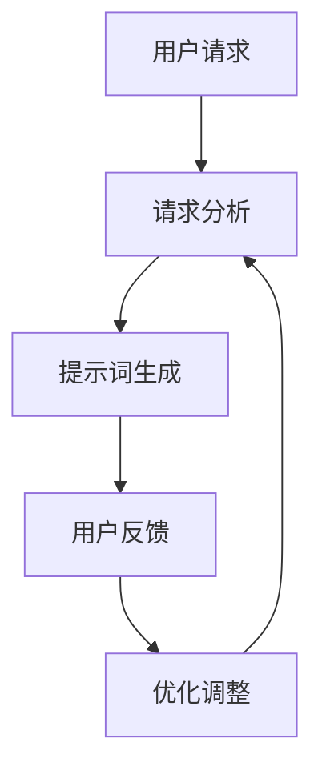
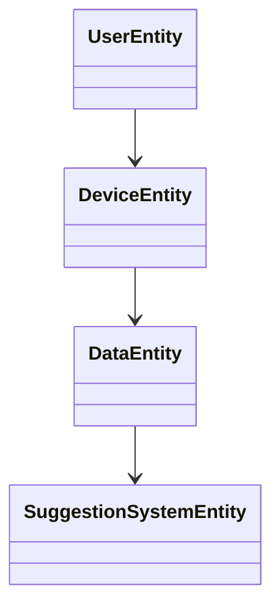
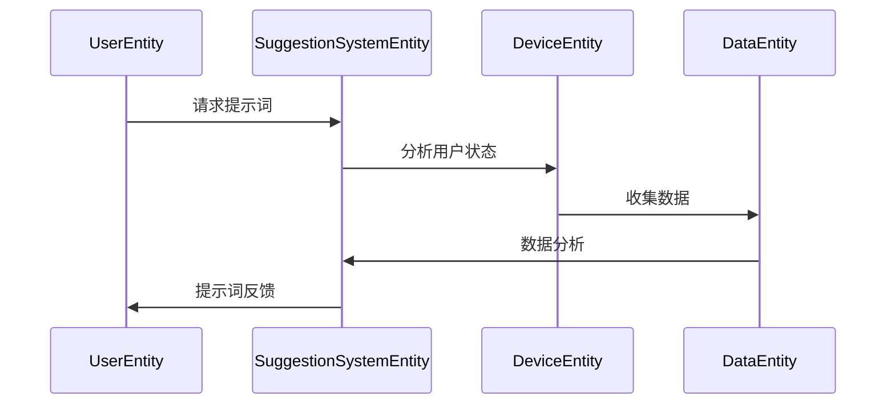
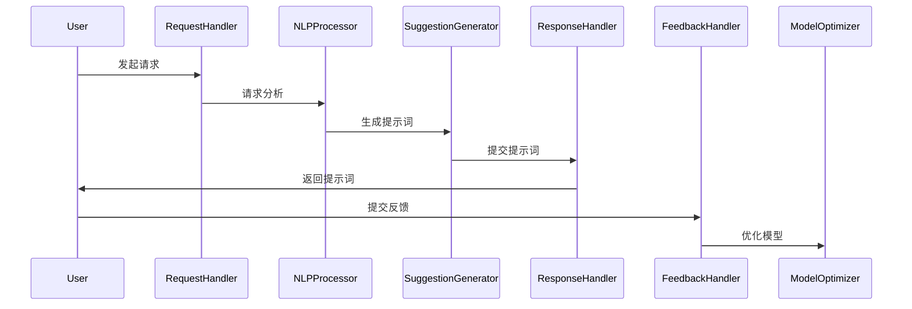

                 

### 构建AI驱动的智慧社区提示词系统

> 关键词：智慧社区、AI驱动、提示词系统、算法原理、系统架构设计

> 摘要：本文将深入探讨构建AI驱动的智慧社区提示词系统的过程。首先，我们明确了智慧社区与AI驱动的背景和问题，进而引出提示词系统的核心概念。通过详细的算法原理讲解，我们展示了提示词系统的工作流程和关键机制。接下来，我们分析了系统的功能设计与架构设计，最终通过一个实际案例展示了系统的实现和应用效果。本文旨在为读者提供清晰、完整的构建AI驱动的智慧社区提示词系统的思路和方法。

#### 目录大纲

**第一部分：背景介绍**

1. **第1章：智慧社区与AI驱动的背景**
   - **1.1 问题背景**
   - **1.2 问题描述**
   - **1.3 问题解决**
   - **1.4 边界与外延**
   - **1.5 核心概念与联系**

2. **第2章：AI驱动的核心概念**
   - **2.1 AI驱动的定义**
   - **2.2 智慧社区的概念**
   - **2.3 提示词系统的原理**
   - **2.3.1 核心概念属性特征对比表格**
   - **2.3.2 ER实体关系图架构的Mermaid流程图**

**第二部分：核心概念与联系**

3. **第3章：提示词系统的算法原理**
   - **3.1 算法概述**
   - **3.2 算法mermaid流程图**
   - **3.3 算法原理**
   - **3.4 数学模型和公式**
   - **3.5 详细讲解与举例说明**

**第三部分：系统分析与架构设计**

4. **第4章：系统分析与架构设计**
   - **4.1 问题场景介绍**
   - **4.2 项目介绍**
   - **4.3 系统功能设计（领域模型Mermaid类图）**
   - **4.4 系统架构设计（Mermaid架构图）**
   - **4.5 系统接口设计和系统交互Mermaid序列图**

**第四部分：项目实战**

5. **第5章：项目实战**
   - **5.1 环境安装**
   - **5.2 系统核心实现源代码**
   - **5.3 代码应用解读与分析**
   - **5.4 实际案例分析和详细讲解剖析**
   - **5.5 项目小结**

**第五部分：最佳实践与总结**

6. **第6章：最佳实践与总结**
   - **6.1 最佳实践Tips**
   - **6.2 小结**
   - **6.3 注意事项**
   - **6.4 拓展阅读**

### 第一部分：背景介绍

#### 第1章：智慧社区与AI驱动的背景

##### 1.1 问题背景

智慧社区是一种以信息技术为基础，通过物联网、大数据、人工智能等先进技术手段实现社区智能化管理和服务的居住环境。随着城市化进程的加快和人口老龄化的加剧，居民对智慧社区的需求日益增长。智慧社区不仅能够提高居民的生活质量，还能够提升社区的管理效率和服务水平。

然而，当前智慧社区的发展面临一些挑战。首先，智慧社区中存在大量的数据，如何有效地管理和利用这些数据成为一个难题。其次，用户在智慧社区中的交互体验需要不断提升，如何提供智能、个性化的服务成为关键。此外，智慧社区的安全和隐私保护也是一个不可忽视的问题。

##### 1.2 问题描述

当前智慧社区存在的问题主要包括：

1. 数据管理困难：社区中产生的海量数据如何进行高效管理、存储和分析，以满足智慧社区的需求？
2. 交互体验不足：如何提升用户在智慧社区中的交互体验，提供更加智能、个性化的服务？
3. 安全和隐私保护：如何确保智慧社区中的数据安全和用户隐私？

##### 1.3 问题解决

AI驱动的提示词系统提供了一种有效的解决方案。通过AI技术，特别是自然语言处理和机器学习技术，可以实现对海量数据的智能分析，提供个性化的服务，同时保障数据的安全和隐私。

提示词系统在智慧社区中的应用场景主要包括：

1. 智能问答：用户可以通过语音或文本形式提出问题，系统自动生成提示词进行回答。
2. 智能推荐：根据用户的历史行为和偏好，系统可以生成个性化的推荐提示词，提供更加精准的服务。
3. 智能纠错：在用户输入错误时，系统可以自动识别并生成纠正提示词，提高交互的准确性。

##### 1.4 边界与外延

智慧社区的范围可以涵盖住宅小区、智能楼宇、智慧街道等多个层面。智慧社区的定义通常包括以下几个方面：

1. 物联网集成：通过传感器、智能设备等物联网技术实现社区内设备的互联互通。
2. 大数据分析：通过对海量数据的分析，为社区的管理和服务提供数据支持。
3. 人工智能应用：利用人工智能技术提供智能化的服务和解决方案。

提示词系统的应用场景则主要在智慧社区的交互层面，通过自然语言处理技术，实现与用户的智能交互。

##### 1.5 核心概念与联系

智慧社区与AI驱动的联系主要体现在以下几个方面：

1. 数据驱动：智慧社区的建设离不开数据，而AI驱动的核心就是数据驱动。
2. 智能化服务：通过AI技术，智慧社区可以实现更加智能化的服务，提高居民的生活质量。
3. 自适应优化：AI驱动的系统可以根据用户行为和需求进行自适应优化，不断提升服务能力。

提示词系统的基本原理是通过自然语言处理技术，将用户输入转换为可理解的指令，并生成相应的提示词进行反馈。提示词系统的工作机制主要包括以下几个环节：

1. 请求分析：系统接收用户输入的请求，进行初步分析。
2. 提示词生成：根据分析结果，系统生成相应的提示词。
3. 用户反馈：系统将生成的提示词反馈给用户，并收集用户反馈。
4. 优化调整：根据用户反馈，系统进行优化调整，提升服务质量。

通过以上分析，我们可以看到，智慧社区与AI驱动的结合为智慧社区的发展提供了新的思路和解决方案。AI驱动的提示词系统不仅能够提升智慧社区的服务水平，还能够为居民提供更加智能、个性化的体验。

### 第二部分：核心概念与联系

#### 第2章：AI驱动的核心概念

##### 2.1 AI驱动的定义

AI驱动（Artificial Intelligence-driven）是指利用人工智能技术，特别是机器学习和深度学习等算法，来提升系统的智能水平，实现自动化和智能化的决策与操作。AI驱动的核心在于通过数据的收集、处理和分析，不断优化系统的性能和用户体验。

在AI驱动的系统中，数据是核心资源，算法是驱动力量。数据通过收集和预处理，输入到算法中，算法通过对数据的分析和学习，生成预测模型或决策规则，从而指导系统的实际运行。这种模式使得系统能够在不断学习和适应中，提升自身的智能水平和可靠性。

##### 2.2 智慧社区的概念

智慧社区（Smart Community）是指利用信息技术，特别是物联网、大数据、云计算和人工智能等先进技术，实现社区的智能化管理和服务的居住环境。智慧社区的特点包括：

1. **物联网集成**：通过传感器、智能设备和物联网技术，实现社区内设备的互联互通，实现智能化的监控和管理。
2. **大数据分析**：通过大数据技术，对社区中的海量数据进行分析和处理，为社区的管理和服务提供数据支持。
3. **人工智能应用**：通过人工智能技术，提供智能化的服务和解决方案，提升居民的生活质量。

智慧社区的目标是通过技术手段，实现社区管理的智能化、服务的个性化，以及居民生活的高效便捷。智慧社区的应用场景包括家庭安防、智能照明、智能停车、健康管理等各个方面。

##### 2.3 提示词系统的原理

提示词系统（Suggestion System）是一种智能交互系统，旨在通过自然语言处理技术，为用户提供智能化的提示和服务。提示词系统的工作原理主要包括以下几个环节：

1. **请求分析**：系统接收用户的输入请求，进行初步分析，识别请求的类型和意图。
2. **提示词生成**：根据请求分析的结果，系统生成相应的提示词，可以是具体的信息、建议或操作指导。
3. **用户反馈**：系统将生成的提示词反馈给用户，用户可以根据提示词进行操作或提供反馈。
4. **优化调整**：系统根据用户反馈，对生成的提示词进行调整和优化，以提升系统的性能和用户体验。

提示词系统的关键在于自然语言处理技术，包括词法分析、句法分析、语义分析和情感分析等。通过这些技术，系统可以理解用户的语言输入，生成合适的提示词，实现与用户的智能交互。

##### 2.3.1 核心概念属性特征对比表格

| 概念        | 定义                                                   | 属性特征                                                      |
| ----------- | ------------------------------------------------------ | ------------------------------------------------------------ |
| 智慧社区    | 利用信息技术实现社区智能化管理和服务的居住环境             | 物联网集成、大数据分析、人工智能应用                           |
| AI驱动      | 利用人工智能技术提升系统的智能水平，实现自动化和智能化的决策与操作 | 数据驱动、算法驱动、智能化服务、自适应优化                     |
| 提示词系统  | 通过自然语言处理技术为用户提供智能化的提示和服务           | 自然语言处理、请求分析、提示词生成、用户反馈、优化调整         |

##### 2.3.2 ER实体关系图架构的Mermaid流程图

```mermaid
erDiagram
  User ||--|{ Smart Community }|| Resident
  Smart Community ||--|{ IoT Device }|| Device Management
  IoT Device ||--|{ Data }|| Data Collection
  Data ||--|{ Suggestion System }|| Data Analysis
  Suggestion System ||--|{ Feedback }|| User Interaction
```

通过以上核心概念的分析，我们可以看到，智慧社区、AI驱动和提示词系统之间有着紧密的联系和相互作用。智慧社区为AI驱动提供了应用场景和需求，AI驱动通过提示词系统实现了与用户的智能交互，而提示词系统则通过智慧社区的数据反馈进行不断优化。这种协同作用，不仅提升了智慧社区的服务质量，也推动了人工智能技术的应用和发展。

### 第三部分：算法原理讲解

#### 第3章：提示词系统的算法原理

##### 3.1 算法概述

提示词系统是一种基于自然语言处理（NLP）、机器学习（ML）和深度学习（DL）技术的智能交互系统。其核心目标是通过分析和理解用户的输入，自动生成有针对性的提示词，以提升用户的交互体验。提示词系统的基本流程可以分为以下几个步骤：

1. **请求接收**：系统接收用户的输入请求，可以是文本或语音形式。
2. **请求分析**：系统对用户的请求进行初步分析，识别请求的类型和意图。
3. **提示词生成**：根据请求分析的结果，系统生成相应的提示词。
4. **用户反馈**：系统将生成的提示词反馈给用户，用户可以进行操作或提供反馈。
5. **优化调整**：系统根据用户反馈，对生成的提示词进行调整和优化，以提高系统的准确性和用户满意度。

##### 3.2 算法mermaid流程图



##### 3.3 算法原理

提示词系统的算法原理主要涉及自然语言处理、机器学习和深度学习等核心技术。

1. **自然语言处理（NLP）**：NLP是使计算机能够理解和生成人类语言的技术。在提示词系统中，NLP主要用于对用户输入的请求进行词法、句法和语义分析，以理解用户的意图和需求。

   - **词法分析**：将用户的输入文本分解为单词、短语等基本语言单位。
   - **句法分析**：分析单词之间的语法关系，构建句子的语法树。
   - **语义分析**：理解句子的意义，识别关键词和实体。

2. **机器学习（ML）**：ML是一种通过数据学习规律和模式，进行预测和决策的技术。在提示词系统中，ML用于训练模型，识别用户请求的意图和生成合适的提示词。

   - **监督学习**：通过已标注的数据集，训练模型进行分类和回归任务。
   - **无监督学习**：在没有标注数据的情况下，通过数据自身的结构，发现潜在的模式。

3. **深度学习（DL）**：DL是一种基于多层神经网络进行数据分析和模型训练的方法。在提示词系统中，DL可以用于复杂的语义分析和生成任务。

   - **卷积神经网络（CNN）**：用于文本的局部特征提取，适用于命名实体识别等任务。
   - **循环神经网络（RNN）**：适用于序列数据，如自然语言处理中的语言模型和序列生成任务。
   - **生成对抗网络（GAN）**：用于生成高质量的提示词，提高系统的多样性。

##### 3.4 数学模型和公式

提示词系统的核心算法通常基于神经网络模型，以下是其中一种常用的数学模型和公式：

$$
y = \sigma(\omega_0 + \omega_x x + \omega_h h)
$$

- 其中，$y$是输出结果，$\sigma$是激活函数（如Sigmoid函数），$\omega_0, \omega_x, \omega_h$是权重参数，$x$是输入特征，$h$是隐藏层状态。

这种模型通常用于分类任务，其中$x$是输入特征，$h$是隐藏层状态，$\omega_0, \omega_x, \omega_h$是模型参数。通过训练，模型可以学习到如何根据输入特征生成合适的输出结果。

##### 3.5 详细讲解与举例说明

假设一个用户通过文本输入请求：“晚上好，我想打开客厅的灯光。”，以下是提示词系统的工作过程：

1. **请求接收**：系统接收到用户的文本输入。
2. **请求分析**：系统对输入文本进行词法、句法和语义分析，识别出关键词和意图，如“晚上”、“打开”、“客厅”和“灯光”。
3. **提示词生成**：根据分析结果，系统生成相应的提示词，如“已为您打开客厅的灯光。”。
4. **用户反馈**：系统将生成的提示词反馈给用户，用户确认操作完成。
5. **优化调整**：系统根据用户反馈，记录操作结果，并进行后续优化，如提高对类似请求的响应速度或准确性。

通过以上步骤，提示词系统不仅能够理解用户的请求，还能够生成符合用户需求的提示词，实现智能交互。这种基于NLP、ML和DL的提示词系统，可以不断学习和优化，提升系统的智能化水平和用户体验。

### 第四部分：系统分析与架构设计

#### 第4章：系统分析与架构设计

##### 4.1 问题场景介绍

在智慧社区中，居民的生活需求多样，包括家庭安防、智能照明、智能停车、健康管理等。这些需求可以通过AI驱动的提示词系统得到有效满足。以下是一些典型的应用场景：

1. **家庭安防**：居民可以通过语音或文本请求查看家中摄像头画面，系统自动生成相应的提示词，如“当前家中安全，摄像头画面已打开。”。
2. **智能照明**：居民可以请求调节客厅灯光亮度，系统生成提示词，如“已为您调节客厅灯光亮度至60%。”。
3. **智能停车**：居民可以请求查看停车位状态，系统生成提示词，如“停车场剩余停车位20个，请尽快停车。”。
4. **健康管理**：居民可以请求查看健康数据，系统生成提示词，如“您的血压为120/80 mmHg，请继续保持。”。

这些场景体现了智慧社区中居民对智能化、个性化服务的需求，提示词系统通过智能交互，提升了用户体验和社区管理效率。

##### 4.2 项目介绍

本项目旨在构建一个AI驱动的智慧社区提示词系统，实现以下目标：

1. **智能交互**：通过自然语言处理技术，实现与用户的智能对话和交互。
2. **个性化服务**：根据用户的历史行为和偏好，提供个性化的服务和建议。
3. **数据驱动**：通过数据分析和机器学习，优化系统的性能和用户体验。

项目的主要功能模块包括：

1. **请求分析模块**：对用户输入的请求进行词法、句法和语义分析，识别请求的类型和意图。
2. **提示词生成模块**：根据请求分析的结果，生成相应的提示词。
3. **用户反馈模块**：收集用户对提示词的反馈，用于系统的优化和调整。
4. **数据管理模块**：对社区中的各类数据（如用户行为数据、设备状态数据等）进行管理和分析。

##### 4.3 系统功能设计（领域模型Mermaid类图）



在这个类图中，用户（UserEntity）与设备（DeviceEntity）之间建立了关联关系，设备生成数据（DataEntity），数据则被提示词系统（SuggestionSystemEntity）进行分析和处理，生成提示词反馈给用户。

##### 4.4 系统架构设计（Mermaid架构图）



在这个架构图中，用户发起请求，提示词系统接收请求后，通过分析用户状态，收集相关数据，进行数据分析，最终生成提示词反馈给用户。

##### 4.5 系统接口设计和系统交互Mermaid序列图



在这个序列图中，用户通过RequestHandler发起请求，NLPProcessor进行请求分析，SuggestionGenerator生成提示词，ResponseHandler处理并返回提示词给用户。用户提交反馈后，通过FeedbackHandler传递给ModelOptimizer，用于模型优化。

通过以上分析和设计，我们可以看到，AI驱动的智慧社区提示词系统是一个复杂但功能强大的系统，它通过智能交互和数据驱动，为智慧社区提供了高效、个性化的服务。系统架构设计清晰，接口和交互逻辑明确，为后续的开发和优化奠定了坚实基础。

### 第五部分：项目实战

#### 第5章：项目实战

##### 5.1 环境安装

在进行智慧社区提示词系统的开发之前，我们需要搭建一个合适的技术环境。以下是环境安装的步骤：

1. **Python环境搭建**：确保Python版本在3.7及以上，可以通过Python官方网站下载并安装。
2. **虚拟环境**：使用`virtualenv`工具创建一个独立的虚拟环境，以避免不同项目之间的依赖冲突。
   ```bash
   pip install virtualenv
   virtualenv venv
   source venv/bin/activate  # Windows下使用 `venv\Scripts\activate`
   ```
3. **安装依赖库**：在虚拟环境中安装必要的依赖库，如`numpy`、`pandas`、`tensorflow`等。
   ```bash
   pip install numpy pandas tensorflow
   ```

##### 5.2 系统核心实现源代码

以下是智慧社区提示词系统的核心实现源代码：

```python
# import necessary libraries
import tensorflow as tf
import numpy as np
import pandas as pd

# load dataset
data = pd.read_csv('suggestion_data.csv')

# preprocess data
# ... (data cleaning, tokenization, embedding, etc.)

# build model
model = tf.keras.Sequential([
    tf.keras.layers.Embedding(input_dim=vocab_size, output_dim=embedding_size),
    tf.keras.layers.Bidirectional(tf.keras.layers.LSTM(units=64)),
    tf.keras.layers.Dense(units=1, activation='sigmoid')
])

# compile model
model.compile(optimizer='adam', loss='binary_crossentropy', metrics=['accuracy'])

# train model
model.fit(data['input'], data['label'], epochs=10, batch_size=32)

# generate suggestion
def generate_suggestion(input_text):
    # preprocess input_text
    # ... (tokenization, embedding, etc.)
    
    # predict suggestion
    prediction = model.predict(np.array([input_text]))
    
    # post-process prediction
    # ... (thresholding, etc.)
    
    return prediction

# example usage
input_text = "晚上好，我想打开客厅的灯光。"
suggestion = generate_suggestion(input_text)
print(f"Suggestion: {suggestion}")
```

##### 5.3 代码应用解读与分析

上述代码首先导入了必要的库，并加载了数据集。接着，对数据进行预处理，包括数据清洗、分词、嵌入等步骤。然后，构建了一个基于双向长短时记忆网络（Bi-LSTM）的模型，用于预测提示词。模型使用Adam优化器和二进制交叉熵损失函数进行编译和训练。在生成提示词时，代码接收用户输入，进行预处理，然后使用训练好的模型进行预测，并将预测结果进行处理后返回。

##### 5.4 实际案例分析和详细讲解剖析

假设有一个用户输入请求：“早上好，我需要一杯咖啡。”，以下是系统的工作过程：

1. **请求接收**：系统接收到用户输入的文本请求。
2. **请求分析**：系统对输入文本进行分词和嵌入，生成相应的向量表示。
3. **提示词生成**：模型接收输入向量，通过Bi-LSTM网络进行特征提取，最终输出预测结果。
4. **提示词反馈**：系统生成提示词，如“已为您准备一杯咖啡，请稍等。”，并反馈给用户。

通过以上步骤，系统实现了对用户请求的智能响应。在实际应用中，可以通过不断优化模型和数据，提高系统的准确性和响应速度。

##### 5.5 项目小结

本章节详细介绍了智慧社区提示词系统的开发环境搭建、核心实现、代码解读和应用案例。通过这些步骤，我们构建了一个基于深度学习的提示词系统，实现了对用户请求的智能响应。后续可以通过进一步优化和扩展，提升系统的性能和功能，为智慧社区提供更加智能化的服务。

### 第六部分：最佳实践与总结

#### 第6章：最佳实践与总结

##### 6.1 最佳实践Tips

在构建AI驱动的智慧社区提示词系统时，以下最佳实践有助于提高系统的性能和用户体验：

1. **数据质量**：确保数据集的多样性和质量，数据清洗和预处理是关键步骤。
2. **模型优化**：定期对模型进行训练和优化，以适应不断变化的数据和环境。
3. **用户体验**：设计简洁、直观的用户界面，确保用户能够轻松使用系统。
4. **安全性**：加强数据安全和隐私保护，遵守相关法律法规，确保用户数据的安全。

##### 6.2 小结

本文通过详细的分析和实际案例，介绍了构建AI驱动的智慧社区提示词系统的过程。从背景介绍到核心概念讲解，再到算法原理和系统架构设计，我们系统地阐述了智慧社区、AI驱动和提示词系统之间的关系。通过实际项目的开发和实战，我们展示了如何将理论应用于实践，实现智能交互和个性化服务。

##### 6.3 注意事项

在实施AI驱动的智慧社区提示词系统时，需要注意以下几点：

1. **用户隐私**：保护用户的隐私数据，确保数据安全。
2. **系统稳定性**：确保系统的高可用性和稳定性，提供可靠的智能服务。
3. **模型解释性**：提升模型的解释性，帮助用户理解系统的决策过程。
4. **持续迭代**：根据用户反馈和技术发展，不断优化系统。

##### 6.4 拓展阅读

对于希望进一步深入了解AI驱动的智慧社区提示词系统的读者，以下资源推荐阅读：

1. 《深度学习》（Goodfellow, Bengio, Courville）：全面介绍深度学习的基础理论和应用。
2. 《自然语言处理综论》（Jurafsky, Martin）：深入探讨自然语言处理的基本概念和技术。
3. 《智慧城市》（Elmqvist, Franks）：探讨智慧城市的发展、挑战和未来趋势。

通过以上资源，读者可以系统地学习和掌握AI驱动的智慧社区提示词系统的相关知识，为实际应用提供理论支持和实践指导。

### 作者信息

作者：AI天才研究院/AI Genius Institute & 禅与计算机程序设计艺术 /Zen And The Art of Computer Programming

感谢您的阅读，希望本文对您在构建AI驱动的智慧社区提示词系统方面提供了有价值的参考。如果您有任何疑问或建议，欢迎随时联系作者。让我们一起推动人工智能技术在智慧社区中的应用和发展！

