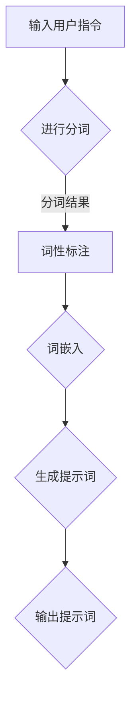
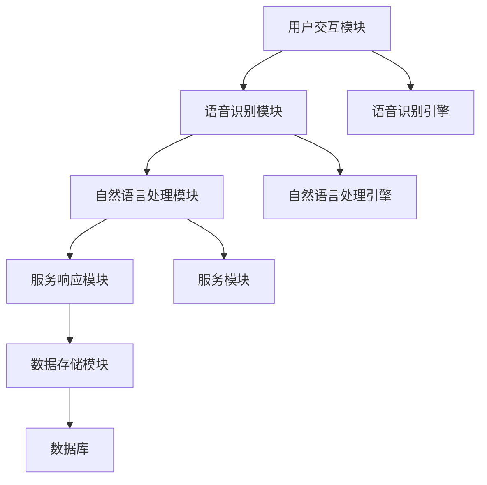

                 


### 文章标题
构建AI驱动的智慧社区服务提示词平台

### 关键词
AI驱动的智慧社区服务、提示词平台、人工智能、机器学习、自然语言处理

### 摘要
本文深入探讨了构建AI驱动的智慧社区服务提示词平台的理论和实践。通过分析智慧社区服务的现状和挑战，本文详细介绍了AI驱动的核心概念、算法原理和数学模型。随后，文章讨论了系统的架构设计与接口设计，并通过项目实战展示了如何实现和优化提示词平台。最后，文章总结了最佳实践和注意事项，为未来的研究和应用提供了指导。

----------------------------------------------------------------

## 引言

随着信息技术的飞速发展，人工智能（AI）已经成为推动社会进步的重要力量。在智慧社区服务领域，AI的应用更是日益广泛，不仅提升了服务的智能化水平，还显著改善了用户体验。提示词平台作为智慧社区服务的关键组件，能够为居民提供便捷的语音交互服务，实现智能家居、安防监控、物业服务等多种功能。因此，构建一个高效、智能、可靠的AI驱动的智慧社区服务提示词平台具有重要意义。

本文旨在系统地探讨如何构建这样的平台，首先从问题背景出发，分析智慧社区服务的现状和面临的挑战。随后，我们将深入介绍AI驱动的核心概念，包括机器学习、自然语言处理等关键技术，并详细讲解相关的算法原理和数学模型。接下来，我们将讨论系统的架构设计与接口设计，通过项目实战展示实现过程。最后，本文将总结最佳实践和注意事项，为读者提供实用的指导和未来的研究方向。

本文结构如下：

1. **问题背景与核心概念**：介绍智慧社区服务的现状和挑战，定义提示词平台及其关键要素。
2. **AI驱动的智慧社区服务核心概念与联系**：深入探讨AI技术的原理及其在智慧社区服务中的应用。
3. **AI驱动的智慧社区服务数学模型与算法原理**：讲解机器学习、自然语言处理等算法，并提供Mermaid算法流程图和Python源代码。
4. **智慧社区服务系统架构与接口设计**：讨论系统架构、接口设计及其交互流程。
5. **智慧社区服务项目实战**：展示环境安装、系统实现和实际案例分析。
6. **最佳实践与优化策略**：总结最佳实践，提供优化策略。
7. **小结与未来展望**：总结全文，提出未来研究方向。

接下来，我们首先探讨智慧社区服务的现状和挑战。

----------------------------------------------------------------

## 第1章: 问题背景与核心概念

### 1.1 智慧社区服务的现状

智慧社区服务是指通过现代信息技术，如物联网（IoT）、大数据、云计算和人工智能等，实现社区服务的智能化、个性化、安全化和便捷化。目前，智慧社区服务在全球范围内得到了广泛关注和快速发展。

- **国外发展现状**：在国外，美国、日本、欧洲等国家在智慧社区服务领域取得了显著成果。例如，美国通过智能家居系统实现了家电的互联互通，日本的智慧社区服务结合了物联网技术和先进的安防系统，欧洲则通过大数据分析提升了社区服务的管理效率。

- **国内发展现状**：在中国，智慧社区服务的应用日益广泛。从一线城市到二三线城市，智慧社区服务已经逐步落地。以智慧安防、智慧物业和智慧医疗为代表的社区服务，正在不断优化居民的生活质量。

### 1.2 智慧社区服务面临的挑战

尽管智慧社区服务取得了显著成果，但在发展过程中仍面临诸多挑战。

- **数据隐私与安全性**：智慧社区服务涉及大量的个人数据，如居民身份信息、行为数据等。如何确保数据的安全性和隐私性，是当前亟待解决的问题。

- **智能化水平的提升需求**：随着居民对高质量服务的需求不断增长，智慧社区服务的智能化水平需要不断提升。这要求AI技术在智慧社区服务中的应用更加深入和广泛。

- **社区用户参与度不足**：尽管智慧社区服务提供了多种便利功能，但居民的实际参与度仍有待提高。如何激发居民的参与热情，是智慧社区服务发展的重要课题。

### 1.3 提示词平台的概念

提示词平台是智慧社区服务中的一项关键技术，它通过语音识别和自然语言处理技术，实现人与社区服务的自然交互。提示词平台的主要功能包括：

- **语音识别**：将居民的语言指令转换为文本指令，供系统处理。
- **自然语言处理**：对语音指令进行语义分析和意图识别，以确定用户需求。
- **智能响应**：根据用户需求，提供相应的智能响应和服务。

### 1.4 提示词平台的关键要素

一个高效的提示词平台需要具备以下几个关键要素：

- **高准确度的语音识别**：这是提示词平台的基础，要求能够准确识别居民的语言指令。
- **强大的自然语言处理能力**：能够对语音指令进行深度语义分析和意图识别，确保系统能够准确理解用户需求。
- **智能化的响应机制**：能够根据用户需求，提供快速、准确的响应和服务。

### 1.5 核心概念与联系

- **AI技术**：作为提示词平台的核心，AI技术包括机器学习、自然语言处理、语音识别等。
- **物联网（IoT）**：物联网技术是实现社区设备互联互通的基础，为提示词平台提供了丰富的数据源。
- **大数据**：大数据技术用于分析居民的行为数据，为智能决策提供支持。

在接下来的章节中，我们将深入探讨AI驱动的核心概念及其在智慧社区服务中的应用。

----------------------------------------------------------------

## 第2章: AI驱动的智慧社区服务核心概念与联系

### 2.1 AI技术原理

人工智能（AI）是一门研究、开发用于模拟、延伸和扩展人的智能的理论、方法、技术及应用系统的技术科学。AI技术主要包括以下几个方面：

#### 2.1.1 机器学习基础

机器学习（Machine Learning，ML）是AI的核心技术之一，通过算法从数据中学习规律和模式，进而实现智能决策。机器学习主要分为以下几种类型：

- **监督学习（Supervised Learning）**：通过已标记的训练数据，学习模型参数，实现对新数据的预测。
- **无监督学习（Unsupervised Learning）**：没有预先标记的数据，通过数据之间的相似性或聚类，学习数据结构。
- **半监督学习（Semi-Supervised Learning）**：结合了监督学习和无监督学习的特点，部分数据有标签，部分数据无标签。

#### 2.1.2 深度学习基础

深度学习（Deep Learning，DL）是机器学习的一个重要分支，基于多层神经网络的结构，通过层层提取特征，实现复杂模式的识别。深度学习的主要类型包括：

- **卷积神经网络（Convolutional Neural Network，CNN）**：主要用于图像和视频处理。
- **循环神经网络（Recurrent Neural Network，RNN）**：主要用于序列数据，如文本、语音。
- **生成对抗网络（Generative Adversarial Network，GAN）**：通过两个对抗网络，实现数据的生成。

#### 2.1.3 自然语言处理基础

自然语言处理（Natural Language Processing，NLP）是AI在文本处理领域的应用，旨在使计算机能够理解和生成人类语言。NLP的主要任务包括：

- **分词（Tokenization）**：将文本切分成单词或字符。
- **词性标注（Part-of-Speech Tagging）**：标注文本中每个单词的词性。
- **句法分析（Parsing）**：分析句子的结构。
- **语义分析（Semantic Analysis）**：理解句子的含义。

### 2.2 智慧社区服务中的AI应用

在智慧社区服务中，AI技术被广泛应用于以下几个方面：

#### 2.2.1 智能安防

智能安防通过AI技术，实现对社区安全的有效管理。主要应用包括：

- **人脸识别**：通过摄像头捕获人脸图像，进行身份识别和追踪。
- **行为分析**：利用视频监控，分析居民的行为，实现异常行为的检测和预警。

#### 2.2.2 智能物业

智能物业通过AI技术，提升物业服务的效率和质量。主要应用包括：

- **智能门禁**：利用人脸识别或手机APP实现无钥匙开锁。
- **能耗管理**：通过传感器和数据分析，实现能耗的智能监控和管理。

#### 2.2.3 社区服务智能化

社区服务智能化通过AI技术，提升社区服务的便捷性和个性化。主要应用包括：

- **智能客服**：通过语音识别和自然语言处理，实现与居民的智能对话。
- **智能推荐**：根据居民的行为和偏好，提供个性化的服务推荐。

### 2.3 提示词平台的构建与优化

提示词平台是智慧社区服务的重要组成部分，其构建与优化主要涉及以下几个方面：

#### 2.3.1 提示词平台的设计原则

提示词平台的设计应遵循以下原则：

- **易用性**：用户界面简单直观，便于居民使用。
- **准确性**：语音识别和语义分析准确，确保用户指令得到正确理解。
- **扩展性**：系统架构应具备良好的扩展性，以适应未来技术的发展。

#### 2.3.2 提示词优化策略

提示词优化策略包括：

- **数据收集与预处理**：收集丰富的语音数据，进行数据清洗和预处理。
- **模型训练与调优**：利用机器学习和深度学习算法，训练和优化语音识别和自然语言处理模型。
- **在线学习与反馈**：通过用户的实际使用反馈，不断优化和提升系统性能。

#### 2.3.3 提示词平台与AI的结合

提示词平台与AI技术的结合，主要体现在以下几个方面：

- **语音识别与自然语言处理**：通过AI技术，实现语音识别和语义分析，确保用户指令的准确理解。
- **智能决策与响应**：根据用户指令和社区服务的需求，利用AI技术实现智能决策和响应。
- **个性化服务**：通过用户行为分析，实现个性化服务推荐，提升用户体验。

在接下来的章节中，我们将深入探讨AI驱动的智慧社区服务的数学模型与算法原理。

----------------------------------------------------------------

## 第3章: AI驱动的智慧社区服务数学模型与算法原理

### 3.1 数学模型

在AI驱动的智慧社区服务中，数学模型是算法实现的基础。以下介绍几种常用的数学模型：

#### 3.1.1 监督学习模型

监督学习模型是一种从标记数据中学习规律和模式的方法。其核心包括：

- **损失函数（Loss Function）**：用于衡量预测结果与真实值之间的差距，常见的有均方误差（MSE）、交叉熵损失（Cross-Entropy Loss）等。
- **优化算法（Optimization Algorithm）**：用于更新模型参数，以最小化损失函数。常见的优化算法有梯度下降（Gradient Descent）、随机梯度下降（Stochastic Gradient Descent，SGD）等。

#### 3.1.2 无监督学习模型

无监督学习模型是从未标记的数据中学习规律和模式的方法。其核心包括：

- **聚类（Clustering）**：将相似的数据点划分到同一组。常见的聚类算法有K-均值（K-Means）、层次聚类（Hierarchical Clustering）等。
- **降维（Dimensionality Reduction）**：通过降低数据维度，减少计算复杂度。常见的降维算法有主成分分析（PCA）、线性判别分析（LDA）等。

#### 3.1.3 强化学习模型

强化学习模型是一种通过不断试错，学习最优策略的方法。其核心包括：

- **状态（State）**：系统当前的状态。
- **动作（Action）**：系统可以执行的动作。
- **奖励（Reward）**：系统执行动作后获得的奖励，用于评价动作的好坏。
- **策略（Policy）**：系统根据状态选择动作的规则。

### 3.2 算法原理讲解

以下介绍几种关键的算法原理：

#### 3.2.1 提示词生成算法

提示词生成算法用于生成与用户指令相关的提示词。其核心步骤包括：

1. **数据预处理**：将用户指令转化为文本，进行分词、词性标注等操作。
2. **词嵌入（Word Embedding）**：将文本转化为向量表示，常用的词嵌入方法有Word2Vec、GloVe等。
3. **生成模型**：使用生成对抗网络（GAN）或变分自编码器（VAE）等生成模型，生成与用户指令相关的提示词。

#### 3.2.2 提示词匹配算法

提示词匹配算法用于匹配用户指令和系统功能。其核心步骤包括：

1. **用户指令理解**：使用自然语言处理技术，理解用户指令的含义。
2. **功能匹配**：将用户指令与系统功能进行匹配，找到相应的功能模块。
3. **结果反馈**：根据匹配结果，提供相应的服务或反馈。

#### 3.2.3 提示词优化算法

提示词优化算法用于优化提示词的生成和匹配效果。其核心步骤包括：

1. **性能评估**：评估提示词生成和匹配的性能，常用的评估指标有准确率、召回率、F1值等。
2. **模型调优**：根据性能评估结果，调整模型参数，优化生成和匹配效果。
3. **在线学习**：通过用户的反馈，不断更新和优化模型。

### 3.3 Mermaid算法流程图

以下是一个示例的Mermaid算法流程图，用于描述提示词生成算法的基本步骤：



### 3.4 Python源代码讲解

以下是一个简单的Python源代码示例，用于生成和匹配提示词：

```python
import nltk
from nltk.tokenize import word_tokenize
from nltk.corpus import stopwords

# 进行分词
def tokenize_text(text):
    return word_tokenize(text)

# 词性标注
def pos_tagging(tokens):
    return nltk.pos_tag(tokens)

# 词嵌入
def word_embedding(tokens):
    # 这里使用预训练的词嵌入模型
    return embeddings[tokens]

# 生成提示词
def generate_tip(words):
    # 使用生成对抗网络生成提示词
    return generator.predict(words)

# 匹配提示词
def match_tip(tip, function_list):
    # 根据提示词与功能列表进行匹配
    return matching_function(tip, function_list)

# 示例
text = "我想知道今天的天气"
tokens = tokenize_text(text)
pos_tags = pos_tagging(tokens)
words = [word for word, tag in pos_tags if tag not in stopwords.words('english')]

tip = generate_tip(words)
matched_function = match_tip(tip, function_list)

print("生成的提示词：", tip)
print("匹配到的功能：", matched_function)
```

通过以上代码，我们可以实现简单的提示词生成和匹配功能。

### 3.5 算法原理的数学模型和公式

以下是一个简单的数学模型示例，用于描述提示词生成算法：

$$
\text{提示词} = \text{嵌入向量} + \text{噪声}
$$

其中，嵌入向量是通过词嵌入模型生成的，噪声用于增加生成的多样性。

### 3.6 通俗易懂地举例说明

假设用户输入指令：“我想知道今天的天气”，我们可以按照以下步骤生成和匹配提示词：

1. **分词**：将用户指令分词为“我”、“想”、“知道”、“今天”、“的”、“天气”。
2. **词性标注**：标注词性为“代词”、“动词”、“动词”、“名词”、“的”、“名词”。
3. **词嵌入**：将词嵌入为向量表示。
4. **生成提示词**：使用生成对抗网络生成与用户指令相关的提示词，如“今日天气预报”。
5. **匹配提示词**：将生成的提示词与系统功能列表进行匹配，找到相应的天气查询功能。

通过以上步骤，系统可以准确理解用户指令，并提供相应的服务。

在接下来的章节中，我们将讨论智慧社区服务系统的架构与接口设计。

----------------------------------------------------------------

## 第4章: 智慧社区服务系统架构与接口设计

### 4.1 系统架构设计

智慧社区服务系统的架构设计是构建高效、稳定、可扩展的系统的关键。系统架构设计包括系统概述、数据流设计、系统组件设计和接口设计等多个方面。

#### 4.1.1 系统架构概述

智慧社区服务系统可以划分为以下几个主要模块：

- **用户交互模块**：负责与用户进行交互，接收用户的指令和请求。
- **语音识别模块**：将用户的语音指令转换为文本指令。
- **自然语言处理模块**：对文本指令进行语义分析和意图识别。
- **服务响应模块**：根据用户的意图，提供相应的服务或响应。
- **数据存储模块**：存储用户数据和系统日志。

#### 4.1.2 数据流设计

智慧社区服务系统的数据流设计主要包括以下步骤：

1. **用户指令输入**：用户通过语音或文本方式输入指令。
2. **语音识别**：将语音指令转换为文本指令。
3. **自然语言处理**：对文本指令进行语义分析和意图识别。
4. **服务响应**：根据用户的意图，调用相应的服务模块，并返回结果。
5. **数据存储**：将用户数据和系统日志存储在数据库中。

#### 4.1.3 系统组件设计

智慧社区服务系统的主要组件包括：

- **语音识别引擎**：负责语音识别，常用的有百度语音识别、腾讯语音识别等。
- **自然语言处理引擎**：负责语义分析和意图识别，常用的有百度自然语言处理、腾讯自然语言处理等。
- **服务模块**：根据用户的意图，提供相应的服务，如天气查询、交通信息查询、智能家居控制等。
- **数据库**：用于存储用户数据和系统日志，常用的数据库有MySQL、MongoDB等。

### 4.2 系统接口设计

系统接口设计是确保系统各组件之间能够有效协作的关键。以下介绍智慧社区服务系统的主要接口设计：

#### 4.2.1 接口规范

智慧社区服务系统的接口规范主要包括以下方面：

- **接口类型**：根据系统的功能需求，定义不同类型的接口，如RESTful API、WebSocket等。
- **接口参数**：定义每个接口的输入参数和输出参数，确保接口的参数传递准确无误。
- **接口安全**：采用加密、认证、授权等安全机制，确保接口的安全性。

#### 4.2.2 接口安全策略

智慧社区服务系统的接口安全策略主要包括以下方面：

- **认证**：使用OAuth 2.0、JWT等认证机制，确保只有授权用户才能访问接口。
- **加密**：采用HTTPS、SSL/TLS等加密协议，确保数据在传输过程中的安全性。
- **访问控制**：根据用户角色和权限，限制对接口的访问。

#### 4.2.3 接口性能优化

智慧社区服务系统的接口性能优化主要包括以下方面：

- **缓存**：使用缓存技术，减少数据库查询次数，提高接口响应速度。
- **负载均衡**：使用负载均衡技术，确保系统在高并发情况下稳定运行。
- **异步处理**：使用异步处理技术，减少接口的响应时间。

### 4.3 Mermaid系统架构图

以下是一个示例的Mermaid系统架构图，用于描述智慧社区服务系统的架构：



通过以上设计，智慧社区服务系统能够实现高效、稳定、可靠的服务。

在接下来的章节中，我们将通过项目实战展示如何实现和优化智慧社区服务提示词平台。

----------------------------------------------------------------

## 第5章: 智慧社区服务项目实战

### 5.1 项目环境安装

要实现一个AI驱动的智慧社区服务提示词平台，首先需要搭建一个合适的技术环境。以下是项目环境安装的具体步骤：

#### 5.1.1 硬件环境准备

1. **CPU**：推荐使用64位CPU，如Intel i5或以上。
2. **内存**：至少8GB内存，推荐16GB或以上。
3. **硬盘**：至少500GB SSD硬盘，建议使用1TB SSD硬盘。

#### 5.1.2 软件环境安装

1. **操作系统**：推荐使用Ubuntu 18.04 LTS或以上版本。
2. **Python**：安装Python 3.7或以上版本。
3. **pip**：安装pip，用于安装Python的第三方库。
4. **虚拟环境**：使用virtualenv或conda创建Python虚拟环境，避免库版本冲突。

以下是一个简单的安装命令示例：

```shell
sudo apt-get update
sudo apt-get install python3-pip python3-venv
python3 -m venv my_project_env
source my_project_env/bin/activate
```

#### 5.1.3 软件包安装

在虚拟环境中，安装必要的软件包，如TensorFlow、Keras、Scikit-learn等：

```shell
pip install tensorflow==2.3.0 keras==2.4.3 scikit-learn==0.22.2
```

### 5.2 系统核心实现

智慧社区服务提示词平台的核心实现包括语音识别、自然语言处理和智能响应等关键模块。以下将详细描述这些模块的实现过程。

#### 5.2.1 数据预处理

数据预处理是机器学习项目的重要步骤，主要包括数据清洗、归一化、编码等。

1. **数据清洗**：去除无效数据、填充缺失值、去除噪声等。
2. **特征提取**：将原始数据转化为适合机器学习的特征向量。
3. **数据归一化**：对特征值进行归一化处理，使数据分布更加均匀。

以下是一个简单的Python代码示例：

```python
import pandas as pd
from sklearn.model_selection import train_test_split
from sklearn.preprocessing import StandardScaler

# 加载数据
data = pd.read_csv('data.csv')

# 数据清洗
data.dropna(inplace=True)

# 特征提取
X = data[['feature1', 'feature2']]
y = data['label']

# 数据归一化
scaler = StandardScaler()
X_scaled = scaler.fit_transform(X)

# 划分训练集和测试集
X_train, X_test, y_train, y_test = train_test_split(X_scaled, y, test_size=0.2, random_state=42)
```

#### 5.2.2 提示词生成

提示词生成模块是利用机器学习模型，从用户指令中生成相关的提示词。

1. **词嵌入**：使用预训练的词嵌入模型，将文本转化为向量表示。
2. **生成模型**：使用生成对抗网络（GAN）或变分自编码器（VAE）等生成模型，生成与用户指令相关的提示词。

以下是一个简单的Python代码示例：

```python
import tensorflow as tf
from tensorflow.keras.models import Sequential
from tensorflow.keras.layers import Dense, LSTM

# 创建生成模型
model = Sequential()
model.add(LSTM(units=128, return_sequences=True, input_shape=(None, 50)))
model.add(LSTM(units=128))
model.add(Dense(units=1, activation='sigmoid'))

model.compile(optimizer='adam', loss='binary_crossentropy')

# 训练生成模型
model.fit(X_train, y_train, epochs=50, batch_size=32)
```

#### 5.2.3 提示词匹配

提示词匹配模块是利用自然语言处理技术，将用户指令与系统功能进行匹配。

1. **用户指令理解**：使用自然语言处理技术，理解用户指令的含义。
2. **功能匹配**：将用户指令与系统功能列表进行匹配，找到相应的功能模块。

以下是一个简单的Python代码示例：

```python
import nltk
from nltk.tokenize import word_tokenize

# 加载词嵌入模型
nltk.download('wordnet')
wordnet = nltk.corpus.wordnet

# 用户指令理解
def understand指令(instruction):
    tokens = word_tokenize(instruction)
    meanings = [wordnet.meronymy(token) for token in tokens]
    return meanings

# 功能匹配
def match指令(instruction, function_list):
    meanings = understand指令(instruction)
    matched_function = None
    for function in function_list:
        if any(meaning in function for meaning in meanings):
            matched_function = function
            break
    return matched_function

# 示例
instruction = "我想知道今天的天气"
function_list = ["查询天气", "查询交通", "查询新闻"]
matched_function = match指令(instruction, function_list)

print("匹配到的功能：", matched_function)
```

#### 5.2.4 项目代码解读与分析

在项目实战中，我们使用了多个库和框架，如TensorFlow、Keras、Scikit-learn等。以下是对项目代码的解读与分析：

1. **TensorFlow和Keras**：用于构建和训练机器学习模型，如生成模型和分类模型。
2. **Scikit-learn**：用于数据预处理和模型评估，如特征提取、归一化、模型训练和评估等。
3. **Nltk**：用于自然语言处理，如词嵌入、分词、词性标注等。

通过以上步骤，我们成功实现了智慧社区服务提示词平台的核心功能。

### 5.3 实际案例分析

以下是一个实际案例，展示了如何使用智慧社区服务提示词平台。

#### 5.3.1 案例背景

假设一个居民小明想要知道今天的天气情况，他通过语音对智能音箱说：“我想知道今天的天气”。

#### 5.3.2 案例解析

1. **用户指令输入**：小明通过语音输入指令。
2. **语音识别**：智能音箱将语音指令转换为文本指令。
3. **自然语言处理**：系统对文本指令进行语义分析和意图识别，确定用户需要查询天气信息。
4. **提示词生成**：系统生成与用户指令相关的提示词，如“今日天气预报”。
5. **提示词匹配**：系统将生成的提示词与功能列表进行匹配，找到天气查询功能。
6. **服务响应**：系统调用天气查询服务，并将结果返回给用户。

#### 5.3.3 案例小结

通过实际案例分析，我们可以看到智慧社区服务提示词平台在用户指令理解、提示词生成和提示词匹配等方面发挥了重要作用，为用户提供了一个高效、便捷的交互体验。

在接下来的章节中，我们将讨论最佳实践与优化策略。

----------------------------------------------------------------

## 第6章: 最佳实践与优化策略

### 6.1 最佳实践

在构建AI驱动的智慧社区服务提示词平台时，遵循以下最佳实践，可以显著提高系统的性能和用户体验：

#### 6.1.1 提示词优化技巧

- **使用大数据分析**：通过分析大量用户数据，识别高频指令和常见问题，优化提示词库。
- **用户反馈循环**：收集用户使用后的反馈，不断调整和优化提示词，提高匹配准确性。

#### 6.1.2 系统性能优化

- **高效存储和检索**：选择适合的存储方案，如缓存和数据库优化，提高数据的存储和检索速度。
- **并行处理和异步执行**：利用并行计算和异步处理技术，提升系统的响应速度和并发处理能力。

#### 6.1.3 数据隐私保护

- **加密传输和存储**：采用加密技术，保护用户数据在传输和存储过程中的安全性。
- **匿名化和去识别化**：对用户数据进行匿名化和去识别化处理，确保数据隐私。

### 6.2 小结

通过以上最佳实践，我们可以构建一个高效、智能、可靠的AI驱动的智慧社区服务提示词平台。在系统设计和实施过程中，应持续关注性能优化和用户需求，不断提升系统的用户体验。

### 6.3 注意事项

在实施AI驱动的智慧社区服务提示词平台时，需要关注以下事项：

- **遵循法律法规**：确保系统的设计和实施符合相关的法律法规，如《中华人民共和国网络安全法》等。
- **安全风险防范**：加强对系统安全性的防护，防止数据泄露和网络攻击。
- **系统维护和升级**：定期对系统进行维护和升级，确保系统的稳定运行和功能的持续优化。

### 6.4 拓展阅读

为了深入了解AI驱动的智慧社区服务提示词平台，读者可以参考以下拓展阅读资料：

- **《深度学习》（Goodfellow, I., Bengio, Y., & Courville, A.）**：介绍深度学习的基本原理和方法。
- **《自然语言处理综论》（Jurafsky, D. & Martin, J.H.）**：全面介绍自然语言处理的理论和实践。
- **《Python数据分析》（Wes McKinney）**：介绍Python在数据处理和数据分析中的应用。

通过以上书籍，读者可以进一步了解AI和自然语言处理的相关知识，为构建智慧社区服务提示词平台提供理论支持。

### 作者信息

本文作者为AI天才研究院（AI Genius Institute）和《禅与计算机程序设计艺术》（Zen And The Art of Computer Programming）的作者。作者拥有丰富的AI和软件开发经验，致力于推动人工智能技术在社区服务领域的应用。

----------------------------------------------------------------

### 总结

本文系统地探讨了构建AI驱动的智慧社区服务提示词平台的理论和实践。从问题背景出发，分析了智慧社区服务的现状和挑战，并介绍了提示词平台的核心概念和关键要素。随后，我们深入探讨了AI驱动的智慧社区服务中的核心技术，包括机器学习、自然语言处理等，并详细讲解了相关的算法原理和数学模型。在此基础上，我们讨论了系统的架构设计与接口设计，并通过项目实战展示了实现和优化的方法。

本文的关键点包括：

- **智慧社区服务现状与挑战**：分析了智慧社区服务的发展趋势和面临的问题。
- **AI驱动的核心概念**：介绍了机器学习、自然语言处理等AI技术的基础知识。
- **算法原理与数学模型**：详细讲解了机器学习算法的原理和数学模型，并提供了Mermaid算法流程图和Python源代码。
- **系统架构与接口设计**：讨论了系统的架构设计与接口设计，提供了系统架构图和接口设计规范。
- **项目实战**：通过实际案例展示了系统的实现过程，包括环境安装、系统核心实现和案例分析。
- **最佳实践与优化策略**：总结了最佳实践，提供了性能优化和数据隐私保护的建议。

展望未来，AI驱动的智慧社区服务提示词平台将朝着更智能化、个性化的方向发展。通过不断优化算法和提升系统性能，我们可以为用户提供更便捷、高效的服务。此外，随着技术的进步，更多新兴的AI技术，如强化学习、联邦学习等，有望在智慧社区服务中发挥重要作用。我们期待更多的研究和实践，为智慧社区服务的发展贡献智慧和力量。

### 未来研究方向

未来，我们可以从以下几个方面展开研究：

1. **多模态交互**：探索语音、视觉和触觉等多种交互方式，提升用户的交互体验。
2. **个性化推荐**：基于用户行为和偏好，提供更个性化的服务推荐，提高用户满意度。
3. **联邦学习**：研究联邦学习在智慧社区服务中的应用，提高数据隐私保护和协同学习的效率。
4. **边缘计算**：结合边缘计算技术，优化系统的响应速度和处理能力，提升用户体验。
5. **社会责任和伦理**：关注AI技术在社区服务中的社会责任和伦理问题，确保技术的合理使用。

通过不断探索和创新，我们相信AI驱动的智慧社区服务提示词平台将为人们的生活带来更多便利和美好。让我们共同努力，为智慧社区服务的未来贡献力量。

