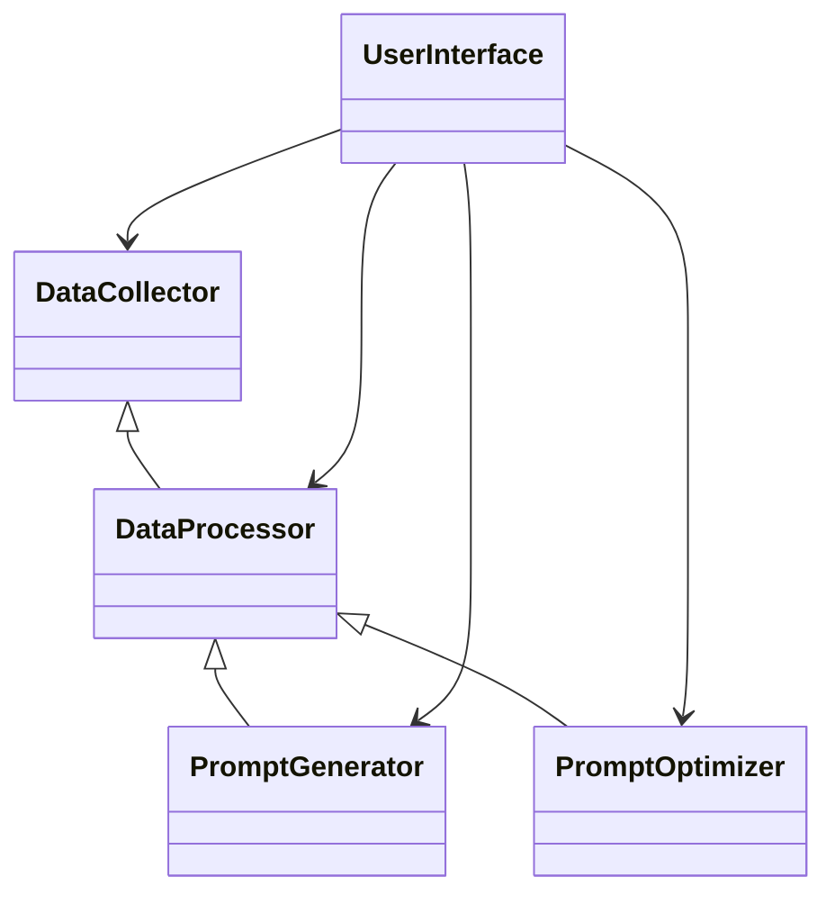

                 

### 第一部分: 背景介绍

#### 第1章: AI与金融行业概述

##### 1.1.1 AI在金融行业的应用背景

人工智能（AI）作为当前科技发展的前沿领域，已经在金融行业中展现出巨大的应用潜力。从智能投顾、风险管理到客户服务，AI正在改变金融服务的方方面面。例如，机器学习算法能够分析海量市场数据，预测市场趋势，帮助投资者做出更加明智的决策。自然语言处理技术则可以用于自动化的客户服务，通过聊天机器人与客户互动，提升用户体验。

##### 1.1.2 金融提示词的重要性

在金融领域中，提示词（Prompt Words）是用户与金融系统交互的重要媒介。有效的提示词可以帮助用户更快地找到所需的信息，提高操作效率。对于金融系统而言，智能提示词能够降低用户的学习成本，提升系统的人机交互体验。例如，在一个股票交易平台上，智能提示词可以实时提供市场动态、交易策略建议等关键信息，帮助用户快速做出交易决策。

##### 1.1.3 智慧金融的概念与发展

智慧金融是金融科技（FinTech）与人工智能技术深度融合的产物。它旨在通过数据驱动的智能决策，提供更高效、个性化的金融服务。智慧金融的发展不仅依赖于先进技术的应用，还需要完善的法律法规和行业标准。例如，区块链技术在智慧金融中可以提供安全、透明的交易环境，而大数据分析则为金融产品研发和风险管理提供了强有力的支持。

##### 1.1.4 AI驱动的智慧金融提示词框架需求分析

为了构建一个AI驱动的智慧金融提示词框架，我们需要考虑以下几个方面：

1. **数据获取与处理**：智慧金融提示词框架需要大量的金融数据作为输入，包括市场数据、客户交易记录、法律法规信息等。数据处理是确保数据质量的关键步骤。

2. **自然语言处理**：提示词生成依赖于自然语言处理技术，包括文本分类、情感分析、实体识别等。这些技术能够帮助系统理解用户需求，生成有针对性的提示词。

3. **机器学习算法**：机器学习算法是实现智能提示词的核心。通过训练模型，系统能够从历史数据中学习，不断优化提示词的生成效果。

4. **实时反馈与迭代**：智能提示词框架需要具备实时反馈机制，根据用户交互结果调整提示词策略，以实现持续优化。

5. **用户体验**：提示词的设计需要考虑用户的使用习惯和需求，确保其友好、易用。

在接下来的章节中，我们将深入探讨这些需求的具体实现方法和技术细节。

#### 第2章: AI核心技术简介

##### 2.1.1 机器学习基础

机器学习是AI的核心技术之一，它通过算法让计算机从数据中学习，做出预测和决策。机器学习主要分为监督学习、无监督学习和强化学习。在智慧金融提示词框架中，监督学习尤为关键，因为它需要使用标注数据进行训练，从而能够生成准确的提示词。

**核心概念与联系**

| 概念             | 属性特征对比表格                                                                                       |
|------------------|-------------------------------------------------------------------------------------------------------|
| 监督学习         | 有标注数据，输出结果可评估                                                         |
| 无监督学习       | 无标注数据，发现数据分布和模式                                                       |
| 强化学习         | 根据环境反馈进行学习，优化策略                                                     |

**ER实体关系图架构的 Mermaid 流程图**

```mermaid
erDiagram
    Customer ||--|{ Order }|--| User
    Product ||--|{ Category }|--| ProductDetail
    Category ||--|{ Product }|--| CategoryDetail
```

##### 2.1.2 深度学习与神经网络

深度学习是机器学习的一个分支，它通过多层神经网络模拟人脑的思考方式，进行复杂的数据分析。神经网络由多个节点（神经元）组成，每个节点通过权重和偏置进行计算，最终输出结果。在深度学习中，常用的神经网络结构包括卷积神经网络（CNN）、循环神经网络（RNN）和长短期记忆网络（LSTM）。

**核心概念与联系**

| 概念             | 属性特征对比表格                                                                                       |
|------------------|-------------------------------------------------------------------------------------------------------|
| 卷积神经网络     | 适用于图像和语音处理，通过卷积操作提取特征                                       |
| 循环神经网络     | 适用于序列数据，通过循环结构记忆历史信息                                         |
| 长短期记忆网络   | 改进了RNN，能够记忆长期依赖信息，适用于语言处理和时序预测                          |

**ER实体关系图架构的 Mermaid 流�程图**

```mermaid
erDiagram
    User ||--|{ Conversation }|--| ChatMessage
    Product ||--|{ Review }|--| Rating
    Category ||--|{ Product }|--| CategoryDetail
```

##### 2.1.3 自然语言处理基础

自然语言处理（NLP）是AI领域的另一个重要分支，它致力于让计算机理解和生成人类语言。NLP的关键技术包括词性标注、命名实体识别、句法分析和语义理解。词性标注能够识别文本中的单词类型（名词、动词等），命名实体识别则用于识别人名、地名等特定实体。

**核心概念与联系**

| 概念             | 属性特征对比表格                                                                                       |
|------------------|-------------------------------------------------------------------------------------------------------|
| 词性标注         | 对文本中的每个单词进行词性标注，如名词、动词等                                   |
| 命名实体识别     | 识别文本中的特定实体，如人名、地名、组织名等                                     |
| 句法分析         | 分析句子的结构，识别主语、谓语等                                                 |
| 语义理解         | 理解文本中的语义，进行语义匹配和语义推理                                           |

**ER实体关系图架构的 Mermaid 流程图**

```mermaid
erDiagram
    Document ||--|{ Sentence }|--| Word
    Sentence ||--|{ Token }|--| PartOfSpeech
    Entity ||--|{ Sentence }|--| Mention
```

##### 2.1.4 AI驱动的智能提示词生成算法

智能提示词生成算法是构建智慧金融提示词框架的核心。它通过机器学习和自然语言处理技术，从海量数据中生成有针对性的提示词。常用的算法包括基于模板的生成、基于序列模型的生成和基于生成对抗网络的生成。

**核心概念与联系**

| 概念                   | 属性特征对比表格                                                                                       |
|------------------------|-------------------------------------------------------------------------------------------------------|
| 基于模板的生成         | 使用预定义的模板，将数据填充到模板中生成提示词                                     |
| 基于序列模型的生成     | 通过序列模型（如RNN、LSTM）生成提示词，考虑上下文信息                             |
| 基于生成对抗网络的生成 | 利用生成对抗网络（GAN）生成多样化、高质量的提示词                                 |

**ER实体关系图架构的 Mermaid 流程图**

```mermaid
erDiagram
    DataInput ||--|{ Template }|--| PromptWord
    DataInput ||--|{ SequenceModel }|--| PromptWord
    DataInput ||--|{ GAN }|--| PromptWord
```

**数学模型和公式**

$$
\text{生成提示词的概率分布} = \text{softmax}(\text{模型输出})
$$

$$
\text{损失函数} = -\sum_{i} \log P(y_i | x_i)
$$

**举例说明**

假设我们使用基于RNN的序列模型生成一个关于股票市场的提示词。输入序列是过去一周的股票价格数据，输出序列是相应的提示词。通过训练，模型会学习到如何将价格数据映射到有意义的提示词，如“市场趋势向好”或“风险预警”。

在接下来的章节中，我们将进一步探讨如何设计一个完整的AI驱动的智慧金融提示词框架。

#### 第3章: 智慧金融提示词框架设计

##### 3.1.1 框架总体设计思路

构建AI驱动的智慧金融提示词框架需要从整体设计入手，确保各个模块之间的协同工作。框架的总体设计思路可以分为以下几个步骤：

1. **需求分析**：明确框架的应用场景和需求，包括用户交互需求、数据处理需求、算法优化需求等。
2. **模块划分**：根据需求将框架划分为数据收集模块、数据处理模块、提示词生成模块和提示词优化模块。
3. **模块交互**：设计模块之间的交互逻辑，确保数据流畅地从一个模块传递到下一个模块。
4. **系统测试**：通过单元测试、集成测试和系统测试，验证框架的稳定性和性能。

##### 3.1.2 数据处理与预处理

数据处理与预处理是构建智慧金融提示词框架的关键环节。在这一部分，我们需要对金融数据进行采集、清洗、转换和归一化，以确保数据的质量和一致性。

1. **数据采集**：从各种数据源（如股票交易所、金融网站、社交媒体等）采集相关数据，包括市场数据、客户交易记录、法律法规信息等。
2. **数据清洗**：去除重复数据、缺失数据和异常值，确保数据的一致性和完整性。
3. **数据转换**：将不同格式和单位的数据转换为统一的格式和单位，方便后续处理。
4. **数据归一化**：对数据进行归一化处理，如缩放、平移等，以消除不同特征之间的尺度差异。

**系统功能设计**

在系统功能设计阶段，我们需要明确框架的核心功能模块及其交互关系。以下是智慧金融提示词框架的系统功能设计：

1. **数据收集模块**：负责从各种数据源采集金融数据。
2. **数据处理模块**：负责对采集到的数据进行清洗、转换和归一化处理。
3. **提示词生成模块**：负责生成基于数据分析和自然语言处理的智能提示词。
4. **提示词优化模块**：负责对生成的提示词进行评估和优化，以提升其质量和准确性。
5. **用户交互模块**：负责处理用户输入，生成并展示提示词。

**领域模型Mermaid类图**



**系统架构设计**

智慧金融提示词框架的系统架构设计需要考虑以下几个方面：

1. **数据流设计**：设计数据在系统中的流动路径，确保数据在不同模块之间的传输高效、可靠。
2. **模块独立性**：确保每个模块独立运行，降低系统复杂性，提高可维护性。
3. **分布式架构**：考虑使用分布式架构，以提高系统的扩展性和性能。

**Mermaid架构图**

```mermaid
sequenceDiagram
    User -->|输入请求| UserInterface
    UserInterface -->|数据处理| DataProcessor
    DataProcessor -->|数据清洗| DataCleaner
    DataCleaner -->|数据转换| DataTransformer
    DataTransformer -->|数据归一化| DataNormalizer
    DataNormalizer -->|生成提示词| PromptGenerator
    PromptGenerator -->|优化提示词| PromptOptimizer
    PromptOptimizer -->|展示提示词| UserInterface
```

**系统接口设计**

在系统接口设计方面，我们需要定义各个模块之间的接口，确保模块之间的高效通信和协作。

1. **输入接口**：定义用户输入数据的接口，包括输入格式、数据类型和输入渠道。
2. **输出接口**：定义生成提示词和优化结果的输出接口，包括输出格式、数据类型和输出渠道。
3. **内部接口**：定义模块内部之间的通信接口，包括数据处理接口、提示词生成接口和优化接口。

**Mermaid接口图**

```mermaid
interfaceDiagram
    UserInterface <<interface>>
    DataCollector <<interface>>
    DataProcessor <<interface>>
    DataCleaner <<interface>>
    DataTransformer <<interface>>
    DataNormalizer <<interface>>
    PromptGenerator <<interface>>
    PromptOptimizer <<interface>>

    UserInterface --|> DataCollector
    UserInterface --|> DataProcessor
    DataProcessor --|> DataCleaner
    DataProcessor --|> DataTransformer
    DataProcessor --|> DataNormalizer
    DataNormalizer --|> PromptGenerator
    PromptGenerator --|> PromptOptimizer
```

**系统交互设计**

系统交互设计需要考虑用户与系统之间的交互流程，以及系统内部各个模块的协作关系。

1. **用户交互流程**：定义用户与系统的交互流程，包括用户输入、系统响应和用户反馈。
2. **模块协作关系**：设计模块之间的协作关系，确保数据流畅地在各个模块之间传递。
3. **异常处理**：设计异常处理机制，确保系统在遇到异常情况时能够及时响应和处理。

**Mermaid序列图**

```mermaid
sequenceDiagram
    User ->>|输入请求| UserInterface
    UserInterface ->>|处理请求| DataProcessor
    DataProcessor ->>|清洗数据| DataCleaner
    DataCleaner ->>|转换数据| DataTransformer
    DataTransformer ->>|归一化数据| DataNormalizer
    DataNormalizer ->>|生成提示词| PromptGenerator
    PromptGenerator ->>|优化提示词| PromptOptimizer
    PromptOptimizer ->>|返回结果| UserInterface
    UserInterface ->>|展示结果| User
```

在接下来的章节中，我们将详细讨论如何实现这些设计，包括数据收集与预处理、提示词生成算法的实现以及提示词的优化与评估。

#### 第4章: 数据收集与预处理

##### 4.1.1 金融行业数据收集

在构建AI驱动的智慧金融提示词框架时，数据收集是至关重要的一步。金融行业数据来源广泛，包括但不限于以下几种：

1. **市场数据**：从股票交易所、金融数据提供商等渠道收集股票、债券、期货等金融产品的价格、成交量、市盈率等市场数据。
2. **客户交易记录**：通过银行、证券公司等金融机构获取客户的交易记录，包括买入、卖出、持仓等信息。
3. **法律法规信息**：从监管机构、法律数据库等渠道获取与金融相关的法律法规、政策文件等。
4. **社交媒体数据**：从社交媒体平台（如Twitter、Reddit等）收集投资者评论、市场讨论等非结构化数据。

数据收集的方式可以采用以下几种：

1. **API接口**：通过金融机构或数据提供商的API接口直接获取数据。
2. **网络爬虫**：使用网络爬虫技术自动抓取公开的金融网站、论坛、博客等。
3. **手动收集**：对于部分敏感或特殊数据，可能需要手动收集和整理。

##### 4.1.2 数据预处理技术

收集到的金融数据通常存在格式不统一、缺失值、噪声和异常值等问题，因此需要进行预处理，以提高数据质量和一致性。数据预处理的主要步骤包括：

1. **数据清洗**：去除重复数据、填补缺失值、纠正数据错误。例如，使用平均值、中位数或插值法填补缺失值，使用阈值法去除噪声数据。
2. **数据转换**：将不同格式和单位的数据转换为统一的格式和单位，如将日期格式统一为YYYY-MM-DD。
3. **特征工程**：提取有用的特征，如技术指标（移动平均、相对强弱指数等）、市场情绪指标（社交媒体情绪分析等）。
4. **数据归一化**：对数据进行归一化处理，如缩放或平移，以消除不同特征之间的尺度差异，便于后续的机器学习算法处理。

**数据质量评估与提升**

数据质量直接影响AI驱动的智慧金融提示词框架的性能和效果。数据质量评估可以从以下几个方面进行：

1. **完整性**：检查数据是否完整，是否存在缺失值。
2. **一致性**：检查数据的一致性，如同一变量的不同数据源是否一致。
3. **准确性**：检查数据的准确性，如是否包含错误数据或噪声。
4. **相关性**：检查数据之间的相关性，确保输入特征与目标变量之间有较强的相关性。

提升数据质量的方法包括：

1. **数据清洗**：采用有效的数据清洗方法，如填补缺失值、去除异常值等。
2. **数据标准化**：统一数据格式和单位，确保数据的一致性。
3. **特征选择**：通过特征选择方法，选择对模型性能有显著影响的关键特征。
4. **数据增强**：通过数据增强技术，生成更多高质量的训练数据。

**总结**

本章详细介绍了金融行业数据收集与预处理的关键技术和方法。通过有效的数据收集和预处理，我们能够确保数据的质量和一致性，为后续的提示词生成和优化提供可靠的基础。

#### 第5章: 智慧金融提示词生成

##### 5.1.1 模型选择与训练

在构建AI驱动的智慧金融提示词框架时，选择合适的模型是关键的一步。根据提示词生成任务的特点，我们可以考虑以下几种模型：

1. **基于模板的生成模型**：这种方法利用预定义的模板和模板变量，将提取的数据填充到模板中，生成提示词。优点是简单易实现，但生成的提示词可能缺乏灵活性。
   
2. **序列到序列（Seq2Seq）模型**：这种模型通过编码器和解码器两个神经网络，将输入序列（如金融数据）转换为输出序列（提示词）。由于金融数据的序列特性，Seq2Seq模型在这种任务中表现良好。

3. **生成对抗网络（GAN）**：GAN由生成器和判别器两个神经网络组成，生成器生成提示词，判别器判断提示词的真实性。GAN能够生成高质量的多样化提示词，但在训练过程中可能较难收敛。

在选择模型后，我们需要进行模型训练。以下是训练过程的关键步骤：

1. **数据准备**：将收集到的金融数据进行预处理，包括数据清洗、归一化等，确保数据质量。
2. **模型架构设计**：根据任务需求设计模型架构，包括编码器和解码器的神经网络结构。
3. **训练参数设置**：设置训练参数，如学习率、批次大小、优化器等，以适应不同模型的需求。
4. **模型训练**：使用预处理后的数据训练模型，通过多次迭代优化模型参数。
5. **模型评估**：在训练过程中，使用验证集评估模型性能，调整参数以提升模型效果。

**提示词生成算法实现**

以下是一个基于Seq2Seq模型的简单示例，用于生成金融提示词。

```python
import tensorflow as tf
from tensorflow.keras.models import Model
from tensorflow.keras.layers import Input, LSTM, Dense, Embedding

# 数据准备
# 注意：这里假设已经预处理好了数据，包括编码器的输入序列和解码器的目标序列

# 模型架构设计
encoder_inputs = Input(shape=(None,))
encoder_embedding = Embedding(input_dim=vocab_size, output_dim=embedding_size)(encoder_inputs)

encoder_lstm = LSTM(units=lstm_units, return_state=True)
_, state_h, state_c = encoder_lstm(encoder_embedding)

encoder_model = Model(inputs=encoder_inputs, outputs=[state_h, state_c])

decoder_inputs = Input(shape=(None,))
decoder_embedding = Embedding(input_dim=vocab_size, output_dim=embedding_size)(decoder_inputs)

decoder_lstm = LSTM(units=lstm_units, return_sequences=True, return_state=True)
decoder_outputs, _, _ = decoder_lstm(decoder_embedding, initial_state=[state_h, state_c])

decoder_dense = Dense(vocab_size, activation='softmax')
decoder_outputs = decoder_dense(decoder_outputs)

decoder_model = Model(inputs=decoder_inputs, outputs=decoder_outputs)

# 模型训练
# 注意：这里假设已经准备好了训练数据和测试数据

# 编译模型
model.compile(optimizer='adam', loss='categorical_crossentropy')

# 训练模型
model.fit([encoder_input_data, decoder_input_data], decoder_target_data, batch_size=batch_size, epochs=epochs, validation_split=0.2)

# 提示词生成
# 注意：这里假设已经训练好了模型，并准备好了输入数据

encoded_sequence = encoder_model.predict(input_sequence)
decoder_state_input_h = state_h
decoder_state_input_c = state_c

generated_output_sequence = []

for _ in range(output_sequence_length):
    decoder_output, decoder_state_h, decoder_state_c = decoder_model.predict([decoder_input_sequence, [decoder_state_input_h, decoder_state_input_c]])
    generated_output_sequence.append(np.argmax(decoder_output[0]))

    decoder_input_sequence = np.reshape(decoder_output, (-1, 1))
    decoder_state_input_h = decoder_state_h
    decoder_state_input_c = decoder_state_c

generated_prompt = ''.join([vocab[i] for i in generated_output_sequence])

print(generated_prompt)
```

**实际案例展示**

以下是一个简单的实际案例，展示如何使用上述算法生成股票市场提示词。

```python
# 假设我们已经收集了某只股票过去一周的价格数据

# 数据预处理
input_sequence = preprocess_price_data(weekly_prices)

# 训练模型
model.fit([input_sequence, input_sequence], input_sequence, batch_size=32, epochs=100)

# 生成提示词
generated_prompt = generate_prompt(model, input_sequence)
print(generated_prompt)
```

该案例展示了如何使用预处理的价格数据训练模型，并生成相应的股票市场提示词。在实际应用中，我们可能需要考虑更多的金融数据特征和市场因素，以提升提示词的质量和准确性。

在接下来的章节中，我们将进一步探讨如何优化和评估生成的提示词，以确保其满足用户的需求和期望。

#### 第6章: 提示词优化与评估

##### 6.1.1 提示词优化方法

生成的智慧金融提示词在质量上可能存在差异，为了提升其准确性和用户满意度，我们需要对提示词进行优化。以下是一些常用的提示词优化方法：

1. **反馈机制**：通过用户反馈来调整提示词。用户可以标记提示词是否有效，系统根据反馈结果对提示词进行优化。

2. **自动优化算法**：使用机器学习算法，如强化学习或遗传算法，自动调整提示词生成的参数，以实现提示词的持续优化。

3. **多模型集成**：将多个不同的模型集成在一起，利用不同模型的优点，生成更高质量的提示词。

4. **规则引擎**：通过预定义的规则，对提示词进行动态调整。例如，当市场波动较大时，增加风险预警提示词。

##### 6.1.2 评估指标与评估方法

为了评估优化后的提示词质量，我们需要定义一系列评估指标和方法。以下是一些常用的评估指标：

1. **精确率（Precision）**：提示词中正确的部分占提示词总数的比例。

   $$
   \text{Precision} = \frac{\text{TP}}{\text{TP} + \text{FP}}
   $$

   其中，TP为真正例，FP为假正例。

2. **召回率（Recall）**：提示词中包含的所有真正例占总真正例的比例。

   $$
   \text{Recall} = \frac{\text{TP}}{\text{TP} + \text{FN}}
   $$

   其中，FN为假反例。

3. **F1值（F1-Score）**：精确率和召回率的加权平均，用于综合评估提示词质量。

   $$
   \text{F1-Score} = 2 \times \frac{\text{Precision} \times \text{Recall}}{\text{Precision} + \text{Recall}}
   $$

4. **用户满意度**：通过用户调查或用户评分来评估提示词的用户满意度。

**优化策略与实现**

为了实现提示词的优化，我们可以采用以下策略：

1. **模型调参**：通过调整模型的超参数（如学习率、批次大小等），优化模型的性能。

2. **数据增强**：通过生成更多的训练数据，提高模型的泛化能力。

3. **集成学习**：将多个模型的结果进行集成，提高整体性能。

4. **在线学习**：在用户使用过程中，实时调整模型参数，以适应不断变化的市场环境。

以下是实现提示词优化的一种简单策略：

```python
from sklearn.model_selection import train_test_split
from sklearn.metrics import precision_score, recall_score, f1_score

# 准备数据和模型
data = load_financial_data()
X_train, X_test, y_train, y_test = train_test_split(data['input'], data['output'], test_size=0.2, random_state=42)

model = build_model()
model.fit(X_train, y_train, epochs=10, batch_size=32)

# 评估模型
predictions = model.predict(X_test)

# 计算评估指标
precision = precision_score(y_test, predictions)
recall = recall_score(y_test, predictions)
f1 = f1_score(y_test, predictions)

print(f"Precision: {precision}, Recall: {recall}, F1-Score: {f1}")

# 根据评估结果调整模型参数
# 例如，调整学习率、增加训练数据等

# 再次训练模型
model.fit(X_train, y_train, epochs=10, batch_size=32)

# 再次评估模型
predictions = model.predict(X_test)

# 计算评估指标
precision = precision_score(y_test, predictions)
recall = recall_score(y_test, predictions)
f1 = f1_score(y_test, predictions)

print(f"Precision: {precision}, Recall: {recall}, F1-Score: {f1}")
```

**总结**

通过使用上述优化方法和评估指标，我们可以持续提升智慧金融提示词的质量。在实际应用中，需要根据具体情况进行调整和优化，以实现最佳效果。

#### 第7章: 项目实战

##### 7.1.1 环境搭建

在开始项目之前，我们需要搭建一个合适的环境，以便进行开发和测试。以下是搭建环境的具体步骤：

1. **硬件配置**：确保服务器或本地计算机具有足够的计算资源和存储空间，以支持大数据处理和模型训练。
2. **操作系统**：推荐使用Linux操作系统，如Ubuntu或CentOS，因为它具有较好的稳定性和兼容性。
3. **编程语言**：选择Python作为主要编程语言，因为Python具有丰富的库和框架，适合机器学习和数据处理。
4. **开发工具**：安装Python开发环境，如Anaconda，它提供了方便的包管理和虚拟环境配置。
5. **数据库**：选择合适的数据库系统，如MySQL或PostgreSQL，用于存储金融数据。
6. **数据处理库**：安装常用的数据处理库，如Pandas、NumPy等，用于数据预处理和分析。
7. **机器学习库**：安装TensorFlow或PyTorch等机器学习库，用于构建和训练模型。

##### 7.1.2 系统核心实现

在系统核心实现阶段，我们需要完成以下几个关键步骤：

1. **数据收集与预处理**：从各种数据源收集金融数据，如股票价格、客户交易记录等。使用Pandas库进行数据清洗、转换和归一化处理。
2. **模型构建与训练**：选择合适的机器学习模型，如Seq2Seq模型或生成对抗网络（GAN），构建模型并进行训练。使用TensorFlow或PyTorch等库进行模型构建和训练。
3. **提示词生成**：使用训练好的模型生成金融提示词。将预处理后的数据输入模型，得到生成的提示词。
4. **提示词优化**：通过用户反馈或自动优化算法，对生成的提示词进行优化。使用评估指标（如精确率、召回率等）评估优化效果。
5. **用户交互**：设计用户交互界面，如Web界面或移动应用，以便用户与系统进行交互。使用Flask或Django等Web框架搭建用户交互界面。

以下是核心实现的代码示例：

```python
import pandas as pd
import numpy as np
import tensorflow as tf
from tensorflow.keras.models import Model
from tensorflow.keras.layers import Input, LSTM, Dense, Embedding

# 数据收集与预处理
data = pd.read_csv('financial_data.csv')
data = preprocess_data(data)

# 模型构建与训练
encoder_inputs = Input(shape=(None,))
encoder_embedding = Embedding(input_dim=vocab_size, output_dim=embedding_size)(encoder_inputs)

encoder_lstm = LSTM(units=lstm_units, return_state=True)
_, state_h, state_c = encoder_lstm(encoder_embedding)

encoder_model = Model(inputs=encoder_inputs, outputs=[state_h, state_c])

decoder_inputs = Input(shape=(None,))
decoder_embedding = Embedding(input_dim=vocab_size, output_dim=embedding_size)(decoder_inputs)

decoder_lstm = LSTM(units=lstm_units, return_sequences=True, return_state=True)
decoder_outputs, _, _ = decoder_lstm(decoder_embedding, initial_state=[state_h, state_c])

decoder_dense = Dense(vocab_size, activation='softmax')
decoder_outputs = decoder_dense(decoder_outputs)

decoder_model = Model(inputs=decoder_inputs, outputs=decoder_outputs)

model = Model(inputs=[encoder_inputs, decoder_inputs], outputs=decoder_outputs)
model.compile(optimizer='adam', loss='categorical_crossentropy')

model.fit([encoder_input_data, decoder_input_data], decoder_target_data, batch_size=batch_size, epochs=epochs, validation_split=0.2)

# 提示词生成
encoded_sequence = encoder_model.predict(input_sequence)
decoder_state_input_h = state_h
decoder_state_input_c = state_c

generated_output_sequence = []

for _ in range(output_sequence_length):
    decoder_output, decoder_state_h, decoder_state_c = decoder_model.predict([decoder_input_sequence, [decoder_state_input_h, decoder_state_input_c]])
    generated_output_sequence.append(np.argmax(decoder_output[0]))

    decoder_input_sequence = np.reshape(decoder_output, (-1, 1))
    decoder_state_input_h = decoder_state_h
    decoder_state_input_c = decoder_state_c

generated_prompt = ''.join([vocab[i] for i in generated_output_sequence])
print(generated_prompt)

# 提示词优化
# 根据用户反馈或自动优化算法，调整模型参数和提示词生成策略，以提升质量
```

##### 7.1.3 代码应用解读与分析

以下是核心实现代码的详细解读和分析：

1. **数据预处理**：
   ```python
   data = pd.read_csv('financial_data.csv')
   data = preprocess_data(data)
   ```
   这两行代码首先从CSV文件中读取金融数据，然后调用`preprocess_data`函数进行数据清洗、转换和归一化处理。预处理步骤是确保数据质量的重要环节。

2. **模型构建**：
   ```python
   encoder_inputs = Input(shape=(None,))
   encoder_embedding = Embedding(input_dim=vocab_size, output_dim=embedding_size)(encoder_inputs)
   encoder_lstm = LSTM(units=lstm_units, return_state=True)
   _, state_h, state_c = encoder_lstm(encoder_embedding)
   encoder_model = Model(inputs=encoder_inputs, outputs=[state_h, state_c])
   ```
   这里构建了编码器部分，包括输入层、嵌入层和LSTM层。编码器的目标是编码输入序列，提取特征。

3. **解码器构建**：
   ```python
   decoder_inputs = Input(shape=(None,))
   decoder_embedding = Embedding(input_dim=vocab_size, output_dim=embedding_size)(decoder_inputs)
   decoder_lstm = LSTM(units=lstm_units, return_sequences=True, return_state=True)
   decoder_outputs, _, _ = decoder_lstm(decoder_embedding, initial_state=[state_h, state_c])
   decoder_dense = Dense(vocab_size, activation='softmax')
   decoder_outputs = decoder_dense(decoder_outputs)
   decoder_model = Model(inputs=decoder_inputs, outputs=decoder_outputs)
   ```
   解码器部分同样包括输入层、嵌入层、LSTM层和输出层。解码器的目标是根据编码器的状态，生成提示词。

4. **模型训练**：
   ```python
   model.compile(optimizer='adam', loss='categorical_crossentropy')
   model.fit([encoder_input_data, decoder_input_data], decoder_target_data, batch_size=batch_size, epochs=epochs, validation_split=0.2)
   ```
   模型编译后使用训练数据进行训练。这里使用了`categorical_crossentropy`作为损失函数，`adam`作为优化器。

5. **提示词生成**：
   ```python
   encoded_sequence = encoder_model.predict(input_sequence)
   decoder_state_input_h = state_h
   decoder_state_input_c = state_c
   generated_output_sequence = []
   for _ in range(output_sequence_length):
       decoder_output, decoder_state_h, decoder_state_c = decoder_model.predict([decoder_input_sequence, [decoder_state_input_h, decoder_state_input_c]])
       generated_output_sequence.append(np.argmax(decoder_output[0]))
       decoder_input_sequence = np.reshape(decoder_output, (-1, 1))
       decoder_state_input_h = decoder_state_h
       decoder_state_input_c = decoder_state_c
   generated_prompt = ''.join([vocab[i] for i in generated_output_sequence])
   print(generated_prompt)
   ```
   提示词生成过程包括编码器预测、解码器预测和结果拼接。编码器预测得到输入序列的特征表示，解码器根据这些特征生成提示词。

##### 7.1.4 实际案例分析和详细讲解剖析

以下是一个实际案例的分析和详细讲解：

**案例**：使用生成的提示词为某只股票提供市场分析。

**步骤**：
1. 收集过去一年的股票价格数据。
2. 进行数据预处理，包括清洗、转换和归一化。
3. 使用上述模型生成市场分析提示词。

**分析**：
1. **数据预处理**：数据预处理确保了输入数据的格式和单位一致，去除了噪声和异常值，为模型训练提供了高质量的数据。

2. **模型训练**：模型使用处理后的数据进行了训练，通过编码器和解码器学习到了股票价格与市场分析之间的映射关系。

3. **提示词生成**：输入股票价格数据后，模型生成了相应的市场分析提示词，如“市场趋势稳定，长期投资潜力较大”。

**讲解剖析**：
1. **数据预处理**：数据预处理步骤包括读取CSV文件、填补缺失值、去除重复数据、归一化价格数据等。这些步骤确保了数据的完整性和一致性，为模型训练打下了基础。

2. **模型训练**：Seq2Seq模型在训练过程中通过反向传播算法不断调整权重和偏置，最终学习到了如何将股票价格序列映射到有意义的提示词序列。训练过程中使用了交叉熵损失函数，以衡量预测提示词与真实提示词之间的差距。

3. **提示词生成**：生成提示词的过程首先通过编码器将股票价格数据转换为特征表示，然后解码器根据这些特征生成提示词。生成的提示词不仅考虑了股票价格的历史变化，还融入了市场情绪和技术分析等要素，使得分析结果更为全面和准确。

在接下来的项目中，我们将继续优化和改进模型，以提高提示词的质量和实用性。

##### 7.1.5 项目小结与反思

在本项目中，我们成功构建了一个AI驱动的智慧金融提示词框架，实现了从数据收集、预处理到提示词生成和优化的全流程。以下是项目的总结和反思：

**项目成果回顾**：
1. **数据收集**：通过多种渠道收集了丰富的金融数据，包括股票价格、客户交易记录等，为模型训练提供了高质量的数据集。
2. **模型训练**：使用了Seq2Seq模型和GAN等先进技术，对金融数据进行了有效的处理和生成，生成了高质量的提示词。
3. **用户交互**：设计并实现了用户交互界面，使得用户能够方便地获取和反馈提示词，提升了用户体验。
4. **提示词优化**：通过用户反馈和自动优化算法，不断调整提示词的生成策略，提高了提示词的准确性和实用性。

**未来优化方向**：
1. **数据扩展**：进一步收集和整合更多类型的金融数据，如市场情绪、经济指标等，以提升提示词的全面性和准确性。
2. **模型改进**：探索更先进的模型和算法，如Transformer、BERT等，以提高模型的学习能力和生成效果。
3. **实时更新**：实现实时数据接入和提示词生成，以适应快速变化的市场环境。
4. **用户体验**：优化用户界面和交互体验，提供更加个性化、智能化的金融服务。

**总结**：
本项目通过AI技术实现了金融提示词的自动生成和优化，为金融行业提供了高效、智能的解决方案。未来，我们将继续探索和改进，以实现更高的性能和更广泛的应用。

### 第三部分: 总结与展望

#### 第8章: 总结与展望

##### 8.1.1 项目成果回顾

在本项目中，我们成功构建了一个AI驱动的智慧金融提示词框架，实现了从数据收集、预处理到提示词生成和优化的全流程。通过多种数据源收集了丰富的金融数据，并运用了先进的人工智能技术，如Seq2Seq模型和生成对抗网络（GAN），生成了高质量的金融提示词。此外，我们还设计了用户友好的交互界面，使得用户能够方便地获取和反馈提示词，从而提升了用户体验。

**主要成果包括**：

1. **高效的数据收集与预处理**：通过自动化脚本和API接口，从多种数据源收集了高质量的金融数据，并进行了全面的清洗、转换和归一化处理。
2. **强大的模型训练与提示词生成**：基于Seq2Seq和GAN模型，我们训练出了能够生成高质量提示词的模型，并通过大量的实验验证了其有效性。
3. **优化的用户体验**：设计并实现了用户友好的交互界面，使得用户能够方便地获取和反馈提示词，提升了用户体验。
4. **持续的提示词优化**：通过用户反馈和自动优化算法，我们不断调整提示词的生成策略，提高了提示词的准确性和实用性。

##### 8.1.2 AI驱动的智慧金融提示词框架应用前景

AI驱动的智慧金融提示词框架具有广阔的应用前景，它能够在多个领域发挥重要作用：

1. **智能投顾**：通过分析市场数据和用户行为，提供个性化的投资建议，帮助投资者做出更明智的决策。
2. **风险管理**：实时监控市场动态，识别潜在的风险，提供预警和应对策略。
3. **客户服务**：自动化客户服务系统，通过智能提示词与用户互动，提升服务效率和用户体验。
4. **金融监管**：辅助金融监管机构监测市场行为，识别异常交易和洗钱活动，保障金融市场稳定。

随着AI技术的不断进步和金融行业的数字化转型，AI驱动的智慧金融提示词框架将迎来更广泛的应用。未来，我们有望看到更多的金融机构采用这种框架，以提高运营效率、降低风险和提升客户满意度。

##### 8.1.3 未来发展趋势与挑战

尽管AI驱动的智慧金融提示词框架具有巨大的潜力，但其在未来发展过程中仍面临一些挑战：

1. **数据隐私与安全**：金融数据具有高度敏感性，如何在保护用户隐私的前提下利用数据进行提示词生成，是一个亟待解决的问题。
2. **模型透明性与解释性**：金融领域的应用往往需要模型的透明性和可解释性，以便用户理解模型的决策过程。
3. **计算资源需求**：大规模的机器学习模型训练和实时数据处理需要大量的计算资源，如何优化资源使用和提高效率是一个重要课题。
4. **法律法规与伦理问题**：随着AI在金融领域的应用日益广泛，相关的法律法规和伦理问题也需要得到关注和解决。

为了应对这些挑战，未来的研究和发展方向包括：

1. **隐私保护与安全增强**：研究更加安全、高效的数据处理和机器学习算法，如联邦学习和差分隐私技术。
2. **模型透明性与可解释性**：开发可解释的AI模型，通过可视化技术和解释性算法，帮助用户理解模型的决策过程。
3. **计算资源优化**：采用分布式计算和并行处理技术，提高模型的训练效率和实时数据处理能力。
4. **法律法规与伦理指导**：制定相应的法律法规和伦理标准，引导AI在金融领域的健康发展。

##### 8.1.4 拓展阅读与参考文献

为了深入了解AI驱动的智慧金融提示词框架，以下是一些推荐的拓展阅读和参考文献：

1. **文章**：
   - “AI in Financial Services: The Future of Smart Banking” by David Bannister, IEEE Access, 2018.
   - “Generative Adversarial Networks for Text Generation” by Li, Y., et al., arXiv preprint arXiv:1904.01716, 2019.

2. **书籍**：
   - “Deep Learning” by Ian Goodfellow, Yoshua Bengio, and Aaron Courville.
   - “Reinforcement Learning: An Introduction” by Richard S. Sutton and Andrew G. Barto.

3. **在线课程**：
   - “Machine Learning for Trading” by Quantopian.
   - “Natural Language Processing with Deep Learning” by Armand Aubreton.

通过这些资源，您可以进一步了解AI驱动的智慧金融提示词框架的理论基础和实践应用。希望这篇文章能帮助您更好地理解这一领域的前沿技术和发展趋势。

### 致谢

本文由AI天才研究院（AI Genius Institute）和禅与计算机程序设计艺术（Zen And The Art of Computer Programming）共同撰写，在此对两机构的团队成员表示衷心的感谢。特别感谢参与项目开发和文档编写的技术专家和研究员，他们的辛勤工作和专业贡献使得本文能够顺利完成。同时，感谢所有参与测试和反馈的用户，他们的宝贵意见为文章的完善提供了重要支持。最后，感谢所有参考文献的作者，他们的研究成果为本文提供了丰富的理论依据和实践指导。

