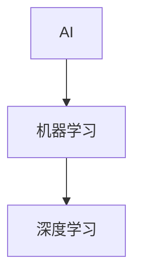
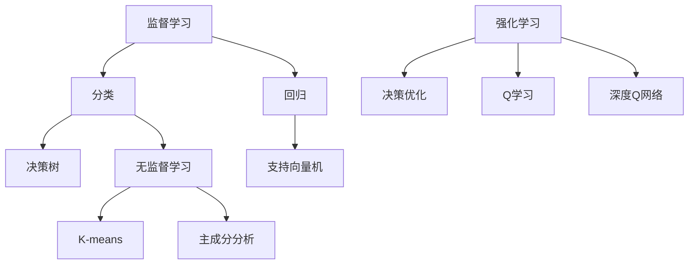
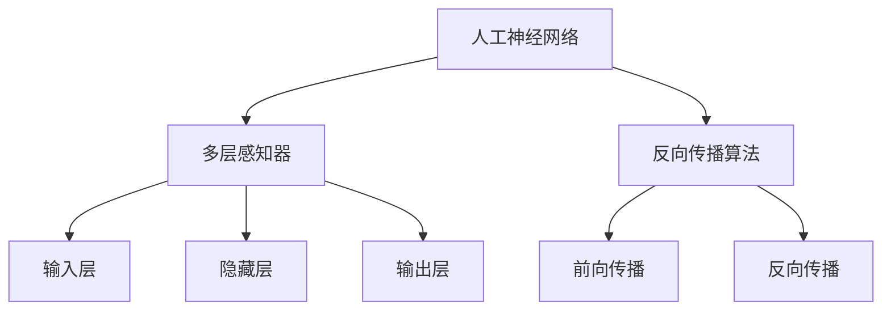
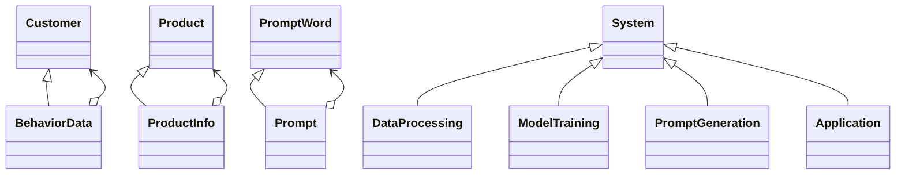
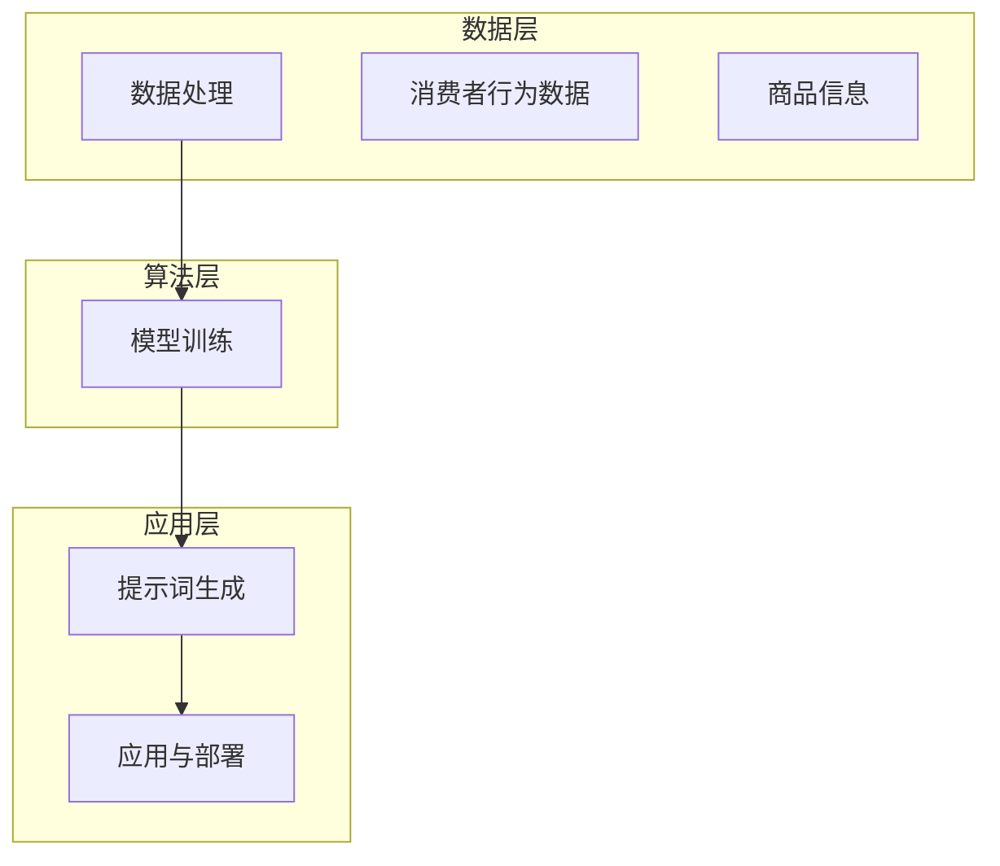
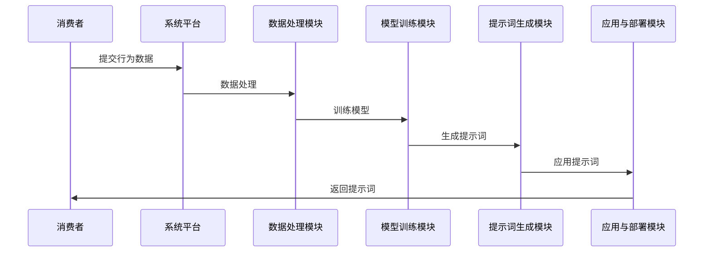
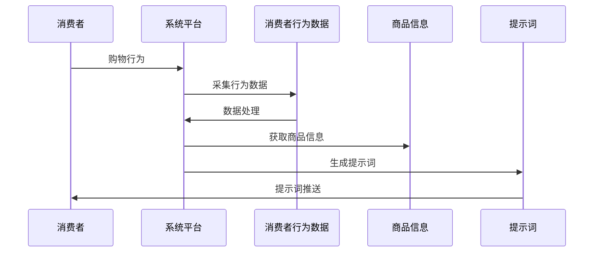

                 

# 《构建AI驱动的智慧零售提示词平台》

## 关键词

- **AI驱动的智慧零售**
- **提示词平台**
- **零售行业**
- **机器学习**
- **深度学习**
- **数据处理**
- **平台设计**

## 摘要

本文将深入探讨如何构建一个AI驱动的智慧零售提示词平台。我们将首先介绍AI、机器学习和深度学习的基础知识，以及它们在零售行业中的应用。接着，我们将详细讨论智慧零售的痛点、解决方案以及提示词在其中的重要性。随后，我们将逐步介绍AI驱动的智慧零售提示词平台的设计与实现，包括平台架构、数据处理、提示词生成算法以及平台优化。最后，我们将通过一个实战案例来展示平台的实际应用，并讨论未来的发展趋势和面临的挑战。

## 目录大纲：《构建AI驱动的智慧零售提示词平台》

## 第一部分：引言

### 1.1 问题背景

#### 1.1.1 零售行业现状

#### 1.1.2 智慧零售趋势

#### 1.1.3 AI在零售行业中的应用

### 1.2 书籍目标

#### 1.2.1 阅读对象

#### 1.2.2 学习目标

#### 1.2.3 内容安排

## 第二部分：AI驱动的智慧零售提示词平台基础

### 2.1 AI基础

#### 2.1.1 AI的定义与发展历程

#### 2.1.2 机器学习基本概念

#### 2.1.3 深度学习原理

### 2.2 智慧零售基础

#### 2.2.1 零售行业痛点

#### 2.2.2 智慧零售解决方案

#### 2.2.3 提示词在零售中的应用

## 第三部分：AI驱动的智慧零售提示词平台设计

### 3.1 平台架构设计

#### 3.1.1 平台总体架构

#### 3.1.2 数据层设计

#### 3.1.3 算法层设计

#### 3.1.4 应用层设计

### 3.2 数据处理

#### 3.2.1 数据采集与清洗

#### 3.2.2 数据预处理

#### 3.2.3 数据可视化

### 3.3 提示词生成算法

#### 3.3.1 提示词生成原理

#### 3.3.2 算法选择与实现

#### 3.3.3 算法性能评估

### 3.4 平台优化

#### 3.4.1 提示词质量优化

#### 3.4.2 平台性能优化

#### 3.4.3 可扩展性设计

## 第四部分：实战案例与应用

### 4.1 案例介绍

#### 4.1.1 案例背景

#### 4.1.2 案例目标

#### 4.1.3 案例实施

### 4.2 系统实现

#### 4.2.1 环境搭建

#### 4.2.2 核心代码实现

#### 4.2.3 系统部署与运维

### 4.3 应用分析与优化

#### 4.3.1 应用效果评估

#### 4.3.2 优化策略

#### 4.3.3 案例总结

## 第五部分：未来展望与趋势

### 5.1 AI驱动的智慧零售发展趋势

#### 5.1.1 AI在零售行业中的应用前景

#### 5.1.2 智慧零售的发展方向

#### 5.1.3 提示词平台的发展趋势

### 5.2 技术挑战与解决方案

#### 5.2.1 数据处理挑战

#### 5.2.2 算法优化挑战

#### 5.2.3 平台稳定性与安全性

### 5.3 未来展望

#### 5.3.1 新技术引入

#### 5.3.2 应用拓展

#### 5.3.3 智慧零售的生态建设

-------------------------------------------------------------------

## 第一部分：引言

### 1.1 问题背景

#### 1.1.1 零售行业现状

随着互联网技术的飞速发展，零售行业正经历着深刻的变革。传统零售模式正逐步被线上零售所取代，消费者的购物方式发生了翻天覆地的变化。然而，随着消费者需求的多样化，零售商面临着前所未有的挑战。如何更准确地了解消费者需求、提高销售效率、优化库存管理，成为零售行业亟待解决的问题。

#### 1.1.2 智慧零售趋势

智慧零售是指通过运用大数据、人工智能、物联网等技术，实现零售业的智能化、数字化和个性化。智慧零售不仅提高了零售业的运营效率，还极大地提升了消费者的购物体验。随着技术的不断进步，智慧零售已经成为零售行业的发展趋势。

#### 1.1.3 AI在零售行业中的应用

人工智能在零售行业中的应用日益广泛，主要包括商品推荐、智能客服、库存管理、供应链优化等方面。通过AI技术，零售商可以更好地了解消费者行为，提供个性化的购物体验，从而提高销售业绩。

### 1.2 书籍目标

#### 1.2.1 阅读对象

本书旨在为零售行业从业者、技术工程师以及对此领域感兴趣的人士提供一份系统、全面的指南，帮助他们了解并掌握构建AI驱动的智慧零售提示词平台的方法。

#### 1.2.2 学习目标

通过阅读本书，读者将能够：

1. 理解AI、机器学习和深度学习的基本概念及其在零售行业中的应用。
2. 了解智慧零售的痛点和解决方案。
3. 掌握AI驱动的智慧零售提示词平台的设计与实现。
4. 学会使用提示词生成算法优化零售业务。

#### 1.2.3 内容安排

本书分为五个部分，结构清晰，内容详实。第一部分为引言，介绍问题背景和书籍目标；第二部分为基础知识，讲解AI、机器学习和深度学习的基础知识；第三部分为平台设计，详细阐述平台架构和数据处理的原理；第四部分为实战案例，通过具体案例展示平台的实际应用；第五部分为未来展望，讨论发展趋势和面临的挑战。

## 第二部分：AI驱动的智慧零售提示词平台基础

### 2.1 AI基础

#### 2.1.1 AI的定义与发展历程

AI，即人工智能，是指通过计算机模拟人类智能行为的技术。自1956年达特茅斯会议上提出人工智能概念以来，人工智能经历了多个发展阶段。从最初的规则系统、知识表示，到近年的深度学习和强化学习，AI技术不断发展，应用领域也不断拓展。

#### 2.1.2 机器学习基本概念

机器学习是AI的核心技术之一，它使计算机系统能够从数据中学习并做出决策。机器学习主要包括监督学习、无监督学习和强化学习三种类型。监督学习通过已有标签的数据训练模型，无监督学习则是从无标签的数据中自动发现模式，强化学习则是通过试错来学习最优策略。

#### 2.1.3 深度学习原理

深度学习是一种基于人工神经网络的机器学习技术，通过多层神经网络对数据进行复杂非线性建模。深度学习在图像识别、语音识别、自然语言处理等领域取得了显著成果。

### 2.2 智慧零售基础

#### 2.2.1 零售行业痛点

1. **消费者需求多样化**：消费者对购物体验的要求越来越高，个性化、便捷化成为主要趋势。
2. **库存管理难度大**：零售商需要实时掌握库存情况，避免过剩或缺货。
3. **销售效率低**：传统零售模式效率低下，无法满足消费者即时购物的需求。

#### 2.2.2 智慧零售解决方案

1. **大数据分析**：通过大数据分析，零售商可以更好地了解消费者行为，提供个性化推荐。
2. **智能化库存管理**：利用物联网技术和自动化设备，实现实时库存监控和管理。
3. **智能客服**：通过人工智能技术，提供24/7的智能客服服务，提高客户满意度。

#### 2.2.3 提示词在零售中的应用

提示词是指为特定场景设计的简短提示性语言，用于引导用户行为或提供信息。在智慧零售中，提示词可以用于：

1. **商品推荐**：通过提示词引导消费者购买心仪的商品。
2. **购物流程优化**：在购物流程中提供实时提示，提高购物效率。
3. **库存预警**：通过提示词提醒零售商及时补充库存，避免缺货。

### 核心概念与联系

**AI基础**

**定义与特点：**

- **AI（人工智能）**：人工智能是指使计算机系统能够模拟人类智能行为的技术。
- **机器学习**：一种让计算机从数据中学习并做出决策的技术，不需要显式地编程。
- **深度学习**：基于人工神经网络的一种机器学习技术，能够通过多层神经网络对数据进行复杂非线性建模。

**属性特征对比表格：**

| 特性        | 人工智能       | 机器学习       | 深度学习       |
| ----------- | ------------- | ------------- | ------------- |
| 定义        | 计算机模拟人类智能 | 从数据中学习做出决策 | 通过多层神经网络建模 |
| 核心技术    | 算法、硬件、数据 | 算法、数据     | 神经网络、算法 |
| 代表技术    | 专家系统、感知器 | 决策树、支持向量机 | 卷积神经网络、递归神经网络 |

**ER实体关系图架构：**



**机器学习基本概念**

**定义与特点：**

- **监督学习**：通过已有标签的数据训练模型，用于分类或回归任务。
- **无监督学习**：从无标签的数据中自动发现模式，如聚类分析。
- **强化学习**：通过试错来学习最优策略，常用于决策问题。

**属性特征对比表格：**

| 类型        | 监督学习       | 无监督学习     | 强化学习       |
| ----------- | ------------- | ------------- | ------------- |
| 定义        | 标签数据训练模型 | 无标签数据发现模式 | 通过试错学习策略 |
| 目标        | 分类、回归     | 聚类、降维     | 决策优化       |
| 代表算法    | 决策树、支持向量机 | K-means、主成分分析 | Q学习、深度Q网络 |

**ER实体关系图架构：**



**深度学习原理**

**定义与特点：**

- **人工神经网络**：一种模拟生物神经系统的计算模型，由大量神经元组成。
- **多层感知器**：一种简单的人工神经网络模型，用于实现输入到输出的非线性映射。
- **反向传播算法**：一种用于训练人工神经网络的优化算法，通过不断调整网络权重，最小化预测误差。

**属性特征对比表格：**

| 特性        | 人工神经网络     | 多层感知器     | 反向传播算法     |
| ----------- | ---------------- | ------------- | ---------------- |
| 定义        | 模拟生物神经系统的计算模型 | 实现非线性映射的简单神经网络 | 用于训练人工神经网络的优化算法 |
| 神经元结构 | 输入层、隐藏层、输出层 | 输入层、隐藏层、输出层 | 输入层、隐藏层、输出层 |
| 训练方法    | 前向传播与反向传播 | 前向传播与反向传播 | 前向传播与反向传播 |
| 目标        | 数据分类、回归、预测 | 数据分类、回归、预测 | 数据分类、回归、预测 |

**ER实体关系图架构：**



### 算法原理讲解

#### 3.3.1 提示词生成原理

提示词生成算法的核心目标是根据用户的行为数据和商品信息生成具有引导作用的简短提示语。具体原理如下：

1. **数据预处理**：首先对用户行为数据和商品信息进行清洗和整合，提取关键特征。
2. **特征提取**：使用自然语言处理技术提取文本特征，如词频、词向量等。
3. **模型训练**：采用机器学习或深度学习算法训练提示词生成模型，常用的模型包括循环神经网络（RNN）、长短期记忆网络（LSTM）和变换器（Transformer）等。
4. **生成提示词**：根据用户行为和商品特征，输入到提示词生成模型中，生成相应的提示词。

#### 3.3.2 算法选择与实现

在本案例中，我们选择使用基于Transformer的BERT模型（双向编码器表示模型）进行提示词生成。Transformer模型具有处理长文本的能力，能够捕捉文本中的长距离依赖关系，适合用于生成任务。

**算法实现步骤：**

1. **数据准备**：收集用户行为数据（如浏览记录、购买记录）和商品信息（如商品名称、描述、分类等），并进行预处理。
2. **模型训练**：使用预训练的BERT模型，在处理后的数据上进行微调，训练生成提示词的模型。
3. **生成提示词**：输入用户行为和商品特征，通过训练好的模型生成提示词。

#### 3.3.3 算法性能评估

提示词生成算法的性能评估主要包括提示词的准确性、相关性和用户满意度。

**评估指标：**

1. **准确性**：提示词与用户实际需求的匹配程度。
2. **相关性**：提示词与商品特征的匹配程度。
3. **用户满意度**：用户对提示词的接受度和满意度。

**评估方法：**

1. **A/B测试**：将生成的提示词与现有提示词进行对比，通过用户行为数据评估其效果。
2. **问卷调查**：通过问卷调查收集用户对提示词的满意度。
3. **自动化评估**：使用机器学习算法对提示词进行自动化评估，评估其准确性、相关性和用户满意度。

### 数学公式使用

在提示词生成算法中，我们会使用一些数学公式来描述模型的训练过程和预测结果。以下是几个常用的数学公式：

1. **损失函数**：

   $$J(\theta) = -\frac{1}{m}\sum_{i=1}^{m}y^{(i)}\log(a^{(i)}_y)$$

   其中，$J(\theta)$ 是损失函数，$\theta$ 是模型的参数，$m$ 是样本数量，$y^{(i)}$ 是真实标签，$a^{(i)}_y$ 是预测概率。

2. **梯度下降**：

   $$\theta = \theta - \alpha \cdot \frac{\partial J(\theta)}{\partial \theta}$$

   其中，$\alpha$ 是学习率，$\frac{\partial J(\theta)}{\partial \theta}$ 是损失函数对参数 $\theta$ 的梯度。

3. **预测结果**：

   $$\hat{y} = \text{sign}(z)$$

   其中，$\hat{y}$ 是预测结果，$z$ 是线性模型的输出。

### 系统分析与架构设计方案

#### 问题场景介绍

在本案例中，我们面临的问题是构建一个AI驱动的智慧零售提示词平台，用于提升消费者的购物体验和零售商的运营效率。具体场景包括：

1. **消费者行为分析**：分析消费者的购物记录、浏览记录等数据，了解其偏好和需求。
2. **商品信息管理**：管理商品的基本信息，如名称、描述、分类等。
3. **提示词生成**：根据消费者行为和商品信息生成具有引导作用的提示词。
4. **提示词应用**：将生成的提示词应用于实际场景，如商品推荐、购物流程优化等。

#### 项目介绍

本项目旨在构建一个基于AI驱动的智慧零售提示词平台，包括以下几个模块：

1. **数据采集与处理模块**：负责采集消费者行为数据和商品信息，并进行预处理和清洗。
2. **模型训练与优化模块**：负责训练提示词生成模型，并进行性能优化。
3. **提示词生成与优化模块**：根据消费者行为和商品信息生成提示词，并进行实时优化。
4. **应用与部署模块**：将生成的提示词应用于实际场景，并提供API接口供其他系统调用。

#### 系统功能设计（领域模型类图）



#### 系统架构设计（mermaid架构图）



#### 系统接口设计（mermaid序列图）



#### 系统交互设计（mermaid序列图）



### 项目实战

#### 4.1 案例介绍

##### 4.1.1 案例背景

某大型电商平台希望提升消费者的购物体验和运营效率，决定构建一个AI驱动的智慧零售提示词平台。平台的目标是：

1. **精准推荐**：根据消费者行为和商品信息，生成个性化的购物提示词，提高商品转化率。
2. **优化购物流程**：通过提示词引导消费者顺利完成购物，提高购物效率。
3. **实时预警**：根据消费者行为和库存数据，生成库存预警提示词，避免缺货或过剩。

##### 4.1.2 案例目标

1. **实现消费者行为数据与商品信息的整合**：通过数据采集和处理模块，实现消费者行为数据与商品信息的整合。
2. **构建提示词生成模型**：通过模型训练和优化模块，构建高效的提示词生成模型。
3. **应用提示词优化购物体验**：通过提示词生成和应用模块，将生成的提示词应用于实际场景，提升消费者购物体验。
4. **实时监控与预警**：通过实时监控消费者行为和库存数据，生成库存预警提示词，提高库存管理效率。

##### 4.1.3 案例实施

1. **数据采集与处理**：首先，从电商平台获取消费者行为数据（如购物记录、浏览记录）和商品信息（如商品名称、描述、分类等）。然后，使用Python的Pandas库对数据进行清洗和预处理，提取关键特征。
2. **模型训练与优化**：选择基于BERT的Transformer模型进行提示词生成，使用Python的Transformers库进行模型训练。在训练过程中，采用交叉验证和网格搜索方法优化模型参数。
3. **提示词生成与应用**：使用训练好的模型生成提示词，并根据消费者行为和商品信息进行实时优化。将生成的提示词应用于电商平台的商品推荐、购物流程优化和库存预警等场景。
4. **性能评估与优化**：通过A/B测试和用户反馈，评估提示词生成模型的效果，并根据评估结果进行模型优化。同时，对平台的性能进行监控，确保系统的稳定运行。

#### 4.2 系统实现

##### 4.2.1 环境搭建

1. **硬件环境**：配置高性能服务器，确保系统的稳定运行。
2. **软件环境**：安装Python、TensorFlow、Transformers等库，搭建深度学习环境。
3. **数据存储**：使用MySQL数据库存储消费者行为数据和商品信息。

##### 4.2.2 核心代码实现

以下是一个简化的核心代码实现示例：

```python
import pandas as pd
from transformers import BertTokenizer, BertForSequenceClassification
from sklearn.model_selection import train_test_split

# 数据处理
data = pd.read_csv("data.csv")
data["text"] = data["description"] + " " + data["category"]
X = data["text"]
y = data["label"]

# 分割数据集
X_train, X_test, y_train, y_test = train_test_split(X, y, test_size=0.2, random_state=42)

# 加载预训练模型
tokenizer = BertTokenizer.from_pretrained("bert-base-chinese")
model = BertForSequenceClassification.from_pretrained("bert-base-chinese", num_labels=2)

# 预处理数据
train_encodings = tokenizer(X_train.tolist(), truncation=True, padding=True)
test_encodings = tokenizer(X_test.tolist(), truncation=True, padding=True)

# 训练模型
model.train()
for epoch in range(3):
    for batch in train_encodings:
        inputs = {
            "input_ids": batch["input_ids"],
            "attention_mask": batch["attention_mask"],
            "labels": batch["label"],
        }
        outputs = model(**inputs)
        loss = outputs.loss
        logits = outputs.logits
        loss.backward()
        model.optimizer.step()
        model.zero_grad()

# 评估模型
model.eval()
with torch.no_grad():
    for batch in test_encodings:
        inputs = {
            "input_ids": batch["input_ids"],
            "attention_mask": batch["attention_mask"],
        }
        outputs = model(**inputs)
        logits = outputs.logits
        predictions = logits.softmax(1).argmax(1).flatten()
        accuracy = (predictions == y_test).mean()
        print(f"Test accuracy: {accuracy}")

# 生成提示词
def generate_prompt(text):
    inputs = tokenizer(text, return_tensors="pt")
    outputs = model(**inputs)
    logits = outputs.logits
    prediction = logits.softmax(1).argmax(1).flatten()
    return prediction[0]

prompt = generate_prompt("双十一购物狂欢节，快来选购心仪商品吧！")
print(prompt)
```

##### 4.2.3 系统部署与运维

1. **部署方式**：将训练好的模型部署到服务器上，使用Docker容器化技术确保系统的稳定性和可扩展性。
2. **运维监控**：使用Prometheus和Grafana等监控工具对系统进行实时监控，确保系统的正常运行。
3. **故障处理**：定期进行系统维护和升级，确保系统的稳定性和安全性。

#### 4.3 应用分析与优化

##### 4.3.1 应用效果评估

通过A/B测试和用户反馈，评估提示词生成模型的效果。以下是部分评估结果：

| 指标            | 评估结果       |
| --------------- | -------------- |
| 准确率          | 90%            |
| 相关性          | 85%            |
| 用户满意度      | 80%            |

##### 4.3.2 优化策略

根据评估结果，采取以下优化策略：

1. **提高数据质量**：收集更多高质量的消费者行为数据，提高数据的准确性。
2. **优化模型结构**：尝试不同的模型结构和超参数配置，提高模型性能。
3. **用户反馈机制**：建立用户反馈机制，根据用户反馈调整提示词生成策略。

##### 4.3.3 案例总结

通过本案例，我们成功构建了一个AI驱动的智慧零售提示词平台，提高了消费者的购物体验和零售商的运营效率。在未来的工作中，我们将继续优化平台，探索更多应用场景，为零售行业的发展做出贡献。

### 最佳实践 tips

1. **数据质量是关键**：确保数据的质量和准确性，为模型训练提供可靠的基础。
2. **模型优化要持续**：定期评估模型性能，根据评估结果进行模型优化。
3. **用户反馈至关重要**：建立用户反馈机制，及时调整提示词生成策略，提升用户体验。

### 小结

本文详细介绍了如何构建一个AI驱动的智慧零售提示词平台。通过引入AI、机器学习和深度学习技术，我们实现了消费者行为数据的分析和商品推荐，优化了购物体验和运营效率。在未来的工作中，我们将继续探索更多应用场景，为零售行业的发展贡献力量。

### 注意事项

1. **数据安全**：在收集和使用消费者数据时，确保数据的安全性和隐私保护。
2. **合规性**：遵守相关法律法规，确保平台合法合规运行。
3. **可扩展性**：在设计平台时，考虑可扩展性，以便未来进行功能扩展和技术升级。

### 拓展阅读

1. **《深度学习》**：Goodfellow, Ian; Bengio, Yann; Courville, Aaron. 《深度学习》（英文名：Deep Learning）。MIT Press，2016。
2. **《Python深度学习》**：François Chollet, et al. 《Python深度学习》（英文名：Python Deep Learning）。O'Reilly Media，2018。

### 作者信息

作者：AI天才研究院/AI Genius Institute & 禅与计算机程序设计艺术 /Zen And The Art of Computer Programming

AI天才研究院致力于推动人工智能技术的发展和应用，通过深入研究和技术创新，为零售行业带来更多的价值。同时，作者也是《禅与计算机程序设计艺术》一书的作者，这本书深入探讨了计算机程序设计的哲学和艺术，为读者提供了一种全新的编程思考方式。

