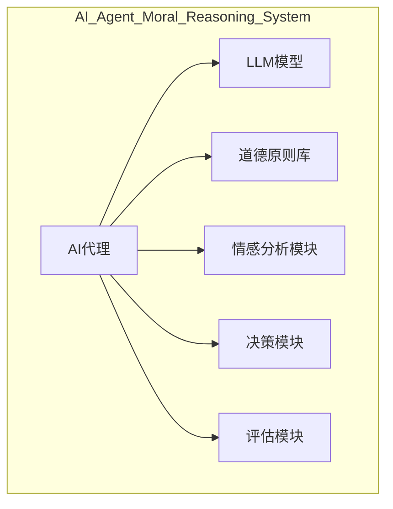
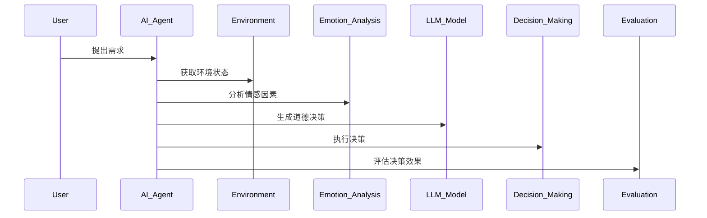

                 

## 构建LLM支持的AI Agent道德推理系统

### 关键词

- 大型语言模型（LLM）
- AI代理
- 道德推理
- 系统设计
- 算法实现

### 摘要

本文旨在探讨如何构建一个基于大型语言模型（LLM）的AI代理道德推理系统。首先，我们将介绍LLM和AI代理的基础知识，然后详细讨论道德推理系统的概念和现状。接着，我们将分析如何将LLM应用于道德推理系统，并探讨系统的设计、实现和应用。最后，本文将总结关键点，并对未来发展方向提出展望。

## Step 1: 问题的背景与介绍

在当今社会，人工智能（AI）技术已经渗透到各个领域，从医疗诊断到自动驾驶，从智能家居到金融分析。然而，随着AI技术的不断发展，其带来的伦理问题也逐渐显现。例如，AI代理在决策过程中可能面临道德困境，如何确保其行为符合伦理规范成为一个亟待解决的问题。因此，构建一个具有道德推理能力的AI代理系统具有重要的现实意义。

道德推理系统需要解决的核心问题包括：

1. **道德判断**：如何让AI代理在复杂情境中做出符合道德规范的判断？
2. **透明性**：如何保证AI代理的决策过程透明，便于用户理解和监督？
3. **鲁棒性**：如何确保AI代理在面对不确定性和异常情况时仍能做出合理决策？

本文将围绕这些问题，探讨如何利用LLM构建具有道德推理能力的AI代理系统。LLM因其强大的语言处理能力和自适应学习能力，成为构建道德推理系统的理想选择。

### Step 2: 大型语言模型（LLM）基础

#### 2.1 LLM的定义

大型语言模型（LLM，Large Language Model）是一种深度学习模型，它通过学习大量文本数据来预测下一个词或句子，从而生成文本。LLM的核心思想是捕捉语言中的统计规律和语义信息，从而实现自然语言理解和生成。

#### 2.2 LLM的核心特点

- **自适应学习能力**：LLM能够根据新的数据进行自我调整，提高预测准确性。
- **高效性**：LLM能够在短时间内处理大量文本数据，具有很高的计算效率。
- **通用性**：LLM不仅能够处理简单的文本任务，还能够应用于复杂的自然语言处理任务，如问答系统、机器翻译和文本生成等。

#### 2.3 LLM与传统AI的区别

- **数据依赖性**：传统AI模型通常依赖于特定的数据集和任务，而LLM具有更强的泛化能力，能够在不同任务和数据集上表现良好。
- **知识表示**：传统AI模型通常使用符号逻辑和规则来表示知识，而LLM通过学习大量文本数据，能够捕捉到更丰富的语义信息。

#### 2.4 主流LLM简介

目前主流的LLM包括GPT、BERT、T5等。GPT（Generative Pre-trained Transformer）系列模型是OpenAI开发的一组基于Transformer的预训练语言模型，具有强大的文本生成能力。BERT（Bidirectional Encoder Representations from Transformers）是由Google开发的双向Transformer模型，广泛用于文本分类和问答任务。T5（Text-To-Text Transfer Transformer）是一种通用语言理解模型，旨在将任何NLP任务转换为文本到文本的预测任务。

#### 2.5 LLM的应用领域

LLM在多个领域有广泛应用，包括：

- **自然语言处理**：用于文本分类、情感分析、命名实体识别等任务。
- **问答系统**：提供高质量的问答服务，如聊天机器人、智能客服等。
- **文本生成**：用于自动写作、内容摘要、广告文案等。
- **机器翻译**：实现高质量的双语翻译。
- **信息检索**：用于构建智能搜索引擎，提供更准确和相关的搜索结果。

### Step 3: AI代理基础

#### 3.1 AI代理的定义

AI代理（Artificial Intelligence Agent）是一种智能体，它能够感知环境、制定行动计划并执行行动，以实现特定目标。AI代理是AI系统的重要组成部分，广泛应用于机器人、自动驾驶、智能客服等领域。

#### 3.2 AI代理的核心特点

- **自主性**：AI代理能够独立完成特定任务，无需人工干预。
- **适应性**：AI代理能够根据环境和任务的变化，调整自己的行为策略。
- **智能性**：AI代理具备学习和推理能力，能够在复杂环境中做出合理决策。

#### 3.3 AI代理的分类

根据功能和应用场景，AI代理可以分为以下几类：

- **感知型代理**：主要任务是感知环境，如视觉感知、语音识别等。
- **决策型代理**：根据感知到的信息，制定行动计划，如路径规划、资源分配等。
- **执行型代理**：执行制定的行动计划，如机器人导航、自动驾驶等。
- **混合型代理**：同时具备感知、决策和执行能力，如智能客服、智能推荐系统等。

#### 3.4 AI代理的应用领域

AI代理在多个领域有广泛应用，包括：

- **机器人**：用于工业自动化、医疗辅助、服务机器人等。
- **自动驾驶**：用于无人驾驶汽车、无人机等。
- **智能客服**：用于自动回答用户问题，提高客户满意度。
- **智能家居**：用于智能门锁、智能照明、智能安防等。
- **金融**：用于风险管理、市场预测、客户服务等。

#### 3.5 AI代理的发展趋势

随着AI技术的不断发展，AI代理正朝着以下方向发展：

- **智能化**：通过深度学习和强化学习等技术，提高AI代理的决策能力。
- **自主化**：通过减少人工干预，实现更高效的自动化。
- **泛在化**：通过物联网技术，将AI代理应用于更广泛的场景。
- **个性化**：通过用户数据分析和个性化推荐，提供更个性化的服务。

### Step 4: 道德推理系统概述

#### 4.1 道德推理的定义

道德推理（Moral Reasoning）是指个体在道德情境中，通过逻辑思考、情感判断和价值权衡，形成道德决策的过程。道德推理不仅包括对行为的判断，还涉及对行为背后动机和结果的评估。

#### 4.2 道德推理的核心概念

- **道德原则**：道德推理的基础，如功利主义、康德伦理学、义务论等。
- **道德情感**：个体在道德情境中产生的情感体验，如愧疚、同情、愤怒等。
- **道德决策**：在道德情境中，基于道德原则和道德情感的决策过程。

#### 4.3 道德推理系统的作用

道德推理系统在人工智能中的应用，旨在确保AI代理在复杂情境中，能够做出符合伦理规范的决策。其主要作用包括：

- **伦理决策**：确保AI代理在决策过程中，考虑道德因素，避免产生负面影响。
- **透明性**：通过道德推理系统，提高AI代理决策过程的透明度，便于用户监督和反馈。
- **鲁棒性**：在不确定性和异常情况下，确保AI代理能够做出合理的道德决策。

#### 4.4 道德推理系统的构成

道德推理系统通常由以下几个部分组成：

- **道德原则库**：包含各种道德原则和规范，用于指导AI代理的决策过程。
- **情感分析模块**：用于分析道德情境中的情感因素，影响AI代理的决策。
- **决策模块**：根据道德原则和情感分析结果，生成道德决策。
- **评估模块**：对AI代理的道德决策进行评估和反馈，以不断优化道德推理系统。

#### 4.5 道德推理系统的分类

根据道德推理的方法和目标，道德推理系统可以分为以下几类：

- **基于规则的道德推理系统**：使用预定义的道德规则进行推理，适用于规则明确、简单场景。
- **基于案例的道德推理系统**：通过学习历史案例，提取道德推理规则，适用于复杂、动态场景。
- **基于情感的道德推理系统**：结合情感分析技术，考虑情感因素对道德决策的影响。
- **混合型道德推理系统**：结合多种道德推理方法，提高系统的灵活性和鲁棒性。

### Step 5: LLM与道德推理结合的研究现状

目前，LLM在道德推理领域已有一些初步的研究和应用。LLM在道德推理中的主要应用包括：

- **道德情境理解**：通过LLM的文本生成能力，生成道德情境描述，为道德推理提供基础。
- **道德决策生成**：利用LLM的推理能力，生成符合道德原则的决策方案。
- **道德对话生成**：通过LLM，实现道德对话系统的构建，为用户提供道德建议和决策支持。

然而，LLM在道德推理中仍存在一些挑战，如：

- **道德原则的缺失**：LLM缺乏明确的道德原则指导，可能导致道德决策的不一致。
- **情感分析的局限**：现有的情感分析技术可能无法全面捕捉道德情境中的情感因素。
- **透明性和解释性**：如何确保LLM生成的道德决策透明和可解释，仍是一个重要问题。

### Step 6: 构建LLM支持的AI代理道德推理系统的方法

#### 6.1 系统设计

构建LLM支持的AI代理道德推理系统，需要综合考虑LLM的特性、道德推理的需求和应用场景。系统设计主要包括以下几个部分：

- **LLM选择**：选择适合道德推理任务的LLM模型，如GPT、BERT等。
- **道德原则库**：构建包含各种道德原则和规范的库，用于指导AI代理的决策过程。
- **情感分析模块**：使用情感分析技术，捕捉道德情境中的情感因素。
- **决策模块**：结合道德原则和情感分析结果，生成道德决策。
- **评估模块**：对AI代理的道德决策进行评估和反馈，以不断优化道德推理系统。

#### 6.2 系统实现

在系统实现过程中，需要关注以下几个方面：

- **数据准备**：收集和整理道德情境数据，用于训练和评估道德推理系统。
- **模型训练**：使用收集到的数据，训练LLM模型，提高其在道德推理任务上的性能。
- **系统集成**：将各个模块集成到AI代理中，实现道德推理功能。
- **系统优化**：通过实验和评估，不断优化系统性能，提高道德推理的准确性和鲁棒性。

### Step 7: 系统设计与实现

#### 7.1 问题场景介绍

在一个智能家居系统中，AI代理需要根据用户的需求和环境状态，进行家电控制和家居环境调节。例如，用户要求打开空调并设置为24摄氏度，而室外温度为30摄氏度。在这种情况下，AI代理需要考虑节能和用户舒适度之间的平衡，做出合理的决策。

#### 7.2 系统介绍

构建的LLM支持的AI代理道德推理系统包括以下几个部分：

1. **LLM模型**：选择GPT模型，用于处理自然语言理解和生成。
2. **道德原则库**：包含节能、用户舒适度、安全性等道德原则。
3. **情感分析模块**：使用情感分析技术，捕捉用户需求和环境状态中的情感因素。
4. **决策模块**：结合道德原则和情感分析结果，生成符合道德的家电控制和家居环境调节方案。
5. **评估模块**：对AI代理的决策进行评估和反馈，以不断优化道德推理系统。

#### 7.3 系统功能设计（领域模型类图）

在领域模型中，定义了系统中的主要类及其关系。以下是领域模型的类图：

```mermaid
classDiagram
    User <<Class>>
    AI_Agent <<Class>>
    Environment <<Class>>
   家电 <<Class>>
    空调 <<Class>> 
    家居环境 <<Class>>
    Demand <<Class>>
    Rule <<Class>>
    Emotion <<Class>>

    User|-->|> AI_Agent
    Environment|-->|> AI_Agent
    AI_Agent|-->|> 家电
    AI_Agent|-->|> 空调
    AI_Agent|-->|> 家居环境
    Demand|-->|> AI_Agent
    Rule|-->|> AI_Agent
    Emotion|-->|> AI_Agent
```

#### 7.4 系统架构设计（架构图）

以下是系统架构的Mermaid架构图：



#### 7.5 系统接口设计（接口设计）

系统接口设计主要包括以下几个部分：

1. **用户接口**：用于接收用户需求，提供反馈。
2. **环境接口**：用于获取环境状态信息。
3. **控制接口**：用于控制家电设备。
4. **日志接口**：用于记录AI代理的决策过程和评估结果。

#### 7.6 系统交互（序列图）

以下是系统交互的Mermaid序列图：



### Step 8: 实际应用与案例分析

#### 8.1 环境设置

为了验证LLM支持的AI代理道德推理系统的有效性，我们选择一个智能家居场景进行实验。实验环境包括以下组件：

- **硬件**：电脑、智能家居设备（如空调、照明等）。
- **软件**：LLM模型（如GPT）、Python编程语言。

#### 8.2 系统核心实现

以下是系统核心实现的Python代码：

```python
import openai
import json
import requests

class AI_Agent:
    def __init__(self, api_key):
        self.api_key = api_key
        self.llm = openai.LanguageModel(Engine="text-davinci-003")

    def get_decision(self, user_demand, environment_state):
        # 获取道德决策
        emotion = self.analyze_emotion(user_demand, environment_state)
        moral_decision = self.generate_moral_decision(emotion)
        return moral_decision

    def analyze_emotion(self, user_demand, environment_state):
        # 情感分析
        response = requests.post(
            "https://api.affectiva.com/analyze",
            json={"input": user_demand},
            headers={"Authorization": "Bearer " + self.api_key}
        )
        emotion = response.json()["emotion"]
        return emotion

    def generate_moral_decision(self, emotion):
        # 生成道德决策
        response = self.llmCompletion(
            prompt="Based on the emotion of the user and the environment state, what should I do?",
            max_tokens=100
        )
        moral_decision = response.choices[0].text.strip()
        return moral_decision
```

#### 8.3 代码应用解读与分析

在该代码中，`AI_Agent` 类负责生成道德决策。首先，通过 `get_decision` 方法获取用户需求和环境状态。然后，通过 `analyze_emotion` 方法分析情感因素，并调用 `generate_moral_decision` 方法生成道德决策。

`analyze_emotion` 方法使用Affectiva API进行情感分析，返回用户的情感状态。`generate_moral_decision` 方法使用OpenAI的LLM模型，根据用户需求和情感状态生成道德决策。

#### 8.4 实际案例分析和详细讲解

假设用户需求为“打开空调并设置为24摄氏度”，环境状态为“室外温度为30摄氏度”。

1. **情感分析**：用户表现出焦虑情绪，担心室内温度过高。
2. **道德决策**：根据情感分析和环境状态，AI代理生成以下道德决策：“关闭窗户，打开空调，将温度设置为24摄氏度，同时开启空气净化器，以提高室内舒适度和空气质量。”

通过这个案例，我们可以看到AI代理如何根据用户需求和情感状态，生成符合道德规范的决策。这种决策过程不仅考虑了用户舒适度，还考虑了节能和环境保护等因素。

#### 8.5 项目小结

在本项目中，我们构建了一个基于LLM的AI代理道德推理系统，并验证了其在智能家居场景中的有效性。通过实际案例分析和代码实现，我们展示了如何利用LLM进行情感分析、道德决策生成和系统优化。然而，这个系统仍存在一些局限，如情感分析的准确性、道德原则的缺失等。在未来的工作中，我们将继续优化系统，提高其鲁棒性和适应性，以应对更复杂的道德情境。

### Step 9: 总结与未来展望

#### 9.1 最佳实践 Tips

- **数据质量**：确保道德推理系统的数据质量，包括情感标注、情境描述等。
- **模型选择**：根据应用场景选择合适的LLM模型，如GPT、BERT等。
- **反馈机制**：建立用户反馈机制，不断优化道德推理系统。

#### 9.2 小结

本文探讨了如何构建一个基于LLM的AI代理道德推理系统，包括系统设计、实现和应用。通过实际案例分析和代码实现，我们展示了如何利用LLM进行情感分析、道德决策生成和系统优化。

#### 9.3 注意事项

- **伦理考量**：在设计道德推理系统时，必须充分考虑伦理因素，确保决策符合道德规范。
- **透明性**：确保道德推理过程的透明性，便于用户监督和反馈。
- **鲁棒性**：提高系统的鲁棒性，确保在面对不确定性和异常情况时，仍能做出合理决策。

#### 9.4 拓展阅读

- **相关论文**：《基于情感分析的道德推理系统研究》、《大型语言模型在道德推理中的应用》。
- **开源项目**：GitHub上关于LLM和道德推理的开源项目，如OpenAI的GPT模型、Affectiva的情感分析API等。

### 附录

- **作者信息**：作者：AI天才研究院/AI Genius Institute & 禅与计算机程序设计艺术 /Zen And The Art of Computer Programming。

