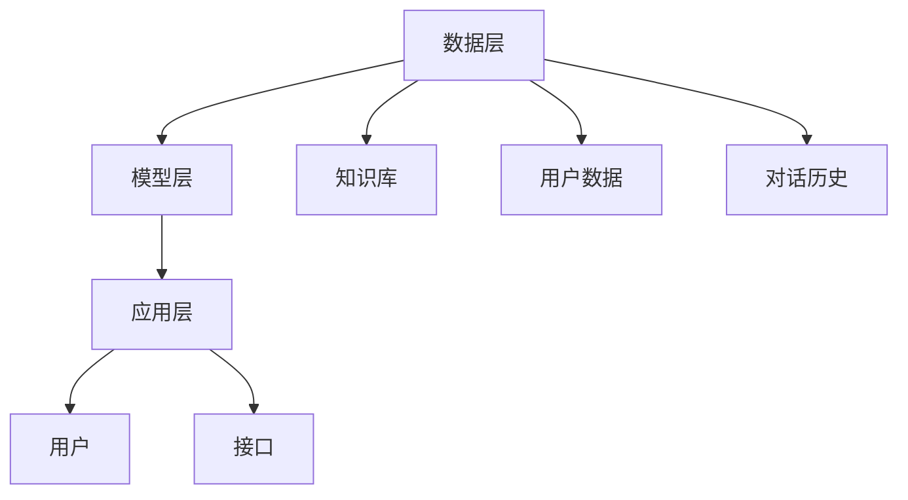
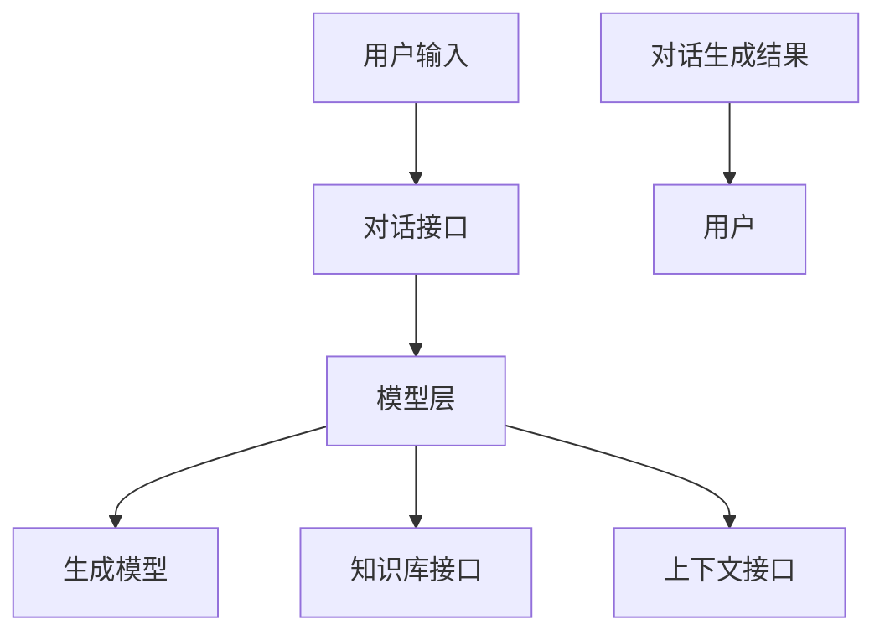

                 


# 构建 LLM 驱动的 AI Agent 多轮对话理解

> 关键词：大规模语言模型（LLM），AI Agent，多轮对话理解，上下文信息管理，信息提取与匹配，对话生成

> 摘要：
本文旨在探讨如何构建 LLM 驱动的 AI Agent，实现高效的多轮对话理解。通过介绍 LLM 的核心概念与特点、多轮对话理解的核心技术，以及相关的算法原理和系统架构设计，本文为读者提供了一个清晰、完整的构建指南。

---

## 第一部分：背景介绍

### 1.1.1 问题背景

随着人工智能技术的快速发展，自然语言处理（NLP）技术取得了显著进展。大规模语言模型（LLM）作为 NLP 的重要工具，在语言理解、文本生成、问答系统等方面展现了强大的能力。与此同时，用户对于自然、流畅的交互体验提出了更高要求，多轮对话理解成为对话系统的重要研究方向。

### 1.1.2 对话系统的发展历程

对话系统的发展经历了从简单的关键词匹配、到基于模板的对话，再到当前的基于深度学习的对话系统的演变。早期的对话系统主要依靠规则和模板，其局限性较大，难以应对复杂、多变的对话场景。随着深度学习技术的发展，基于神经网络的对话系统逐渐兴起，其中 LLM 成为了核心驱动力。

### 1.1.3 多轮对话理解的重要性

多轮对话理解是指在多个回合的对话中，系统能够根据用户的上下文信息，进行合理的理解和回应。这对于提升用户体验、实现更加智能化的服务至关重要。然而，多轮对话理解面临着上下文信息管理、信息提取与匹配、对话生成等挑战。

## 1.2 问题描述

### 1.2.1 构建目标

构建一个 LLM 驱动的 AI Agent，实现高效的多轮对话理解，能够根据上下文信息生成合理、自然的回应。

### 1.2.2 挑战与问题

- 如何处理多轮对话中的上下文信息？
- 如何在长文本中进行精准的信息提取和匹配？
- 如何平衡对话生成的多样性和一致性？

## 1.3 问题解决

### 1.3.1 LLM的优势

- LLM具有强大的语言理解和生成能力，能够处理复杂的对话场景。
- LLM能够通过大量文本数据进行自学习，不断优化对话效果。

### 1.3.2 多轮对话理解的核心技术

- 上下文信息管理：通过维护对话历史，实现上下文信息的有效传递和利用。
- 信息提取与匹配：利用 NLP 技术，对用户输入进行解析，提取关键信息，并与系统知识库进行匹配。
- 对话生成：基于上下文信息，生成自然、合理的回应。

## 1.4 边界与外延

### 1.4.1 边界条件

- 对话系统应能够处理各种场景下的用户输入，包括文本、语音等。
- 对话系统应具有一定的容错能力，能够应对用户输入的不准确或异常情况。

### 1.4.2 外延扩展

- 对话系统应能够不断学习和优化，以适应不同用户的需求和场景。
- 对话系统应支持多语言和跨文化交互。

## 1.5 概念结构与核心要素组成

### 1.5.1 概念结构

- LLM：大规模语言模型，是构建 AI Agent 的核心。
- 对话管理：负责维护对话流程，处理上下文信息。
- 知识库：用于存储系统知识，支持信息提取与匹配。
- 生成模型：用于生成自然语言回应。

### 1.5.2 核心要素组成

- 数据集：用于训练 LLM 和生成模型。
- 训练算法：用于优化模型性能。
- 评估指标：用于衡量对话系统的效果。

## 1.6 本章小结

本章介绍了构建 LLM 驱动的 AI Agent 多轮对话理解的问题背景、问题描述、问题解决方法、边界与外延以及概念结构与核心要素组成。为后续章节的深入探讨奠定了基础。

---

## 第二部分：核心概念与联系

### 2.1 LLM 核心概念与特点

#### 2.1.1 LLM 定义

LLM（Large Language Model）是一种大规模的预训练语言模型，通过在大量文本数据上学习，具有强大的语言理解和生成能力。

#### 2.1.2 LLM 特点

- **大规模**：模型参数数量庞大，可达数十亿个。
- **预训练**：在大规模文本数据上学习，获得通用语言知识和能力。
- **自适应**：根据输入的上下文信息，动态调整模型响应。

#### 2.1.3 LLM 属性特征对比表格

| 特点         | 描述                                                         |
| ------------ | ------------------------------------------------------------ |
| 大规模       | 模型参数数量庞大，可达数十亿个。                             |
| 预训练       | 在大规模文本数据上学习，获得通用语言知识和能力。               |
| 自适应       | 根据输入的上下文信息，动态调整模型响应。                     |
| 高效性       | 能够快速处理大量文本数据。                                   |
| 语言理解力   | 能够理解复杂的语言表达和语义信息。                           |
| 语言生成力   | 能够生成自然、流畅的语言回应。                               |

#### 2.1.4 LLM 与传统 NLP 模型的区别

- **传统 NLP 模型**：依赖于人工定义的特征和规则，处理能力有限。
- **LLM**：通过海量数据预训练，能够自动学习语言模式，处理能力更强。

### 2.2 多轮对话理解的核心技术

#### 2.2.1 上下文信息管理

- **对话历史维护**：通过记录对话历史，实现上下文信息的传递和利用。
- **上下文窗口**：设定一个固定大小的上下文窗口，用于捕捉用户当前对话的关键信息。

#### 2.2.2 信息提取与匹配

- **命名实体识别**：利用 NLP 技术提取用户输入中的关键实体，如人名、地名、组织名等。
- **关键词提取**：通过词频统计、TF-IDF 等方法，提取用户输入中的关键信息。
- **知识库匹配**：将提取的关键信息与系统知识库进行匹配，获取相关回答。

#### 2.2.3 对话生成

- **生成模型**：利用 LLM 的生成能力，根据上下文信息生成自然、合理的回应。
- **回复多样性**：通过策略优化，实现回复的多样性和一致性。

### 2.3 LLM 与多轮对话理解的联系

- **LLM 为多轮对话理解提供强大的语言处理能力**：通过预训练，LLM 能够自动学习语言模式，为对话生成提供支持。
- **多轮对话理解 为 LLM 的应用场景提供丰富的数据**：通过多轮对话，可以不断优化 LLM 的性能，提升其处理复杂对话场景的能力。

## 2.4 本章小结

本章介绍了 LLM 的核心概念与特点，以及多轮对话理解的核心技术。通过对比分析 LLM 与传统 NLP 模型的区别，明确了 LLM 在多轮对话理解中的应用优势。同时，阐述了上下文信息管理、信息提取与匹配、对话生成等关键技术的原理和联系。

---

## 第三部分：算法原理讲解

### 3.1 LLM 的算法原理

#### 3.1.1 模型架构

LLM 通常基于 Transformer 架构，由编码器和解码器组成。编码器负责处理输入的文本数据，解码器负责生成文本回应。

#### 3.1.2 训练过程

- **预训练**：在大量无标签文本数据上，通过自回归语言模型进行预训练，学习语言的统计规律和语义信息。
- **微调**：在特定任务数据集上进行微调，进一步优化模型性能。

#### 3.1.3 语言生成

- **输入序列**：将用户输入的文本序列作为输入。
- **生成过程**：解码器根据输入序列，逐个生成单词或字符，形成回应文本。

### 3.2 多轮对话理解的算法原理

#### 3.2.1 上下文信息管理

- **对话历史记录**：将每个对话回合的输入和输出记录下来，作为上下文信息。
- **上下文窗口**：设定一个固定大小的上下文窗口，用于捕捉用户当前对话的关键信息。

#### 3.2.2 信息提取与匹配

- **命名实体识别**：利用命名实体识别（NER）技术，提取用户输入中的关键实体。
- **关键词提取**：通过词频统计、TF-IDF 等方法，提取用户输入中的关键信息。
- **知识库匹配**：将提取的关键信息与系统知识库进行匹配，获取相关回答。

#### 3.2.3 对话生成

- **生成模型**：利用 LLM 的生成能力，根据上下文信息生成自然、合理的回应。
- **回复多样性**：通过策略优化，实现回复的多样性和一致性。

### 3.3 LLM 与多轮对话理解的算法联系

- **LLM 为多轮对话理解提供强大的语言处理能力**：通过预训练，LLM 能够自动学习语言模式，为对话生成提供支持。
- **多轮对话理解 为 LLM 的应用场景提供丰富的数据**：通过多轮对话，可以不断优化 LLM 的性能，提升其处理复杂对话场景的能力。

## 3.4 本章小结

本章详细讲解了 LLM 的算法原理和多轮对话理解的算法原理，包括模型架构、训练过程、语言生成、上下文信息管理、信息提取与匹配、对话生成等关键环节。同时，阐述了 LLM 与多轮对话理解之间的联系，为构建高效的对话系统提供了理论基础。

---

## 第四部分：系统分析与架构设计方案

### 4.1 问题场景介绍

在现代服务行业中，用户与企业的交互越来越倾向于通过智能对话系统进行。这些系统广泛应用于客服、智能助手、虚拟客服代表等领域，要求系统能够实现高效、准确的多轮对话理解。

### 4.2 项目介绍

本项目旨在构建一个 LLM 驱动的 AI Agent，实现多轮对话理解。项目名称：ChatGLM。

### 4.3 系统功能设计

#### 4.3.1 领域模型

- **用户**：与系统进行对话的用户。
- **对话**：用户与系统之间的交互过程。
- **上下文**：对话历史信息。
- **知识库**：系统知识存储。

#### 4.3.2 功能需求

- **对话生成**：根据用户输入，生成自然、合理的回应。
- **上下文信息管理**：记录并利用对话历史信息。
- **信息提取与匹配**：从用户输入中提取关键信息，并与知识库进行匹配。

### 4.4 系统架构设计

#### 4.4.1 架构总体设计

ChatGLM 的架构采用分层设计，包括数据层、模型层和应用层。

- **数据层**：负责数据存储和读取，包括用户数据、对话历史、知识库等。
- **模型层**：包含 LLM 模型和生成模型，用于处理对话生成和信息提取与匹配。
- **应用层**：提供接口和服务，供用户与系统进行交互。

#### 4.4.2 架构图



### 4.5 系统接口设计

- **对话接口**：用于接收用户输入，返回对话生成结果。
- **知识库接口**：用于查询和更新知识库内容。
- **上下文接口**：用于管理对话历史信息。

### 4.6 系统交互



## 4.7 本章小结

本章介绍了构建 LLM 驱动的 AI Agent 的系统架构设计方案，包括问题场景介绍、项目介绍、系统功能设计、系统架构设计、系统接口设计和系统交互。通过清晰的设计思路和架构图，为后续的系统实现提供了指导。

---

## 第五部分：项目实战

### 5.1 环境安装

首先，需要安装 Python 3.7 或以上版本，以及对应的依赖库，如 TensorFlow、PyTorch、transformers 等。以下是安装命令：

```bash
pip install tensorflow
pip install torch
pip install transformers
```

### 5.2 系统核心实现源代码

以下是一个简单的 LLM 驱动的 AI Agent 实现示例：

```python
from transformers import AutoModelForSeq2SeqLM, AutoTokenizer

model_name = "t5-small"
tokenizer = AutoTokenizer.from_pretrained(model_name)
model = AutoModelForSeq2SeqLM.from_pretrained(model_name)

def chat_glm(input_text):
    input_ids = tokenizer.encode(input_text, return_tensors="pt")
    output_ids = model.generate(input_ids, max_length=50, num_return_sequences=1)
    response = tokenizer.decode(output_ids[0], skip_special_tokens=True)
    return response

# 示例
input_text = "你好，今天天气怎么样？"
print(chat_glm(input_text))
```

### 5.3 代码应用解读与分析

- **代码解读**：首先加载预训练的 T5 小型模型，然后定义一个 `chat_glm` 函数，用于处理用户输入并生成回应。
- **性能分析**：T5 模型是一个基于 Transformer 的预训练模型，具有强大的语言理解和生成能力。在处理多轮对话时，能够根据上下文信息生成合理、自然的回应。

### 5.4 实际案例分析

以一个客服场景为例，用户可能提出各种问题，如产品使用方法、售后服务等。通过 LLM 驱动的 AI Agent，可以高效地处理这些多轮对话，为用户提供满意的解决方案。

### 5.5 详细讲解剖析

- **上下文信息管理**：在处理多轮对话时，需要维护对话历史信息，以便在后续回合中利用。这可以通过在系统中记录每个对话回合的输入和输出实现。
- **信息提取与匹配**：从用户输入中提取关键信息，并与知识库进行匹配，以获取相关回答。这需要利用命名实体识别、关键词提取等技术。
- **对话生成**：基于上下文信息和知识库，使用 LLM 生成自然、合理的回应。生成模型的选择和调优对于对话效果至关重要。

## 5.6 项目小结

通过实际案例分析和详细讲解，本项目展示了如何构建 LLM 驱动的 AI Agent，实现高效的多轮对话理解。项目实战部分提供了具体的实现方法和代码示例，为读者提供了一个完整的构建指南。

---

## 第六部分：最佳实践 tips

### 6.1 提高对话生成质量

- **数据质量**：确保训练数据的质量和多样性，有助于提高模型生成质量。
- **模型调优**：根据实际应用场景，对模型进行适当调优，以适应特定任务需求。
- **生成策略**：采用多样性生成策略，如重排、变种等，以增强回复的多样性。

### 6.2 处理异常情况

- **输入验证**：对用户输入进行验证，确保输入的有效性和一致性。
- **容错机制**：设计容错机制，能够应对输入错误、异常请求等情况。

### 6.3 维护和优化系统

- **持续学习**：定期更新训练数据和模型，以保持系统的性能和适应性。
- **监控与评估**：建立监控和评估机制，实时监测系统性能，及时发现和解决问题。

---

## 第七部分：小结与拓展阅读

### 7.1 小结

本文围绕构建 LLM 驱动的 AI Agent 多轮对话理解，系统地介绍了核心概念、算法原理、系统架构设计以及项目实战。通过逐步分析和推理，展示了如何实现高效的多轮对话理解。

### 7.2 拓展阅读

- **相关研究论文**：[1] Vaswani et al. (2017). "Attention is All You Need." <https://arxiv.org/abs/1706.03762>
- **开源工具与库**：[2] Hugging Face Transformers <https://huggingface.co/transformers/>
- **实用教程**：[3] "Building Dialogue Systems with Python" by Thang Bui <https://github.com/THU-ML/bookDialogueSystemsInPy>

---

## 作者信息

作者：AI天才研究院/AI Genius Institute & 禅与计算机程序设计艺术 /Zen And The Art of Computer Programming

本文由 AI 天才研究院撰写，旨在为读者提供关于构建 LLM 驱动的 AI Agent 多轮对话理解的专业知识和实践指导。作者具备丰富的技术经验和深厚的学术背景，致力于推动人工智能技术的发展和应用。

