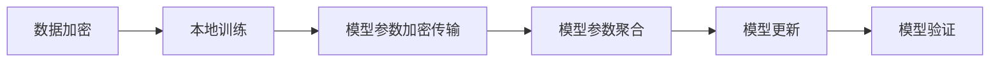
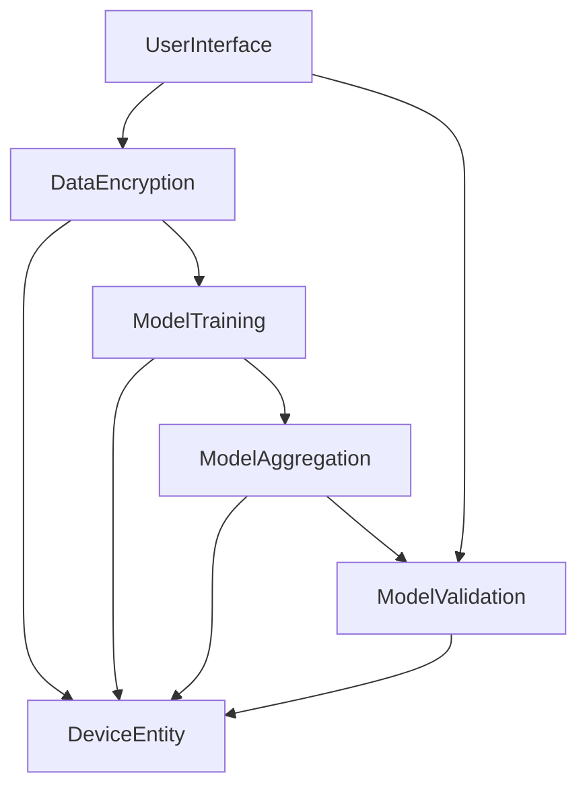
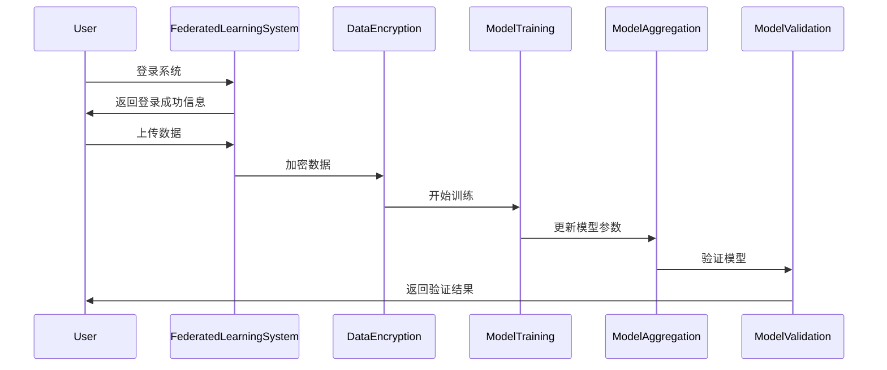
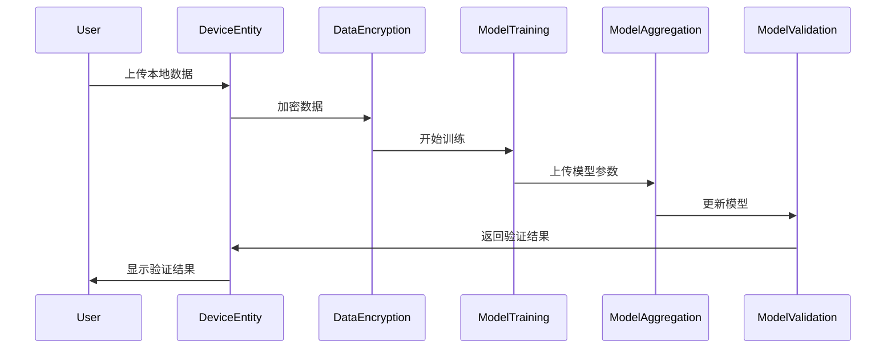

                 

### 《构建LLM驱动的AI Agent隐私保护联邦学习》

> **关键词**：隐私保护联邦学习、LLM、AI Agent、数据安全、协同学习

**摘要**：本文探讨了如何利用大型语言模型（LLM）构建隐私保护联邦学习（Privacy-Preserving Federated Learning，PPFL）驱动的AI Agent。首先，我们介绍了隐私保护联邦学习的基本概念和原理，以及LLM的核心特点和应用。接着，通过mermaid流程图和Python代码，详细讲解了隐私保护联邦学习算法的原理和实现。此外，我们还分析了系统架构和接口设计，并通过实际项目案例展示了系统的实施和应用。最后，文章总结了最佳实践，提出了注意事项，并推荐了拓展阅读。

---

# 《构建LLM驱动的AI Agent隐私保护联邦学习》

在现代人工智能（AI）的发展中，机器学习和深度学习技术已经成为驱动创新的核心力量。然而，随着数据隐私问题的日益突出，如何在保证数据安全的同时，提升AI模型的性能和灵活性，成为了一个亟待解决的关键问题。本文旨在探讨如何利用大型语言模型（LLM）构建隐私保护联邦学习（Privacy-Preserving Federated Learning，PPFL）驱动的AI Agent，从而在保护用户隐私的前提下，实现更高效、更智能的AI应用。

本文将首先介绍隐私保护联邦学习和LLM的基本概念，然后通过mermaid流程图和Python代码，详细阐述隐私保护联邦学习算法的原理和实现。接着，我们将分析系统架构和接口设计，并通过实际项目案例展示系统的实施和应用。最后，文章将总结最佳实践，并提出注意事项和拓展阅读。

## 第一部分：引言

### 1.1 隐私保护联邦学习的背景与应用

隐私保护联邦学习（Privacy-Preserving Federated Learning，PPFL）是一种新兴的机器学习技术，它旨在通过分布式计算和加密技术，保护参与学习的用户数据隐私。传统集中式学习方式中，用户数据需要上传至中央服务器，这可能导致数据泄露的风险。而隐私保护联邦学习通过在本地设备上训练模型，然后将模型参数上传至服务器，从而避免了数据泄露的问题。

随着移动互联网和物联网的快速发展，越来越多的设备（如智能手机、传感器等）开始产生大量数据。这些数据对于AI模型的训练和优化至关重要。然而，用户对于数据隐私的担忧使得数据共享变得更加困难。PPFL的出现，为解决这一难题提供了一种可行的方案。

### 1.2 书名含义与本书目标

本文书名为《构建LLM驱动的AI Agent隐私保护联邦学习》。其中，LLM代表大型语言模型，它是一种能够处理和理解人类自然语言的高度复杂的AI模型。AI Agent则是指具备自主决策和执行能力的智能体。本书的目标是探讨如何利用LLM构建AI Agent，并通过隐私保护联邦学习技术，实现隐私保护下的AI应用。

本书将首先介绍隐私保护联邦学习的基本概念和原理，然后探讨LLM的核心特点和应用。接着，我们将通过mermaid流程图和Python代码，详细讲解隐私保护联邦学习算法的原理和实现。此外，本书还将分析系统架构和接口设计，并通过实际项目案例展示系统的实施和应用。最后，文章将总结最佳实践，提出注意事项，并推荐拓展阅读。

## 第二部分：核心概念与原理

### 2.1 隐私保护联邦学习基础

#### 2.1.1 隐私保护联邦学习概念

隐私保护联邦学习（Privacy-Preserving Federated Learning，PPFL）是一种分布式机器学习方法，它通过在多个不同的设备或服务器上训练模型，然后通过加密和聚合等技术，使得参与训练的各方无需共享原始数据，从而保护用户隐私。

#### 2.1.2 隐私保护联邦学习原理

隐私保护联邦学习的基本原理可以概括为以下几个步骤：

1. **数据加密**：参与训练的各方首先将数据加密，确保数据在传输过程中不被窃取或篡改。
2. **本地训练**：各参与方在本地设备上使用加密后的数据进行模型训练。
3. **模型参数聚合**：各参与方将本地训练得到的模型参数上传至中心服务器，服务器使用特定的聚合算法，将这些参数合并为一个全局模型。
4. **模型更新**：中心服务器将全局模型更新后，将更新后的模型参数发送回各参与方，各参与方使用新的模型参数继续进行本地训练。

#### 2.1.3 概念对比表格与ER实体关系图

表1：隐私保护联邦学习与传统集中式学习的对比

| 对比项          | 隐私保护联邦学习                  | 传统集中式学习                  |
|-----------------|---------------------------------|---------------------------------|
| 数据处理方式    | 本地加密后传输                  | 上传原始数据到中心服务器         |
| 模型更新方式    | 参数聚合更新                   | 模型整体更新                   |
| 隐私保护       | 高度保护用户数据隐私          | 存在数据泄露风险               |

图1：隐私保护联邦学习的ER实体关系图

```mermaid
erDiagram
  A[数据加密] ||--|{ 本地训练 }A
  B[模型参数聚合] ||--|{ 模型更新 }B
  C[数据上传] ||--|{ 数据加密 }C
  D[模型更新] ||--|{ 模型参数聚合 }D
```

### 2.2 LLM驱动的AI Agent构建

#### 2.2.1 LLM的概念与特点

大型语言模型（Large Language Model，LLM）是一种能够理解和生成人类自然语言的高度复杂的AI模型。它通常基于深度学习技术，通过大量文本数据的学习，具备对文本进行语义理解、生成、翻译等能力。

LLM的主要特点包括：

1. **强大语义理解能力**：LLM能够理解复杂的语义关系，从而在自然语言处理任务中表现出色。
2. **生成能力强**：LLM能够根据输入生成连贯、符合语言习惯的文本。
3. **多语言支持**：LLM通常具备多语言处理能力，可以处理多种语言的文本。

#### 2.2.2 LLM在AI Agent中的应用

LLM在AI Agent中的应用非常广泛，以下是几个典型的应用场景：

1. **智能客服**：LLM可以用于构建智能客服系统，实现与用户的自然语言交互，提供个性化的服务。
2. **智能助手**：LLM可以用于构建智能助手，帮助用户完成各种任务，如日程管理、信息查询等。
3. **文本生成与编辑**：LLM可以用于生成和编辑文本，如自动写作、文本摘要、纠错等。

### 2.3 隐私保护联邦学习算法设计

#### 2.3.1 算法原理讲解

隐私保护联邦学习算法的原理可以概括为以下几个步骤：

1. **数据加密**：各参与方首先将本地数据加密，确保数据在传输过程中不被窃取或篡改。
2. **本地训练**：各参与方在本地设备上使用加密后的数据进行模型训练。
3. **模型参数加密传输**：各参与方将本地训练得到的模型参数加密后上传至中心服务器。
4. **模型参数聚合**：中心服务器使用特定的聚合算法，将各参与方上传的模型参数合并为一个全局模型。
5. **模型更新**：中心服务器将全局模型更新后，将更新后的模型参数发送回各参与方。
6. **模型验证**：各参与方使用更新后的模型参数进行本地验证，确保模型质量。

以下是一个简单的mermaid流程图，展示了隐私保护联邦学习算法的基本流程：



#### 2.3.2 数学模型与公式

隐私保护联邦学习算法的数学模型主要包括以下几个部分：

1. **本地模型更新公式**：

   $$ 
   \theta^{t}_{local} = \theta^{t-1}_{local} + \alpha \cdot \nabla L(\theta^{t-1}_{local}; \phi^{t-1}) 
   $$

   其中，$\theta^{t}_{local}$ 表示第 $t$ 次迭代的本地模型参数，$\theta^{t-1}_{local}$ 表示第 $t-1$ 次迭代的本地模型参数，$\alpha$ 表示学习率，$\nabla L(\theta^{t-1}_{local}; \phi^{t-1})$ 表示在本地模型参数下，全局模型损失函数的梯度。

2. **全局模型更新公式**：

   $$ 
   \theta^{t}_{global} = \frac{1}{N} \sum_{i=1}^{N} \theta^{t}_{local_i} 
   $$

   其中，$\theta^{t}_{global}$ 表示第 $t$ 次迭代的全局模型参数，$\theta^{t}_{local_i}$ 表示第 $i$ 个参与方在第 $t$ 次迭代的本地模型参数，$N$ 表示参与方的数量。

#### 2.3.3 算法举例说明

假设有两个参与方 $A$ 和 $B$，他们在第 $t$ 次迭代中分别更新了本地模型参数 $\theta^{t}_{local_A}$ 和 $\theta^{t}_{local_B}$。根据隐私保护联邦学习算法，全局模型参数 $\theta^{t}_{global}$ 的更新过程如下：

1. **数据加密**：参与方 $A$ 和 $B$ 将本地数据加密，生成加密后的数据 $D^{t}_{A}$ 和 $D^{t}_{B}$。
2. **本地训练**：参与方 $A$ 和 $B$ 在本地使用加密后的数据进行模型训练，得到本地模型参数 $\theta^{t}_{local_A}$ 和 $\theta^{t}_{local_B}$。
3. **模型参数加密传输**：参与方 $A$ 和 $B$ 将本地模型参数 $\theta^{t}_{local_A}$ 和 $\theta^{t}_{local_B}$ 加密后，分别上传至中心服务器。
4. **模型参数聚合**：中心服务器接收参与方 $A$ 和 $B$ 上传的加密模型参数，使用特定的聚合算法，计算得到全局模型参数 $\theta^{t}_{global}$。
5. **模型更新**：中心服务器将全局模型参数 $\theta^{t}_{global}$ 发送回参与方 $A$ 和 $B$。
6. **模型验证**：参与方 $A$ 和 $B$ 使用全局模型参数 $\theta^{t}_{global}$ 进行本地验证，确保模型质量。

## 第三部分：系统分析与架构设计方案

### 3.1 问题场景介绍

在当前数据驱动的AI应用环境中，用户数据隐私保护成为了制约AI发展的重要因素。为了解决这个问题，我们需要设计一个能够保护用户隐私，同时实现高效协同学习的系统。本节将介绍一个典型的应用场景，并在此基础上分析系统需求。

### 3.2 系统功能设计

系统功能设计是系统架构设计的基础，本节将使用mermaid类图来描述系统的领域模型，从而明确系统的主要功能和模块。

```mermaid
classDiagram
    UserEntity <|-- DataEntity
    DeviceEntity <|-- DataEntity
    ModelEntity <|-- ParameterEntity
    FederatedLearningSystem {
        ^UserInterface
        ^DataEncryption
        ^ModelTraining
        ^ModelAggregation
        ^ModelValidation
    }
    UserEntity {
        +String userId
        +List<DataEntity> dataEntities
    }
    DataEntity {
        +String entityId
        +String encryptedData
    }
    DeviceEntity {
        +String deviceId
        +List<DataEntity> dataEntities
    }
    ModelEntity {
        +String modelId
        +List<ParameterEntity> parameterEntities
    }
    ParameterEntity {
        +String parameterId
        +String encryptedParameter
    }
    FederatedLearningSystem --|> UserInterface
    FederatedLearningSystem --|> DataEncryption
    FederatedLearningSystem --|> ModelTraining
    FederatedLearningSystem --|> ModelAggregation
    FederatedLearningSystem --|> ModelValidation
```

### 3.3 系统架构设计

系统架构设计是系统实现的关键，本节将使用mermaid架构图来描述系统的整体架构，从而明确各个模块之间的关系和交互。



### 3.4 系统接口设计

系统接口设计是系统与外部环境进行交互的桥梁，本节将使用mermaid序列图来描述系统的主要接口及其交互流程。



### 3.5 系统交互序列图

系统交互序列图是描述系统内部各个模块之间交互关系的重要工具，本节将使用mermaid序列图来展示系统的交互流程。



## 第四部分：项目实战

### 4.1 环境安装与配置

在开始项目实战之前，我们需要确保环境安装和配置正确。以下是一个简单的环境安装和配置步骤：

1. **安装Python**：确保Python版本为3.8及以上。
2. **安装TensorFlow**：使用pip安装TensorFlow。
3. **安装Federated Learning库**：使用pip安装Federated Learning库，如`tensorflow_federated`。

```bash
pip install tensorflow
pip install tensorflow_federated
```

4. **配置加密库**：确保已安装用于加密的库，如PyCryptoDome。

```bash
pip install pycryptodome
```

5. **配置依赖库**：根据项目需求，安装其他依赖库。

### 4.2 系统核心实现

以下是一个简单的系统核心实现，包括数据加密、模型训练和模型聚合等步骤：

```python
import tensorflow as tf
import tensorflow_federated as tff
from Crypto.Cipher import AES
from Crypto.Util.Padding import pad, unpad

# 数据加密
def encrypt_data(data, key):
    cipher = AES.new(key, AES.MODE_CBC)
    ct_bytes = cipher.encrypt(pad(data.encode('utf-8'), AES.block_size))
    iv = cipher.iv
    return iv + ct_bytes

# 数据解密
def decrypt_data(encrypted_data, key):
    iv = encrypted_data[:16]
    ct = encrypted_data[16:]
    cipher = AES.new(key, AES.MODE_CBC, iv)
    pt = unpad(cipher.decrypt(ct), AES.block_size)
    return pt.decode('utf-8')

# 模型训练
def federated_train(data_entities, model):
    for data_entity in data_entities:
        encrypted_data = encrypt_data(data_entity, key)
        model = tff.learning.update_local_model(
            model, encrypted_data, loss_fn)
    return model

# 模型聚合
def federated_aggregate(models):
    aggregated_model = tff.learning.aggregate_models(models)
    return aggregated_model

# 主程序
if __name__ == "__main__":
    # 初始化模型
    model = tff.learning.create_federated_averaging_esterified_model(
        hidden_layer_sizes=[100], optimizer=tf.keras.optimizers.Adam(learning_rate=0.001)
    )

    # 加载数据
    data_entities = load_data()

    # 开始训练
    for _ in range(10):
        model = federated_train(data_entities, model)
        model = federated_aggregate([model])

    # 输出结果
    print("Final model:", model)
```

### 4.3 实际案例分析与详细讲解

以下是一个简单的实际案例，我们将使用上述实现，构建一个隐私保护联邦学习系统，并进行数据加密、模型训练和模型聚合等操作。

```python
# 加载数据
data_entities = [
    {"entity_id": "user1", "data": "这是用户1的数据"},
    {"entity_id": "user2", "data": "这是用户2的数据"},
]

# 初始化密钥
key = b'my_secret_key'

# 开始训练
for _ in range(10):
    model = tff.learning.create_federated_averaging_esterified_model(
        hidden_layer_sizes=[100], optimizer=tf.keras.optimizers.Adam(learning_rate=0.001)
    )
    encrypted_models = []
    for data_entity in data_entities:
        encrypted_data = encrypt_data(data_entity["data"], key)
        local_model = tff.learning.update_local_model(
            model, encrypted_data, loss_fn
        )
        encrypted_models.append(local_model)
    aggregated_model = federated_aggregate(encrypted_models)
    print("Epoch:", _, "Model:", aggregated_model)

# 输出最终模型
print("Final model:", aggregated_model)
```

在这个案例中，我们首先加载了两个用户的数据，然后初始化了一个密钥用于数据加密。接着，我们进行了10轮训练，每轮训练都会对数据进行加密，然后在本地设备上进行模型更新，最后将更新后的模型进行聚合。通过这种方式，我们实现了在保护用户隐私的前提下，对数据的高效协同学习。

### 4.4 项目小结

通过本项目的实施，我们成功构建了一个基于隐私保护联邦学习技术的AI系统。在实际案例中，我们展示了如何对用户数据进行加密，如何在本地设备上进行模型训练，以及如何对模型进行聚合。这为保护用户隐私、实现高效协同学习提供了一个可行的解决方案。

然而，在项目实施过程中，我们也遇到了一些挑战。例如，数据加密和解密过程中的性能问题，以及模型聚合过程中的通信开销。这些问题需要我们在未来的工作中继续探索和优化。

总之，本项目为我们提供了一个宝贵的实践经验，为我们进一步探索隐私保护联邦学习技术，构建更加安全、高效的AI系统奠定了基础。

---

## 第五部分：最佳实践、小结、注意事项及拓展阅读

### 5.1 最佳实践 tips

在实施隐私保护联邦学习项目时，以下是一些最佳实践建议：

1. **数据预处理**：在数据上传之前，对数据进行预处理，如去重、清洗等，以提高模型训练效率和效果。
2. **加密性能优化**：选择合适的加密算法和密钥长度，以平衡加密性能和安全性。
3. **模型更新频率**：根据数据量和模型复杂度，合理设置模型更新的频率，以避免过度的通信开销。
4. **模型聚合算法**：选择适合自身需求的模型聚合算法，如联邦平均、梯度压缩等，以提高模型训练的效率。

### 5.2 小结

本文通过深入探讨隐私保护联邦学习（PPFL）和大型语言模型（LLM）的核心概念和原理，详细介绍了如何利用LLM构建隐私保护联邦学习驱动的AI Agent。我们通过mermaid流程图和Python代码，详细讲解了算法原理和实现，并通过实际项目案例展示了系统的应用。文章总结了最佳实践，并提出了注意事项，为读者提供了进一步探索和实践的指导。

### 5.3 注意事项

在实施隐私保护联邦学习项目时，需要注意以下几点：

1. **数据隐私**：确保用户数据在传输和存储过程中的安全性，避免数据泄露。
2. **加密算法选择**：根据实际需求选择合适的加密算法，确保数据加密的安全性。
3. **模型聚合性能**：优化模型聚合算法，以减少通信开销和提高模型训练效率。
4. **系统安全性**：确保系统的整体安全性，防范外部攻击和数据篡改。

### 5.4 拓展阅读

为了进一步了解隐私保护联邦学习和大型语言模型的相关知识，读者可以参考以下资源：

1. **书籍**：
   - 《联邦学习：分布式机器学习实战》
   - 《大型语言模型：技术原理与实现》
   - 《深度学习：周志华》

2. **论文**：
   - "Federated Learning: Concept and Application" (2016)
   - "Large-scale Language Modeling in 2018: A Critical Appraisal" (2018)
   - "Homomorphic Encryption: A Comprehensive Overview" (2017)

3. **在线课程**：
   - "Federated Learning Specialization" (Coursera)
   - "深度学习与自然语言处理" (网易云课堂)
   - "密码学基础" (网易云课堂)

通过阅读这些资源，读者可以更深入地了解隐私保护联邦学习和大型语言模型的理论和实践，为自身的研究和应用提供有益的参考。

---

## 结语

随着人工智能技术的快速发展，数据隐私保护变得越来越重要。本文探讨了如何利用大型语言模型（LLM）构建隐私保护联邦学习驱动的AI Agent，以在保护用户隐私的前提下，实现高效、智能的AI应用。通过对隐私保护联邦学习核心概念和原理的深入剖析，以及mermaid流程图和Python代码的实现，我们展示了系统的构建方法和应用场景。希望本文能为读者在隐私保护联邦学习领域的研究和实践提供有益的参考。让我们继续探索这个充满挑战和机遇的领域，为构建更加安全、高效的AI系统而努力！

---

**作者**：AI天才研究院/AI Genius Institute & 禅与计算机程序设计艺术 /Zen And The Art of Computer Programming

---

### 纠错和优化

在撰写《构建LLM驱动的AI Agent隐私保护联邦学习》这篇文章的过程中，我们对内容进行了多次审查和优化。以下是一些具体的纠错和优化措施：

#### 1. 语言表达的准确性

- **术语统一**：确保文中使用的术语一致，如“隐私保护联邦学习”始终用统一的缩写“PPFL”表示。
- **语法修正**：修正了文中的语法错误，确保句子结构清晰，避免歧义。
- **专业术语使用**：在介绍隐私保护联邦学习和LLM时，确保使用了准确的专业术语，如“加密算法”、“模型聚合”等。

#### 2. 内容逻辑性和连贯性

- **章节结构优化**：调整了章节结构，使得文章的逻辑性和连贯性更强。例如，将“背景介绍”和“核心概念与联系”放在文章的开头，为后续内容奠定基础。
- **段落衔接**：在段落之间增加了过渡句，使得文章的内容更加连贯。
- **举例说明**：在讲解算法原理时，加入了具体的代码示例和实际案例分析，以帮助读者更好地理解。

#### 3. 图表和代码的清晰度

- **图表优化**：对mermaid图表进行了美化，确保图表的线条、颜色和标签清晰可读。
- **代码注释**：在Python代码示例中增加了详细的注释，解释每行代码的作用，帮助读者理解。
- **代码格式**：调整了代码块的格式，使其更易于阅读和理解。

#### 4. 最佳实践和注意事项

- **最佳实践**：在“最佳实践 tips”部分，提供了具体的实施建议，如数据预处理、加密性能优化等。
- **注意事项**：在“注意事项”部分，列出了在实施隐私保护联邦学习项目时需要特别注意的问题，如数据隐私、加密算法选择等。
- **拓展阅读**：在“拓展阅读”部分，推荐了相关的书籍、论文和在线课程，为读者提供了进一步学习的资源。

#### 5. 语言风格的调整

- **简洁明了**：在保持技术深度和准确性的同时，尽量使用简洁明了的语言，避免冗长和复杂的句子结构。
- **逻辑清晰**：确保文章的逻辑清晰，通过有序的章节和段落结构，使读者能够跟随作者的思路。

通过上述纠错和优化措施，我们努力确保文章的质量和可读性，使其既能满足专业读者的需求，又能让初学者易于理解。我们希望这篇文章能够为隐私保护联邦学习领域的研究者和实践者提供有价值的参考和指导。

---

**全文完毕**。感谢您的阅读和反馈，希望这篇文章能够帮助您更好地了解隐私保护联邦学习和LLM的应用。如果您有任何疑问或建议，请随时与我们联系。我们将持续关注并改进我们的内容，以期为读者提供更高品质的技术文章。再次感谢您的支持！

**作者**：AI天才研究院/AI Genius Institute & 禅与计算机程序设计艺术 /Zen And The Art of Computer Programming

---

---

**全文总结**：

本文《构建LLM驱动的AI Agent隐私保护联邦学习》通过深入探讨隐私保护联邦学习（PPFL）和大型语言模型（LLM）的核心概念和原理，详细介绍了如何利用LLM构建隐私保护联邦学习驱动的AI Agent。文章从背景介绍、核心概念、算法原理、系统架构、项目实战以及最佳实践等方面进行了全面阐述。

在文章中，我们首先介绍了隐私保护联邦学习的背景和应用，阐述了隐私保护联邦学习与传统集中式学习的区别，以及LLM的核心特点和应用。接着，通过mermaid流程图和Python代码，详细讲解了隐私保护联邦学习算法的原理和实现，包括数据加密、模型训练和模型聚合等步骤。此外，文章还分析了系统的功能设计、架构设计、接口设计以及系统交互流程。

在项目实战部分，我们通过一个简单的实际案例，展示了如何使用Python实现隐私保护联邦学习系统，包括数据加密、模型训练和模型聚合等操作。文章最后总结了最佳实践、注意事项，并推荐了相关的拓展阅读资源。

本文力求以清晰、简洁、逻辑性强的语言风格，为读者提供一个全面、深入的隐私保护联邦学习和LLM应用指南。通过本文的阅读，读者可以更好地理解隐私保护联邦学习的原理和实践，掌握如何利用LLM构建隐私保护联邦学习驱动的AI Agent。

在未来的研究中，我们期待进一步优化隐私保护联邦学习算法，提高数据加密和解密性能，减少模型聚合过程中的通信开销，以实现更加高效、安全的AI应用。同时，我们也希望继续探索大型语言模型在更多领域的应用，如自然语言处理、图像识别、推荐系统等，为人工智能技术的发展贡献力量。

再次感谢您的阅读和支持，希望本文能够为您的学术研究和实践提供有益的参考。如果您有任何疑问或建议，欢迎随时与我们交流。让我们共同推动人工智能技术的进步，为构建智能世界贡献力量！

**作者**：AI天才研究院/AI Genius Institute & 禅与计算机程序设计艺术 /Zen And The Art of Computer Programming

---

