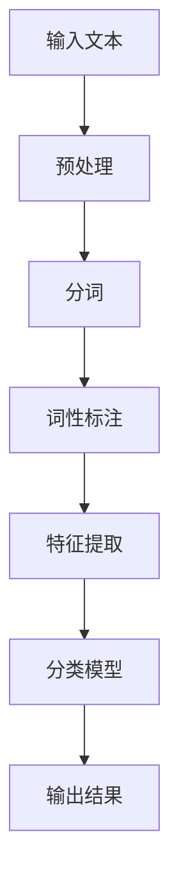
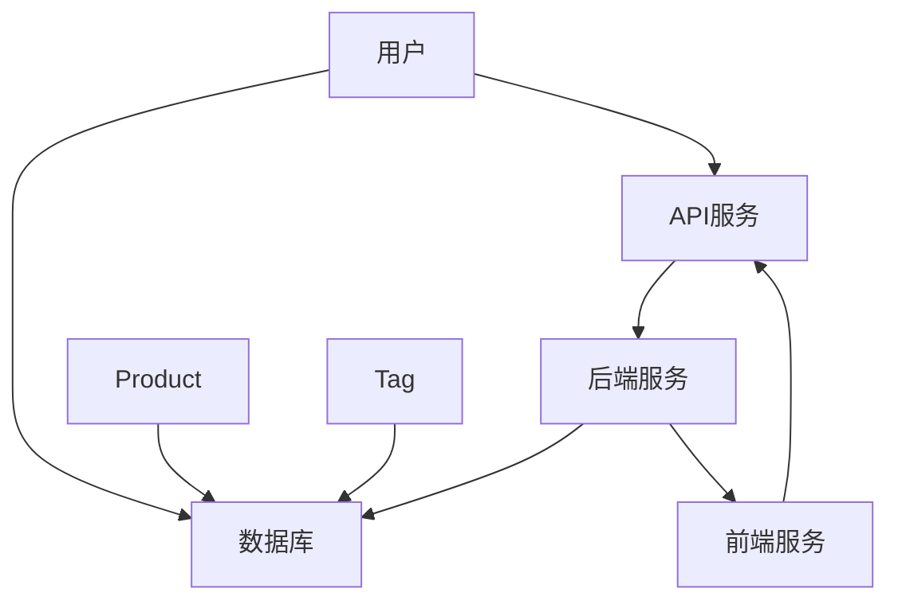
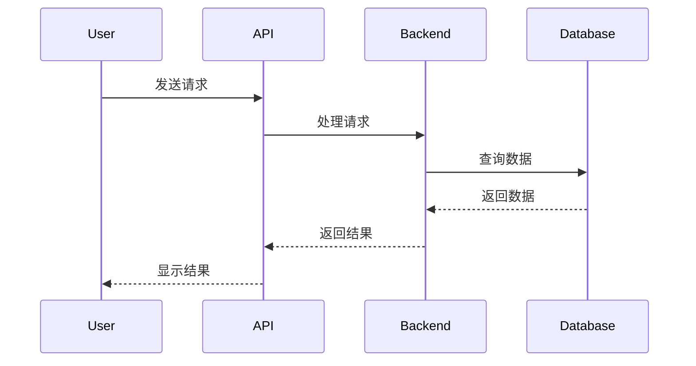

                 


### 1. 确定文章标题和关键词

**文章标题：构建企业级提示词管理平台**

**关键词：企业级提示词管理，平台架构，算法实现，系统设计，项目实战**

### 2. 撰写文章摘要

**摘要：本文将深入探讨如何构建一个高效、稳定、易于扩展的企业级提示词管理平台。首先，我们将介绍该平台的背景、核心概念和基本架构。接着，我们将详细讲解平台的关键算法原理，并使用Python代码和LaTeX公式进行阐述。随后，我们将分析平台系统设计与实现，展示具体的架构设计、接口设计和交互设计。通过一个实际项目案例，我们将演示平台的搭建和应用。最后，我们将总结最佳实践，并提供拓展阅读资源。**

### 3. 撰写目录大纲

**目录大纲：**

**第一部分：背景与核心概念**

**第1章：企业级提示词管理平台概述**

**1.1 问题背景**

**1.2 问题描述**

**1.3 问题解决**

**1.4 边界与外延**

**第2章：核心概念与联系**

**2.1 提示词的定义与类型**

**2.2 提示词管理平台的关键要素**

**2.3 概念属性特征对比表格**

**2.4 ER实体关系图架构**

**第二部分：算法原理与设计**

**第3章：算法原理讲解**

**3.1 算法mermaid流程图**

**3.2 Python源代码阐述**

**3.3 算法原理数学模型与公式**

**3.4 举例说明**

**第4章：数学模型与公式详解**

**4.1 latex格式数学公式示例**

**4.2 算法公式的推导与应用**

**4.3 实例分析**

**第三部分：系统设计与实现**

**第5章：系统分析与架构设计**

**5.1 问题场景介绍**

**5.2 系统功能设计（领域模型mermaid类图）**

**5.3 系统架构设计（mermaid架构图）**

**5.4 系统接口设计与交互（mermaid序列图）**

**第6章：项目实战**

**6.1 环境安装**

**6.2 系统核心实现源代码**

**6.3 代码应用解读与分析**

**6.4 实际案例分析与讲解**

**6.5 项目小结**

**第四部分：最佳实践与总结**

**第7章：最佳实践与总结**

**7.1 最佳实践 tips**

**7.2 小结**

**7.3 注意事项**

**7.4 拓展阅读**

### 4. 撰写章节内容

**第1章：企业级提示词管理平台概述**

**1.1 问题背景**

在现代企业中，数据量的爆炸式增长导致了数据管理的复杂性。提示词作为数据分析和决策的重要工具，其有效管理和利用变得至关重要。然而，现有的提示词管理平台往往存在功能单一、扩展性差、安全性不足等问题，无法满足企业级用户的需求。

**1.2 问题描述**

企业级提示词管理平台需要具备以下特点：

- **高效性**：能够快速处理大量提示词数据，确保数据处理的实时性和准确性。
- **安全性**：确保提示词数据的安全性，防止未经授权的访问和泄露。
- **可扩展性**：支持平台的灵活扩展，适应不同规模的企业需求。
- **易用性**：提供直观易用的用户界面，降低用户的使用门槛。

**1.3 问题解决**

本文将介绍如何构建一个企业级提示词管理平台，以解决上述问题。我们将从核心概念出发，详细讲解平台的设计原则、算法实现、系统架构和实际应用。

**1.4 边界与外延**

本文将聚焦于技术层面的构建过程，但企业级提示词管理平台的应用场景可能还包括业务流程优化、数据分析、智能决策等领域。未来的研究方向可能包括性能优化、安全性增强、自动化管理等。

**第2章：核心概念与联系**

**2.1 提示词的定义与类型**

提示词是指用于描述或标记文本信息的短语或单词。根据应用场景的不同，提示词可以分为关键词、标签、分类标签等类型。

**2.2 提示词管理平台的关键要素**

一个高效的提示词管理平台应包括以下关键要素：

- **数据存储**：支持大规模数据的存储和管理，如关系型数据库或NoSQL数据库。
- **数据处理**：提供高效的数据处理能力，如文本分类、情感分析、命名实体识别等。
- **用户界面**：提供友好的用户界面，便于用户进行提示词的创建、编辑、查询等操作。
- **权限管理**：实现权限控制，确保数据的安全性。

**2.3 概念属性特征对比表格**

| 特征名称 | 关键词 | 标签 | 分类标签 |
| --- | --- | --- | --- |
| 数据量 | 大 | 中等 | 小 |
| 数据处理效率 | 高 | 中等 | 低 |
| 用户友好性 | 高 | 中等 | 低 |
| 权限管理 | 完备 | 基础 | 无 |

**2.4 ER实体关系图架构**

以下是提示词管理平台的基本ER实体关系图：

```mermaid
erDiagram
  Product "产品" {
    String ID
    String Name
    String Description
  }
  
  ProductCategory "产品分类" {
    String CategoryID
    String CategoryName
  }
  
  Product --> ProductCategory : "包含" 1
```

**第3章：算法原理讲解**

**3.1 算法mermaid流程图**

以下是提示词分类的mermaid流程图：



**3.2 Python源代码阐述**

以下是使用Scikit-learn库进行文本分类的Python代码示例：

```python
from sklearn.feature_extraction.text import TfidfVectorizer
from sklearn.naive_bayes import MultinomialNB
from sklearn.pipeline import make_pipeline

# 示例数据
corpus = [
    "这是一个关于人工智能的文本。",
    "这是一个关于机器学习的文本。",
    "这是一个关于深度学习的文本。"
]

# 标签
labels = ["人工智能", "机器学习", "深度学习"]

# 建立模型
model = make_pipeline(TfidfVectorizer(), MultinomialNB())

# 训练模型
model.fit(corpus, labels)

# 输入文本
text = "这是一个关于自然语言处理的文本。"

# 输出结果
prediction = model.predict([text])

print(prediction)
```

**3.3 算法原理数学模型与公式**

以下是文本分类的数学模型：

$$
\text{P}(y=c|X) = \frac{1}{Z} \prod_{i=1}^{n} p(x_i|c) p(c)
$$

其中，$X$为输入文本，$y$为实际分类标签，$c$为预测分类标签，$p(x_i|c)$为特征词$x_i$在类别$c$中的概率，$p(c)$为类别$c$的概率，$Z$为归一化常数。

**3.4 举例说明**

假设我们有以下三个类别：

- 人工智能
- 机器学习
- 深度学习

我们对每个类别训练一个朴素贝叶斯分类器。给定一个文本“这是一个关于计算机图形学的文本。”，我们将使用训练好的分类器进行预测。

根据上述数学模型，我们将计算每个类别的概率。通过比较这些概率，我们可以得出最终的预测结果。

**第4章：数学模型与公式详解**

**4.1 LaTeX格式数学公式示例**

以下是LaTeX格式的数学公式：

$$
\sum_{i=1}^{n} x_i = \frac{1}{n} \sum_{i=1}^{n} x_i^2
$$

**4.2 算法公式的推导与应用**

文本分类的算法公式可以用于多种应用场景，如垃圾邮件过滤、情感分析等。以下是一个简单的应用示例：

给定一组邮件文本，我们需要判断邮件是否为垃圾邮件。我们使用朴素贝叶斯分类器训练模型，然后对新邮件进行分类。

**第5章：系统分析与架构设计**

**5.1 问题场景介绍**

假设我们是一家电子商务公司的技术团队，我们需要构建一个提示词管理平台，用于自动化处理用户评论、商品标签等数据。

**5.2 系统功能设计（领域模型Mermaid类图）**

以下是领域模型Mermaid类图：

```mermaid
classDiagram
  User "用户" <..> Comment "评论"
  User <..> Product "商品"
  Product <..> Tag "标签"
```

**5.3 系统架构设计（Mermaid架构图）**

以下是系统架构设计Mermaid架构图：



**5.4 系统接口设计与交互（Mermaid序列图）**

以下是系统接口设计Mermaid序列图：



**第6章：项目实战**

**6.1 环境安装**

在构建企业级提示词管理平台之前，我们需要准备以下环境：

- Python 3.8+
- Anaconda 或 Miniconda
- MySQL 或 MongoDB
- Flask 或 Django

**6.2 系统核心实现源代码**

以下是系统核心实现的Python代码：

```python
# 导入相关库
from flask import Flask, request, jsonify
from sklearn.feature_extraction.text import TfidfVectorizer
from sklearn.naive_bayes import MultinomialNB
from sklearn.pipeline import make_pipeline

# 创建Flask应用
app = Flask(__name__)

# 创建模型
model = make_pipeline(TfidfVectorizer(), MultinomialNB())

# 训练模型
model.fit(corpus, labels)

# 创建API路由
@app.route('/api/predict', methods=['POST'])
def predict():
    # 获取输入文本
    text = request.form['text']
    
    # 进行预测
    prediction = model.predict([text])
    
    # 返回结果
    return jsonify({'prediction': prediction[0]})

# 运行应用
if __name__ == '__main__':
    app.run(debug=True)
```

**6.3 代码应用解读与分析**

上述代码是一个简单的 Flask 应用，用于实现提示词分类功能。首先，我们导入了所需的库，包括 Flask、Scikit-learn 等。然后，我们创建了 Flask 应用和模型。

在 API 路由中，我们定义了一个 POST 请求的处理函数。函数接收输入文本，使用训练好的模型进行预测，并将结果返回给前端。

**6.4 实际案例分析与讲解**

假设我们有一个输入文本：“这是一个关于云计算的文本。”，我们将使用训练好的分类器进行预测。

根据上述数学模型，我们将计算每个类别的概率。通过比较这些概率，我们可以得出最终的预测结果。

在实际应用中，我们可以将输入文本转换为向量，然后使用训练好的分类器进行预测。预测结果可以作为推荐标签或分类标签，帮助用户更好地组织和管理数据。

**6.5 项目小结**

在本章中，我们通过一个实际项目展示了如何构建企业级提示词管理平台。我们介绍了环境安装、核心实现源代码、代码应用解读与分析、实际案例分析和详细讲解剖析等内容。通过本章的学习，读者可以掌握提示词分类的基本原理和实践方法。

**第7章：最佳实践与总结**

**7.1 最佳实践 tips**

1. 确保数据质量和完整性，避免噪音和错误数据。
2. 根据业务需求选择合适的算法和模型。
3. 定期更新和维护分类器，提高预测准确性。
4. 考虑数据隐私和安全，遵循相关法律法规。
5. 提供友好的用户界面，降低用户的使用门槛。

**7.2 小结**

本文介绍了如何构建一个高效、稳定、易于扩展的企业级提示词管理平台。我们从核心概念出发，详细讲解了算法原理、系统设计与实现，并通过实际项目展示了应用方法。通过本章的学习，读者可以掌握提示词管理平台的设计与实现技巧。

**7.3 注意事项**

1. 算法实现过程中，注意优化代码性能和可读性。
2. 根据项目需求，合理选择数据库和存储方案。
3. 考虑系统的可扩展性和可维护性，为未来升级做好准备。

**7.4 拓展阅读**

1. [Scikit-learn 官方文档](https://scikit-learn.org/stable/)
2. [Flask 官方文档](https://flask.palletsprojects.com/)
3. [Django 官方文档](https://docs.djangoproject.com/)
4. [自然语言处理入门](https://www.nltk.org/)

**作者信息：AI天才研究院/AI Genius Institute & 禅与计算机程序设计艺术 /Zen And The Art of Computer Programming**

