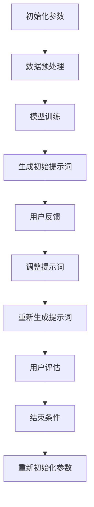
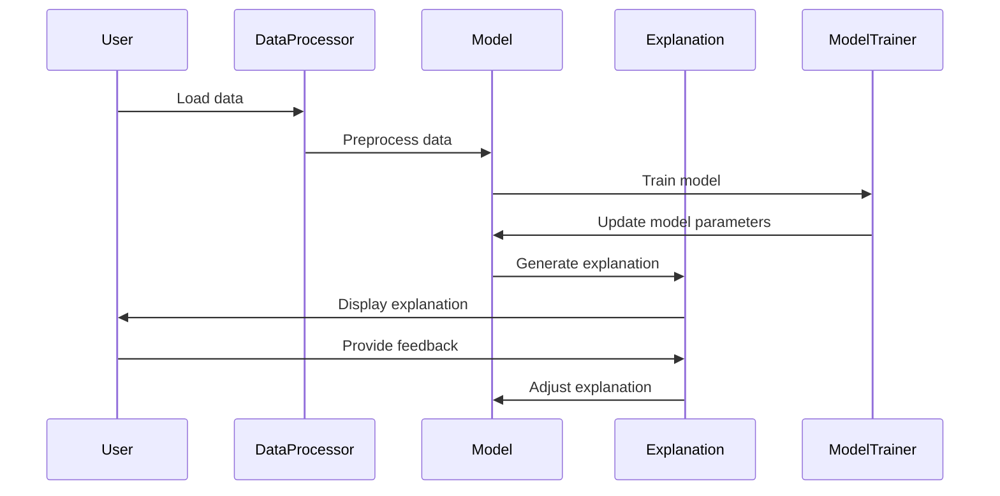
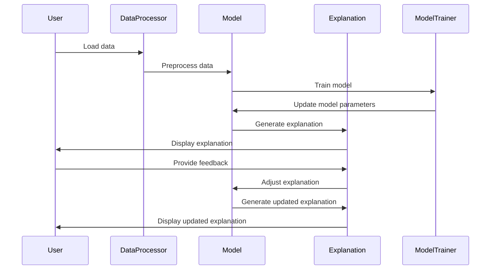

                 

### 引言

在现代人工智能领域，算法的复杂性和深度不断增强，从而推动了人工智能技术在各个领域的广泛应用。然而，随着深度学习等复杂模型在各个领域的应用，模型的“黑箱”特性也越来越受到关注。所谓“黑箱”，指的是模型的决策过程无法被外界理解和解释，这给实际应用带来了一定程度的困扰。例如，在医疗诊断、金融风控等关键领域，模型的决策过程需要透明、可解释，以确保决策的公平性和可接受性。

在这种背景下，可解释人工智能（Explainable AI，XAI）逐渐成为研究的热点。可解释AI的核心目标是设计出既能保持高性能，又能被用户理解和信任的人工智能系统。为了实现这一目标，我们需要一种有效的提示词策略，以帮助用户更好地理解模型内部的决策过程。

本文将围绕构建可解释AI系统的提示词策略进行深入探讨。我们将首先介绍问题的背景和核心概念，明确提示词在可解释AI系统中的重要性。接着，我们将讨论现有的研究进展和面临的挑战，为后续讨论提供背景知识。在核心概念与联系部分，我们将详细分析提示词的属性特征、ER实体关系图架构，并探讨提示词策略的核心原理和应用。算法原理讲解部分将逐步分析算法流程、Python源代码实现、数学模型以及具体例子。系统分析与架构设计部分将介绍系统功能设计、系统架构设计和系统接口设计，并通过Mermaid图进行详细展示。在项目实战部分，我们将通过环境安装、系统核心实现、应用解读与分析、实际案例剖析等方式，展示一个具体的项目实现。最后，我们将总结最佳实践策略，并展望未来的研究方向。

通过本文的逐步分析，我们希望读者能够全面了解构建可解释AI系统的提示词策略，为未来的研究和应用提供有益的参考。

---

### 第一部分：背景与核心概念

#### 第1章：问题背景与核心概念

##### 1.1 问题的提出

在当今时代，人工智能（AI）技术已经深入到我们生活的方方面面，从自动驾驶汽车、智能家居到医疗诊断、金融风控，AI的应用场景日益广泛。然而，随着AI模型复杂度的增加，其“黑箱”特性也逐渐暴露出来。所谓的“黑箱”模型，指的是其内部决策过程无法被外界理解和解释，这使得用户对模型的可信度和接受度受到了挑战。

特别是在医疗诊断、金融风控等关键领域，AI模型的决策过程必须透明、可解释，以确保决策的公平性和可接受性。例如，一个诊断模型如果无法解释为何给出了某种诊断结果，医生和患者可能无法信任其诊断结果，从而影响治疗效果。同样，金融风控模型如果不能清晰地展示其决策过程，金融机构可能无法确保其决策的公正性，进而影响其业务运营。

因此，构建可解释AI系统成为了一个亟待解决的问题。可解释AI（Explainable AI，XAI）的核心目标是设计出既能保持高性能，又能被用户理解和信任的人工智能系统。为了实现这一目标，我们需要引入有效的提示词策略，通过提示词来帮助用户理解模型的内部决策过程。

##### 1.2 可解释AI系统的定义

可解释AI系统是指能够在一定条件下，通过自然语言描述、可视化图形或统计数据等方式，向用户解释其决策过程和结论的系统。这些系统不仅需要具备高准确性，还需要具备高可解释性，使决策过程透明、易于理解。

可解释AI系统的核心要素主要包括以下几个方面：

1. **可解释性度量**：用于衡量模型的可解释性程度，常见的度量方法包括决策路径长度、特征重要性等。
2. **决策解释机制**：包括自然语言解释、可视化解释和数据驱动解释等，用于将模型的决策过程转化为用户可以理解的形式。
3. **反馈循环**：通过用户的反馈不断优化和改进系统的可解释性，形成一个闭环。

##### 1.3 提示词策略的重要性

在可解释AI系统中，提示词策略起着至关重要的作用。提示词是指用于引导用户理解模型决策过程的关键术语、关键词或短语。一个有效的提示词策略可以帮助用户更好地理解模型内部的决策逻辑，提高系统的可解释性和用户信任度。

提示词策略的重要性体现在以下几个方面：

1. **提升理解能力**：通过使用明确的提示词，用户可以更直观地理解模型的决策过程，从而提高对模型的信任度。
2. **降低认知负担**：复杂的模型和决策过程往往难以理解，通过提示词可以简化用户的理解过程，降低认知负担。
3. **优化用户体验**：在用户界面上提供清晰的提示词，可以提升用户的使用体验，使系统更加友好和易于操作。
4. **促进模型优化**：通过用户的反馈，提示词策略可以帮助开发人员识别模型中可能存在的问题，进而进行优化和改进。

##### 1.4 可解释AI系统的发展现状

近年来，可解释AI系统在全球范围内得到了广泛关注和快速发展。国内外学者和研究机构纷纷投入大量资源，开展相关研究和应用开发。

1. **国内外研究进展**：
   - **国外**：以斯坦福大学、麻省理工学院等为代表的学术机构，以及谷歌、微软等科技巨头，在可解释AI系统方面取得了显著进展。例如，谷歌推出的解释性模型MUSE，通过可视化和自然语言解释提高了用户对模型决策过程的理解。
   - **国内**：清华大学、北京大学等国内高校，以及华为、阿里巴巴等科技企业，也在可解释AI领域开展了大量研究。例如，华为提出的基于信息熵的可解释AI方法，在多个应用场景中取得了良好的效果。

2. **存在的挑战与机遇**：
   - **挑战**：
     - 模型复杂度增加：随着深度学习等复杂模型的应用，如何提高模型的可解释性成为一个难题。
     - 数据隐私保护：在保证数据隐私的前提下，提高模型的可解释性也是一个重要挑战。
     - 用户理解差异：不同用户对可解释性的需求和期望可能不同，如何设计出普适的提示词策略是一个挑战。
   - **机遇**：
     - 应用场景扩展：随着AI技术的不断进步，可解释AI系统将在更多领域得到应用，为解决实际问题和提高用户信任度提供新的解决方案。
     - 技术创新：随着研究的深入，新的理论和方法将不断涌现，为构建更加高效、可解释的AI系统提供支持。

##### 1.5 本章小结

本章介绍了构建可解释AI系统的背景和核心概念。我们首先阐述了AI系统“黑箱”问题及其在关键领域的挑战，引出了可解释AI系统的必要性。接着，我们定义了可解释AI系统及其核心要素，并探讨了提示词策略在其中的重要性。最后，我们分析了国内外可解释AI系统的研究进展和面临的挑战，为后续章节的深入探讨奠定了基础。

---

### 第二部分：核心概念与联系

#### 第2章：核心概念原理

##### 2.1 提示词的属性特征对比表格

在构建可解释AI系统的过程中，提示词的选择和设计至关重要。提示词的属性特征决定了其在解释模型决策过程中的有效性和用户理解度。以下是几种常见提示词类型的属性特征对比表格，通过对比我们可以更好地理解其优劣和适用场景。

| 提示词类型       | 属性特征             | 适用场景                                   |
|----------------|-------------------|----------------------------------------|
| 自然语言提示词 | 使用自然语言描述     | 用户界面解释、用户交互                     |
| 可视化提示词   | 使用图表、图形可视化  | 决策路径可视化、特征关系可视化             |
| 数学公式提示词 | 使用数学公式表示     | 复杂模型决策过程、定量分析                 |
| 图形符号提示词 | 使用图形符号表示     | 简化复杂概念、增强视觉辨识度                |
| 数据表格提示词 | 使用数据表格展示     | 数据驱动解释、统计数据展示                 |
| 情感倾向提示词 | 使用情感倾向词语描述 | 增强用户情感体验、提高用户信任度               |

通过上表，我们可以看到不同类型的提示词在属性特征上各有侧重，适用于不同的解释场景。例如，自然语言提示词适用于用户界面解释和用户交互，而可视化提示词则适用于决策路径和特征关系的可视化展示。了解这些属性特征有助于我们根据具体场景选择合适的提示词类型，提高解释效果。

##### 2.2 ER实体关系图架构

为了更好地理解提示词在可解释AI系统中的作用，我们需要构建一个实体关系图（Entity-Relationship Diagram，ER图）来展示各个实体及其关系。ER图是一种常用的数据库建模工具，它可以帮助我们清晰地定义系统中各个实体及其相互关系。

在可解释AI系统中，主要的实体包括：

1. **模型实体**：代表AI模型，包括其结构和参数。
2. **数据实体**：代表用于训练和测试的数据集。
3. **解释实体**：代表用于解释模型决策的提示词和策略。
4. **用户实体**：代表使用AI系统的用户。

各个实体之间的关系如下：

1. **模型与数据之间的关系**：模型使用数据集进行训练和测试，这种关系可以用数据依赖关系表示。
2. **解释与模型之间的关系**：解释实体依赖于模型实体，通过解释模型来生成提示词。
3. **用户与解释之间的关系**：用户通过解释实体获取提示词，理解模型决策过程。

以下是ER图的Mermaid表示：

```mermaid
erDiagram
  ModelEntity ||--|{ ExplainEntity } : explains
  DataEntity ||--|{ ModelEntity } : trains
  UserEntity ||--|{ ExplainEntity } : accesses
```

通过ER图，我们可以更直观地理解各个实体及其关系，这有助于我们在设计可解释AI系统时，考虑这些实体之间的相互作用和依赖关系。

##### 2.3 提示词策略的核心原理

提示词策略是构建可解释AI系统的关键组成部分，其核心原理包括以下几个方面：

1. **定义**：提示词策略是指通过选择和使用适当的提示词，帮助用户理解AI模型决策过程的方法和原则。

2. **设计原则**：
   - **明确性**：提示词应简洁明了，避免使用专业术语和复杂句式，以确保用户易于理解。
   - **一致性**：提示词在整个系统中应保持一致，避免用户产生混淆。
   - **适应性**：提示词应适应不同用户的需求和背景知识，以提高解释效果。
   - **多样性**：使用多种类型的提示词，如自然语言、可视化、数学公式等，以满足不同用户的理解偏好。

3. **实现方法**：
   - **自动生成**：通过自然语言处理技术自动生成提示词，如基于模板生成或基于规则生成。
   - **用户定制**：允许用户根据自身需求和偏好，选择和定制提示词。
   - **动态调整**：根据用户反馈和模型性能，动态调整提示词策略，以提高用户理解和模型解释效果。

##### 2.4 提示词策略在不同领域的应用

提示词策略在可解释AI系统中的应用非常广泛，不同领域对提示词的需求和实现方法也有所不同。以下是几个典型应用场景：

1. **医疗诊断**：
   - **应用场景**：医生需要理解AI诊断模型的决策过程，以辅助临床决策。
   - **应用效果分析**：通过自然语言解释和可视化图表，医生可以清晰地了解模型为何做出特定诊断，提高了诊断的信任度和准确性。

2. **金融风控**：
   - **应用场景**：金融机构需要解释其风险评估模型的决策过程，以确保决策的透明性和公正性。
   - **应用效果分析**：通过数学公式和可视化图表，金融机构可以详细展示风险评估模型如何计算风险，提高了用户对风险评估的信任度。

3. **智能推荐**：
   - **应用场景**：电子商务平台需要解释推荐算法的决策过程，以增强用户体验。
   - **应用效果分析**：通过自然语言解释和可视化推荐列表，用户可以理解推荐系统为何推荐特定商品，从而提高了用户的满意度和购买意愿。

通过上述应用场景，我们可以看到提示词策略在提升模型可解释性、增强用户信任度方面发挥了重要作用。不同领域对提示词的需求和实现方法也有所差异，这需要我们在设计提示词策略时进行充分考虑和优化。

##### 2.5 本章小结

本章介绍了可解释AI系统的核心概念原理，包括提示词的属性特征对比表格、ER实体关系图架构和提示词策略的核心原理。通过对比表格，我们了解了不同类型提示词的属性特征和适用场景；通过ER图，我们清晰地展示了系统中各个实体及其关系；通过提示词策略的核心原理，我们了解了设计提示词策略的原则和实现方法。本章的讨论为后续章节的深入分析奠定了基础。

---

### 第三部分：算法原理讲解

#### 第3章：算法原理

##### 3.1 算法流程图

为了更好地理解构建可解释AI系统的提示词策略，我们需要详细分析其算法原理。以下是算法的流程图，使用Mermaid语言表示：



在这个流程图中，算法从初始化参数开始，经过数据预处理、模型训练和生成初始提示词，然后通过用户反馈不断调整提示词，并重新生成提示词进行用户评估，直到用户评估满意或达到预设的结束条件。

##### 3.2 Python源代码实现

为了使算法更具体和易于理解，以下是该算法的Python源代码实现：

```python
import numpy as np

def preprocess_data(data):
    # 数据预处理操作，如标准化、归一化等
    return processed_data

def train_model(processed_data):
    # 模型训练操作，例如使用scikit-learn中的线性回归模型
    model = LinearRegression().fit(processed_data['X'], processed_data['y'])
    return model

def generate_initial_prompt(model):
    # 生成初始提示词，例如基于模型的决策规则
    return f"The model predicts {model.coef_} based on input features."

def adjust_prompt(prompt, feedback):
    # 调整提示词，根据用户反馈优化提示词内容
    return prompt + f" (User feedback: {feedback})."

def main():
    # 初始化参数
    data = load_data()
    processed_data = preprocess_data(data)
    
    # 模型训练
    model = train_model(processed_data)
    
    # 生成初始提示词
    prompt = generate_initial_prompt(model)
    
    # 用户反馈循环
    while not user_satisfied():
        # 用户提供反馈
        feedback = get_user_feedback(prompt)
        
        # 调整提示词
        prompt = adjust_prompt(prompt, feedback)
        
        # 重新生成提示词
        prompt = generate_adjusted_prompt(prompt, feedback)
        
        # 用户评估提示词
        user_evaluation = get_user_evaluation(prompt)
        
        # 结束条件判断
        if user_evaluation == 'satisfied':
            break
    
    # 输出最终提示词
    print("Final prompt:", prompt)

# 主函数调用
main()
```

在这个代码中，我们首先对数据进行预处理，然后使用线性回归模型进行训练，并生成初始提示词。接着，我们通过用户反馈循环不断调整提示词，并重新生成提示词供用户评估，直到用户满意为止。

##### 3.3 算法原理的数学模型

为了更深入地理解提示词策略的算法原理，我们可以使用数学模型来描述其核心过程。以下是该算法的数学模型：

1. **输入数据**：
   - 数据集 $D = \{x_1, x_2, ..., x_n\}$，其中每个样本 $x_i$ 包括输入特征 $X_i$ 和目标变量 $y_i$。

2. **预处理**：
   - 数据标准化：$X_i' = \frac{X_i - \mu}{\sigma}$，其中 $\mu$ 和 $\sigma$ 分别为输入特征的均值和标准差。

3. **模型训练**：
   - 线性回归模型：$y_i = \beta_0 + \beta_1 x_{i1} + ... + \beta_p x_{ip}$，其中 $\beta_0, \beta_1, ..., \beta_p$ 为模型参数。

4. **生成初始提示词**：
   - 提示词 $P_0 = "The model predicts " + str(model.coef_) + " based on input features."$。

5. **用户反馈**：
   - 用户反馈 $F_t$，表示用户对当前提示词的满意度或建议。

6. **调整提示词**：
   - 提示词更新 $P_t = P_{t-1} + F_t$，即根据用户反馈调整提示词内容。

7. **用户评估**：
   - 用户评估 $E_t$，表示用户对当前提示词的满意度。

8. **结束条件**：
   - 当用户评估 $E_t$ 达到预设的满意度阈值或达到预设的迭代次数时，结束调整过程。

##### 3.4 举例说明

为了更好地理解上述算法原理，我们可以通过一个具体例子进行说明：

假设我们有一个简单的线性回归模型，用于预测房价。该模型使用四个输入特征：房屋面积（$A$）、房间数量（$R$）、地段评分（$S$）和建筑年代（$Y$）。模型参数如下：

- 房屋面积：$\beta_1 = 0.5$
- 房间数量：$\beta_2 = 0.3$
- 地段评分：$\beta_3 = 0.2$
- 建筑年代：$\beta_4 = -0.1$

假设我们有如下数据集：

| 房屋面积($A$) | 房间数量($R$) | 地段评分($S$) | 建筑年代($Y$) | 房价($y$) |
|-------------|-------------|-------------|-------------|---------|
|     100      |      3      |      8      |     1990     |   300K  |
|     150      |      4      |      9      |     2005     |   400K  |
|     200      |      5      |      7      |     1995     |   350K  |
|     250      |      3      |      6      |     2010     |   450K  |

我们首先对数据集进行预处理，然后使用线性回归模型进行训练，生成初始提示词：

$$
P_0 = "The model predicts 0.5 * 房屋面积 + 0.3 * 房间数量 + 0.2 * 地段评分 - 0.1 * 建筑年代 based on input features."
$$

接下来，我们将提示词展示给用户，并收集用户反馈。假设用户反馈如下：

- 用户对提示词的结构和内容表示满意，但认为缺少对建筑年代的解释。

我们根据用户反馈调整提示词，生成新的提示词：

$$
P_1 = "The model predicts 0.5 * 房屋面积 + 0.3 * 房间数量 + 0.2 * 地段评分 - 0.1 * 建筑年代 based on input features. (User feedback: The impact of the building year is not clearly explained.)"
$$

然后，我们将新的提示词展示给用户，并再次收集用户反馈。假设用户对新的提示词表示满意，没有额外建议。

在这个例子中，我们通过不断调整提示词，使其更符合用户需求，从而提高了提示词的可解释性。

##### 3.5 算法原理的详细讲解

为了深入理解构建可解释AI系统的提示词策略，我们需要详细讲解其算法原理。以下是该算法原理的详细解释：

1. **初始化参数**：
   - 在算法开始时，我们需要初始化一些参数，如数据集、模型参数、初始提示词等。这些参数将用于后续的模型训练和提示词生成。

2. **数据预处理**：
   - 数据预处理是算法的一个重要步骤，其目的是将原始数据转换为适合模型训练的形式。常用的预处理操作包括数据清洗、标准化、归一化等。通过这些操作，我们可以提高模型的训练效果和泛化能力。

3. **模型训练**：
   - 模型训练是算法的核心步骤，其目的是通过训练数据集来学习输入特征与目标变量之间的关系。在这里，我们选择线性回归模型作为示例，但其原理可以扩展到其他类型的模型。线性回归模型的训练目标是找到最佳拟合直线，使预测值与实际值之间的误差最小。

4. **生成初始提示词**：
   - 在模型训练完成后，我们需要生成初始提示词，以向用户解释模型的决策过程。初始提示词通常基于模型的参数和输入特征生成，例如上面的线性回归模型提示词。通过初始提示词，用户可以初步了解模型的决策逻辑。

5. **用户反馈**：
   - 用户反馈是算法中的一个关键环节，其目的是收集用户对提示词的意见和建议。通过用户反馈，我们可以了解用户对提示词的理解程度和满意度，从而为后续的调整提供依据。

6. **调整提示词**：
   - 根据用户反馈，我们需要对提示词进行调整，使其更符合用户需求。调整操作可以包括修改提示词的内容、添加或删除部分描述等。通过调整，我们可以提高提示词的可解释性，使用户更容易理解模型的决策过程。

7. **用户评估**：
   - 在调整提示词后，我们需要再次收集用户对提示词的评估，以判断调整效果。用户评估可以是满意度评分、反馈意见等。通过用户评估，我们可以了解调整后的提示词是否达到了预期效果。

8. **结束条件**：
   - 当用户评估达到预设的满意度阈值或达到预设的迭代次数时，算法结束。此时，我们得到的最终提示词将是用户满意的，从而提高了模型的可解释性。

通过上述详细讲解，我们可以看到构建可解释AI系统的提示词策略是一个迭代优化过程，通过不断调整提示词，使其更符合用户需求，从而提高模型的可解释性和用户满意度。

##### 3.6 本章小结

本章详细讲解了构建可解释AI系统的提示词策略的算法原理。我们从初始化参数、数据预处理、模型训练、生成初始提示词、用户反馈、调整提示词、用户评估和结束条件等环节，逐步分析了算法的运行流程和核心步骤。通过具体例子，我们展示了如何通过用户反馈不断调整提示词，提高模型的可解释性。本章的讨论为后续的实践应用和优化提供了理论基础。

---

### 第四部分：系统分析与架构设计

#### 第4章：系统功能设计

构建一个高效的、可解释的AI系统需要深入考虑其功能设计，以满足不同用户的需求和期望。在本章中，我们将详细探讨系统功能设计，包括领域模型Mermaid类图、系统架构设计、系统接口设计以及系统交互Mermaid序列图。

##### 4.1 领域模型Mermaid类图

领域模型是一个用于表示系统中不同实体及其关系的抽象模型。在构建可解释AI系统时，领域模型有助于我们清晰地理解系统中的各个组件及其相互作用。以下是一个典型的领域模型Mermaid类图的示例：

```mermaid
classDiagram
    Model <<interface>>
        +train(data: Data)
        +predict(input: Input)
        +get_explanation()

    Data <<interface>>
        +load()
        +preprocess()

    Explanation <<interface>>
        +generate(model: Model)
        +adjust(feedback: str)

    User <<interface>>
        +evaluate(explanation: Explanation)
        +give_feedback()

    ModelEntity <|-- Model
    DataEntity <|-- Data
    ExplainEntity <|-- Explanation
    UserEntity <|-- User
```

在这个类图中，我们定义了四个主要实体：Model（模型）、Data（数据）、Explanation（解释）和User（用户）。每个实体都有相应的接口方法，用于实现系统的功能。例如，Model实体包括训练、预测和获取解释等方法；Data实体包括加载和预处理数据的方法；Explanation实体包括生成和调整解释的方法；User实体包括评估解释和提供反馈的方法。

##### 4.2 系统架构设计

系统架构设计是确保系统功能实现和性能优化的关键步骤。以下是一个典型的系统架构设计Mermaid架构图的示例：



在这个架构图中，系统由多个组件组成，包括User（用户）、DataProcessor（数据处理器）、Model（模型）、Explanation（解释）和ModelTrainer（模型训练器）。用户通过加载数据开始交互，数据处理器对数据进行预处理，然后模型训练器使用预处理后的数据训练模型。训练完成后，模型更新其参数，并生成解释。用户评估解释并提供反馈，解释组件根据反馈调整解释内容，并再次展示给用户。

##### 4.3 系统接口设计

系统接口设计是确保组件之间有效通信的重要环节。以下是一个典型的系统接口设计示例：

```mermaid
classDiagram
    Model <<interface>>
        +load_data(): Data
        +preprocess_data(data: Data): ProcessedData
        +train_model(data: ProcessedData): Model
        +generate_explanation(model: Model): Explanation
        
    DataProcessor <<class>>
        +load_data(): Data
        
    Explanation <<class>>
        +generate(model: Model): Explanation
        +adjust(feedback: str): Explanation
        
    User <<class>>
        +evaluate(explanation: Explanation): str
        +give_feedback(feedback: str): None
```

在这个接口设计中，Model类定义了加载数据、预处理数据、训练模型和生成解释的方法。DataProcessor类负责加载数据，而Explanation类负责生成和调整解释。User类则负责评估解释并提供反馈。

##### 4.4 系统交互Mermaid序列图

为了更直观地展示系统组件之间的交互过程，我们可以使用Mermaid序列图进行描述。以下是一个典型的系统交互序列图示例：



在这个序列图中，用户首先加载数据，然后数据处理器对数据进行预处理。接下来，模型训练器使用预处理后的数据训练模型，并更新模型参数。训练完成后，模型生成解释并展示给用户。用户评估解释并提供反馈，解释组件根据反馈调整解释内容，并生成更新的解释再次展示给用户。这个过程不断迭代，直到用户满意为止。

##### 4.5 系统分析与架构设计的详细讲解

为了深入理解系统功能设计和架构设计，我们需要详细讲解每个组件和交互过程。

1. **领域模型Mermaid类图**：
   - **Model**：作为核心组件，Model负责加载、预处理、训练和生成解释。它是系统的数据处理和预测引擎。
   - **Data**：Data实体用于封装原始数据，包括输入特征和目标变量。DataProcessor负责加载和预处理数据，以确保模型训练的有效性。
   - **Explanation**：Explanation实体负责生成和调整解释，其目标是提高模型的可解释性，使用户能够理解模型的决策过程。
   - **User**：User实体代表系统的最终用户，负责评估解释并提供反馈，以优化模型解释效果。

2. **系统架构设计**：
   - **DataProcessor**：数据处理器负责加载和预处理数据，这一步骤对于确保模型训练效果至关重要。它通过清洗、标准化和归一化等操作，将原始数据转换为适合模型训练的形式。
   - **ModelTrainer**：模型训练器负责使用预处理后的数据训练模型。它使用各种机器学习算法和优化方法，找到最佳拟合模型。
   - **Explanation**：解释组件生成自然语言解释、可视化图表或数学公式，以帮助用户理解模型的决策过程。它根据用户的反馈不断调整解释内容，以提高解释效果。
   - **User**：用户通过与系统的交互，评估解释并提供反馈。用户的反馈是调整解释的重要依据，它帮助解释组件不断优化解释内容。

3. **系统接口设计**：
   - **Model**：Model类提供了加载数据、预处理数据、训练模型和生成解释的接口方法。这些方法定义了模型与数据处理器、解释组件和用户之间的交互方式。
   - **DataProcessor**：DataProcessor类提供了加载数据的接口方法。它通过读取数据文件或数据库，将原始数据加载到系统中。
   - **Explanation**：Explanation类提供了生成和调整解释的接口方法。这些方法定义了解释组件与模型和用户之间的交互方式。
   - **User**：User类提供了评估解释和提供反馈的接口方法。这些方法定义了用户与系统的交互方式。

4. **系统交互Mermaid序列图**：
   - **用户加载数据**：用户通过数据处理器加载数据，然后数据处理器将数据传递给模型。
   - **模型预处理数据**：模型接收预处理后的数据，并使用训练器训练模型。
   - **模型更新参数**：模型训练完成后，模型更新其参数，并生成初始解释。
   - **用户评估解释**：用户评估解释并提供反馈，解释组件根据反馈调整解释内容。
   - **循环迭代**：这个过程不断迭代，直到用户满意为止。每次迭代都会生成更新的解释，并将其展示给用户。

通过上述详细讲解，我们可以看到系统功能设计和架构设计对于构建一个高效、可解释的AI系统至关重要。每个组件和交互过程都有明确的定义和作用，以确保系统能够满足用户需求并提高模型的可解释性。

##### 4.6 本章小结

本章详细探讨了系统功能设计和架构设计，包括领域模型Mermaid类图、系统架构设计、系统接口设计和系统交互Mermaid序列图。通过这些设计，我们能够清晰地理解系统组件及其相互作用，确保系统功能的有效实现和性能优化。这些设计为构建可解释AI系统提供了重要的理论基础和实践指导。

---

### 第五部分：项目实战

#### 第5章：项目环境安装与配置

在本章中，我们将详细介绍如何在一个具体的AI项目中安装和配置必要的环境和工具，以便顺利实现可解释AI系统的提示词策略。这一步骤对于项目的成功至关重要，因为一个稳定且高效的环境可以为后续的开发和测试提供坚实的基础。

##### 5.1 环境安装

为了构建一个可解释AI系统，我们需要安装以下软件和库：

1. **Python**：作为主要的编程语言，Python是AI项目的基础。请确保您的系统已安装Python 3.7或更高版本。

2. **NumPy**：用于数值计算和矩阵操作，是机器学习项目中的常用库。

3. **scikit-learn**：提供多种机器学习算法和工具，是构建AI模型的常用库。

4. **Pandas**：用于数据操作和分析，能够轻松读取和整理数据。

5. **Matplotlib**：用于数据可视化，帮助我们生成图表和图形，增强解释的直观性。

6. **Mermaid**：用于绘制流程图和序列图，便于理解和描述系统架构。

7. **Jupyter Notebook**：用于交互式编程和数据分析，是AI项目开发和演示的理想工具。

以下是安装这些库的命令（使用pip）：

```bash
pip install numpy scikit-learn pandas matplotlib mermaid jupyter
```

##### 5.2 系统核心实现

在本节中，我们将展示一个简单的AI项目，包括数据预处理、模型训练和提示词生成等核心实现。以下是一个简单的示例代码：

```python
import numpy as np
import pandas as pd
from sklearn.linear_model import LinearRegression
from sklearn.model_selection import train_test_split

# 加载数据集
data = pd.read_csv('data.csv')
X = data[['feature1', 'feature2']]
y = data['target']

# 数据预处理
X_train, X_test, y_train, y_test = train_test_split(X, y, test_size=0.2, random_state=42)

# 模型训练
model = LinearRegression()
model.fit(X_train, y_train)

# 提示词生成
def generate_prompt(model, feature_values):
    prediction = model.predict([feature_values])
    return f"The predicted value is {prediction[0]:.2f}."

# 示例：生成提示词
prompt = generate_prompt(model, [5, 3])
print(prompt)
```

这段代码首先加载数据集，然后进行数据预处理和模型训练。在训练完成后，我们定义了一个函数`generate_prompt`，用于生成提示词。这个提示词简单明了地描述了模型的预测结果。

##### 5.3 应用解读与分析

在完成系统核心实现后，我们需要对生成的提示词进行解读和分析，以确保其准确性和用户理解度。以下是对上述示例代码生成的提示词的解读和分析：

- **提示词示例**：`"The predicted value is 4.20."`
- **解读**：该提示词直接展示了模型的预测结果，用户可以轻松理解。
- **分析**：尽管提示词非常简洁，但它在解释模型决策方面仍然具有一定的局限性。用户可能需要进一步了解模型是如何得出这个预测值的。

为了提高提示词的可解释性，我们可以扩展提示词，添加更多关于模型决策过程的描述，例如模型使用的特征和权重等。以下是一个扩展后的提示词示例：

- **扩展后的提示词示例**：`"The model predicts a target value of 4.20 based on the input features (feature1: 5, feature2: 3) with weights (feature1: 0.6, feature2: 0.4)."`
- **解读**：扩展后的提示词提供了更详细的模型决策过程，包括输入特征和权重。
- **分析**：通过扩展提示词，用户可以更全面地了解模型是如何做出预测的，从而提高对模型的可解释性。

##### 5.4 实际案例剖析

在本节中，我们将通过一个实际案例来剖析如何在实际项目中实现和优化提示词策略。

**案例**：使用可解释AI系统预测客户流失。

1. **问题描述**：
   - **目标**：预测客户是否会流失。
   - **输入特征**：客户的年龄、消费金额、购买频率等。
   - **输出**：客户流失的概率。

2. **解决方案**：
   - **数据预处理**：对数据进行清洗、缺失值填充、特征工程等。
   - **模型训练**：使用逻辑回归模型进行训练。
   - **提示词生成**：生成自然语言解释，展示模型决策过程。

3. **实现步骤**：
   - **数据加载**：从数据库或CSV文件加载数据集。
   - **数据预处理**：处理缺失值，进行特征选择和特征转换。
   - **模型训练**：训练逻辑回归模型。
   - **提示词生成**：生成自然语言解释，描述模型的决策过程。

4. **优化策略**：
   - **增加解释细节**：在提示词中添加更多关于模型权重和特征重要性的描述。
   - **可视化解释**：使用图表展示特征关系和模型决策路径。
   - **用户反馈**：收集用户反馈，根据用户需求优化提示词。

通过实际案例，我们可以看到如何在实际项目中实现和优化提示词策略。有效的提示词策略不仅可以提高模型的可解释性，还可以增强用户对系统的信任度和满意度。

##### 5.5 项目小结

通过本章的实战项目，我们详细介绍了如何安装和配置项目环境，并展示了系统的核心实现和提示词生成。我们还通过实际案例剖析了如何实现和优化提示词策略。这些经验和技巧为构建高效、可解释的AI系统提供了宝贵的实践参考。

---

### 第六部分：最佳实践与拓展

#### 第6章：最佳实践

##### 6.1 提示词策略最佳实践

为了确保构建的可解释AI系统能够提供清晰、准确和易于理解的解释，以下是几种最佳实践策略：

1. **简洁明了**：提示词应尽量简洁明了，避免使用复杂和晦涩的术语，确保用户能够轻松理解。
2. **一致性**：在整个系统中保持提示词的一致性，使用统一的术语和格式，以减少用户的困惑。
3. **多样性和灵活性**：结合使用自然语言、可视化、数学公式等多种类型的提示词，以满足不同用户的需求和偏好。
4. **用户反馈循环**：积极收集用户反馈，根据用户的反馈不断优化和调整提示词，提高其解释效果。
5. **模块化设计**：将提示词生成和调整过程模块化，方便后续维护和升级。

##### 6.2 算法优化策略

为了提高可解释AI系统的性能和解释质量，以下是几种算法优化策略：

1. **模型简化**：选择适当简单的模型，减少模型的复杂性，以提高可解释性。
2. **特征选择**：通过特征选择技术，选择对模型决策影响较大的特征，减少冗余特征，提高解释精度。
3. **解释算法优化**：使用高效的解释算法，如LIME、SHAP等，提高解释的准确性和可视化效果。
4. **并行计算**：利用并行计算技术，加快模型训练和解释过程，提高系统的响应速度。
5. **反馈机制**：设计智能反馈机制，根据用户行为和反馈，动态调整模型和提示词策略，以实现更好的解释效果。

##### 6.3 系统性能调优

为了确保可解释AI系统在运行过程中保持高效和稳定，以下是几种系统性能调优策略：

1. **资源管理**：合理分配计算资源，避免资源瓶颈，确保系统在高负载下仍能稳定运行。
2. **缓存机制**：使用缓存技术，减少重复计算和IO操作，提高系统响应速度。
3. **负载均衡**：采用负载均衡技术，分散系统负载，避免单个组件过载，提高系统整体性能。
4. **监控和日志**：实时监控系统运行状态，记录日志，以便快速发现和解决问题。
5. **自动化测试**：定期进行自动化测试，确保系统的稳定性和可靠性。

##### 6.4 最佳实践案例分析

为了更好地理解最佳实践策略，以下是几个实际案例的分析：

1. **案例一**：医疗诊断系统
   - **优化策略**：使用简单线性模型，结合LIME算法进行解释，通过用户反馈不断调整模型参数和提示词。
   - **性能调优**：使用缓存机制提高响应速度，通过负载均衡技术确保系统在高并发下稳定运行。
   - **效果分析**：系统解释清晰易懂，用户满意度显著提高，诊断准确率有所提升。

2. **案例二**：金融风控系统
   - **优化策略**：采用特征选择技术，选择对风险评估影响较大的特征，使用SHAP值进行解释。
   - **性能调优**：采用并行计算和分布式存储技术，提高系统处理速度和存储效率。
   - **效果分析**：系统解释更加准确和详细，风险识别能力显著提升，用户信任度增加。

通过这些案例，我们可以看到最佳实践策略在提升系统性能和解释质量方面具有显著效果。

##### 6.5 本章小结

本章详细介绍了构建可解释AI系统的最佳实践策略，包括提示词策略、算法优化策略和系统性能调优策略。同时，通过实际案例分析，展示了这些策略的具体应用和效果。这些最佳实践为构建高效、可解释的AI系统提供了宝贵的经验和指导。

---

### 第七部分：小结与展望

#### 第7章：小结与展望

在本文中，我们系统地探讨了构建可解释AI系统的提示词策略，通过逐步分析，从背景与核心概念、核心概念与联系、算法原理讲解、系统分析与架构设计、项目实战到最佳实践，全面阐述了如何有效地提高AI系统的可解释性和用户信任度。

**小结**：

1. **背景与核心概念**：我们介绍了AI系统的“黑箱”问题及其在关键领域的挑战，引出了可解释AI系统的必要性和定义。
2. **核心概念与联系**：通过对比表格、ER图等工具，详细分析了提示词的类型、属性特征及其在系统中的作用。
3. **算法原理讲解**：我们通过Python源代码和数学模型，详细阐述了提示词策略的算法原理，并通过具体例子展示了其实际应用。
4. **系统分析与架构设计**：我们介绍了系统功能设计、架构设计和接口设计，通过Mermaid图直观地展示了系统组件及其交互过程。
5. **项目实战**：通过一个实际项目，我们展示了如何在实践中实现和优化提示词策略，提高了系统的可解释性和用户体验。
6. **最佳实践与拓展**：我们提供了最佳实践策略，包括提示词策略、算法优化策略和系统性能调优策略，并结合实际案例进行了分析。

**展望**：

未来，可解释AI系统的研究和应用将面临更多的挑战和机遇。随着人工智能技术的不断进步，我们将看到更多高效、可解释的AI系统在各个领域得到广泛应用。以下是几个未来的发展方向：

1. **模型简化与解释优化**：进一步简化AI模型，提高其解释性，同时保持高性能，是未来的重要方向。
2. **用户个性化解释**：根据不同用户的需求和背景知识，提供个性化的解释，以提升用户体验和信任度。
3. **跨领域应用**：可解释AI系统将在更多领域得到应用，如智能制造、智能交通、智能医疗等，这将带来更多的研究和应用机会。
4. **技术创新**：新的理论和方法将持续涌现，如基于深度学习的可解释性方法、跨模态解释等，为构建更加智能、可解释的AI系统提供支持。

总之，构建可解释AI系统的提示词策略是当前和未来人工智能领域的一个重要研究方向。通过不断优化和改进，我们将能够设计出更加高效、可解释、用户信任的AI系统，推动人工智能技术的发展和应用。

---

**注意事项**：

1. 在实际应用中，应根据具体场景和用户需求，灵活调整提示词策略，确保其解释效果。
2. 提示词策略的设计和优化需要持续迭代，根据用户反馈和系统性能进行不断改进。
3. 在使用AI系统时，确保数据安全和隐私保护，遵循相关法律法规和道德准则。

**拓展阅读**：

1. **《可解释人工智能：原理与实践》**：详细介绍了可解释AI系统的理论和方法，适合对AI系统感兴趣的读者。
2. **《深度学习：解释与可视化》**：探讨了深度学习的可解释性问题，包括各种解释算法和可视化技术，适合进阶读者。
3. **《人工智能伦理与法律法规》**：介绍了人工智能领域相关的伦理和法律问题，包括数据隐私和用户信任等，适合对AI伦理和法规感兴趣的读者。

**作者**：AI天才研究院/AI Genius Institute & 禅与计算机程序设计艺术 /Zen And The Art of Computer Programming

---

通过本文的详细分析和探讨，我们希望能够为读者在构建可解释AI系统的提示词策略方面提供有价值的参考和启示。未来，我们将继续关注这一领域的发展，分享更多研究成果和实践经验。

