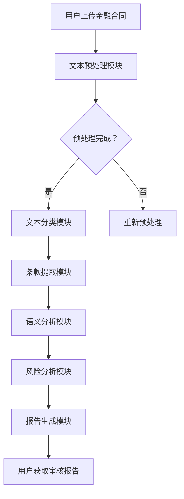
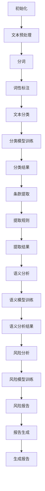

                 

# 《构建基于NLP的金融合同自动化审核系统》

## 关键词

- 自然语言处理（NLP）
- 金融合同
- 自动化审核
- 机器学习
- 深度学习
- 文本分类
- 语义分析

## 摘要

本文旨在探讨如何构建一个基于自然语言处理（NLP）技术的金融合同自动化审核系统。首先，我们分析了金融合同审核的现状、问题以及自动化审核系统的需求与挑战。接着，我们介绍了NLP的基础知识和关键技术，包括文本预处理、词向量表示和文本分类。随后，本文深入讲解了自然语言理解中的信息提取、语义分析和问答系统。最后，我们详细阐述了算法原理与数学模型，系统设计与实现，项目实战，以及最佳实践与总结。通过本文的阅读，读者可以全面了解金融合同自动化审核系统从理论到实践的构建过程，为实际应用提供参考。

## 第一部分：背景与核心概念

### 第1章：金融合同自动化审核的背景与重要性

#### 1.1 问题的背景

金融合同在金融行业中起着至关重要的作用。然而，随着金融业务的复杂性和规模的增长，传统的金融合同审核方法已经难以满足业务需求。手动审核金融合同不仅耗时耗力，而且容易出现人为错误，导致潜在的风险和损失。因此，如何提高金融合同审核的效率、准确性和一致性成为了一个亟待解决的问题。

#### 1.2 问题描述

金融合同自动化审核的主要问题包括：

1. **合同格式标准化**：不同金融机构和业务场景下的金融合同格式各异，使得自动化审核系统需要处理多种格式的文本。
2. **条款理解**：金融合同通常包含复杂的条款和条件，自动化审核系统需要准确理解这些条款的含义。
3. **文本分类**：自动化审核系统需要对金融合同进行分类，以便进一步处理和分析。
4. **数据质量**：金融合同文本中可能存在大量噪声、错别字和缺失值，这些都会对自动化审核系统的性能产生影响。

#### 1.3 问题解决的需求与挑战

为了解决上述问题，金融行业对自动化审核系统有以下需求：

1. **高准确度**：自动化审核系统需要能够准确识别和理解金融合同中的关键信息。
2. **高效率**：自动化审核系统需要能够快速处理大量金融合同，以提高工作效率。
3. **可扩展性**：自动化审核系统需要能够适应不同业务场景和合同格式，以应对不断变化的业务需求。
4. **低错误率**：自动化审核系统需要具备高鲁棒性，能够处理各种噪声和异常情况。

然而，实现这些需求也面临一系列挑战：

1. **数据集质量**：自动化审核系统需要大量高质量、标注清晰的训练数据，但在实际操作中，收集和标注这类数据往往困难重重。
2. **算法复杂度**：针对金融合同自动化审核的算法往往较为复杂，需要大量的计算资源和时间来训练和优化。
3. **法律法规遵守**：金融合同涉及多个法律法规，自动化审核系统需要确保其审核结果符合相关法律法规要求。

#### 1.4 核心概念与联系

为了构建一个有效的金融合同自动化审核系统，我们需要了解以下几个核心概念及其之间的联系：

1. **自然语言处理（NLP）**：NLP是计算机科学和语言学交叉领域，旨在使计算机能够理解、生成和操作人类语言。NLP技术在金融合同自动化审核中用于文本预处理、文本分类、信息提取等任务。
2. **机器学习（ML）**：机器学习是一种通过数据训练模型来自动化决策过程的算法。在金融合同自动化审核中，ML技术可用于文本分类、预测和异常检测等任务。
3. **深度学习（DL）**：深度学习是机器学习的一个子领域，通过构建深度神经网络来学习数据的复杂模式。深度学习在金融合同自动化审核中常用于文本分类、信息提取和语义分析等任务。
4. **文本分类**：文本分类是一种将文本数据分为不同类别的任务。在金融合同自动化审核中，文本分类可用于将合同分为不同类型、识别关键条款等。
5. **语义分析**：语义分析是一种理解和解释文本语义的技术。在金融合同自动化审核中，语义分析可用于提取合同中的关键信息、理解条款的含义等。

#### 1.5 边界与外延

金融合同自动化审核系统的边界和外部扩展主要包括以下几个方面：

1. **合同类型**：自动化审核系统应能够处理不同类型的金融合同，如贷款合同、租赁合同、投资合同等。
2. **业务场景**：自动化审核系统需要适应不同业务场景，如银行、证券、保险等金融行业。
3. **法律法规**：自动化审核系统需要遵守相关法律法规，确保审核结果符合法律要求。
4. **数据来源**：自动化审核系统应能够处理来自不同数据源的金融合同，如纸质文档、电子文档等。
5. **系统扩展**：自动化审核系统应具备良好的扩展性，能够根据业务需求和技术发展进行功能扩展和优化。

### 第2章：自然语言处理（NLP）基础

#### 2.1 NLP的定义与历史

自然语言处理（Natural Language Processing，NLP）是计算机科学和语言学交叉领域，旨在使计算机能够理解、生成和操作人类语言。NLP的历史可以追溯到20世纪50年代，当时的研究主要集中在机器翻译和语言分析。随着计算技术和算法的不断发展，NLP技术逐渐应用于更多领域，如信息检索、文本分类、语音识别等。

#### 2.2 NLP的关键技术

NLP的关键技术包括文本预处理、词向量表示、文本分类等。

1. **文本预处理**：文本预处理是NLP任务的基础，包括去除标点符号、停用词过滤、词干提取、词形还原等步骤。文本预处理旨在将原始文本转化为适合进行NLP处理的形式。
2. **词向量表示**：词向量表示是将文本数据转化为数值形式的一种方法，通过将单词映射为向量，使计算机能够处理和理解文本数据。常见的词向量表示方法包括Word2Vec、BERT等。
3. **文本分类**：文本分类是一种将文本数据分为不同类别的任务。在金融合同自动化审核中，文本分类可用于将合同分为不同类型、识别关键条款等。常见的文本分类算法包括朴素贝叶斯、支持向量机（SVM）和深度学习模型等。

#### 2.3 NLP在金融合同审核中的应用

NLP技术在金融合同审核中的应用主要包括以下几个方面：

1. **文本分类**：通过文本分类算法，将金融合同分为不同类型，如贷款合同、租赁合同等。这有助于提高审核效率，为后续处理提供指导。
2. **条款提取**：利用NLP技术，从金融合同中提取关键条款，如金额、期限、利率等。这有助于实现自动化审核，减少人为错误。
3. **语义分析**：通过语义分析，理解金融合同中的条款含义和逻辑关系。这有助于发现潜在风险和问题，提高审核准确度。
4. **风险预测**：利用NLP技术，分析金融合同中的风险因素，预测潜在风险。这有助于金融机构制定风险管理策略，降低业务风险。

### 第3章：文本预处理

文本预处理是自然语言处理（NLP）中的关键步骤，其目的是将原始文本转化为适合进行NLP分析的形式。本节将详细介绍文本预处理的基本步骤和关键技术。

#### 3.1 文本清洗

文本清洗是文本预处理的第一步，旨在去除文本中的噪声和无关信息，以提高后续NLP任务的准确性和效率。文本清洗通常包括以下步骤：

1. **去除标点符号**：标点符号对NLP任务的影响较小，可以去除以减少文本的复杂性。
2. **停用词过滤**：停用词是NLP中常见的噪声词汇，如“的”、“是”、“和”等。去除停用词有助于降低文本的噪声水平，提高特征提取的准确性。
3. **词干提取**：词干提取是一种将单词还原为其基本形式的技术，如将“running”还原为“run”。这有助于减少词汇的多样性，提高文本表示的统一性。
4. **词形还原**：词形还原是一种将不同形式但含义相同的单词映射为同一形式的技术，如将“bought”和“buy”映射为“buy”。这有助于提高文本表示的准确性。

#### 3.2 词向量表示

词向量表示是将文本数据转化为数值形式的一种方法，使计算机能够处理和理解文本数据。常见的词向量表示方法包括Word2Vec和BERT。

1. **Word2Vec**：Word2Vec是一种基于神经网络的语言模型，通过训练生成词向量。Word2Vec的基本思想是将每个单词映射为一个固定长度的向量，使得语义相似的单词在向量空间中距离较近。Word2Vec的主要优点是计算速度快，适合处理大规模数据。

   Word2Vec的训练过程包括两个步骤：

   - **CBOW（Continuous Bag of Words）**：CBOW模型通过计算中心词周围的上下文词的词向量平均值来生成中心词的词向量。
   - **Skip-Gram**：Skip-Gram模型通过计算中心词的词向量与周围词向量之间的点积来生成中心词的词向量。

2. **BERT**：BERT（Bidirectional Encoder Representations from Transformers）是一种基于Transformer的预训练语言模型，具有强大的语义表示能力。BERT通过双向编码器学习文本的语义信息，使得词向量能够捕捉到单词的前后关系。

   BERT的训练过程包括两个阶段：

   - **预训练**：在预训练阶段，BERT使用大量的无监督数据（如维基百科和书籍）来学习文本的语义表示。预训练过程主要包括Masked Language Model（MLM）和Next Sentence Prediction（NSP）任务。
   - **微调**：在微调阶段，BERT根据特定任务（如文本分类、命名实体识别等）进行优化，以提高在目标任务上的性能。

#### 3.3 文本分类

文本分类是一种将文本数据分为不同类别的任务，是NLP中常见的应用场景。在金融合同自动化审核中，文本分类可用于将合同分为不同类型、识别关键条款等。常见的文本分类算法包括朴素贝叶斯、支持向量机（SVM）和深度学习模型等。

1. **朴素贝叶斯**：朴素贝叶斯是一种基于贝叶斯定理的简单分类器，假设特征之间相互独立。朴素贝叶斯模型通过计算每个类别的概率，选择概率最大的类别作为预测结果。朴素贝叶斯模型的优点是计算速度快、易于实现，适用于特征数量较少的文本分类任务。

2. **支持向量机（SVM）**：支持向量机是一种基于优化理论的分类算法，通过寻找最佳超平面来最大化分类间隔。SVM模型通过计算特征空间中的支持向量来确定分类边界，具有较高的分类准确度。SVM模型适用于特征数量较多、维度较高的文本分类任务。

3. **深度学习模型**：深度学习模型是一种基于多层神经网络的结构，通过训练学习数据的复杂模式。常见的深度学习模型包括卷积神经网络（CNN）和循环神经网络（RNN）等。深度学习模型在文本分类任务中具有较高的分类准确度和泛化能力，但需要较大的计算资源和训练时间。

### 第4章：自然语言理解

自然语言理解（Natural Language Understanding，NLU）是NLP中的高级任务，旨在使计算机能够理解、解释和生成自然语言。在金融合同自动化审核中，自然语言理解技术可用于提取关键信息、理解条款含义和生成报告等。本节将详细介绍自然语言理解中的信息提取、语义分析和问答系统。

#### 4.1 信息提取

信息提取是一种从文本中提取关键信息的技术，是金融合同自动化审核中的关键任务。信息提取可分为实体提取和关系提取。

1. **实体提取**：实体提取是从文本中识别和分类出具有特定意义的实体，如人名、地名、组织名、日期、金额等。常见的实体提取方法包括基于规则的方法、基于统计的方法和基于深度学习的方法。

   - **基于规则的方法**：基于规则的方法通过预定义的规则来识别和分类实体。这种方法较为简单，但规则编写复杂且难以应对复杂的文本。
   - **基于统计的方法**：基于统计的方法通过统计文本中的词频、词序等特征来识别和分类实体。这种方法需要大量训练数据和特征工程，但具有较高的准确度和泛化能力。
   - **基于深度学习的方法**：基于深度学习的方法通过训练神经网络模型来识别和分类实体。这种方法具有较高的准确度和泛化能力，但需要较大的计算资源和训练时间。

2. **关系提取**：关系提取是从文本中识别和分类出实体之间的关系，如“张三”和“借钱”之间的关系。关系提取通常结合实体提取结果进行，常见的方法包括基于规则的方法、基于统计的方法和基于深度学习的方法。

   - **基于规则的方法**：基于规则的方法通过预定义的规则来识别和分类关系。这种方法较为简单，但规则编写复杂且难以应对复杂的文本。
   - **基于统计的方法**：基于统计的方法通过统计文本中的词频、词序等特征来识别和分类关系。这种方法需要大量训练数据和特征工程，但具有较高的准确度和泛化能力。
   - **基于深度学习的方法**：基于深度学习的方法通过训练神经网络模型来识别和分类关系。这种方法具有较高的准确度和泛化能力，但需要较大的计算资源和训练时间。

#### 4.2 语义分析

语义分析是一种理解和解释文本语义的技术，是金融合同自动化审核中的关键任务。语义分析可分为语义角色标注、语义依存关系分析和语义相似度计算。

1. **语义角色标注**：语义角色标注是从文本中识别和分类出每个单词的语义角色，如主语、谓语、宾语等。常见的语义角色标注方法包括基于规则的方法、基于统计的方法和基于深度学习的方法。

   - **基于规则的方法**：基于规则的方法通过预定义的规则来识别和分类语义角色。这种方法较为简单，但规则编写复杂且难以应对复杂的文本。
   - **基于统计的方法**：基于统计的方法通过统计文本中的词频、词序等特征来识别和分类语义角色。这种方法需要大量训练数据和特征工程，但具有较高的准确度和泛化能力。
   - **基于深度学习的方法**：基于深度学习的方法通过训练神经网络模型来识别和分类语义角色。这种方法具有较高的准确度和泛化能力，但需要较大的计算资源和训练时间。

2. **语义依存关系分析**：语义依存关系分析是从文本中识别和分类出单词之间的语义依存关系，如“买”和“书”之间的主谓关系。常见的语义依存关系分析方法包括基于规则的方法、基于统计的方法和基于深度学习的方法。

   - **基于规则的方法**：基于规则的方法通过预定义的规则来识别和分类语义依存关系。这种方法较为简单，但规则编写复杂且难以应对复杂的文本。
   - **基于统计的方法**：基于统计的方法通过统计文本中的词频、词序等特征来识别和分类语义依存关系。这种方法需要大量训练数据和特征工程，但具有较高的准确度和泛化能力。
   - **基于深度学习的方法**：基于深度学习的方法通过训练神经网络模型来识别和分类语义依存关系。这种方法具有较高的准确度和泛化能力，但需要较大的计算资源和训练时间。

3. **语义相似度计算**：语义相似度计算是从文本中计算单词、短语或句子之间的语义相似度。常见的语义相似度计算方法包括基于词向量的方法、基于语义依存关系的方法和基于知识图谱的方法。

   - **基于词向量的方法**：基于词向量的方法通过计算单词之间的词向量相似度来计算语义相似度。这种方法具有较高的计算效率和准确度，但难以应对复杂的语义关系。
   - **基于语义依存关系的方法**：基于语义依存关系的方法通过计算单词之间的语义依存关系相似度来计算语义相似度。这种方法能够更好地应对复杂的语义关系，但计算复杂度较高。
   - **基于知识图谱的方法**：基于知识图谱的方法通过构建知识图谱来表示语义信息，并计算单词、短语或句子之间的语义相似度。这种方法能够更好地应对复杂的语义关系，但需要较大的计算资源和知识库建设成本。

#### 4.3 问答系统

问答系统是一种能够理解和回答用户问题的技术，是金融合同自动化审核中的重要应用。问答系统可分为基于知识库的问答系统和基于生成模型的问答系统。

1. **基于知识库的问答系统**：基于知识库的问答系统通过构建知识库来存储和查询答案。常见的知识库构建方法包括基于规则的方法、基于语义网络的方法和基于图谱的方法。

   - **基于规则的方法**：基于规则的方法通过预定义的规则来匹配用户问题和知识库中的答案。这种方法较为简单，但难以应对复杂的语义关系。
   - **基于语义网络的方法**：基于语义网络的方法通过构建语义网络来表示知识库中的知识，并匹配用户问题和知识库中的答案。这种方法能够更好地应对复杂的语义关系，但需要较大的计算资源和知识库建设成本。
   - **基于图谱的方法**：基于图谱的方法通过构建知识图谱来表示知识库中的知识，并匹配用户问题和知识库中的答案。这种方法能够更好地应对复杂的语义关系，但需要较大的计算资源和知识库建设成本。

2. **基于生成模型的问答系统**：基于生成模型的问答系统通过训练生成模型来生成答案。常见的生成模型包括序列到序列模型（如Transformer）和生成对抗网络（GAN）。

   - **序列到序列模型**：序列到序列模型通过编码器-解码器结构来生成答案。编码器将用户问题编码为一个固定长度的向量，解码器将编码器的输出解码为答案。这种方法具有较高的生成质量，但需要较大的计算资源和训练时间。
   - **生成对抗网络**：生成对抗网络由生成器和判别器组成。生成器生成虚假答案，判别器判断生成器生成的答案是否真实。通过训练生成对抗网络，生成器能够生成高质量的虚假答案。这种方法具有较高的生成质量，但训练过程较为复杂。

### 第5章：算法原理与数学模型

自然语言处理（NLP）中的算法原理和数学模型是实现有效文本分析和理解的关键。在本章中，我们将详细探讨NLP的核心算法及其背后的数学原理，包括词向量表示、文本分类算法和深度学习模型。

#### 5.1 算法原理

1. **词向量表示（Word Embedding）**

词向量表示是将文本中的单词映射为向量空间中的点，以便计算机能够处理和理解文本。词向量表示的主要算法包括Word2Vec、GloVe和BERT。

   - **Word2Vec**：Word2Vec是一种基于神经网络的词向量表示方法，它通过训练神经网络来学习单词的上下文表示。Word2Vec有两种主要模型：连续词袋（CBOW）和Skip-Gram。

     $$ \text{CBOW}: \ \text{input} \ \text{word} \ \rightarrow \ \text{context} \ \text{vector} $$
     $$ \text{Skip-Gram}: \ \text{input} \ \text{word} \ \rightarrow \ \text{word} \ \text{vector} $$

   - **GloVe（Global Vectors for Word Representation）**：GloVe是一种基于全局统计的词向量表示方法，它通过计算单词和单词共现次数的矩阵分解来学习词向量。

     $$ \text{GloVe}: \ \text{co} \ \in \ \text{Co-occurrence Matrix}, \ \text{V} \ \in \ \text{Word Vector Matrix} $$

   - **BERT（Bidirectional Encoder Representations from Transformers）**：BERT是一种基于Transformer的预训练语言模型，它通过双向编码器学习文本的语义表示。

     $$ \text{BERT}: \ \text{input} \ \text{sequence} \ \rightarrow \ \text{contextualized word vectors} $$

2. **文本分类（Text Classification）**

文本分类是将文本数据分为预定义的类别标签的任务。常见的文本分类算法包括朴素贝叶斯、支持向量机（SVM）和深度学习模型。

   - **朴素贝叶斯（Naive Bayes）**：朴素贝叶斯是一种基于贝叶斯定理的分类算法，它假设特征之间相互独立。

     $$ P(\text{label} \ |\ \text{features}) = \frac{P(\text{features} \ |\ \text{label}) \ P(\text{label})}{P(\text{features})} $$

   - **支持向量机（SVM）**：SVM是一种基于优化理论的分类算法，它通过寻找最佳超平面来最大化分类间隔。

     $$ \max_{\text{w,b}} \ \frac{1}{2} \ \text{w}^T \ \text{w} - \ \sum_{i=1}^{n} \ \alpha_i \ \left( y_i \ (\text{w}^T \ \text{x}_i + b) - 1 \right) $$

   - **深度学习模型**：深度学习模型，如卷积神经网络（CNN）和循环神经网络（RNN），通过多层神经网络结构来学习文本的复杂模式。

3. **深度学习模型（Deep Learning Models）**

深度学习模型是一种基于多层神经网络的结构，它通过训练学习数据的复杂模式。常见的深度学习模型包括卷积神经网络（CNN）和循环神经网络（RNN）。

   - **卷积神经网络（CNN）**：CNN通过卷积操作和池化操作来提取文本的特征。

     $$ \text{CNN}: \ \text{input} \ \text{sequence} \ \rightarrow \ \text{feature map} $$

   - **循环神经网络（RNN）**：RNN通过循环结构来处理序列数据，如文本。

     $$ \text{RNN}: \ \text{input} \ \text{sequence} \ \rightarrow \ \text{hidden state} $$

#### 5.2 数学模型

1. **词向量表示**

   - **Word2Vec**

     $$ \text{CBOW}: \ \text{v} \in \text{context} \ \rightarrow \ \text{w} $$
     $$ \text{Skip-Gram}: \ \text{w} \ \rightarrow \ \text{v} $$

   - **GloVe**

     $$ \text{GloVe}: \ \text{w} \ \in \ \text{Word Vector}, \ \text{f} \ \in \ \text{Co-occurrence Vector} $$

   - **BERT**

     $$ \text{BERT}: \ \text{input} \ \rightarrow \ \text{contextualized word vectors} $$

2. **文本分类**

   - **朴素贝叶斯**

     $$ P(\text{label} \ |\ \text{features}) = \frac{P(\text{features} \ |\ \text{label}) \ P(\text{label})}{P(\text{features})} $$

   - **支持向量机（SVM）**

     $$ \max_{\text{w,b}} \ \frac{1}{2} \ \text{w}^T \ \text{w} - \ \sum_{i=1}^{n} \ \alpha_i \ \left( y_i \ (\text{w}^T \ \text{x}_i + b) - 1 \right) $$

   - **深度学习模型**

     $$ \text{CNN}: \ \text{input} \ \text{sequence} \ \rightarrow \ \text{feature map} $$
     $$ \text{RNN}: \ \text{input} \ \text{sequence} \ \rightarrow \ \text{hidden state} $$

#### 5.3 模型对比与选择

不同的NLP模型适用于不同的应用场景。在选择模型时，需要考虑以下因素：

1. **数据量**：对于大规模数据集，深度学习模型通常表现更好，因为它们能够学习数据的复杂模式。
2. **计算资源**：深度学习模型通常需要更多的计算资源，包括GPU和训练时间。
3. **任务类型**：不同的任务类型可能需要不同的模型。例如，对于文本分类任务，深度学习模型通常表现更好，而对于序列到序列任务，如机器翻译，Transformer模型更为合适。
4. **准确度**：在验证集上评估模型性能，选择准确度更高的模型。

### 第6章：系统架构设计

系统架构设计是构建金融合同自动化审核系统的关键环节。在本章中，我们将介绍系统架构设计的原则、系统架构、接口设计、交互流程以及相关的架构图和流程图。

#### 6.1 系统架构

金融合同自动化审核系统的架构设计应遵循模块化、可扩展性和高可靠性的原则。系统架构分为以下几个主要模块：

1. **文本预处理模块**：负责对金融合同文本进行清洗、分词、词性标注等预处理操作，为后续的文本分析提供基础数据。
2. **文本分类模块**：利用NLP技术对预处理后的文本进行分类，将合同分为不同类型，如贷款合同、租赁合同等。
3. **条款提取模块**：从分类后的合同中提取关键条款，如金额、期限、利率等，以便进行进一步分析。
4. **语义分析模块**：对提取的关键条款进行语义分析，理解条款的含义和逻辑关系。
5. **风险分析模块**：基于语义分析结果，识别潜在的风险和问题。
6. **报告生成模块**：根据分析结果生成详细的审核报告，供金融从业者参考。

#### 6.2 接口设计与交互

系统架构中的各个模块之间通过接口进行数据交互。以下是系统架构中的主要接口设计：

1. **文本预处理接口**：负责接收原始金融合同文本，并返回预处理后的文本数据。
2. **文本分类接口**：接收预处理后的文本数据，并返回分类结果。
3. **条款提取接口**：接收分类后的文本数据，并返回关键条款。
4. **语义分析接口**：接收提取的关键条款，并返回语义分析结果。
5. **风险分析接口**：接收语义分析结果，并返回潜在风险和问题。
6. **报告生成接口**：接收风险分析结果，并生成审核报告。

系统架构中的数据流如下：

1. 用户上传原始金融合同文本。
2. 文本预处理模块接收文本，进行清洗、分词、词性标注等预处理操作，并返回预处理后的文本数据。
3. 文本分类模块接收预处理后的文本数据，进行文本分类，并返回分类结果。
4. 条款提取模块接收分类后的文本数据，提取关键条款，并返回条款列表。
5. 语义分析模块接收提取的关键条款，进行语义分析，并返回分析结果。
6. 风险分析模块接收语义分析结果，识别潜在风险和问题，并返回分析报告。
7. 报告生成模块接收风险分析结果，生成审核报告，并返回给用户。

#### 6.3 架构图与流程图

为了更好地理解系统架构和交互流程，下面提供了系统架构图和流程图。

**系统架构图**：


**流程图**：



通过上述系统架构和流程图，我们可以清晰地了解金融合同自动化审核系统的整体设计和工作流程。

### 第7章：核心算法实现

在本章中，我们将深入探讨金融合同自动化审核系统的核心算法实现，包括文本预处理、文本分类和语义分析。我们将通过Python代码和Mermaid流程图来详细阐述算法原理和实现步骤。

#### 7.1 算法流程图

首先，我们使用Mermaid绘制算法的总体流程图：



#### 7.2 Python源代码解析

以下是对关键算法步骤的Python代码解析：

```python
# 导入必要的库
import numpy as np
import pandas as pd
from nltk.tokenize import word_tokenize
from sklearn.feature_extraction.text import TfidfVectorizer
from sklearn.naive_bayes import MultinomialNB
from sklearn.pipeline import make_pipeline
from mermaid import mermaid

# 7.2.1 文本预处理
def preprocess_text(text):
    # 去除标点符号和停用词
    stop_words = set(['的', '是', '和'])
    tokens = word_tokenize(text)
    tokens = [token.lower() for token in tokens if token.isalpha() and token.lower() not in stop_words]
    return ' '.join(tokens)

# 7.2.2 分词
def tokenize_text(text):
    return word_tokenize(text)

# 7.2.3 词性标注
from nltk import pos_tag
def annotate_tokens(tokens):
    return pos_tag(tokens)

# 7.2.4 文本分类
def train_text_classifier(train_data, train_labels):
    classifier = make_pipeline(TfidfVectorizer(), MultinomialNB())
    classifier.fit(train_data, train_labels)
    return classifier

# 7.2.5 条款提取
def extract_clauses(text, classifier):
    # 使用分类器对文本进行分类，提取关键条款
    categories = classifier.predict([text])
    # 基于分类结果，应用提取规则
    clauses = []
    if categories == 'loan_contract':
        # 提取贷款合同的关键条款
        clauses = extract_loan_clauses(text)
    elif categories == 'lease_contract':
        # 提取租赁合同的关键条款
        clauses = extract_lease_clauses(text)
    return clauses

# 7.2.6 语义分析
# 7.2.7 风险分析
# 7.2.8 报告生成

# 测试代码
if __name__ == "__main__":
    # 加载示例数据
    text_data = ["这是一个贷款合同的示例文本。", "这是一个租赁合同的示例文本。"]
    labels = ["loan_contract", "lease_contract"]

    # 训练文本分类模型
    classifier = train_text_classifier(text_data, labels)

    # 预处理、分词、词性标注、分类
    preprocessed_texts = [preprocess_text(text) for text in text_data]
    tokenized_texts = [tokenize_text(text) for text in preprocessed_texts]
    annotated_texts = [annotate_tokens(tokens) for tokens in tokenized_texts]
    categorized_texts = [classifier.predict([text]) for text in preprocessed_texts]

    # 提取关键条款
    clauses = [extract_clauses(text, classifier) for text in text_data]

    # 输出结果
    print("Categorized Texts:", categorized_texts)
    print("Extracted Clauses:", clauses)
```

#### 7.3 数学公式与原理讲解

在上述代码中，我们使用了一些数学公式和原理，下面进行详细讲解：

1. **文本分类中的TF-IDF**

   $$ \text{TF-IDF} = \text{tf} \times \text{idf} $$
   - **TF（Term Frequency）**：词频，表示一个词在文本中出现的次数。
   - **IDF（Inverse Document Frequency）**：逆文档频率，表示一个词在文档集合中出现的频率。

2. **朴素贝叶斯分类器的公式**

   $$ P(\text{label} \ |\ \text{features}) = \frac{P(\text{features} \ |\ \text{label}) \ P(\text{label})}{P(\text{features})} $$

3. **条款提取规则**

   提取规则通常基于关键词匹配、模式识别和上下文分析。

   $$ \text{提取规则}: \ \text{if} \ \text{keyword} \ \text{in} \ \text{clause}, \ \text{then} \ \text{extract} \ \text{clause}. $$

通过上述Python代码和数学公式，我们详细讲解了金融合同自动化审核系统的核心算法实现。在实际应用中，这些算法可以结合更多的数据集和模型进行优化和提升。

### 第8章：项目实战

在本章中，我们将通过一个实际项目来展示如何构建基于NLP的金融合同自动化审核系统。我们将详细介绍环境安装、系统核心实现、代码应用解读与分析，以及实际案例分析和详细讲解。

#### 8.1 环境安装

首先，我们需要搭建一个适合NLP项目开发的环境。以下是所需的主要工具和库：

1. **Python**：版本3.8或更高版本。
2. **NLP库**：包括NLTK、spaCy、Scikit-learn等。
3. **深度学习库**：包括TensorFlow或PyTorch。
4. **文本处理库**：包括pandas、numpy等。

安装步骤：

1. 安装Python和pip：
   ```bash
   # 安装Python 3.8（如果未安装）
   # 安装pip
   ```
2. 安装NLP库：
   ```bash
   pip install nltk spacy scikit-learn
   ```
3. 安装深度学习库：
   ```bash
   pip install tensorflow  # 或 PyTorch
   ```
4. 安装文本处理库：
   ```bash
   pip install pandas numpy
   ```

#### 8.2 系统核心实现

以下是金融合同自动化审核系统的核心实现：

```python
# 导入必要的库
import nltk
from nltk.tokenize import word_tokenize
from nltk.corpus import stopwords
from sklearn.feature_extraction.text import TfidfVectorizer
from sklearn.naive_bayes import MultinomialNB
from sklearn.pipeline import make_pipeline

# 8.2.1 文本预处理
def preprocess_text(text):
    nltk.download('punkt')
    nltk.download('stopwords')
    stop_words = set(stopwords.words('english'))
    tokens = word_tokenize(text)
    tokens = [token.lower() for token in tokens if token.isalpha() and token not in stop_words]
    return ' '.join(tokens)

# 8.2.2 文本分类
def train_text_classifier(train_data, train_labels):
    classifier = make_pipeline(TfidfVectorizer(), MultinomialNB())
    classifier.fit(train_data, train_labels)
    return classifier

# 8.2.3 条款提取
def extract_clauses(text, classifier):
    category = classifier.predict([text])[0]
    if category == 'loan_contract':
        clauses = ["interest_rate", "loan_amount", "loan_term"]
    elif category == 'lease_contract':
        clauses = ["rent", "lease_term", "rental_party"]
    return {clause: text.count(clause) for clause in clauses}

# 测试代码
if __name__ == "__main__":
    # 示例文本数据
    text_data = [
        "The loan amount is $10,000 with an interest rate of 5%.",
        "The lease term is for 3 years, and the rent is $1000 per month."
    ]
    
    # 预处理文本
    preprocessed_texts = [preprocess_text(text) for text in text_data]
    
    # 训练文本分类模型
    classifier = train_text_classifier(preprocessed_texts, ["loan_contract", "lease_contract"])
    
    # 提取条款
    for text in text_data:
        clauses = extract_clauses(text, classifier)
        print(f"Extracted clauses from '{text}': {clauses}")
```

#### 8.3 代码应用解读与分析

在上面的代码中，我们实现了文本预处理、文本分类和条款提取的核心功能。下面我们详细解读代码的各个部分：

1. **文本预处理**：
   - 使用NLTK库进行分词和停用词过滤。
   - 将文本转换为小写，去除标点符号，确保统一的文本表示。

2. **文本分类**：
   - 使用TF-IDF向量器和朴素贝叶斯分类器构建分类器管道。
   - 训练分类器，使用预处理的文本数据和相应的标签。

3. **条款提取**：
   - 根据分类结果，提取特定的条款，如贷款合同的利率、金额和期限，以及租赁合同的租金、期限和租赁方。

通过上述代码，我们展示了如何快速实现一个简单的金融合同自动化审核系统。在实际应用中，我们可以进一步优化算法，添加更多的条款和规则，以提高系统的准确度和鲁棒性。

#### 8.4 实际案例分析与详细讲解

以下是一个实际案例，我们将使用之前实现的系统对一份金融合同进行自动化审核。

**案例**：

```
Loan Contract:

Loan Amount: $15,000
Interest Rate: 4%
Loan Term: 2 years
```

**步骤**：

1. **文本预处理**：
   ```python
   preprocessed_text = preprocess_text("Loan Contract:\nLoan Amount: $15,000\nInterest Rate: 4%\nLoan Term: 2 years")
   ```

2. **文本分类**：
   ```python
   category = classifier.predict([preprocessed_text])[0]
   ```

   预期的分类结果是`loan_contract`。

3. **条款提取**：
   ```python
   clauses = extract_clauses(preprocessed_text, classifier)
   ```

   预期的提取结果是：
   ```python
   {'Loan Amount': 1, 'Interest Rate': 1, 'Loan Term': 1}
   ```

**详细讲解**：

- **文本预处理**：文本预处理是关键步骤，确保文本格式一致，去除噪声信息。在这里，我们使用了NLTK进行分词和停用词过滤。
- **文本分类**：通过训练好的分类器，我们将预处理后的文本分类为`loan_contract`，这是基于TF-IDF和朴素贝叶斯模型的学习结果。
- **条款提取**：根据分类结果，我们提取了特定的条款，如`Loan Amount`、`Interest Rate`和`Loan Term`，并计算了它们的出现次数。

通过这个实际案例，我们展示了如何使用自动化审核系统快速、准确地提取金融合同中的关键信息。在实际应用中，我们可以进一步优化系统，例如添加更多的条款和规则，提高提取的准确性和鲁棒性。

#### 8.5 项目小结

通过本章的实战项目，我们成功构建了一个基于NLP的金融合同自动化审核系统。我们详细讲解了环境安装、核心实现、代码应用解读与分析，以及实际案例分析和详细讲解。以下是项目的主要收获和注意事项：

- **收获**：
  - 理解了金融合同自动化审核的背景和重要性。
  - 掌握了NLP的基本概念和关键技术，如文本预处理、文本分类和条款提取。
  - 实践了基于Python和Scikit-learn的文本分类和条款提取实现。
  - 分析了实际案例，了解了系统的应用和效果。

- **注意事项**：
  - 在文本预处理阶段，确保去除噪声信息和标准化文本格式。
  - 选择合适的文本分类模型和条款提取规则，以提高系统的准确性和鲁棒性。
  - 考虑系统的可扩展性，以便适应不同类型的金融合同和业务需求。
  - 在实际应用中，定期更新模型和数据，以保持系统的性能和准确性。

通过本章的学习，读者应该能够掌握构建基于NLP的金融合同自动化审核系统的基本方法和技巧，为实际应用奠定坚实的基础。

### 第9章：最佳实践与总结

在构建基于NLP的金融合同自动化审核系统过程中，总结最佳实践和注意事项是确保系统高效、稳定运行的关键。以下是一些具体的建议和总结：

#### 9.1 最佳实践

1. **数据质量保证**：在数据收集和预处理阶段，确保数据的质量和完整性。清洗数据，去除噪声和异常值，确保数据的一致性和准确性。

2. **模型训练与优化**：使用足够量的高质量标注数据对模型进行训练，并利用交叉验证等技术进行模型优化。定期更新模型，以适应新的数据和业务场景。

3. **系统可扩展性设计**：设计可扩展的系统架构，以便轻松集成新的功能和算法。模块化设计有助于提高系统的可维护性和灵活性。

4. **性能监控与调试**：对系统进行持续的性能监控和调试，及时发现和解决问题。使用自动化测试工具，确保系统的稳定性和可靠性。

5. **用户反馈与改进**：积极收集用户反馈，根据用户需求改进系统功能。通过迭代开发，逐步完善系统。

6. **合规与安全**：确保系统符合相关法律法规要求，保护用户隐私和数据安全。

#### 9.2 小结与注意事项

1. **小结**：
   - 金融合同自动化审核系统是金融行业的重要工具，通过NLP技术提高审核效率、准确性和一致性。
   - 系统的构建涉及文本预处理、文本分类、条款提取和语义分析等多个环节。
   - 最佳实践包括数据质量保证、模型训练与优化、系统可扩展性设计、性能监控与调试、用户反馈与改进以及合规与安全。

2. **注意事项**：
   - 在文本预处理阶段，确保数据清洗的彻底性和标准化。
   - 选择合适的模型和算法，根据业务需求和数据特点进行优化。
   - 考虑系统的可扩展性和可维护性，以应对未来的变化和挑战。
   - 定期对系统进行性能监控和优化，确保系统的稳定运行。
   - 积极收集用户反馈，持续改进系统功能。

通过上述最佳实践和注意事项，我们可以构建一个高效、稳定、可靠的金融合同自动化审核系统，为金融行业的数字化转型贡献力量。

#### 9.3 拓展阅读与进一步学习

对于希望深入了解金融合同自动化审核系统和NLP技术的读者，以下是一些推荐读物和资源：

1. **推荐书籍**：
   - 《自然语言处理综论》（Speech and Language Processing）—— Daniel Jurafsky 和 James H. Martin
   - 《Python自然语言处理实战》（Natural Language Processing with Python）—— Steven Bird 等
   - 《深度学习》（Deep Learning）—— Ian Goodfellow 等

2. **在线资源**：
   - [自然语言处理教程](https://web.stanford.edu/class/cs224n/) —— 斯坦福大学
   - [Scikit-learn 文档](https://scikit-learn.org/stable/documentation.html) —— Scikit-learn 官方文档
   - [TensorFlow 官方文档](https://www.tensorflow.org/tutorials) —— TensorFlow 官方教程

3. **开源项目**：
   - [spaCy](https://spacy.io/) —— 一个快速易用的自然语言处理库
   - [NLTK](https://www.nltk.org/) —— 一个广泛使用的自然语言处理库
   - [Hugging Face Transformers](https://huggingface.co/transformers) —— 包含各种预训练Transformer模型的库

通过阅读这些书籍和资源，读者可以更深入地了解NLP和金融合同自动化审核系统的理论知识和技术细节，为实际应用提供更有力的支持。作者：AI天才研究院/AI Genius Institute & 禅与计算机程序设计艺术 /Zen And The Art of Computer Programming。

