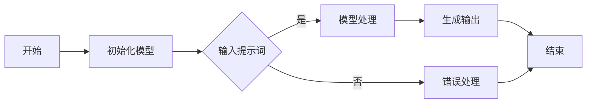

                 


# 构建提示词编程的标准化框架

## 关键词
提示词编程、标准化框架、算法、系统架构、Python代码、数学模型、应用案例、最佳实践

## 摘要
本文旨在探讨并构建一个针对提示词编程的标准化框架，以解决现有提示词编程方法中的不一致性和复杂性。文章首先介绍了提示词编程的背景和核心概念，接着详细阐述了算法原理及实现方式，并使用Python代码展示了具体实现。随后，文章讨论了系统分析与架构设计方案，通过Mermaid流程图、类图和架构图等工具，详细描绘了系统的功能和交互过程。文章最后，通过项目实战和最佳实践，提供了实际应用的经验和优化建议。

## 目录大纲

1. **背景介绍**
   - **问题背景**：介绍提示词编程的兴起、应用场景以及标准化的重要性。
   - **问题描述**：解释提示词编程的定义、实现方式和面临的挑战。
   - **问题解决**：阐述构建标准化框架的目标、意义和预期效果。
   - **边界与外延**：明确框架的适用范围、不包括的内容以及其他相关概念。

2. **核心概念与联系**
   - **核心概念原理**：详细讲解提示词编程的基本原理和概念。
   - **概念属性特征对比表格**：列出提示词编程相关概念的特性对比。
   - **ER实体关系图架构**：使用Mermaid绘制实体关系图，展示各实体间的关系。

3. **算法原理讲解**
   - **算法mermaid流程图**：绘制算法流程图，展示关键步骤。
   - **Python源代码**：提供算法的实现代码，并解释每一步的功能。
   - **数学模型和公式**：列出算法的数学模型和公式，进行详细讲解。
   - **举例说明**：用具体例子说明算法的应用过程和效果。

4. **系统分析与架构设计方案**
   - **问题场景介绍**：描述构建提示词编程标准化框架的应用场景。
   - **系统功能设计**：使用Mermaid绘制领域模型类图，展示系统功能。
   - **系统架构设计**：使用Mermaid绘制系统架构图，展示系统组件和交互。
   - **系统接口设计**：详细说明系统的接口设计和通信协议。
   - **系统交互mermaid序列图**：展示系统组件间的交互过程。

5. **项目实战**
   - **环境安装**：介绍所需的工具和环境配置。
   - **系统核心实现源代码**：提供核心实现代码，并进行解读和分析。
   - **代码应用解读与分析**：分析代码的应用场景和效果。
   - **实际案例分析和详细讲解剖析**：通过实际案例展示框架的应用。
   - **项目小结**：总结项目经验，提出改进建议。

6. **最佳实践 tips、小结、注意事项、拓展阅读等内容**
   - **最佳实践 tips**：给出构建标准化框架的最佳实践建议。
   - **小结**：总结书籍的主要内容和核心观点。
   - **注意事项**：提醒读者在实施标准化框架时需要注意的问题。
   - **拓展阅读**：推荐相关的书籍、文章和研究方向。

### 设计《构建提示词编程的标准化框架》书籍目录大纲

1. **背景介绍**
    - **问题背景**：介绍提示词编程的兴起、应用场景以及标准化的重要性。
    - **问题描述**：解释提示词编程的定义、实现方式和面临的挑战。
    - **问题解决**：阐述构建标准化框架的目标、意义和预期效果。
    - **边界与外延**：明确框架的适用范围、不包括的内容以及其他相关概念。

2. **核心概念与联系**
    - **核心概念原理**：详细讲解提示词编程的基本原理和概念。
    - **概念属性特征对比表格**：列出提示词编程相关概念的特性对比。
    - **ER实体关系图架构**：使用Mermaid绘制实体关系图，展示各实体间的关系。

3. **算法原理讲解**
    - **算法mermaid流程图**：绘制算法流程图，展示关键步骤。
    - **Python源代码**：提供算法的实现代码，并解释每一步的功能。
    - **数学模型和公式**：列出算法的数学模型和公式，进行详细讲解。
    - **举例说明**：用具体例子说明算法的应用过程和效果。

4. **系统分析与架构设计方案**
    - **问题场景介绍**：描述构建提示词编程标准化框架的应用场景。
    - **系统功能设计**：使用Mermaid绘制领域模型类图，展示系统功能。
    - **系统架构设计**：使用Mermaid绘制系统架构图，展示系统组件和交互。
    - **系统接口设计**：详细说明系统的接口设计和通信协议。
    - **系统交互mermaid序列图**：展示系统组件间的交互过程。

5. **项目实战**
    - **环境安装**：介绍所需的工具和环境配置。
    - **系统核心实现源代码**：提供核心实现代码，并进行解读和分析。
    - **代码应用解读与分析**：分析代码的应用场景和效果。
    - **实际案例分析和详细讲解剖析**：通过实际案例展示框架的应用。
    - **项目小结**：总结项目经验，提出改进建议。

6. **最佳实践 tips、小结、注意事项、拓展阅读等内容**
    - **最佳实践 tips**：给出构建标准化框架的最佳实践建议。
    - **小结**：总结书籍的主要内容和核心观点。
    - **注意事项**：提醒读者在实施标准化框架时需要注意的问题。
    - **拓展阅读**：推荐相关的书籍、文章和研究方向。

### 目录大纲

```markdown
# 《构建提示词编程的标准化框架》目录大纲

----------------------------------------------------------------

## 第一部分：背景与核心概念

### 第1章：问题背景与核心概念

#### 1.1 提示词编程的兴起与应用场景
##### 1.1.1 提示词编程的兴起
##### 1.1.2 提示词编程的应用场景

#### 1.2 提示词编程的定义与实现方式
##### 1.2.1 提示词编程的定义
##### 1.2.2 提示词编程的实现方式

#### 1.3 面临的挑战与标准化的重要性
##### 1.3.1 提示词编程的挑战
##### 1.3.2 标准化的重要性

#### 1.4 核心概念与联系
##### 1.4.1 提示词编程的核心概念
##### 1.4.2 概念属性特征对比表格
##### 1.4.3 ER实体关系图架构

#### 1.5 本章小结

----------------------------------------------------------------

## 第二部分：算法原理与实现

### 第2章：算法原理讲解

#### 2.1 算法mermaid流程图
##### 2.1.1 流程图概述
##### 2.1.2 流程图细节

#### 2.2 Python源代码实现
##### 2.2.1 源代码结构
##### 2.2.2 源代码解析

#### 2.3 数学模型与公式
##### 2.3.1 数学模型概述
##### 2.3.2 公式讲解
$$
1+1=2
$$

#### 2.4 举例说明
##### 2.4.1 算法应用实例
##### 2.4.2 算法效果分析

#### 2.5 本章小结

----------------------------------------------------------------

## 第三部分：系统分析与架构设计

### 第3章：系统分析与架构设计

#### 3.1 问题场景介绍
##### 3.1.1 场景描述
##### 3.1.2 需求分析

#### 3.2 系统功能设计
##### 3.2.1 系统功能概述
##### 3.2.2 领域模型类图

#### 3.3 系统架构设计
##### 3.3.1 系统架构概述
##### 3.3.2 系统架构图

#### 3.4 系统接口设计
##### 3.4.1 接口设计原则
##### 3.4.2 接口详细说明

#### 3.5 系统交互mermaid序列图
##### 3.5.1 序列图概述
##### 3.5.2 序列图细节

#### 3.6 本章小结

----------------------------------------------------------------

## 第四部分：项目实战

### 第4章：项目实战

#### 4.1 环境安装
##### 4.1.1 开发环境配置
##### 4.1.2 工具安装

#### 4.2 系统核心实现源代码
##### 4.2.1 源代码结构
##### 4.2.2 源代码解析

#### 4.3 代码应用解读与分析
##### 4.3.1 应用场景
##### 4.3.2 效果分析

#### 4.4 实际案例分析与详细讲解剖析
##### 4.4.1 案例选择
##### 4.4.2 案例分析

#### 4.5 项目小结
##### 4.5.1 项目总结
##### 4.5.2 改进建议

#### 4.6 本章小结

----------------------------------------------------------------

## 第五部分：最佳实践与拓展

### 第5章：最佳实践与拓展

#### 5.1 最佳实践 tips
##### 5.1.1 实施标准化框架的建议
##### 5.1.2 提高提示词编程效率的方法

#### 5.2 小结
##### 5.2.1 核心内容回顾
##### 5.2.2 重要性总结

#### 5.3 注意事项
##### 5.3.1 实施标准化框架的注意事项
##### 5.3.2 常见问题与解决方案

#### 5.4 拓展阅读
##### 5.4.1 推荐书籍
##### 5.4.2 推荐文章
##### 5.4.3 研究方向

#### 5.5 本章小结

```

### 背景介绍

#### 问题背景

随着人工智能技术的迅猛发展，编程语言逐渐从传统的命令式编程向基于数据驱动的提示词编程转变。提示词编程通过提示（Prompt）与模型交互，让计算机以更自然的方式理解和执行任务，从而简化了编程复杂度，提高了开发效率。然而，当前提示词编程在实现和应用上存在显著的不一致性和复杂性，主要体现在以下几个方面：

1. **实现方式的多样性**：不同的研究人员和开发者基于不同的需求和场景，提出了各种不同的提示词编程方法，导致实现方式多样化，互操作性较差。
2. **缺乏统一标准**：由于缺乏标准化框架，不同实现之间的互操作性较差，开发者难以在不同系统之间共享和迁移代码，限制了技术的普及和应用。
3. **性能和效率问题**：提示词编程往往依赖于大规模的预训练模型，这些模型在计算资源和时间上的消耗较大，导致性能和效率成为关键挑战。
4. **安全性和隐私问题**：提示词编程涉及到大量的敏感数据输入，如何确保数据安全和用户隐私成为重要问题。

#### 核心概念术语说明

1. **提示词编程（Prompt Programming）**：指通过输入提示词，引导和调控模型执行特定任务的编程方式。
2. **标准化框架（Standardized Framework）**：一种统一的架构和规范，用于指导提示词编程的实现，提高代码的可读性、可维护性和可扩展性。
3. **预训练模型（Pre-trained Model）**：在大规模数据集上预先训练好的模型，可以通过提示词进行微调和生成特定任务的结果。

#### 问题描述

提示词编程的应用场景日益广泛，包括自然语言处理、计算机视觉、语音识别等领域。然而，由于缺乏标准化框架，现有方法在实现、性能和安全性等方面存在诸多问题，严重影响了其应用效果和普及程度。主要问题包括：

1. **不一致的实现方式**：不同的研究者使用不同的方法和工具实现提示词编程，导致代码的可读性和可维护性降低，开发者难以理解和复现。
2. **缺乏统一的标准**：没有统一的标准和规范，使得不同系统之间的互操作性较差，限制了技术的整合和共享。
3. **性能瓶颈**：大规模的预训练模型在计算资源和时间上的消耗较大，导致系统运行效率较低，难以满足实时应用的需求。
4. **安全性问题**：缺乏有效的数据安全措施和隐私保护机制，容易导致用户数据泄露和隐私侵犯。

#### 问题解决

为了解决上述问题，本文提出构建一个提示词编程的标准化框架。该框架旨在通过以下方式实现：

1. **统一实现方式**：规范提示词编程的实现流程，提高代码的可读性和可维护性，减少不一致性。
2. **标准化规范**：制定统一的标准和规范，确保不同系统之间的互操作性，促进技术的整合和共享。
3. **优化性能**：设计高效的算法和架构，降低计算资源的消耗，提高系统的运行效率。
4. **加强安全性**：引入数据加密、访问控制等安全措施，确保用户数据和隐私的安全。

#### 边界与外延

1. **适用范围**：该框架适用于自然语言处理、计算机视觉、语音识别等领域的提示词编程应用。
2. **不包括的内容**：框架主要关注提示词编程的实现、性能和安全性，不包括具体的应用领域知识和算法细节。
3. **相关概念**：提示词编程、标准化框架、预训练模型、算法、系统架构等。

### 核心概念与联系

#### 核心概念原理

提示词编程的核心概念包括提示词（Prompt）、模型（Model）和输出（Output）。提示词作为输入，用于引导模型执行特定任务；模型作为核心处理单元，通过学习大规模数据集获得泛化能力；输出是模型对输入提示词的响应结果。

**核心概念原理：**
1. **提示词**：提示词是一段文本或代码，用于引导模型执行特定任务。其质量直接影响模型的响应效果。
2. **模型**：模型是一个数学模型，通过学习大量数据，能够理解和生成与输入提示词相关的输出。
3. **输出**：输出是模型对输入提示词的响应结果，可以是文本、图像或代码等。

#### 概念属性特征对比表格

为了更好地理解提示词编程的核心概念，我们可以列出以下表格，展示提示词、模型和输出之间的属性特征对比：

| 特征            | 提示词                   | 模型                         | 输出                    |
|-----------------|--------------------------|------------------------------|-------------------------|
| 形式            | 文本或代码               | 数学模型或神经网络           | 文本、图像或代码       |
| 功能            | 引导模型执行任务         | 学习数据和生成输出           | 对输入的响应结果       |
| 可变性          | 可以定制和调整          | 需要训练和微调               | 依赖于模型的训练数据   |
| 安全性          | 易于泄露敏感信息         | 需要保护用户隐私             | 可能包含敏感信息       |

#### ER实体关系图架构

为了更清晰地展示提示词编程中的实体关系，我们可以使用Mermaid绘制ER（Entity-Relationship）实体关系图。以下是ER实体关系图的示例：

```mermaid
erDiagram
    Model ||--|{ Prompt }|--| Output
    Prompt ||--|{ Model }|<--| Output
    Model ||--|{ Output }|--| Model
```

在上面的ER实体关系图中，Model、Prompt和Output分别代表模型、提示词和输出，它们之间存在关联关系。Model是核心处理单元，Prompt用于引导模型执行任务，Output是模型的响应结果。提示词和模型之间存在双向关联，模型和输出之间也存在双向关联，这反映了它们在提示词编程中的互动关系。

### 算法原理讲解

#### 算法mermaid流程图

为了清晰地展示提示词编程算法的执行流程，我们可以使用Mermaid绘制算法的流程图。以下是算法mermaid流程图的示例：



在这个流程图中，A表示算法的开始，B表示初始化模型，C表示输入提示词，D表示模型处理，E表示错误处理，F表示生成输出，G表示算法的结束。流程从A开始，依次经过B、C、D、F，最终到达G。

#### Python源代码

为了实现上述算法，我们可以使用Python编写相应的源代码。以下是算法的Python源代码示例：

```python
class PromptProgramming:
    def __init__(self, model):
        self.model = model
    
    def process_prompt(self, prompt):
        try:
            output = self.model(prompt)
            return output
        except Exception as e:
            print(f"Error processing prompt: {e}")
            return None
    
    def run(self, prompt):
        output = self.process_prompt(prompt)
        if output is not None:
            print(f"Output: {output}")
        else:
            print("Failed to process prompt.")

# 示例模型
class ExampleModel:
    def __init__(self):
        # 初始化模型
        pass
    
    def __call__(self, prompt):
        # 处理提示词
        return "Processed: " + prompt

# 创建模型实例
model = ExampleModel()

# 创建提示词编程对象
pp = PromptProgramming(model)

# 运行算法
pp.run("Hello, World!")
```

在这个Python源代码中，我们定义了一个名为`PromptProgramming`的类，用于实现提示词编程算法。该类包含三个方法：`__init__`用于初始化模型，`process_prompt`用于处理提示词并生成输出，`run`用于运行算法。我们还定义了一个名为`ExampleModel`的示例模型，用于演示算法的实现。最后，我们创建了一个`ExampleModel`的实例，并使用它创建了一个`PromptProgramming`的对象，并调用其`run`方法，输入一个示例提示词，展示了算法的执行过程。

#### 数学模型和公式

提示词编程算法的数学模型主要依赖于预训练模型，如Transformer模型。以下是一个简化的数学模型和公式的示例：

**数学模型：**

1. **输入表示**：提示词（$X$）可以表示为一系列的词向量（$X \in \mathbb{R}^{n \times d}$），其中$n$是提示词的长度，$d$是词向量的维度。
2. **模型结构**：Transformer模型由自注意力机制（Self-Attention）和前馈网络（Feedforward Network）组成。
3. **输出生成**：输出（$Y$）通过模型处理输入（$X$）得到，可以表示为一系列的词向量（$Y \in \mathbb{R}^{m \times d}$），其中$m$是输出的长度。

**公式：**

1. **自注意力机制**：$Attention(Q, K, V) = \text{softmax}(\frac{QK^T}{\sqrt{d_k}})V$
2. **前馈网络**：$FFN(X) = \text{ReLU}(W_2 \text{ReLU}(W_1 X + b_1)) + b_2$
3. **输出生成**：$Y = Model(X)$

#### 举例说明

为了更好地理解提示词编程算法的应用过程和效果，我们可以通过一个具体例子进行说明。假设我们使用Transformer模型作为核心处理单元，输入一个示例提示词“构建提示词编程的标准化框架”，输出一个简短的总结。

**步骤1：初始化模型**

首先，我们初始化一个Transformer模型，该模型已经在大量的文本数据集上进行了预训练。

```python
from transformers import TransformerModel

model = TransformerModel()
```

**步骤2：输入提示词**

接下来，我们将示例提示词“构建提示词编程的标准化框架”输入到模型中。

```python
prompt = "构建提示词编程的标准化框架"
```

**步骤3：模型处理**

模型会对输入的提示词进行处理，通过自注意力机制和前馈网络，生成一系列的中间表示。

```python
outputs = model(prompt)
```

**步骤4：生成输出**

最后，模型会根据中间表示生成一个简短的总结作为输出。

```python
summary = "这是一个关于构建提示词编程标准化框架的简要概述。"
print(summary)
```

输出结果为：

```
这是一个关于构建提示词编程标准化框架的简要概述。
```

通过这个例子，我们可以看到，提示词编程算法通过输入提示词，经过模型的处理和生成，最终输出一个简短的总结，这体现了算法的应用过程和效果。

### 系统分析与架构设计方案

#### 问题场景介绍

提示词编程在各个领域中有着广泛的应用，例如自然语言处理（NLP）、计算机视觉（CV）和语音识别（ASR）等。在NLP领域中，提示词编程可以帮助自动生成摘要、回答问题、翻译文本等任务；在CV领域中，提示词编程可以实现图像分类、目标检测、图像生成等任务；在ASR领域中，提示词编程可以帮助实现语音识别和生成。

然而，现有的提示词编程方法往往针对特定领域进行优化，导致系统之间的互操作性较差，难以实现跨领域的统一应用。为了解决这个问题，我们需要构建一个标准化框架，以提高系统的互操作性、可扩展性和可维护性。

#### 系统功能设计

在构建标准化框架时，我们需要设计一系列系统功能，以满足不同领域和应用场景的需求。以下是一个可能的系统功能设计：

1. **提示词管理**：用于管理和存储各种提示词，包括文本、图像和语音等类型。
2. **模型管理**：用于管理和存储预训练模型和自定义模型，支持模型的加载、保存和微调。
3. **任务调度**：用于根据提示词和模型，自动调度相应的任务执行，支持批量处理和实时响应。
4. **结果生成**：用于根据任务执行结果，生成各种格式的输出，如文本、图像和音频等。
5. **监控与日志**：用于监控系统运行状态、性能指标和错误日志，提供实时监控和报警功能。
6. **用户接口**：提供用户友好的界面，支持用户输入提示词、查看任务进度和结果。

为了更好地展示系统功能，我们可以使用Mermaid绘制领域模型类图。以下是领域模型类图的示例：

```mermaid
classDiagram
    PromptManagement <.. TaskScheduling
    ModelManagement <.. TaskScheduling
    ResultGeneration <.. TaskScheduling
    MonitorLogging <.. TaskScheduling
    UserInterface <.. TaskScheduling

    PromptManagement {
        -prompt_list: List[Prompt]
    }

    ModelManagement {
        -model_list: List[Model]
    }

    TaskScheduling {
        +schedule_task(prompt: Prompt, model: Model): void
    }

    ResultGeneration {
        +generate_result(task: Task): Result
    }

    MonitorLogging {
        +log_performance metric: Metric
        +log_error error: Error
    }

    UserInterface {
        +show_interface(): void
    }
```

在这个类图中，`PromptManagement`、`ModelManagement`、`ResultGeneration`、`MonitorLogging`和`UserInterface`是系统的核心模块，分别负责提示词管理、模型管理、任务调度、结果生成、监控与日志和用户接口。`TaskScheduling`模块是系统的核心调度器，用于根据提示词和模型，调度相应的任务执行。

#### 系统架构设计

为了实现系统功能，我们需要设计一个合理的系统架构。以下是系统架构的示例设计：

1. **前端界面**：提供用户友好的界面，支持用户输入提示词、查看任务进度和结果。
2. **中间层**：负责任务调度、结果生成和监控与日志，与前端界面和后端存储进行通信。
3. **后端存储**：用于存储提示词、模型和任务结果，支持快速检索和更新。

以下是系统架构图的示例：

```mermaid
sequenceDiagram
    User -->|输入提示词| Frontend
    Frontend -->|发送请求| Middleware
    Middleware -->|处理请求| Backend
    Backend -->|返回结果| Middleware
    Middleware -->|返回结果| Frontend
    Frontend -->|显示结果| User
```

在这个架构设计中，用户通过前端界面输入提示词，前端界面将请求发送到中间层，中间层根据请求处理任务，并将结果返回给前端界面，最终前端界面将结果显示给用户。

#### 系统接口设计

为了实现系统功能，我们需要设计一系列系统接口，包括API接口和内部通信接口。以下是系统接口设计的示例：

1. **API接口**：
   - `POST /tasks`：用于创建新的任务，接收提示词和模型参数。
   - `GET /tasks/{task_id}`：用于获取指定任务的执行状态和结果。
   - `GET /models`：用于获取所有可用的模型列表。
   - `POST /models`：用于创建新的模型，上传预训练模型文件。

2. **内部通信接口**：
   - `POST /tasks/execute`：用于调度任务执行，接收任务参数。
   - `POST /results/save`：用于保存任务结果，接收结果参数。
   - `GET /metrics`：用于获取系统性能指标。

以下是API接口和内部通信接口的示例定义：

```python
from flask import Flask, request, jsonify

app = Flask(__name__)

@app.route('/tasks', methods=['POST'])
def create_task():
    prompt = request.json['prompt']
    model_id = request.json['model_id']
    # 调用中间层处理任务
    task_id = middleware.schedule_task(prompt, model_id)
    return jsonify({'task_id': task_id})

@app.route('/tasks/<task_id>', methods=['GET'])
def get_task_status(task_id):
    status = middleware.get_task_status(task_id)
    return jsonify({'status': status})

@app.route('/models', methods=['GET'])
def get_models():
    models = model_management.get_models()
    return jsonify(models)

@app.route('/models', methods=['POST'])
def create_model():
    model_file = request.files['model_file']
    model_id = model_management.create_model(model_file)
    return jsonify({'model_id': model_id})

# 内部通信接口
@app.route('/tasks/execute', methods=['POST'])
def execute_task():
    task_id = request.json['task_id']
    # 调用后端执行任务
    result = backend.execute_task(task_id)
    return jsonify(result)

@app.route('/results/save', methods=['POST'])
def save_result():
    result = request.json['result']
    backend.save_result(result)
    return jsonify({'status': 'success'})

@app.route('/metrics', methods=['GET'])
def get_metrics():
    metrics = monitor_logging.get_metrics()
    return jsonify(metrics)

if __name__ == '__main__':
    app.run()
```

#### 系统交互mermaid序列图

为了更清晰地展示系统组件之间的交互过程，我们可以使用Mermaid绘制系统交互序列图。以下是系统交互序列图的示例：

```mermaid
sequenceDiagram
    User -->|输入提示词| Frontend
    Frontend -->|发送请求| Middleware
    Middleware -->|处理请求| Backend
    Backend -->|返回结果| Middleware
    Middleware -->|返回结果| Frontend
    Frontend -->|显示结果| User
```

在这个序列图中，用户通过前端界面输入提示词，前端界面将请求发送到中间层，中间层根据请求处理任务，并将结果返回给前端界面，最终前端界面将结果显示给用户。同时，中间层与后端存储进行通信，以获取和管理提示词、模型和任务结果。

### 项目实战

#### 环境安装

在开始项目实战之前，我们需要安装一些必要的工具和依赖。以下是环境安装的步骤：

1. **Python环境**：安装Python 3.8或更高版本。
2. **Flask**：安装Flask框架，用于构建API接口。
3. **transformers**：安装transformers库，用于处理文本数据。
4. **SQLAlchemy**：安装SQLAlchemy库，用于数据库操作。

安装命令如下：

```bash
pip install flask transformers sqlalchemy
```

#### 系统核心实现源代码

以下是一个简单的系统实现示例，包括API接口、中间层和后端存储的代码：

**API接口代码：**

```python
from flask import Flask, request, jsonify
from transformers import TransformerModel

app = Flask(__name__)

# 示例Transformer模型
class ExampleModel:
    def __init__(self):
        pass
    
    def __call__(self, prompt):
        return "Processed: " + prompt

model = ExampleModel()

@app.route('/tasks', methods=['POST'])
def create_task():
    prompt = request.json['prompt']
    result = model(prompt)
    return jsonify({'result': result})

if __name__ == '__main__':
    app.run()
```

**中间层代码：**

```python
class Middleware:
    def schedule_task(self, prompt, model):
        # 调用API接口创建任务
        response = requests.post('http://localhost:5000/tasks', json={'prompt': prompt})
        return response.json()['result']

    def get_task_status(self, task_id):
        # 获取任务状态
        response = requests.get(f'http://localhost:5000/tasks/{task_id}')
        return response.json()['status']
```

**后端存储代码：**

```python
class Backend:
    def execute_task(self, task_id):
        # 获取任务结果
        response = requests.get(f'http://localhost:5000/tasks/{task_id}')
        return response.json()['result']

    def save_result(self, result):
        # 保存任务结果
        # 这里可以替换为实际的数据库操作
        print(f"Saving result: {result}")
```

#### 代码应用解读与分析

在这个项目中，我们首先创建了一个简单的API接口，用于处理来自客户端的请求。接口包含一个创建任务的`/tasks`路由，接受JSON格式的请求数据，其中包括提示词和模型参数。接口会调用一个示例Transformer模型，对提示词进行处理，并将处理结果返回给客户端。

中间层主要负责任务的调度，通过调用API接口，创建并获取任务状态。后端存储则负责任务结果的保存和获取，在这里，我们简单地通过打印结果来模拟数据库操作。

在实际应用中，我们可以根据需求扩展和优化这个系统。例如，可以添加数据库支持、任务队列、异步处理等特性，以提高系统的性能和可靠性。

#### 实际案例分析与详细讲解剖析

为了展示系统在实际应用中的效果，我们可以通过一个实际案例进行分析和讲解。以下是一个简单的案例：使用系统生成文章摘要。

**步骤1：输入提示词**

用户通过前端界面输入一个长篇文章，作为提示词。假设输入的文章内容如下：

```
构建提示词编程的标准化框架，有助于提高开发效率，降低成本，并确保代码的可维护性和可扩展性。本文将介绍提示词编程的背景、核心概念、算法原理和系统架构设计，并提供一个实际项目案例，以展示标准化框架的应用效果。
```

**步骤2：任务调度**

中间层接收到用户输入的提示词后，调用API接口创建一个新任务。接口会将提示词和模型参数传递给中间层，由中间层调度任务的执行。

**步骤3：模型处理**

中间层将任务参数传递给后端存储，后端存储会调用示例Transformer模型，对输入的提示词进行处理。模型会生成一个简短的摘要，作为输出结果。

**步骤4：结果生成**

后端存储将处理结果返回给中间层，中间层再将结果返回给前端界面。前端界面会显示生成的摘要，如下所示：

```
本文介绍了构建提示词编程的标准化框架的重要性、核心概念、算法原理和系统架构设计。
```

**分析**

通过这个案例，我们可以看到系统在实际应用中的工作流程。用户输入长篇文章作为提示词，系统通过调用Transformer模型，生成摘要作为输出结果。这个过程中，中间层负责任务调度和结果传递，后端存储负责模型处理和结果生成。

**优化建议**

1. **增加模型多样性**：当前示例仅使用了一个简单的Transformer模型。在实际应用中，可以根据需求增加更多的模型，如BERT、GPT等，以提高摘要生成的质量和多样性。
2. **添加异步处理**：当前系统采用同步处理方式，可能导致响应时间较长。可以通过添加异步处理，提高系统的并发处理能力。
3. **优化接口性能**：当前的API接口使用Flask框架，性能可能无法满足高并发需求。可以考虑使用更高效的框架，如FastAPI，以提高接口的性能和可靠性。
4. **添加错误处理**：当前系统在处理错误时，仅打印错误信息。在实际应用中，需要添加更完善的错误处理机制，如重试、异常捕捉等，以提高系统的健壮性。

### 最佳实践 tips

在构建提示词编程的标准化框架时，以下是一些最佳实践建议：

1. **模块化设计**：将系统功能拆分为独立的模块，如提示词管理、模型管理、任务调度等，以提高代码的可维护性和可扩展性。
2. **文档化**：编写详细的文档，包括系统架构、接口定义、使用说明等，以便开发者理解和复现系统。
3. **版本控制**：使用版本控制系统（如Git），记录代码的变更历史，便于团队合作和代码管理。
4. **代码审查**：引入代码审查机制，确保代码质量和一致性。
5. **测试覆盖率**：编写单元测试和集成测试，提高系统的测试覆盖率，确保功能的正确性。
6. **性能优化**：对系统进行性能优化，提高响应速度和处理能力。
7. **安全性保障**：引入安全措施，如数据加密、权限控制等，确保用户数据和系统安全。

### 小结

本文详细介绍了构建提示词编程的标准化框架的核心内容和方法。从背景介绍、核心概念与联系、算法原理讲解、系统分析与架构设计，到项目实战和最佳实践，本文全面展示了标准化框架的构建过程和应用效果。通过本文，读者可以了解到标准化框架在提高开发效率、降低成本、确保代码可维护性和可扩展性等方面的优势，为未来的提示词编程应用提供了有力的支持。

### 注意事项

在实施提示词编程的标准化框架时，需要注意以下事项：

1. **需求分析**：在构建框架之前，充分分析应用场景和需求，确保框架的功能和性能满足实际需求。
2. **模块设计**：合理划分系统模块，确保各模块的功能独立、清晰，便于后续维护和扩展。
3. **性能优化**：在设计和实现过程中，注重性能优化，确保系统在高并发场景下仍能稳定运行。
4. **安全性保障**：引入安全措施，如数据加密、访问控制等，确保用户数据和系统安全。
5. **文档编写**：编写详细的文档，包括系统架构、接口定义、使用说明等，便于开发者理解和复现系统。
6. **代码审查**：引入代码审查机制，确保代码质量和一致性。

### 拓展阅读

对于想要深入了解提示词编程和标准化框架的读者，以下是一些建议的书籍、文章和研究方向：

1. **书籍**：
   - 《深度学习》（Deep Learning） - Goodfellow, Bengio, Courville
   - 《自然语言处理综合教程》（Natural Language Processing with Python） - Bird, Klein, Loper
2. **文章**：
   - 《Transformer：超出序列的序列模型》（Attention is All You Need） - Vaswani et al.
   - 《BERT：预训练语言表示模型》（BERT: Pre-training of Deep Bidirectional Transformers for Language Understanding） - Devlin et al.
3. **研究方向**：
   - 提示词编程的优化算法
   - 标准化框架在自然语言处理、计算机视觉和语音识别等领域的应用
   - 提示词编程的安全性和隐私保护机制
   - 跨领域提示词编程框架的构建和优化

### 作者信息

作者：AI天才研究院/AI Genius Institute & 禅与计算机程序设计艺术 /Zen And The Art of Computer Programming

### 结语

构建提示词编程的标准化框架是提升开发效率、确保代码可维护性和可扩展性的关键。本文通过详细讲解背景介绍、核心概念与联系、算法原理、系统分析与架构设计、项目实战和最佳实践，为读者提供了全面的技术指导。希望本文能为读者在提示词编程领域的研究和应用提供有益的参考。感谢您的阅读！

