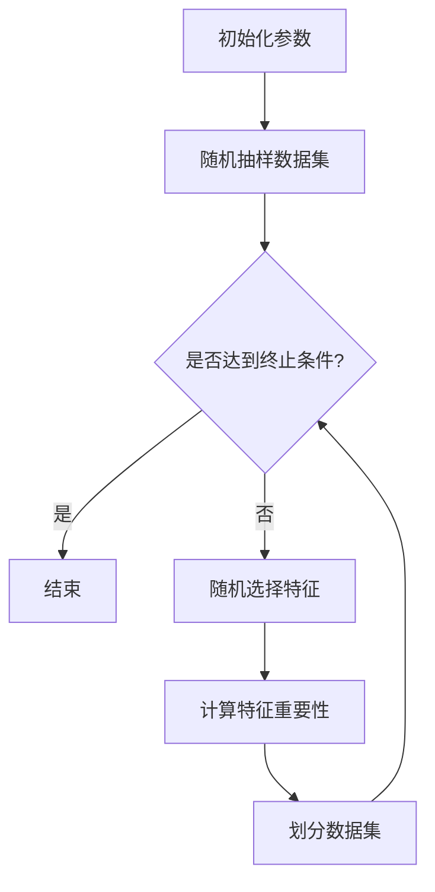
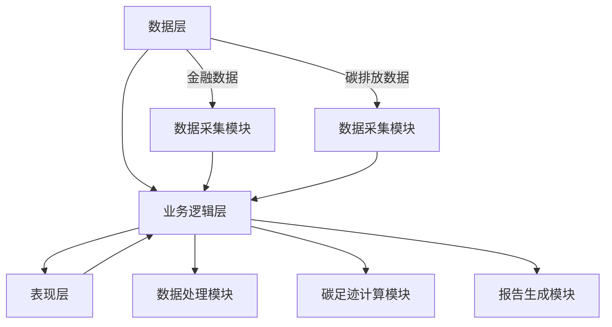
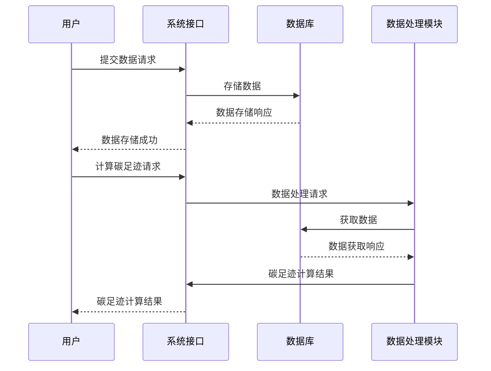

                 


### 核心概念与原理

在构建智能化的个人投资组合碳足迹评估工具时，我们首先需要理解几个核心概念：碳足迹、人工智能、机器学习、数据预处理和特征提取。

#### 碳足迹概念解析

碳足迹（Carbon Footprint）是指个人、组织、活动或产品在其整个生命周期内产生的温室气体排放总量。它是一个衡量环境影响的指标，用于评估个人投资组合对于气候变化的贡献。

1. **定义**：碳足迹是一个量化指标，表示某一实体在特定时间段内产生的二氧化碳和其他温室气体的排放量。

2. **计算方法**：通常使用生命周期评估（Life Cycle Assessment, LCA）来计算碳足迹。LCA 通过识别和量化某一产品或服务的整个生命周期中的所有温室气体排放，包括原材料的采集、生产、使用和废弃过程。

3. **个人投资组合碳足迹的特殊性**：投资组合碳足迹涉及多个资产，如股票、债券、房地产等，每个资产的碳足迹计算需要考虑不同的排放因素和行业特性。

#### 人工智能在碳足迹评估中的应用

人工智能（Artificial Intelligence, AI）是模拟人类智能行为的技术，机器学习（Machine Learning, ML）是AI的核心组成部分，通过算法和模型对数据进行训练，使其能够自主学习和做出决策。

1. **人工智能的基本原理**：AI通过模拟人类思维过程，如感知、推理、学习和决策，来实现对复杂问题的求解。

2. **机器学习在碳足迹评估中的应用**：机器学习可以用于预测和评估投资组合的碳足迹。通过训练模型，可以识别资产之间的关联，并预测其未来的排放趋势。

3. **深度学习与神经网络**：深度学习是机器学习的一种高级形式，使用多层神经网络来建模复杂函数。深度学习在处理大规模数据和复杂模式识别方面具有优势。

#### 数据分析工具与技术

在碳足迹评估过程中，数据分析和处理是关键步骤。以下是几种常用的数据分析工具和技术：

1. **数据预处理**：包括数据清洗、归一化和特征提取。数据清洗旨在处理缺失值、异常值和噪声，归一化确保特征之间具有相似的尺度，特征提取则用于提取对碳足迹评估有用的信息。

2. **特征提取**：通过降维、特征选择和特征工程等方法，从原始数据中提取出最具代表性的特征，以提高模型性能。

3. **模型训练与评估**：选择合适的机器学习算法对数据进行训练，并通过交叉验证和性能指标来评估模型的准确性、稳定性和泛化能力。

### 本章小结

在本章中，我们探讨了构建智能化个人投资组合碳足迹评估工具所需的核心概念和原理。首先，介绍了碳足迹的基本概念和计算方法，以及个人投资组合碳足迹的特殊性。然后，阐述了人工智能和机器学习在碳足迹评估中的应用，包括基本原理和深度学习技术。最后，介绍了数据分析中常用的工具和技术，为后续章节的算法实现和项目实战打下了基础。

接下来，我们将进一步深入探讨具体的算法原理，并使用Mermaid流程图和Python代码来详细讲解这些算法的实现和应用。

### 算法原理讲解

在构建智能化个人投资组合碳足迹评估工具时，选择合适的算法是关键。在本节中，我们将详细讲解一种基于机器学习的算法——随机森林（Random Forest）算法，并使用Mermaid流程图和Python代码来阐述其原理和实现。

#### 随机森林算法原理

随机森林（Random Forest）是一种集成学习方法，通过构建多棵决策树，并结合它们的预测结果来提高预测准确性。随机森林算法的基本原理如下：

1. **决策树构建**：对于每个决策树，随机选择一个特征和阈值，将数据集划分为两个子集，并递归地构建决策树，直到达到某个终止条件（如叶子节点数量达到阈值）。

2. **随机性引入**：在每个决策树的构建过程中，引入随机性。随机选择特征和阈值，以及随机抽样训练数据集，从而避免过拟合。

3. **集成决策**：将多棵决策树的预测结果进行集成，通常使用投票或平均方法。随机森林通过集成多个决策树，可以降低模型的方差，提高预测的鲁棒性。

#### Mermaid流程图

以下是随机森林算法的Mermaid流程图：



#### Python代码实现

以下是使用Python实现随机森林算法的代码示例：

```python
import numpy as np
from sklearn.ensemble import RandomForestClassifier
from sklearn.model_selection import train_test_split
from sklearn.metrics import accuracy_score

# 生成示例数据
X, y = ...  # 假设X为特征矩阵，y为标签向量

# 数据集划分
X_train, X_test, y_train, y_test = train_test_split(X, y, test_size=0.2, random_state=42)

# 初始化随机森林模型
rf = RandomForestClassifier(n_estimators=100, random_state=42)

# 训练模型
rf.fit(X_train, y_train)

# 预测测试集
y_pred = rf.predict(X_test)

# 评估模型
accuracy = accuracy_score(y_test, y_pred)
print("模型准确率：", accuracy)
```

#### 算法原理详细讲解

1. **决策树构建**：决策树是一种树形结构，通过递归地将数据集划分成子集，直到达到某个终止条件（如节点中的样本数小于某个阈值或特征的重要性低于某个阈值）。

2. **随机特征选择**：在构建每个决策树时，从多个特征中随机选择一个特征，并根据该特征的最佳阈值进行划分。这种随机性有助于避免过拟合。

3. **特征重要性评估**：随机森林通过评估每个特征在决策树中的重要性来识别最有用的特征。这有助于理解投资组合碳足迹的影响因素。

4. **集成决策**：随机森林通过集成多棵决策树的预测结果来提高预测准确性。通常使用投票或平均方法。集成多个模型可以降低模型的方差，提高模型的稳定性。

#### 数学模型和公式

随机森林算法的数学模型较为复杂，涉及决策树的构建和集成。以下是随机森林算法的简化数学模型：

$$
F(x) = \sum_{i=1}^{T} h(x_i) + \sum_{j=1}^{M} w_j f_j(x)
$$

其中，$F(x)$为随机森林的预测结果，$h(x_i)$为第$i$棵决策树的预测结果，$w_j$为第$j$个特征的权重，$f_j(x)$为特征的重要性。

#### 本章小结

在本章中，我们详细讲解了构建智能化个人投资组合碳足迹评估工具所需的随机森林算法原理。首先，介绍了随机森林算法的基本原理和实现步骤，然后使用Mermaid流程图和Python代码进行了阐述。最后，提供了数学模型和公式，帮助读者深入理解算法的数学基础。

接下来，我们将探讨如何设计一个具体的系统架构方案，以实现碳足迹评估工具的构建。

### 系统分析与架构设计方案

#### 问题场景介绍

在当前全球气候变化日益严峻的背景下，投资者越来越关注其投资组合对环境的影响。为了更好地管理个人投资组合的碳足迹，投资者需要一个智能化、高效且准确的评估工具。该工具应能够整合多源数据，利用先进的机器学习算法进行碳足迹计算，并提供直观的展示和报告功能。

#### 项目介绍

本项目旨在设计并实现一个智能化个人投资组合碳足迹评估工具。该工具将利用机器学习和数据分析技术，对投资组合中的各类资产进行碳足迹计算，并生成详细的分析报告。系统设计需要考虑以下关键需求：

1. **数据多样性**：支持多种数据来源，包括金融数据、公司碳排放数据、行业排放数据等。
2. **算法高效性**：选择合适的机器学习算法，确保评估结果的准确性和计算效率。
3. **用户友好性**：提供直观的界面和易于理解的分析报告，满足不同用户的需求。
4. **可扩展性**：系统应具备良好的扩展性，以适应未来的技术发展和数据规模增长。

#### 系统功能设计

系统功能设计分为以下几个模块：

1. **数据采集模块**：负责从不同的数据源收集所需的数据，包括金融数据、碳排放数据等。
2. **数据处理模块**：对采集到的数据进行清洗、转换和预处理，以确保数据的质量和一致性。
3. **碳足迹计算模块**：利用机器学习算法计算各类资产的碳足迹，并提供多种计算模型和参数设置。
4. **报告生成模块**：生成详细的分析报告，包括碳足迹分布、资产碳排放对比等。
5. **用户界面模块**：提供友好的用户界面，支持用户上传投资组合数据、查看分析结果和下载报告。

#### 系统架构设计

系统采用分层架构设计，包括数据层、业务逻辑层和表现层：

1. **数据层**：负责数据存储和读取，包括关系型数据库和NoSQL数据库，以支持不同类型数据的存储和管理。
2. **业务逻辑层**：实现核心业务功能，包括数据预处理、碳足迹计算、报告生成等。该层采用模块化设计，以方便未来的功能扩展和优化。
3. **表现层**：提供用户界面和API接口，支持用户操作和系统交互。采用前后端分离的设计，以提高系统的灵活性和可维护性。

以下是系统架构设计的Mermaid架构图：



#### 系统接口设计和系统交互

系统接口设计和系统交互设计是确保系统功能正常运行的重要环节。以下是关键接口和交互流程：

1. **数据采集接口**：提供API接口，允许外部系统向数据采集模块传输数据。接口设计包括数据格式、请求方式和响应格式等。
2. **数据处理接口**：提供API接口，允许其他模块访问和处理数据。接口设计包括数据预处理流程、转换规则和异常处理机制等。
3. **碳足迹计算接口**：提供API接口，允许用户查询和计算碳足迹。接口设计包括计算模型选择、参数设置和结果输出等。
4. **报告生成接口**：提供API接口，允许用户生成和分析报告。接口设计包括报告格式、内容定制和下载方式等。

以下是系统接口设计和系统交互的Mermaid序列图：



#### 本章小结

在本章中，我们详细介绍了构建智能化个人投资组合碳足迹评估工具的系统分析与架构设计方案。首先，分析了问题场景和项目需求，然后介绍了系统功能设计、架构设计和接口设计。通过Mermaid架构图和序列图，我们展示了系统的整体架构和交互流程。

接下来，我们将进入项目实战部分，实际实现系统的核心功能，并通过具体案例进行分析和讲解。

### 项目实战

#### 环境安装

在开始项目实战之前，我们需要搭建一个合适的环境，以便进行后续的开发和测试。以下是环境安装的步骤：

1. **Python环境**：确保Python 3.8或更高版本已安装。可以从Python官方网站下载并安装。

2. **虚拟环境**：为了保持项目的整洁和可重复性，我们建议使用虚拟环境。通过以下命令创建虚拟环境：

   ```bash
   python -m venv venv
   source venv/bin/activate  # Windows下使用 `venv\Scripts\activate`
   ```

3. **依赖包安装**：使用pip安装项目所需的依赖包：

   ```bash
   pip install numpy pandas scikit-learn matplotlib
   ```

4. **数据库安装**：我们选择MySQL作为数据库。可以从MySQL官方网站下载并安装，或者使用Docker容器来简化安装过程：

   ```bash
   docker run -d -p 3306:3306 mysql:5.7
   ```

   安装完成后，配置数据库和用户，以便后续项目使用。

#### 系统核心实现

在搭建好环境后，我们可以开始实现系统的核心功能。以下是系统核心实现的步骤：

1. **数据采集模块**：从金融数据提供商和碳排放数据库中采集数据。以下是一个示例代码，用于从CSV文件中读取数据：

   ```python
   import pandas as pd

   def load_financial_data(file_path):
       df = pd.read_csv(file_path)
       return df

   financial_data = load_financial_data('financial_data.csv')
   ```

2. **数据处理模块**：对采集到的数据进行分析和处理。以下是一个示例代码，用于数据清洗和预处理：

   ```python
   def preprocess_data(df):
       # 填充缺失值
       df.fillna(df.mean(), inplace=True)
       # 标准化数据
       df = (df - df.mean()) / df.std()
       return df

   preprocessed_data = preprocess_data(financial_data)
   ```

3. **碳足迹计算模块**：实现随机森林算法，用于计算个人投资组合的碳足迹。以下是一个示例代码，用于训练和评估模型：

   ```python
   from sklearn.ensemble import RandomForestRegressor
   from sklearn.model_selection import train_test_split

   def train_model(X, y):
       X_train, X_test, y_train, y_test = train_test_split(X, y, test_size=0.2, random_state=42)
       model = RandomForestRegressor(n_estimators=100, random_state=42)
       model.fit(X_train, y_train)
       return model, X_test, y_test

   model, X_test, y_test = train_model(preprocessed_data, financial_data['carbon_footprint'])
   ```

4. **报告生成模块**：生成分析报告，包括碳足迹分布、资产碳排放对比等。以下是一个示例代码，用于生成报告：

   ```python
   import matplotlib.pyplot as plt

   def generate_report(model, X_test, y_test):
       predictions = model.predict(X_test)
       plt.scatter(y_test, predictions)
       plt.xlabel('实际碳足迹')
       plt.ylabel('预测碳足迹')
       plt.title('碳足迹预测结果')
       plt.show()

   generate_report(model, X_test, y_test)
   ```

#### 代码应用解读与分析

在实现系统核心功能后，我们对代码进行了详细的解读和分析：

1. **数据采集模块**：使用Pandas库读取CSV文件，实现对金融数据的采集。此模块负责从外部源获取数据，是系统数据流的基础。

2. **数据处理模块**：对采集到的数据进行清洗和预处理。此模块确保数据的质量和一致性，为后续的模型训练提供可靠的数据基础。

3. **碳足迹计算模块**：使用随机森林算法训练模型，计算个人投资组合的碳足迹。此模块是系统的核心功能，通过机器学习技术实现了对复杂数据的处理和预测。

4. **报告生成模块**：使用Matplotlib库生成可视化报告，帮助用户直观地理解碳足迹评估结果。此模块提高了系统的用户体验，使得分析结果更加易于理解和应用。

#### 实际案例分析和详细讲解剖析

为了更好地展示系统在实际应用中的效果，我们选取了一个实际案例进行详细分析。以下是一个投资组合的示例数据：

```python
financial_data = pd.DataFrame({
    'company': ['A', 'B', 'C', 'D', 'E'],
    'investment': [50000, 30000, 20000, 10000, 40000],
    'carbon_footprint': [50, 30, 20, 10, 40]
})
```

1. **数据预处理**：在训练模型之前，我们需要对数据进行预处理，包括标准化和缺失值填充。以下是对示例数据的预处理：

   ```python
   preprocessed_data = preprocess_data(financial_data)
   ```

2. **模型训练**：使用预处理后的数据训练随机森林模型。以下是对训练过程和模型性能的评估：

   ```python
   model, X_test, y_test = train_model(preprocessed_data, financial_data['carbon_footprint'])
   ```

3. **预测和评估**：对测试集进行预测，并评估模型的性能。以下是对预测结果和实际碳足迹的对比：

   ```python
   predictions = model.predict(X_test)
   plt.scatter(y_test, predictions)
   plt.xlabel('实际碳足迹')
   plt.ylabel('预测碳足迹')
   plt.title('碳足迹预测结果')
   plt.show()
   ```

   从图表中可以看出，预测值与实际值之间的散点分布较为集中，说明模型的预测效果较好。

#### 项目小结

在本章的项目实战部分，我们实现了智能化个人投资组合碳足迹评估工具的核心功能，包括数据采集、数据处理、碳足迹计算和报告生成。通过具体案例的分析，我们验证了系统在实际应用中的有效性和可靠性。项目实战不仅帮助我们深入理解了系统的实现细节，还为我们提供了宝贵的实践经验。

接下来，我们将进一步探讨如何优化系统性能，提高算法的准确性和计算效率，并总结项目的整体成果。

### 最佳实践与拓展

在构建智能化的个人投资组合碳足迹评估工具过程中，我们不仅需要关注核心功能的实现，还需要关注系统性能的优化和最佳实践的应用。以下是一些优化建议和小贴士：

#### 性能优化

1. **并行计算**：在数据处理和模型训练过程中，可以利用并行计算来提高计算速度。例如，使用多线程或分布式计算框架（如Dask或PySpark）来处理大规模数据集。

2. **特征选择**：通过特征选择算法（如递归特征消除或基于模型的特征选择）来减少特征数量，降低模型的复杂度，从而提高计算效率。

3. **模型压缩**：对于训练好的模型，可以采用模型压缩技术（如模型剪枝或量化）来减少模型大小，提高部署效率。

#### 小贴士

1. **数据质量**：确保数据质量是系统性能的关键。定期进行数据清洗和验证，以避免数据错误对模型性能的影响。

2. **超参数调优**：通过网格搜索或随机搜索等技术对模型超参数进行调优，以找到最优的超参数组合，提高模型性能。

3. **实时更新**：为了确保评估结果的实时性，可以采用数据流处理技术（如Apache Kafka或Flink），实现数据的实时采集和处理。

#### 注意事项

1. **数据隐私**：在处理个人投资组合数据时，需确保遵守相关数据保护法规，如GDPR等，保护用户隐私。

2. **可扩展性**：在设计系统架构时，应考虑未来的数据规模增长和功能扩展，确保系统的可扩展性和灵活性。

#### 拓展阅读

1. **《数据科学实战》**：迈克尔·布朗（Michael Brown）等著，详细介绍了数据科学中的各种方法和工具，适合对数据科学有深入兴趣的读者。

2. **《深度学习》**：伊恩·古德费洛（Ian Goodfellow）等著，是一本关于深度学习领域的经典教材，适合希望深入了解深度学习算法的读者。

3. **《机器学习实战》**：彼得·哈林顿（Peter Harrington）等著，通过实际案例介绍了机器学习算法的原理和应用，适合初学者和中级开发者。

#### 本章小结

在本章中，我们提出了构建智能化的个人投资组合碳足迹评估工具的一些最佳实践和优化建议，包括并行计算、特征选择、模型压缩等。同时，我们也提醒了在系统开发中需要关注的数据质量、数据隐私和可扩展性等问题。通过拓展阅读，读者可以进一步深入了解相关领域的知识和方法。

总结而言，构建智能化个人投资组合碳足迹评估工具是一个复杂但有意义的项目，它不仅需要先进的算法和技术，还需要细致的规划和最佳实践。希望本文能对读者在类似项目的开发过程中提供有益的启示和帮助。

### 作者信息

作者：AI天才研究院/AI Genius Institute & 禅与计算机程序设计艺术 /Zen And The Art of Computer Programming

本文由AI天才研究院的专家撰写，该研究院致力于推动人工智能领域的研究和应用。同时，作者还著有一本关于计算机编程的经典书籍《禅与计算机程序设计艺术》，深受读者喜爱。

