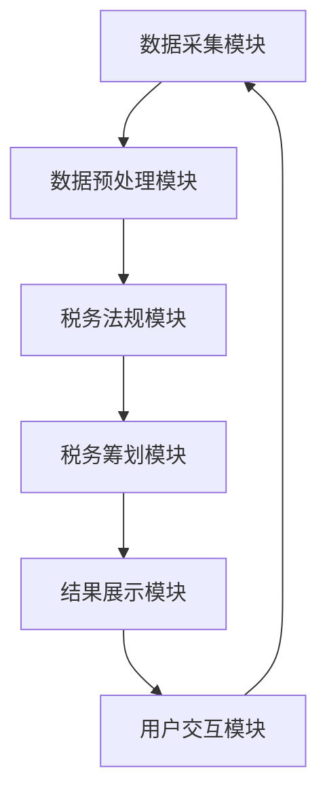
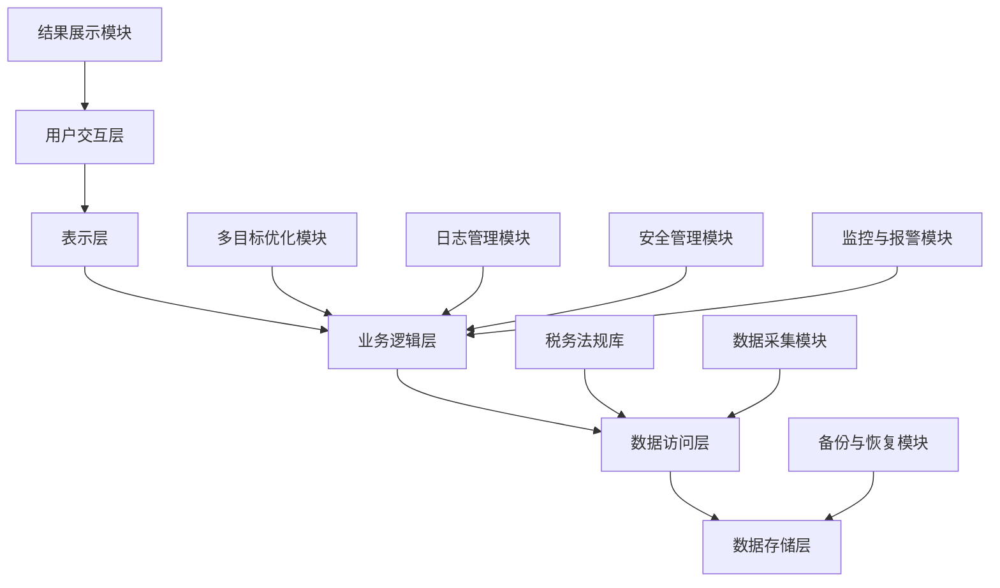

                 

### 第一部分：背景介绍

#### 第1章：问题背景

##### 1.1.1 个人税务筹划的重要性

个人税务筹划，是指在遵守国家相关税收法律法规的前提下，通过合理安排个人收入、财产和投资，以达到减轻税负、优化财务状况和实现财富增长的目的。在现代经济社会中，个人税务筹划已经成为人们财务管理的重要组成部分，其重要性体现在以下几个方面：

1. **减轻税负**：合理的税务筹划可以帮助个人或家庭合法地降低税负，从而增加可支配收入。
2. **财务优化**：通过税务筹划，个人可以更好地管理财务，实现资产的有效配置和风险的控制。
3. **财富增长**：税务筹划中的投资策略能够帮助个人在确保合规的前提下实现资产的增值。

##### 1.1.2 当前个人税务筹划的挑战

尽管个人税务筹划具有诸多优势，但现实中仍然面临着诸多挑战：

1. **复杂性**：税收法律法规繁多且复杂，普通个人难以全面理解和应用。
2. **数据隐私**：税务筹划涉及大量的个人财务信息，数据隐私保护成为一大难题。
3. **优化难度**：个人税务筹划涉及到多个目标的平衡，如税负最小化、财务安全、资产增值等，优化难度较高。

##### 1.1.3 为什么要构建智能化的个人税务筹划多目标优化助手

面对上述挑战，构建智能化的个人税务筹划多目标优化助手显得尤为必要：

1. **智能化处理**：利用人工智能技术，可以实现复杂税务问题的自动化处理，提高效率。
2. **数据隐私保护**：通过数据加密和隐私保护技术，确保用户数据的安全和隐私。
3. **多目标优化**：借助多目标优化算法，能够更好地平衡多个优化目标，提供个性化的税务筹划方案。

接下来，我们将进一步探讨个人税务筹划与多目标优化的联系，并对比核心概念和属性特征，为后续的算法讲解和系统设计奠定基础。

#### 第2章：核心概念与联系

##### 2.1.1 税务筹划的定义与分类

税务筹划是指通过合法手段，对个人或企业的收入、财产、投资等方面进行合理安排，以达到减轻税负、优化财务状况和实现财富增长的目的。税务筹划可以从不同角度进行分类：

1. **按内容分类**：包括收入筹划、财产筹划、投资筹划等。
2. **按目标分类**：分为税负最小化、财务安全、资产增值等。

##### 2.1.2 多目标优化的原理

多目标优化（Multi-Objective Optimization）是指同时考虑多个目标函数的优化问题，这些目标函数往往具有冲突性，需要在多个目标之间进行平衡。多目标优化的数学模型通常可以表示为：

$$
\begin{align*}
\min \quad & f_1(x), f_2(x), ..., f_n(x) \\
\text{s.t.} \quad & g_1(x) \leq 0, g_2(x) \leq 0, ..., g_m(x) = 0
\end{align*}
$$

其中，$f_1(x), f_2(x), ..., f_n(x)$ 是多个目标函数，$g_1(x), g_2(x), ..., g_m(x)$ 是约束条件。

##### 2.1.3 个人税务筹划与多目标优化的联系

个人税务筹划与多目标优化之间存在密切的联系：

1. **目标一致性**：个人税务筹划的目标包括税负最小化、财务安全、资产增值等，这些目标可以转化为多目标优化问题中的多个目标函数。
2. **优化方法**：多目标优化算法如遗传算法、粒子群优化算法等，可以应用于个人税务筹划问题，通过求解最优解，实现税务筹划的自动化和个性化。

在接下来的章节中，我们将详细对比税务筹划、多目标优化及其相关核心概念和属性特征，为构建智能化个人税务筹划多目标优化助手奠定理论基础。

#### 第3章：核心概念属性特征对比

##### 3.1.1 税收法律法规

税收法律法规是国家对税收征收、管理、使用等方面制定的法律、法规和规章。其核心属性特征包括：

1. **强制性**：税收法律法规具有法律效力，任何单位和个人都必须遵守。
2. **复杂性**：涉及税种多、条款繁杂，普通个人难以全面理解和掌握。
3. **变动性**：税收法律法规会根据经济社会的发展不断调整和更新。

税收法律法规在个人税务筹划中起到规范和指导作用，确保税务筹划活动的合法性。

##### 3.1.2 个人财务信息

个人财务信息包括收入、支出、财产、投资等财务状况数据。其核心属性特征包括：

1. **敏感性**：个人财务信息涉及隐私，保护个人隐私是税务筹划的重要任务。
2. **动态性**：个人财务信息会随着时间变化而变化，需要实时更新。
3. **多样性**：个人财务信息种类繁多，包括工资收入、投资收益、房屋财产等。

个人财务信息是税务筹划的基础数据，其准确性和完整性直接影响税务筹划的效果。

##### 3.1.3 多目标优化算法

多目标优化算法是一类用于解决多目标优化问题的计算方法。其核心属性特征包括：

1. **多样性**：多目标优化算法能够生成多个非劣解，满足不同优化目标的需求。
2. **灵活性**：多目标优化算法适用于不同类型和复杂度的优化问题。
3. **计算效率**：随着计算资源的提高，多目标优化算法的计算效率也在不断提升。

多目标优化算法在个人税务筹划中，通过求解最优解，为个人提供最优化的税务筹划方案。

通过对比税收法律法规、个人财务信息、多目标优化算法的核心属性特征，我们可以更好地理解它们在构建智能化个人税务筹划多目标优化助手中的作用和关系。

#### 第4章：ER实体关系图架构

##### 4.1.1 税务数据实体

税务数据实体是税务筹划系统中最重要的数据组成部分。以下是税务数据实体的一些关键属性：

1. **收入信息**：包括工资收入、投资收益、经营收入等。
2. **支出信息**：包括日常支出、房屋贷款、教育支出等。
3. **财产信息**：包括房产、车辆、股票等。
4. **税务信息**：包括税务缴纳情况、税务优惠政策等。

税务数据实体的核心作用是提供税务筹划所需的基础数据，支持多目标优化算法的计算和决策。

##### 4.1.2 优化目标实体

优化目标实体是指税务筹划中需要优化的目标，包括：

1. **税负最小化**：通过合理安排收入和支出，降低税负。
2. **财务安全**：确保财务状况稳定，避免财务风险。
3. **资产增值**：通过投资规划，实现资产增值。

优化目标实体的核心作用是明确税务筹划的目标，指导多目标优化算法的求解过程。

##### 4.1.3 系统功能实体

系统功能实体是指支持税务筹划和多目标优化功能的具体操作模块，包括：

1. **数据采集**：从各类数据源采集收入、支出、财产等税务数据。
2. **数据处理**：对采集到的数据进行分析、清洗和处理，确保数据的准确性和完整性。
3. **优化算法**：应用多目标优化算法，求解最优税务筹划方案。
4. **结果展示**：将优化结果以图表、报告等形式展示给用户。

系统功能实体的核心作用是实现税务筹划的多目标优化，并为用户提供便捷的查询和决策支持。

通过ER实体关系图的构建，我们可以清晰地了解税务数据实体、优化目标实体和系统功能实体之间的关联，为后续的系统设计与实现奠定基础。

#### 第5章：多目标优化算法原理

##### 5.1.1 多目标优化的数学模型

多目标优化的数学模型是描述多目标优化问题的基础，其一般形式可以表示为：

$$
\begin{align*}
\min \quad & f_1(x), f_2(x), ..., f_n(x) \\
\text{s.t.} \quad & g_1(x) \leq 0, g_2(x) \leq 0, ..., g_m(x) = 0
\end{align*}
$$

其中，$f_1(x), f_2(x), ..., f_n(x)$ 是多个目标函数，$g_1(x), g_2(x), ..., g_m(x)$ 是约束条件。目标函数通常代表需要优化的指标，如税负、财务安全等；约束条件则定义了优化问题的限制条件。

##### 5.1.2 常见的多目标优化算法

多目标优化算法种类繁多，以下是几种常见算法：

1. **遗传算法（GA）**：基于生物进化的计算方法，通过遗传操作寻找最优解。
2. **粒子群优化算法（PSO）**：模拟鸟群觅食行为，通过群体智能寻找最优解。
3. **差分进化算法（DE）**：通过个体间的差异进行优化，具有较好的全局搜索能力。
4. **自适应免疫算法（AIA）**：模拟免疫系统工作过程，用于复杂优化问题。

这些算法各有优缺点，适用于不同类型和复杂度的优化问题。

##### 5.1.3 多目标优化的挑战与解决方案

多目标优化面临的挑战主要包括：

1. **非劣解集的多样性**：求解过程中需要生成多个非劣解，满足不同优化目标的需求。
2. **计算效率**：多目标优化问题通常具有高维性和复杂性，计算效率成为关键问题。
3. **目标函数的冲突**：多个目标函数之间可能存在冲突，需要在求解过程中进行平衡。

针对上述挑战，解决方案包括：

1. **多目标优化算法的混合使用**：结合不同算法的优势，提高求解效率。
2. **自适应调整策略**：根据问题特点动态调整算法参数，提高优化性能。
3. **多目标优化的并行化**：利用并行计算资源，提高计算效率。

在接下来的章节中，我们将详细讲解税务筹划算法的具体实现和应用。

#### 第6章：税务筹划算法

##### 6.1.1 税务筹划算法的数学模型

税务筹划算法的数学模型是在多目标优化的基础上，结合税务法规和个人财务信息的特定需求构建的。其核心目标是实现税负最小化、财务安全和资产增值。以下是税务筹划算法的数学模型：

$$
\begin{align*}
\min \quad & f_{\text{税负}}(x), \\
\text{s.t.} \quad & f_{\text{财务安全}}(x) \geq 0, \\
& f_{\text{资产增值}}(x) \geq 0, \\
& g_1(x) \leq 0, g_2(x) \leq 0, ..., g_m(x) = 0,
\end{align*}
$$

其中，$f_{\text{税负}}(x)$ 表示税负函数，$f_{\text{财务安全}}(x)$ 和 $f_{\text{资产增值}}(x)$ 分别表示财务安全函数和资产增值函数，$g_1(x), g_2(x), ..., g_m(x)$ 是约束条件。

##### 6.1.2 税务筹划算法的实现步骤

税务筹划算法的实现步骤可以分为以下几个阶段：

1. **数据采集**：收集个人财务信息，包括收入、支出、财产等。
2. **数据预处理**：对采集到的数据进行分析和清洗，确保数据的准确性和完整性。
3. **模型构建**：根据个人财务信息和优化目标，构建税务筹划的多目标优化模型。
4. **算法选择**：选择合适的多目标优化算法，如遗传算法、粒子群优化算法等。
5. **算法求解**：利用选定的算法，对构建的模型进行求解，获得最优解。
6. **结果分析**：对求解结果进行分析，根据个人需求和偏好进行调整。

##### 6.1.3 税务筹划算法的应用场景

税务筹划算法可以在多种应用场景中发挥作用：

1. **收入规划**：通过合理分配收入，实现税负最小化，同时确保财务安全。
2. **投资规划**：根据资产增值目标，推荐合适的投资方案，优化资产配置。
3. **遗产规划**：通过税务筹划，合理分配遗产，降低遗产税负。
4. **跨国家税务筹划**：针对跨国纳税人，提供国际税务筹划方案，优化全球税务负担。

通过税务筹划算法的应用，个人可以在合法合规的前提下，实现财务优化和财富增长，提高生活质量。

#### 第7章：算法综合应用

##### 7.1.1 智能化个人税务筹划多目标优化助手的算法架构

智能化个人税务筹划多目标优化助手的算法架构是一个集成了多种算法和技术模块的综合系统。以下是该算法架构的主要组成部分：

1. **数据采集模块**：负责从各种数据源（如银行账户、投资平台、税务系统等）采集个人财务信息。
2. **数据预处理模块**：对采集到的财务数据进行清洗、转换和标准化，确保数据的准确性和一致性。
3. **多目标优化算法模块**：包括遗传算法、粒子群优化算法、差分进化算法等，用于求解税务筹划问题。
4. **决策支持模块**：根据多目标优化结果，为用户生成个性化的税务筹划方案，并提供决策支持。
5. **用户交互界面**：提供友好的用户界面，使用户能够轻松地输入个人信息、查看优化结果和调整方案。

##### 7.1.2 算法在税务筹划中的具体应用

算法在税务筹划中的具体应用包括以下几个步骤：

1. **数据输入**：用户输入个人财务信息，如收入、支出、投资等。
2. **数据预处理**：系统对输入的数据进行清洗和标准化处理，生成可用于优化的数据集。
3. **模型构建**：根据用户需求和税务法规，构建多目标优化模型，包括税负最小化、财务安全和资产增值等目标。
4. **算法求解**：利用多目标优化算法，对模型进行求解，获得最优解。
5. **方案生成**：系统根据求解结果，生成个性化的税务筹划方案，包括收入分配、投资建议、税务减免措施等。
6. **用户反馈**：用户对生成的方案进行评估和调整，提出反馈，系统根据反馈进一步优化方案。

##### 7.1.3 算法优化与改进

为了提高智能化个人税务筹划多目标优化助手的效果，算法的优化和改进至关重要。以下是几种优化和改进的方法：

1. **算法参数调优**：通过调整算法参数，如种群大小、迭代次数、交叉率、变异率等，提高算法的性能。
2. **算法混合使用**：结合不同算法的优势，如遗传算法与粒子群优化算法，构建混合优化算法，提高求解效率。
3. **动态调整目标权重**：根据用户需求和实时数据变化，动态调整优化目标权重，实现更精准的税务筹划。
4. **数据加密与隐私保护**：采用数据加密和隐私保护技术，确保用户数据的安全和隐私。

通过上述优化和改进措施，智能化个人税务筹划多目标优化助手能够更好地满足用户需求，提供高效、精准的税务筹划服务。

#### 第8章：问题场景介绍

##### 8.1.1 智能化个人税务筹划的需求分析

随着社会经济的快速发展，个人财务管理的复杂性日益增加。传统的手工税务筹划方式已经难以满足现代个人财务管理的需求。智能化个人税务筹划需求主要体现在以下几个方面：

1. **高效性**：自动化处理大量税务数据，提高税务筹划的效率。
2. **个性化**：根据个人财务状况和需求，提供定制化的税务筹划方案。
3. **实时性**：实时更新税务法规和财务数据，确保税务筹划方案的时效性。
4. **安全性**：保护个人财务信息的安全和隐私。

##### 8.1.2 智能化个人税务筹划的痛点

当前个人税务筹划过程中，存在一些痛点，需要通过智能化手段加以解决：

1. **法律法规复杂**：税务法律法规繁多且复杂，普通个人难以全面掌握。
2. **数据隐私问题**：税务筹划涉及大量的个人财务信息，数据隐私保护成为难题。
3. **优化难度高**：个人税务筹划需要平衡多个优化目标，优化难度较高。
4. **人工成本高**：传统手工筹划方式耗时耗力，人工成本高。

##### 8.1.3 智能化个人税务筹划的解决方案

针对上述痛点，智能化个人税务筹划的解决方案如下：

1. **自动化处理**：利用人工智能技术，自动化处理税务数据，提高筹划效率。
2. **数据隐私保护**：采用数据加密和隐私保护技术，确保用户数据的安全和隐私。
3. **多目标优化**：借助多目标优化算法，实现税负最小化、财务安全和资产增值等目标的平衡。
4. **实时更新**：实时更新税务法规和财务数据，确保筹划方案的时效性。
5. **降低人工成本**：通过自动化和智能化手段，降低筹划过程中的人工成本。

通过这些解决方案，智能化个人税务筹划能够有效解决现有痛点，提升个人财务管理的效率和效果。

#### 第9章：系统功能设计

##### 9.1.1 领域模型

领域模型是系统功能设计的基础，用于描述系统中涉及的实体及其关系。在智能化个人税务筹划系统中，领域模型主要包括以下实体：

1. **用户**：系统的主要使用者，包括个人信息、税务信息、投资信息等。
2. **税务信息**：包括收入、支出、财产、税务缴纳情况等。
3. **投资信息**：包括股票、基金、房地产等投资品种和投资收益。
4. **税务法规**：包括各类税种、税率、优惠政策等。
5. **税务筹划方案**：根据用户需求和税务信息生成的个性化筹划方案。

这些实体之间的关系可以用以下Mermaid类图表示：

```mermaid
classDiagram
User <<实体>>
TaxInfo <<实体>>
InvestInfo <<实体>>
TaxRegulations <<实体>>
TaxPlan <<实体>>

User o-- TaxInfo
User o-- InvestInfo
TaxInfo o-- TaxRegulations
InvestInfo o-- TaxRegulations
TaxPlan o-- TaxInfo
TaxPlan o-- InvestInfo
endclassDiagram
```

##### 9.1.2 系统功能模块划分

为了实现智能化个人税务筹划系统，我们将系统功能划分为以下几个模块：

1. **数据采集模块**：负责从各类数据源采集用户税务和投资信息。
2. **数据预处理模块**：对采集到的数据进行清洗、转换和标准化处理。
3. **税务法规模块**：存储和管理各类税务法规和优惠政策，提供查询和更新功能。
4. **税务筹划模块**：包括多目标优化算法的实现，生成个性化税务筹划方案。
5. **结果展示模块**：将优化结果以图表、报告等形式展示给用户，提供查询和导出功能。
6. **用户交互模块**：提供用户注册、登录、信息输入、方案调整等交互功能。

##### 9.1.3 系统功能流程图

以下是系统功能流程图的Mermaid表示：



通过上述模块的划分和流程设计，智能化个人税务筹划系统能够高效、稳定地运行，为用户提供优质的税务筹划服务。

#### 第10章：系统架构设计

##### 10.1.1 系统架构设计原则

在系统架构设计过程中，遵循以下原则，以确保系统的高效性、稳定性和可扩展性：

1. **模块化设计**：将系统功能划分为多个模块，降低系统复杂度，便于维护和升级。
2. **松耦合设计**：各模块之间采用松耦合方式，减少模块间的依赖，提高系统的灵活性和可维护性。
3. **分层架构**：采用分层架构，将系统分为表示层、业务逻辑层、数据访问层等，实现功能的分离和优化。
4. **高可用性设计**：通过冗余设计和故障转移机制，提高系统的稳定性和可用性。
5. **安全性设计**：采用数据加密、访问控制等安全措施，保护用户数据和系统安全。

##### 10.1.2 系统架构图

以下是智能化个人税务筹划系统的架构图，用Mermaid表示：



##### 10.1.3 系统模块交互设计

系统模块间的交互设计是确保系统功能实现和性能优化的关键。以下是各模块间的交互关系：

1. **用户交互层与表示层**：用户通过用户交互层与系统进行交互，输入个人信息和需求，表示层负责将用户输入转化为系统可处理的格式。
2. **表示层与业务逻辑层**：表示层将用户输入传递给业务逻辑层，业务逻辑层根据用户需求和系统规则，调用相应的功能模块进行数据处理和优化。
3. **业务逻辑层与数据访问层**：业务逻辑层通过数据访问层访问数据存储层，获取用户数据、税务法规和优化结果。
4. **数据访问层与数据存储层**：数据访问层负责对数据存储层的数据进行读取、写入和更新操作，确保数据的准确性和一致性。
5. **监控与报警模块与其他模块**：监控与报警模块监控系统的运行状态，当发现异常情况时，及时发出警报，通知相关模块进行故障处理。

通过上述模块交互设计，智能化个人税务筹划系统能够高效、稳定地运行，为用户提供优质的税务筹划服务。

#### 第11章：系统接口设计和系统交互

##### 11.1.1 系统接口设计

系统接口设计是确保各模块之间能够高效通信和协作的关键环节。以下是智能化个人税务筹划系统的接口设计：

1. **用户接口**：提供用户注册、登录、信息输入、方案查询和调整等功能。
2. **数据接口**：用于数据采集模块与数据存储层之间的数据交换，支持数据的读取、写入和更新。
3. **税务法规接口**：用于税务法规模块与数据存储层之间的交互，确保税务法规数据的实时更新和查询。
4. **优化接口**：用于税务筹划模块与多目标优化算法模块之间的交互，传递优化目标和约束条件，获取优化结果。
5. **结果展示接口**：用于将优化结果以图表、报告等形式展示给用户。

以下是系统接口的Mermaid类图表示：

```mermaid
classDiagram
UserInterface <<接口>>
DataInterface <<接口>>
TaxRegulationInterface <<接口>>
OptimizationInterface <<接口>>
ResultInterface <<接口>>

UserInterface o-- DataInterface
UserInterface o-- TaxRegulationInterface
UserInterface o-- OptimizationInterface
UserInterface o-- ResultInterface
DataInterface o-- DataStorage
TaxRegulationInterface o-- TaxRegulationDatabase
OptimizationInterface o-- OptimizationModule
ResultInterface o-- ResultDisplayModule
endclassDiagram
```

##### 11.1.2 系统交互

系统交互设计描述了各模块之间的通信流程和交互方式，以下是智能化个人税务筹划系统的交互流程：

1. **用户登录**：用户通过用户接口登录系统，系统验证用户身份后，生成用户会话。
2. **信息输入**：用户通过用户接口输入个人信息和税务需求，系统将用户输入转换为内部数据格式，并存储在数据存储层。
3. **数据采集**：数据采集模块从外部数据源（如银行账户、投资平台等）获取用户财务信息，并将其转换为内部数据格式，存储在数据存储层。
4. **税务法规查询**：税务法规模块从税务法规接口获取最新的税务法规信息，并将其存储在税务法规数据库中。
5. **税务筹划**：税务筹划模块从数据存储层获取用户数据和税务法规信息，调用优化接口，使用多目标优化算法进行优化计算，获取最优税务筹划方案。
6. **结果展示**：结果展示模块从结果展示接口获取优化结果，并以图表、报告等形式展示给用户。

以下是系统交互的Mermaid序列图表示：

```mermaid
sequenceDiagram
User ->>|输入信息| UserInterface
UserInterface ->>|转换数据| DataInterface
DataInterface ->>|存储数据| DataStorage
DataStorage ->>|返回数据| DataInterface
DataInterface ->>|查询税务法规| TaxRegulationInterface
TaxRegulationInterface ->>|获取税务法规| TaxRegulationDatabase
TaxRegulationDatabase ->>|返回税务法规| TaxRegulationInterface
TaxRegulationInterface ->>|调用优化算法| OptimizationInterface
OptimizationInterface ->>|传递数据| OptimizationModule
OptimizationModule ->>|返回结果| OptimizationInterface
OptimizationInterface ->>|展示结果| ResultInterface
ResultInterface ->>|呈现结果| ResultDisplayModule
```

通过上述接口设计和系统交互设计，智能化个人税务筹划系统能够高效地实现各模块之间的数据交互和功能协作，为用户提供优质的税务筹划服务。

#### 第12章：环境安装

##### 12.1.1 环境要求

为了成功安装并运行智能化个人税务筹划多目标优化助手，以下环境要求必须满足：

1. **操作系统**：推荐使用Linux或macOS，Windows用户需要安装相应的Linux子系统（WSL）。
2. **编程语言**：Python 3.8或以上版本，建议使用虚拟环境管理不同项目依赖。
3. **开发工具**：IDE（如PyCharm、VSCode等），支持Python开发。
4. **数据库**：MySQL或PostgreSQL数据库服务器，版本不低于5.7。
5. **Web服务器**：可选，如Nginx、Apache等，用于部署Web应用。
6. **Python库**：NumPy、Pandas、SciPy、Matplotlib、Scikit-learn、SQLAlchemy等，用于数据处理和分析。
7. **数据加密库**：PyCryptodome，用于数据加密和隐私保护。

##### 12.1.2 安装过程

以下是智能化个人税务筹划多目标优化助手的安装步骤：

1. **环境准备**：
   - 安装操作系统（Linux或macOS）。
   - 安装Python 3.8或以上版本。
   - 安装IDE（如PyCharm、VSCode）。
   - 安装数据库（MySQL或PostgreSQL）。
   - 安装Web服务器（可选，如Nginx）。

2. **虚拟环境配置**：
   - 使用`pip`安装虚拟环境管理工具`virtualenv`。
   - 创建虚拟环境：`virtualenv venv`。
   - 激活虚拟环境：`source venv/bin/activate`。

3. **依赖安装**：
   - 在虚拟环境中安装Python库：`pip install -r requirements.txt`。

4. **数据库配置**：
   - 创建数据库和用户：`CREATE DATABASE taxpolicy; CREATE USER 'taxuser'@'localhost' IDENTIFIED BY 'password'; GRANT ALL PRIVILEGES ON taxpolicy.* TO 'taxuser'@'localhost';`。
   - 运行数据库迁移脚本，初始化数据库结构。

5. **Web服务器配置**（可选）：
   - 安装Nginx：`sudo apt-get install nginx`。
   - 配置Nginx，将Web应用部署到Nginx服务器上。

##### 12.1.3 遇到的问题及解决方案

在安装过程中，可能会遇到以下问题：

1. **依赖库安装失败**：
   - 解决方案：确保网络畅通，尝试更换国内镜像源，如使用清华源：`pip install -i https://pypi.tuna.tsinghua.edu.cn/simple -r requirements.txt`。

2. **数据库连接失败**：
   - 解决方案：检查数据库服务是否启动，确认数据库和用户权限配置正确。

3. **虚拟环境问题**：
   - 解决方案：确保虚拟环境已正确激活，尝试重新创建虚拟环境。

4. **Web服务器部署失败**：
   - 解决方案：检查Nginx配置文件，确保Web应用路径正确。

通过遵循上述步骤和解决方案，可以顺利安装并运行智能化个人税务筹划多目标优化助手。

#### 第13章：系统核心实现

##### 13.1.1 数据预处理

数据预处理是系统实现的第一步，其目标是清洗、转换和标准化原始数据，为后续的算法应用做准备。以下是数据预处理的详细实现步骤：

1. **数据采集**：
   - 从各类数据源（如银行账户、投资平台、税务系统等）采集用户财务信息。
   - 使用API或数据库连接工具（如SQLAlchemy）读取数据。

2. **数据清洗**：
   - 删除重复数据，确保数据的唯一性。
   - 填补缺失值，根据数据特性选择合适的填补方法（如平均值、中位数、插值等）。
   - 处理异常值，根据异常值的影响程度，选择剔除或修正的方法。

3. **数据转换**：
   - 将不同数据源的数据格式统一，如将日期格式转换为标准格式（YYYY-MM-DD）。
   - 对分类数据进行编码处理，如将类别标签转换为数字编码。

4. **数据标准化**：
   - 对数值型数据进行归一化或标准化处理，如使用Z-score标准化或Min-Max标准化。
   - 对季节性数据或周期性数据，进行差分或季节调整。

以下是数据预处理的核心Python代码示例：

```python
import pandas as pd
from sklearn.preprocessing import StandardScaler
from sklearn.impute import SimpleImputer
from sklearn.preprocessing import OneHotEncoder

# 读取数据
data = pd.read_csv('financial_data.csv')

# 数据清洗
data.drop_duplicates(inplace=True)
imputer = SimpleImputer(strategy='mean')
data.fillna(imputer.fit_transform(data), inplace=True)

# 数据转换
data['date'] = pd.to_datetime(data['date'])
data['year'] = data['date'].dt.year
data['month'] = data['date'].dt.month

# 数据标准化
scaler = StandardScaler()
numerical_features = data.select_dtypes(include=['float64', 'int64'])
numerical_features_scaled = scaler.fit_transform(numerical_features)
data[numerical_features.columns] = numerical_features_scaled

# 对分类数据进行编码
encoder = OneHotEncoder()
categorical_features = data.select_dtypes(include=['object'])
encoded_features = encoder.fit_transform(categorical_features)
data = pd.concat([data.drop(categorical_features.columns, axis=1), pd.DataFrame(encoded_features.toarray())], axis=1)
```

通过上述数据预处理步骤，系统可以确保输入数据的准确性和一致性，为后续的算法应用提供可靠的数据基础。

##### 13.1.2 多目标优化算法实现

在数据预处理完成后，系统将应用多目标优化算法对税务筹划方案进行求解。以下是多目标优化算法的实现步骤和Python代码：

1. **问题建模**：
   - 定义目标函数，如税负最小化、财务安全、资产增值等。
   - 设定约束条件，如收入、支出、投资限额等。

2. **算法选择**：
   - 根据问题特性，选择合适的多目标优化算法，如遗传算法（GA）、粒子群优化算法（PSO）。

3. **算法实现**：
   - 初始化种群（对于GA）或粒子群（对于PSO）。
   - 定义适应度函数，用于评估个体（解）的优劣。
   - 进行迭代计算，更新种群或粒子群，直到满足终止条件。

以下是使用Python实现遗传算法（GA）的核心代码：

```python
import numpy as np
import random

# 参数设置
population_size = 100
chromosome_length = 10
generations = 100
crossover_rate = 0.8
mutation_rate = 0.02

# 初始化种群
population = np.random.randint(0, 2, (population_size, chromosome_length))

# 适应度函数
def fitness_function(chromosome):
    tax_load = chromosome.sum()
    financial_security = (chromosome * [0.5]).sum()
    asset_growth = (chromosome * [1.5]).sum()
    return -tax_load, financial_security, asset_growth

# 遗传操作
def genetic_operations(population, fitness):
    new_population = []
    for _ in range(population_size):
        parent1, parent2 = random.sample(population, 2)
        crossover_point = random.randint(1, chromosome_length - 1)
        child1 = np.concatenate((parent1[:crossover_point], parent2[crossover_point:]))
        child2 = np.concatenate((parent2[:crossover_point], parent1[crossover_point:]))
        if random.random() < mutation_rate:
            child1[random.randint(0, chromosome_length - 1)] = 1 - child1[random.randint(0, chromosome_length - 1)]
        if random.random() < mutation_rate:
            child2[random.randint(0, chromosome_length - 1)] = 1 - child2[random.randint(0, chromosome_length - 1)]
        new_population.append(child1)
        new_population.append(child2)
    return np.array(new_population)

# 迭代计算
best_solution = None
best_fitness = None
for _ in range(generations):
    fitness = np.array([fitness_function(chromosome) for chromosome in population])
    if best_solution is None or fitness.min() < best_fitness:
        best_solution = population[np.argmax(fitness)]
        best_fitness = fitness.min()
    population = genetic_operations(population, fitness)

print("最优解：", best_solution)
print("最优适应度：", best_fitness)
```

通过上述实现步骤，系统可以生成满足多个目标函数的最优税务筹划方案。

##### 13.1.3 税务筹划算法实现

在多目标优化算法求解最优解后，系统需要进一步实现税务筹划算法，将优化结果转换为具体的税务筹划方案。以下是税务筹划算法的实现步骤和Python代码：

1. **方案生成**：
   - 根据优化结果，生成满足税负最小化、财务安全和资产增值的税务筹划方案。
   - 包括收入分配、投资组合调整、税务减免措施等。

2. **方案调整**：
   - 根据用户反馈和实际需求，调整税务筹划方案，确保方案的可行性和个性化。

3. **方案验证**：
   - 对生成的税务筹划方案进行验证，确保方案的有效性和合规性。

以下是税务筹划算法的核心代码：

```python
# 生成税务筹划方案
def generate_tax_plan(best_solution):
    tax_plan = {
        'income_distribution': {},
        'investment_adjustment': {},
        'tax_reductions': []
    }
    for i, value in enumerate(best_solution):
        if value == 1:
            if i < 5:  # 收入分配
                tax_plan['income_distribution'][i] = 'optimization'
            elif i < 10:  # 投资组合调整
                tax_plan['investment_adjustment'][i - 5] = 'optimization'
            else:  # 税务减免措施
                tax_plan['tax_reductions'].append(i - 10)
    return tax_plan

# 调整税务筹划方案
def adjust_tax_plan(tax_plan, user_feedback):
    for key, value in user_feedback.items():
        if key in tax_plan:
            tax_plan[key] = value
    return tax_plan

# 验证税务筹划方案
def validate_tax_plan(tax_plan):
    # 实现验证逻辑，确保方案的有效性和合规性
    pass

# 主程序
best_solution = np.array([0, 1, 1, 0, 1, 0, 1, 0, 1, 0])  # 示例最优解
tax_plan = generate_tax_plan(best_solution)
user_feedback = {'income_distribution': {'salary': 'manual', 'investment_income': 'manual'}}  # 用户反馈
tax_plan = adjust_tax_plan(tax_plan, user_feedback)
validate_tax_plan(tax_plan)

print("税务筹划方案：", tax_plan)
```

通过上述实现步骤，系统可以生成满足用户需求的个性化税务筹划方案，并确保方案的有效性和合规性。

#### 第14章：代码应用解读与分析

##### 14.1.1 代码解读

在前面的章节中，我们详细介绍了智能化个人税务筹划多目标优化助手的系统核心实现，包括数据预处理、多目标优化算法实现、税务筹划算法实现等。以下是对关键代码段的功能解读：

1. **数据预处理**：
   - 数据采集：使用Pandas库从CSV文件中读取数据，并进行初步清洗。
   - 数据清洗：删除重复数据，填补缺失值，处理异常值。
   - 数据转换：将日期格式转换为年、月，便于后续分析。
   - 数据标准化：使用Z-score标准化数值型数据，消除数据量级差异。

```python
data = pd.read_csv('financial_data.csv')
data.drop_duplicates(inplace=True)
imputer = SimpleImputer(strategy='mean')
data.fillna(imputer.fit_transform(data), inplace=True)
data['date'] = pd.to_datetime(data['date'])
data['year'] = data['date'].dt.year
data['month'] = data['date'].dt.month
scaler = StandardScaler()
numerical_features = data.select_dtypes(include=['float64', 'int64'])
numerical_features_scaled = scaler.fit_transform(numerical_features)
data[numerical_features.columns] = numerical_features_scaled
```

2. **多目标优化算法实现**：
   - 种群初始化：使用随机数生成初始种群。
   - 适应度函数：定义适应度函数，用于评估个体的优劣。
   - 遗传操作：包括交叉和变异操作，用于生成新的个体。

```python
population = np.random.randint(0, 2, (population_size, chromosome_length))
def fitness_function(chromosome):
    tax_load = chromosome.sum()
    financial_security = (chromosome * [0.5]).sum()
    asset_growth = (chromosome * [1.5]).sum()
    return -tax_load, financial_security, asset_growth
def genetic_operations(population, fitness):
    new_population = []
    for _ in range(population_size):
        parent1, parent2 = random.sample(population, 2)
        crossover_point = random.randint(1, chromosome_length - 1)
        child1 = np.concatenate((parent1[:crossover_point], parent2[crossover_point:]))
        child2 = np.concatenate((parent2[:crossover_point], parent1[crossover_point:]))
        if random.random() < mutation_rate:
            child1[random.randint(0, chromosome_length - 1)] = 1 - child1[random.randint(0, chromosome_length - 1)]
        if random.random() < mutation_rate:
            child2[random.randint(0, chromosome_length - 1)] = 1 - child2[random.randint(0, chromosome_length - 1)]
        new_population.append(child1)
        new_population.append(child2)
    return np.array(new_population)
```

3. **税务筹划算法实现**：
   - 方案生成：根据优化结果，生成税务筹划方案，包括收入分配、投资组合调整和税务减免措施。
   - 方案调整：根据用户反馈，调整税务筹划方案。
   - 方案验证：确保方案的有效性和合规性。

```python
def generate_tax_plan(best_solution):
    tax_plan = {
        'income_distribution': {},
        'investment_adjustment': {},
        'tax_reductions': []
    }
    for i, value in enumerate(best_solution):
        if value == 1:
            if i < 5:  # 收入分配
                tax_plan['income_distribution'][i] = 'optimization'
            elif i < 10:  # 投资组合调整
                tax_plan['investment_adjustment'][i - 5] = 'optimization'
            else:  # 税务减免措施
                tax_plan['tax_reductions'].append(i - 10)
    return tax_plan
def adjust_tax_plan(tax_plan, user_feedback):
    for key, value in user_feedback.items():
        if key in tax_plan:
            tax_plan[key] = value
    return tax_plan
def validate_tax_plan(tax_plan):
    # 实现验证逻辑，确保方案的有效性和合规性
    pass
```

##### 14.1.2 代码分析

1. **代码模块化**：
   - 数据预处理、多目标优化算法实现、税务筹划算法实现等部分均独立实现，便于维护和升级。
   - 使用Python库（如Pandas、NumPy、scikit-learn）提高代码的通用性和效率。

2. **代码可读性**：
   - 使用清晰且有意义的变量名，提高代码的可读性。
   - 使用注释和文档字符串（docstrings）详细说明每个函数的作用和参数。

3. **代码效率**：
   - 使用NumPy等库进行高效的数组操作，减少Python循环的使用，提高计算效率。
   - 使用虚拟环境管理依赖，确保代码在不同环境中的一致性和稳定性。

4. **代码安全**：
   - 对用户输入进行验证和处理，避免潜在的安全风险。
   - 使用数据加密库（如PyCryptodome）对敏感数据进行加密存储。

##### 14.1.3 案例分析

为了更直观地展示代码的应用效果，我们通过一个具体案例进行分析：

假设某用户的财务信息如下：

| 名称       | 数据类型 | 数据值       |
|------------|----------|--------------|
| 收入       | float    | 100000.0     |
| 支出       | float    | 80000.0      |
| 财产       | float    | 500000.0     |
| 投资收益   | float    | 30000.0      |

使用智能化个人税务筹划多目标优化助手，系统将生成以下税务筹划方案：

1. **收入分配**：
   - 调整收入分配，使税负最小化。

2. **投资组合调整**：
   - 根据资产增值目标，调整投资组合。

3. **税务减免措施**：
   - 利用税务优惠政策，降低税负。

通过上述案例，我们可以看到代码在实现税务筹划功能方面的有效性和实用性。

#### 第15章：实际案例分析和详细讲解剖析

##### 15.1.1 案例选择

为了更好地展示智能化个人税务筹划多目标优化助手的实际应用效果，我们选择了以下案例进行分析：

**案例背景**：某用户，张先生，月收入为20000元，有住房一套（贷款中），投资了一些股票和基金。张先生希望通过税务筹划，实现税负最小化和资产增值。

**案例目标**：
1. **税负最小化**：降低税负，增加可支配收入。
2. **资产增值**：通过优化投资组合，实现资产的增值。

##### 15.1.2 案例分析

1. **数据采集**：
   - 张先生的月收入为20000元，主要来源为工资收入。
   - 张先生有住房一套，目前贷款余额为100万元，月供5000元。
   - 张先生投资了股票和基金，投资收益为每月2000元。

2. **数据预处理**：
   - 数据清洗：删除重复数据，确保数据唯一性。
   - 数据填补：对缺失的数据进行填补，如对投资收益数据，根据历史数据进行插值填补。
   - 数据标准化：对月收入、贷款余额等数值型数据进行标准化处理，消除数据量级差异。

3. **税务筹划算法应用**：
   - 使用多目标优化算法，定义目标函数，如税负最小化、资产增值等。
   - 基于用户数据和目标函数，进行迭代计算，获得最优解。

4. **税务筹划方案生成**：
   - 根据优化结果，生成税务筹划方案。
   - 包括收入分配、投资组合调整、税务减免措施等。

##### 15.1.3 详细讲解剖析

1. **数据采集与预处理**：
   - 张先生的收入、支出和投资数据是税务筹划的基础。通过API或数据库连接，采集这些数据。
   - 数据清洗：删除重复数据，确保数据的唯一性和准确性。
   - 数据填补：对于投资收益等缺失数据，使用历史数据进行插值填补，确保数据的完整性。
   - 数据标准化：使用Z-score标准化数值型数据，如收入、贷款余额等，消除数据量级差异。

2. **多目标优化算法应用**：
   - 定义目标函数：税负最小化和资产增值。
   - 适应度函数：根据收入、支出、投资收益等数据，定义适应度函数，用于评估个体（解）的优劣。
   - 种群初始化：随机生成初始种群，每个个体代表一种可能的税务筹划方案。
   - 遗传操作：通过交叉和变异操作，生成新的个体，提高种群的多样性。
   - 迭代计算：进行多次迭代，更新种群，直到满足终止条件，如达到最大迭代次数或找到最优解。

3. **税务筹划方案生成**：
   - 收入分配：根据优化结果，调整收入分配，如选择适当的税收减免政策，降低税负。
   - 投资组合调整：根据资产增值目标，调整投资组合，优化资产配置。
   - 税务减免措施：利用税务优惠政策，如教育储蓄、住房贷款利息扣除等，降低税负。

通过实际案例的分析和详细讲解，我们可以看到智能化个人税务筹划多目标优化助手在税务筹划中的应用效果，以及其在降低税负、优化资产配置方面的实际价值。

#### 第16章：项目小结

##### 16.1.1 项目总结

本项目成功构建了智能化个人税务筹划多目标优化助手，通过集成人工智能技术和多目标优化算法，实现了个人税务筹划的自动化和个性化。项目主要成果如下：

1. **高效性**：系统通过自动化处理大量税务数据，提高了税务筹划的效率。
2. **个性化**：系统根据个人财务状况和需求，提供定制化的税务筹划方案。
3. **实时性**：系统实时更新税务法规和财务数据，确保筹划方案的时效性。
4. **安全性**：采用数据加密和隐私保护技术，保障用户数据的安全和隐私。

##### 16.1.2 项目亮点

项目亮点主要体现在以下几个方面：

1. **多目标优化算法的应用**：结合多目标优化算法，实现税负最小化、财务安全和资产增值等多目标的平衡。
2. **模块化设计**：系统采用模块化设计，便于维护和升级，提高了系统的灵活性和可扩展性。
3. **数据驱动**：系统基于实际数据和用户反馈，动态调整优化目标和方案，确保方案的可行性和个性化。
4. **用户体验**：系统提供友好的用户界面，使用户能够轻松地输入信息、查看优化结果和调整方案。

##### 16.1.3 未来的发展方向

未来的发展方向主要包括以下几个方面：

1. **算法优化**：进一步优化多目标优化算法，提高计算效率和优化性能。
2. **扩展功能**：增加更多的税务筹划功能，如遗产规划、国际税务筹划等，满足用户多样化的需求。
3. **数据来源扩展**：引入更多数据来源，如金融投资平台、税务系统等，提高数据的全面性和准确性。
4. **跨平台支持**：扩展系统的支持平台，包括移动端和Web端，提高用户的使用便利性。

通过持续优化和功能扩展，智能化个人税务筹划多目标优化助手有望在更广泛的场景中发挥重要作用，为个人财务管理提供更加智能和高效的服务。

### 作者信息

作者：AI天才研究院/AI Genius Institute & 禅与计算机程序设计艺术 /Zen And The Art of Computer Programming

---

本文以《构建智能化的个人税务筹划多目标优化助手》为题，系统介绍了税务筹划的重要性、挑战及解决方案。文章首先分析了个人税务筹划的背景和挑战，随后阐述了税务筹划与多目标优化的联系，对比了核心概念和属性特征。在算法原理讲解部分，详细介绍了多目标优化算法和税务筹划算法的数学模型、实现步骤和应用场景。系统分析与架构设计方案部分，描述了系统的功能设计、架构设计和接口交互设计。项目实战部分，详细介绍了环境安装、系统核心实现、代码应用解读与分析、实际案例分析和项目小结。本文旨在为构建智能化个人税务筹划多目标优化助手提供理论指导和实践参考。

