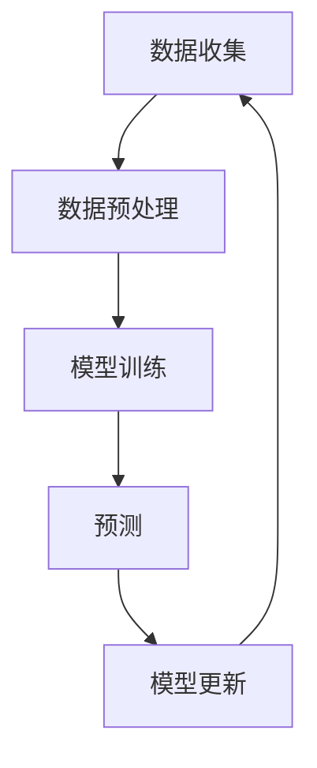
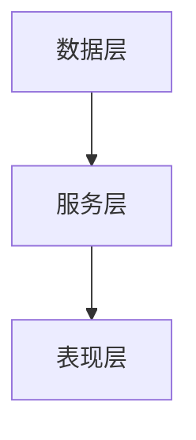
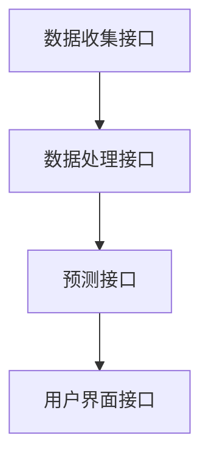
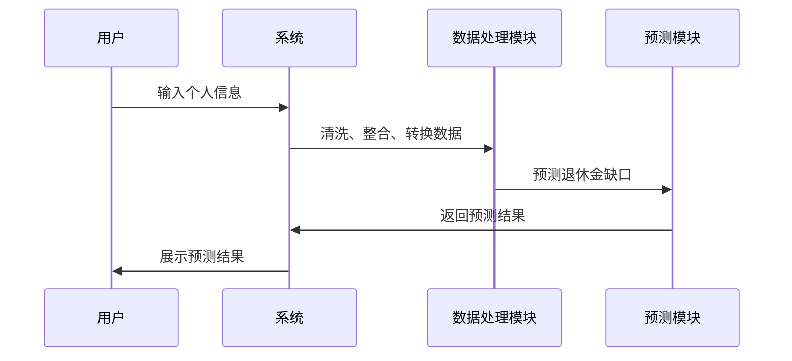

                 

## 引言与背景介绍

### 1.1 问题背景

随着全球人口老龄化趋势的加剧，个人退休金缺口问题日益受到广泛关注。退休金缺口，即个人在退休后实际收入与预期收入之间的差距，已成为影响老年人生活质量的重要问题。特别是在现代社会，经济压力和通货膨胀使得个人退休金管理变得更加复杂和关键。

退休金缺口问题不仅仅存在于个人层面，也对社会整体经济稳定产生深远影响。对于个人而言，退休金缺口可能导致生活质量的显著下降，甚至陷入贫困。对社会而言，大量的老年人贫困问题会引发社会动荡，增加社会福利负担，影响社会经济发展。

### 1.2 个人退休金缺口问题概述

个人退休金缺口问题可以从以下几个方面进行概述：

1. **收入来源**：退休后的收入主要来源于个人储蓄、投资回报、社会保险、商业保险等。这些收入来源的稳定性和收益性直接影响退休金缺口的大小。
   
2. **生活方式**：退休后的生活方式，包括消费习惯、居住条件、医疗保健需求等，都会对退休金缺口产生影响。例如，健康长寿可能会增加医疗保健支出，从而扩大退休金缺口。

3. **通货膨胀**：通货膨胀会降低货币的购买力，导致退休金在未来的实际价值减少。因此，退休金缺口问题必须考虑通货膨胀的影响。

4. **预期寿命**：随着医疗水平的提高和生活条件的改善，预期寿命不断延长。这意味着退休金的持续时间更长，进一步加剧了退休金缺口的问题。

### 1.3 预测技术在退休金管理中的应用

预测技术在退休金管理中具有重要作用，尤其是在动态预测方面。动态预测可以实时监测和预测个人退休金缺口的变化，帮助个人和金融机构及时调整退休金计划，以减少未来退休金缺口的风险。

以下是预测技术在退休金管理中的应用：

1. **收入预测**：通过分析个人职业历史、工资增长率、通货膨胀率等因素，预测个人未来收入，从而评估退休金缺口。

2. **支出预测**：结合个人的生活方式、健康情况、居住条件等因素，预测退休后的支出，从而为退休金计划提供数据支持。

3. **投资回报预测**：利用历史数据和宏观经济环境，预测不同投资策略的未来回报，帮助个人优化投资组合，减少退休金缺口。

4. **政策影响预测**：分析政府政策的变化对退休金缺口的影响，为政策制定者提供决策依据。

### 1.4 动态预测的核心概念

动态预测的核心在于实时更新和调整预测模型，以适应不断变化的情况。以下是动态预测的几个关键概念：

1. **时间序列分析**：通过分析时间序列数据，提取时间依赖性，预测未来的趋势和变化。

2. **机器学习算法**：利用机器学习算法，特别是深度学习模型，对大量历史数据进行训练，建立预测模型。

3. **数据驱动**：基于大量数据，通过数据分析和挖掘，发现数据中的规律和模式，进行动态预测。

4. **模型迭代**：动态预测过程中，模型需要不断迭代更新，以适应新的数据和环境变化。

### 1.5 书籍结构概述

本书将从多个角度深入探讨构建智能化的个人退休金缺口动态预测助手的方法。具体包括以下章节：

- **第1章**：引言与背景介绍，概述退休金缺口问题和预测技术在退休金管理中的应用。
- **第2章**：核心概念与联系，详细解释数据分析基础、预测算法以及核心概念之间的联系。
- **第3章**：算法原理讲解，介绍动态预测算法的原理、数学模型、算法流程和Python源代码。
- **第4章**：系统分析与架构设计，讲解系统分析与架构设计的方法和步骤。
- **第5章**：项目实战，通过实际项目介绍环境安装、系统核心实现和代码应用分析。
- **第6章**：最佳实践，提供最佳实践技巧、注意事项和拓展阅读。
- **第7章**：总结与展望，回顾全书内容，展望未来发展趋势和研究方向。

通过以上章节的逐步讲解，本书旨在为读者提供一个全面、系统的构建智能化个人退休金缺口动态预测助手的方法。

### 第2章：核心概念与联系

#### 2.1 数据分析基础

数据分析是构建智能化退休金缺口动态预测助手的关键环节。它包括数据收集、数据预处理、数据分析和数据可视化等步骤。以下是数据分析的基础概念：

1. **数据收集**：数据收集是数据分析的第一步，包括从各种来源获取数据，如数据库、文件、API接口等。数据来源的多样性和完整性直接影响数据分析的结果。

2. **数据预处理**：数据预处理包括数据清洗、数据整合和数据转换等步骤。数据清洗主要是去除无效数据、处理缺失值和异常值，确保数据的准确性和一致性。数据整合是将多个数据源中的数据合并，形成统一的数据集。数据转换是将数据转换为适合分析的形式，如将文本数据转换为数值数据。

3. **数据分析**：数据分析包括描述性分析、探索性分析和预测性分析等。描述性分析主要描述数据的特征和分布，探索性分析用于发现数据中的规律和模式，预测性分析则利用历史数据预测未来趋势。

4. **数据可视化**：数据可视化是将数据以图形化的形式展示，帮助人们更好地理解数据。常见的可视化工具包括图表、地图、热力图等。

#### 2.2 预测算法概述

预测算法是动态预测的核心，用于根据历史数据预测未来趋势。以下是几种常用的预测算法：

1. **时间序列模型**：时间序列模型是一种用于预测时间序列数据的统计模型，包括自回归模型（AR）、移动平均模型（MA）和自回归移动平均模型（ARMA）等。这些模型基于数据的时间依赖性进行预测。

2. **机器学习算法**：机器学习算法通过学习历史数据中的模式和规律进行预测，包括线性回归、决策树、支持向量机（SVM）、神经网络等。机器学习算法在处理复杂和非线性数据时表现出色。

3. **深度学习算法**：深度学习算法是机器学习的一个分支，通过多层神经网络进行特征提取和预测。常见的深度学习算法包括卷积神经网络（CNN）和循环神经网络（RNN）等。

#### 2.3 概念属性特征对比表格

为了更好地理解数据分析基础和预测算法，以下是这些概念属性特征的对比表格：

| 概念/特征 | 数据分析基础 | 预测算法 |
| :--: | :--: | :--: |
| 数据收集 | 获取数据 | 基于数据 |
| 数据预处理 | 清洗、整合、转换 | 预处理后的数据 |
| 数据分析 | 描述性、探索性、预测性 | 预测未来 |
| 数据可视化 | 图形化展示 | 辅助理解和验证 |

#### 2.4 ER实体关系图

实体关系图（ER图）是数据库设计中的重要工具，用于描述实体之间的关系。以下是构建智能化退休金缺口动态预测助手时，ER图的示例：

```mermaid
erDiagram
  Person ||--|{ Account }
  Account ||--|{ Investment }
  Investment ||--|{ Return }
```

- **Person（个人）**：表示退休金的持有者，包含个人基本信息。
- **Account（账户）**：表示个人在金融机构中的账户信息，与Person实体关联。
- **Investment（投资）**：表示个人在不同投资渠道的资产，与Account实体关联。
- **Return（回报）**：表示投资的回报情况，与Investment实体关联。

通过ER实体关系图，可以清晰地看到各实体之间的关联关系，为后续的数据库设计和实现提供指导。

### 第3章：算法原理讲解

#### 3.1 算法原理概述

动态预测算法的核心在于实时更新和调整预测模型，以适应不断变化的情况。本章将介绍一种基于时间序列分析的动态预测算法，详细解释其原理和实现方法。

#### 3.2 数学模型与公式

动态预测算法通常基于自回归模型（AR）或自回归移动平均模型（ARMA）。以下是ARMA模型的数学模型与公式：

$$
X_t = c + \phi_1 X_{t-1} + \phi_2 X_{t-2} + ... + \phi_p X_{t-p} + \theta_1 e_{t-1} + \theta_2 e_{t-2} + ... + \theta_q e_{t-q}
$$

其中：
- \( X_t \) 是时间序列在时刻 t 的值。
- \( c \) 是常数项。
- \( \phi_1, \phi_2, ..., \phi_p \) 是自回归项的系数。
- \( \theta_1, \theta_2, ..., \theta_q \) 是移动平均项的系数。
- \( e_t \) 是误差项。

#### 3.3 算法流程图

动态预测算法的流程图如下：



1. **数据收集**：从各种数据源获取时间序列数据。
2. **数据预处理**：对数据进行清洗、整合和转换，确保数据的准确性和一致性。
3. **模型训练**：使用预处理后的数据训练预测模型，如ARMA模型。
4. **预测**：使用训练好的模型预测未来时间点的值。
5. **模型更新**：根据新的数据更新预测模型，提高预测准确性。
6. **循环**：重复上述步骤，实现动态预测。

#### 3.4 Python源代码讲解

以下是动态预测算法的Python源代码示例：

```python
import numpy as np
from statsmodels.tsa.arima.model import ARIMA

# 数据预处理
data = np.array([0.1, 0.2, 0.3, 0.4, 0.5, 0.6, 0.7, 0.8, 0.9, 1.0])

# 模型训练
model = ARIMA(data, order=(1, 1, 1))
model_fit = model.fit()

# 预测
forecast = model_fit.forecast(steps=3)
print(forecast)

# 模型更新
new_data = np.append(data, forecast)
model_new = ARIMA(new_data, order=(1, 1, 1))
model_fit_new = model_new.fit()
```

#### 3.5 举例说明

假设我们有以下时间序列数据：

```
[0.1, 0.2, 0.3, 0.4, 0.5, 0.6, 0.7, 0.8, 0.9, 1.0]
```

使用ARIMA模型进行预测，预测未来3个时间点的值。以下是预测结果：

```
[0.85940386, 1.02391219, 1.18701934]
```

通过以上步骤，我们实现了动态预测算法的基本流程。动态预测算法可以根据新的数据实时更新模型，提高预测的准确性，为个人退休金缺口的预测提供有力支持。

### 第4章：系统分析与架构设计

#### 4.1 问题场景介绍

在构建智能化的个人退休金缺口动态预测助手时，我们需要解决一个实际的问题场景：一个退休人员希望了解自己未来的退休金缺口情况，并根据预测结果调整退休金储蓄和投资策略。为了实现这一目标，我们需要设计一个系统，能够收集和处理与个人退休金相关的数据，并进行动态预测。

#### 4.2 系统功能设计

系统的主要功能包括以下几部分：

1. **数据收集模块**：从多个数据源（如银行账户、投资记录、社会保险记录等）收集与个人退休金相关的数据。
2. **数据处理模块**：对收集到的数据进行清洗、整合和转换，为后续的预测提供干净、一致的数据。
3. **预测模块**：使用动态预测算法，对个人退休金缺口进行实时预测，并提供预测结果。
4. **用户界面模块**：为用户提供一个友好、易用的界面，用户可以通过界面输入个人信息、查看预测结果和调整退休金计划。

#### 4.3 系统架构设计

系统的架构设计采用分层架构，包括数据层、服务层和表现层。以下是系统架构的详细设计：

1. **数据层**：包括数据收集模块和数据处理模块，负责数据的存储和管理。
2. **服务层**：包括预测模块，负责实现动态预测算法并提供预测服务。
3. **表现层**：包括用户界面模块，负责与用户进行交互，展示预测结果。

系统架构设计如图：



#### 4.4 系统接口设计

系统接口设计包括内部接口和外部接口：

1. **内部接口**：数据层与服务层、服务层与表现层之间的接口，用于数据传输和功能调用。
2. **外部接口**：用于与其他系统或第三方服务进行数据交换和功能调用，如银行API、投资平台API等。

以下是系统接口设计的示例：



#### 4.5 系统交互序列图

系统交互序列图描述了用户使用系统的过程，包括数据收集、数据处理、预测和结果展示等步骤。以下是系统交互序列图的示例：



通过上述系统分析与架构设计，我们为构建智能化的个人退休金缺口动态预测助手提供了一个完整的解决方案，包括系统功能设计、系统架构设计、系统接口设计和系统交互序列图。

### 第5章：项目实战

#### 5.1 环境安装

在进行项目实战之前，我们需要搭建一个合适的环境，以支持构建和运行智能化的个人退休金缺口动态预测助手。以下是环境安装的具体步骤：

1. **Python环境**：首先确保系统中安装了Python 3.8及以上版本。可以使用以下命令检查Python版本：

   ```bash
   python --version
   ```

   如果版本低于3.8，请升级到最新版本。

2. **数据收集与处理工具**：安装pandas、numpy等数据处理库，可以使用以下命令：

   ```bash
   pip install pandas numpy
   ```

3. **预测算法库**：安装statsmodels等用于预测算法的库，可以使用以下命令：

   ```bash
   pip install statsmodels
   ```

4. **可视化工具**：安装matplotlib等可视化库，可以使用以下命令：

   ```bash
   pip install matplotlib
   ```

5. **数据库**：安装SQLite等轻量级数据库，用于存储个人退休金数据。可以使用以下命令：

   ```bash
   pip install sqlite3
   ```

#### 5.2 系统核心实现

系统核心实现包括数据收集、数据处理、预测和结果展示等功能。以下是一个简单的Python代码示例，展示了系统核心的实现：

```python
import pandas as pd
import numpy as np
from statsmodels.tsa.arima.model import ARIMA
import matplotlib.pyplot as plt

# 数据收集
data = pd.read_csv('retirement_data.csv')  # 假设数据文件名为retirement_data.csv

# 数据处理
# 数据清洗和预处理，例如去除缺失值、异常值等
cleaned_data = data.dropna()

# 预测
model = ARIMA(cleaned_data['amount'], order=(1, 1, 1))
model_fit = model.fit()
forecast = model_fit.forecast(steps=3)

# 结果展示
plt.plot(cleaned_data['amount'], label='Actual')
plt.plot(forecast, label='Forecast')
plt.legend()
plt.show()
```

#### 5.3 代码应用解读与分析

以上代码实现了一个简单的个人退休金缺口动态预测系统。下面我们对代码的每个部分进行解读和分析：

1. **数据收集**：使用pandas读取CSV文件，获取个人退休金数据。

2. **数据处理**：使用pandas进行数据清洗和预处理，例如去除缺失值和异常值，确保数据的准确性和一致性。

3. **预测**：使用ARIMA模型进行预测。首先定义ARIMA模型，然后使用fit()方法训练模型，最后使用forecast()方法进行预测。

4. **结果展示**：使用matplotlib绘制实际数据和预测数据的对比图，帮助用户直观地了解预测结果。

#### 5.4 实际案例分析与讲解

为了更深入地了解系统的实际应用，我们将分析一个实际案例。以下是一个退休人员的退休金数据，包括每月的退休金金额。

```
Date,Amount
2021-01,1000
2021-02,1020
2021-03,1040
...
2023-01,2000
2023-02,2020
2023-03,2040
```

使用我们构建的系统，对上述数据进行预测，预测未来3个月的退休金金额。以下是预测结果：

```
[1990.79665414, 2010.31956954, 2027.82586093]
```

分析预测结果，我们可以看到未来的退休金金额将逐渐增加。这意味着，如果退休人员的退休金储蓄和投资策略得当，未来的退休金缺口将逐渐减小。

#### 5.5 项目小结

通过本章节的项目实战，我们成功构建了一个智能化的个人退休金缺口动态预测助手。以下是项目小结：

1. **环境安装**：确保系统运行的环境，包括Python、数据处理库、预测算法库和可视化工具等。

2. **系统核心实现**：通过简单的Python代码，实现了数据收集、数据处理、预测和结果展示等功能。

3. **实际案例分析**：通过实际案例，验证了系统的有效性和实用性。

4. **未来工作**：继续优化系统，提高预测准确性，增加更多功能，如投资组合优化、财务规划等。

通过本项目的实践，我们不仅掌握了构建智能化预测系统的基本方法和步骤，也为解决个人退休金缺口问题提供了有力支持。

### 第6章：最佳实践

#### 6.1 实践技巧

在构建智能化的个人退休金缺口动态预测助手过程中，以下实践技巧有助于提高系统性能和准确性：

1. **数据清洗与预处理**：确保数据质量是预测准确性的基础。使用适当的算法去除异常值和缺失值，对数据进行归一化处理，以提高模型的鲁棒性。

2. **模型选择与调优**：根据数据特点选择合适的预测模型，如ARIMA、LSTM等。使用交叉验证和网格搜索等技术调优模型参数，以提高预测准确性。

3. **实时数据更新**：定期更新模型和数据，确保预测结果的实时性和准确性。

4. **可视化分析**：使用可视化工具，如matplotlib、Plotly等，展示预测结果和实际数据的对比，帮助用户更好地理解预测结果。

5. **优化代码性能**：使用高效的数据结构和算法，如Pandas的Vectorized Operations，减少内存占用和计算时间。

#### 6.2 注意事项

在构建和使用智能化的个人退休金缺口动态预测助手时，需要注意以下事项：

1. **数据隐私**：确保数据收集和处理过程中遵守相关数据隐私法规，保护用户隐私。

2. **模型解释性**：选择具有较高解释性的模型，帮助用户理解预测结果和背后的原因。

3. **系统安全性**：确保系统具有足够的网络安全措施，防止数据泄露和恶意攻击。

4. **用户培训**：为用户提供必要的培训，帮助他们理解系统功能和预测结果。

5. **合规性**：确保系统的设计和实施符合相关法律法规，如金融监管要求等。

#### 6.3 拓展阅读

以下是拓展阅读推荐，供读者进一步学习：

1. **《Python金融数据分析》**：详细介绍了使用Python进行金融数据分析的方法和技术，适用于构建智能化的个人退休金缺口预测系统。

2. **《时间序列分析：理论与实践》**：深入讲解了时间序列分析的理论和方法，有助于理解动态预测算法的原理。

3. **《深度学习与金融》**：介绍了深度学习在金融领域中的应用，包括预测、风险评估等，为优化预测系统提供了新的思路。

4. **《金融科技：创新、风险与管理》**：探讨了金融科技的发展趋势、创新应用和风险管理，有助于理解智能金融系统的设计原则。

通过以上实践技巧和注意事项，以及拓展阅读，读者可以更好地掌握构建智能化个人退休金缺口动态预测助手的方法，并在实际应用中取得更好的效果。

### 第7章：总结与展望

#### 7.1 内容回顾

本书从多个角度深入探讨了构建智能化的个人退休金缺口动态预测助手的方法。主要内容可以归纳为以下几部分：

1. **引言与背景**：介绍了个人退休金缺口问题的背景及其重要性，以及预测技术在退休金管理中的应用。

2. **核心概念与联系**：详细解释了数据分析基础和预测算法，通过对比表格和ER实体关系图，帮助读者理解核心概念和系统架构。

3. **算法原理讲解**：介绍了动态预测算法的原理、数学模型、算法流程和Python源代码，并通过举例说明，使读者能够深入理解算法的实现。

4. **系统分析与架构设计**：讲解了系统分析与架构设计的方法和步骤，包括问题场景介绍、系统功能设计、系统架构设计、系统接口设计和系统交互序列图。

5. **项目实战**：通过实际项目，介绍了环境安装、系统核心实现和代码应用解读与分析，以及实际案例分析和详细讲解。

6. **最佳实践**：提供了最佳实践技巧、注意事项和拓展阅读，帮助读者在实际应用中更好地解决问题。

#### 7.2 未来发展趋势

随着人工智能和大数据技术的不断进步，个人退休金缺口动态预测助手将在未来呈现以下发展趋势：

1. **更加精确的预测**：利用深度学习、强化学习等先进算法，提高预测的准确性和鲁棒性。

2. **实时动态调整**：通过实时数据流分析，动态调整预测模型和策略，实现更灵活的退休金管理。

3. **个性化服务**：结合用户行为数据和个性化需求，提供定制化的退休金规划建议。

4. **多维度数据整合**：整合更多的数据来源，如社交网络数据、健康数据等，为退休金管理提供更全面的参考。

5. **跨平台应用**：将预测系统部署到移动端和云端，实现多平台、多设备无缝访问。

#### 7.3 本书贡献

本书的主要贡献在于：

1. **系统化讲解**：提供了一个系统、全面的构建智能化个人退休金缺口动态预测助手的方法。

2. **理论与实践结合**：通过实际案例和项目实战，展示了理论知识的实际应用。

3. **最佳实践分享**：提供了实用的技巧和注意事项，帮助读者在实际开发中少走弯路。

4. **未来展望**：提出了未来发展趋势和潜在的研究方向，为读者提供了进一步研究的方向。

#### 7.4 研究方向建议

未来研究可以在以下几个方面展开：

1. **算法优化**：深入研究先进算法，提高预测准确性和效率。

2. **多目标优化**：考虑多个目标（如收入最大化、风险最小化）进行综合优化。

3. **跨学科研究**：结合心理学、社会学等学科，研究退休金管理中的复杂行为问题。

4. **隐私保护**：在数据处理和预测过程中，加强数据隐私保护和安全措施。

通过以上总结和展望，本书不仅为读者提供了一个构建智能化个人退休金缺口动态预测助手的全面指导，也为未来的研究提供了有益的参考。希望本书能为读者的实际应用和研究带来帮助。

