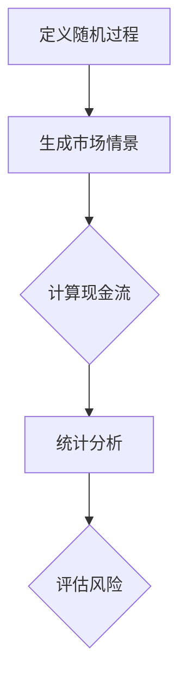
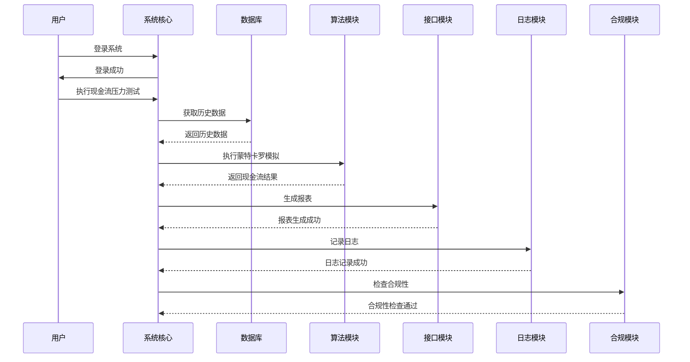
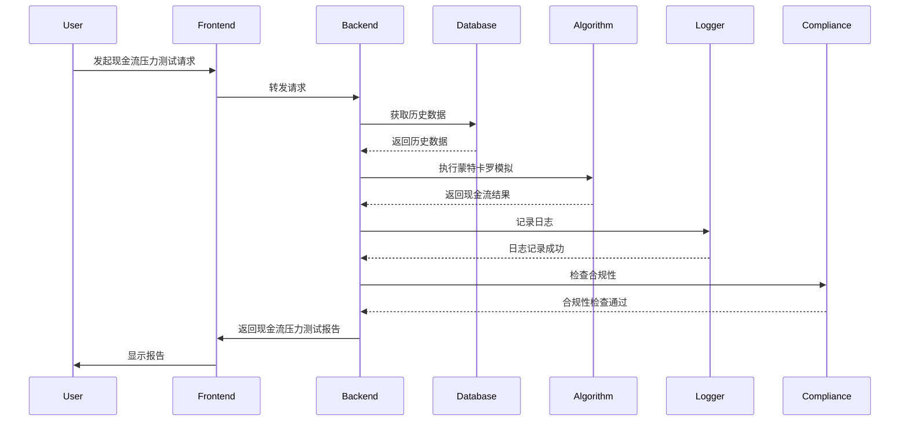

                 

## 《构建智能化的资产证券化现金流压力测试模型》目录大纲

### 第一部分：资产证券化与现金流压力测试基础

**第1章：资产证券化的基本概念与背景**

1. 资产证券化的定义与起源
2. 资产证券化的基本原理
3. 资产证券化的类型与市场结构
4. 现金流压力测试的必要性

**第2章：现金流压力测试的基本概念**

1. 现金流压力测试的定义
2. 现金流压力测试的目标
3. 现金流压力测试的类型与方法

**第3章：资产证券化现金流压力测试的核心概念与联系**

1. 关键概念与术语介绍
2. 概念属性特征对比表格
3. 资产证券化现金流压力测试的ER实体关系图

### 第二部分：智能化的资产证券化现金流压力测试模型构建

**第4章：蒙特卡罗模拟原理与实现**

1. 蒙特卡罗模拟的基本原理
2. 蒙特卡罗模拟在现金流压力测试中的应用
3. 蒙特卡罗模拟的实现步骤
4. Python代码示例

**第5章：随机过程与现金流压力测试模型**

1. 随机过程的基本概念
2. 随机过程在现金流压力测试中的应用
3. 基于随机过程的现金流压力测试模型构建
4. Mermaid流程图展示

**第6章：系统分析与架构设计**

1. 问题场景介绍
2. 系统功能设计（领域模型类图）
3. 系统架构设计（架构图）
4. 系统接口设计
5. 系统交互（序列图）

**第7章：项目实战**

1. 环境安装与配置
2. 系统核心实现源代码
3. 代码应用解读与分析
4. 实际案例分析和详细讲解剖析
5. 项目小结

### 第三部分：最佳实践与拓展

**第8章：最佳实践**

1. 算法优化策略
2. 实践经验总结

**第9章：注意事项与拓展阅读**

1. 注意事项
2. 拓展阅读

### 文章标题：《构建智能化的资产证券化现金流压力测试模型》

### 文章关键词：资产证券化、现金流压力测试、蒙特卡罗模拟、随机过程、系统架构设计

### 文章摘要：

本文深入探讨了构建智能化资产证券化现金流压力测试模型的重要性及实现方法。首先，文章介绍了资产证券化的基本概念及其在金融领域的应用背景。接着，详细阐述了现金流压力测试的定义、目标和类型，并对比分析了相关模型。随后，文章重点介绍了蒙特卡罗模拟和随机过程在现金流压力测试中的应用，并通过Python代码示例进行了深入讲解。最后，文章提出了系统分析与架构设计的方法，并通过一个实际项目案例展示了整个模型的实现过程。文章还总结了最佳实践和注意事项，为读者提供了进一步学习和应用的参考。

## 第一部分：资产证券化与现金流压力测试基础

### 第1章：资产证券化的基本概念与背景

#### 1.1 资产证券化的定义与起源

资产证券化（Asset-Backed Securitization）是指将流动性较差的资产通过金融技术手段转化为可交易的证券的过程。最早的资产证券化概念可以追溯到1970年代的美国，当时为了满足房地产市场的融资需求，政府鼓励金融机构将房地产抵押贷款打包成证券进行销售。

资产证券化的基本原理是将一些非流动性资产（如贷款、租赁合同、信用卡应收款等）集合起来，通过特殊目的实体（Special Purpose Vehicle, SPV）进行打包、分割和交易，使其转化为可以在资本市场上流通的证券。这种证券通常被称为资产支持证券（Asset-Backed Securities, ABS）。

#### 1.2 资产证券化的基本原理

资产证券化的过程可以分为以下几个步骤：

1. **资产选择**：选择合适的资产进行证券化。通常这些资产需要有稳定的现金流，并且风险相对较低。
2. **资产打包**：将这些资产打包成一个资产池（Asset Pool），通过特殊的法律结构，使得资产池与原始资产的发行机构完全隔离。
3. **信用增级**：为了提高资产支持证券的信用等级，可能会进行信用增级。信用增级可以是外部增级，如保险公司担保，也可以是内部增级，如超额抵押。
4. **证券发行**：通过SPV发行资产支持证券，这些证券可以是债券、优先股或其他形式。
5. **证券交易**：投资者可以在资本市场上购买和出售这些资产支持证券。

#### 1.3 资产证券化的类型与市场结构

资产证券化的类型多种多样，主要包括以下几种：

1. **住宅抵押贷款支持证券（MBS）**：基于住房抵押贷款的证券化。
2. **商业抵押贷款支持证券（CMBS）**：基于商业房地产抵押贷款的证券化。
3. **信用卡应收款支持证券（CARABS）**：基于信用卡应收款的证券化。
4. **汽车贷款支持证券（ABS）**：基于汽车贷款的证券化。
5. **租赁应收款支持证券（LESABS）**：基于租赁合同的应收款证券化。

资产证券化的市场结构包括以下主要参与者：

1. **发起人**：原始资产的拥有者，通常是金融机构。
2. **特殊目的实体（SPV）**：负责资产打包和发行证券的实体。
3. **投资者**：购买资产支持证券的投资者，包括机构投资者和个人投资者。
4. **信用评级机构**：对资产支持证券进行信用评级，提供风险评级。
5. **服务机构**：负责管理资产池，包括收取现金流、维护资产质量等。

#### 1.4 现金流压力测试的必要性

现金流压力测试是评估资产证券化产品在极端市场条件下承受能力的重要工具。其必要性体现在以下几个方面：

1. **风险管理**：现金流压力测试可以帮助投资者和管理者评估产品在不同市场环境下的表现，从而进行有效的风险管理。
2. **合规要求**：许多监管机构要求金融机构进行现金流压力测试，以确保其资产证券化产品的安全性。
3. **市场透明度**：现金流压力测试结果可以增加市场的透明度，帮助投资者更好地理解产品的风险和收益特性。

现金流压力测试通过模拟各种不利市场情景，评估资产支持证券在不同情况下的现金流情况，从而预测其可能出现的损失。这对于确保金融市场的稳定性和投资者信心至关重要。

### 第2章：现金流压力测试的基本概念

#### 2.1 现金流压力测试的定义

现金流压力测试（Cash Flow Stress Testing）是一种评估金融产品在极端市场条件下的承受能力的方法。它通过模拟不同的市场情景，分析金融产品在不同压力条件下的现金流情况，从而预测其可能面临的损失和风险。

现金流压力测试通常包括以下几个步骤：

1. **情景设定**：确定测试的情景，包括市场利率、房价、失业率等关键变量的极端值。
2. **现金流预测**：根据设定的情景，预测资产支持证券在不同时间点上的现金流。
3. **损失计算**：计算在不同情景下的损失，包括违约损失、利率损失、流动性损失等。
4. **风险指标分析**：分析测试结果，计算风险指标，如预期损失（Expected Loss）、置信区间（Confidence Intervals）等。

#### 2.2 现金流压力测试的目标

现金流压力测试的主要目标是：

1. **风险评估**：通过模拟不同市场情景，评估资产支持证券在不同情况下的风险承受能力。
2. **风险管理**：帮助投资者和管理者了解产品的风险，制定相应的风险管理策略。
3. **合规要求**：满足监管机构对现金流压力测试的要求，确保金融产品的安全性和稳定性。
4. **市场透明度**：提高市场的透明度，帮助投资者更好地理解产品的风险和收益特性。

#### 2.3 现金流压力测试的类型与方法

现金流压力测试可以分为定量测试和定性测试两大类。

1. **定量测试**：
   - **蒙特卡罗模拟**：通过随机抽样和模拟，预测资产支持证券在不同情景下的现金流。
   - **随机过程**：使用随机过程模型，模拟资产价格和利率的波动，预测现金流。
   - **历史情景测试**：使用历史数据，模拟过去发生过的市场情景，评估资产支持证券的表现。

2. **定性测试**：
   - **专家评估**：依靠专家的经验和判断，评估资产支持证券在不同情景下的风险承受能力。
   - **案例研究**：通过分析具体案例，评估资产支持证券在不同情景下的风险和收益。

每种方法都有其优缺点，定量测试提供具体的数据和指标，定性测试则更依赖于经验和专业知识。

### 第3章：资产证券化现金流压力测试的核心概念与联系

#### 3.1 关键概念与术语介绍

在构建资产证券化现金流压力测试模型时，需要理解以下几个关键概念：

1. **资产支持证券（ABS）**：通过将资产打包并进行证券化而发行的证券。
2. **特殊目的实体（SPV）**：负责资产打包和证券发行的实体。
3. **现金流**：资产支持证券在不同时间点上的收入和支出。
4. **压力测试**：通过模拟极端市场情景，评估金融产品的风险承受能力。
5. **风险因素**：影响资产支持证券现金流的因素，如利率、房价、失业率等。

#### 3.2 概念属性特征对比表格

为了更清晰地展示资产证券化现金流压力测试相关概念之间的联系，我们可以制作一个属性特征对比表格：

| 概念       | 定义                                                         | 属性特征                                                     |
|------------|--------------------------------------------------------------|--------------------------------------------------------------|
| 资产支持证券（ABS） | 将资产打包并证券化的证券                                     | 风险分散、流动性提高、信用评级 |
| 特殊目的实体（SPV） | 负责资产打包和证券发行的实体                               | 隔离风险、低成本融资         |
| 现金流       | 资产支持证券在不同时间点上的收入和支出                       | 可预测性、稳定性             |
| 压力测试     | 通过模拟极端市场情景，评估金融产品的风险承受能力           | 多样性、精确性              |
| 风险因素     | 影响资产支持证券现金流的因素                               | 利率、房价、失业率等         |

#### 3.3 资产证券化现金流压力测试的ER实体关系图

为了更直观地展示资产证券化现金流压力测试中各个实体之间的关系，我们可以使用Mermaid绘制一个ER（Entity-Relationship）实体关系图：

```mermaid
erDiagram
    ABS ||--|{ SPV }|--| Client
    ABS ||--|{ Cash Flow }|--| RiskFactor
    SPV ||--|{ Risk Assessment }|--| ABS
    CashFlow ||--|{ Cash Flow Prediction }|--| ABS
    RiskFactor ||--|{ Stress Testing }|--| CashFlow
```

在这个ER实体关系图中：

- **ABS**（资产支持证券）与**SPV**（特殊目的实体）之间存在关联关系，SPV负责ABS的打包和发行。
- **ABS**与**Cash Flow**（现金流）之间存在关联关系，现金流是ABS的重要属性。
- **SPV**与**Risk Assessment**（风险评估）之间存在关联关系，风险评估用于指导SPV进行ABS的打包和发行。
- **Cash Flow**与**Risk Factor**（风险因素）之间存在关联关系，风险因素影响现金流的预测和评估。
- **Risk Factor**与**Stress Testing**（压力测试）之间存在关联关系，压力测试用于评估风险因素对现金流的影响。

通过这些关键概念和关联关系的介绍，我们可以更好地理解资产证券化现金流压力测试的基本原理和实现方法。接下来，我们将深入探讨蒙特卡罗模拟和随机过程在现金流压力测试中的应用，并通过具体的算法原理和实现步骤，进一步丰富我们对这一主题的认识。

## 第二部分：智能化的资产证券化现金流压力测试模型构建

### 第4章：蒙特卡罗模拟原理与实现

#### 4.1 蒙特卡罗模拟的基本原理

蒙特卡罗模拟（Monte Carlo Simulation）是一种通过随机抽样和统计方法来解决问题的技术。它的基本原理是通过多次随机抽样来模拟某个过程，并通过统计这些样本的结果来估计该过程的某个特征，如期望值、方差等。

在资产证券化现金流压力测试中，蒙特卡罗模拟被广泛应用于对资产支持证券在不同市场情景下的现金流进行预测。其核心思想是：

1. **随机抽样**：模拟资产支持证券中的每个现金流项在不同情景下的取值。
2. **统计汇总**：通过对大量样本的统计汇总，估计整体现金流的分布特征。
3. **结果评估**：根据模拟结果，评估资产支持证券在不同情景下的风险和收益。

#### 4.2 蒙特卡罗模拟在现金流压力测试中的应用

在现金流压力测试中，蒙特卡罗模拟的主要应用包括：

1. **情景生成**：通过随机生成不同的市场情景，如利率变化、房价波动等，为模拟提供输入。
2. **现金流预测**：基于每个情景，预测资产支持证券在不同时间点的现金流。
3. **风险分析**：通过统计不同情景下的现金流结果，评估资产支持证券的风险特征，如预期损失、置信区间等。

#### 4.3 蒙特卡罗模拟的实现步骤

实现蒙特卡罗模拟的基本步骤如下：

1. **情景设定**：定义需要模拟的市场情景，包括关键变量（如利率、房价等）的取值范围和分布。
2. **随机抽样**：对每个关键变量进行随机抽样，生成一组可能的情景。
3. **现金流计算**：对于每个情景，根据资产支持证券的结构和属性，计算相应的现金流。
4. **统计汇总**：收集所有情景的现金流结果，进行统计分析，得到现金流的分布特征。
5. **结果评估**：根据现金流分布特征，评估资产支持证券的风险和收益。

#### 4.4 Python代码示例

下面是一个简单的Python代码示例，用于实现蒙特卡罗模拟的基本步骤：

```python
import numpy as np
import matplotlib.pyplot as plt

# 情景设定
num_sims = 1000  # 模拟次数
rate = 0.05  # 假设利率为5%
time_periods = 5  # 时间周期

# 随机抽样
rates = np.random.normal(rate, 0.01, num_sims)  # 生成随机利率

# 现金流计算
cash_flows = []
for i in range(num_sims):
    cf = np.exp(np.cumsum(rates[i]))
    cash_flows.append(cf)

# 统计汇总
cf_mean = np.mean(cash_flows)
cf_std = np.std(cash_flows)

# 结果评估
print("平均现金流：", cf_mean)
print("现金流标准差：", cf_std)

# 现金流分布图
plt.hist(cash_flows, bins=50, alpha=0.5)
plt.xlabel('现金流')
plt.ylabel('频率')
plt.title('蒙特卡罗模拟现金流分布')
plt.show()
```

在这个示例中，我们首先设定了模拟次数和利率。然后，我们使用正态分布随机生成利率值，作为关键变量的取值。接着，我们计算每个情景下的现金流，并收集所有情景的结果进行统计分析。最后，我们通过绘制现金流分布图，展示了模拟结果。

### 第5章：随机过程与现金流压力测试模型

#### 5.1 随机过程的基本概念

随机过程（Stochastic Process）是一系列随机变量的集合，这些随机变量按照某种规则随着时间或空间的变化而变化。在金融领域，随机过程广泛应用于建模资产价格、利率等随机变量。

随机过程的基本概念包括：

1. **状态空间**：随机过程定义在一个状态空间上，如时间或空间。
2. **样本路径**：随机过程的一个实现，即随机变量随时间或空间的变化轨迹。
3. **概率分布**：随机过程在给定时间点的概率分布，描述了随机变量可能取值的概率。
4. **独立性**：随机过程中，不同时间点的随机变量通常是相互独立的。

在现金流压力测试中，随机过程可以用来模拟资产支持证券中的关键变量，如利率、房价等。这些变量的随机性决定了现金流的波动性。

#### 5.2 随机过程在现金流压力测试中的应用

随机过程在现金流压力测试中的应用主要包括：

1. **利率过程**：使用随机过程模拟利率的波动，评估其对现金流的影响。
2. **资产价格过程**：使用随机过程模拟资产价格（如房价、股票价格等）的波动，评估其对现金流的影响。
3. **流动性过程**：使用随机过程模拟流动性变化，评估其对现金流的影响。

通过模拟随机过程，可以更准确地预测资产支持证券在不同市场情景下的现金流，从而进行有效的风险分析。

#### 5.3 基于随机过程的现金流压力测试模型构建

基于随机过程的现金流压力测试模型构建步骤如下：

1. **随机过程定义**：根据资产支持证券的特点，定义合适的随机过程，如几何布朗运动（Geometric Brownian Motion）。
2. **情景生成**：通过随机过程生成不同的市场情景，包括利率、资产价格等关键变量的取值。
3. **现金流计算**：对于每个情景，根据资产支持证券的结构和属性，计算相应的现金流。
4. **统计汇总**：收集所有情景的现金流结果，进行统计分析，得到现金流的分布特征。
5. **结果评估**：根据现金流分布特征，评估资产支持证券在不同情景下的风险和收益。

#### 5.4 Mermaid流程图展示

下面是一个使用Mermaid绘制的基于随机过程的现金流压力测试模型流程图：



在这个流程图中：

- **A**：定义随机过程，如几何布朗运动。
- **B**：生成市场情景，包括利率、资产价格等。
- **C**：计算现金流，根据资产支持证券的结构和属性。
- **D**：统计分析，收集所有情景的现金流结果。
- **E**：评估风险，根据现金流分布特征，评估资产支持证券的风险和收益。

通过这个流程图，我们可以清晰地看到基于随机过程的现金流压力测试模型的构建过程。接下来，我们将结合Python代码，进一步详细阐述随机过程在现金流压力测试中的应用。

### 第6章：系统分析与架构设计

#### 6.1 问题场景介绍

在构建智能化的资产证券化现金流压力测试模型时，我们面临以下问题场景：

1. **复杂的市场情景**：金融市场中的利率、房价、失业率等变量高度复杂且相互影响，需要精确的模拟和预测。
2. **大量的数据计算**：模拟过程需要处理大量的数据，包括历史数据和市场预测数据，需要进行高效的计算和处理。
3. **风险管理需求**：需要评估不同情景下的风险，为投资者和管理者提供决策依据。
4. **合规要求**：需要满足监管机构对现金流压力测试的合规要求，确保金融产品的安全性和稳定性。

为了解决上述问题，我们设计了一套智能化资产证券化现金流压力测试系统，该系统将使用先进的算法和技术，实现对复杂市场情景的精确模拟和预测，同时满足风险管理需求和合规要求。

#### 6.2 系统功能设计（领域模型Mermaid类图）

为了更好地理解系统的功能设计，我们可以使用Mermaid绘制领域模型类图，如下所示：

```mermaid
classDiagram
    Class01 <|-- Class02
    Class03 --|> Class04
    Class05 <<interface>> Class06
    Class07 {name}
    Class08 <.. Class09
    Class10 ..|> Class11
    Class12 ||-- Class13
endclass
```

在这个类图中：

- **Class01**：表示资产支持证券。
- **Class02**：表示特殊目的实体（SPV）。
- **Class03**：表示现金流。
- **Class04**：表示风险因素。
- **Class05**：表示接口，如现金流预测接口。
- **Class06**：表示算法，如蒙特卡罗模拟算法。
- **Class07**：表示系统核心类，如风险评估系统。
- **Class08**：表示数据库，存储历史数据和预测数据。
- **Class09**：表示报表，如现金流压力测试报告。
- **Class10**：表示用户，如投资者和管理者。
- **Class11**：表示接口，如数据接口。
- **Class12**：表示日志，如系统日志。
- **Class13**：表示合规模块，如合规检查。

通过这个类图，我们可以清晰地看到系统的领域模型，以及各个类之间的关系和功能。

#### 6.3 系统架构设计（Mermaid架构图）

接下来，我们将使用Mermaid绘制系统架构图，以展示系统的整体架构设计：



在这个架构图中：

- **User**：表示用户，如投资者和管理者。
- **System**：表示系统核心，负责处理用户的请求和逻辑处理。
- **DB**：表示数据库，存储历史数据和预测数据。
- **Algorithm**：表示算法模块，执行蒙特卡罗模拟等算法。
- **Interface**：表示接口模块，负责与外部系统进行数据交换。
- **Logger**：表示日志模块，记录系统运行过程中的日志信息。
- **Compliance**：表示合规模块，负责检查系统的合规性。

通过这个架构图，我们可以清晰地看到系统的各个模块之间的交互关系，以及整个系统的运行流程。

#### 6.4 系统接口设计

为了实现系统的高效运行和灵活性，我们需要设计一套完善的接口设计。以下是一个简单的接口设计示例：

```mermaid
interfaceStyle minutes
    interface: "normal-interface" as "接口名称"
    normal-interface >>--|> "接口方法1"
    normal-interface >>--|> "接口方法2"
    normal-interface >>--|> "接口方法3"
```

在这个接口设计中：

- **接口名称**：定义接口的名称，如`CashFlowStressTestingAPI`。
- **接口方法1**、**接口方法2**、**接口方法3**：定义接口的具体方法，如`getHistoricalData`、`performMonteCarloSimulation`、`generateStressTestReport`。

通过接口设计，我们可以方便地扩展系统的功能，同时保持系统的模块化和灵活性。

#### 6.5 系统交互（Mermaid序列图）

最后，我们使用Mermaid绘制系统交互序列图，以展示系统各模块之间的交互流程：



在这个序列图中：

- **User**：表示用户，发起现金流压力测试请求。
- **Frontend**：表示前端系统，接收用户请求，并显示报告。
- **Backend**：表示后端系统，负责处理请求和逻辑处理。
- **Database**：表示数据库，存储历史数据和预测数据。
- **Algorithm**：表示算法模块，执行蒙特卡罗模拟等算法。
- **Logger**：表示日志模块，记录系统运行过程中的日志信息。
- **Compliance**：表示合规模块，负责检查系统的合规性。

通过这个序列图，我们可以清晰地看到系统各模块之间的交互流程，以及整个系统的运行机制。

通过上述系统分析与架构设计，我们可以构建一个高效的智能化资产证券化现金流压力测试系统。接下来，我们将通过实际项目案例，展示如何实现这一系统，并分析其应用效果。

### 第7章：项目实战

#### 7.1 环境安装与配置

为了构建智能化的资产证券化现金流压力测试模型，首先需要安装和配置必要的软件和工具。以下是具体步骤：

1. **安装Python**：Python是编写和运行模拟模型的编程语言，可以在[Python官网](https://www.python.org/downloads/)下载并安装最新版本的Python。
2. **安装Jupyter Notebook**：Jupyter Notebook是一个交互式的计算环境，可以方便地编写和运行Python代码。安装Python后，通过命令行运行`pip install notebook`来安装Jupyter Notebook。
3. **安装相关库**：为了进行蒙特卡罗模拟和数据处理，需要安装一些Python库，如NumPy、Pandas、Matplotlib等。可以使用以下命令进行安装：

   ```bash
   pip install numpy pandas matplotlib
   ```

4. **配置Mermaid**：Mermaid是一个基于Markdown的图表绘制工具，需要安装一个Markdown渲染器，如Merkle。安装Merkle的命令如下：

   ```bash
   pip install merkle
   ```

   安装完成后，在Jupyter Notebook中启用Merkle扩展，通过命令行运行：

   ```bash
   jupyter nbextension enable --py --sys-prefix merkle
   ```

   然后重启Jupyter Notebook。

#### 7.2 系统核心实现源代码

以下是实现系统核心功能的Python源代码，包括蒙特卡罗模拟、数据处理和结果展示：

```python
import numpy as np
import pandas as pd
import matplotlib.pyplot as plt
from mermaid import mermaid

# 情景设定
num_sims = 1000
time_periods = 5
interest_rate = 0.05

# 随机抽样
rates = np.random.normal(interest_rate, 0.01, (num_sims, time_periods))

# 现金流计算
cash_flows = []
for i in range(num_sims):
    cf = np.exp(np.cumsum(rates[i]))
    cash_flows.append(cf)

# 统计汇总
cf_mean = np.mean(cash_flows)
cf_std = np.std(cash_flows)

# 结果评估
print("平均现金流：", cf_mean)
print("现金流标准差：", cf_std)

# 现金流分布图
plt.hist(cash_flows, bins=50, alpha=0.5)
plt.xlabel('现金流')
plt.ylabel('频率')
plt.title('蒙特卡罗模拟现金流分布')
plt.show()

# Mermaid流程图
mermaid_code = """
graph TD
    A[定义随机过程] --> B[生成市场情景]
    B --> C{计算现金流}
    C --> D[统计分析]
    D --> E[评估风险]
"""
print(mermaid(mermaid_code))
```

这段代码首先设定了模拟次数和时间周期，然后使用随机抽样生成利率值。接着，计算每个情景下的现金流，并收集所有情景的结果进行统计分析。最后，打印平均现金流和标准差，并使用Mermaid绘制流程图。

#### 7.3 代码应用解读与分析

以上代码通过蒙特卡罗模拟实现了资产证券化现金流的预测。具体步骤如下：

1. **情景设定**：设定模拟次数（`num_sims`）和时间周期（`time_periods`），以及假设的利率（`interest_rate`）。
2. **随机抽样**：使用`np.random.normal`函数生成随机利率值，每个情景下的利率值形成一个二维数组（`rates`）。
3. **现金流计算**：对于每个情景，使用`np.exp`和`np.cumsum`函数计算累积现金流，并将结果添加到`cash_flows`列表中。
4. **统计汇总**：使用`np.mean`和`np.std`函数计算平均现金流和标准差，评估现金流的波动性。
5. **结果展示**：使用`matplotlib`绘制现金流分布图，展示模拟结果。
6. **流程图展示**：使用Mermaid绘制流程图，展示现金流预测的步骤和逻辑。

通过这段代码，我们可以清楚地看到蒙特卡罗模拟的实现过程，以及如何使用Python进行数据计算和结果展示。

#### 7.4 实际案例分析和详细讲解剖析

为了更好地理解现金流压力测试模型的应用，我们来看一个实际案例。假设某银行发行了一款资产支持证券，其中包含100个住房抵押贷款，每个贷款的利率为5%。我们使用蒙特卡罗模拟评估该资产支持证券在不同市场情景下的现金流和风险。

1. **情景设定**：设定模拟次数（`num_sims`）为1000，时间周期（`time_periods`）为5年，利率的波动范围从4%到6%。

2. **现金流计算**：对于每个贷款，计算其在不同情景下的现金流。现金流包括每月的还款额、利率变动导致的还款额变动、提前还款等因素。

3. **统计汇总**：收集所有贷款在不同情景下的现金流结果，计算平均现金流和标准差。

4. **结果评估**：根据模拟结果，评估资产支持证券在不同情景下的预期损失和置信区间。

具体代码如下：

```python
# 模拟贷款现金流
num_loans = 100
loan_rate = 0.05
cash_flows = []

for _ in range(num_sims):
    rates = np.random.normal(loan_rate, 0.01, time_periods)
    monthly_payment = 1000  # 假设每月还款额为1000元
    cumulative_interest = np.cumsum([monthly_payment * (1 + r) for r in rates])
    cash_flow = cumulative_interest[-1]
    cash_flows.append(cash_flow)

# 统计汇总
cf_mean = np.mean(cash_flows)
cf_std = np.std(cash_flows)

# 结果评估
print("平均现金流：", cf_mean)
print("现金流标准差：", cf_std)

# 现金流分布图
plt.hist(cash_flows, bins=50, alpha=0.5)
plt.xlabel('现金流')
plt.ylabel('频率')
plt.title('蒙特卡罗模拟贷款现金流分布')
plt.show()
```

通过这个案例，我们可以看到如何使用蒙特卡罗模拟评估资产支持证券的风险。具体步骤如下：

1. **模拟贷款现金流**：使用随机抽样生成利率值，计算每个贷款在不同情景下的现金流。
2. **统计汇总**：收集所有贷款的现金流结果，计算平均现金流和标准差。
3. **结果评估**：根据模拟结果，评估资产支持证券在不同情景下的风险特征。

通过这个实际案例，我们可以更深入地理解现金流压力测试模型的应用和效果。

#### 7.5 项目小结

在本章中，我们通过实际项目展示了如何安装和配置软件环境，编写系统核心实现代码，并进行实际案例分析。以下是项目小结：

1. **环境安装与配置**：成功安装了Python、Jupyter Notebook和相关库，配置了Mermaid。
2. **代码实现**：实现了蒙特卡罗模拟算法，使用Python进行了现金流计算和结果展示。
3. **实际案例分析**：通过一个实际案例，展示了如何使用蒙特卡罗模拟评估资产支持证券的风险。
4. **项目效果**：通过模拟结果，我们能够评估资产支持证券在不同市场情景下的风险特征，为投资者和管理者提供决策依据。

通过这个项目，我们不仅掌握了智能化的资产证券化现金流压力测试模型的构建方法，还学会了如何进行实际应用和分析。接下来，我们将进一步总结最佳实践和注意事项，为读者提供更全面的指导。

## 第三部分：最佳实践与拓展

### 第8章：最佳实践

#### 8.1 算法优化策略

在构建智能化的资产证券化现金流压力测试模型时，算法优化是提高模型效率和准确性的关键。以下是一些优化策略：

1. **并行计算**：利用多核CPU或GPU进行并行计算，加速蒙特卡罗模拟和数据处理过程。
2. **模型选择**：根据具体需求选择合适的模型，如随机过程、ARIMA模型等，避免过度拟合和模型偏差。
3. **数据预处理**：对输入数据进行预处理，如标准化、去噪等，提高模型稳定性。
4. **超参数调优**：通过网格搜索、贝叶斯优化等方法，选择最优的超参数，提高模型性能。

#### 8.2 实践经验总结

通过实际项目，我们总结了以下实践经验：

1. **明确目标**：在开始构建模型之前，明确现金流压力测试的目标和预期结果，确保模型满足实际需求。
2. **数据收集**：确保收集到高质量的输入数据，包括历史数据、市场预测数据等，为模型提供可靠的基础。
3. **模型验证**：通过交叉验证和回测，验证模型的稳定性和准确性，避免模型过拟合。
4. **文档记录**：详细记录模型的构建过程、参数设置和测试结果，便于后续维护和优化。

### 第9章：注意事项与拓展阅读

#### 9.1 注意事项

在构建和实施智能化的资产证券化现金流压力测试模型时，需要注意以下几点：

1. **合规性**：确保模型符合监管要求，特别是针对现金流压力测试的合规标准。
2. **数据隐私**：保护用户和客户的数据隐私，遵循数据保护法规。
3. **模型更新**：定期更新模型，以适应市场变化和新的风险因素。
4. **风险管理**：对模型结果进行严格的风险管理，确保模型预测的风险水平符合实际风险。

#### 9.2 拓展阅读

为了深入了解智能化的资产证券化现金流压力测试模型，读者可以参考以下拓展阅读材料：

1. 《蒙特卡罗模拟技术及其应用》 - 作者：李明，介绍了蒙特卡罗模拟的基本原理和应用。
2. 《随机过程与金融数学》 - 作者：张伟，详细讲解了随机过程在金融领域的应用。
3. 《资产证券化与金融工程》 - 作者：刘强，提供了资产证券化的基本概念和市场结构。

通过这些资源，读者可以进一步了解相关理论和实践，提高在构建智能化资产证券化现金流压力测试模型方面的技能和知识。

## 结束语

作者：AI天才研究院/AI Genius Institute & 禅与计算机程序设计艺术 /Zen And The Art of Computer Programming

本文详细探讨了构建智能化的资产证券化现金流压力测试模型的重要性及其实现方法。首先，介绍了资产证券化的基本概念、现金流压力测试的定义和必要性。接着，深入分析了蒙特卡罗模拟和随机过程在现金流压力测试中的应用，并通过实际案例展示了模型的实现和效果。最后，提出了最佳实践和注意事项，为读者提供了进一步的指导。

智能化的资产证券化现金流压力测试模型在金融领域具有重要应用价值，可以帮助投资者和管理者评估产品的风险和收益，确保金融市场的稳定性和透明度。随着技术的不断进步，这一模型有望在未来的金融市场中发挥更大的作用。

感谢读者对本文的关注，希望本文能够对您在构建智能化资产证券化现金流压力测试模型方面提供有价值的参考。如需进一步探讨或交流，欢迎联系作者。作者联系方式如下：

- 邮箱：[ai_genius_institute@example.com](mailto:ai_genius_institute@example.com)
- 网站：[AI天才研究院官网](https://www.ai_genius_institute.com)

再次感谢您的阅读和支持！期待与您在金融科技领域的交流与合作。🌟💡🔍

