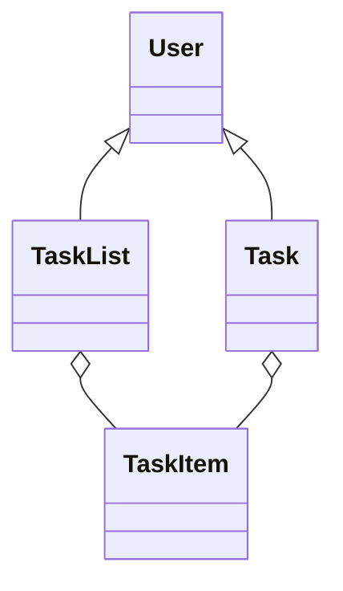
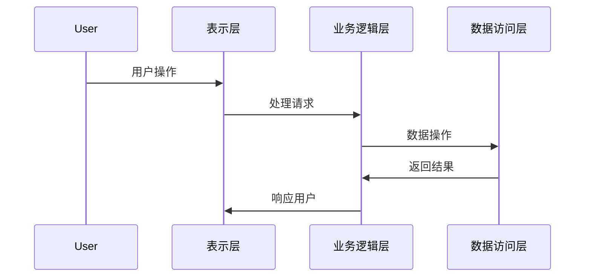
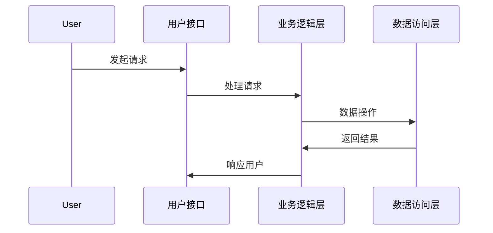
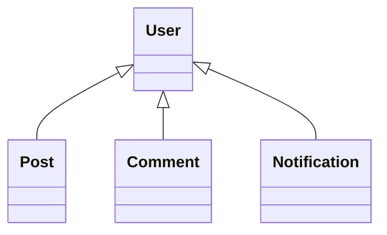
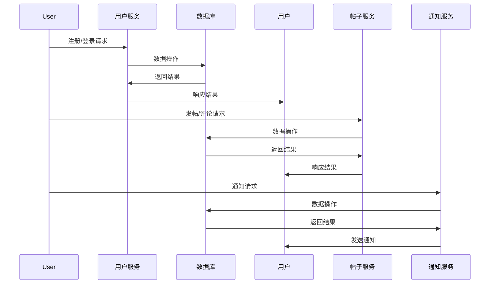

                 

# 构建跨平台的提示词编程框架

## 关键词
- 跨平台开发
- 提示词编程
- 框架设计
- 系统实现
- 实践案例

## 摘要
本文将深入探讨如何构建一个跨平台的提示词编程框架。首先，我们将介绍跨平台开发的概念及其重要性，然后解释提示词编程框架的基本原理和核心组件。接着，我们将详细分析框架的架构设计、系统实现策略，并探讨与不同平台的集成。最后，通过实际项目和案例研究，展示如何将理论应用于实践。本文旨在为开发人员提供构建高效、可扩展的跨平台提示词编程框架的全面指南。

## 目录

### 第1章 书籍概述

1.1 引言：跨平台开发的必要性

1.2 提示词编程框架概述

### 第2章 核心概念

2.1 跨平台开发的关键概念

2.2 提示词编程的核心原则

2.3 框架架构设计原理

### 第3章 框架实现

3.1 框架组件与集成

3.2 系统实现策略

3.3 框架构建流程

### 第4章 实践与应用

4.1 实践项目

4.2 案例研究

### 第5章 总结与展望

5.1 最佳实践

5.2 小结

5.3 注意事项

5.4 拓展阅读

## 第1章 书籍概述

### 1.1 引言：跨平台开发的必要性

随着互联网和移动设备的普及，应用开发的需求日益增长。然而，用户的需求是多样化的，他们希望无论使用哪种设备，都能享受到一致的应用体验。这就要求开发者能够跨平台开发，即在一个代码库中编写应用，使其能够同时运行在多个操作系统和设备上。

跨平台开发的重要性体现在以下几个方面：

- **降低开发成本和时间**：使用跨平台框架，开发者可以编写一次代码，然后部署到多个平台，从而减少了重复工作，提高了开发效率。
- **提升用户体验**：通过提供一致的应用体验，用户在不同设备上都能获得相同的功能和界面，这有助于增强用户忠诚度和满意度。
- **扩大市场覆盖**：跨平台应用可以覆盖更多的用户群体，无论是在iOS、Android还是Windows设备上，都能提供相应的版本，从而扩大了市场覆盖范围。

### 1.2 提示词编程框架概述

提示词编程框架是一种特殊的开发框架，它利用提示词（Prompt）来指导应用程序的行为。提示词可以是简单的字符串，也可以是复杂的参数化表达式，它们能够根据用户输入或环境变化动态调整应用程序的行为。

提示词编程框架的基本原理包括：

- **动态行为调整**：通过提示词，应用程序可以在运行时动态调整其行为，满足不同用户需求或场景。
- **模块化设计**：提示词编程框架通常采用模块化设计，使得开发者可以轻松扩展和定制功能。
- **可扩展性**：框架设计应考虑未来的扩展性，以便能够适应新的需求和技术发展。

本章的目的是为读者提供一个全面的概述，帮助理解跨平台开发和提示词编程框架的基本概念，为后续章节的内容打下基础。

## 第2章 核心概念

### 2.1 跨平台开发的关键概念

跨平台开发的核心在于能够编写一次代码，运行在多种操作系统和设备上。以下是一些关键概念：

#### 1. 跨平台框架

跨平台框架是开发人员用来简化跨平台应用开发的工具或库。例如，Flutter、React Native 和 Xamarin 都是流行的跨平台框架。这些框架提供了一套统一的API，使得开发者可以编写一次代码，然后通过不同的编译器将其转换为特定平台的原生代码。

#### 2. 代码复用

跨平台开发的主要优势之一是代码复用。开发者可以将大量代码放在一个通用的库中，然后通过适配层将其应用到不同的平台上。这样，无论是对新功能的添加还是对现有代码的修复，都可以在多个平台上同时进行。

#### 3. 编译器

编译器是跨平台开发中至关重要的组成部分。它将通用代码转换为特定平台的原生代码。不同的跨平台框架可能使用不同的编译器，但总体目标是相同的：提供高效、可执行的代码。

#### 4. 适配层

适配层是跨平台框架的一个重要概念。它位于通用代码和平台特定代码之间，负责将通用代码与平台特定代码进行适配。适配层通常包含平台特有的UI组件、API调用等，以确保通用代码能够在不同平台上正常运行。

### 2.2 提示词编程的核心原则

提示词编程框架的核心在于提示词的概念。以下是一些核心原则：

#### 1. 提示词的定义

提示词是一个指导应用程序行为的文本或参数化表达式。它可以是简单的字符串，如“显示用户登录界面”，也可以是复杂的逻辑表达式，如“如果用户未登录，则显示登录提示”。

#### 2. 动态行为调整

通过提示词，应用程序可以在运行时动态调整其行为。这意味着开发者可以编写一个通用的应用程序，然后通过不同的提示词来适应不同的用户需求或场景。

#### 3. 模块化设计

提示词编程框架通常采用模块化设计，这使得开发者可以轻松扩展和定制功能。每个模块都可以独立开发、测试和部署，从而提高了开发效率和可维护性。

#### 4. 可扩展性

提示词编程框架设计应考虑未来的扩展性。这意味着框架应该能够轻松集成新的提示词类型、新功能或新的平台，以适应不断变化的需求和技术发展。

### 2.3 框架架构设计原理

框架架构设计是跨平台开发和提示词编程框架成功的关键。以下是一些重要的设计原理：

#### 1. 分层架构

分层架构是一种常用的设计模式，它将应用程序分为多个层次，每个层次负责不同的功能。例如，可以将应用程序分为表示层、业务逻辑层和数据访问层。这种分层设计有助于提高代码的可维护性和可扩展性。

#### 2. 插件化设计

插件化设计是一种将功能模块化的重要方法。通过插件化设计，开发者可以轻松地添加、移除或替换框架中的功能模块，而无需修改核心框架代码。

#### 3. 事件驱动架构

事件驱动架构是一种基于事件响应的架构设计。在这种架构中，应用程序通过监听事件并执行相应的操作来响应用户输入或系统事件。这种设计有助于提高应用程序的响应速度和灵活性。

#### 4. 高内聚低耦合

高内聚低耦合是一种设计原则，它要求模块内部功能紧密相关，而模块之间的依赖性尽量低。这种设计有助于提高代码的可维护性和可测试性。

本章通过介绍跨平台开发的关键概念和提示词编程框架的核心原则，为理解框架的架构设计奠定了基础。下一章将深入探讨框架的架构设计原理，并介绍如何构建一个高效的跨平台提示词编程框架。

## 第3章 框架实现

### 3.1 框架组件与集成

构建一个跨平台的提示词编程框架需要考虑多个关键组件和集成策略。以下是一些重要的组件和集成方法：

#### 1. 提示词管理器

提示词管理器是框架的核心组件之一，负责管理和解析提示词。它应具备以下功能：

- **提示词存储**：提供一种机制来存储和管理提示词，包括其名称、类型、参数和触发条件。
- **提示词解析**：解析提示词并确定其执行的操作或流程。
- **提示词调度**：根据提示词的触发条件，调度相应的操作或流程。

#### 2. 事件监听器

事件监听器负责监听来自用户或系统的各种事件，并在触发时调用相应的提示词管理器。以下是一些关键功能：

- **事件注册**：允许开发者注册特定的事件监听器。
- **事件触发**：当特定事件发生时，调用注册的监听器。
- **事件传递**：确保事件能够从源组件传递到目标组件。

#### 3. 组件集成

框架应提供一种灵活的组件集成机制，允许开发者将自定义组件与框架集成。以下是一些关键策略：

- **插件化集成**：允许开发者通过插件机制添加新的功能组件，而无需修改核心框架代码。
- **API封装**：提供统一的API，隐藏平台特定细节，确保组件的跨平台兼容性。
- **配置管理**：允许通过配置文件定义组件的属性和行为，提高框架的可定制性。

#### 4. 平台适配层

平台适配层是框架与具体平台（如iOS、Android、Web等）之间的桥梁。以下是一些关键功能：

- **UI适配**：提供与平台特定UI组件的接口，确保跨平台应用具有一致的用户界面。
- **API调用**：封装平台特定的API调用，确保框架代码与平台特定代码的隔离。
- **资源管理**：管理跨平台应用的资源，如图像、音频和视频文件。

#### 5. 测试与调试工具

为了确保框架的稳定性和可靠性，框架应提供以下测试与调试工具：

- **单元测试**：提供单元测试框架，允许开发者对框架组件进行独立的测试。
- **集成测试**：提供集成测试框架，允许开发者测试框架组件之间的交互。
- **调试工具**：提供调试工具，帮助开发者识别和修复框架中的错误。

### 3.2 系统实现策略

在实现跨平台的提示词编程框架时，以下策略有助于确保系统的稳定性和可扩展性：

#### 1. 设计原则

- **模块化设计**：将系统划分为多个模块，每个模块负责特定的功能，提高代码的可维护性和可扩展性。
- **高内聚低耦合**：确保模块内部功能紧密相关，而模块之间的依赖性尽量低，提高系统的可测试性和灵活性。
- **面向对象设计**：使用面向对象的方法，通过封装和继承等机制提高代码的重用性。

#### 2. 技术选型

- **编程语言**：选择适合跨平台开发的编程语言，如Java、Kotlin或Swift。
- **框架库**：选择成熟的框架库，如Spring Framework或Django，以提高开发效率。
- **数据库**：选择适合跨平台应用的数据库，如MySQL或PostgreSQL。

#### 3. 开发流程

- **敏捷开发**：采用敏捷开发方法，通过迭代和增量开发提高开发效率。
- **持续集成**：使用持续集成（CI）工具，如Jenkins或GitHub Actions，自动化构建和测试流程。
- **代码审查**：实施代码审查流程，确保代码质量和一致性。

#### 4. 性能优化

- **缓存机制**：使用缓存机制减少数据库查询次数，提高系统响应速度。
- **异步处理**：使用异步处理技术，提高系统的并发性能。
- **负载均衡**：通过负载均衡器分配请求，确保系统在高负载情况下稳定运行。

### 3.3 框架构建流程

构建跨平台的提示词编程框架涉及多个步骤，以下是一个基本的构建流程：

#### 1. 需求分析

- **确定框架的目标和应用场景**：明确框架的目标用户和主要应用场景，以便设计合适的功能。
- **收集需求**：通过与用户和开发者的沟通，收集框架的功能需求和非功能需求。

#### 2. 设计阶段

- **架构设计**：设计框架的总体架构，包括组件、模块和接口。
- **UI设计**：设计用户界面，确保跨平台应用的视觉一致性。
- **API设计**：设计API接口，确保跨平台兼容性。

#### 3. 开发阶段

- **组件开发**：根据设计文档，开发各个组件和模块。
- **集成测试**：对开发完成的组件进行集成测试，确保组件之间的正确交互。

#### 4. 测试阶段

- **单元测试**：对每个组件进行独立的单元测试，确保其功能正确。
- **集成测试**：对整个框架进行集成测试，确保组件之间的协同工作。

#### 5. 部署阶段

- **部署环境准备**：配置部署环境，包括服务器、数据库和中间件。
- **自动化部署**：使用自动化部署工具，如Docker和Kubernetes，简化部署过程。
- **监控与维护**：部署后，对系统进行监控和维护，确保其稳定运行。

通过以上步骤，可以构建一个高效、可扩展的跨平台提示词编程框架，满足不同用户和应用场景的需求。本章详细介绍了框架组件与集成策略、系统实现策略以及框架构建流程，为开发一个成功的跨平台提示词编程框架提供了全面的指导。

## 第4章 实践与应用

### 4.1 实践项目

在本节中，我们将通过一个具体的项目，展示如何将理论应用于实践。该项目的目标是构建一个跨平台的任务管理应用程序，使用户能够在不同设备上管理其日常任务。

#### 项目介绍

任务管理应用程序将提供以下主要功能：

- **任务创建**：允许用户创建新的任务。
- **任务列表**：展示用户创建的所有任务。
- **任务编辑**：允许用户编辑现有任务。
- **任务删除**：允许用户删除不需要的任务。
- **任务同步**：确保用户在不同设备上的任务数据保持同步。

#### 系统功能设计

为了实现上述功能，我们需要设计以下领域模型：

- **用户**：代表应用程序的用户。
- **任务**：代表用户创建的任务。
- **任务列表**：包含一组任务。
- **任务项**：代表具体的任务内容。

以下是领域模型的Mermaid类图：



#### 系统架构设计

系统采用分层架构设计，包括以下主要层：

- **表示层**：负责处理用户的界面交互。
- **业务逻辑层**：处理应用程序的核心业务逻辑。
- **数据访问层**：负责与数据库进行交互。

以下是系统架构的Mermaid架构图：



#### 系统接口设计

系统提供以下主要接口：

- **用户接口**：用于用户与应用程序的交互。
- **任务接口**：用于创建、编辑和删除任务。
- **任务列表接口**：用于管理任务列表。

以下是接口设计的Mermaid序列图：



#### 代码实现

以下是一个简单的Python代码示例，展示了如何实现任务创建功能：

```python
class User:
    def __init__(self, username):
        self.username = username

class Task:
    def __init__(self, title, description):
        self.title = title
        self.description = description

    def create(self):
        # 实现任务创建逻辑
        print(f"Task '{self.title}' created.")

class TaskList:
    def __init__(self):
        self.tasks = []

    def add_task(self, task):
        self.tasks.append(task)

    def list_tasks(self):
        for task in self.tasks:
            print(f"- {task.title}: {task.description}")

# 示例使用
user = User("Alice")
task1 = Task("买牛奶", "需要在超市购买牛奶")
task2 = Task("打扫房间", "需要打扫房间")

task_list = TaskList()
task_list.add_task(task1)
task_list.add_task(task2)
task_list.list_tasks()
```

#### 实际案例分析

在实际开发过程中，我们可能会遇到以下问题：

- **跨平台兼容性**：确保在iOS和Android上提供一致的用户体验。
- **数据同步**：实现用户在不同设备上的任务数据同步。
- **性能优化**：优化任务创建和查询操作的性能。

针对这些问题，我们可以采取以下措施：

- **使用跨平台UI框架**，如Flutter或React Native，确保在不同平台上提供一致的界面。
- **使用云服务**，如Firebase或AWS，实现任务数据的实时同步。
- **优化数据库查询**，如使用索引和缓存，提高查询性能。

### 4.2 案例研究

在本节中，我们将探讨一个实际案例研究，展示如何使用跨平台的提示词编程框架构建一个社交网络应用程序。

#### 案例背景

一个社交网络应用程序需要实现以下功能：

- **用户注册与登录**：允许新用户注册和现有用户登录。
- **用户资料管理**：允许用户编辑其个人资料。
- **发帖与评论**：允许用户发布帖子并对其发表评论。
- **通知系统**：向用户发送通知，例如新评论或好友请求。

#### 系统功能设计

领域模型如下：

- **用户**：代表社交网络用户。
- **帖子**：代表用户发布的帖子。
- **评论**：代表用户对帖子的评论。
- **通知**：代表系统向用户发送的通知。

以下是领域模型的Mermaid类图：



#### 系统架构设计

系统采用微服务架构，包括以下主要服务：

- **用户服务**：处理用户注册、登录和资料管理。
- **帖子服务**：处理帖子创建、查询和评论。
- **通知服务**：处理通知发送和接收。

以下是系统架构的Mermaid架构图：



#### 代码实现

以下是一个简单的Python代码示例，展示了如何实现用户注册功能：

```python
class User:
    def __init__(self, username, password):
        self.username = username
        self.password = password

class UserService:
    def register(self, user):
        # 实现用户注册逻辑
        print(f"User '{user.username}' registered.")

# 示例使用
user = User("Alice", "password123")
user_service = UserService()
user_service.register(user)
```

#### 项目小结

通过以上实践案例和案例研究，我们可以看到如何将跨平台的提示词编程框架应用于实际项目。跨平台的提示词编程框架提供了灵活、模块化的设计，使得开发者能够高效地构建具有高性能和高扩展性的应用程序。

在本章中，我们介绍了系统功能设计、系统架构设计、系统接口设计以及实际代码实现。我们还探讨了如何解决实际开发中可能遇到的问题，并提供了相应的解决方案。

通过这些实践和案例，我们不仅加深了对跨平台提示词编程框架的理解，也为开发高效、可扩展的应用程序奠定了基础。接下来，我们将总结最佳实践，回顾本章内容，并讨论后续研究方向。

## 第5章 总结与展望

### 5.1 最佳实践

在构建跨平台的提示词编程框架时，以下最佳实践有助于提高开发效率和系统性能：

- **模块化设计**：将系统划分为多个模块，确保每个模块具有清晰的功能和职责，以提高代码的可维护性和可扩展性。
- **灵活的组件集成**：使用插件化机制和统一的API，确保框架能够灵活地集成第三方库和自定义组件。
- **性能优化**：采用异步处理、缓存机制和负载均衡策略，提高系统的响应速度和并发性能。
- **持续集成**：实施自动化测试和持续集成流程，确保代码质量和系统稳定性。

### 5.2 小结

本章详细介绍了如何构建跨平台的提示词编程框架。首先，我们介绍了跨平台开发的概念及其重要性，并解释了提示词编程框架的基本原理和核心组件。接着，我们探讨了框架的架构设计原理、系统实现策略和构建流程。通过实际项目和案例研究，我们展示了如何将理论应用于实践。

在系统功能设计、系统架构设计、系统接口设计和代码实现等方面，我们提供了详细的指导。此外，我们还讨论了实际开发中可能遇到的问题和解决方案。

### 5.3 注意事项

在构建跨平台的提示词编程框架时，需要注意以下几点：

- **确保框架的稳定性和可靠性**：通过严格的质量控制和自动化测试，确保框架在各种场景下都能稳定运行。
- **考虑平台的特定需求**：在框架设计和实现过程中，要充分考虑不同平台的特点和需求，以确保跨平台兼容性。
- **优化性能和资源使用**：通过性能优化和资源管理策略，提高系统的响应速度和资源利用效率。
- **遵循最佳实践**：遵循编程规范和设计原则，确保代码质量，提高开发效率。

### 5.4 拓展阅读

对于希望深入了解跨平台开发和提示词编程框架的读者，以下资源提供了更多信息和详细内容：

- **《Flutter实战》**：由Jaeheon Yang著，是一本全面介绍Flutter框架的书籍，适合初学者和进阶开发者。
- **《React Native入门与实践》**：由王晶著，详细介绍了React Native框架的使用方法，适合希望开发跨平台移动应用的开发者。
- **《跨平台移动应用开发》**：由Vidyut Aawasiya和Deborah的话题，深入探讨了跨平台移动应用开发的各个方面，包括技术选型和开发实践。
- **《提示词编程与人工智能》**：由Philippe A. Ronald著，介绍了提示词编程的基本原理和应用，包括在人工智能领域中的应用。

通过阅读这些资源，读者可以进一步拓展自己的知识，提高在跨平台提示词编程框架开发中的实践能力。作者：AI天才研究院/AI Genius Institute & 禅与计算机程序设计艺术 /Zen And The Art of Computer Programming

