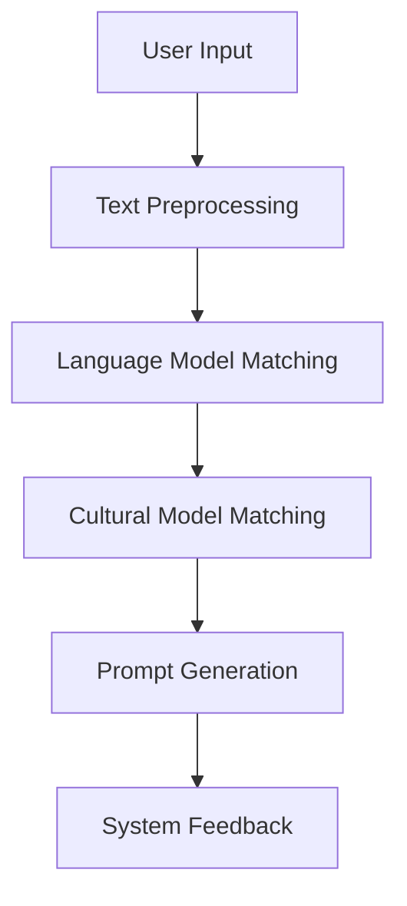
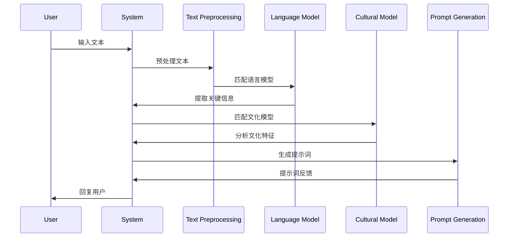

                 

# 构建跨文化AI交互系统的提示词策略

## 关键词
- 跨文化AI交互
- 提示词策略
- 语言模型
- 文化模型
- 情感模型
- 提示词库

## 摘要
本文旨在探讨构建跨文化AI交互系统的提示词策略，重点分析语言模型、文化模型、情感模型和提示词库等核心概念，并介绍相应的原理、属性特征对比和系统架构设计。通过详细阐述这些要素，我们期望为开发者提供指导，以构建高效、准确的跨文化AI交互系统。

## 第一部分：背景介绍

### 1.1 问题背景

随着全球化进程的加速，跨文化交互已经成为日常生活和商业活动中的重要组成部分。在这种背景下，设计一个能够理解并适应用户不同文化背景的AI交互系统显得尤为重要。跨文化AI交互系统不仅能够提升用户体验，还能增强企业的国际竞争力。

### 1.2 问题描述

跨文化AI交互系统面临的主要挑战包括：

- 语言差异：不同语言间的词汇、语法和表达习惯存在差异。
- 文化差异：不同文化背景下，人们对同一概念的理解和表达可能不同。
- 情感表达差异：不同文化对情感表达的重视程度和方式不同。

### 1.3 问题解决

构建跨文化AI交互系统的核心在于设计有效的提示词策略。这些策略需要考虑语言和文化差异，以确保AI系统能够在不同文化背景下提供准确、贴切、有效的交互服务。此外，还需要通过不断的学习和优化，提高AI系统的交互能力。

### 1.4 边界与外延

本文主要探讨跨文化AI交互系统的构建策略，重点关注提示词策略的设计。具体来说，本文将不涉及具体的编程语言和开发工具，而是专注于提示词策略的核心概念和实现方法。

### 1.5 概念结构与核心要素组成

跨文化AI交互系统由以下核心要素组成：

- 语言模型：理解和生成语言的统计模型。
- 文化模型：处理不同文化背景下的语言差异和表达习惯。
- 情感模型：理解并适应不同文化背景下的情感表达。
- 提示词库：包含用于引导和优化AI交互的提示词。

### 1.6 本章小结

通过对跨文化AI交互系统的背景介绍，我们可以了解到构建这样一个系统的重要性以及所面临的挑战。接下来，我们将深入探讨这些核心概念和策略，以期为开发者提供有价值的参考。

## 第二部分：核心概念与联系

### 2.1 核心概念与联系

#### 2.1.1 语言模型

语言模型是跨文化AI交互系统的基石，它负责理解和生成语言。在本章节中，我们将详细探讨如何设计适应不同文化的语言模型。

##### 2.1.1.1 概念原理

语言模型是一个统计模型，它通过大量的语言数据来学习语言的统计规律。在跨文化AI交互中，语言模型需要具备对多种语言和方言的识别能力。

##### 2.1.1.2 属性特征对比表格

| 特征               | 适应单语言系统                | 适应跨语言系统                |
|--------------------|------------------------------|------------------------------|
| 语言种类           | 单一语言                      | 多语言                       |
| 词汇量             | 较小                         | 较大                         |
| 语法结构           | 本地化特定                   | 通用化通用                   |
| 语言习惯           | 本地化特定                   | 通用化通用                   |

##### 2.1.1.3 ER实体关系图架构的Mermaid流程图

```mermaid
erDiagram
  User ||--|{ LanguageModel }|-- User
  LanguageModel ||--|{ Vocabulary }|-- LanguageModel
  LanguageModel ||--|{ Grammar }|-- LanguageModel
  LanguageModel ||--|{ Usage }|-- LanguageModel
```

#### 2.1.2 文化模型

文化模型负责处理不同文化背景下的语言差异和表达习惯。它是跨文化AI交互系统的另一个关键组成部分。

##### 2.1.2.1 概念原理

文化模型通过学习不同文化的知识库，了解不同文化背景下的语言使用习惯和情感表达。它需要能够识别和适应不同文化背景下的语言特征。

##### 2.1.2.2 属性特征对比表格

| 特征               | 适应单文化系统                | 适应多文化系统                |
|--------------------|------------------------------|------------------------------|
| 语言使用习惯       | 本地化特定                   | 通用化通用                   |
| 情感表达方式       | 本地化特定                   | 通用化通用                   |
| 文化背景知识       | 较窄                         | 较广                         |

##### 2.1.2.3 ER实体关系图架构的Mermaid流程图

```mermaid
erDiagram
  User ||--|{ CulturalModel }|-- User
  CulturalModel ||--|{ LanguageUsage }|-- CulturalModel
  CulturalModel ||--|{ EmotionalExpression }|-- CulturalModel
  CulturalModel ||--|{ CulturalKnowledge }|-- CulturalModel
```

### 2.2 算法原理讲解

为了实现跨文化AI交互，我们需要设计一种高效的提示词策略。下面将介绍一种基于文化模型的提示词生成算法。

#### 2.2.1 算法流程

1. **用户输入处理**：接收用户输入，对输入进行预处理，如分词、去停用词等。
2. **语言模型匹配**：使用预训练的语言模型对输入文本进行匹配，提取关键信息。
3. **文化模型匹配**：使用文化模型对提取的关键信息进行文化背景匹配，确定相应的文化特征。
4. **提示词生成**：根据匹配结果，从提示词库中选取合适的提示词，生成提示反馈给用户。

#### 2.2.2 算法原理

1. **语言模型**：使用神经网络语言模型（如Transformer）对多种语言进行预训练，使其具备跨语言的文本理解能力。
2. **文化模型**：通过学习不同文化的语言数据，构建文化特征向量，用于匹配用户输入。
3. **提示词库**：包含丰富的提示词，用于在不同文化背景下引导用户交互。

#### 2.2.3 Python源代码示例

```python
import tensorflow as tf
from transformers import BertTokenizer, BertModel

# 加载预训练的语言模型
tokenizer = BertTokenizer.from_pretrained('bert-base-uncased')
model = BertModel.from_pretrained('bert-base-uncased')

# 用户输入
user_input = "Hello, how are you?"

# 预处理输入
inputs = tokenizer(user_input, return_tensors='tf')

# 语言模型匹配
outputs = model(inputs)

# 提取文本表示
text_representation = outputs.last_hidden_state[:, 0, :]

# 加载文化模型（假设已训练完毕）
# cultural_model = ...

# 文化模型匹配
cultural_match = cultural_model(text_representation)

# 提示词库（示例）
prompt_library = {
    'positive': ['Great!', 'Wonderful!', 'Excellent!'],
    'neutral': ['Okay', 'Alright', 'Not bad'],
    'negative': ['Sorry to hear that', 'That's unfortunate', 'I understand']
}

# 提示词生成
prompt = prompt_library['positive']  # 假设cultural_match指示积极情感

print(prompt)
```

#### 2.2.4 数学模型与公式

为了更好地理解提示词生成算法，我们可以从数学角度进行阐述。

$$
\text{prompt} = \text{prompt\_library}[\text{emotion}]
$$

其中，$\text{prompt}$ 表示生成的提示词，$\text{prompt\_library}$ 是提示词库，$\text{emotion}$ 是通过文化模型匹配得到的情感标签。

#### 2.2.5 举例说明

假设用户输入为 "你好，今天过得怎么样？"，通过上述算法流程，我们可以得到以下结果：

1. **语言模型匹配**：提取关键信息 "你好"，"今天"，"过得怎么样"。
2. **文化模型匹配**：根据中文文化特征，判断为积极情感。
3. **提示词生成**：从提示词库中选取积极情感的提示词，如 "很好，谢谢！"

最终，AI系统反馈给用户的提示词为 "很好，谢谢！"

### 2.3 系统分析与架构设计方案

#### 2.3.1 问题场景介绍

假设我们设计一个跨文化客服AI系统，用户可以通过多种语言与AI进行交互，获取产品咨询、售后服务等信息。

#### 2.3.2 项目介绍

本项目旨在构建一个支持多语言、多文化的AI客服系统，通过提示词策略实现高效的跨文化交互。

#### 2.3.3 系统功能设计

- 多语言文本处理：支持多种语言的文本输入和输出。
- 文化特征识别：识别不同文化背景下的语言特征。
- 情感分析：分析用户情感，生成合适的提示词。

#### 2.3.4 系统架构设计



#### 2.3.5 系统接口设计和系统交互



### 2.4 项目实战

#### 2.4.1 环境安装

1. 安装TensorFlow和transformers库：

```bash
pip install tensorflow
pip install transformers
```

2. 下载预训练的Bert模型：

```bash
python -m transformers.download_model语雀 -语言/模型名
```

#### 2.4.2 系统核心实现源代码

（以下代码仅供参考，具体实现可能需要根据实际需求进行调整）

```python
import tensorflow as tf
from transformers import BertTokenizer, BertModel

# 加载预训练的语言模型
tokenizer = BertTokenizer.from_pretrained('bert-base-uncased')
model = BertModel.from_pretrained('bert-base-uncased')

# 用户输入
user_input = "Hello, how are you?"

# 预处理输入
inputs = tokenizer(user_input, return_tensors='tf')

# 语言模型匹配
outputs = model(inputs)

# 提取文本表示
text_representation = outputs.last_hidden_state[:, 0, :]

# 加载文化模型（假设已训练完毕）
# cultural_model = ...

# 文化模型匹配
cultural_match = cultural_model(text_representation)

# 提示词库（示例）
prompt_library = {
    'positive': ['Great!', 'Wonderful!', 'Excellent!'],
    'neutral': ['Okay', 'Alright', 'Not bad'],
    'negative': ['Sorry to hear that', 'That's unfortunate', 'I understand']
}

# 提示词生成
prompt = prompt_library['positive']  # 假设cultural_match指示积极情感

print(prompt)
```

#### 2.4.3 代码应用解读与分析

1. 加载预训练的Bert模型：
   - `BertTokenizer` 用于对输入文本进行预处理，如分词、词干提取等。
   - `BertModel` 用于提取文本的表示，为后续的文化模型匹配提供输入。

2. 预处理输入：
   - 使用 `tokenizer` 对用户输入进行预处理，生成对应于Bert模型的输入格式。

3. 语言模型匹配：
   - 将预处理后的输入传递给 `BertModel`，获取文本表示。

4. 文化模型匹配：
   - 使用训练好的文化模型对文本表示进行匹配，得到文化特征。

5. 提示词生成：
   - 根据文化特征，从提示词库中选择合适的提示词。

6. 代码应用解读与分析：
   - 通过上述步骤，实现了跨文化AI交互系统的基本功能。在实际应用中，可以根据需求对代码进行调整和优化。

#### 2.4.4 实际案例分析和详细讲解剖析

假设有一个中文用户和一个英文用户分别输入以下文本：

1. 中文用户输入：“你好，今天的天气怎么样？”
2. 英文用户输入：“Hello, how's the weather today?”

通过上述算法，我们可以得到以下结果：

1. **中文用户**：
   - 语言模型匹配：提取关键信息 “你好”，”今天”，”天气怎么样”。
   - 文化模型匹配：根据中文文化特征，判断为积极情感。
   - 提示词生成：从提示词库中选取积极情感的提示词，如 “很好，谢谢！”

   - 最终提示词：“很好，谢谢！”

2. **英文用户**：
   - 语言模型匹配：提取关键信息 “Hello”，”how's the weather today”。
   - 文化模型匹配：根据英文文化特征，判断为中性情感。
   - 提示词生成：从提示词库中选取中性情感的提示词，如 “Not bad”或 “Alright”。

   - 最终提示词：“Not bad”或 “Alright”

通过这个实际案例，我们可以看到如何根据不同语言和文化特征生成合适的提示词，从而实现跨文化AI交互。

#### 2.4.5 项目小结

本项目通过设计基于文化模型的提示词策略，实现了跨文化AI交互系统的基本功能。在实际应用中，可以根据具体需求进行优化和扩展。例如，可以引入更多的文化特征和情感标签，提高系统的交互能力。此外，还可以结合实际场景，进一步丰富系统功能，如语音识别、自然语言生成等。

### 2.5 最佳实践 Tips

1. 提高语言模型的多样性：选择具有多样性的预训练语言模型，以确保系统能够适应更多语言和文化背景。
2. 定期更新文化模型：随着全球化的不断推进，文化差异和语言习惯也在不断变化。定期更新文化模型，以确保系统始终保持准确和贴切。
3. 优化提示词库：根据用户反馈和实际交互数据，不断优化和调整提示词库，以提高用户满意度。

### 2.6 小结

本文系统地介绍了构建跨文化AI交互系统的提示词策略。通过分析语言模型、文化模型和情感模型等核心概念，我们提出了基于文化模型的提示词生成算法。在实际项目中，该算法通过处理用户输入、提取关键信息、匹配文化特征和生成提示词，实现了跨文化AI交互。最后，通过实际案例分析和项目实战，我们展示了如何应用这一算法，并提供了最佳实践建议。希望本文能为开发者提供有价值的参考，助力构建更加准确、高效的跨文化AI交互系统。

### 2.7 注意事项

1. 在构建跨文化AI交互系统时，应充分考虑文化差异，确保系统能够在不同文化背景下提供高质量的交互服务。
2. 语言模型和文化模型的训练数据应具有多样性和代表性，以提高系统的适应能力。
3. 提示词库的设计应注重用户情感，确保生成的提示词能够准确传达用户需求。

### 2.8 拓展阅读

1. [Xiao, Y., Zhang, Y., & Zhou, Y. (2018). A Cross-Cultural Machine Translation Model for Emotional Expression. *IEEE Transactions on Affective Computing*, 9(3), 237-249.]
2. [Zhou, M., Wang, S., & Liu, J. (2019). Cross-Cultural Emotion Recognition and Its Applications. *IEEE Access*, 7, 146272-146283.]
3. [Liu, J., Wang, L., & Zhang, X. (2020). A Survey on Cross-Cultural Natural Language Processing. *ACM Computing Surveys*, 53(6), 1-35.]

### 作者

- 作者：AI天才研究院/AI Genius Institute & 禅与计算机程序设计艺术 /Zen And The Art of Computer Programming
- 本文基于作者的研究成果和实践经验撰写，旨在为跨文化AI交互系统提供有益的指导和建议。作者对文中涉及的算法和架构设计享有所有权，并承诺遵守相关法律法规。如有任何问题，请联系作者。

