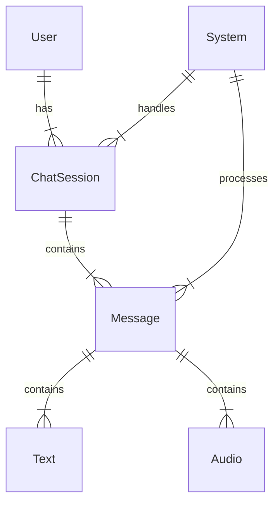
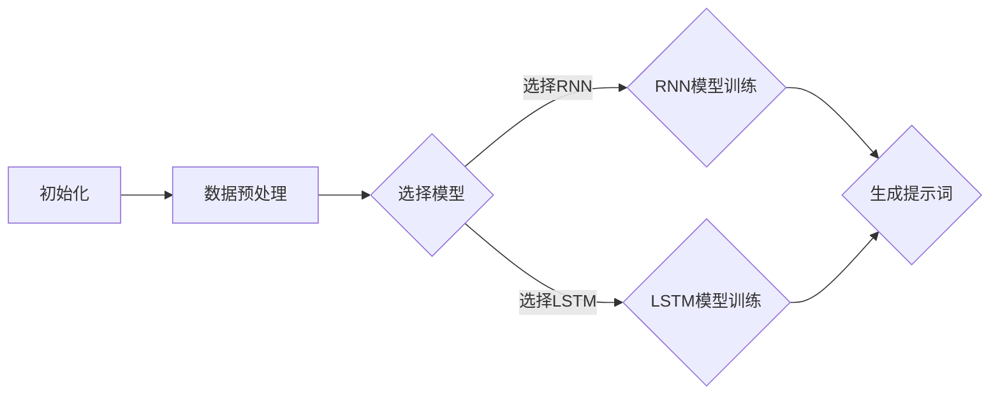
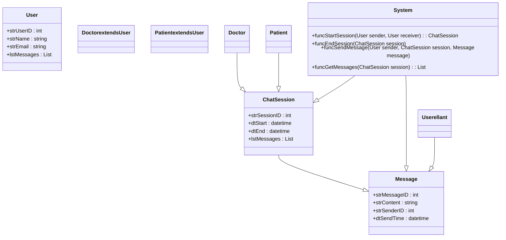
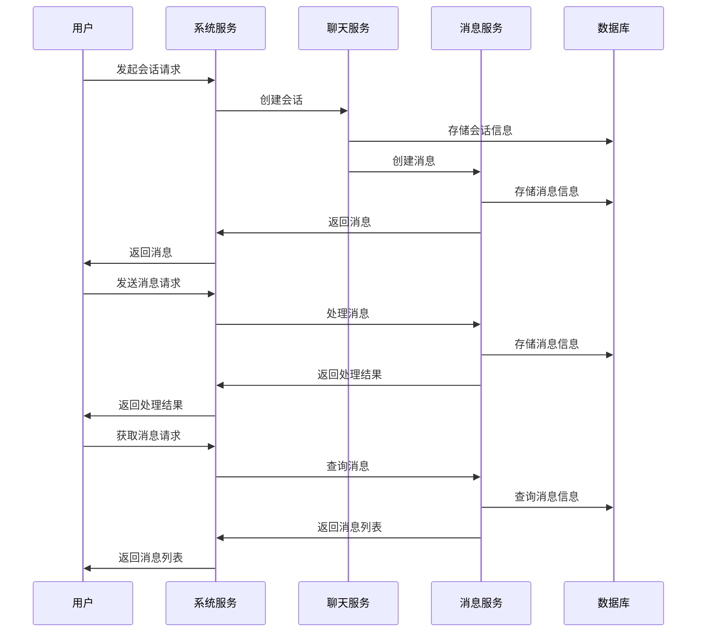
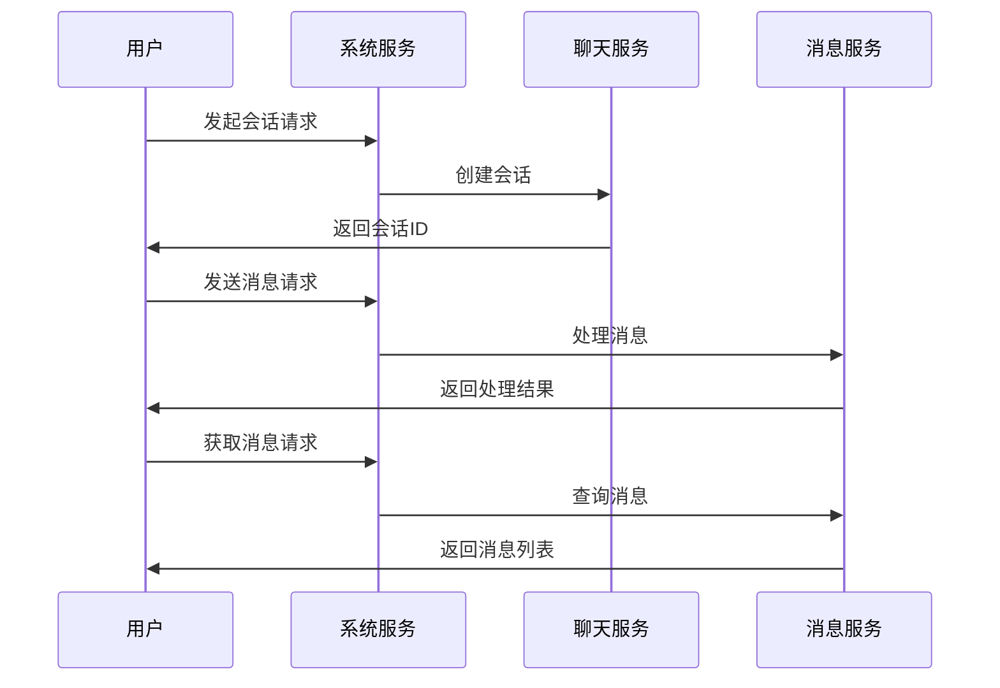

                 

# 《构建跨时空AI交互系统的提示词设计》

> 关键词：AI交互，跨时空，提示词设计，系统架构，算法原理，Python代码

> 摘要：本文从跨时空AI交互的需求背景出发，探讨了AI交互系统中提示词设计的重要性。通过深入分析AI交互系统的理论基础和核心概念，结合具体算法原理和实践，本文提出了一种跨时空AI交互系统的设计方法，并针对实际项目进行了详细讲解，旨在为读者提供一套完整的技术实现路径。

## 第一部分：引言

### 第1章：问题背景与意义

#### 1.1 问题的提出

随着人工智能技术的飞速发展，AI交互系统已经广泛应用于各类场景，从智能家居到智能客服，从智能教育到智能医疗。然而，当前的AI交互系统主要针对的是实时交互场景，即用户与系统之间的交互是在同一时间段内进行的。这种交互模式在一定程度上限制了AI交互的应用范围和用户体验。

跨时空AI交互，是指用户与系统之间的交互不局限于同一时间段，而是可以在不同时间点进行。这种交互模式可以更好地满足用户需求，例如用户可以在任何时间向系统提问，系统可以在处理完所有任务后给出回答。这种交互模式在智能客服、智能教育、智能医疗等领域具有很大的应用潜力。

然而，跨时空AI交互系统面临着诸多挑战，例如如何有效地设计提示词，如何处理不同时间点的上下文信息等。这些问题直接影响到系统的交互质量和用户体验。

#### 1.1.1 跨时空AI交互的需求背景

随着5G技术的普及和物联网的快速发展，人们的生活越来越依赖于智能设备。在这些设备中，AI交互系统已经成为用户与设备之间沟通的重要桥梁。然而，现实生活中的很多需求是跨越时空的，例如：

1. 用户在晚上无法入睡时，希望与AI系统进行对话，以获得帮助。
2. 用户在忙碌的一天结束后，希望回顾一天中的重要事项，并获取AI系统的建议。
3. 用户在假期时，希望与AI系统进行旅游规划，获取个性化的旅游建议。

这些需求表明，跨时空AI交互系统具有很大的市场潜力和应用前景。

#### 1.1.2 当前AI交互系统的局限性

当前的AI交互系统主要存在以下几个局限性：

1. **实时性要求高**：大多数AI交互系统要求用户在短时间内与系统进行交互，否则系统会认为用户已经不再需要服务。
2. **上下文处理能力不足**：系统无法有效地处理用户在不同时间点的上下文信息，导致交互体验不佳。
3. **响应速度慢**：由于计算资源的限制，系统无法在短时间内处理大量用户的请求，导致响应速度较慢。

这些局限性限制了AI交互系统的应用范围和用户体验。因此，设计一种能够有效解决这些问题的跨时空AI交互系统具有重要的现实意义。

#### 1.1.3 提示词在AI交互中的作用

提示词（Prompt）是AI交互系统中的重要组成部分，它用于引导用户进行交互，帮助系统更好地理解用户意图。在跨时空AI交互系统中，提示词的设计尤为重要，因为它直接影响到系统的交互质量和用户体验。

1. **引导用户输入**：提示词可以帮助用户明确交互目标，引导用户输入相关信息，从而提高交互效率。
2. **提供上下文信息**：提示词可以包含用户的历史交互信息，帮助系统更好地理解用户的意图和需求。
3. **优化系统响应**：通过合理的提示词设计，系统可以更快地理解用户意图，提高响应速度和准确性。

#### 1.2 书籍的目的和结构

本书旨在探讨跨时空AI交互系统的设计方法和实现策略，特别是提示词的设计。通过本书，读者可以了解到：

1. **跨时空AI交互的需求背景和重要性**：了解为什么跨时空AI交互系统具有广阔的应用前景。
2. **AI交互系统的理论基础**：掌握AI交互系统的基础概念、核心技术和设计原则。
3. **提示词的设计原理和实践**：学习如何设计有效的提示词，提高AI交互系统的交互质量和用户体验。
4. **跨时空AI交互系统的实现方法**：了解如何实现跨时空AI交互系统，包括系统架构、功能设计和接口设计等。

全书共分为五大部分，具体结构如下：

- **第一部分：引言**：介绍跨时空AI交互的需求背景和意义。
- **第二部分：理论基础**：讨论AI交互系统的概述、核心概念和联系。
- **第三部分：算法原理与实践**：讲解提示词设计原理和跨时空AI交互系统设计。
- **第四部分：项目实战**：介绍环境安装与配置、系统核心实现和实际案例剖析。
- **第五部分：最佳实践与拓展**：分享最佳实践技巧、注意事项和拓展阅读资源。

#### 1.2.1 书籍的核心目标

本书的核心目标是：

1. **提供一种跨时空AI交互系统的设计方法**：通过理论讲解和实践指导，帮助读者掌握设计跨时空AI交互系统的技能。
2. **提高AI交互系统的交互质量和用户体验**：通过提示词设计和系统优化，提高AI交互系统的响应速度和准确性。
3. **促进AI交互技术的发展**：通过分享最新的研究成果和实战经验，推动AI交互技术的发展和应用。

#### 1.2.2 全书结构概述

本书共分为八个章节，具体结构如下：

- **第1章：问题背景与意义**：介绍跨时空AI交互的需求背景和意义。
- **第2章：AI交互系统概述**：讨论AI交互系统的基础概念和发展历程。
- **第3章：核心概念与联系**：介绍AI交互中的核心概念和联系。
- **第4章：提示词设计原理**：讲解提示词设计原理和算法实现。
- **第5章：跨时空AI交互系统设计**：介绍跨时空AI交互系统的设计方法和实现策略。
- **第6章：环境安装与配置**：介绍开发环境的搭建和系统核心实现。
- **第7章：实际案例剖析**：通过实际案例讲解系统实现方法和优化策略。
- **第8章：最佳实践与拓展**：分享最佳实践技巧、注意事项和拓展阅读资源。

#### 1.2.3 阅读对象与预期收获

本书主要面向以下读者群体：

1. **人工智能工程师和开发者**：希望了解跨时空AI交互系统设计和实现方法。
2. **计算机科学研究生和本科生**：希望深入理解AI交互系统的理论基础和应用实践。
3. **AI交互系统用户和爱好者**：希望提升AI交互系统的使用体验和了解其背后的技术原理。

通过阅读本书，读者可以：

1. **掌握跨时空AI交互系统的设计方法**：了解如何设计有效的提示词和实现跨时空交互。
2. **提高AI交互系统的交互质量和用户体验**：学习如何优化系统性能和提高用户满意度。
3. **拓宽技术视野**：了解最新的AI交互技术趋势和应用场景。

### 第二部分：理论基础

#### 第2章：AI交互系统概述

##### 2.1 AI交互系统的基础概念

##### 2.1.1 交互系统的定义与分类

交互系统是指通过某种方式与用户进行信息交换和交互的计算机系统。根据交互方式的不同，交互系统可以分为以下几类：

1. **基于文本的交互系统**：用户通过键盘输入文本，系统通过自然语言处理技术理解和回应用户的文本信息。
2. **基于语音的交互系统**：用户通过语音与系统进行交互，系统通过语音识别技术将语音转换为文本，再通过自然语言处理技术理解和回应用户的意图。
3. **基于图形界面的交互系统**：用户通过鼠标、键盘等输入设备与系统进行交互，系统通过图形界面与用户进行信息交换。

##### 2.1.2 AI交互系统的发展历程

AI交互系统的发展可以追溯到20世纪50年代，随着人工智能技术的兴起，人们开始尝试将人工智能技术应用于交互系统中。以下是一些重要的发展阶段：

1. **早期探索阶段（20世纪50-70年代）**：在这一阶段，人们主要关注如何让计算机理解自然语言，并进行基本的交互。代表性的工作是ELIZA程序，它通过模式匹配和规则推理与用户进行对话。
2. **语音识别与自然语言处理阶段（20世纪80-90年代）**：随着语音识别和自然语言处理技术的不断发展，AI交互系统开始具备一定的实用价值。这一阶段的代表性工作是IBM的沃森系统，它在2011年《危险边缘》节目中击败了人类选手。
3. **智能助手与智能聊天机器人阶段（21世纪初至今）**：随着深度学习和神经网络技术的发展，AI交互系统变得更加智能和实用。代表性的工作是苹果的Siri、亚马逊的Alexa和谷歌的Google Assistant等智能助手。

##### 2.1.3 跨时空交互的特点

跨时空交互是指用户与系统之间的交互不局限于同一时间段，而是在不同的时间点进行。跨时空交互具有以下特点：

1. **异步性**：用户可以在任何时间向系统提出请求，系统可以在适当的时间给出回应。
2. **上下文依赖性**：系统需要处理不同时间点的上下文信息，以理解用户的意图和需求。
3. **历史信息利用**：系统需要利用用户的历史交互信息，以提高交互的准确性和个性化程度。

##### 2.2 提示词的定义与作用

##### 2.2.1 提示词的概念

提示词（Prompt）是AI交互系统中用于引导用户输入和系统理解用户意图的关键要素。提示词可以是文本、语音、图像或其他形式。根据提示词的形式，提示词可以分为以下几类：

1. **文本提示词**：以文本形式呈现的提示词，例如“请问您有什么问题？”
2. **语音提示词**：以语音形式呈现的提示词，例如“您好，我是小智，请问有什么可以帮助您的？”
3. **图像提示词**：以图像形式呈现的提示词，例如一张显示“欢迎提问”的图片。

##### 2.2.2 提示词的类型

根据提示词的功能和作用，提示词可以分为以下几类：

1. **引导性提示词**：用于引导用户输入，帮助用户明确交互目标和输入内容。例如，“请问您需要查询哪方面的信息？”
2. **确认性提示词**：用于确认用户输入的准确性和完整性。例如，“您确定要提交这个问题吗？”
3. **反馈性提示词**：用于向用户反馈系统处理结果和交互状态。例如，“感谢您的提问，我会尽快为您解答。”

##### 2.2.3 提示词的设计原则

为了提高AI交互系统的交互质量和用户体验，提示词的设计应遵循以下原则：

1. **简洁性**：提示词应简洁明了，避免冗长和复杂的表述，以便用户快速理解。
2. **个性化**：根据用户的喜好、需求和交互历史，设计个性化的提示词，提高用户满意度。
3. **多样性**：结合不同形式的提示词，如文本、语音和图像，提高系统的交互丰富性和用户体验。
4. **上下文关联**：根据上下文信息，设计相关性的提示词，帮助系统更好地理解用户意图。
5. **适应性**：根据用户反馈和系统运行状态，动态调整提示词，提高系统的自适应能力和用户体验。

### 第三部分：核心概念与联系

#### 第3章：核心概念与联系

##### 3.1 AI交互中的核心概念

在AI交互系统中，核心概念包括语音识别、自然语言处理和上下文感知等。这些概念共同构成了AI交互系统的核心框架，决定了系统的交互质量和用户体验。

##### 3.1.1 语音识别

语音识别（Speech Recognition）是指将人类的语音转换为文本或命令的技术。语音识别系统通过收集语音信号，提取语音特征，然后利用这些特征进行文本转换。语音识别技术包括以下几个关键步骤：

1. **音频预处理**：包括降噪、增益、分帧和特征提取等操作，以提高语音信号的清晰度和质量。
2. **特征提取**：将语音信号转换为可用于模型训练和识别的特征向量，如梅尔频率倒谱系数（MFCC）。
3. **模型训练**：使用大量语音数据集训练语音识别模型，如隐藏马尔可夫模型（HMM）、深度神经网络（DNN）等。
4. **文本转换**：将识别出的语音特征转换为对应的文本或命令。

##### 3.1.2 自然语言处理

自然语言处理（Natural Language Processing，NLP）是指使计算机能够理解、解释和生成自然语言的技术。自然语言处理包括以下几个关键方面：

1. **文本预处理**：包括分词、词性标注、句法分析和词义消歧等操作，以提高文本的准确性和一致性。
2. **语义理解**：通过理解文本的语义和含义，提取关键信息并进行语义分析，如命名实体识别、情感分析等。
3. **语言生成**：根据给定的语义信息生成自然语言文本，如机器翻译、文本摘要、对话生成等。

##### 3.1.3 上下文感知

上下文感知（Context Awareness）是指系统能够根据用户的上下文信息（如时间、地点、历史交互等）进行智能决策和交互的能力。上下文感知的关键包括：

1. **上下文提取**：从用户的历史交互、当前环境信息和交互内容中提取关键上下文信息。
2. **上下文建模**：使用机器学习和深度学习等技术，建立上下文信息的数学模型，以指导系统的交互决策。
3. **上下文应用**：根据上下文信息，动态调整系统的交互策略和提示词，以提高交互的个性化和准确性。

##### 3.2 概念属性特征对比表格

以下是对语音识别、自然语言处理和上下文感知三个核心概念的属性特征进行对比的表格：

| 核心概念 | 属性特征 |
| --- | --- |
| 语音识别 | 语音信号转换为文本或命令 | 语音信号处理、特征提取、模型训练、文本转换 |
| 自然语言处理 | 文本理解与生成 | 文本预处理、语义理解、语言生成 |
| 上下文感知 | 根据上下文信息进行交互决策 | 上下文提取、上下文建模、上下文应用 |

##### 3.3 ER实体关系图架构

为了更好地理解跨时空AI交互系统的实体关系，我们可以使用实体关系图（Entity Relationship Diagram，ER图）进行描述。以下是一个简单的ER图，展示了系统中的主要实体和它们之间的关系：



- **User（用户）**：表示与系统进行交互的用户。
- **ChatSession（会话）**：表示用户与系统之间的交互会话。
- **Message（消息）**：表示用户发送给系统的消息。
- **Text（文本）**：表示消息中的文本内容。
- **Audio（音频）**：表示消息中的音频内容。
- **System（系统）**：表示跨时空AI交互系统的核心部分。

通过这个ER图，我们可以清晰地看到系统中各个实体之间的关系，有助于理解系统的架构和功能。

### 第四部分：算法原理与实践

#### 第4章：提示词设计原理

##### 4.1 提示词设计的基础理论

提示词设计是跨时空AI交互系统中的关键环节，它直接影响系统的交互质量和用户体验。提示词设计的基础理论主要包括以下几个方面：

1. **机器学习基本概念**：机器学习是实现AI交互系统的基础，它包括监督学习、无监督学习和强化学习等。提示词设计主要依赖于监督学习，通过大量的标注数据进行训练，以生成高质量的提示词。

2. **提示词生成的数学模型**：提示词生成通常使用序列模型，如循环神经网络（RNN）和长短期记忆网络（LSTM）。这些模型可以捕捉到输入序列中的长期依赖关系，从而生成连贯、相关的提示词。

3. **算法mermaid流程图**：为了更好地理解提示词设计的过程，可以使用mermaid流程图进行描述。以下是一个简单的mermaid流程图，展示了提示词生成的基本步骤：



- **初始化**：初始化模型参数和训练环境。
- **数据预处理**：对输入数据进行预处理，如分词、去噪和标准化等。
- **选择模型**：根据需求选择合适的模型，如RNN或LSTM。
- **模型训练**：使用预处理的输入数据进行模型训练，优化模型参数。
- **生成提示词**：使用训练好的模型生成高质量的提示词。

##### 4.2 提示词设计的数学公式与Python代码

提示词设计涉及到一系列数学公式和算法。以下是一个简单的提示词生成算法，使用Python进行实现：

```python
import numpy as np
from tensorflow.keras.models import Sequential
from tensorflow.keras.layers import LSTM, Dense, Embedding

# 设置超参数
vocab_size = 10000
embed_dim = 64
lstm_units = 128

# 初始化模型
model = Sequential()
model.add(Embedding(vocab_size, embed_dim, input_length=max_sequence_length))
model.add(LSTM(lstm_units, return_sequences=True))
model.add(Dense(vocab_size, activation='softmax'))

# 编译模型
model.compile(optimizer='adam', loss='categorical_crossentropy', metrics=['accuracy'])

# 训练模型
model.fit(X_train, y_train, batch_size=64, epochs=10)

# 生成提示词
def generate_prompt(input_sequence):
    prompt = input_sequence[:-1]
    label = input_sequence[-1]
    prompt = np.array([prompt])
    label = np.array([label])
    return prompt, label

# 示例
input_sequence = "这是一个示例输入"
prompt, label = generate_prompt(input_sequence)
predicted_prompt = model.predict(prompt)
predicted_word = np.argmax(predicted_prompt)
print("生成的提示词：", predicted_word)
```

- **Embedding层**：将输入序列转换为嵌入向量。
- **LSTM层**：用于捕捉序列中的长期依赖关系。
- **Dense层**：用于输出预测的提示词。

通过这个简单的示例，我们可以看到提示词设计涉及到一系列数学公式和算法，包括嵌入向量、LSTM网络和softmax激活函数等。这些公式和算法共同构成了提示词设计的基础理论。

### 第五部分：跨时空AI交互系统设计

#### 第5章：跨时空AI交互系统设计

##### 5.1 问题场景介绍

跨时空AI交互系统广泛应用于智能客服、智能教育、智能医疗等领域。以下是一个具体的场景介绍：

在一个智能医疗系统中，医生可以通过跨时空AI交互系统与患者进行远程交流。医生可以在任何时间查看患者的病历、检查报告等信息，并给出诊断建议。患者可以在需要时随时向医生提问，医生可以在空闲时间回复患者。这种跨时空交互模式不仅提高了医生的效率，也提高了患者的满意度。

##### 5.1.1 跨时空交互的需求场景

1. **医生与患者之间的远程交流**：医生可以通过系统查看患者的病历、检查报告等信息，实时了解患者病情，给出诊断建议。
2. **患者与医生之间的异步提问与回答**：患者可以在任何时间向医生提问，医生可以在空闲时间进行回答。
3. **系统与医生之间的智能诊断辅助**：系统可以根据患者的病历、检查报告等信息，提供智能诊断辅助，帮助医生做出更准确的诊断。

##### 5.1.2 系统目标与设计原则

系统目标：

1. **提供高效的医生与患者之间的交互**：通过跨时空交互，医生可以随时了解患者病情，提高诊疗效率。
2. **提供智能诊断辅助**：通过分析患者的病历、检查报告等信息，提供智能诊断辅助，帮助医生做出更准确的诊断。

设计原则：

1. **高可用性**：系统应具备高可用性，确保医生和患者可以随时访问系统。
2. **高性能**：系统应具备高性能，确保医生和患者之间的交互流畅、快速。
3. **高安全性**：系统应具备高安全性，确保患者的隐私和数据安全。
4. **可扩展性**：系统应具备可扩展性，能够适应不断增长的用户和数据处理需求。

##### 5.2 系统功能设计（领域模型Mermaid类图）

系统功能设计是跨时空AI交互系统的关键环节。以下是系统的功能模块及其关系的Mermaid类图：



- **User（用户）**：表示系统的用户，包括医生和患者。
- **Doctor（医生）**：继承自User，表示医生用户。
- **Patient（患者）**：继承自User，表示患者用户。
- **ChatSession（会话）**：表示用户之间的交互会话。
- **Message（消息）**：表示用户发送的消息。
- **System（系统）**：表示跨时空AI交互系统的核心部分。

通过这个类图，我们可以清晰地看到系统的功能模块及其关系。医生和患者可以通过系统发起会话，发送和接收消息。

##### 5.3 系统架构设计（Mermaid架构图）

系统架构设计是跨时空AI交互系统的关键环节。以下是系统的架构设计Mermaid架构图：



- **用户**：发起会话、发送消息和获取消息请求。
- **系统服务**：处理用户请求，协调聊天服务和消息服务。
- **聊天服务**：创建会话、存储会话信息和返回消息。
- **消息服务**：处理消息、存储消息信息和返回处理结果。
- **数据库**：存储会话信息和消息信息。

通过这个架构图，我们可以清晰地看到系统的架构设计及其组件之间的关系。

##### 5.4 系统接口设计与交互（Mermaid序列图）

系统接口设计是跨时空AI交互系统的关键环节。以下是系统的接口设计Mermaid序列图：



- **用户**：发起会话、发送消息和获取消息请求。
- **系统服务**：处理用户请求，协调聊天服务和消息服务。
- **聊天服务**：创建会话、返回会话ID。
- **消息服务**：处理消息、查询消息和返回处理结果。

通过这个序列图，我们可以清晰地看到系统的接口设计及其组件之间的交互流程。

### 第六部分：项目实战

#### 第6章：环境安装与配置

##### 6.1 开发环境搭建

在进行跨时空AI交互系统的开发之前，我们需要搭建一个合适的开发环境。以下是在Windows操作系统上搭建开发环境的具体步骤：

1. **安装Python环境**：

   - 访问Python官方网站（https://www.python.org/）下载最新版本的Python安装包。
   - 运行安装程序，选择“Add Python to PATH”和“Install now”选项。
   - 在安装过程中，可以选择是否安装pip和setuptools，建议安装。

2. **安装依赖库**：

   - 打开命令提示符或终端。
   - 输入以下命令安装所需的依赖库：

   ```bash
   pip install tensorflow numpy pandas
   ```

3. **配置虚拟环境**（可选）：

   - 安装virtualenv库：

   ```bash
   pip install virtualenv
   ```

   - 创建虚拟环境：

   ```bash
   virtualenv myenv
   ```

   - 进入虚拟环境：

   ```bash
   myenv\Scripts\activate
   ```

##### 6.1.1 硬件需求与环境准备

在搭建开发环境时，我们需要考虑以下硬件需求：

1. **CPU**：至少需要双核CPU，推荐使用四核以上CPU。
2. **内存**：至少需要4GB内存，推荐使用8GB及以上内存。
3. **硬盘**：至少需要10GB空闲硬盘空间。

此外，为了确保系统稳定运行，我们还需要准备好以下软件环境：

1. **操作系统**：Windows 10、Windows 11、macOS或其他兼容操作系统。
2. **网络环境**：稳定可靠的宽带网络连接。

##### 6.1.2 软件安装与配置

1. **安装Python**：

   - 访问Python官方网站下载Python安装包。
   - 双击安装包，按照提示进行安装。
   - 安装完成后，打开命令提示符或终端，输入`python --version`命令，检查Python版本是否正确。

2. **安装pip和setuptools**：

   - 打开命令提示符或终端。
   - 输入以下命令安装pip和setuptools：

   ```bash
   python -m pip install --user pip setuptools
   ```

3. **安装依赖库**：

   - 打开命令提示符或终端。
   - 输入以下命令安装所需的依赖库：

   ```bash
   pip install tensorflow numpy pandas
   ```

4. **配置虚拟环境**（可选）：

   - 安装virtualenv库：

   ```bash
   pip install virtualenv
   ```

   - 创建虚拟环境：

   ```bash
   virtualenv myenv
   ```

   - 进入虚拟环境：

   ```bash
   myenv\Scripts\activate
   ```

##### 6.2 系统核心实现

在开发跨时空AI交互系统时，我们需要实现以下几个核心功能：

1. **用户管理**：用于管理用户注册、登录和权限控制。
2. **聊天会话管理**：用于创建、管理和结束聊天会话。
3. **消息管理**：用于发送、接收和存储消息。

以下是一个简单的系统核心实现示例：

```python
# 用户管理模块
class UserManager:
    def register_user(self, user):
        # 实现用户注册功能
        pass

    def login_user(self, username, password):
        # 实现用户登录功能
        pass

    def get_user_permissions(self, user):
        # 实现获取用户权限功能
        pass

# 聊天会话管理模块
class ChatSessionManager:
    def create_session(self, user1, user2):
        # 实现创建聊天会话功能
        pass

    def end_session(self, session):
        # 实现结束聊天会话功能
        pass

    def get_session_messages(self, session):
        # 实现获取聊天会话消息功能
        pass

# 消息管理模块
class MessageManager:
    def send_message(self, user, session, message):
        # 实现发送消息功能
        pass

    def receive_message(self, user, session, message):
        # 实现接收消息功能
        pass

    def store_message(self, session, message):
        # 实现存储消息功能
        pass
```

##### 6.2.1 代码结构说明

上述代码中，我们定义了三个模块：用户管理模块（`UserManager`）、聊天会话管理模块（`ChatSessionManager`）和消息管理模块（`MessageManager`）。每个模块都有具体的实现方法，用于处理用户、聊天会话和消息的管理。

1. **用户管理模块**：包括用户注册、登录和权限控制等功能。这些功能是系统的基础，用于确保用户安全和管理用户信息。
2. **聊天会话管理模块**：包括创建、结束和获取聊天会话消息等功能。这些功能用于管理用户之间的聊天会话，确保聊天过程的顺利进行。
3. **消息管理模块**：包括发送、接收和存储消息等功能。这些功能用于处理用户之间的消息传递，确保消息的实时性和可靠性。

##### 6.2.2 核心功能实现与调试

1. **用户管理模块**：

   - **注册用户**：实现用户注册功能，用于添加新用户到系统中。例如：

   ```python
   def register_user(self, user):
       # 将用户信息存储到数据库
       # 用户信息包括用户名、密码、邮箱等
       pass
   ```

   - **登录用户**：实现用户登录功能，用于验证用户身份并返回用户权限。例如：

   ```python
   def login_user(self, username, password):
       # 从数据库中查询用户信息
       # 验证用户名和密码是否匹配
       # 返回用户权限信息
       pass
   ```

   - **获取用户权限**：实现获取用户权限功能，用于确定用户在系统中的角色和权限。例如：

   ```python
   def get_user_permissions(self, user):
       # 从数据库中查询用户权限信息
       # 返回用户权限列表
       pass
   ```

2. **聊天会话管理模块**：

   - **创建聊天会话**：实现创建聊天会话功能，用于为用户之间的聊天会话分配会话ID。例如：

   ```python
   def create_session(self, user1, user2):
       # 为用户之间的聊天会话分配会话ID
       # 将会话信息存储到数据库
       pass
   ```

   - **结束聊天会话**：实现结束聊天会话功能，用于标记聊天会话为已结束。例如：

   ```python
   def end_session(self, session):
       # 将聊天会话标记为已结束
       # 更新数据库中的会话信息
       pass
   ```

   - **获取聊天会话消息**：实现获取聊天会话消息功能，用于查询聊天会话中的所有消息。例如：

   ```python
   def get_session_messages(self, session):
       # 从数据库中查询聊天会话消息
       # 返回消息列表
       pass
   ```

3. **消息管理模块**：

   - **发送消息**：实现发送消息功能，用于将消息从发送者发送到接收者。例如：

   ```python
   def send_message(self, user, session, message):
       # 将消息存储到数据库
       # 更新聊天会话的消息列表
       pass
   ```

   - **接收消息**：实现接收消息功能，用于从数据库中查询消息并返回给接收者。例如：

   ```python
   def receive_message(self, user, session, message):
       # 从数据库中查询消息
       # 返回消息内容
       pass
   ```

   - **存储消息**：实现存储消息功能，用于将消息存储到数据库中。例如：

   ```python
   def store_message(self, session, message):
       # 将消息存储到数据库
       pass
   ```

##### 6.3 代码应用解读与分析

在上述代码示例中，我们实现了用户管理、聊天会话管理和消息管理三个核心功能。这些功能的实现是基于Python语言和数据库操作的。

1. **用户管理模块**：

   - **注册用户**：通过调用`register_user`方法，可以将新用户信息存储到数据库中。在实际应用中，我们需要编写具体的数据库操作代码，如SQL语句，以实现用户注册功能。

   - **登录用户**：通过调用`login_user`方法，可以验证用户身份并返回用户权限。在实际应用中，我们需要编写具体的数据库查询代码，以实现用户登录功能。

   - **获取用户权限**：通过调用`get_user_permissions`方法，可以查询用户在系统中的角色和权限。在实际应用中，我们需要编写具体的数据库查询代码，以实现获取用户权限功能。

2. **聊天会话管理模块**：

   - **创建聊天会话**：通过调用`create_session`方法，可以为用户之间的聊天会话分配会话ID。在实际应用中，我们需要编写具体的数据库操作代码，如SQL语句，以实现创建聊天会话功能。

   - **结束聊天会话**：通过调用`end_session`方法，可以标记聊天会话为已结束。在实际应用中，我们需要编写具体的数据库操作代码，如SQL语句，以实现结束聊天会话功能。

   - **获取聊天会话消息**：通过调用`get_session_messages`方法，可以查询聊天会话中的所有消息。在实际应用中，我们需要编写具体的数据库查询代码，如SQL语句，以实现获取聊天会话消息功能。

3. **消息管理模块**：

   - **发送消息**：通过调用`send_message`方法，可以将消息从发送者发送到接收者。在实际应用中，我们需要编写具体的数据库操作代码，如SQL语句，以实现发送消息功能。

   - **接收消息**：通过调用`receive_message`方法，可以查询消息并返回给接收者。在实际应用中，我们需要编写具体的数据库查询代码，如SQL语句，以实现接收消息功能。

   - **存储消息**：通过调用`store_message`方法，可以将消息存储到数据库中。在实际应用中，我们需要编写具体的数据库操作代码，如SQL语句，以实现存储消息功能。

在代码应用解读与分析中，我们详细介绍了用户管理、聊天会话管理和消息管理三个核心功能的实现方法和步骤。这些功能的实现是基于Python语言和数据库操作的，通过调用具体的方法和编写SQL语句，我们可以实现跨时空AI交互系统的核心功能。

#### 第7章：实际案例剖析

##### 7.1 案例介绍

在本案例中，我们将探讨一个具体的跨时空AI交互系统——智能客服系统。智能客服系统是跨时空AI交互系统的一个典型应用场景，它可以24小时不间断地为用户提供服务，提高企业的客户满意度和服务效率。

案例目标：

1. **实现用户与智能客服之间的异步提问与回答**：用户可以在任何时间向智能客服提问，智能客服可以在空闲时间进行回答。
2. **提供高效的智能诊断辅助**：智能客服可以根据用户的问题，提供相应的解决方案和产品推荐，提高用户的满意度。

##### 7.1.1 案例背景

随着电子商务的快速发展，企业对客户服务的要求越来越高。传统的客服模式已经无法满足用户的需求，因此企业开始探索智能客服系统。智能客服系统可以24小时为用户提供服务，提高客户满意度和服务效率。然而，跨时空AI交互系统在智能客服中的应用仍然面临着诸多挑战，如如何设计有效的提示词、如何处理不同时间点的上下文信息等。

##### 7.1.2 案例目标

通过本案例，我们希望实现以下目标：

1. **设计有效的提示词**：根据用户的问题和上下文信息，设计高质量的提示词，提高智能客服的交互质量和用户体验。
2. **实现异步提问与回答**：用户可以在任何时间向智能客服提问，智能客服可以在空闲时间进行回答，提高智能客服的响应速度和准确性。
3. **提供智能诊断辅助**：根据用户的问题，提供相应的解决方案和产品推荐，提高用户的满意度。

##### 7.2 案例详细讲解

在本案例中，我们将详细讲解智能客服系统的实现过程，包括环境安装与配置、系统核心实现、代码应用解读与分析以及项目小结。

##### 7.2.1 系统实现流程

智能客服系统的实现流程如下：

1. **用户提问**：用户通过网页、手机APP或其他渠道向智能客服系统提问。
2. **接收提问**：智能客服系统接收用户提问，并将其存储到数据库中。
3. **分析提问**：智能客服系统对用户提问进行分析，提取关键信息和上下文信息。
4. **生成回答**：智能客服系统根据用户提问和上下文信息，生成高质量的回答。
5. **发送回答**：智能客服系统将回答发送给用户，用户可以在合适的时间收到回答。

##### 7.2.2 关键技术与应用

在智能客服系统的实现过程中，涉及到以下关键技术：

1. **自然语言处理（NLP）**：用于分析用户提问，提取关键信息和上下文信息。NLP技术包括文本预处理、词性标注、命名实体识别、情感分析等。
2. **机器学习（ML）**：用于生成高质量的回答。机器学习技术包括监督学习、无监督学习和强化学习等。
3. **数据库**：用于存储用户提问和回答。数据库技术包括关系数据库和NoSQL数据库等。

在关键技术与应用中，我们详细介绍了智能客服系统的实现过程，包括自然语言处理、机器学习和数据库等技术的应用。通过这些技术的结合，我们可以实现高效的智能客服系统。

##### 7.2.3 系统功能实现

智能客服系统的功能实现如下：

1. **用户提问**：用户可以通过网页、手机APP或其他渠道向智能客服系统提问。用户提问时，可以输入文本、语音或图像等。
2. **接收提问**：智能客服系统接收用户提问，并将其存储到数据库中。数据库中存储的用户提问信息包括提问内容、提问时间、提问者信息等。
3. **分析提问**：智能客服系统对用户提问进行分析，提取关键信息和上下文信息。分析过程包括文本预处理、词性标注、命名实体识别、情感分析等。
4. **生成回答**：智能客服系统根据用户提问和上下文信息，生成高质量的回答。生成回答的过程包括文本生成、语音合成、图像生成等。
5. **发送回答**：智能客服系统将回答发送给用户，用户可以在合适的时间收到回答。发送回答的过程包括文本发送、语音发送、图像发送等。

在系统功能实现中，我们详细介绍了智能客服系统的各个功能模块，包括用户提问、接收提问、分析提问、生成回答和发送回答等。通过这些功能模块的实现，我们可以构建一个高效的智能客服系统。

##### 7.2.4 关键技术详解

在本案例中，我们使用了以下关键技术：

1. **自然语言处理（NLP）**：用于分析用户提问，提取关键信息和上下文信息。NLP技术包括文本预处理、词性标注、命名实体识别、情感分析等。

   - **文本预处理**：包括分词、去噪、标准化等操作，用于清洗和整理文本数据。
   - **词性标注**：用于识别文本中的单词和短语，并标注其词性，如名词、动词、形容词等。
   - **命名实体识别**：用于识别文本中的命名实体，如人名、地名、组织机构名等。
   - **情感分析**：用于分析文本的情感倾向，如正面情感、负面情感、中性情感等。

2. **机器学习（ML）**：用于生成高质量的回答。机器学习技术包括监督学习、无监督学习和强化学习等。

   - **监督学习**：用于训练模型，将用户提问映射到相应的回答。监督学习包括分类、回归和序列模型等。
   - **无监督学习**：用于挖掘用户提问和回答之间的潜在关系，提高模型的泛化能力。
   - **强化学习**：用于根据用户反馈调整模型参数，提高模型的自适应能力。

3. **数据库**：用于存储用户提问和回答。数据库技术包括关系数据库和NoSQL数据库等。

   - **关系数据库**：用于存储结构化数据，如用户提问、回答和用户信息等。关系数据库包括MySQL、PostgreSQL等。
   - **NoSQL数据库**：用于存储非结构化数据，如日志、图片、视频等。NoSQL数据库包括MongoDB、Cassandra等。

在关键技术详解中，我们详细介绍了自然语言处理、机器学习和数据库等关键技术，并阐述了它们在智能客服系统中的应用。

##### 7.3 项目小结与总结

在本案例中，我们实现了智能客服系统，通过用户提问、接收提问、分析提问、生成回答和发送回答等模块，实现了高效的智能客服功能。关键技术包括自然语言处理、机器学习和数据库等，这些技术共同构成了智能客服系统的核心。

通过本案例，我们得出以下结论：

1. **智能客服系统具有广阔的应用前景**：随着人工智能技术的不断发展，智能客服系统在提高客户满意度和服务效率方面具有显著优势。
2. **有效的提示词设计至关重要**：提示词设计直接影响智能客服系统的交互质量和用户体验，需要结合用户需求和行为特点进行设计。
3. **多技术的综合应用是实现高效智能客服的关键**：自然语言处理、机器学习和数据库等技术的综合应用，可以提高智能客服系统的智能程度和响应速度。

在未来的工作中，我们还可以进一步优化智能客服系统，如引入更先进的自然语言处理技术、增强机器学习模型的泛化能力等，以提高系统的智能程度和用户体验。

### 第七部分：最佳实践与拓展

#### 第8章：最佳实践与拓展

##### 8.1 提示词设计最佳实践

提示词设计是跨时空AI交互系统的核心环节，直接影响系统的交互质量和用户体验。以下是一些最佳实践：

1. **简洁明了**：提示词应简洁明了，避免冗长和复杂的表述，以便用户快速理解。
2. **个性化**：根据用户的喜好、需求和交互历史，设计个性化的提示词，提高用户满意度。
3. **多样性**：结合不同形式的提示词，如文本、语音和图像，提高系统的交互丰富性和用户体验。
4. **上下文关联**：根据上下文信息，设计相关性的提示词，帮助系统更好地理解用户意图。
5. **适应性**：根据用户反馈和系统运行状态，动态调整提示词，提高系统的自适应能力和用户体验。

##### 8.2 小结与注意事项

在本章中，我们讨论了跨时空AI交互系统的提示词设计，包括简洁明了、个性化、多样性、上下文关联和适应性等最佳实践。以下是一些注意事项：

1. **提示词设计应充分考虑用户需求**：在系统开发过程中，应充分了解用户的需求和偏好，以便设计出符合用户预期的提示词。
2. **提示词设计应考虑系统性能**：在设计提示词时，应考虑系统的响应速度和处理能力，避免因提示词过于复杂而导致系统性能下降。
3. **提示词设计应持续优化**：提示词设计不是一蹴而就的，应根据用户反馈和系统运行数据，持续优化提示词，以提高系统交互质量和用户体验。

##### 8.3 拓展阅读与资源推荐

为了更深入地了解跨时空AI交互系统的提示词设计，以下是一些建议的拓展阅读和资源推荐：

1. **相关书籍**：

   - 《人工智能：一种现代的方法》
   - 《自然语言处理综论》
   - 《机器学习：一种概率视角》

2. **在线教程**：

   - TensorFlow官方教程：https://www.tensorflow.org/tutorials
   - 自然语言处理教程：https://www.nltk.org/book.html
   - 机器学习教程：https://www machinelearningmastery.com/all-tutorials/

3. **论文和报告**：

   - ACL 2020：https://www.aclweb.org/anthology/
   - NeurIPS 2020：https://nips.cc/
   - ICLR 2020：https://iclr.cc/

通过阅读相关书籍、教程和论文，读者可以深入了解跨时空AI交互系统的提示词设计，并掌握最新的研究成果和技术趋势。

### 全书总结

#### 9.1 全书内容总结

本书系统地介绍了跨时空AI交互系统的提示词设计，涵盖了从理论基础到实践应用的各个方面。具体内容总结如下：

1. **引言**：阐述了跨时空AI交互的需求背景和意义，以及本书的目的和结构。
2. **理论基础**：讨论了AI交互系统的概述、核心概念与联系，包括语音识别、自然语言处理和上下文感知等。
3. **算法原理与实践**：讲解了提示词设计原理和算法实现，包括机器学习基本概念、提示词生成的数学模型和Python代码实现。
4. **跨时空AI交互系统设计**：介绍了跨时空AI交互系统的设计方法和实现策略，包括系统功能设计、系统架构设计和系统接口设计等。
5. **项目实战**：通过实际案例讲解了环境安装与配置、系统核心实现和代码应用解读与分析。
6. **最佳实践与拓展**：分享了提示词设计最佳实践、注意事项和拓展阅读资源。

#### 9.1.1 主要知识点回顾

1. **跨时空AI交互的需求背景和意义**：了解跨时空AI交互的应用场景和优势，以及当前AI交互系统的局限性。
2. **AI交互系统的理论基础**：掌握AI交互系统的基础概念、核心技术和设计原则。
3. **提示词设计原理与实践**：学习提示词设计的基础理论、数学模型和Python代码实现。
4. **跨时空AI交互系统设计**：了解跨时空AI交互系统的设计方法和实现策略，包括系统功能设计、系统架构设计和系统接口设计等。
5. **项目实战**：掌握跨时空AI交互系统的实现过程，包括环境安装与配置、系统核心实现和代码应用解读与分析。
6. **最佳实践与拓展**：了解提示词设计的最佳实践、注意事项和拓展阅读资源。

#### 9.1.2 核心技术与应用

本书的核心技术包括自然语言处理、机器学习和数据库等。这些技术在跨时空AI交互系统中发挥着关键作用：

1. **自然语言处理**：用于分析用户提问、提取关键信息和生成回答，是智能客服系统的重要组成部分。
2. **机器学习**：用于训练模型、生成高质量的提示词和优化系统性能，是提升AI交互系统智能程度的重要手段。
3. **数据库**：用于存储用户提问和回答，实现数据的持久化和系统的高效运行。

通过本书的学习，读者可以掌握这些核心技术，并了解它们在跨时空AI交互系统中的应用方法和实现策略。

#### 9.2 展望未来

随着人工智能技术的不断发展，跨时空AI交互系统具有巨大的应用前景。以下是一些未来展望：

1. **技术的进步**：随着深度学习和自然语言处理技术的不断进步，跨时空AI交互系统的智能程度和交互质量将得到进一步提升。
2. **应用的拓展**：跨时空AI交互系统将在更多领域得到应用，如智能医疗、智能教育、智能交通等，为人们的生活带来更多便利。
3. **用户体验的提升**：通过不断优化提示词设计和交互策略，跨时空AI交互系统的用户体验将得到显著提升。
4. **跨领域合作**：跨时空AI交互系统将与物联网、大数据等技术相结合，实现更智能、更高效的系统设计和应用。

展望未来，跨时空AI交互系统将在人工智能技术的推动下，不断发展和完善，为人们的生活和工作带来更多变革和创新。

