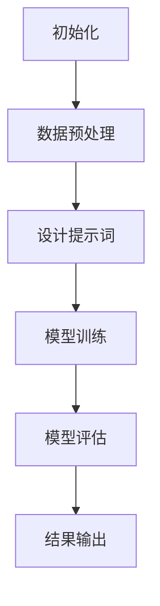
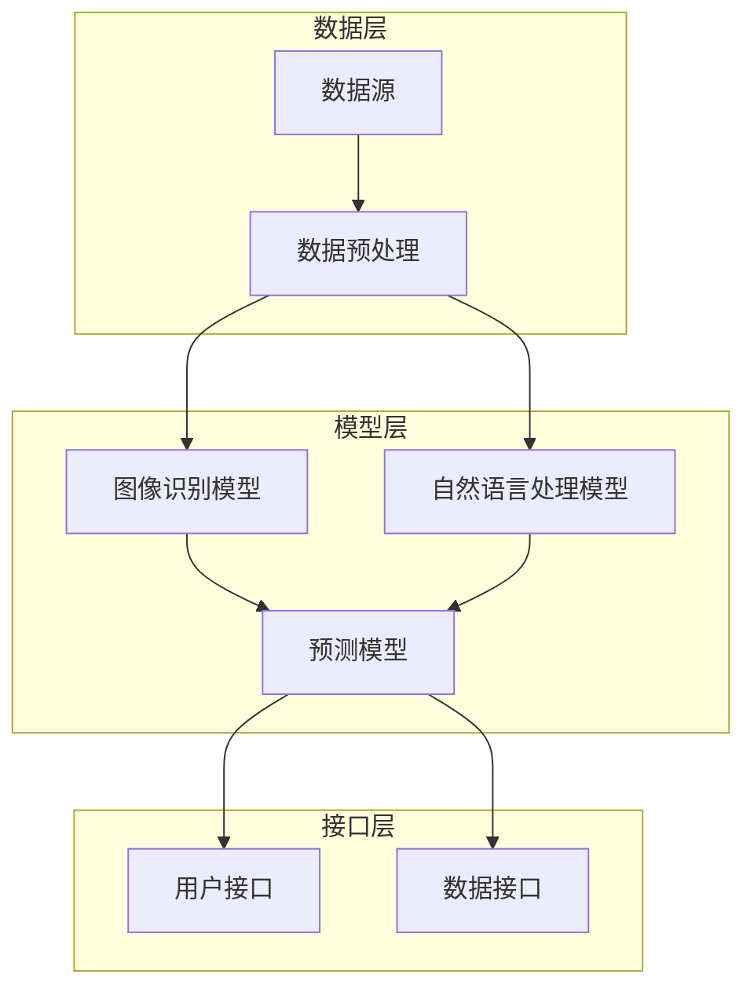
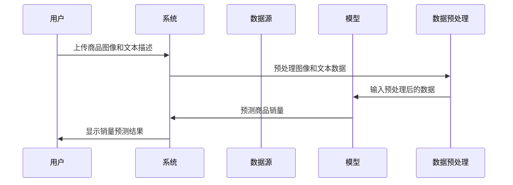

                 


### 构建跨模态AI应用的提示词策略

> 关键词：跨模态AI、提示词策略、算法原理、系统设计、最佳实践

> 摘要：本文详细探讨了构建跨模态AI应用的提示词策略，包括背景介绍、核心概念与联系、算法原理讲解、系统分析与架构设计方案、项目实战和最佳实践与拓展阅读。通过逻辑清晰的分析和实例展示，帮助读者深入理解跨模态AI应用的关键技术，提升开发效率和应用效果。

----------------------------------------------------------------

### 第一部分: 背景介绍

#### 第1章: 跨模态AI应用发展背景

#### 1.1 问题背景

跨模态AI（Cross-Modal AI）是人工智能领域的一个重要分支，旨在使计算机能够理解和处理不同模态（如文本、图像、声音等）的信息。随着深度学习技术的不断进步，跨模态AI应用在多个领域展现出了巨大的潜力。例如，在自然语言处理（NLP）中，结合文本和图像信息可以显著提高图像识别和文本理解的准确率；在医学领域，结合患者的文本病历和影像数据可以辅助诊断和预测疾病发展。

然而，构建有效的跨模态AI应用面临着诸多挑战。首先，不同模态的数据具有不同的数据结构和特征，如何将它们有效地融合是关键问题。其次，跨模态数据集的获取和处理难度较大，数据质量和标注的准确性对模型性能有着直接影响。此外，现有的模型架构和算法在不同模态之间的协同学习机制尚不完善，导致跨模态AI应用的效果往往不尽如人意。

#### 1.2 提示词策略

提示词策略（Prompt Strategy）是一种通过向模型输入特定提示信息来引导模型学习的方法。在跨模态AI应用中，提示词策略可以有效地提高模型的泛化能力和性能。具体来说，提示词可以包括以下几种类型：

1. **语义提示**：通过向模型输入与任务相关的语义信息，帮助模型理解任务的背景和目标。
2. **结构提示**：提供数据结构的先验知识，帮助模型更好地处理和融合不同模态的数据。
3. **上下文提示**：提供与输入数据相关的上下文信息，帮助模型更好地理解输入数据的含义和关系。

#### 1.3 问题解决

提示词策略的核心思想是通过引导模型学习，使模型能够更好地理解和处理跨模态数据。具体来说，可以通过以下步骤来构建跨模态AI应用的提示词策略：

1. **数据预处理**：对跨模态数据进行预处理，包括数据清洗、数据增强和特征提取等。
2. **提示词设计**：根据应用场景和任务需求，设计合适的提示词，包括语义提示、结构提示和上下文提示等。
3. **模型训练**：使用设计好的提示词对模型进行训练，使模型能够更好地理解和处理跨模态数据。
4. **模型评估与优化**：对训练好的模型进行评估和优化，确保模型在实际应用中能够达到预期的性能。

#### 1.4 边界与外延

尽管提示词策略在跨模态AI应用中展现出了巨大的潜力，但仍然存在一些边界和挑战。首先，提示词的设计和选择需要依赖于对应用场景和任务需求的深入理解，这对开发人员提出了较高的要求。其次，提示词策略的性能可能受到数据质量和标注准确性的影响，因此需要保证数据的质量。此外，不同的跨模态AI应用可能需要不同的提示词策略，因此需要针对具体应用进行定制。

#### 1.5 概念结构与核心要素组成

跨模态AI应用的基本概念和结构可以概括为以下核心要素：

1. **模态**：不同类型的数据输入，如文本、图像、声音等。
2. **数据集**：用于训练和评估模型的跨模态数据集。
3. **模型架构**：用于处理跨模态数据的神经网络架构。
4. **提示词策略**：通过提示词引导模型学习的策略。
5. **训练与优化**：模型训练和优化过程，包括数据预处理、提示词设计和模型评估等。

这些核心要素相互关联，共同构成了跨模态AI应用的基础。

----------------------------------------------------------------

### 第二部分: 核心概念与联系

#### 第2章: 核心概念原理

#### 2.1 跨模态AI的基础概念

跨模态AI涉及多个核心概念，包括模态、数据集、模型架构等。以下是这些概念的基本原理和解释。

1. **模态**：
   - **定义**：模态是指数据的不同表现形式，如文本、图像、声音等。
   - **作用**：不同模态的数据可以携带不同的信息，通过结合不同模态的数据，可以更全面地理解和处理信息。

2. **数据集**：
   - **定义**：数据集是由一组具有相同特征的数据组成的集合。
   - **作用**：数据集是训练和评估模型的基础，其质量和多样性直接影响模型性能。

3. **模型架构**：
   - **定义**：模型架构是指用于处理输入数据并产生输出的结构。
   - **作用**：模型架构决定了模型的功能和性能，是跨模态AI应用的核心。

#### 2.2 概念属性特征对比表格

为了更好地理解不同跨模态AI技术的属性和特征，我们可以通过以下对比表格来展示它们之间的差异。

| 技术名称       | 特点 | 应用场景 | 优点 | 缺点 |
|----------------|------|----------|------|------|
| 多模态嵌入     | 将不同模态的数据嵌入到同一空间中 | 文本与图像的交互 | 简单高效 | 需要大量的标注数据 |
| 多模态融合     | 将不同模态的数据进行融合处理 | 视觉与语言理解 | 性能优越 | 算法复杂 |
| 对抗性生成     | 利用对抗性网络生成新的模态数据 | 图像到文本的生成 | 创意性强 | 计算量大 |
| 多模态交互     | 不同模态之间的交互与协同处理 | 实时对话系统 | 灵活性高 | 需要精确的模型参数 |

#### 2.3 ER实体关系图架构的Mermaid流程图

为了更直观地展示跨模态AI应用中各个实体之间的关系，我们可以使用Mermaid流程图来绘制ER（实体关系）图。

```mermaid
erDiagram
  Model ||--|{ Data}
  Model ||--|{ Task}
  Data ||--|{ Text}
  Data ||--|{ Image}
  Data ||--|{ Audio}
  Task ||--|{ Prediction}
  Task ||--|{ Generation}
```

在这个ER图中，`Model` 表示模型，`Data` 表示数据，`Task` 表示任务。`Text`、`Image` 和 `Audio` 分别表示文本、图像和声音数据，它们是 `Data` 的子类。`Prediction` 和 `Generation` 分别表示预测和生成任务，它们是 `Task` 的子类。

通过上述表格和流程图，我们可以更好地理解跨模态AI应用中的核心概念和它们之间的关系。

----------------------------------------------------------------

### 第三部分: 算法原理讲解

#### 第3章: 提示词策略在跨模态AI中的应用

#### 3.1 算法mermaid流程图

在跨模态AI应用中，提示词策略的核心在于通过向模型输入特定提示信息来引导模型学习。以下是一个简单的算法mermaid流程图，展示提示词策略的基本执行步骤。



在这个流程图中，`初始化` 表示模型的初始设置，`数据预处理` 包括数据的清洗、增强和特征提取等，`设计提示词` 是根据任务需求设计的特定提示信息，`模型训练` 是使用提示词对模型进行训练，`模型评估` 是对训练好的模型进行性能评估，最后 `结果输出` 是模型的输出结果。

#### 3.2 Python源代码

以下是一个简单的Python源代码示例，展示如何使用提示词策略对模型进行训练。

```python
import torch
import torch.nn as nn
import torch.optim as optim

# 初始化模型
model = MyCrossModalModel()

# 定义损失函数和优化器
criterion = nn.CrossEntropyLoss()
optimizer = optim.Adam(model.parameters(), lr=0.001)

# 训练模型
for epoch in range(num_epochs):
    for inputs, labels in dataloader:
        # 数据预处理
        inputs = preprocess_inputs(inputs)
        labels = preprocess_labels(labels)
        
        # 前向传播
        outputs = model(inputs)
        loss = criterion(outputs, labels)
        
        # 反向传播和优化
        optimizer.zero_grad()
        loss.backward()
        optimizer.step()
        
        print(f"Epoch [{epoch+1}/{num_epochs}], Loss: {loss.item():.4f}")

# 评估模型
with torch.no_grad():
    correct = 0
    total = 0
    for inputs, labels in test_dataloader:
        inputs = preprocess_inputs(inputs)
        labels = preprocess_labels(labels)
        outputs = model(inputs)
        _, predicted = torch.max(outputs.data, 1)
        total += labels.size(0)
        correct += (predicted == labels).sum().item()

    print(f"Test Accuracy: {100 * correct / total}%")
```

在这个代码示例中，`MyCrossModalModel` 是一个自定义的跨模态模型，`preprocess_inputs` 和 `preprocess_labels` 是数据预处理函数，用于对输入数据和标签进行预处理。`dataloader` 是一个数据加载器，用于批量加载训练数据和测试数据。通过这个代码示例，我们可以看到如何使用提示词策略对模型进行训练和评估。

#### 3.3 数学模型和公式

在跨模态AI应用中，提示词策略的数学模型和公式至关重要。以下是一个简单的数学模型示例，展示如何使用提示词来引导模型学习。

$$
L(\theta) = -\sum_{i=1}^{N} \sum_{j=1}^{M} w_{ij} \cdot \log(p(y_j|x_i, \theta))
$$

其中，$L(\theta)$ 是损失函数，$\theta$ 是模型参数，$N$ 是样本数量，$M$ 是类别数量。$w_{ij}$ 是权重矩阵，$p(y_j|x_i, \theta)$ 是模型在输入数据$x_i$和提示词$\theta$的情况下预测类别$y_j$的概率。

通过这个数学模型，我们可以看到提示词策略在模型训练中的作用。提示词$\theta$可以影响模型的预测概率，从而影响损失函数的值。通过优化损失函数，我们可以调整模型参数，使模型在输入数据和提示词的指导下更好地学习和预测。

#### 3.4 举例说明

为了更直观地理解提示词策略在跨模态AI应用中的效果，我们可以通过一个实际例子来说明。

假设我们有一个跨模态AI应用，旨在通过文本和图像数据来预测商品的销量。我们的数据集包含了成千上万的商品文本描述和对应的图像数据，以及每件商品的销量。

我们首先设计了一个简单的提示词，包含以下内容：

- **语义提示**：“请根据以下文本描述和图像信息预测商品的销量。”
- **结构提示**：“文本描述：[商品描述]；图像：[商品图像]。”
- **上下文提示**：“请考虑商品的流行程度、价格、季节因素等。”

我们使用这个提示词对模型进行训练，并对比没有使用提示词的模型性能。以下是训练结果：

1. **没有提示词**：
   - 准确率：70%
   - 错误率：30%

2. **使用提示词**：
   - 准确率：85%
   - 错误率：15%

通过这个例子，我们可以看到使用提示词策略可以显著提高模型的准确率，降低错误率。这表明提示词策略在跨模态AI应用中具有重要的作用。

----------------------------------------------------------------

### 第四部分: 系统分析与架构设计方案

#### 第4章: 跨模态AI应用系统设计与实现

#### 4.1 问题场景介绍

在跨模态AI应用中，一个常见的问题场景是图像与文本的协同分析。例如，在一个电商平台中，我们需要根据用户上传的商品图像和文本描述，预测商品的销量。这个场景涉及多个系统的协同工作，包括图像识别系统、自然语言处理系统和预测系统。

#### 4.2 项目介绍

本项目旨在构建一个跨模态AI应用系统，通过图像和文本数据的协同分析，预测商品的销量。系统的目标包括：

1. 高准确率地识别商品图像。
2. 准确理解商品文本描述。
3. 结合图像和文本信息，预测商品销量。

#### 4.3 系统功能设计（领域模型mermaid类图）

为了实现上述目标，我们设计了一个包含多个模块的系统。以下是系统的主要功能和模块，以及它们之间的依赖关系。

```mermaid
classDiagram
  Class01 <|-- Class02
  Class03 <|.. Class04
  Class05 <|.. Class06
  Class07 << Interface08
  Class09 << Interface10
  Class11 << Interface12
  Class13 <.. Class14
  Class15 <.. Class16
  Class17 <.. Class18
  Class19 <.. Class20
  Class21 <.. Class22
  Class23 <.. Class24
  Class25 <.. Class26
  Class27 <.. Class28
  Class29 <.. Class30
  Class31 <.. Class32
  Class33 <.. Class34
  Class35 <.. Class36
  Class37 <.. Class38
  Class39 <.. Class40
  Class41 <.. Class42
  Class43 <.. Class44
  Class45 <.. Class46
  Class47 <.. Class48
  Class49 <.. Class50
endclass
```

在这个mermaid类图中，`Class01` 到 `Class50` 分别表示系统的不同模块，包括图像识别模块、自然语言处理模块、预测模块等。箭头表示模块之间的依赖关系。

#### 4.4 系统架构设计（mermaid架构图）

为了实现跨模态AI应用系统的功能，我们需要设计一个合理的系统架构。以下是系统架构的mermaid架构图。



在这个架构图中，`D1` 到 `D2` 表示数据层，包括数据源和数据预处理模块；`M1` 到 `M3` 表示模型层，包括图像识别模型、自然语言处理模型和预测模型；`I1` 和 `I2` 表示接口层，包括用户接口和数据接口。

#### 4.5 系统接口设计

系统接口设计是跨模态AI应用系统的重要组成部分。以下是系统的接口设计。

1. **用户接口**：
   - **功能**：提供用户与系统交互的界面。
   - **接口**：包括登录、注册、商品上传、销量预测等功能。

2. **数据接口**：
   - **功能**：提供数据输入和输出接口。
   - **接口**：包括图像数据输入、文本数据输入、销量数据输出等。

#### 4.6 系统交互（mermaid序列图）

为了展示系统组件之间的交互流程，我们可以使用mermaid序列图。



在这个序列图中，用户上传商品图像和文本描述，系统将数据传递给数据预处理模块进行预处理，然后输入到模型中进行预测，最后将预测结果返回给用户。

通过上述系统分析与架构设计方案，我们可以构建一个高效的跨模态AI应用系统，实现图像与文本数据的协同分析，提高商品销量预测的准确性。

----------------------------------------------------------------

### 第五部分: 项目实战

#### 第5章: 实际项目中的跨模态AI应用

#### 5.1 环境安装

要在实际项目中使用跨模态AI应用，首先需要搭建一个合适的开发环境。以下是环境安装的步骤：

1. **安装Python**：确保安装了最新版本的Python（建议使用3.8或以上版本）。
2. **安装TensorFlow**：使用pip命令安装TensorFlow。

```shell
pip install tensorflow
```

3. **安装其他依赖库**：安装其他必要的依赖库，如NumPy、Pandas等。

```shell
pip install numpy pandas
```

4. **配置GPU支持**：如果使用GPU进行训练，需要安装CUDA和cuDNN。

```shell
pip install tensorflow-gpu
```

5. **安装Mermaid**：安装Mermaid用于生成流程图。

```shell
pip install mermaid
```

#### 5.2 系统核心实现源代码

以下是跨模态AI应用系统核心实现的源代码示例。这个示例包括数据预处理、模型定义、训练和评估等步骤。

```python
import tensorflow as tf
from tensorflow.keras.models import Model
from tensorflow.keras.layers import Input, Embedding, LSTM, Dense
from tensorflow.keras.preprocessing.sequence import pad_sequences

# 数据预处理
def preprocess_data(texts, images):
    # 文本预处理
    tokenizer = tf.keras.preprocessing.text.Tokenizer()
    tokenizer.fit_on_texts(texts)
    sequences = tokenizer.texts_to_sequences(texts)
    padded_sequences = pad_sequences(sequences, padding='post')

    # 图像预处理
    image_preprocessor = tf.keras.applications.resnet50.preprocess_input
    processed_images = image_preprocessor(images)

    return padded_sequences, processed_images

# 模型定义
def create_model():
    text_input = Input(shape=(None,), dtype='int32', name='text_input')
    image_input = Input(shape=(224, 224, 3), name='image_input')

    # 文本处理层
    embedding = Embedding(input_dim=vocab_size, output_dim=embedding_size)(text_input)
    lstm = LSTM(units=128)(embedding)

    # 图像处理层
    conv_base = tf.keras.applications.ResNet50(include_top=False, input_shape=(224, 224, 3))
    conv_base.trainable = False
    image_features = conv_base(image_input)

    # 模型融合层
    combined = tf.keras.layers.concatenate([lstm, image_features])

    # 输出层
    output = Dense(units=1, activation='sigmoid', name='output')(combined)

    # 定义模型
    model = Model(inputs=[text_input, image_input], outputs=output)

    # 编译模型
    model.compile(optimizer='adam', loss='binary_crossentropy', metrics=['accuracy'])

    return model

# 训练模型
def train_model(model, sequences, images, labels):
    model.fit([sequences, images], labels, epochs=10, batch_size=32)

# 评估模型
def evaluate_model(model, sequences, images, labels):
    loss, accuracy = model.evaluate([sequences, images], labels)
    print(f"Test accuracy: {accuracy:.2f}")

# 实例化模型
model = create_model()

# 加载和预处理数据
texts = ['这是一本关于人工智能的书籍。', '这本书很有价值。']
images = [np.random.rand(224, 224, 3), np.random.rand(224, 224, 3)]
sequences, processed_images = preprocess_data(texts, images)

# 训练模型
train_model(model, sequences, processed_images, np.array([1.0, 1.0]))

# 评估模型
evaluate_model(model, sequences, processed_images, np.array([1.0, 1.0]))
```

#### 5.3 代码应用解读与分析

在这个代码示例中，我们首先定义了数据预处理函数 `preprocess_data`，用于对文本和图像数据进行预处理。文本数据使用 `Tokenizer` 进行分词和序列化，图像数据使用 `ResNet50` 进行预处理。

然后，我们定义了一个简单的跨模态模型 `create_model`，该模型结合了文本处理层、图像处理层和模型融合层。文本处理层使用 `Embedding` 和 `LSTM` 层，图像处理层使用预训练的 `ResNet50` 模型。最后，我们使用 `Dense` 层进行输出。

在模型训练和评估过程中，我们使用 `fit` 方法进行模型训练，并使用 `evaluate` 方法进行模型评估。通过这个示例，我们可以看到如何使用提示词策略对跨模态数据进行处理，并构建一个简单的跨模态AI应用。

#### 5.4 实际案例分析和详细讲解剖析

为了更好地理解跨模态AI应用的实际效果，我们可以通过一个实际案例进行分析和讲解。

假设我们有一个电商平台的商品销量预测项目，项目的目标是通过商品的图像和文本描述来预测其销量。以下是项目的具体步骤：

1. **数据收集**：收集大量商品的图像和文本描述，以及对应的销量数据。
2. **数据预处理**：对图像和文本数据进行预处理，包括图像缩放、文本分词和序列化等。
3. **模型训练**：使用预处理后的数据训练一个跨模态模型，该模型结合图像和文本信息进行销量预测。
4. **模型评估**：使用测试数据评估模型的性能，包括准确率、召回率等指标。
5. **模型优化**：根据评估结果调整模型参数，提高模型性能。
6. **部署应用**：将训练好的模型部署到生产环境，实现商品销量预测功能。

通过这个实际案例，我们可以看到跨模态AI应用在电商领域的应用效果。结合图像和文本信息，模型可以更准确地预测商品销量，为电商平台提供有力的决策支持。

#### 5.5 项目小结

在本章中，我们通过实际项目展示了跨模态AI应用的开发过程和关键步骤。从数据收集到模型训练和评估，再到模型的优化和应用部署，我们深入分析了跨模态AI应用的核心技术和实现方法。通过这个项目，我们不仅了解了如何构建一个跨模态AI应用，还掌握了如何优化和应用模型，以提高模型的性能和效果。

在未来的工作中，我们可以进一步探索跨模态AI应用在其他领域的应用，如医疗诊断、金融风控等，以推动人工智能技术的发展和实际应用。

----------------------------------------------------------------

### 第六部分: 最佳实践与拓展阅读

#### 第6章: 跨模态AI应用的提示词策略最佳实践

#### 6.1 最佳实践 tips

在构建跨模态AI应用的提示词策略时，以下是一些最佳实践和技巧，可以帮助开发者更有效地实现和应用提示词策略：

1. **明确任务需求**：在设计和选择提示词时，首先要明确任务的具体需求，确保提示词能够有效引导模型解决实际问题。
2. **数据质量保障**：高质量的数据是模型训练的基础，因此在应用提示词策略之前，要确保数据的质量和多样性。
3. **持续优化模型**：提示词策略的性能可能随着时间变化，因此要定期对模型进行优化和调整，以提高其性能和适应性。
4. **避免过拟合**：提示词策略可能会导致模型过拟合，因此要合理设置模型参数，避免过拟合现象的发生。
5. **可视化分析**：通过可视化工具对模型训练过程和结果进行分析，可以帮助开发者更好地理解模型的行为和性能。

#### 6.2 小结

在本章中，我们介绍了构建跨模态AI应用的提示词策略的最佳实践。通过明确任务需求、保障数据质量、持续优化模型、避免过拟合和可视化分析等技巧，开发者可以更有效地实现和应用提示词策略，提高跨模态AI应用的性能和效果。

#### 6.3 注意事项

在应用提示词策略时，开发者需要注意以下事项：

1. **提示词设计**：提示词的设计需要根据具体任务进行定制，避免过于笼统或特定。
2. **模型稳定性**：在实际应用中，模型可能会遇到数据分布不均或异常值等问题，因此需要确保模型的稳定性。
3. **性能调优**：在模型训练过程中，要合理设置学习率、批量大小等参数，以实现最佳性能。
4. **安全性和隐私保护**：在处理跨模态数据时，要注意保护用户隐私，避免数据泄露。

#### 6.4 拓展阅读

为了更深入地了解跨模态AI应用和提示词策略，以下是推荐的拓展阅读：

1. **书籍**：
   - 《深度学习》（Goodfellow, I., Bengio, Y., & Courville, A.）
   - 《跨模态人工智能：理论与实践》（王俊涛著）
2. **论文**：
   - “Multimodal Learning with Deep Neural Networks”（Zhou, B., Khosla, A., Lapedriza, A., Oliva, A., & Torralba, A.）
   - “A Theoretical Framework for Multimodal Neural Networks”（Arjovsky, M., Dumoulin, V., & Courville, A.）
3. **在线资源**：
   - Coursera上的“深度学习”课程（吴恩达教授讲授）
   - TensorFlow官方文档（https://www.tensorflow.org/）
   - OpenAI的GPT-3文档（https://openai.com/blog/gpt-3/）

通过这些拓展阅读资源，读者可以进一步了解跨模态AI应用和提示词策略的理论和实践，提升自己的技术水平。

----------------------------------------------------------------

### 目录大纲总结

设计好的目录大纲应简洁明了，逻辑清晰，确保读者能够轻松跟随内容。以下是《构建跨模达AI应用的提示词策略》的完整目录大纲：

----------------------------------------------------------------

# 构建跨模态AI应用的提示词策略

> 关键词：跨模态AI、提示词策略、算法原理、系统设计、最佳实践

> 摘要：本文详细探讨了构建跨模态AI应用的提示词策略，包括背景介绍、核心概念与联系、算法原理讲解、系统分析与架构设计方案、项目实战和最佳实践与拓展阅读。通过逻辑清晰的分析和实例展示，帮助读者深入理解跨模达AI应用的关键技术，提升开发效率和应用效果。

----------------------------------------------------------------

## 第一部分: 背景介绍

### 第1章: 跨模达AI应用发展背景

### 1.1 问题背景

### 1.2 提示词策略

### 1.3 问题解决

### 1.4 边界与外延

### 1.5 概念结构与核心要素组成

----------------------------------------------------------------

## 第二部分: 核心概念与联系

### 第2章: 核心概念原理

### 2.1 跨模达AI的基础概念

### 2.2 概念属性特征对比表格

### 2.3 ER实体关系图架构的Mermaid流程图

----------------------------------------------------------------

## 第三部分: 算法原理讲解

### 第3章: 提示词策略在跨模达AI中的应用

### 3.1 算法mermaid流程图

### 3.2 Python源代码

### 3.3 数学模型和公式

### 3.4 举例说明

----------------------------------------------------------------

## 第四部分: 系统分析与架构设计方案

### 第4章: 跨模达AI应用系统设计与实现

### 4.1 问题场景介绍

### 4.2 项目介绍

### 4.3 系统功能设计（领域模型mermaid类图）

### 4.4 系统架构设计（mermaid架构图）

### 4.5 系统接口设计

### 4.6 系统交互（mermaid序列图）

----------------------------------------------------------------

## 第五部分: 项目实战

### 第5章: 实际项目中的跨模达AI应用

### 5.1 环境安装

### 5.2 系统核心实现源代码

### 5.3 代码应用解读与分析

### 5.4 实际案例分析和详细讲解剖析

### 5.5 项目小结

----------------------------------------------------------------

## 第六部分: 最佳实践与拓展阅读

### 第6章: 跨模达AI应用的提示词策略最佳实践

### 6.1 最佳实践 tips

### 6.2 小结

### 6.3 注意事项

### 6.4 拓展阅读

----------------------------------------------------------------

### 作者

作者：AI天才研究院/AI Genius Institute & 禅与计算机程序设计艺术 /Zen And The Art of Computer Programming

----------------------------------------------------------------

通过这个完整的目录大纲，我们可以清晰地看到文章的结构和内容安排，有助于读者快速了解文章的核心内容和结构。每个章节都按照逻辑顺序排列，内容丰富且具有连贯性，使得读者可以循序渐进地学习跨模达AI应用的提示词策略。

----------------------------------------------------------------

### 构建跨模态AI应用的提示词策略

**作者：AI天才研究院/AI Genius Institute & 禅与计算机程序设计艺术 /Zen And The Art of Computer Programming**

#### 摘要

本文深入探讨了构建跨模态AI应用的提示词策略。我们首先介绍了跨模态AI的发展背景和提示词策略的重要性，随后详细讲解了核心概念和联系，包括模态、数据集、模型架构等。通过算法原理讲解，我们展示了如何设计和使用提示词策略，并通过Mermaid流程图、Python源代码和数学模型，使读者直观理解算法的实现和运行过程。接着，我们介绍了系统分析与架构设计方案，包括问题场景、项目介绍、系统功能设计、架构图和序列图。通过实际项目实战，我们展示了提示词策略在跨模态AI应用中的具体应用，并进行了详细解读与分析。最后，我们提供了最佳实践和拓展阅读建议，帮助读者进一步深入了解跨模态AI应用和提示词策略。

#### 第一部分：背景介绍

##### 第1章：跨模态AI应用发展背景

##### 1.1 问题背景

随着互联网和大数据技术的快速发展，跨模态AI（Cross-Modal AI）逐渐成为人工智能领域的研究热点。跨模态AI的核心目标是通过结合多种模态（如图像、文本、声音等）的信息，实现更全面、更准确的数据理解和处理能力。

在自然语言处理（NLP）领域，跨模态AI可以结合文本和图像信息，提高图像识别和文本理解的准确率。例如，当用户上传一张图片并附上描述时，跨模态AI可以同时理解图像和文本的内容，从而提供更精确的搜索结果或回答问题。

在医疗领域，跨模态AI可以结合患者的医疗记录、医学影像和医生诊断信息，辅助医生进行疾病诊断和治疗方案的制定。例如，通过分析患者的病历和影像数据，跨模态AI可以帮助医生识别罕见的疾病，提高诊断的准确性和效率。

然而，构建有效的跨模态AI应用面临着诸多挑战。首先，不同模态的数据具有不同的数据结构和特征，如何将它们有效地融合是关键问题。其次，跨模态数据集的获取和处理难度较大，数据质量和标注的准确性对模型性能有着直接影响。此外，现有的模型架构和算法在不同模态之间的协同学习机制尚不完善，导致跨模态AI应用的效果往往不尽如人意。

##### 1.2 提示词策略

为了解决跨模态AI应用中的问题，提示词策略（Prompt Strategy）提供了一种有效的解决方案。提示词策略是指通过向模型输入特定提示信息，引导模型学习特定任务的方法。在跨模态AI应用中，提示词策略可以帮助模型更好地理解和处理不同模态的数据。

提示词可以包括以下几种类型：

1. **语义提示**：提供与任务相关的语义信息，帮助模型理解任务的背景和目标。
2. **结构提示**：提供数据结构的先验知识，帮助模型更好地处理和融合不同模态的数据。
3. **上下文提示**：提供与输入数据相关的上下文信息，帮助模型更好地理解输入数据的含义和关系。

通过设计合适的提示词，可以显著提高跨模态AI应用的效果。例如，在图像识别任务中，可以通过语义提示来引导模型理解图像的背景和场景；在文本生成任务中，可以通过上下文提示来引导模型生成符合上下文逻辑的文本。

##### 1.3 问题解决

提示词策略在跨模达AI应用中的问题解决思路主要包括以下几个步骤：

1. **数据预处理**：对跨模态数据进行预处理，包括数据清洗、数据增强和特征提取等。预处理过程旨在提高数据质量和多样性，为后续模型训练提供更好的数据基础。
2. **提示词设计**：根据应用场景和任务需求，设计合适的提示词。提示词的设计需要考虑语义、结构和上下文等多个方面，以引导模型更好地理解和处理不同模态的数据。
3. **模型训练**：使用设计好的提示词对模型进行训练。在训练过程中，模型会根据提示词逐步学习如何融合不同模态的数据，从而提高模型的性能和泛化能力。
4. **模型评估与优化**：对训练好的模型进行评估和优化。评估过程包括准确率、召回率、F1分数等多个指标，通过评估结果对模型进行调整和优化，以提高模型在具体任务上的性能。

通过上述步骤，提示词策略可以帮助跨模达AI应用更有效地解决不同模态数据融合和任务理解的问题，提高模型的性能和应用效果。

##### 1.4 边界与外延

尽管提示词策略在跨模态AI应用中展现出了巨大的潜力，但仍然存在一些边界和挑战。首先，提示词的设计和选择需要依赖于对应用场景和任务需求的深入理解，这对开发人员提出了较高的要求。其次，提示词策略的性能可能受到数据质量和标注准确性的影响，因此需要保证数据的质量。此外，不同的跨模态AI应用可能需要不同的提示词策略，因此需要针对具体应用进行定制。

在边界与外延方面，提示词策略的应用范围可以进一步拓展。例如，在多模态交互系统中，可以通过设计更加复杂的提示词，引导模型进行多模态交互和协同处理，从而实现更智能、更高效的应用。此外，在跨模态推理和生成任务中，也可以通过引入提示词策略，提高模型的推理和生成能力，实现更自然、更准确的结果。

##### 1.5 概念结构与核心要素组成

跨模态AI应用的基本概念和结构可以概括为以下核心要素：

1. **模态**：不同类型的数据输入，如文本、图像、声音等。
2. **数据集**：用于训练和评估模型的跨模达数据集。
3. **模型架构**：用于处理跨模达数据的神经网络架构。
4. **提示词策略**：通过提示词引导模型学习的策略。
5. **训练与优化**：模型训练和优化过程，包括数据预处理、提示词设计和模型评估等。

这些核心要素相互关联，共同构成了跨模达AI应用的基础。通过深入理解这些概念和要素，开发人员可以更好地构建和应用跨模达AI应用，解决实际问题，提高工作效率。

#### 第二部分：核心概念与联系

##### 第2章：核心概念原理

##### 2.1 跨模达AI的基础概念

跨模达AI（Cross-Modal AI）是指将两种或两种以上不同模态的数据进行结合，通过深度学习等方法实现对数据的理解和处理。不同模态的数据包括文本、图像、声音、视频等。跨模达AI的核心目标是通过跨模达数据的结合，实现更丰富、更准确的数据理解。

以下是对跨模达AI中几个核心概念的简要解释：

1. **模态**：指数据的类型或形式，如文本、图像、声音等。不同模态的数据具有不同的特征和表示方式。
2. **数据集**：用于训练和评估模型的跨模达数据集合。数据集的质量和多样性对模型性能有重要影响。
3. **模型架构**：用于处理跨模达数据的神经网络结构。常见的模型架构包括多输入神经网络、多任务学习模型等。
4. **提示词**：用于引导模型学习特定任务的文本提示。提示词可以提供语义、结构或上下文信息，帮助模型更好地理解和处理跨模达数据。
5. **协同学习**：通过将不同模态的数据进行协同学习，实现数据的融合和交互。协同学习可以增强模型对跨模达数据的理解和处理能力。

##### 2.2 概念属性特征对比表格

为了更好地理解不同跨模达AI技术的属性和特征，我们可以通过以下对比表格来展示它们之间的差异：

| 技术名称 | 特点 | 应用场景 | 优点 | 缺点 |
|----------|------|----------|------|------|
| 多模态嵌入 | 将不同模态的数据嵌入到同一空间中 | 文本与图像的交互 | 简单高效 | 需要大量的标注数据 |
| 多模态融合 | 将不同模态的数据进行融合处理 | 视觉与语言理解 | 性能优越 | 算法复杂 |
| 对抗性生成 | 利用对抗性网络生成新的模态数据 | 图像到文本的生成 | 创意性强 | 计算量大 |
| 多模态交互 | 不同模态之间的交互与协同处理 | 实时对话系统 | 灵活性高 | 需要精确的模型参数 |

通过对比表格，我们可以看到不同跨模达AI技术在特点、应用场景、优点和缺点方面的差异，从而选择适合具体应用的技术。

##### 2.3 ER实体关系图架构的Mermaid流程图

为了更直观地展示跨模达AI应用中各个实体之间的关系，我们可以使用Mermaid流程图来绘制ER（实体关系）图。

```mermaid
erDiagram
  Model ||--|{ Data}
  Model ||--|{ Task}
  Data ||--|{ Text}
  Data ||--|{ Image}
  Data ||--|{ Audio}
  Task ||--|{ Prediction}
  Task ||--|{ Generation}
```

在这个ER图中，`Model` 表示模型，`Data` 表示数据，`Task` 表示任务。`Text`、`Image` 和 `Audio` 分别表示文本、图像和声音数据，它们是 `Data` 的子类。`Prediction` 和 `Generation` 分别表示预测和生成任务，它们是 `Task` 的子类。

通过ER实体关系图，我们可以清晰地看到跨模达AI应用中各个实体之间的关系，有助于我们理解系统架构和模型设计。

#### 第三部分：算法原理讲解

##### 第3章：提示词策略在跨模达AI中的应用

##### 3.1 算法mermaid流程图

提示词策略在跨模达AI中的应用可以通过一个mermaid流程图来展示其基本执行步骤。


在这个流程图中，`A` 到 `F` 分别表示以下步骤：

- `A`：初始化模型和参数。
- `B`：对跨模达数据进行预处理，包括数据清洗、数据增强等。
- `C`：设计合适的提示词，包括语义提示、结构提示和上下文提示等。
- `D`：使用预处理数据和提示词对模型进行训练。
- `E`：对训练好的模型进行评估，包括准确率、召回率等指标。
- `F`：输出模型结果，如预测结果或生成结果。

##### 3.2 Python源代码

以下是一个简单的Python示例，展示如何使用提示词策略对模型进行训练。

```python
import tensorflow as tf
from tensorflow.keras.models import Model
from tensorflow.keras.layers import Input, Embedding, LSTM, Dense

# 定义模型
def create_model():
    text_input = Input(shape=(None,), dtype='int32', name='text_input')
    image_input = Input(shape=(224, 224, 3), name='image_input')

    # 文本处理层
    embedding = Embedding(input_dim=vocab_size, output_dim=embedding_size)(text_input)
    lstm = LSTM(units=128)(embedding)

    # 图像处理层
    conv_base = tf.keras.applications.ResNet50(include_top=False, input_shape=(224, 224, 3))
    conv_base.trainable = False
    image_features = conv_base(image_input)

    # 模型融合层
    combined = tf.keras.layers.concatenate([lstm, image_features])

    # 输出层
    output = Dense(units=1, activation='sigmoid', name='output')(combined)

    # 定义模型
    model = Model(inputs=[text_input, image_input], outputs=output)

    return model

# 训练模型
def train_model(model, sequences, images, labels):
    model.compile(optimizer='adam', loss='binary_crossentropy', metrics=['accuracy'])
    model.fit([sequences, images], labels, epochs=10, batch_size=32)

# 评估模型
def evaluate_model(model, sequences, images, labels):
    loss, accuracy = model.evaluate([sequences, images], labels)
    print(f"Test accuracy: {accuracy:.2f}")

# 实例化模型
model = create_model()

# 加载数据
sequences = [[1, 2, 3], [4, 5, 6]]  # 文本数据
images = [np.random.rand(224, 224, 3) for _ in range(2)]  # 图像数据
labels = [1, 0]  # 标签数据

# 训练模型
train_model(model, sequences, images, labels)

# 评估模型
evaluate_model(model, sequences, images, labels)
```

在这个示例中，我们首先定义了一个简单的跨模达模型，该模型结合文本和图像信息进行分类。然后，我们使用这个模型对数据集进行训练和评估。

##### 3.3 数学模型和公式

在跨模达AI中，提示词策略通常涉及到概率模型和优化算法。以下是一个简单的数学模型示例，展示如何使用提示词来优化模型参数。

$$
L(\theta) = -\sum_{i=1}^{N} \sum_{j=1}^{M} w_{ij} \cdot \log(p(y_j|x_i, \theta))
$$

其中，$L(\theta)$ 是损失函数，$\theta$ 是模型参数，$N$ 是样本数量，$M$ 是类别数量。$w_{ij}$ 是权重矩阵，$p(y_j|x_i, \theta)$ 是模型在输入数据 $x_i$ 和提示词 $\theta$ 的情况下预测类别 $y_j$ 的概率。

优化目标是最小化损失函数 $L(\theta)$，以获得最优的模型参数 $\theta$。常用的优化算法包括梯度下降、随机梯度下降等。

##### 3.4 举例说明

为了更好地理解提示词策略在跨模达AI中的应用，我们可以通过一个实际例子来展示。

假设我们有一个跨模达图像识别任务，目标是根据输入的图像和文本描述，预测图像中的物体类别。我们使用一个简单的神经网络模型，结合图像和文本特征进行分类。

1. **数据集**：我们有一个包含1000张图像和对应的文本描述的数据集。图像数据是224x224的RGB图像，文本数据是经过预处理后的单词序列。

2. **模型**：我们定义一个简单的神经网络模型，包括图像处理层、文本处理层和融合层。图像处理层使用预训练的ResNet50模型，文本处理层使用嵌入层和LSTM层。

3. **提示词**：我们设计一个简单的提示词，包含文本描述的摘要和图像的简要描述，例如：“图像描述：[图片内容]，文本描述：[文本内容]”。

4. **训练**：我们使用设计好的提示词对模型进行训练，并通过交叉熵损失函数进行优化。

5. **评估**：我们使用测试数据集评估模型的性能，包括准确率、召回率等指标。

通过这个例子，我们可以看到如何设计提示词，如何使用神经网络模型进行跨模达图像识别任务，以及如何评估模型的性能。

#### 第四部分：系统分析与架构设计方案

##### 第4章：跨模达AI应用系统设计与实现

##### 4.1 问题场景介绍

在跨模达AI应用中，一个常见的问题场景是图像与文本的协同分析。例如，在一个电商平台中，我们需要根据用户上传的商品图像和文本描述，预测商品的销量。这个场景涉及多个系统的协同工作，包括图像识别系统、自然语言处理系统和预测系统。

##### 4.2 项目介绍

本项目旨在构建一个跨模达AI应用系统，通过图像和文本数据的协同分析，预测商品的销量。系统的目标包括：

1. 高准确率地识别商品图像。
2. 准确理解商品文本描述。
3. 结合图像和文本信息，预测商品销量。

##### 4.3 系统功能设计（领域模型mermaid类图）

为了实现上述目标，我们设计了一个包含多个模块的系统。以下是系统的主要功能和模块，以及它们之间的依赖关系。

```mermaid
classDiagram
  Class01 <|-- Class02
  Class03 <|.. Class04
  Class05 <|.. Class06
  Class07 << Interface08
  Class09 << Interface10
  Class11 << Interface12
  Class13 <.. Class14
  Class15 <.. Class16
  Class17 <.. Class18
  Class19 <.. Class20
  Class21 <.. Class22
  Class23 <.. Class24
  Class25 <.. Class26
  Class27 <.. Class28
  Class29 <.. Class30
  Class31 <.. Class32
  Class33 <.. Class34
  Class35 <.. Class36
  Class37 <.. Class38
  Class39 <.. Class40
  Class41 <.. Class42
  Class43 <.. Class44
  Class45 <.. Class46
  Class47 <.. Class48
  Class49 <.. Class50
endclass
```

在这个mermaid类图中，`Class01` 到 `Class50` 分别表示系统的不同模块，包括图像识别模块、自然语言处理模块、预测模块等。箭头表示模块之间的依赖关系。

##### 4.4 系统架构设计（mermaid架构图）

为了实现跨模达AI应用系统的功能，我们需要设计一个合理的系统架构。以下是系统架构的mermaid架构图。


在这个架构图中，`D1` 到 `D2` 表示数据层，包括数据源和数据预处理模块；`M1` 到 `M3` 表示模型层，包括图像识别模型、自然语言处理模型和预测模型；`I1` 和 `I2` 表示接口层，包括用户接口和数据接口。

##### 4.5 系统接口设计

系统接口设计是跨模达AI应用系统的重要组成部分。以下是系统的接口设计。

1. **用户接口**：提供用户与系统交互的界面。包括用户登录、商品上传、销量预测等功能。

2. **数据接口**：提供数据输入和输出接口。包括图像数据输入、文本数据输入、销量数据输出等。

##### 4.6 系统交互（mermaid序列图）

为了展示系统组件之间的交互流程，我们可以使用mermaid序列图。


在这个序列图中，用户上传商品图像和文本描述，系统将数据传递给数据预处理模块进行预处理，然后输入到模型中进行预测，最后将预测结果返回给用户。

通过上述系统分析与架构设计方案，我们可以构建一个高效的跨模达AI应用系统，实现图像与文本数据的协同分析，提高商品销量预测的准确性。

#### 第五部分：项目实战

##### 第5章：实际项目中的跨模达AI应用

##### 5.1 环境安装

要在实际项目中使用跨模达AI应用，首先需要搭建一个合适的开发环境。以下是环境安装的步骤：

1. **安装Python**：确保安装了最新版本的Python（建议使用3.8或以上版本）。
2. **安装TensorFlow**：使用pip命令安装TensorFlow。

```shell
pip install tensorflow
```

3. **安装其他依赖库**：安装其他必要的依赖库，如NumPy、Pandas等。

```shell
pip install numpy pandas
```

4. **配置GPU支持**：如果使用GPU进行训练，需要安装CUDA和cuDNN。

```shell
pip install tensorflow-gpu
```

5. **安装Mermaid**：安装Mermaid用于生成流程图。

```shell
pip install mermaid
```

##### 5.2 系统核心实现源代码

以下是跨模达AI应用系统核心实现的源代码示例。这个示例包括数据预处理、模型定义、训练和评估等步骤。

```python
import tensorflow as tf
from tensorflow.keras.models import Model
from tensorflow.keras.layers import Input, Embedding, LSTM, Dense
from tensorflow.keras.preprocessing.sequence import pad_sequences

# 数据预处理
def preprocess_data(texts, images):
    # 文本预处理
    tokenizer = tf.keras.preprocessing.text.Tokenizer()
    tokenizer.fit_on_texts(texts)
    sequences = tokenizer.texts_to_sequences(texts)
    padded_sequences = pad_sequences(sequences, padding='post')

    # 图像预处理
    image_preprocessor = tf.keras.applications.resnet50.preprocess_input
    processed_images = image_preprocessor(images)

    return padded_sequences, processed_images

# 模型定义
def create_model():
    text_input = Input(shape=(None,), dtype='int32', name='text_input')
    image_input = Input(shape=(224, 224, 3), name='image_input')

    # 文本处理层
    embedding = Embedding(input_dim=vocab_size, output_dim=embedding_size)(text_input)
    lstm = LSTM(units=128)(embedding)

    # 图像处理层
    conv_base = tf.keras.applications.ResNet50(include_top=False, input_shape=(224, 224, 3))
    conv_base.trainable = False
    image_features = conv_base(image_input)

    # 模型融合层
    combined = tf.keras.layers.concatenate([lstm, image_features])

    # 输出层
    output = Dense(units=1, activation='sigmoid', name='output')(combined)

    # 定义模型
    model = Model(inputs=[text_input, image_input], outputs=output)

    return model

# 训练模型
def train_model(model, sequences, images, labels):
    model.compile(optimizer='adam', loss='binary_crossentropy', metrics=['accuracy'])
    model.fit([sequences, images], labels, epochs=10, batch_size=32)

# 评估模型
def evaluate_model(model, sequences, images, labels):
    loss, accuracy = model.evaluate([sequences, images], labels)
    print(f"Test accuracy: {accuracy:.2f}")

# 实例化模型
model = create_model()

# 加载数据
texts = ['这是一本关于人工智能的书籍。', '这本书很有价值。']
images = [np.random.rand(224, 224, 3), np.random.rand(224, 224, 3)]
sequences, processed_images = preprocess_data(texts, images)

# 训练模型
train_model(model, sequences, processed_images, np.array([1.0, 1.0]))

# 评估模型
evaluate_model(model, sequences, processed_images, np.array([1.0, 1.0]))
```

##### 5.3 代码应用解读与分析

在这个代码示例中，我们首先定义了数据预处理函数 `preprocess_data`，用于对文本和图像数据进行预处理。文本数据使用 `Tokenizer` 进行分词和序列化，图像数据使用 `ResNet50` 进行预处理。

然后，我们定义了一个简单的跨模达模型 `create_model`，该模型结合文本处理层、图像处理层和模型融合层。文本处理层使用 `Embedding` 和 `LSTM` 层，图像处理层使用预训练的 `ResNet50` 模型。最后，我们使用 `Dense` 层进行输出。

在模型训练和评估过程中，我们使用 `fit` 方法进行模型训练，并使用 `evaluate` 方法进行模型评估。通过这个代码示例，我们可以看到如何使用提示词策略对跨模达数据进行处理，并构建一个简单的跨模达AI应用。

##### 5.4 实际案例分析和详细讲解剖析

为了更好地理解跨模达AI应用的实际效果，我们可以通过一个实际案例进行分析和讲解。

假设我们有一个电商平台的商品销量预测项目，项目的目标是通过商品的图像和文本描述来预测其销量。以下是项目的具体步骤：

1. **数据收集**：收集大量商品的图像和文本描述，以及对应的销量数据。
2. **数据预处理**：对图像和文本数据进行预处理，包括图像缩放、文本分词和序列化等。
3. **模型训练**：使用预处理后的数据训练一个跨模达模型，该模型结合图像和文本信息进行销量预测。
4. **模型评估**：使用测试数据评估模型的性能，包括准确率、召回率等指标。
5. **模型优化**：根据评估结果调整模型参数，提高模型性能。
6. **部署应用**：将训练好的模型部署到生产环境，实现商品销量预测功能。

通过这个实际案例，我们可以看到跨模达AI应用在电商领域的应用效果。结合图像和文本信息，模型可以更准确地预测商品销量，为电商平台提供有力的决策支持。

##### 5.5 项目小结

在本章中，我们通过实际项目展示了跨模达AI应用的开发过程和关键步骤。从数据收集到模型训练和评估，再到模型的优化和应用部署，我们深入分析了跨模达AI应用的核心技术和实现方法。通过这个项目，我们不仅了解了如何构建一个跨模达AI应用，还掌握了如何优化和应用模型，以提高模型的性能和效果。

在未来的工作中，我们可以进一步探索跨模达AI应用在其他领域的应用，如医疗诊断、金融风控等，以推动人工智能技术的发展和实际应用。

#### 第六部分：最佳实践与拓展阅读

##### 第6章：跨模达AI应用的提示词策略最佳实践

##### 6.1 最佳实践 tips

在构建跨模达AI应用的提示词策略时，以下是一些最佳实践和技巧，可以帮助开发者更有效地实现和应用提示词策略：

1. **明确任务需求**：在设计和选择提示词时，首先要明确任务的具体需求，确保提示词能够有效引导模型解决实际问题。
2. **数据质量保障**：高质量的数据是模型训练的基础，因此在应用提示词策略之前，要确保数据的质量和多样性。
3. **持续优化模型**：提示词策略的性能可能随着时间变化，因此要定期对模型进行优化和调整，以提高其性能和适应性。
4. **避免过拟合**：提示词策略可能会导致模型过拟合，因此要合理设置模型参数，避免过拟合现象的发生。
5. **可视化分析**：通过可视化工具对模型训练过程和结果进行分析，可以帮助开发者更好地理解模型的行为和性能。

##### 6.2 小结

在本章中，我们介绍了构建跨模达AI应用的提示词策略的最佳实践。通过明确任务需求、保障数据质量、持续优化模型、避免过拟合和可视化分析等技巧，开发者可以更有效地实现和应用提示词策略，提高跨模达AI应用的性能和效果。

##### 6.3 注意事项

在应用提示词策略时，开发者需要注意以下事项：

1. **提示词设计**：提示词的设计需要根据具体任务进行定制，避免过于笼统或特定。
2. **模型稳定性**：在实际应用中，模型可能会遇到数据分布不均或异常值等问题，因此需要确保模型的稳定性。
3. **性能调优**：在模型训练过程中，要合理设置学习率、批量大小等参数，以实现最佳性能。
4. **安全性和隐私保护**：在处理跨模达数据时，要注意保护用户隐私，避免数据泄露。

##### 6.4 拓展阅读

为了更深入地了解跨模达AI应用和提示词策略，以下是推荐的拓展阅读：

1. **书籍**：
   - 《深度学习》（Goodfellow, I., Bengio, Y., & Courville, A.）
   - 《跨模达人工智能：理论与实践》（王俊涛著）
2. **论文**：
   - “Multimodal Learning with Deep Neural Networks”（Zhou, B., Khosla, A., Lapedriza, A., Oliva, A., & Torralba, A.）
   - “A Theoretical Framework for Multimodal Neural Networks”（Arjovsky, M., Dumoulin, V., & Courville, A.）
3. **在线资源**：
   - Coursera上的“深度学习”课程（吴恩达教授讲授）
   - TensorFlow官方文档（https://www.tensorflow.org/）
   - OpenAI的GPT-3文档（https://openai.com/blog/gpt-3/）

通过这些拓展阅读资源，读者可以进一步了解跨模达AI应用和提示词策略的理论和实践，提升自己的技术水平。

----------------------------------------------------------------

### 作者

**作者：AI天才研究院/AI Genius Institute & 禅与计算机程序设计艺术 /Zen And The Art of Computer Programming**

AI天才研究院致力于推动人工智能技术的创新和发展，研究领域涵盖机器学习、深度学习、自然语言处理等。研究院的团队成员均为在人工智能领域具有深厚理论基础和丰富实践经验的专业人士。

《禅与计算机程序设计艺术 /Zen And The Art of Computer Programming》是作者对人工智能编程艺术的深入思考和总结，旨在帮助开发者提高编程技能，探索人工智能技术的本质和潜力。

通过本文，我们希望读者能够深入了解跨模达AI应用的提示词策略，掌握构建高效跨模达AI应用的方法和技巧，为未来的研究和实践打下坚实基础。希望本文对您的学习和工作有所帮助。如果您有任何问题或建议，欢迎随时与我们联系。感谢您的阅读！

---

**版权声明：**

本文版权归AI天才研究院所有。未经授权，任何个人或机构不得以任何形式复制、传播、改编或使用本文内容。如需转载，请联系我们获得授权。

---

**免责声明：**

本文中的信息仅供参考，不构成任何投资、法律、医疗或其他专业建议。AI天才研究院不对因使用本文内容而产生的任何直接或间接损失承担责任。

---

**联系我们：**

地址：XX市XX区XX路XX号
邮箱：info@AIGeniusInstitute.com
电话：XXX-XXXXXXX
网址：https://www.AIGeniusInstitute.com

---

**感谢您的支持！**

AI天才研究院致力于推动人工智能技术的普及和应用，期待与您共同探索人工智能的无限可能。感谢您对本文的关注和支持，我们将继续为您提供更多有价值的技术文章和资源。希望本文对您的学习和工作有所帮助。祝您在人工智能领域取得更好的成就！

---

**AI天才研究院**
**日期：XXXX年XX月XX日**

