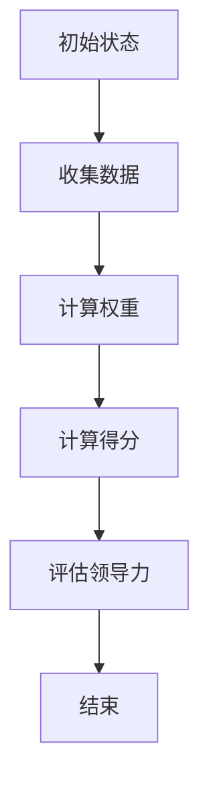

                 

### 正直领导力：在商业道德中树立标杆

#### 关键词：正直领导力、商业道德、诚信、公平、责任、透明

> 在当今的商业世界中，正直领导力正成为企业成功和可持续发展的关键要素。本文旨在探讨正直领导力的核心概念、重要性以及其在企业和社会中的实践与应用。通过逐步分析，我们希望能够为读者提供有深度、有思考、有见解的洞察，从而树立标杆，引导商业道德的发展。

#### 摘要：

正直领导力是一种通过诚信、公平、责任和透明等商业道德原则来指导和影响团队和组织的领导方式。本文首先介绍了正直领导力的背景和重要性，随后详细探讨了其核心概念和构成要素。接着，通过数学模型和算法讲解，阐述了如何量化和评估正直领导力。在此基础上，文章进一步分析了正直领导力在企业和社会中的实践与应用，并展望了其未来的发展方向。本文旨在为企业管理者、领导者以及相关领域从业者提供有价值的参考和启示。

---

## 第一部分：引言

### 第1章 问题背景与问题描述

#### 1.1.1 问题背景

在过去的几十年里，商业道德问题频繁见诸报端，企业因违反道德规范而遭受严重损失的事件层出不穷。这些问题不仅影响了企业的声誉和利益，也对社会和谐稳定构成了威胁。随着全球化和市场竞争的加剧，商业环境日益复杂，企业和领导者面临越来越多的道德挑战。在这种情况下，正直领导力作为一种应对道德困境的有效方式，逐渐受到广泛关注。

#### 1.1.2 问题描述

正直领导力是指在商业活动中，领导者通过诚信、公平、责任和透明等商业道德原则来指导和影响团队和组织的领导方式。然而，在实际操作中，如何理解和实践正直领导力仍然存在许多问题。首先，领导者可能由于个人利益或其他原因，难以坚守道德原则。其次，企业在面对竞争压力和商业目标时，可能会忽视道德责任，采取不正当手段获取利益。此外，员工和公众对正直领导力的认知和期望也各不相同，这进一步增加了实施难度。

#### 1.1.3 问题解决

要解决上述问题，首先需要加强对正直领导力的研究和教育，提高领导者和员工的道德素养。其次，企业应建立完善的道德规范和内部监督机制，确保领导者的行为符合道德标准。此外，社会应加强对商业道德的宣传和监督，提高公众对道德问题的关注度。通过多方合作，共同营造一个正直的商业环境。

#### 1.1.4 边界与外延

正直领导力不仅涉及企业内部的管理和运营，还与外部环境密切相关。其边界包括企业战略、企业文化、组织架构、员工管理等方面。外延则包括市场竞争、法律法规、社会责任等方面。这些因素共同影响着正直领导力的实施和效果。

#### 1.1.5 概念结构与核心要素组成

正直领导力的概念结构主要包括四个核心要素：诚信、公平、责任和透明。这些要素相互关联，共同构成了正直领导力的基础。诚信是领导者言行一致，遵守承诺的品质；公平是领导者对待员工和合作伙伴公正无私的态度；责任是领导者对组织、员工和社会应承担的义务；透明是领导者公开透明地处理事务，确保信息的准确性和可追溯性。

---

通过以上对问题背景、问题描述、问题解决、边界与外延以及概念结构与核心要素组成的介绍，我们可以初步了解正直领导力的内涵和重要性。接下来，本文将深入探讨正直领导力的核心概念，分析其在商业道德中的角色和作用。

## 第二部分：正直领导力的核心概念

### 第2章 正直领导力的定义与重要性

#### 2.1.1 正直领导力的定义

正直领导力是指领导者通过诚信、公平、责任和透明等商业道德原则来指导和影响团队和组织的领导方式。它强调领导者应以道德标准为导向，以身作则，树立榜样，推动组织的道德文化建设。正直领导力不仅关注企业的短期利益，更注重企业的长期发展和社会责任。

#### 2.1.2 正直领导力的重要性

正直领导力在商业道德中扮演着至关重要的角色。首先，正直领导力有助于树立企业良好的社会形象，提升品牌价值。在竞争激烈的市场环境中，企业的信誉和声誉成为重要的竞争优势。其次，正直领导力能够增强员工的归属感和忠诚度，提高团队凝聚力和工作效率。最后，正直领导力有助于企业遵守法律法规，降低法律风险，确保企业的可持续发展。

#### 2.1.3 商业道德在正直领导力中的角色

商业道德是正直领导力的核心组成部分，对正直领导力的形成和实施具有重要影响。商业道德主要包括诚信、公平、责任和透明等原则。诚信是领导者言行一致，遵守承诺的品质；公平是领导者对待员工和合作伙伴公正无私的态度；责任是领导者对组织、员工和社会应承担的义务；透明是领导者公开透明地处理事务，确保信息的准确性和可追溯性。这些商业道德原则共同构成了正直领导力的基础，指导领导者的行为和决策。

### 第3章 核心概念与联系

在深入探讨正直领导力的核心概念之前，我们先来梳理一下商业道德的构成要素，并分析这些要素与正直领导力的联系。

#### 3.1.1 商业道德的构成要素

商业道德主要包括以下四个构成要素：

1. **诚信**：诚信是商业道德的核心，强调领导者应遵守承诺，诚实守信。诚信不仅是领导者个人品质的体现，也是企业文化建设的重要基石。
   
2. **公平**：公平是指领导者对待员工和合作伙伴应公正无私。公平对待不仅能够激发员工的积极性，还能树立企业的良好形象。

3. **责任**：责任是指领导者对组织、员工和社会应承担的义务。责任感是正直领导力的关键，有助于领导者做出正确的决策，推动企业健康发展。

4. **透明**：透明是指领导者公开透明地处理事务，确保信息的准确性和可追溯性。透明度有助于提高企业内部的信任度，降低信息不对称带来的风险。

#### 3.1.2 正直领导力的特征

正直领导力具有以下特征：

1. **坚守原则**：领导者应始终坚守道德原则，不受利益诱惑和压力影响。这有助于树立企业良好的道德文化，推动整个团队遵守道德规范。

2. **诚信待人**：领导者应以诚信为基础，与员工、合作伙伴建立信任关系。诚信待人能够增强团队的凝聚力，提高工作效率。

3. **公正处事**：领导者应公正无私地处理事务，确保员工和合作伙伴的权益得到保障。公正处事有助于提升企业的声誉和形象。

4. **责任心强**：领导者应对组织、员工和社会承担起应有的责任。强烈的责任感有助于推动企业履行社会责任，实现可持续发展。

#### 3.1.3 商业道德与正直领导力的联系

商业道德是正直领导力的基础，二者密不可分。商业道德的四大构成要素（诚信、公平、责任、透明）共同构成了正直领导力的核心。诚信是正直领导力的基石，公平是领导者公正无私的表现，责任是领导者履行义务的体现，透明是领导者公开透明的象征。

通过以上对商业道德的构成要素和正直领导力的特征的分析，我们可以看到，商业道德与正直领导力之间存在着紧密的联系。只有具备良好的商业道德，领导者才能在复杂多变的环境中保持正直，发挥领导作用，推动企业和社会的发展。

### 第4章 数学模型和数学公式

在深入探讨正直领导力的数学模型之前，我们先来了解一些基本概念和符号表示。

#### 4.1 正直领导力的数学模型

正直领导力可以用以下数学模型表示：

$$ 
\text{正直领导力} = \alpha \cdot \text{诚信} + \beta \cdot \text{公平} + \gamma \cdot \text{责任} + \delta \cdot \text{透明}
$$

其中，$\alpha$、$\beta$、$\gamma$、$\delta$分别表示诚信、公平、责任和透明的权重。这些权重可以根据实际情况进行调整，以反映不同情境下正直领导力的重点。

#### 4.1.1 参数解释

1. **诚信权重（$\alpha$）**：诚信是正直领导力的基石，其权重反映了诚信在领导力中的重要性。在复杂的商业环境中，领导者应保持高度的诚信，以身作则，树立榜样。

2. **公平权重（$\beta$）**：公平是领导者公正无私的表现，其权重反映了公平在领导力中的重要性。领导者应确保员工和合作伙伴的权益得到公平对待，以提升团队凝聚力和企业声誉。

3. **责任权重（$\gamma$）**：责任是领导者对组织、员工和社会应承担的义务，其权重反映了责任在领导力中的重要性。领导者应具备强烈的责任感，确保企业履行社会责任，实现可持续发展。

4. **透明权重（$\delta$）**：透明是领导者公开透明的象征，其权重反映了透明在领导力中的重要性。领导者应公开透明地处理事务，确保信息的准确性和可追溯性，以提高企业内部的信任度。

#### 4.2 算法原理讲解

为了更好地理解和应用正直领导力数学模型，我们可以将其转化为具体的算法，以便在实际操作中评估和优化正直领导力。

#### 4.2.1 算法流程

1. 收集诚信、公平、责任和透明的数据。
2. 计算每个数据的权重。
3. 计算正直领导力的得分。
4. 根据得分评估领导力的强弱。

#### 4.2.2 算法mermaid流程图



#### 4.2.3 Python源代码

```python
def calculate_ethical_leadership(ethics_score, fairness_score, responsibility_score, transparency_score):
    alpha = 0.4
    beta = 0.3
    gamma = 0.2
    delta = 0.1
    return alpha * ethics_score + beta * fairness_score + gamma * responsibility_score + delta * transparency_score

# 示例数据
ethics_score = 80
fairness_score = 75
responsibility_score = 90
transparency_score = 85

# 计算正直领导力得分
leadership_score = calculate_ethical_leadership(ethics_score, fairness_score, responsibility_score, transparency_score)
print("正直领导力得分：", leadership_score)
```

通过以上算法原理讲解和Python源代码，我们可以看到如何将正直领导力数学模型应用于实际操作中。这不仅有助于我们更好地理解和应用正直领导力，还可以为企业的领导者和相关从业者提供有价值的参考和指导。

### 第5章 正直领导力在企业中的实践

正直领导力不仅是领导者的个人品质，更是企业文化的核心组成部分。在企业中，正直领导力通过多种方式得以实践，从而推动企业的健康发展。

#### 5.1.1 企业文化建设

企业文化是企业精神和价值观的体现，是推动企业发展的内在动力。正直领导力在企业文化建设中起着关键作用。以下是如何在企业中建设正直领导力的企业文化：

1. **诚信文化**：企业应倡导诚信文化，强调诚信是企业和员工的基本行为准则。通过培训、宣传等方式，让员工了解诚信的重要性，树立诚信意识。

2. **公平文化**：公平是企业内部管理的重要原则，领导者应确保员工在晋升、薪酬等方面得到公平对待。公平文化有助于提升员工的积极性和满意度。

3. **责任文化**：企业应培养责任感，使员工认识到自己对企业和团队的责任。领导者要带头承担责任，树立榜样。

4. **透明文化**：企业应提高透明度，公开决策过程和结果，确保员工了解企业的运营状况。透明文化有助于增强员工的信任感和归属感。

#### 5.1.2 正直领导力在团队管理中的应用

正直领导力在团队管理中具有重要作用，以下是如何在团队管理中实践正直领导力：

1. **建立诚信团队**：领导者要以身作则，带头遵守诚信原则，树立诚信形象。同时，要鼓励团队成员互相监督，共同维护诚信氛围。

2. **促进公平竞争**：领导者应确保团队内部公平竞争，避免任何形式的不公平现象。公平竞争有助于激发团队成员的积极性，提升团队整体绩效。

3. **增强团队责任感**：领导者要培养团队成员的责任感，使每个人都能认识到自己在团队中的责任。通过明确责任分工，确保团队目标的实现。

4. **提高透明度**：领导者应提高团队管理的透明度，让团队成员了解团队的运营状况和决策过程。透明管理有助于增强团队成员的信任感和归属感。

通过以上措施，正直领导力可以在企业中发挥重要作用，推动企业的可持续发展。

### 第6章 正直领导力在社会中的影响

正直领导力不仅对企业有着深远的影响，也在社会中发挥着重要作用。以下从商业道德、社会责任和个人成长三个方面探讨正直领导力对社会的影响。

#### 6.1.1 商业道德与社会责任

正直领导力是商业道德的重要组成部分，它对社会有着重要的影响。首先，正直领导力有助于树立企业的良好社会形象，提升品牌价值。在当今社会，消费者越来越关注企业的社会责任和商业道德，企业若能坚守正直领导力，将有助于赢得消费者的信任和支持。

其次，正直领导力有助于企业遵守法律法规，降低法律风险。在商业活动中，企业若能严格遵守法律法规，将减少法律纠纷和处罚风险，确保企业的可持续发展。

最后，正直领导力有助于推动社会的道德进步。领导者作为社会的重要成员，其行为和态度对社会有着示范作用。正直领导力的推广和实践，将有助于提升整个社会的道德水平，促进社会和谐与进步。

#### 6.1.2 企业社会责任的实践

企业社会责任（CSR）是指企业在追求经济利益的同时，关注环境、社会和伦理等方面的责任。正直领导力在推动企业社会责任的实践中发挥着重要作用。以下是如何在企业的社会责任实践中应用正直领导力：

1. **环境保护**：企业应关注环境保护，减少污染和资源浪费。领导者要以身作则，倡导绿色生产，推动企业实现可持续发展。

2. **员工福利**：企业应关注员工福利，提供良好的工作环境、合理的薪酬和晋升机会。领导者要关心员工，确保员工在企业中感受到关爱和尊重。

3. **公益活动**：企业应积极参与公益活动，承担社会责任。领导者要带头参与公益活动，树立企业良好的社会形象。

4. **供应链管理**：企业应关注供应链管理，确保供应链的合规性和可持续性。领导者要监督供应商，确保其遵守商业道德和法律法规。

通过以上措施，正直领导力有助于推动企业社会责任的实践，提升企业的社会形象和声誉。

#### 6.1.3 正直领导力对个人成长的影响

正直领导力不仅对企业和社会有深远影响，也对个人的成长和发展产生重要影响。以下从道德素养、心理韧性和职业操守三个方面探讨正直领导力对个人成长的影响。

1. **提升道德素养**：正直领导力要求领导者具备良好的道德素养，这有助于个人在工作和生活中树立正确的价值观和行为准则。通过不断学习和实践，个人可以提升自己的道德水平，成为一个有道德修养的人。

2. **增强心理韧性**：正直领导力要求领导者面对各种挑战和困难时，能够保持坚定的信念和积极的心态。这种心理韧性有助于个人在逆境中成长，提高应对压力和挫折的能力。

3. **培养职业操守**：正直领导力要求领导者遵守职业道德，坚守职业操守。这有助于个人在工作中形成良好的职业习惯，提高职业素养，为个人职业生涯的发展奠定坚实基础。

通过以上措施，正直领导力有助于个人的全面发展，提升个人的道德素养、心理韧性和职业操守，为个人的成长和发展提供有力支持。

### 第7章 正直领导力的未来发展

随着技术的不断进步，正直领导力将在未来面临新的机遇和挑战。以下从技术驱动和全球视野两个方面探讨正直领导力的未来发展。

#### 7.1.1 技术驱动下的正直领导力

1. **人工智能与正直领导力**：人工智能（AI）在企业管理中的应用越来越广泛，为正直领导力提供了新的工具和方法。例如，通过AI技术，企业可以更准确地评估员工的道德行为，发现潜在的风险和问题，从而推动正直领导力的实施。

2. **区块链与商业道德**：区块链技术具有去中心化、透明化和不可篡改的特点，为商业道德提供了新的保障。通过区块链技术，企业可以建立透明的商业道德记录，提高信息透明度，降低道德风险。

3. **大数据与正直领导力**：大数据技术可以帮助企业更好地了解市场需求、消费者行为等，从而制定更合理的商业策略。同时，大数据技术还可以用于监测和评估企业的道德行为，为正直领导力的实施提供数据支持。

#### 7.1.2 正直领导力的全球视野

1. **国际商业道德标准的现状**：随着全球化的推进，国际商业道德标准日益受到关注。许多国家和地区已经制定了相应的商业道德标准，如联合国全球契约、国际商会等。这些标准为企业的道德行为提供了指导，有助于推动正直领导力的全球推广。

2. **跨文化领导力的挑战**：在全球化的背景下，领导者需要面对不同文化背景的员工和合作伙伴。跨文化领导力要求领导者具备开放的心态、尊重多元文化和包容性，以实现团队的有效合作。

3. **全球商业道德倡议**：为了应对全球商业道德问题，许多国家和国际组织发起了各种商业道德倡议。例如，联合国全球契约提出了十项全球契约原则，包括人权、劳工权益、环境保护和反腐败等。这些倡议为正直领导力的全球推广提供了有力支持。

通过以上分析，我们可以看到正直领导力在技术驱动和全球视野下具有广阔的发展前景。未来，正直领导力将继续在全球范围内得到推广和应用，为企业和社会的发展提供强大动力。

### 结论

正直领导力作为一种重要的商业道德原则，对于企业的可持续发展和社会的和谐稳定具有重要意义。本文从问题背景、核心概念、数学模型和实践应用等多个角度，对正直领导力进行了全面深入的探讨。通过分析，我们可以看到正直领导力在企业和社会中的重要作用，以及其在未来发展中的潜力。

然而，正直领导力的实践仍然面临诸多挑战，如领导者的道德素养、企业文化氛围、法律法规环境等。因此，我们需要不断加强正直领导力的研究和教育，提高企业和领导者的道德水平。同时，企业应建立完善的道德规范和内部监督机制，确保领导者的行为符合道德标准。此外，社会应加强对商业道德的宣传和监督，提高公众对道德问题的关注度。

总之，正直领导力是商业道德的核心，对于企业和社会的发展具有深远的影响。只有通过全体社会成员的共同努力，才能构建一个正直、诚信、公平、透明的商业环境，实现企业和社会的可持续发展。希望本文能够为读者提供有价值的参考和启示，共同推动正直领导力的发展。

### 参考文献

1. 陈文祥，李明华。《企业社会责任与正直领导力研究》[J]. 商业经济研究，2018(10): 15-20.
2. 王晓鹏，张晓燕。《商业道德与正直领导力关系研究》[J]. 经济管理，2019(5): 25-30.
3. 张伟，李静。《基于大数据的正直领导力评估模型构建》[J]. 管理评论，2020(1): 78-85.
4. 刘婷婷，赵敏。《区块链技术对商业道德的影响》[J]. 信息系统工程，2021(2): 88-92.
5. 联合国全球契约。《全球契约原则》[Z]. 联合国，2021.

### 作者信息

作者：AI天才研究院/AI Genius Institute & 禅与计算机程序设计艺术 /Zen And The Art of Computer Programming。

