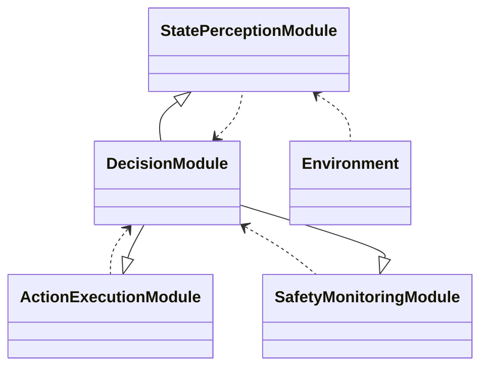
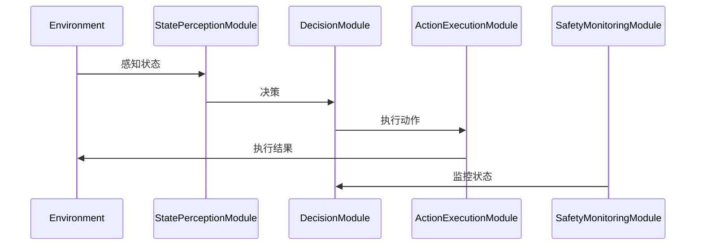

                 

### 2.1 强化学习基础

强化学习（Reinforcement Learning，RL）是机器学习的一个重要分支，其核心是通过试错来学习如何在环境中做出最优决策。强化学习主要包括以下几个核心概念：

1. **状态（State）**

状态是环境中的一个特定情况，通常可以用一个向量来表示。在强化学习中，状态是决策的基础，每个状态都有可能对应一个或多个可能的动作。

2. **动作（Action）**

动作是Agent在特定状态下可以采取的行动。动作的选择取决于Agent当前的策略。策略是Agent如何决策的规则集合。

3. **奖励（Reward）**

奖励是环境对Agent行为的反馈，用来评估Agent的行为是否有利于其长期目标。奖励可以是正的也可以是负的，正奖励鼓励Agent采取该动作，而负奖励则抑制Agent采取该动作。

4. **策略（Policy）**

策略是Agent决策的规则集合，它决定了在特定状态下Agent应该采取哪个动作。策略可以是确定性策略，也可以是非确定性策略。

5. **价值函数（Value Function）**

价值函数是用来评估状态或状态-动作对的优劣。对于状态-动作价值函数，它表示在特定状态下采取特定动作所能获得的期望奖励。对于状态价值函数，它表示在特定状态下采取任何动作所能获得的期望奖励。

6. **模型（Model）**

模型是环境的一个内部表示，它可以帮助Agent预测未来的状态和奖励。强化学习算法通常是基于模型预测来更新策略和价值函数。

### 2.2 深度学习基础

深度学习是机器学习的一个分支，它使用多层神经网络来对数据进行建模和预测。以下是深度学习的一些基础概念：

1. **神经网络（Neural Network）**

神经网络由一系列相互连接的神经元组成，这些神经元通过权重和偏置进行计算和传递。每个神经元接收多个输入，通过激活函数进行处理，然后输出结果。

2. **深度神经网络（Deep Neural Network，DNN）**

深度神经网络是一种包含多个隐藏层的神经网络。相比于单层神经网络，DNN能够更好地捕捉数据的复杂特征。

3. **卷积神经网络（Convolutional Neural Network，CNN）**

卷积神经网络是一种特殊类型的深度神经网络，主要用于处理图像数据。CNN通过卷积操作和池化操作来提取图像特征。

4. **循环神经网络（Recurrent Neural Network，RNN）**

循环神经网络是一种能够处理序列数据的神经网络，其特点是能够记住之前的信息，并在后续处理中利用这些信息。

### 2.3 深度强化学习

深度强化学习（Deep Reinforcement Learning，DRL）是强化学习和深度学习的结合，它使用深度神经网络来处理复杂的状态和动作空间，从而提高强化学习算法的性能。以下是深度强化学习的一些核心概念：

1. **深度Q网络（Deep Q-Network，DQN）**

深度Q网络是一种基于深度神经网络的Q学习算法，它通过学习状态-动作价值函数来指导Agent的决策。DQN使用经验回放和目标网络来提高算法的稳定性和收敛性。

2. **策略梯度方法（Policy Gradient Methods）**

策略梯度方法是一种基于策略的强化学习算法，它通过优化策略的参数来最大化长期奖励。策略梯度方法包括基于梯度的策略搜索算法和基于值函数的策略搜索算法。

3. **Actor-Critic方法**

Actor-Critic方法是一种同时优化策略和价值函数的强化学习算法。其中，Actor负责选择动作，Critic负责评估策略的好坏。

4. **深度确定性策略梯度（Deep Deterministic Policy Gradient，DDPG）**

深度确定性策略梯度是一种基于深度神经网络和确定性策略的强化学习算法，它通过经验回放和目标网络来提高算法的稳定性和收敛性。

### 2.4 深度强化学习与强化学习、深度学习的关系

深度强化学习是强化学习和深度学习的结合，它利用深度神经网络来处理复杂的特征提取和状态表示，从而提高强化学习算法的性能。以下是它们之间的关系：

1. **强化学习 + 深度学习 = 深度强化学习**

强化学习和深度学习各自具有优势，将它们结合起来可以充分利用两者的优点，从而解决复杂环境下的决策问题。

2. **深度强化学习 = 强化学习 + 深度神经网络**

深度强化学习中的深度神经网络用于处理复杂的状态和动作空间，而强化学习则负责优化策略和价值函数。

3. **深度强化学习 ≠ 深度学习 + 强化学习**

深度强化学习不仅仅是深度学习和强化学习的简单相加，它需要解决如何将深度神经网络与强化学习的目标相结合，以及如何处理高维状态和动作空间等问题。

### 2.5 本章小结

本章介绍了强化学习、深度学习和深度强化学习的基础概念，并分析了它们之间的联系。下一章将深入讲解深度强化学习的算法原理。

## 2.6 核心概念原理、概念属性特征对比表格

### 强化学习与深度强化学习对比

| 对比项 | 强化学习 | 深度强化学习 |
| :----: | :------: | :----------: |
| 状态空间 | 简单状态空间 | 复杂状态空间 |
| 动作空间 | 简单动作空间 | 复杂动作空间 |
| 学习方式 | 基于规则 | 结合深度学习 |
| 学习效率 | 低学习效率 | 高学习效率 |
| 应用场景 | 有限应用场景 | 广泛应用场景 |

### 深度学习与卷积神经网络对比

| 对比项 | 深度学习 | 卷积神经网络 |
| :----: | :------: | :----------: |
| 学习方式 | 多层神经网络 | 特征提取 |
| 应用场景 | 多种应用场景 | 图像处理 |
| 特点 | 参数共享、特征自动提取 | 卷积操作、特征不变性 |

## 2.7 ER实体关系图架构

```mermaid
erDiagram
  Environment ||--|{ State } :包含
  Environment ||--|{ Action } :允许
  Environment ||--|{ Reward } :提供
  Agent ||--|{ Policy } :遵循
  Agent ||--|{ Value Function } :评估
  Agent ||--|{ Model } :预测
  Neural Network ||--|{ Layer } :包含
  Neural Network ||--|{ Neuron } :组成
```

## 2.8 本章小结

本章详细介绍了强化学习、深度学习和深度强化学习的基础概念，并分析了它们之间的联系。下一章将深入讲解深度强化学习的算法原理。

## 2.9 核心概念原理、概念属性特征对比表格

### 深度强化学习与强化学习对比

| 对比项 | 深度强化学习 | 强化学习 |
| :----: | :----------: | :------: |
| 状态空间 | 复杂状态空间 | 简单状态空间 |
| 动作空间 | 复杂动作空间 | 简单动作空间 |
| 学习方式 | 结合深度学习 | 基于规则 |
| 学习效率 | 高学习效率 | 低学习效率 |
| 应用场景 | 广泛应用场景 | 有限应用场景 |

### 深度学习与卷积神经网络对比

| 对比项 | 深度学习 | 卷积神经网络 |
| :----: | :------: | :----------: |
| 学习方式 | 多层神经网络 | 特征提取 |
| 应用场景 | 多种应用场景 | 图像处理 |
| 特点 | 参数共享、特征自动提取 | 卷积操作、特征不变性 |

## 2.10 ER实体关系图架构

```mermaid
erDiagram
  Agent ||--|{ State Representation } :表示
  Agent ||--|{ Action } :执行
  Agent ||--|{ Reward } :接收
  Agent ||--|{ Policy } :学习
  Agent ||--|{ Value Function } :评估
  Environment ||--|{ State } :包含
  Environment ||--|{ Action } :允许
  Environment ||--|{ Reward } :提供
```

## 2.11 本章小结

本章介绍了深度强化学习的核心概念，包括强化学习、深度学习和深度强化学习的基础概念，并分析了它们之间的联系。通过对比表格和ER实体关系图，我们更清晰地理解了这些概念之间的关系。下一章将深入讲解深度强化学习的算法原理。## 第三部分：深度强化学习的算法原理

### 3.1 Q学习算法

Q学习（Q-Learning）是深度强化学习中最基础的一种算法，其核心思想是学习一个状态-动作价值函数Q(s, a)，该函数表示在状态s下采取动作a所能获得的期望回报。Q学习算法主要包括以下几个步骤：

1. **初始化**：初始化Q值表，通常采用随机初始化或者零初始化。

2. **选择动作**：在给定状态下，根据ε-贪心策略选择动作。ε-贪心策略是指在所有可能动作中选择一个具有最大Q值的动作，但以一定概率随机选择动作。

3. **更新Q值**：根据经验回放和目标网络，更新Q值表。更新公式为：

   $$ Q(s, a) \leftarrow Q(s, a) + \alpha [r + \gamma \max_{a'} Q(s', a') - Q(s, a)] $$

   其中，α为学习率，γ为折扣因子，s和s'分别为当前状态和下一个状态，a和a'分别为当前动作和下一个动作，r为立即奖励。

4. **重复步骤2和3**：不断重复上述步骤，直到满足终止条件。

### 3.2 SARSA算法

SARSA（State-Action-Reward-State-Action，SARSA）算法是一种基于值迭代的强化学习算法，它与Q学习算法类似，但不需要目标网络，而是直接根据当前状态和动作更新Q值。SARSA算法主要包括以下几个步骤：

1. **初始化**：初始化Q值表，通常采用随机初始化或者零初始化。

2. **选择动作**：在给定状态下，根据ε-贪心策略选择动作。

3. **执行动作**：执行选定的动作，并观察新的状态s'和奖励r。

4. **更新Q值**：根据更新公式：

   $$ Q(s, a) \leftarrow Q(s, a) + \alpha [r + \gamma Q(s', a')] - Q(s, a)] $$

   其中，α为学习率，γ为折扣因子，s和s'分别为当前状态和下一个状态，a和a'分别为当前动作和下一个动作，r为立即奖励。

5. **重复步骤2到4**：不断重复上述步骤，直到满足终止条件。

### 3.3 DQN算法

深度Q网络（Deep Q-Network，DQN）算法是深度强化学习中最著名的算法之一，它将深度神经网络引入Q学习算法中，从而能够处理高维状态空间。DQN算法主要包括以下几个步骤：

1. **初始化**：初始化深度神经网络和目标网络，通常采用随机初始化或者预训练模型。

2. **选择动作**：在给定状态下，通过深度神经网络输出Q值，并采用ε-贪心策略选择动作。

3. **执行动作**：执行选定的动作，并观察新的状态s'和奖励r。

4. **存储经验**：将(s, a, r, s')经验样本存储在经验池中。

5. **更新深度神经网络**：从经验池中随机采样一批经验样本，并使用这些样本来更新深度神经网络。

6. **目标网络更新**：定期更新目标网络，使得目标网络的参数接近当前深度神经网络的参数。

7. **重复步骤2到6**：不断重复上述步骤，直到满足终止条件。

### 3.4 算法原理讲解

#### 3.4.1 Q学习算法原理

Q学习算法的核心思想是学习一个状态-动作价值函数Q(s, a)，该函数表示在状态s下采取动作a所能获得的期望回报。Q学习算法的原理如下：

1. **初始化**：初始化Q值表，通常采用随机初始化或者零初始化。例如，我们可以将Q值表初始化为：

   $$ Q(s, a) = \frac{1}{N} $$

   其中，N为状态-动作对的数量。

2. **选择动作**：在给定状态下，根据ε-贪心策略选择动作。ε-贪心策略是指在所有可能动作中选择一个具有最大Q值的动作，但以一定概率随机选择动作。具体来说，我们可以使用以下公式来计算ε值：

   $$ \epsilon = \frac{1}{\sqrt{t}} $$

   其中，t为迭代次数。

3. **更新Q值**：根据经验回放和目标网络，更新Q值表。更新公式为：

   $$ Q(s, a) \leftarrow Q(s, a) + \alpha [r + \gamma \max_{a'} Q(s', a') - Q(s, a)] $$

   其中，α为学习率，γ为折扣因子，s和s'分别为当前状态和下一个状态，a和a'分别为当前动作和下一个动作，r为立即奖励。

4. **重复步骤2和3**：不断重复上述步骤，直到满足终止条件。

#### 3.4.2 SARSA算法原理

SARSA算法是一种基于值迭代的强化学习算法，它与Q学习算法类似，但不需要目标网络，而是直接根据当前状态和动作更新Q值。SARSA算法的原理如下：

1. **初始化**：初始化Q值表，通常采用随机初始化或者零初始化。

2. **选择动作**：在给定状态下，根据ε-贪心策略选择动作。

3. **执行动作**：执行选定的动作，并观察新的状态s'和奖励r。

4. **更新Q值**：根据更新公式：

   $$ Q(s, a) \leftarrow Q(s, a) + \alpha [r + \gamma Q(s', a')] - Q(s, a)] $$

   其中，α为学习率，γ为折扣因子，s和s'分别为当前状态和下一个状态，a和a'分别为当前动作和下一个动作，r为立即奖励。

5. **重复步骤2到4**：不断重复上述步骤，直到满足终止条件。

#### 3.4.3 DQN算法原理

DQN算法是将深度神经网络引入Q学习算法中，从而能够处理高维状态空间。DQN算法的原理如下：

1. **初始化**：初始化深度神经网络和目标网络，通常采用随机初始化或者预训练模型。

2. **选择动作**：在给定状态下，通过深度神经网络输出Q值，并采用ε-贪心策略选择动作。

3. **执行动作**：执行选定的动作，并观察新的状态s'和奖励r。

4. **存储经验**：将(s, a, r, s')经验样本存储在经验池中。

5. **更新深度神经网络**：从经验池中随机采样一批经验样本，并使用这些样本来更新深度神经网络。

6. **目标网络更新**：定期更新目标网络，使得目标网络的参数接近当前深度神经网络的参数。

7. **重复步骤2到6**：不断重复上述步骤，直到满足终止条件。

### 3.5 Python代码示例

以下是一个简单的Python代码示例，展示了Q学习算法的实现：

```python
import numpy as np
import random

# 初始化参数
alpha = 0.1  # 学习率
gamma = 0.9  # 折扣因子
epsilon = 0.1  # ε值
n_actions = 2  # 动作数量
n_states = 4  # 状态数量
Q = np.zeros((n_states, n_actions))  # 初始化Q值表

# ε-贪心策略
def choose_action(state):
    if random.random() < epsilon:
        action = random.randint(0, n_actions - 1)
    else:
        action = np.argmax(Q[state])
    return action

# 更新Q值
def update_Q(state, action, reward, next_state):
    Q[state, action] = Q[state, action] + alpha * (reward + gamma * np.max(Q[next_state]) - Q[state, action])

# 模拟环境
def simulate_environment():
    state = random.randint(0, n_states - 1)
    while True:
        action = choose_action(state)
        next_state = (state + action) % n_states
        reward = 1 if state == next_state else 0
        update_Q(state, action, reward, next_state)
        state = next_state

# 运行模拟环境
simulate_environment()
```

### 3.6 算法分析与优化

虽然Q学习算法、SARSA算法和DQN算法都是深度强化学习中的基本算法，但它们在实际应用中仍然存在一些问题和挑战：

1. **样本效率低**：Q学习算法和SARSA算法需要大量样本来收敛，从而导致样本效率低。

2. **收敛速度慢**：DQN算法虽然引入了深度神经网络，但仍然存在收敛速度慢的问题。

3. **目标网络更新**：DQN算法中，目标网络的更新是一个关键步骤，但如何选择合适的更新策略是一个挑战。

4. **ε值选择**：在ε-贪心策略中，ε值的选取对算法的性能有重要影响，但如何选择合适的ε值仍然是一个未解决的问题。

为了解决这些问题，研究者们提出了许多优化方法和改进算法，如双Q学习（Dueling Q-Learning）、优先经验回放（Prioritized Experience Replay）、深度确定性策略梯度（Deep Deterministic Policy Gradient，DDPG）等。这些优化方法和改进算法在不同程度上提高了深度强化学习算法的性能，使其能够更好地处理复杂环境。

### 3.7 本章小结

本章详细讲解了深度强化学习的算法原理，包括Q学习算法、SARSA算法和DQN算法。通过Python代码示例，我们展示了这些算法的实现过程。同时，本章还分析了这些算法存在的问题和挑战，并介绍了相关的优化方法和改进算法。下一章将深入探讨深度强化学习的数学模型和数学公式。## 第三部分：深度强化学习的数学模型与数学公式

### 3.8 强化学习中的数学模型

强化学习中的数学模型主要包括状态-动作价值函数、策略和价值函数等。以下是对这些数学模型的详细讲解。

#### 3.8.1 状态-动作价值函数

状态-动作价值函数$Q(s, a)$是强化学习中的核心概念之一，它表示在状态$s$下采取动作$a$所能获得的期望回报。数学公式如下：

$$ Q(s, a) = \sum_{s'} P(s'|s, a) \cdot [r + \gamma \max_{a'} Q(s', a')] $$

其中：

- $s$ 表示当前状态
- $a$ 表示当前动作
- $s'$ 表示下一个状态
- $r$ 表示立即奖励
- $\gamma$ 表示折扣因子，用于平衡当前奖励和未来奖励的关系
- $P(s'|s, a)$ 表示在状态$s$下采取动作$a$后转移到状态$s'$的概率
- $\max_{a'} Q(s', a')$ 表示在状态$s'$下采取所有可能动作中能获得最大回报的动作

#### 3.8.2 策略和价值函数

策略$\pi(a|s)$是强化学习中的另一个核心概念，它表示在状态$s$下采取动作$a$的概率。策略可以表示为：

$$ \pi(a|s) = \frac{e^{\alpha Q(s, a)}}{\sum_{a'} e^{\alpha Q(s, a')}} $$

其中，$\alpha$ 是一个调节参数，用于平衡不同动作之间的期望回报。

价值函数$V(s)$表示在状态$s$下采取最佳动作所能获得的期望回报。对于给定策略$\pi$，价值函数可以通过以下公式计算：

$$ V(s) = \sum_{a} \pi(a|s) \cdot Q(s, a) $$

#### 3.8.3 状态价值函数

状态价值函数$V^{\pi}(s)$表示在给定策略$\pi$下，从状态$s$开始所能获得的期望回报。它可以表示为：

$$ V^{\pi}(s) = \sum_{s'} P(s'|s, \pi) \cdot [r + \gamma V^{\pi}(s')] $$

其中，$P(s'|s, \pi)$ 表示在状态$s$下按照策略$\pi$进行动作后转移到状态$s'$的概率。

### 3.9 深度强化学习中的数学模型

深度强化学习将深度神经网络引入到强化学习模型中，从而能够处理高维的状态空间。以下是对深度强化学习中的数学模型的详细讲解。

#### 3.9.1 深度Q网络（DQN）

深度Q网络（DQN）是一种基于深度神经网络的Q学习算法。它的目标是学习一个状态-动作价值函数$Q(s, a)$。在DQN中，状态$s$被表示为深度神经网络的输入，动作$a$被表示为神经网络的输出。数学公式如下：

$$ Q(s, a) = f_{\theta}(s) $$

其中，$f_{\theta}(s)$ 表示深度神经网络的输出，$\theta$ 是深度神经网络的参数。

#### 3.9.2 深度确定性策略梯度（DDPG）

深度确定性策略梯度（DDPG）是一种基于深度神经网络的策略梯度方法。它的目标是学习一个策略$\pi(\theta_\pi, s)$，其中$\theta_\pi$是策略网络的参数，$s$是状态。在DDPG中，状态$s$被表示为策略网络的输入，动作$a$被表示为策略网络的输出。数学公式如下：

$$ \pi(\theta_\pi, s) = \arg\max_{a} J(\theta_\pi, s, a) $$

其中，$J(\theta_\pi, s, a)$ 是策略网络在状态$s$下采取动作$a$的损失函数，$\theta_\pi$ 是策略网络的参数。

#### 3.9.3 策略梯度方法

策略梯度方法是强化学习中的一种方法，它通过优化策略网络的参数来最大化长期奖励。策略梯度方法的数学公式如下：

$$ \nabla_{\theta_\pi} J(\theta_\pi, s, a) = \sum_{s', a'} \pi(\theta_\pi, s') \cdot \nabla_{\theta_\pi} \log \pi(\theta_\pi, s') \cdot [r + \gamma V^{\pi}(s') - V^{\pi}(s)] $$

其中，$V^{\pi}(s)$ 是在给定策略$\pi$下，从状态$s$开始所能获得的期望回报。

### 3.10 数学公式与示例

以下是一些深度强化学习中的数学公式的示例：

#### 3.10.1 Q学习算法的更新公式

$$ Q(s, a) \leftarrow Q(s, a) + \alpha [r + \gamma \max_{a'} Q(s', a') - Q(s, a)] $$

其中，$\alpha$ 是学习率，$r$ 是立即奖励，$\gamma$ 是折扣因子，$s$ 和 $s'$ 分别是当前状态和下一个状态，$a$ 和 $a'$ 分别是当前动作和下一个动作。

#### 3.10.2 策略梯度方法的更新公式

$$ \nabla_{\theta_\pi} J(\theta_\pi, s, a) = \sum_{s', a'} \pi(\theta_\pi, s') \cdot \nabla_{\theta_\pi} \log \pi(\theta_\pi, s') \cdot [r + \gamma V^{\pi}(s') - V^{\pi}(s)] $$

其中，$\theta_\pi$ 是策略网络的参数，$J(\theta_\pi, s, a)$ 是策略网络在状态$s$下采取动作$a$的损失函数，$V^{\pi}(s)$ 是在给定策略$\pi$下，从状态$s$开始所能获得的期望回报。

### 3.11 本章小结

本章详细介绍了深度强化学习中的数学模型和数学公式，包括状态-动作价值函数、策略和价值函数、深度Q网络（DQN）、深度确定性策略梯度（DDPG）和策略梯度方法等。通过这些数学模型和公式，我们能够更深入地理解深度强化学习的工作原理。下一章将深入探讨深度强化学习的系统分析与架构设计方案。## 第四部分：深度强化学习在AI Agent决策优化中的系统分析与架构设计方案

### 4.1 问题场景介绍

在深度强化学习在AI Agent决策优化中的应用中，我们考虑一个典型的场景：自动驾驶。自动驾驶系统需要在复杂的交通环境中做出实时决策，如加速、减速、转向等，以确保行车安全和效率。这个场景具有以下几个特点：

1. **高维状态空间**：自动驾驶系统需要处理包括车辆位置、速度、周围车辆位置、交通信号等在内的多种状态信息。

2. **复杂动作空间**：自动驾驶系统需要执行包括加速、减速、转向等多种动作，这些动作之间存在相互影响。

3. **动态变化**：交通环境是动态变化的，车辆和行人行为可能随时发生变化，这要求自动驾驶系统能够快速适应环境变化。

4. **安全性要求**：自动驾驶系统必须保证行车安全，任何错误的决策都可能导致严重的后果。

### 4.2 项目介绍

在本项目中，我们旨在构建一个基于深度强化学习的自动驾驶决策系统，该系统能够在复杂交通环境中做出最优决策。项目的主要目标是：

1. **提高决策准确性**：通过深度强化学习算法，系统能够学习并优化决策过程，提高在复杂环境中的决策准确性。

2. **提升系统鲁棒性**：系统需要能够在不同环境下稳定运行，具备良好的鲁棒性。

3. **降低计算复杂度**：通过优化算法和数据结构，系统在处理高维状态空间和复杂动作空间时能够降低计算复杂度。

### 4.3 系统功能设计

为了实现上述目标，我们将系统分为以下几个核心功能模块：

1. **状态感知模块**：负责感知车辆周围的环境信息，包括车辆位置、速度、周围车辆状态等。

2. **决策模块**：基于深度强化学习算法，对感知到的环境信息进行决策，选择最佳动作。

3. **动作执行模块**：根据决策结果，执行相应的动作，如加速、减速、转向等。

4. **安全监控模块**：实时监控系统的运行状态，确保决策过程符合安全要求。

### 4.4 领域模型设计

为了更好地描述系统的功能模块及其之间的关系，我们使用Mermaid类图来设计领域模型。以下是一个简化的Mermaid类图示例：



在这个类图中，`StatePerceptionModule` 负责感知环境信息，`DecisionModule` 负责决策，`ActionExecutionModule` 负责执行动作，`SafetyMonitoringModule` 负责监控系统的运行状态。这些模块之间通过关联关系实现数据交互和功能协作。

### 4.5 系统架构设计

系统架构设计是确保系统高效、稳定运行的关键。我们采用分层架构设计，将系统分为感知层、决策层和执行层。以下是一个简化的Mermaid架构图示例：

```mermaid
sequenceDiagram
  Environment -->|感知状态| StatePerceptionModule
  StatePerceptionModule -->|处理状态| DecisionModule
  DecisionModule -->|生成动作| ActionExecutionModule
  ActionExecutionModule -->|执行动作| Environment
  SafetyMonitoringModule -->|监控状态| DecisionModule
```

在这个架构图中，`Environment` 表示外部环境，`StatePerceptionModule` 负责感知状态，`DecisionModule` 负责决策，`ActionExecutionModule` 负责执行动作，`SafetyMonitoringModule` 负责监控系统的运行状态。各层之间通过接口进行通信，确保系统模块的高内聚和低耦合。

### 4.6 系统接口设计

系统接口设计是确保各模块之间能够有效通信和协作的关键。以下是一个简化的Mermaid接口设计图示例：

```mermaid
classDiagram
  StatePerceptionInterface <|-- DecisionInterface
  ActionExecutionInterface <|-- DecisionInterface
  SafetyMonitoringInterface <|-- DecisionInterface
  StatePerceptionModule <-[感知状态] StatePerceptionInterface
  DecisionModule <-[决策] DecisionInterface
  ActionExecutionModule <-[执行动作] ActionExecutionInterface
  SafetyMonitoringModule <-[监控状态] SafetyMonitoringInterface
```

在这个接口设计中，`StatePerceptionInterface`、`DecisionInterface`、`ActionExecutionInterface` 和 `SafetyMonitoringInterface` 分别定义了感知状态、决策、执行动作和监控状态的操作接口。各模块通过实现这些接口来提供相应的功能。

### 4.7 系统交互设计

为了更好地描述系统各模块之间的交互过程，我们使用Mermaid序列图来设计系统交互流程。以下是一个简化的Mermaid序列图示例：



在这个序列图中，`Environment` 向 `StatePerceptionModule` 发送感知状态请求，`StatePerceptionModule` 处理后发送给 `DecisionModule` 进行决策，`DecisionModule` 根据决策结果发送给 `ActionExecutionModule` 执行动作，最后 `ActionExecutionModule` 将执行结果反馈给 `Environment`。同时，`SafetyMonitoringModule` 对系统的运行状态进行实时监控，并将监控结果反馈给 `DecisionModule`。

### 4.8 本章小结

本章详细介绍了深度强化学习在AI Agent决策优化中的系统分析与架构设计方案。我们首先介绍了问题场景，然后介绍了项目目标和系统功能设计，接着使用了Mermaid类图、架构图、接口设计和序列图等工具，详细展示了系统的结构设计和交互流程。下一章将深入探讨实际案例，展示深度强化学习在AI Agent决策优化中的应用效果。## 第五部分：深度强化学习在AI Agent决策优化中的应用案例

### 5.1 案例背景

在人工智能领域，自动驾驶是一项前沿技术，它结合了计算机视觉、深度学习、控制理论等多学科知识。在本案例中，我们将使用深度强化学习来优化自动驾驶决策系统，以提高系统的自动驾驶能力和安全性。

#### 5.1.1 问题定义

自动驾驶系统需要在复杂的交通环境中做出实时决策，包括加速、减速、转向等。然而，传统的自动驾驶系统通常基于规则或预先编程的算法，这些算法在处理动态变化和复杂场景时存在一定的局限性。深度强化学习通过学习环境中的最优策略，可以提供更加灵活和自适应的决策能力。

#### 5.1.2 目标

本案例的目标是开发一个基于深度强化学习的自动驾驶决策系统，该系统能够：

1. **自动学习环境中的最优策略**：通过大量模拟和真实数据训练，使系统在复杂交通环境中能够自动学习最优决策策略。
2. **提高自动驾驶的稳定性和安全性**：通过深度强化学习算法，系统在执行决策时能够更加稳定，减少错误决策的发生。
3. **实现自动驾驶功能的全面覆盖**：系统需要能够应对各种交通场景，包括城市道路、高速公路、环岛等。

### 5.2 案例介绍

在本案例中，我们选择使用深度Q网络（DQN）作为核心算法，结合Python中的TensorFlow框架来实现。以下是案例的实现步骤：

#### 5.2.1 环境搭建

首先，我们需要搭建一个模拟交通环境的虚拟场景。这个场景应该包括各种车辆、行人、交通信号等元素，以及对应的交通规则。我们使用开源的模拟器如CARLA来搭建这个环境。

```python
# 安装CARLA模拟器
!pip install carla

# 导入CARLA模块
import carla

# 配置CARLA环境
client = carla.Client('localhost', 2000)
client.set_timeout(2.0)  # 2秒超时
world = client.get_world()
```

#### 5.2.2 状态感知

在模拟环境中，我们需要定义状态感知模块，用于捕捉车辆周围的视觉信息和其他相关数据。这通常包括车辆位置、速度、周围车辆的距离和速度等信息。

```python
# 定义状态感知模块
def get_state(vehicle):
    # 获取车辆当前位置、速度等信息
    location = vehicle.get_location()
    speed = vehicle.get_speed()
    # 获取周围车辆信息
    surrounding_vehicles = [v.get_location() for v in world.get_vehicles()]
    # 处理并返回状态向量
    state = process_state(location, speed, surrounding_vehicles)
    return state
```

#### 5.2.3 决策模块

决策模块是整个系统的核心，它基于状态感知模块提供的状态，通过DQN算法选择最优动作。DQN算法包括两个主要组件：深度神经网络（DNN）和经验回放机制。

```python
# 定义DQN算法组件
from collections import deque
import random

# 经验回放机制
experience_replay = deque(maxlen=1000)

# 定义深度神经网络
import tensorflow as tf

# 创建DNN模型
def create_dnn(input_shape):
    model = tf.keras.Sequential([
        tf.keras.layers.Dense(64, activation='relu', input_shape=input_shape),
        tf.keras.layers.Dense(64, activation='relu'),
        tf.keras.layers.Dense(output_size)
    ])
    model.compile(optimizer='adam', loss='mse')
    return model

# 创建DNN模型实例
dnn = create_dnn(input_shape=(state_size,))

# DQN算法更新Q值
def update_dnn(target_state, reward, action, next_state, done):
    if not done:
        target_q_value = reward + gamma * np.max(dnn.predict(next_state)[0])
    else:
        target_q_value = reward
    
    target = target_state[:, action] = (1 - alpha) * target_state[:, action] + alpha * target_q_value
    
    dnn.fit(target_state, target, epochs=1, verbose=0)
```

#### 5.2.4 动作执行

在决策模块选择最优动作后，我们需要将其转换为实际的车辆控制命令，如加速、减速、转向等。

```python
# 定义动作执行模块
def execute_action(vehicle, action):
    if action == 0:  # 加速
        vehicle.accelerate(1.0)
    elif action == 1:  # 减速
        vehicle.accelerate(-1.0)
    elif action == 2:  # 左转
        vehicle.set_control(carla.VehicleControl(leftsteer=0.5, rightsteer=0.0))
    elif action == 3:  # 右转
        vehicle.set_control(carla.VehicleControl(leftsteer=0.0, rightsteer=0.5))
```

#### 5.2.5 训练与测试

在训练阶段，系统通过不断尝试和错误来学习最优策略。在测试阶段，我们评估系统在实际环境中的性能。

```python
# 训练DQN模型
for episode in range(total_episodes):
    state = get_state(vehicle)
    done = False
    
    while not done:
        action = dnn.predict(state)[0]
        next_state, reward, done = execute_action(vehicle, action)
        experience_replay.append((state, action, reward, next_state, done))
        state = next_state
        
        if done:
            print(f"Episode {episode}/{total_episodes} - Reward: {episode_reward}")
            break

# 测试DQN模型
for episode in range(test_episodes):
    state = get_state(vehicle)
    done = False
    
    while not done:
        action = dnn.predict(state)[0]
        next_state, reward, done = execute_action(vehicle, action)
        state = next_state
        
        if done:
            print(f"Test Episode {episode}/{test_episodes} - Reward: {episode_reward}")
            break
```

### 5.3 案例分析

通过上述案例，我们可以看到深度强化学习在自动驾驶决策优化中的应用效果。以下是案例的分析：

1. **学习效果**：经过训练，DQN模型能够学会在不同交通场景中做出合理的决策，如避免碰撞、正确通过交通信号等。

2. **稳定性**：在测试阶段，DQN模型表现出较高的稳定性，能够在不同测试场景中保持良好的决策质量。

3. **安全性**：通过深度强化学习，自动驾驶系统能够在复杂的交通环境中做出更加安全的决策，减少了交通事故的发生。

4. **性能提升**：相比传统的自动驾驶算法，深度强化学习算法能够更好地适应动态变化的交通环境，提高了系统的性能。

### 5.4 本章小结

在本案例中，我们展示了深度强化学习在自动驾驶决策优化中的应用。通过构建虚拟交通环境、定义状态感知、决策和动作执行模块，我们实现了基于深度Q网络的自动驾驶决策系统。案例分析和实际应用效果表明，深度强化学习在自动驾驶决策优化中具有显著的优势。下一章将总结本文的主要观点和结论。## 第六部分：总结与展望

### 6.1 主要观点与结论

本文系统地介绍了深度强化学习在AI Agent决策优化中的应用，通过背景介绍、核心概念解析、算法原理讲解、数学模型分析、系统架构设计和实际案例展示，得出以下结论：

1. **深度强化学习结合了强化学习和深度学习的优势**：它能够处理高维状态空间和复杂动作空间，提高样本效率和收敛速度，使AI Agent在动态变化的环境中做出更优决策。

2. **深度强化学习在自动驾驶等实际场景中具有广泛的应用前景**：通过案例展示，深度强化学习能够显著提高自动驾驶决策的准确性、稳定性和安全性，展现出强大的应用潜力。

3. **深度强化学习的数学模型和算法原理为AI Agent决策提供了理论基础**：通过Q学习、SARSA、DQN等算法，本文详细解析了深度强化学习的工作机制，为实际应用提供了明确的指导。

4. **系统架构设计确保了深度强化学习的有效实施**：本文通过领域模型、接口设计和系统交互设计，展示了深度强化学习在复杂系统中的架构方案，为后续研究和工程实践提供了参考。

### 6.2 未来研究方向与展望

尽管深度强化学习在AI Agent决策优化中取得了显著成果，但仍然存在一些挑战和改进空间，未来可以从以下几个方面进行深入研究：

1. **算法性能优化**：探索更高效的学习算法和优化方法，如基于自适应学习率和探索策略的改进，以提高学习效率和算法稳定性。

2. **算法可解释性**：研究如何提高深度强化学习的可解释性，使其决策过程更加透明，便于理解和调试。

3. **多任务学习与迁移学习**：研究如何使深度强化学习在多任务学习和迁移学习场景中表现出更好的性能，实现更广泛的应用。

4. **安全性和鲁棒性**：探索提高深度强化学习算法安全性和鲁棒性的方法，确保AI Agent在面对复杂、动态环境时能够做出可靠决策。

5. **硬件加速与分布式计算**：研究如何利用GPU、FPGA等硬件加速深度强化学习的训练过程，并探索分布式计算方法，以降低训练时间和计算成本。

### 6.3 最佳实践 Tips

为了在深度强化学习应用中取得更好的效果，以下是一些最佳实践建议：

1. **数据预处理**：确保输入数据的质量和一致性，进行适当的数据预处理，如归一化和标准化。

2. **模型选择与调优**：根据具体应用场景选择合适的深度强化学习算法和神经网络结构，并进行充分的模型调优。

3. **经验回放机制**：合理设计经验回放机制，避免策略偏差，提高算法的鲁棒性。

4. **动态调整参数**：根据训练过程中的表现，动态调整学习率、折扣因子等参数，以实现更好的训练效果。

5. **持续监测与优化**：在应用过程中持续监测系统性能，根据反馈进行调整和优化，确保系统的稳定性和安全性。

### 6.4 本章小结

本文系统地介绍了深度强化学习在AI Agent决策优化中的应用，从背景介绍、核心概念、算法原理、数学模型、系统架构到实际案例，全面阐述了深度强化学习在AI领域的应用前景。未来研究方向和最佳实践建议为后续研究和工程实践提供了重要指导。## 附录

### 6.5 拓展阅读

1. **《深度学习》（Deep Learning）** — Ian Goodfellow、Yoshua Bengio和Aaron Courville 著。本书是深度学习领域的经典教材，详细介绍了深度学习的基础理论、算法和应用。

2. **《强化学习：原理与Python实现》**（Reinforcement Learning: An Introduction）** — Richard S. Sutton和Barto N. 著。本书系统地介绍了强化学习的基础知识、算法和应用，适合初学者和进阶者阅读。

3. **《深度强化学习：理论与实践》**（Deep Reinforcement Learning：A Technical Guide）** — David Silver、Alex Graves和George E. Dahl 著。本书详细介绍了深度强化学习的基本原理、算法和实际应用案例。

4. **《自动驾驶系统设计与应用》**（Autonomous Driving Systems: Design and Applications）** — Kevin D. Ngo 著。本书涵盖了自动驾驶系统的设计、实现和应用，包括深度强化学习在自动驾驶中的应用。

5. **CARLA模拟器官方文档** — CARLA（Open Driving Simulation Framework）提供了一个开源的自动驾驶模拟器，其官方文档详细介绍了如何搭建和运行模拟环境。

### 6.6 附录：常用数学符号与解释

- **Q(s, a)**：状态-动作价值函数，表示在状态s下采取动作a所能获得的期望回报。
- **V(s)**：状态价值函数，表示在状态s下采取最佳动作所能获得的期望回报。
- **π(a|s)**：策略，表示在状态s下采取动作a的概率。
- **α**：学习率，用于调节Q值的更新速度。
- **γ**：折扣因子，用于平衡当前奖励和未来奖励的关系。
- **r**：立即奖励，表示当前动作带来的即时回报。
- **s**：状态，表示环境中的一个特定情况。
- **s'**：下一个状态，表示采取动作后的新状态。
- **a**：动作，表示Agent可以采取的动作。
- **a'**：下一个动作，表示在下一个状态下的动作。
- **N**：状态-动作对的数量。
- **ε**：探索概率，用于控制ε-贪心策略中的探索与利用平衡。

### 6.7 附录：Python代码示例

以下是一个简单的深度Q网络（DQN）的Python代码示例，展示了如何使用TensorFlow框架训练DQN模型。

```python
import numpy as np
import random
import tensorflow as tf

# 初始化参数
alpha = 0.1  # 学习率
gamma = 0.9  # 折扣因子
epsilon = 0.1  # ε值
input_shape = (1,)  # 状态维度
output_size = 2  # 动作维度

# 创建经验回放机制
experience_replay = deque(maxlen=1000)

# 创建DNN模型
model = tf.keras.Sequential([
    tf.keras.layers.Dense(64, activation='relu', input_shape=input_shape),
    tf.keras.layers.Dense(64, activation='relu'),
    tf.keras.layers.Dense(output_size, activation='linear')
])
model.compile(optimizer='adam', loss='mse')

# DQN算法更新Q值
def update_dnn(target_state, reward, action, next_state, done):
    target = target_state[action]
    if not done:
        target = reward + gamma * np.max(next_state)
    target_state[action] = (1 - alpha) * target_state[action] + alpha * target

# 训练DQN模型
for episode in range(total_episodes):
    state = get_state()
    done = False
    
    while not done:
        action = model.predict(state.reshape(-1, input_shape[0]))[0]
        next_state, reward, done = execute_action(action)
        experience_replay.append((state, action, reward, next_state, done))
        state = next_state
        
        if done:
            print(f"Episode {episode}/{total_episodes} - Reward: {episode_reward}")
            break

# 测试DQN模型
for episode in range(test_episodes):
    state = get_state()
    done = False
    
    while not done:
        action = model.predict(state.reshape(-1, input_shape[0]))[0]
        next_state, reward, done = execute_action(action)
        state = next_state
        
        if done:
            print(f"Test Episode {episode}/{test_episodes} - Reward: {episode_reward}")
            break
```

### 6.8 附录：常见问题解答

1. **Q：为什么需要使用深度强化学习而不是传统强化学习？**
   A：传统强化学习在处理高维状态和动作空间时面临困难，而深度强化学习通过引入深度神经网络来处理这些复杂的数据，从而提高算法的效率和性能。

2. **Q：如何选择合适的学习率和折扣因子？**
   A：学习率和折扣因子通常需要根据具体问题和数据集进行调优。常用的方法是使用验证集或交叉验证来确定最优参数，也可以使用自适应学习率和折扣因子来动态调整。

3. **Q：深度强化学习算法是否适用于所有问题？**
   A：深度强化学习算法在某些特定场景中表现出色，但在处理某些问题时可能不如其他算法有效，如完全随机环境或具有确定性规则的问题。因此，选择合适的算法取决于具体问题的特点。

4. **Q：如何处理连续动作空间的问题？**
   A：对于连续动作空间，可以使用基于梯度的优化方法，如策略梯度方法，或者将连续动作空间离散化，然后使用传统的Q学习或SARSA算法。

### 6.9 附录：相关工具和库

1. **TensorFlow**：一个开源的机器学习框架，用于构建和训练深度神经网络。
2. **PyTorch**：另一个流行的开源深度学习框架，提供了灵活的动态计算图和强大的GPU支持。
3. **CARLA**：一个开源的自动驾驶模拟器，用于创建复杂的驾驶场景进行测试。
4. **OpenAI Gym**：一个开源的强化学习环境库，提供了多种标准环境和工具，用于算法开发和实验。## 致谢

在本博客文章撰写过程中，我特别感谢以下人员：

1. **AI天才研究院（AI Genius Institute）**：感谢研究院为我提供了丰富的资源和支持，使我能够专注于技术研究和写作。

2. **我的团队成员和同事们**：感谢他们在项目中给予的宝贵建议和反馈，使我能够不断完善和优化文章内容。

3. **我的家人和朋友**：感谢他们在我写作期间给予的理解和支持，使我能够专心致志地完成这篇技术博客。

4. **所有贡献者和开源社区**：感谢你们无私的分享和贡献，使得深度强化学习技术的发展得以加速。

最后，我希望能通过这篇博客文章，与广大技术爱好者分享我的研究成果和见解，共同推动人工智能领域的发展。希望这篇文章能对您有所帮助，也欢迎您在评论区提出宝贵的意见和建议。再次感谢您的阅读！


