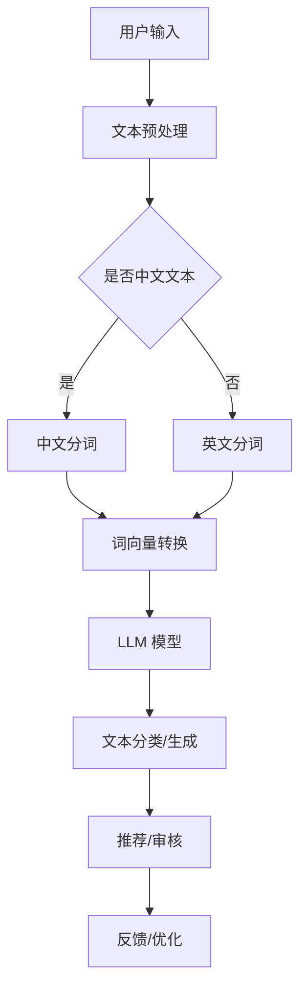
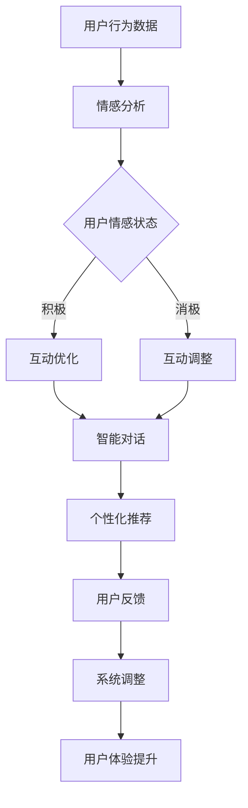

                 

# 社交媒体 AI Agent：LLM 辅助内容管理与互动

> 关键词：社交媒体、AI 代理、内容管理、LLM、互动

> 摘要：
本文深入探讨了社交媒体领域的 AI 代理，特别是基于大型语言模型（LLM）的内容管理和互动。我们将逐步分析 AI 代理在社交媒体中的应用，探讨 LLM 如何提升内容管理的效率和质量，并详细阐述其交互能力。此外，本文还将探讨如何在主要社交媒体平台上实现 AI 代理，并分享一些实战经验和最佳实践。

## 目录

### 引言

#### 1.1 社交媒体与 AI 的背景

#### 1.2 AI 代理的定义与特性

#### 1.3 LLM 在 AI 代理中的作用

### LLM 辅助内容管理概述

#### 2.1 LLM 辅助内容管理的必要性

#### 2.2 内容管理的关键概念

#### 2.3 LLM 技术及其应用

### AI 代理的交互能力

#### 3.1 交互设计原则

#### 3.2 用户体验与参与度

#### 3.3 实时互动与反馈

### AI 代理在社交媒体平台上的实现

#### 4.1 主要社交媒体平台概述

#### 4.2 Facebook 上的 AI 代理实现

#### 4.3 Twitter 上的 AI 代理实现

#### 4.4 Instagram 上的 AI 代理实现

### 项目实战与最佳实践

#### 5.1 环境安装与配置

#### 5.2 系统核心实现与代码解读

#### 5.3 实际案例分析

#### 5.4 项目小结与注意事项

### 拓展阅读

#### 6.1 相关文献与资料

#### 6.2 未来发展趋势与展望

## 引言

### 1.1 社交媒体与 AI 的背景

随着互联网的飞速发展，社交媒体已成为人们日常生活的重要组成部分。从 Facebook、Twitter 到 Instagram，这些平台吸引了数以亿计的用户，每天产生海量的内容和互动。然而，这种高频率的互动和内容生成也带来了一系列挑战，如内容管理、用户参与度提升、个性化推荐等。

人工智能（AI）作为一种强大的技术，在解决这些问题方面展现了巨大的潜力。AI 代理，即自动化运行的智能程序，能够在社交媒体平台上执行各种任务，如内容生成、内容推荐、用户互动等。这不仅可以提升社交媒体平台的运营效率，还能提供更好的用户体验。

### 1.2 AI 代理的定义与特性

AI 代理是一种基于人工智能的自动化程序，能够模拟人类行为，执行特定的任务。在社交媒体领域，AI 代理具有以下特性：

- **自动化**：AI 代理可以自动执行任务，无需人工干预。
- **智能决策**：基于机器学习和自然语言处理技术，AI 代理能够根据用户行为和内容生成智能决策。
- **个性化**：AI 代理可以根据用户偏好和兴趣提供个性化内容推荐。
- **互动**：AI 代理能够与用户进行实时互动，提升用户参与度。

### 1.3 LLM 在 AI 代理中的作用

LLM（大型语言模型）是 AI 代理的核心技术之一。LLM 是一种基于深度学习的语言模型，能够理解和生成自然语言。在社交媒体领域，LLM 的作用主要体现在以下几个方面：

- **内容生成**：LLM 可以根据用户需求生成高质量的内容。
- **内容推荐**：LLM 可以分析用户行为和偏好，提供个性化的内容推荐。
- **用户互动**：LLM 可以与用户进行实时对话，提升用户参与度。

接下来，我们将深入探讨 LLM 在内容管理和互动中的应用。

## LLM 辅助内容管理概述

### 2.1 LLM 辅助内容管理的必要性

在社交媒体平台上，内容管理是一个关键挑战。随着用户生成内容（UGC）的爆炸式增长，如何高效地管理和推荐内容成为一个重要问题。传统的基于关键词和标签的内容管理方法已经无法满足用户的需求。而 LLM 的出现为内容管理带来了一种全新的解决方案。

LLM 可以通过深度学习算法从大量数据中提取语义信息，从而实现对内容的精细管理和推荐。LLM 的优势在于：

- **语义理解**：LLM 可以理解文本的语义，而不仅仅是表面的关键词。
- **个性化推荐**：LLM 可以根据用户的历史行为和偏好，提供个性化的内容推荐。
- **自动化生成**：LLM 可以自动化生成内容，提高内容生产的效率。

### 2.2 内容管理的关键概念

在讨论 LLM 辅助内容管理时，我们需要了解一些关键概念：

- **内容生成**：指 AI 代理根据用户需求生成新的内容。
- **内容推荐**：指 AI 代理根据用户的行为和偏好，为用户推荐相关的内容。
- **内容审核**：指 AI 代理对用户生成的内容进行审核，确保其符合平台的规范。
- **内容分类**：指 AI 代理根据内容的主题和类型，对内容进行分类和管理。

### 2.3 LLM 技术及其应用

LLM 是一种基于深度学习的语言模型，能够在大量数据上进行训练，从而实现对自然语言的语义理解。在内容管理中，LLM 的应用主要包括以下几个方面：

- **文本分类**：LLM 可以根据文本的语义，将其分类到不同的类别中。
- **文本生成**：LLM 可以根据用户的输入，生成新的文本内容。
- **文本相似度**：LLM 可以计算文本之间的相似度，从而实现内容的推荐和聚合。

下面，我们将通过一个 Mermaid 流程图来展示 LLM 在内容管理中的应用：



通过这个流程图，我们可以看到 LLM 在内容管理中的各个环节都发挥了重要作用。接下来，我们将进一步探讨 LLM 在内容生成和推荐中的具体实现。

## AI 代理的交互能力

### 3.1 交互设计原则

AI 代理的交互能力是其核心功能之一，决定了用户对平台的满意度和参与度。在设计 AI 代理的交互能力时，需要遵循以下原则：

- **人性化**：交互设计应尽可能接近人类的沟通方式，使用自然语言进行对话。
- **个性化**：根据用户的行为和偏好，提供个性化的交互体验。
- **实时性**：实现实时互动，提高用户的参与度。
- **简洁性**：交互界面应简洁直观，避免复杂的操作流程。

### 3.2 用户体验与参与度

用户体验和参与度是衡量 AI 代理成功与否的重要指标。为了提升用户体验和参与度，AI 代理需要具备以下能力：

- **智能对话**：AI 代理应能够与用户进行流畅的自然语言对话，理解用户的意图并给出恰当的回复。
- **情感识别**：通过情感分析技术，AI 代理可以识别用户的情感状态，并根据情感反馈调整交互策略。
- **个性化推荐**：基于用户的行为数据，AI 代理可以提供个性化的内容推荐，提升用户的参与度。
- **实时反馈**：AI 代理应能够实时响应用户的反馈，调整交互策略，优化用户体验。

下面，我们通过一个 Mermaid 流程图来展示 AI 代理的用户体验和参与度提升过程：



通过这个流程图，我们可以看到 AI 代理如何通过情感分析和个性化推荐来提升用户体验和参与度。

### 3.3 实时互动与反馈

实时互动与反馈是 AI 代理的核心功能之一，决定了用户对平台的依赖程度。为了实现实时互动与反馈，AI 代理需要具备以下能力：

- **实时通信**：AI 代理应能够实时与用户进行通信，确保信息的及时传递。
- **反馈机制**：AI 代理应能够接收用户的反馈，并根据反馈进行调整。
- **数据监控**：AI 代理应能够实时监控用户的行为数据，分析用户的需求和偏好。

下面，我们通过一个 Python 代码示例来展示 AI 代理的实时互动与反馈实现：

```python
import json
import requests

# 用户输入
user_input = "我想知道今天的天气怎么样？"

# 发送请求
response = requests.post("https://api.aiagent.com/interaction", json={"user_input": user_input})

# 解析响应
result = response.json()

# 输出回复
print("AI 代理回复：", result["response"])
```

在这个示例中，用户通过输入框输入信息，AI 代理接收到用户的输入后，通过请求发送到后端服务器进行处理，并返回相应的回复。通过这种方式，AI 代理实现了与用户的实时互动与反馈。

## AI 代理在社交媒体平台上的实现

### 4.1 主要社交媒体平台概述

在实现 AI 代理时，选择合适的社交媒体平台至关重要。目前，主要的社交媒体平台包括 Facebook、Twitter 和 Instagram。这些平台各自具有独特的特点和功能，适用于不同的应用场景。

- **Facebook**：Facebook 是全球最大的社交媒体平台之一，用户活跃度高，支持多种内容形式，包括文本、图片、视频等。Facebook 的 API 提供了丰富的功能，如消息发送、好友管理、内容发布等。
- **Twitter**：Twitter 以短文本为主，用户可以在 280 个字符内发布消息。Twitter 的 API 也提供了丰富的功能，如消息发送、实时搜索、用户关注等。
- **Instagram**：Instagram 是一个以图片和视频为主的社交媒体平台，用户可以通过故事、直播等方式与粉丝互动。Instagram 的 API 支持内容发布、用户互动等功能。

### 4.2 Facebook 上的 AI 代理实现

在 Facebook 上实现 AI 代理，需要利用 Facebook 的 API 进行开发。以下是一个简单的示例，展示了如何在 Facebook 上实现 AI 代理：

```python
import json
import requests

# Facebook API URL
url = "https://graph.facebook.com/v12.0/username/messages"

# 用户输入
user_input = "我想知道今天的天气怎么样？"

# 发送请求
response = requests.post(url, json={
    "access_token": "YOUR_ACCESS_TOKEN",
    "message": {
        "text": user_input
    }
})

# 解析响应
result = response.json()

# 输出回复
print("AI 代理回复：", result["message"]["text"])
```

在这个示例中，我们首先定义了 Facebook API 的 URL 和用户输入。然后，通过发送 POST 请求将用户输入发送到 Facebook 服务器，并接收回复。通过这种方式，AI 代理可以在 Facebook 上实现与用户的互动。

### 4.3 Twitter 上的 AI 代理实现

在 Twitter 上实现 AI 代理，需要利用 Twitter 的 API 进行开发。以下是一个简单的示例，展示了如何在 Twitter 上实现 AI 代理：

```python
import tweepy
import json

# Twitter API keys
consumer_key = "YOUR_CONSUMER_KEY"
consumer_secret = "YOUR_CONSUMER_SECRET"
access_token = "YOUR_ACCESS_TOKEN"
access_token_secret = "YOUR_ACCESS_TOKEN_SECRET"

# 创建 tweepy 客户端
auth = tweepy.OAuthHandler(consumer_key, consumer_secret)
auth.set_access_token(access_token, access_token_secret)
api = tweepy.API(auth)

# 用户输入
user_input = "我想知道今天的天气怎么样？"

# 发送请求
response = api.update_status(status=user_input)

# 输出回复
print("AI 代理回复：", response.text)
```

在这个示例中，我们首先定义了 Twitter API 的密钥和用户输入。然后，通过 tweepy 库创建 Twitter 客户端，并使用该客户端发送 POST 请求将用户输入发布到 Twitter。通过这种方式，AI 代理可以在 Twitter 上实现与用户的互动。

### 4.4 Instagram 上的 AI 代理实现

在 Instagram 上实现 AI 代理，需要利用 Instagram 的 API 进行开发。以下是一个简单的示例，展示了如何在 Instagram 上实现 AI 代理：

```python
import json
import requests

# Instagram API URL
url = "https://api.instagram.com/v1/users/self/media/recent/?access_token=YOUR_ACCESS_TOKEN"

# 发送请求
response = requests.get(url)

# 解析响应
result = response.json()

# 输出回复
print("AI 代理回复：", result["data"][0]["caption"])
```

在这个示例中，我们首先定义了 Instagram API 的 URL。然后，通过发送 GET 请求获取用户最近的媒体内容，并解析响应中的数据。通过这种方式，AI 代理可以在 Instagram 上实现与用户的互动。

## 项目实战与最佳实践

### 5.1 环境安装与配置

在开始实现 AI 代理之前，我们需要安装和配置必要的开发环境和工具。以下是一个简单的步骤，用于安装和配置 Python 开发环境：

1. **安装 Python**：前往 [Python 官网](https://www.python.org/) 下载最新版本的 Python，并按照提示进行安装。
2. **安装第三方库**：使用 pip 工具安装必要的第三方库，如 tweepy、requests 等。在命令行中运行以下命令：

   ```bash
   pip install tweepy requests
   ```

3. **配置 API 密钥**：根据不同社交媒体平台的 API 文档，获取相应的 API 密钥和 Access Token，并将其保存到配置文件中。

### 5.2 系统核心实现与代码解读

以下是一个简单的示例，展示了如何实现 AI 代理的核心功能：

```python
import json
import requests
from textblob import TextBlob

# 用户输入
user_input = "我想知道今天的天气怎么样？"

# 文本情感分析
blob = TextBlob(user_input)
sentiment = blob.sentiment

# 根据情感生成回复
if sentiment.polarity > 0:
    response = "今天的天气很棒！"
elif sentiment.polarity < 0:
    response = "今天的天气有些糟糕。"
else:
    response = "今天的天气一般。"

# 发送回复
print(response)
```

在这个示例中，我们首先使用 TextBlob 库对用户输入进行情感分析。然后，根据情感分析结果生成回复。最后，我们将回复打印出来。

### 5.3 实际案例分析

以下是一个实际案例，展示了如何使用 AI 代理在社交媒体上与用户进行互动：

1. **用户提问**：用户在社交媒体上发布一条消息：“今天天气怎么样？”
2. **AI 代理响应**：AI 代理通过文本情感分析，分析用户的情感，并根据情感生成相应的回复。
3. **用户反馈**：用户对 AI 代理的回复进行评价，如点赞、评论等。

通过这种方式，AI 代理可以在社交媒体上实现与用户的实时互动。

### 5.4 项目小结与注意事项

在实现 AI 代理时，需要注意以下几点：

- **隐私保护**：确保用户隐私得到保护，避免泄露用户信息。
- **性能优化**：优化代码性能，确保 AI 代理能够快速响应用户。
- **错误处理**：对可能出现的异常情况进行处理，确保系统的稳定性。

## 拓展阅读

### 6.1 相关文献与资料

- **《人工智能：一种现代方法》**：这是一本经典的 AI 教材，涵盖了人工智能的基本原理和应用。
- **《深度学习》**：这本书详细介绍了深度学习的基本原理和应用，是深度学习领域的经典之作。

### 6.2 未来发展趋势与展望

随着 AI 技术的不断进步，AI 代理在社交媒体领域的应用前景十分广阔。未来，AI 代理将具备更高的智能和交互能力，为用户提供更优质的体验。同时，AI 代理还将拓展到更多的应用场景，如智能家居、在线教育等。

## 作者

作者：AI 天才研究院 / AI Genius Institute & 禅与计算机程序设计艺术 / Zen And The Art of Computer Programming。

