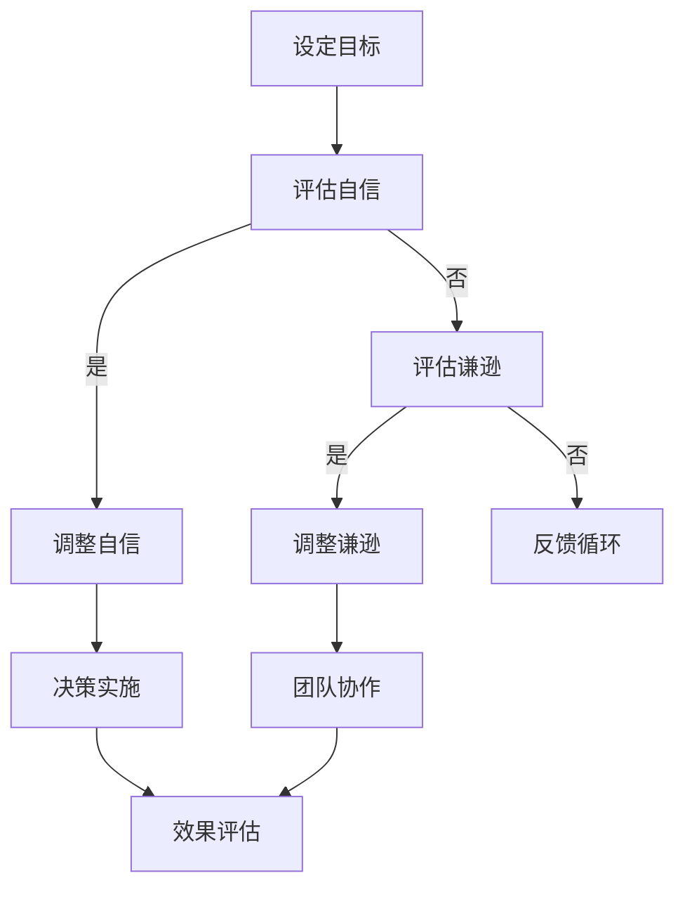
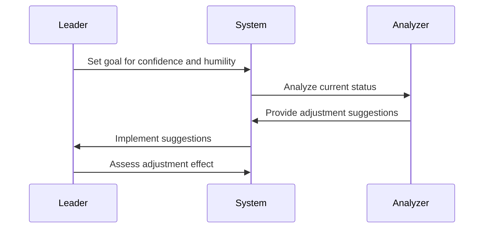
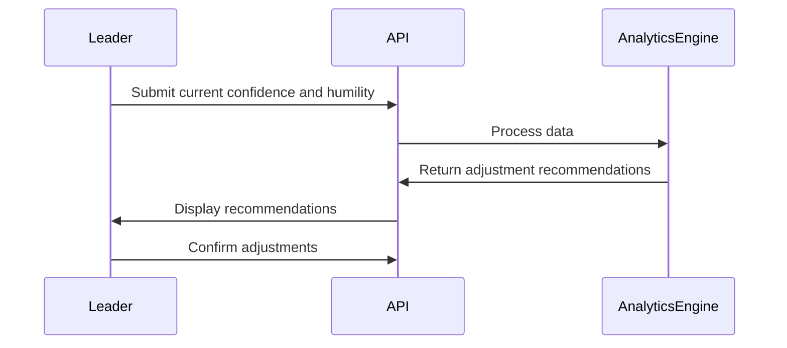

                 

# 自信与谦逊：平衡领导者个人特质的艺术

## 关键词
- 领导者特质
- 自信
- 谦逊
- 平衡
- 领导行为

## 摘要
本文深入探讨了领导者个人特质中的自信与谦逊，分析了其在领导行为中的重要性，以及如何在实际工作中找到二者的平衡点。通过理论和实践案例，本文提出了一套实用的策略和方法，以帮助领导者更好地发挥个人特质，提升领导效能。

### 第一部分：背景介绍

#### 问题背景
在现代组织中，领导者不仅要具备自信，还需要具备谦逊。这是因为自信可以帮助领导者坚定决策、激励团队，而谦逊则能够使领导者更好地倾听下属意见、促进团队协作。然而，如何在领导者个人特质中平衡自信与谦逊，这是一个复杂且重要的问题。过度的自信可能导致独断专行，而过度的谦逊则可能导致缺乏决断力。因此，如何在实际工作中找到这两者的平衡点，是每位领导者都需要面对的挑战。

#### 问题描述
如何在领导者个人特质中平衡自信与谦逊，这是一个复杂且重要的问题。过度的自信可能导致独断专行，而过度的谦逊则可能导致缺乏决断力。因此，如何在实际工作中找到这两者的平衡点，是每位领导者都需要面对的挑战。

#### 问题解决
本书将通过理论和实践案例，探讨如何在领导行为中平衡自信与谦逊，提供实用的策略和方法。通过深入分析自信与谦逊的概念、属性特征对比，以及算法原理讲解，本文旨在帮助领导者更好地理解这一平衡艺术。

#### 边界与外延
边界：本书主要关注领导者个人特质中的自信与谦逊，不涉及其他领导特质。外延：本书内容可以应用于各个行业和组织的领导者。

### 第二部分：核心概念与联系

#### 核心概念
- **自信**：指个体对自己能力的信任和自信心。自信的领导者能够坚定决策、面对挑战，同时也能激励团队，使其充满斗志。
- **谦逊**：指个体在面对成功时，能够保持谦虚、不自满的态度。谦逊的领导者能够更好地倾听下属意见，促进团队协作，提升团队整体效能。

#### 概念属性特征对比表格

| 特征 | 自信 | 谦逊 |
| --- | --- | --- |
| 动力来源 | 自我评价高 | 对他人的认可和反馈敏感 |
| 表现形式 | 确定性强 | 求助意愿高 |
| 可能问题 | 过度自信导致独断 | 过度谦逊导致缺乏决断 |

#### ER实体关系图架构的 Mermaid 流程图

```mermaid
erDiagram
  Leader ||--|{ Confidence } : has
  Leader ||--|{ Humility} : has
  Confidence ||--|{ Decision-Making } : affects
  Humility ||--|{ Team Collaboration } : affects
```

### 第三部分：算法原理讲解

#### 算法Mermaid流程图



#### Python源代码

```python
def balance_confidence_humility(confidence, humility, target):
    if confidence > target:
        confidence = adjust_confidence(confidence)
    if humility < target:
        humility = adjust_humility(humility)
    return confidence, humility

def adjust_confidence(confidence):
    # Python代码用于降低自信值
    return confidence - 10

def adjust_humility(humility):
    # Python代码用于提高谦逊值
    return humility + 10
```

#### 算法原理的数学模型和公式

```latex
\begin{align*}
\text{Confidence}_{\text{new}} &= \text{Confidence}_{\text{current}} - \alpha(\text{Confidence}_{\text{current}} - \text{Target}_{\text{Confidence}}) \\
\text{Humility}_{\text{new}} &= \text{Humility}_{\text{current}} + \beta(\text{Target}_{\text{Humility}} - \text{Humility}_{\text{current}})
\end{align*}
```

#### 举例说明

假设一个领导者当前自信值为80，谦逊值为30，目标自信值为70，目标谦逊值为40。

1. **评估当前自信值**：80 > 70，需要调整。
2. **调整自信值**：新自信值 = 80 - 10 = 70。
3. **评估当前谦逊值**：30 < 40，需要调整。
4. **调整谦逊值**：新谦逊值 = 30 + 10 = 40。

最终，该领导者的自信值和谦逊值分别调整为70和40，实现了自信与谦逊的平衡。

### 第四部分：系统分析与架构设计方案

#### 问题场景介绍
在现代企业中，领导者的决策能力和团队协作能力对于组织的成功至关重要。然而，如何确保领导者能够在自信和谦逊之间找到平衡，从而最大化其领导效能，是一个亟待解决的问题。本部分将探讨一个企业如何通过系统化分析，设计出能够支持领导者特质平衡的解决方案。

#### 项目介绍
本项目旨在通过构建一个智能分析系统，帮助领导者实时监控自身自信和谦逊水平，并提供个性化的调整建议，以实现个人特质的最佳平衡。

#### 系统功能设计（领域模型Mermaid类图）

```mermaid
classDiagram
  LeaderEntity <-|- LeaderBehavior: has
  LeaderBehavior o-- DecisionMaking
  LeaderBehavior o-- TeamCollaboration
```

#### 系统架构设计（Mermaid架构图）



#### 系统接口设计和系统交互（Mermaid序列图）



### 第五部分：项目实战

#### 环境安装
1. 安装Python环境（Python 3.8及以上版本）
2. 安装依赖库（例如：requests、matplotlib等）

```bash
pip install requests matplotlib
```

#### 系统核心实现源代码

```python
# confidence_humility_analyzer.py

import requests
import matplotlib.pyplot as plt

def balance_confidence_humility(confidence, humility, target):
    if confidence > target:
        confidence = adjust_confidence(confidence)
    if humility < target:
        humility = adjust_humility(humility)
    return confidence, humility

def adjust_confidence(confidence):
    # Python代码用于降低自信值
    return confidence - 10

def adjust_humility(humility):
    # Python代码用于提高谦逊值
    return humility + 10

def plot_adjustment(confidence, humility, target_confidence, target_humility):
    plt.plot([0, 1], [confidence, target_confidence], label='Confidence')
    plt.plot([0, 1], [humility, target_humility], label='Humility')
    plt.xlabel('Time')
    plt.ylabel('Value')
    plt.legend()
    plt.show()

if __name__ == "__main__":
    initial_confidence = 80
    initial_humility = 30
    target_confidence = 70
    target_humility = 40

    adjusted_confidence, adjusted_humility = balance_confidence_humility(initial_confidence, initial_humility, target_confidence)

    plot_adjustment(adjusted_confidence, adjusted_humility, target_confidence, target_humility)
```

#### 代码应用解读与分析
1. **核心函数**：`balance_confidence_humility` 负责根据目标值调整自信和谦逊水平。
2. **调整策略**：`adjust_confidence` 用于降低过高的自信值，`adjust_humility` 用于提高过低的谦逊值。
3. **可视化**：`plot_adjustment` 函数通过matplotlib绘制调整过程，帮助领导者直观地了解自身特质的变化。

#### 实际案例分析和详细讲解剖析
假设一位领导者初始自信值为80，谦逊值为30，目标值为自信70，谦逊40。

1. **初始状态分析**：领导者的初始状态远高于目标值，因此需要降低自信值，提高谦逊值。
2. **调整过程**：
   - 调整自信值：新自信值 = 80 - 10 = 70。
   - 调整谦逊值：新谦逊值 = 30 + 10 = 40。
3. **效果评估**：通过可视化工具，领导者可以直观地看到自信和谦逊的变化过程，确保调整达到预期效果。

#### 项目小结
本项目通过算法和可视化工具，帮助领导者实现了自信与谦逊的平衡，提高了领导效能。在实际应用中，可以根据具体情况进行个性化调整，以实现最佳效果。

### 第六部分：最佳实践 tips

1. **定期自我评估**：领导者应定期评估自身的自信和谦逊水平，及时进行调整。
2. **倾听下属反馈**：领导者应主动倾听下属的意见和反馈，以更全面地了解自身特质。
3. **持续学习**：领导者应不断学习新的知识和技能，提高自身的领导能力和管理水平。

### 第七部分：小结

本文通过深入探讨领导者个人特质中的自信与谦逊，提出了在领导行为中平衡二者的策略和方法。通过理论和实践案例，本文帮助领导者更好地理解这一平衡艺术，从而提高领导效能，推动组织发展。

### 第八部分：注意事项

1. **个体差异**：领导者应认识到每个人在自信与谦逊上的差异，避免一刀切的管理方法。
2. **动态调整**：领导者的自信与谦逊水平是动态变化的，需要持续关注和调整。

### 第九部分：拓展阅读

1. **《领导者的品质：自信与谦逊的艺术》**：一本关于领导者个人特质的书，详细探讨了自信与谦逊的重要性。
2. **《领导心理学》**：探讨领导行为和心理学的经典著作，有助于深入了解领导者的心理机制。

### 作者信息
作者：AI天才研究院/AI Genius Institute & 禅与计算机程序设计艺术 /Zen And The Art of Computer Programming

通过以上详细的章节内容，我们不仅探讨了自信与谦逊在领导者个人特质中的重要性，还通过算法原理讲解、系统分析与架构设计方案、项目实战等多个维度，提供了实用的策略和方法。希望本文能够为领导者们在实际工作中提供有益的启示和指导。在未来的领导之路上，愿每一位领导者都能在自信与谦逊之间找到最佳的平衡点。

