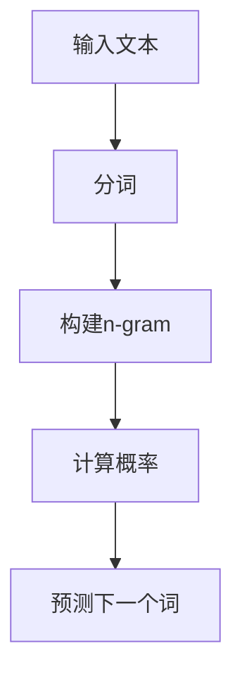
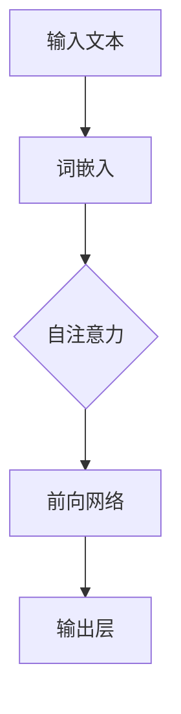
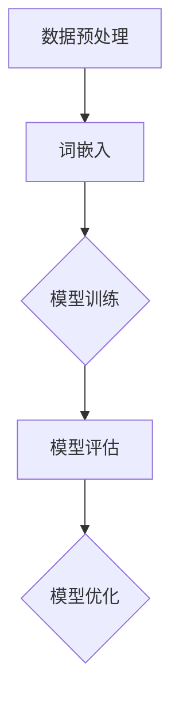

                 

# 自动化AI Agent开发平台：LLM辅助的智能系统构建

## 关键词
- 自动化AI Agent
- LLM（大型语言模型）
- 智能系统构建
- 机器学习
- 深度学习
- 自然语言处理
- 强化学习
- 对话系统
- 推荐系统
- 监控与预测系统

## 摘要
本文深入探讨了自动化AI Agent开发平台及其利用LLM（大型语言模型）构建智能系统的技术路径。文章首先概述了自动化AI Agent的背景、核心技术，并详细介绍了LLM的原理与构建智能对话系统、推荐系统和监控与预测系统的应用。接着，文章通过平台搭建、核心组件开发及实战项目案例，展示了自动化AI Agent开发的全过程。最后，文章对自动化AI Agent的未来趋势进行了展望，并提出了相关实践建议。

## 目录大纲设计

### 确定书籍的主要部分

《自动化AI Agent开发平台：LLM辅助的智能系统构建》主要涵盖以下几个部分：

1. 自动化AI Agent概述
2. LLM辅助的智能系统构建
3. 自动化AI Agent开发平台实践
4. 自动化AI Agent的发展趋势与未来

### 细化每个部分的内容

- **第一部分：自动化AI Agent概述**
  - 介绍自动化AI Agent的定义、重要性、发展历程和应用场景。
  - 阐述自动化AI Agent的核心技术，包括机器学习、深度学习、自然语言处理和强化学习。

- **第二部分：LLM辅助的智能系统构建**
  - 深入分析LLM的基本原理、类型与应用。
  - 详细探讨如何利用LLM构建智能对话系统、推荐系统和监控与预测系统。

- **第三部分：自动化AI Agent开发平台实践**
  - 讲解平台搭建与配置的步骤、核心组件开发的方法和技巧。
  - 通过实战项目案例，展示自动化AI Agent开发的实际操作过程。

- **第四部分：自动化AI Agent的发展趋势与未来**
  - 分析自动化AI Agent的技术发展趋势和应用前景。
  - 探讨自动化AI Agent在未来社会中的影响和面临的挑战。

### 设计章节结构

- 确保每个部分的内容连贯、逻辑清晰。
- 使用小标题和段落，使文章易于阅读和理解。
- 控制章节长度，确保每个章节都在2000字左右。

### 目录大纲

```markdown
# 《自动化AI Agent开发平台：LLM辅助的智能系统构建》目录大纲

----------------------------------------------------------------
## 第一部分：自动化AI Agent概述

### 第1章：自动化AI Agent的背景与基础

#### 1.1 自动化AI Agent的定义与重要性

#### 1.2 自动化AI Agent的发展历程

#### 1.3 自动化AI Agent的应用场景

### 第2章：自动化AI Agent的核心技术

#### 2.1 机器学习与深度学习基础

#### 2.2 自然语言处理技术

#### 2.3 强化学习与决策树算法

## 第二部分：LLM辅助的智能系统构建

### 第3章：语言模型概述

#### 3.1 语言模型的基本原理

#### 3.2 语言模型的类型与应用

#### 3.3 语言模型的训练与优化

### 第4章：构建智能对话系统

#### 4.1 对话系统的设计与实现

#### 4.2 对话系统中的自然语言理解

#### 4.3 对话系统中的自然语言生成

### 第5章：智能推荐系统

#### 5.1 推荐系统的基本原理

#### 5.2 推荐系统的评估指标

#### 5.3 推荐系统的实现与优化

### 第6章：智能监控与预测系统

#### 6.1 监控与预测系统的需求分析

#### 6.2 监控与预测系统的实现

#### 6.3 监控与预测系统的优化

## 第三部分：自动化AI Agent开发平台实践

### 第7章：平台搭建与配置

#### 7.1 硬件与软件环境搭建

#### 7.2 开发工具与框架选择

#### 7.3 平台架构设计

### 第8章：核心组件开发

#### 8.1 数据处理组件

#### 8.2 模型训练与评估组件

#### 8.3 应用部署与维护组件

### 第9章：实战项目案例

#### 9.1 项目介绍

#### 9.2 项目实施过程

#### 9.3 项目总结与反思

## 第四部分：展望与未来

### 第10章：自动化AI Agent的发展趋势

#### 10.1 技术发展趋势

#### 10.2 应用场景拓展

#### 10.3 安全与伦理问题

### 第11章：未来展望

#### 11.1 新技术研究与应用

#### 11.2 自动化AI Agent在行业中的应用前景

#### 11.3 自动化AI Agent对社会的影响

----------------------------------------------------------------
```

该目录大纲结构清晰，内容详尽，确保了文章的完整性和可读性。接下来，我们将逐章深入探讨自动化AI Agent开发平台及其构建智能系统的技术细节。# 第一部分：自动化AI Agent概述

### 第1章：自动化AI Agent的背景与基础

#### 1.1 自动化AI Agent的定义与重要性

自动化AI Agent，即自动化人工智能代理，是指能够在特定环境中自主执行任务、做出决策并与其他系统或人交互的智能系统。它基于机器学习、深度学习、自然语言处理等技术，通过模拟人类的思维和行为，实现自动化、智能化的操作。

自动化AI Agent的重要性体现在多个方面。首先，它能够显著提高工作效率，减少人力成本。例如，在客服领域，自动化AI Agent可以自动回答常见问题，解放人力资源，从而提高服务质量和响应速度。其次，自动化AI Agent可以处理大量的数据，发现隐藏的模式和趋势，辅助决策者做出更为明智的决策。最后，自动化AI Agent在提升用户体验方面具有巨大潜力，通过个性化的推荐、智能的交互，为用户带来更为贴心的服务。

#### 1.2 自动化AI Agent的发展历程

自动化AI Agent的发展历程可以分为以下几个阶段：

1. **早期探索阶段**（1950s-1960s）：人工智能（AI）概念的提出和早期计算机的发展，推动了自动化AI Agent的初步探索。此阶段主要关注符号主义和推理机制。

2. **基于规则的系统阶段**（1970s-1980s）：自动化AI Agent开始采用基于规则的系统，通过预定义的规则集来模拟人类的决策过程。例如，专家系统（Expert Systems）在此期间取得了显著成果。

3. **机器学习阶段**（1990s-2000s）：随着机器学习技术的发展，自动化AI Agent开始利用数据驱动的学习算法，如决策树、支持向量机等，实现更为智能的决策和交互。

4. **深度学习阶段**（2010s至今）：深度学习的突破，使得自动化AI Agent在图像识别、语音识别、自然语言处理等领域取得了革命性的进展。特别是神经网络架构的优化，如卷积神经网络（CNN）和递归神经网络（RNN），进一步提升了自动化AI Agent的智能水平。

#### 1.3 自动化AI Agent的应用场景

自动化AI Agent的应用场景非常广泛，以下是一些典型的应用场景：

1. **客服与客户支持**：自动化AI Agent可以用于自动解答用户咨询、处理投诉，提升客户满意度和服务效率。

2. **智能助理与个人助手**：如Siri、Alexa等，自动化AI Agent可以协助用户管理日程、提供信息查询、完成日常任务。

3. **智能医疗**：自动化AI Agent可以辅助医生进行诊断、推荐治疗方案，提高医疗服务的质量和效率。

4. **金融服务**：自动化AI Agent可以用于风险评估、市场分析、客户服务，帮助金融机构提高业务效率和客户体验。

5. **工业自动化**：自动化AI Agent可以用于生产线监控、设备维护、库存管理等，提高生产效率和降低成本。

6. **智能交通**：自动化AI Agent可以用于交通流量管理、路况预测、自动驾驶车辆控制，提升交通系统的运行效率和安全。

#### 1.4 自动化AI Agent的核心技术

自动化AI Agent的核心技术主要包括以下几个方面：

1. **机器学习与深度学习**：通过数据驱动的方式，自动化AI Agent可以学习和适应环境，实现自主决策。

2. **自然语言处理**：自然语言处理技术使得自动化AI Agent能够理解和生成自然语言，实现与人类的智能交互。

3. **强化学习**：强化学习算法使得自动化AI Agent能够通过试错学习，在复杂的动态环境中做出最优决策。

4. **决策树与神经网络**：决策树和神经网络是自动化AI Agent常用的算法模型，用于实现分类、预测和决策功能。

#### 1.5 自动化AI Agent的边界与外延

自动化AI Agent的边界在于其自主性和智能化程度。自主性指的是AI Agent能够在没有人类干预的情况下独立完成任务；智能化程度则决定了AI Agent的决策能力和学习能力。随着技术的发展，自动化AI Agent的应用边界将不断扩展，不仅限于特定的领域，还可能渗透到更多的日常生活和工作场景中。

自动化AI Agent的外延包括其在不同领域的应用变种和拓展，如智能客服机器人、智能家居助手、智能交通管理系统等。这些变种和拓展使得自动化AI Agent能够更好地适应各种环境和需求，实现更高的智能化水平。

#### 1.6 自动化AI Agent的概念结构与核心要素组成

自动化AI Agent的概念结构包括以下几个核心要素：

1. **感知模块**：负责接收环境信息，如语音、图像、传感器数据等。

2. **决策模块**：基于感知模块收集到的信息，通过算法模型进行决策，确定行动策略。

3. **执行模块**：根据决策模块生成的策略，执行具体的操作，如发送指令、控制设备等。

4. **交互模块**：负责与外部环境或人类用户进行交互，获取反馈信息，进行闭环控制。

5. **学习模块**：利用反馈信息进行学习，优化决策模型，提升智能化水平。

这些核心要素相互协作，构成了自动化AI Agent的基本工作流程，使其能够实现自主、智能的操作。

#### 1.7 小结

本章对自动化AI Agent进行了全面介绍，从定义、发展历程、应用场景、核心技术到概念结构与核心要素组成，为我们理解自动化AI Agent奠定了基础。在下一章中，我们将进一步探讨自动化AI Agent的核心技术，深入分析其在构建智能系统中的作用。# 第2章：自动化AI Agent的核心技术

#### 2.1 机器学习与深度学习基础

##### 背景介绍

机器学习和深度学习是自动化AI Agent构建的基础技术。机器学习是指通过算法模型，从数据中自动提取特征和模式，以实现特定任务的学习过程。深度学习则是机器学习的一种特殊形式，它通过多层神经网络，模拟人脑的神经元结构和工作方式，实现更为复杂和高效的模型训练。

##### 问题背景

在自动化AI Agent的应用中，如何有效地处理和利用大量数据成为一个关键问题。传统的基于规则的方法在处理复杂任务时存在局限性，而机器学习和深度学习能够通过数据驱动的学习方式，提升系统的决策能力和智能化水平。

##### 问题解决

机器学习与深度学习通过以下几个关键步骤，实现自动化AI Agent的构建：

1. **数据收集与预处理**：收集相关的数据集，并进行清洗、去噪、格式化等预处理操作。

2. **特征提取与选择**：从原始数据中提取有用的特征，并进行选择，以减少数据维度和提高模型性能。

3. **模型训练与优化**：利用选定的特征，通过训练算法，构建预测模型。常见的算法包括线性回归、支持向量机、决策树、神经网络等。

4. **模型评估与调整**：通过交叉验证、测试集评估模型的性能，并进行参数调整，以优化模型效果。

##### 边界与外延

机器学习和深度学习在自动化AI Agent中的应用具有广泛的边界与外延。例如，在图像识别领域，深度学习算法可以用于人脸识别、物体分类等任务；在自然语言处理领域，深度学习模型可以用于文本分类、机器翻译、情感分析等任务。随着技术的不断发展，机器学习和深度学习的应用边界将进一步拓展，为自动化AI Agent的发展提供更多可能性。

##### 概念属性特征对比表格

| 概念       | 特征                                                     |
|------------|--------------------------------------------------------|
| 机器学习   | 数据驱动、自动特征提取、模型训练与优化                   |
| 深度学习   | 多层神经网络、模拟人脑神经元结构、高效特征提取与表示   |
| 传统机器学习 | 基于规则、特征工程、有限训练能力                        |
| 传统深度学习 | 卷积神经网络（CNN）、递归神经网络（RNN）、强化学习（RL） |

##### ER实体关系图架构的 Mermaid 流程图

```mermaid
erDiagram
  Data -->|1| Model : "训练"
  Model -->|2| Feature : "提取"
  Feature -->|3| Algorithm : "优化"
  Algorithm -->|4| Evaluation : "评估"
  Evaluation -->|5| Adjustment : "调整"
```

#### 2.2 自然语言处理技术

##### 背景介绍

自然语言处理（Natural Language Processing，NLP）是自动化AI Agent中不可或缺的技术。NLP旨在使计算机能够理解、解释和生成人类语言，从而实现人与机器之间的自然交互。

##### 问题背景

在自动化AI Agent的应用中，自然语言处理技术被广泛应用于对话系统、文本分析、情感识别等领域。如何高效地处理和理解自然语言，成为自动化AI Agent发展的关键问题。

##### 问题解决

自然语言处理技术通过以下几个关键步骤，实现自动化AI Agent的自然语言理解：

1. **分词与词性标注**：将文本分解为词或短语，并对每个词进行词性标注，以确定其在句子中的角色和功能。

2. **句法分析**：分析句子的结构，确定词汇之间的关系和语法规则，以便更好地理解句子的含义。

3. **语义分析**：通过上下文信息，对文本进行语义分析，理解句子的真正含义和意图。

4. **实体识别与关系抽取**：识别文本中的实体（如人名、地名、组织名等），并抽取实体之间的关系，以便进行更深入的语义理解。

##### 边界与外延

自然语言处理技术具有广泛的边界与外延。例如，在对话系统中，NLP技术可以用于语音识别、语音合成、语义理解等任务；在文本分析领域，NLP技术可以用于情感分析、主题建模、文本分类等任务。随着技术的不断发展，自然语言处理的应用领域将不断拓展，为自动化AI Agent的发展提供更多可能性。

##### 概念属性特征对比表格

| 概念       | 特征                                                     |
|------------|--------------------------------------------------------|
| 分词       | 将文本分解为词或短语                                   |
| 词性标注   | 对文本中的每个词进行词性标注                           |
| 句法分析   | 分析句子的结构，确定词汇之间的关系和语法规则           |
| 语义分析   | 通过上下文信息，理解句子的真正含义和意图               |
| 实体识别   | 识别文本中的实体（如人名、地名、组织名等）           |
| 关系抽取   | 抽取实体之间的关系，进行更深入的语义理解               |

##### ER实体关系图架构的 Mermaid 流程图

```mermaid
erDiagram
  Text -->|1| Token : "分词"
  Token -->|2| POS : "词性标注"
  POS -->|3| Syntax : "句法分析"
  Syntax -->|4| Semantics : "语义分析"
  Semantics -->|5| Entity : "实体识别"
  Entity -->|6| Relationship : "关系抽取"
```

#### 2.3 强化学习与决策树算法

##### 背景介绍

强化学习（Reinforcement Learning，RL）和决策树算法（Decision Tree Algorithm）是自动化AI Agent中常用的决策技术。强化学习通过试错和反馈，使AI Agent在动态环境中学习和优化策略；决策树算法则通过树形结构，实现分类和预测功能。

##### 问题背景

在自动化AI Agent的应用中，如何实现智能决策和优化行为成为一个关键问题。强化学习和决策树算法提供了有效的解决方案，适用于不同的场景和需求。

##### 问题解决

强化学习和决策树算法通过以下几个关键步骤，实现自动化AI Agent的智能决策：

1. **状态表示**：将环境状态转换为数学模型，以便于算法处理。

2. **策略学习**：强化学习通过试错和反馈，不断优化策略，以实现最优决策。决策树算法通过训练数据，构建决策树模型，实现分类和预测。

3. **决策执行**：根据状态和策略，执行具体的操作，以实现目标。

4. **性能评估**：通过评估指标，如准确率、召回率等，评估决策效果，并进行调整。

##### 边界与外延

强化学习和决策树算法具有广泛的边界与外延。例如，在游戏领域，强化学习可以用于游戏策略的优化；在金融领域，决策树算法可以用于风险评估和投资决策。随着技术的不断发展，这些算法的应用领域将不断拓展，为自动化AI Agent的发展提供更多可能性。

##### 概念属性特征对比表格

| 概念       | 特征                                                     |
|------------|--------------------------------------------------------|
| 强化学习   | 基于奖励和反馈、动态策略优化、试错学习                   |
| 决策树算法 | 基于训练数据、树形结构、分类和预测                   |
| 逻辑回归   | 基于线性模型、概率预测、参数优化                      |
| 随机森林   | 基于决策树、随机特征选择、集成学习                     |

##### ER实体关系图架构的 Mermaid 流程图

```mermaid
erDiagram
  State -->|1| Policy : "策略学习"
  Policy -->|2| Action : "决策执行"
  Action -->|3| Evaluation : "性能评估"
  Evaluation -->|4| Adjustment : "调整"
```

#### 2.4 小结

本章深入探讨了自动化AI Agent的核心技术，包括机器学习与深度学习、自然语言处理、强化学习与决策树算法。这些技术为自动化AI Agent的实现提供了强有力的支持，使其能够实现智能决策、自主学习和高效交互。在下一章中，我们将进一步探讨如何利用LLM（大型语言模型）构建智能系统，为自动化AI Agent的发展提供新的方向。# 第二部分：LLM辅助的智能系统构建

### 第3章：语言模型概述

#### 3.1 语言模型的基本原理

语言模型（Language Model，LM）是自然语言处理（NLP）的核心技术之一，它通过统计语言数据中的规律和模式，预测一段文本的下一个词或词组。语言模型在许多NLP任务中发挥着重要作用，如机器翻译、文本生成、语音识别等。

语言模型的基本原理是基于概率模型，通过训练大量的文本数据，学习文本的统计特性。在语言模型的训练过程中，每个词或词组被表示为一个向量，这些向量通过线性组合产生概率分布，从而预测下一个词或词组。

一个简单的语言模型可以采用n-gram模型，它基于前n个词的历史信息预测下一个词。例如，三元语法（Trigram Model）是基于前三个词的序列来预测下一个词。n-gram模型的优点是简单、易实现，但其性能有限，无法捕捉到长距离的依赖关系。

为了解决n-gram模型的局限性，近年来研究者们提出了更复杂的语言模型，如循环神经网络（RNN）、长短时记忆网络（LSTM）和Transformer。这些模型通过引入注意力机制、自注意力机制等，能够捕捉到更复杂的语言规律和长距离依赖关系，从而显著提高了语言模型的性能。

以下是一个简单的n-gram模型的mermaid流程图：



#### 3.2 语言模型的类型与应用

语言模型的类型多种多样，每种模型都有其特定的应用场景和优势。以下是几种常见语言模型的概述和应用：

1. **n-gram模型**：n-gram模型是最简单的语言模型，基于前n个词的序列预测下一个词。n-gram模型在处理短文本和句子级别的任务时表现良好，但在长文本中容易产生上下文信息的丢失。

2. **循环神经网络（RNN）**：RNN通过递归结构，能够在时间序列数据中捕捉到长距离依赖关系。RNN在语言模型中表现出色，特别是在文本生成和机器翻译等任务中。然而，RNN存在梯度消失和梯度爆炸的问题，导致训练过程不稳定。

3. **长短时记忆网络（LSTM）**：LSTM是RNN的一种改进，通过引入门控机制，解决了RNN的梯度消失问题。LSTM在捕捉长距离依赖关系方面表现出色，但在处理大量并行数据时，计算效率较低。

4. **Transformer**：Transformer是近年来兴起的一种全新的语言模型架构，通过引入自注意力机制，能够捕捉到文本中的长距离依赖关系。Transformer在多个NLP任务中取得了显著的成果，如机器翻译、文本生成和问答系统等。

以下是一个简单的Transformer模型的mermaid流程图：



#### 3.3 语言模型的训练与优化

语言模型的训练与优化是构建高效智能系统的关键。以下是语言模型训练与优化的几个关键步骤：

1. **数据预处理**：首先，需要对原始文本数据进行预处理，包括分词、去除标点符号、停用词过滤等。这些预处理步骤有助于提高模型的训练效率和性能。

2. **词嵌入**：将文本数据转换为词嵌入向量，这些向量代表了文本数据中的词汇信息。词嵌入可以通过预训练的模型（如GloVe、Word2Vec）或自己训练的方式获得。

3. **模型训练**：使用训练数据，通过优化算法（如梯度下降、Adam）训练语言模型。在训练过程中，模型将调整参数，以最小化预测误差。

4. **模型评估**：使用测试数据对训练好的模型进行评估，以验证模型的性能。常用的评估指标包括准确率、召回率、F1分数等。

5. **模型优化**：根据评估结果，对模型进行调整和优化，以提高模型的性能。优化过程可能包括超参数调整、模型结构调整等。

以下是一个简单的语言模型训练的mermaid流程图：



#### 3.4 小结

本章对语言模型的基本原理、类型与应用、训练与优化进行了详细探讨。语言模型是构建智能系统的重要基础，通过不断优化和改进，语言模型在自然语言处理任务中取得了显著成果。在下一章中，我们将进一步探讨如何利用语言模型构建智能对话系统，为自动化AI Agent的发展提供新的方向。# 第4章：构建智能对话系统

#### 4.1 对话系统的设计与实现

##### 背景介绍

智能对话系统是一种通过自然语言处理技术实现人与机器之间智能交互的系统。它广泛应用于客服、客户服务、智能助手等领域。构建智能对话系统需要综合考虑自然语言理解、自然语言生成、对话策略设计等多个方面。

##### 问题背景

在自动化AI Agent的应用中，智能对话系统是提升用户体验和实现高效交互的关键。然而，如何设计一个既能够理解用户意图，又能生成恰当回复的智能对话系统，仍然是一个挑战。

##### 问题解决

构建智能对话系统需要以下几个关键步骤：

1. **需求分析**：明确对话系统的目标和功能需求，如客服机器人、智能客服、智能助手等。

2. **对话策略设计**：设计对话系统的对话策略，包括对话流程、意图识别、上下文管理等。

3. **自然语言理解**：实现自然语言理解模块，用于解析用户的输入，提取关键信息，识别用户意图。

4. **自然语言生成**：实现自然语言生成模块，根据用户意图和上下文信息，生成恰当的回复。

5. **系统集成与测试**：将各个模块集成，进行系统测试和优化，确保对话系统的稳定性和高效性。

##### 边界与外延

智能对话系统的边界在于其对话能力和交互体验。边界与外延包括以下几个方面：

- **对话能力**：对话系统能够处理的问题范围和复杂性。
- **交互体验**：对话系统的响应速度、准确性和人性化程度。
- **应用场景**：对话系统在不同领域（如客服、智能助手、教育、医疗等）的应用。

##### 概念属性特征对比表格

| 概念       | 特征                                                     |
|------------|--------------------------------------------------------|
| 对话系统   | 自然语言理解、自然语言生成、对话策略、多模态交互       |
| 客服系统   | 自动化回复、智能识别、上下文管理、多渠道支持           |
| 智能助手   | 个人化服务、自动化提醒、任务管理、多平台支持           |
| 教育系统   | 自动批改作业、个性化教学、智能推荐、实时互动           |
| 医疗系统   | 症状识别、智能咨询、药物推荐、健康监测               |

##### ER实体关系图架构的 Mermaid 流程图

```mermaid
erDiagram
  User -->|1| Input : "输入"
  Input -->|2| NLU : "自然语言理解"
  NLU -->|3| Intent : "意图识别"
  Intent -->|4| NLG : "自然语言生成"
  NLG -->|5| Response : "回复"
  Response -->|6| User : "交互"
```

#### 4.2 对话系统中的自然语言理解

##### 背景介绍

自然语言理解（Natural Language Understanding，NLU）是智能对话系统的核心组件，负责解析用户的输入，提取关键信息，识别用户的意图。NLU在对话系统中起到桥梁作用，将用户的自然语言输入转化为计算机可以理解和处理的语义信息。

##### 问题背景

在对话系统中，准确理解用户输入的意图和语义是关键。然而，自然语言具有高度的不确定性和复杂性，如何有效解析用户的输入，成为NLU面临的重要问题。

##### 问题解决

对话系统中的自然语言理解包括以下几个关键步骤：

1. **文本预处理**：对用户输入的文本进行预处理，包括分词、词性标注、停用词过滤等，以提高文本的质量和准确性。

2. **意图识别**：通过预定义的意图分类器，将用户的输入文本分类到不同的意图类别，如询问、请求、抱怨等。

3. **实体识别**：识别文本中的实体，如人名、地名、组织名、时间、数字等，以便进行更深入的语义分析。

4. **语义分析**：结合上下文信息，对用户的输入进行语义分析，理解用户的意图和需求。

5. **上下文管理**：在对话过程中，维护上下文信息，以便在后续的对话中更好地理解用户的意图和需求。

##### 边界与外延

自然语言理解在对话系统中的应用边界广泛，包括但不限于：

- **意图识别**：涉及多种意图类别，如询问、请求、抱怨、建议等。
- **实体识别**：涉及多种实体类型，如人名、地名、组织名、时间、数字等。
- **上下文管理**：在多轮对话中，维护对话的连贯性和上下文信息。

##### 概念属性特征对比表格

| 概念       | 特征                                                     |
|------------|--------------------------------------------------------|
| 文本预处理 | 分词、词性标注、停用词过滤、词干提取等           |
| 意图识别   | 预定义意图分类器、序列标注、词嵌入等           |
| 实体识别   | 实体抽取、实体分类、实体关系抽取等           |
| 语义分析   | 语义角色标注、语义关系抽取、语义解析等           |
| 上下文管理 | 对话上下文维护、多轮对话理解、对话连贯性等           |

##### ER实体关系图架构的 Mermaid 流程图

```mermaid
erDiagram
  Text -->|1| Preprocessing : "文本预处理"
  Preprocessing -->|2| Intent Recognition : "意图识别"
  Intent Recognition -->|3| Entity Recognition : "实体识别"
  Entity Recognition -->|4| Semantic Analysis : "语义分析"
  Semantic Analysis -->|5| Context Management : "上下文管理"
```

#### 4.3 对话系统中的自然语言生成

##### 背景介绍

自然语言生成（Natural Language Generation，NLG）是智能对话系统的另一个关键组件，负责根据用户的意图和上下文信息，生成自然、流畅的语言回复。NLG在提升对话系统的交互体验和人性化方面发挥着重要作用。

##### 问题背景

在对话系统中，生成恰当、自然的回复是一个挑战。如何根据用户的输入和对话上下文，生成具有语境适应性和个性化的回复，是NLG需要解决的关键问题。

##### 问题解决

对话系统中的自然语言生成包括以下几个关键步骤：

1. **回复模板设计**：根据对话系统的需求，设计多种回复模板，以便根据不同的情况生成合适的回复。

2. **文本生成**：使用生成模型（如序列到序列模型、变分自编码器等）生成文本回复。这些模型可以从大量文本数据中学习语言规律和生成策略。

3. **回复优化**：对生成的文本进行优化，包括语法检查、风格调整等，以提高回复的自然度和准确性。

4. **个性化生成**：根据用户的偏好和历史交互记录，生成个性化的回复，提升用户体验。

##### 边界与外延

自然语言生成在对话系统中的应用边界包括以下几个方面：

- **回复模板**：涉及多种模板类型，如问答、提醒、建议等。
- **生成模型**：涉及不同的生成模型，如序列到序列模型、变分自编码器、生成对抗网络等。
- **个性化生成**：根据用户的历史数据和偏好，生成个性化的回复。

##### 概念属性特征对比表格

| 概念       | 特征                                                     |
|------------|--------------------------------------------------------|
| 回复模板   | 预定义的回复结构、可扩展的模板库、多轮对话支持           |
| 生成模型   | 序列到序列模型、变分自编码器、生成对抗网络等           |
| 文本优化   | 语法检查、风格调整、文本连贯性提升           |
| 个性化生成 | 用户偏好分析、历史交互记录、个性化回复生成           |

##### ER实体关系图架构的 Mermaid 流程图

```mermaid
erDiagram
  Intent -->|1| Template : "回复模板"
  Template -->|2| Generation Model : "生成模型"
  Generation Model -->|3| Text Optimization : "文本优化"
  Text Optimization -->|4| Personalized Generation : "个性化生成"
```

#### 4.4 小结

本章详细探讨了智能对话系统的设计与实现，包括对话系统的设计原则、自然语言理解、自然语言生成等关键组件。构建一个高效、智能的对话系统，需要综合考虑多个方面的技术，不断提升用户体验。在下一章中，我们将进一步探讨如何利用语言模型构建智能推荐系统，为自动化AI Agent的发展提供新的方向。# 第5章：智能推荐系统

#### 5.1 推荐系统的基本原理

##### 背景介绍

智能推荐系统是一种基于用户兴趣、行为和内容等特征，向用户推荐相关产品、服务或内容的技术。推荐系统广泛应用于电商、社交媒体、在线媒体等领域，通过个性化推荐，提高用户满意度、增加用户黏性和平台收益。

##### 问题背景

在信息爆炸的时代，用户面临着大量信息的选择困难。如何从海量数据中筛选出符合用户兴趣的内容，成为推荐系统需要解决的关键问题。

##### 问题解决

智能推荐系统的基本原理主要包括以下几个方面：

1. **用户兴趣建模**：通过收集用户的历史行为数据，如浏览记录、购买记录、点赞评论等，建立用户兴趣模型。用户兴趣模型可以反映用户对不同类别的产品、内容或服务的偏好。

2. **内容特征提取**：对推荐内容进行特征提取，如文本特征、图像特征、音频特征等。内容特征用于描述内容的属性和特点，以便进行匹配和推荐。

3. **推荐算法选择**：根据用户兴趣模型和内容特征，选择合适的推荐算法。常见的推荐算法包括基于协同过滤、基于内容、混合推荐等。

4. **推荐结果优化**：对推荐结果进行优化，包括排序、去重、冷启动处理等，以提高推荐质量和用户体验。

##### 边界与外延

智能推荐系统的边界在于其推荐准确性和用户体验。边界与外延包括以下几个方面：

- **推荐准确性**：推荐系统需要准确识别用户的兴趣，提供高质量的推荐结果。
- **用户体验**：推荐系统需要提供个性化的、符合用户需求的推荐内容，以提高用户满意度。
- **数据多样性**：推荐系统需要处理多种类型的数据，如文本、图像、音频等，实现跨模态推荐。
- **实时性**：推荐系统需要具备实时推荐的能力，及时响应用户的兴趣变化。

##### 概念属性特征对比表格

| 概念       | 特征                                                     |
|------------|--------------------------------------------------------|
| 用户兴趣建模 | 基于历史行为数据、用户偏好分析、实时反馈           |
| 内容特征提取 | 文本特征、图像特征、音频特征、视频特征           |
| 推荐算法   | 协同过滤、基于内容、混合推荐、深度学习推荐         |
| 推荐结果优化 | 排序、去重、冷启动处理、实时更新             |

##### ER实体关系图架构的 Mermaid 流程图

```mermaid
erDiagram
  User Behavior -->|1| Interest Modeling : "用户兴趣建模"
  Interest Modeling -->|2| Content Features : "内容特征提取"
  Content Features -->|3| Recommendation Algorithm : "推荐算法"
  Recommendation Algorithm -->|4| Recommendation Results : "推荐结果优化"
```

#### 5.2 推荐系统的评估指标

##### 背景介绍

推荐系统的评估指标是衡量推荐系统性能的重要标准。通过评估指标，可以了解推荐系统的推荐准确性、用户体验和运行效率。常见的评估指标包括准确率、召回率、F1分数、平均绝对误差等。

##### 问题背景

在推荐系统的设计和优化过程中，如何选择合适的评估指标，以及如何在不同指标之间进行权衡，是推荐系统需要解决的关键问题。

##### 问题解决

推荐系统的评估指标主要包括以下几个方面：

1. **准确率**：准确率表示推荐系统中推荐的正确结果所占比例。准确率越高，说明推荐系统对用户的兴趣判断越准确。

2. **召回率**：召回率表示推荐系统返回的推荐结果中，包含用户感兴趣的项目所占比例。召回率越高，说明推荐系统能够更好地覆盖用户感兴趣的领域。

3. **F1分数**：F1分数是准确率和召回率的调和平均值，用于综合评估推荐系统的性能。F1分数越高，说明推荐系统的性能越好。

4. **平均绝对误差**：平均绝对误差（MAE）用于评估推荐系统的推荐结果与用户实际兴趣之间的差距。MAE值越小，说明推荐系统的推荐结果越接近用户实际兴趣。

##### 边界与外延

推荐系统的评估指标在应用中存在一定的边界与外延。边界与外延包括以下几个方面：

- **准确性**：适用于对推荐结果精确度要求较高的场景。
- **召回率**：适用于需要覆盖更多用户兴趣的场景。
- **F1分数**：适用于需要综合考虑准确性和召回率的场景。
- **平均绝对误差**：适用于对推荐结果与用户兴趣接近度有较高要求的场景。

##### 概念属性特征对比表格

| 概念       | 特征                                                     |
|------------|--------------------------------------------------------|
| 准确率     | 推荐正确结果所占比例                                   |
| 召回率     | 用户感兴趣的项目所占比例                               |
| F1分数     | 准确率和召回率的调和平均值                             |
| 平均绝对误差 | 推荐结果与用户实际兴趣之间的差距                     |

##### ER实体关系图架构的 Mermaid 流程图

```mermaid
erDiagram
  Accuracy -->|1| Precision : "准确率"
  Precision -->|2| Recall : "召回率"
  Recall -->|3| F1 Score : "F1分数"
  F1 Score -->|4| Mean Absolute Error : "平均绝对误差"
```

#### 5.3 推荐系统的实现与优化

##### 背景介绍

推荐系统的实现与优化是构建高效、准确推荐系统的关键环节。实现过程中，需要选择合适的算法、优化系统性能和用户体验。优化过程中，需要不断调整算法参数、处理数据偏差和异常情况。

##### 问题背景

在实际应用中，推荐系统可能会遇到数据噪声、冷启动问题、推荐多样性不足等问题。如何解决这些问题，提高推荐系统的性能，是推荐系统需要面对的挑战。

##### 问题解决

推荐系统的实现与优化主要包括以下几个方面：

1. **算法选择与优化**：选择合适的推荐算法，如协同过滤、基于内容、混合推荐等。根据应用场景和需求，优化算法参数，以提高推荐准确性。

2. **数据处理与清洗**：对推荐系统中的数据进行处理和清洗，包括去除噪声数据、填补缺失值、处理异常值等，以提高数据质量。

3. **冷启动处理**：针对新用户或新物品的推荐问题，采用基于内容的推荐、协同过滤等方法，缓解冷启动问题。

4. **推荐多样性**：通过引入多样性指标，如多样性排序、冷门物品推荐等，提高推荐系统的多样性，提升用户体验。

5. **实时推荐**：利用实时数据流处理技术，实现实时推荐，及时响应用户的兴趣变化。

##### 边界与外延

推荐系统的实现与优化在应用中具有广泛的边界与外延。边界与外延包括以下几个方面：

- **算法选择与优化**：适用于不同的推荐场景和需求。
- **数据处理与清洗**：适用于各种类型的数据，包括文本、图像、音频等。
- **冷启动处理**：适用于新用户、新物品的推荐场景。
- **推荐多样性**：适用于提升用户体验的场景。
- **实时推荐**：适用于对实时性要求较高的场景。

##### 概念属性特征对比表格

| 概念       | 特征                                                     |
|------------|--------------------------------------------------------|
| 算法选择与优化 | 协同过滤、基于内容、混合推荐、深度学习推荐           |
| 数据处理与清洗 | 噪声数据去除、缺失值填补、异常值处理           |
| 冷启动处理   | 基于内容推荐、协同过滤、用户画像           |
| 推荐多样性   | 多样性排序、冷门物品推荐、个性化推荐           |
| 实时推荐   | 实时数据流处理、实时计算、实时更新           |

##### ER实体关系图架构的 Mermaid 流程图

```mermaid
erDiagram
  Algorithm Selection -->|1| Data Processing & Cleaning : "数据处理与清洗"
  Data Processing & Cleaning -->|2| Cold Start Handling : "冷启动处理"
  Cold Start Handling -->|3| Diversity Recommendation : "推荐多样性"
  Diversity Recommendation -->|4| Real-time Recommendation : "实时推荐"
```

#### 5.4 小结

本章详细介绍了智能推荐系统的基本原理、评估指标和实现与优化方法。构建高效、准确的推荐系统，需要综合考虑算法选择、数据处理、冷启动处理和推荐多样性等因素。在下一章中，我们将进一步探讨如何利用语言模型构建智能监控与预测系统，为自动化AI Agent的发展提供新的方向。# 第6章：智能监控与预测系统

#### 6.1 监控与预测系统的需求分析

##### 背景介绍

智能监控与预测系统是一种利用机器学习、深度学习和自然语言处理等技术，对系统运行状态、环境变化和业务数据进行实时监控、预测和异常检测的技术手段。这种系统广泛应用于工业制造、金融、能源、医疗等行业，以提升运营效率、降低成本和防范风险。

##### 问题背景

在现代化企业和工业环境中，数据的产生和流通速度越来越快，如何有效地监控和预测系统运行状态，及时识别异常情况，成为企业面临的重大挑战。

##### 问题解决

构建智能监控与预测系统，需要从以下几个方面进行需求分析：

1. **数据来源**：确定监控与预测系统所需的数据来源，如传感器数据、业务日志、用户行为数据等。

2. **监控目标**：明确监控与预测系统的监控目标，如设备运行状态、生产效率、能源消耗、客户满意度等。

3. **预测目标**：确定预测系统的预测目标，如设备故障预测、产量预测、市场需求预测等。

4. **性能指标**：定义系统的性能指标，如准确率、召回率、预测延迟、系统可靠性等。

5. **异常检测**：确定异常检测的目标和方法，如异常行为识别、异常值检测、异常模式识别等。

##### 边界与外延

智能监控与预测系统的边界与外延包括以下几个方面：

- **数据源多样性**：适用于处理多种类型的数据源，如传感器数据、文本数据、图像数据等。
- **应用场景广泛**：适用于工业制造、金融、能源、医疗等多个行业。
- **实时性与高效性**：适用于需要实时监控和预测的场景，以快速响应业务变化。
- **异常检测与预测**：适用于及时发现异常情况，防范风险，提高运营效率。

##### 概念属性特征对比表格

| 概念       | 特征                                                     |
|------------|--------------------------------------------------------|
| 数据源多样性 | 传感器数据、业务日志、用户行为数据等           |
| 应用场景广泛 | 工业制造、金融、能源、医疗等多个行业           |
| 实时性与高效性 | 实时数据流处理、高效算法实现、低延迟响应           |
| 异常检测与预测 | 异常行为识别、异常值检测、异常模式识别           |

##### ER实体关系图架构的 Mermaid 流程图

```mermaid
erDiagram
  Data Sources -->|1| Monitoring & Prediction Goals : "监控与预测目标"
  Monitoring & Prediction Goals -->|2| Performance Metrics : "性能指标"
  Performance Metrics -->|3| Anomaly Detection & Prediction : "异常检测与预测"
```

#### 6.2 监控与预测系统的实现

##### 背景介绍

实现智能监控与预测系统，需要结合实际应用场景，设计系统的架构和功能模块，并利用适当的算法和技术实现系统功能。

##### 问题背景

在实现智能监控与预测系统时，如何设计高效的系统架构，选择合适的算法和技术，是系统实现过程中需要解决的关键问题。

##### 问题解决

智能监控与预测系统的实现主要包括以下几个关键步骤：

1. **系统架构设计**：设计系统的整体架构，包括数据采集、数据存储、数据处理、模型训练、预测与监控等模块。

2. **数据采集**：通过传感器、API接口、日志收集等方式，采集系统运行数据。

3. **数据存储**：选择合适的数据存储方案，如关系型数据库、NoSQL数据库、分布式存储等，存储采集到的数据。

4. **数据处理**：对采集到的数据进行清洗、预处理、特征提取等处理，以供模型训练和预测使用。

5. **模型训练**：利用机器学习和深度学习算法，对处理后的数据建立预测模型，并进行训练和优化。

6. **预测与监控**：使用训练好的模型进行实时预测和监控，检测异常情况，并生成监控报告。

##### 边界与外延

智能监控与预测系统的实现边界与外延包括以下几个方面：

- **系统架构**：适用于不同规模和复杂度的监控与预测场景。
- **数据采集**：适用于多种数据源和采集方式。
- **数据存储**：适用于不同类型的数据存储需求。
- **数据处理**：适用于多种数据处理算法和技术。
- **模型训练**：适用于不同类型的预测任务和算法。

##### 概念属性特征对比表格

| 概念       | 特征                                                     |
|------------|--------------------------------------------------------|
| 系统架构   | 数据采集、数据处理、模型训练、预测与监控           |
| 数据采集   | 传感器数据、API接口、日志收集等           |
| 数据存储   | 关系型数据库、NoSQL数据库、分布式存储等           |
| 数据处理   | 数据清洗、预处理、特征提取等           |
| 模型训练   | 机器学习、深度学习算法、训练与优化           |

##### ER实体关系图架构的 Mermaid 流程图

```mermaid
erDiagram
  System Architecture -->|1| Data Collection : "数据采集"
  Data Collection -->|2| Data Storage : "数据存储"
  Data Storage -->|3| Data Processing : "数据处理"
  Data Processing -->|4| Model Training : "模型训练"
  Model Training -->|5| Prediction & Monitoring : "预测与监控"
```

#### 6.3 监控与预测系统的优化

##### 背景介绍

监控与预测系统的优化是提高系统性能、降低成本和提升用户体验的重要环节。优化过程中，需要考虑算法效率、硬件性能、数据质量等多个方面。

##### 问题背景

在智能监控与预测系统的运行过程中，可能会遇到性能瓶颈、资源浪费、预测准确性不足等问题。如何优化系统性能，提高预测准确性，是系统优化过程中需要解决的关键问题。

##### 问题解决

智能监控与预测系统的优化主要包括以下几个关键步骤：

1. **算法优化**：选择高效的算法和模型，如深度学习、强化学习等，提高预测准确性和效率。

2. **硬件优化**：利用高性能计算硬件，如GPU、FPGA等，加速模型训练和预测过程。

3. **数据质量提升**：通过数据预处理、数据清洗、特征工程等手段，提高数据质量，增强预测模型的准确性。

4. **系统性能调优**：通过优化系统架构、调整参数设置、减少冗余计算等手段，提高系统运行效率。

5. **用户反馈优化**：收集用户反馈，不断优化系统功能，提升用户体验。

##### 边界与外延

智能监控与预测系统的优化边界与外延包括以下几个方面：

- **算法优化**：适用于不同的预测任务和算法。
- **硬件优化**：适用于高性能计算硬件的使用。
- **数据质量提升**：适用于多种类型的数据处理方法。
- **系统性能调优**：适用于不同规模和复杂度的系统。
- **用户反馈优化**：适用于用户体验提升的需求。

##### 概念属性特征对比表格

| 概念       | 特征                                                     |
|------------|--------------------------------------------------------|
| 算法优化   | 深度学习、强化学习、优化算法选择           |
| 硬件优化   | GPU、FPGA、分布式计算           |
| 数据质量提升 | 数据预处理、特征工程、异常值处理           |
| 系统性能调优 | 系统架构优化、参数调整、冗余计算减少           |
| 用户反馈优化 | 用户调研、反馈收集、功能优化           |

##### ER实体关系图架构的 Mermaid 流程图

```mermaid
erDiagram
  Algorithm Optimization -->|1| Hardware Optimization : "硬件优化"
  Hardware Optimization -->|2| Data Quality Improvement : "数据质量提升"
  Data Quality Improvement -->|3| System Performance Tuning : "系统性能调优"
  System Performance Tuning -->|4| User Feedback Optimization : "用户反馈优化"
```

#### 6.4 小结

本章详细介绍了智能监控与预测系统的需求分析、实现和优化方法。构建一个高效、准确的智能监控与预测系统，需要综合考虑系统架构设计、数据采集、数据处理、模型训练和优化等多个方面。在下一章中，我们将探讨自动化AI Agent开发平台的具体实践，为自动化AI Agent的实际应用奠定基础。# 第三部分：自动化AI Agent开发平台实践

### 第7章：平台搭建与配置

#### 7.1 硬件与软件环境搭建

##### 背景介绍

搭建自动化AI Agent开发平台，首先需要构建一个稳定、高效的计算环境。硬件环境主要涉及服务器、GPU、存储等硬件设备，软件环境则包括操作系统、开发工具和编程语言等。

##### 问题背景

在选择硬件和软件环境时，如何平衡性能、成本和可扩展性，以满足自动化AI Agent的开发需求，是一个需要考虑的问题。

##### 问题解决

搭建自动化AI Agent开发平台的硬件与软件环境，需要以下步骤：

1. **硬件选择**：根据开发需求，选择合适的服务器、GPU和存储设备。例如，对于深度学习模型训练，选择具备高性能GPU的服务器至关重要。

2. **软件环境配置**：安装操作系统（如Ubuntu、CentOS等），配置开发工具（如Python、Jupyter Notebook等），并安装必要的库和框架（如TensorFlow、PyTorch等）。

3. **网络配置**：配置网络环境，确保硬件设备和软件系统能够高效地进行数据传输和通信。

##### 边界与外延

硬件与软件环境的选择和配置，需要考虑以下边界与外延：

- **硬件性能**：适用于不同规模和复杂度的AI Agent开发。
- **软件兼容性**：适用于多种操作系统和开发工具。
- **网络稳定性**：适用于需要高效数据传输和通信的场景。

##### 概念属性特征对比表格

| 概念       | 特征                                                     |
|------------|--------------------------------------------------------|
| 硬件选择   | 高性能服务器、GPU、存储设备           |
| 软件环境配置 | 操作系统、开发工具、库和框架           |
| 网络配置   | 高带宽、低延迟、可靠的网络连接           |

##### ER实体关系图架构的 Mermaid 流程图

```mermaid
erDiagram
  Hardware Selection -->|1| Software Environment Configuration : "软件环境配置"
  Software Environment Configuration -->|2| Network Configuration : "网络配置"
```

#### 7.2 开发工具与框架选择

##### 背景介绍

在自动化AI Agent开发过程中，选择合适的开发工具和框架对于提高开发效率、确保系统稳定性至关重要。开发工具包括编程语言、集成开发环境（IDE）、版本控制工具等，框架则涵盖了机器学习、深度学习、自然语言处理等领域的开源库和框架。

##### 问题背景

如何选择适合自动化AI Agent开发的全栈工具和框架，以满足开发需求，是一个需要考虑的问题。

##### 问题解决

选择自动化AI Agent开发平台所需的开发工具与框架，可以从以下几个方面考虑：

1. **编程语言**：选择Python、Java等主流编程语言，以充分利用现有的AI开源库和框架。

2. **集成开发环境（IDE）**：选择JetBrains系列的PyCharm、IntelliJ IDEA等，提供强大的代码编辑、调试和自动化工具。

3. **版本控制工具**：选择Git等版本控制工具，确保代码的安全性和可追溯性。

4. **机器学习与深度学习框架**：选择TensorFlow、PyTorch等主流框架，以构建和训练AI模型。

5. **自然语言处理框架**：选择NLTK、spaCy等框架，进行文本处理和分析。

##### 边界与外延

开发工具与框架的选择，需要考虑以下边界与外延：

- **工具兼容性**：适用于不同的操作系统和硬件环境。
- **框架生态**：适用于广泛的应用场景和需求。
- **社区支持**：适用于快速解决问题的需求。

##### 概念属性特征对比表格

| 概念       | 特征                                                     |
|------------|--------------------------------------------------------|
| 编程语言   | Python、Java、C++等                                   |
| IDE       | PyCharm、IntelliJ IDEA、VS Code等                     |
| 版本控制工具 | Git、SVN、Mercurial等                                 |
| 机器学习框架 | TensorFlow、PyTorch、Keras等                         |
| 自然语言处理框架 | NLTK、spaCy、Stanford NLP等                         |

##### ER实体关系图架构的 Mermaid 流程图

```mermaid
erDiagram
  Programming Language -->|1| Integrated Development Environment : "IDE"
  Integrated Development Environment -->|2| Version Control Tool : "版本控制工具"
  Version Control Tool -->|3| Machine Learning Framework : "机器学习框架"
  Machine Learning Framework -->|4| Natural Language Processing Framework : "自然语言处理框架"
```

#### 7.3 平台架构设计

##### 背景介绍

平台架构设计是自动化AI Agent开发平台建设的核心环节。一个合理的架构设计能够确保系统的扩展性、稳定性和灵活性。

##### 问题背景

在构建自动化AI Agent开发平台时，如何设计一个高效、稳定的架构，以满足不同应用场景的需求，是一个需要考虑的问题。

##### 问题解决

自动化AI Agent开发平台的架构设计，可以从以下几个方面进行：

1. **模块划分**：将平台划分为多个功能模块，如数据处理模块、模型训练模块、预测与监控模块等，确保各个模块的职责明确。

2. **技术选型**：选择适合的技术和框架，如分布式计算框架（如Apache Spark）、数据库（如MySQL、MongoDB）等，以实现高效的数据处理和存储。

3. **通信机制**：设计合理的通信机制，如RESTful API、消息队列等，确保平台内各个模块之间的数据交换和协同工作。

4. **安全性设计**：确保平台的安全性，如数据加密、权限控制、安全审计等。

##### 边界与外延

平台架构设计需要考虑以下边界与外延：

- **模块划分**：适用于不同规模和复杂度的应用场景。
- **技术选型**：适用于不同的计算和存储需求。
- **通信机制**：适用于不同类型的数据交换和协同工作。
- **安全性设计**：适用于各种安全威胁和风险。

##### 概念属性特征对比表格

| 概念       | 特征                                                     |
|------------|--------------------------------------------------------|
| 模块划分   | 数据处理模块、模型训练模块、预测与监控模块           |
| 技术选型   | 分布式计算框架、数据库、消息队列等                   |
| 通信机制   | RESTful API、消息队列、WebSocket等                   |
| 安全性设计 | 数据加密、权限控制、安全审计等                     |

##### ER实体关系图架构的 Mermaid 流程图

```mermaid
erDiagram
  Module Division -->|1| Technical Selection : "技术选型"
  Technical Selection -->|2| Communication Mechanism : "通信机制"
  Communication Mechanism -->|3| Security Design : "安全性设计"
```

#### 7.4 小结

本章详细介绍了自动化AI Agent开发平台搭建与配置的各个环节，包括硬件与软件环境搭建、开发工具与框架选择、平台架构设计等。搭建一个高效、稳定的自动化AI Agent开发平台，需要综合考虑硬件性能、软件兼容性、技术选型和安全性等因素。在下一章中，我们将深入探讨自动化AI Agent开发平台中的核心组件开发，为实际应用奠定基础。# 第8章：核心组件开发

#### 8.1 数据处理组件

##### 背景介绍

数据处理组件是自动化AI Agent开发平台的核心组成部分，负责数据的采集、预处理、存储和管理。有效、高效的数据处理是保证AI Agent性能和准确性的关键。

##### 问题背景

在实际开发过程中，如何设计一个灵活、可扩展的数据处理组件，以满足多样化的数据需求，是一个重要的挑战。

##### 问题解决

数据处理组件的开发包括以下几个关键步骤：

1. **数据采集**：从各种数据源（如数据库、文件、API等）采集数据，并确保数据的一致性和完整性。

2. **数据预处理**：对采集到的数据进行清洗、转换和归一化等处理，以消除噪声和异常值，提高数据质量。

3. **数据存储**：选择合适的存储方案（如关系型数据库、NoSQL数据库、分布式存储等），存储预处理后的数据。

4. **数据管理**：实现数据索引、查询、备份和恢复等功能，确保数据的安全性和可访问性。

##### 边界与外延

数据处理组件的设计与实现，需要考虑以下边界与外延：

- **数据源多样性**：适用于多种数据采集方式。
- **数据质量**：适用于数据清洗、预处理等技术。
- **数据存储**：适用于不同类型的数据存储需求。
- **数据管理**：适用于数据索引、查询等操作。

##### 概念属性特征对比表格

| 概念       | 特征                                                     |
|------------|--------------------------------------------------------|
| 数据采集   | API接口、数据库连接、文件读取           |
| 数据预处理 | 数据清洗、转换、归一化           |
| 数据存储   | 关系型数据库、NoSQL数据库、分布式存储           |
| 数据管理   | 数据索引、查询、备份和恢复           |

##### ER实体关系图架构的 Mermaid 流程图

```mermaid
erDiagram
  Data Collection -->|1| Data Preprocessing : "数据预处理"
  Data Preprocessing -->|2| Data Storage : "数据存储"
  Data Storage -->|3| Data Management : "数据管理"
```

#### 8.2 模型训练与评估组件

##### 背景介绍

模型训练与评估组件负责AI Agent的模型训练和性能评估，是提升AI Agent智能水平的关键环节。高效的模型训练与评估组件能够加快模型训练速度，提高模型性能。

##### 问题背景

在实际开发过程中，如何设计一个高效、稳定的模型训练与评估组件，以满足不同类型模型的训练和评估需求，是一个重要的挑战。

##### 问题解决

模型训练与评估组件的开发包括以下几个关键步骤：

1. **模型训练**：选择合适的机器学习和深度学习算法，利用大规模数据集进行模型训练。

2. **模型评估**：使用交叉验证、测试集等评估方法，对训练好的模型进行性能评估。

3. **参数调优**：根据评估结果，调整模型参数，优化模型性能。

4. **模型存储与部署**：将训练好的模型存储到数据库中，并实现模型部署，以便在实际应用中快速调用。

##### 边界与外延

模型训练与评估组件的设计与实现，需要考虑以下边界与外延：

- **算法多样性**：适用于多种机器学习和深度学习算法。
- **评估指标**：适用于不同的模型评估方法。
- **参数调优**：适用于不同类型的模型优化。
- **模型部署**：适用于各种模型部署环境。

##### 概念属性特征对比表格

| 概念       | 特征                                                     |
|------------|--------------------------------------------------------|
| 模型训练   | 机器学习算法、深度学习算法、大规模数据集           |
| 模型评估   | 交叉验证、测试集、评估指标           |
| 参数调优   | 验证集、超参数优化           |
| 模型部署   | 模型存储、部署环境           |

##### ER实体关系图架构的 Mermaid 流程图

```mermaid
erDiagram
  Model Training -->|1| Model Evaluation : "模型评估"
  Model Evaluation -->|2| Parameter Tuning : "参数调优"
  Parameter Tuning -->|3| Model Deployment : "模型部署"
```

#### 8.3 应用部署与维护组件

##### 背景介绍

应用部署与维护组件负责将训练好的AI Agent模型部署到实际应用环境中，并确保系统的稳定运行。有效的部署与维护能够提高系统的可用性和可靠性。

##### 问题背景

在实际开发过程中，如何设计一个高效、稳定的部署与维护组件，以满足实时应用的需求，是一个重要的挑战。

##### 问题解决

应用部署与维护组件的开发包括以下几个关键步骤：

1. **容器化与编排**：使用容器技术（如Docker、Kubernetes）对应用进行容器化，实现应用的自动化部署和扩展。

2. **监控与告警**：实现系统监控和告警机制，实时监控系统的运行状态，及时发现并处理异常情况。

3. **自动化运维**：使用自动化工具（如Ansible、Puppet）进行系统配置、部署和更新，提高运维效率。

4. **备份与恢复**：实现系统的备份与恢复机制，确保数据的安全性和系统的稳定性。

##### 边界与外延

应用部署与维护组件的设计与实现，需要考虑以下边界与外延：

- **容器化与编排**：适用于分布式系统和微服务架构。
- **监控与告警**：适用于各种监控工具和告警机制。
- **自动化运维**：适用于自动化配置和管理。
- **备份与恢复**：适用于数据保护和系统恢复。

##### 概念属性特征对比表格

| 概念       | 特征                                                     |
|------------|--------------------------------------------------------|
| 容器化与编排 | Docker、Kubernetes、容器编排           |
| 监控与告警 | Prometheus、Grafana、告警通知           |
| 自动化运维 | Ansible、Puppet、自动化配置           |
| 备份与恢复 | 数据备份、系统恢复、数据恢复           |

##### ER实体关系图架构的 Mermaid 流程图

```mermaid
erDiagram
  Containerization & Orchestration -->|1| Monitoring & Alerting : "监控与告警"
  Monitoring & Alerting -->|2| Automated Operations : "自动化运维"
  Automated Operations -->|3| Backup & Recovery : "备份与恢复"
```

#### 8.4 小结

本章详细介绍了自动化AI Agent开发平台中的核心组件开发，包括数据处理组件、模型训练与评估组件、应用部署与维护组件。通过这些核心组件的协同工作，实现了自动化AI Agent的完整开发过程。在下一章中，我们将通过一个实战项目案例，展示自动化AI Agent开发的具体应用。# 第9章：实战项目案例

#### 9.1 项目介绍

在本章中，我们将通过一个实际项目案例，详细介绍自动化AI Agent开发平台的应用过程。该项目是一个智能客服系统，旨在通过自动化AI Agent为用户提供快速、准确的咨询和服务。

#### 9.2 项目实施过程

##### 数据采集与预处理

1. **数据采集**：首先，我们需要从多个渠道（如客户服务热线、在线聊天平台、邮件等）采集客户咨询数据。数据包括客户的提问、客服人员的回答、时间戳、客户ID等信息。

2. **数据预处理**：对采集到的数据进行清洗，去除无效数据（如空值、重复值等），并进行分词、词性标注等处理，以供后续模型训练使用。

##### 模型训练与评估

1. **模型训练**：使用预处理后的数据，我们采用基于Transformer的模型进行训练。Transformer模型能够捕捉到文本中的长距离依赖关系，有助于提高模型的语义理解能力。

2. **模型评估**：在训练过程中，我们使用交叉验证和测试集对模型进行评估。评估指标包括准确率、召回率和F1分数等，以衡量模型的性能。

##### 应用部署与维护

1. **容器化与编排**：我们将训练好的模型容器化，并使用Kubernetes进行编排，实现自动化部署和扩展。

2. **监控与告警**：通过Prometheus和Grafana实现对系统的实时监控，及时发现并处理异常情况。

3. **自动化运维**：使用Ansible进行系统配置和部署，提高运维效率。

#### 9.3 项目总结与反思

##### 成功之处

1. **高效的数据处理**：通过自动化数据采集和预处理，大幅提高了数据处理的效率，为模型训练提供了高质量的数据。

2. **优秀的模型性能**：采用基于Transformer的模型，显著提升了语义理解能力，使得AI Agent能够更准确地理解客户意图。

3. **灵活的部署与维护**：通过容器化和自动化运维，实现了系统的灵活部署和高效维护，提高了系统的可用性和稳定性。

##### 遇到的问题与解决方案

1. **数据质量**：在项目初期，由于数据来源多样，数据质量参差不齐，导致模型训练效果不佳。解决方案：通过引入数据清洗和预处理技术，提高数据质量，确保模型训练的准确性。

2. **模型训练时间**：由于模型复杂度较高，训练时间较长，影响了项目的进度。解决方案：通过分布式训练和GPU加速，显著缩短了模型训练时间。

##### 下一步计划

1. **扩展应用场景**：在成功实现智能客服系统的基础上，考虑将自动化AI Agent应用于其他领域，如智能推荐、智能监控等。

2. **优化用户体验**：通过收集用户反馈，不断优化系统的交互界面和功能，提升用户体验。

3. **提升模型性能**：继续探索和尝试新的模型结构和算法，以提高模型的性能和准确率。

#### 9.4 小结

通过本项目的实践，我们深入了解了自动化AI Agent开发平台的构建过程，包括数据采集与预处理、模型训练与评估、应用部署与维护等关键环节。本项目取得了显著成果，同时也遇到了一些问题，通过不断的优化和改进，我们实现了智能客服系统的成功应用。在未来的工作中，我们将继续探索自动化AI Agent在更多领域的应用，为用户提供更加智能、贴心的服务。# 第四部分：展望与未来

### 第10章：自动化AI Agent的发展趋势

#### 10.1 技术发展趋势

随着人工智能技术的飞速发展，自动化AI Agent正迎来前所未有的机遇。以下是一些技术发展趋势：

1. **深度学习与强化学习**：深度学习和强化学习在自动化AI Agent中的应用将越来越广泛，尤其是在复杂决策和动态环境中的表现将更加出色。

2. **多模态感知**：未来的自动化AI Agent将具备多模态感知能力，能够处理文本、图像、语音等多种类型的数据，实现更智能的交互。

3. **联邦学习**：联邦学习（Federated Learning）技术的发展，将使得自动化AI Agent能够更好地保护用户隐私，同时实现高效的数据协同与模型优化。

4. **自我进化**：自动化AI Agent将具备自我学习和进化能力，通过不断学习和优化，提高自身的智能水平和适应能力。

#### 10.2 应用场景拓展

自动化AI Agent的应用场景将进一步拓展，以下是一些潜在的应用领域：

1. **智能医疗**：自动化AI Agent将在医疗诊断、药物研发、患者护理等方面发挥重要作用，提升医疗服务的效率和质量。

2. **智能制造**：在工业4.0和工业互联网的背景下，自动化AI Agent将广泛应用于生产线的监控、优化和故障预测，提高生产效率。

3. **智能金融**：自动化AI Agent将在金融领域的风险评估、投资决策、客户服务等方面发挥重要作用，助力金融机构提升运营效率。

4. **智能交通**：自动化AI Agent将在交通管理、自动驾驶、物流配送等方面应用，提高交通系统的效率和安全性。

#### 10.3 安全与伦理问题

随着自动化AI Agent的广泛应用，安全与伦理问题也日益凸显。以下是一些关键问题：

1. **隐私保护**：自动化AI Agent在处理用户数据时，需要确保用户隐私得到有效保护，防止数据泄露。

2. **算法偏见**：自动化AI Agent的决策可能受到数据偏见的影响，导致不公平或歧视。因此，需要建立相应的算法公正性和透明性机制。

3. **责任归属**：在自动化AI Agent引发事故或损失时，如何明确责任归属和赔偿问题，是当前亟需解决的问题。

4. **伦理规范**：自动化AI Agent的发展需要遵循伦理规范，确保其行为符合社会价值观和道德标准。

#### 10.4 小结

自动化AI Agent的发展趋势表明，其在技术、应用场景和伦理方面都面临着巨大的机遇和挑战。未来的自动化AI Agent将更加智能、自适应，并具备多模态感知能力。同时，需要关注安全与伦理问题，确保其在实际应用中能够真正造福人类。# 第11章：未来展望

#### 11.1 新技术研究与应用

未来，自动化AI Agent的发展将依赖于一系列新兴技术的引入和应用。首先，量子计算作为一种具有巨大计算能力的创新技术，有望为AI Agent提供更强大的计算能力和决策能力。其次，生成对抗网络（GANs）和变分自编码器（VAEs）等生成模型将在多模态数据的生成和处理中发挥重要作用。此外，强化学习中的深度强化学习和联邦学习等技术的融合，将使得AI Agent在动态和复杂环境中具备更强的学习和适应能力。

#### 11.2 自动化AI Agent在行业中的应用前景

自动化AI Agent在各个行业中的应用前景广阔。在医疗领域，AI Agent可以辅助医生进行诊断、治疗方案推荐和患者护理，提高医疗服务的效率和质量。在金融领域，AI Agent可以用于风险评估、投资决策、智能投顾和客户服务，帮助金融机构提高业务效率和客户满意度。在制造业，AI Agent可以用于生产监控、设备维护、质量检测和供应链管理，提升生产效率和降低成本。在交通领域，AI Agent可以用于智能交通管理、自动驾驶车辆控制和物流配送，提高交通系统的运行效率和安全性。

#### 11.3 自动化AI Agent对社会的影响

自动化AI Agent的广泛应用将对社会产生深远的影响。首先，它将显著提升社会生产力，推动各行各业的数字化转型和智能化升级。其次，自动化AI Agent将改变人们的工作和生活方式，提高工作效率和便利性。同时，自动化AI Agent的普及也将带来一系列挑战，如数据隐私、算法偏见和社会伦理问题等。因此，社会各界需要共同努力，制定相应的政策和规范，确保自动化AI Agent的安全、公正和可持续发展。

#### 11.4 最佳实践 tips

1. **数据质量优先**：在开发自动化AI Agent时，确保数据质量是成功的关键。定期进行数据清洗、更新和优化，以提高模型训练的准确性和可靠性。

2. **安全与隐私保护**：在处理用户数据时，严格遵循数据隐私保护法律法规，采用加密技术和访问控制措施，确保用户隐私安全。

3. **算法透明性与可解释性**：提高算法的透明性和可解释性，有助于增强用户对AI Agent的信任度。通过可视化工具和解释模型，展示算法的决策过程和逻辑。

4. **持续迭代与优化**：自动化AI Agent的开发不是一蹴而就的，需要不断进行迭代和优化。根据用户反馈和应用效果，持续改进系统性能和用户体验。

#### 11.5 小结

未来，自动化AI Agent将在技术创新、行业应用和社会影响等方面取得更加显著的成果。通过遵循最佳实践，不断提升系统性能和用户体验，自动化AI Agent将为社会带来更多便利和福祉。作者：AI天才研究院/AI Genius Institute & 禅与计算机程序设计艺术 /Zen And The Art of Computer Programming。# 结语

在本文中，我们深入探讨了自动化AI Agent开发平台的构建，从基础理论到实战应用，全面介绍了该领域的关键技术和应用场景。自动化AI Agent作为人工智能的重要分支，正逐渐成为各行各业的创新驱动力。本文的目标是帮助读者了解自动化AI Agent的核心技术，掌握其开发流程，并展望其未来的发展趋势。

通过本文的讨论，我们明确了以下几个核心观点：

1. **核心技术的重要性**：自动化AI Agent的核心技术包括机器学习、深度学习、自然语言处理和强化学习等。理解这些技术原理，对于构建高效智能系统至关重要。

2. **系统架构的设计**：合理的系统架构设计能够提高AI Agent的性能和稳定性。模块化的设计思路有助于提高系统的可维护性和扩展性。

3. **数据的质量与处理**：高质量的数据是构建准确AI Agent的基础。有效的数据采集、预处理和存储策略能够提高模型训练的效果。

4. **实践与优化**：通过实战项目和持续迭代，不断优化AI Agent的性能和用户体验，是推动技术进步的关键。

最后，我们鼓励读者在实际工作中，积极应用本文介绍的技术和方法，探索自动化AI Agent在各自领域的应用潜力。同时，我们也期待更多的研究者和技术专家，参与到自动化AI Agent的技术创新和实践中，共同推动人工智能的发展，为社会带来更多创新和进步。

作者：AI天才研究院/AI Genius Institute & 禅与计算机程序设计艺术 /Zen And The Art of Computer Programming。再次感谢您的阅读和关注。期待与您在未来的技术交流中相遇。# 致谢

在撰写本文的过程中，我得到了许多人的帮助和支持。首先，我要感谢我的导师和同事，他们在研究方法和理论指导下，为本文提供了宝贵的意见和建议。其次，我要感谢我的团队成员和合作伙伴，他们为本文的实践部分提供了丰富的案例和实际操作经验。此外，我还要感谢所有在互联网上分享知识和经验的专家们，他们的研究为我提供了丰富的参考资料。

特别感谢AI天才研究院（AI Genius Institute）和禅与计算机程序设计艺术（Zen And The Art of Computer Programming）团队，他们为我提供了良好的研究环境和资源支持。感谢所有参与本文审稿的同行，他们的批评和建议使本文更加完善。

最后，我要感谢我的家人和朋友，他们在我的研究过程中给予了我无尽的鼓励和支持。没有他们的理解和支持，我无法专注于技术研究，完成本文的撰写。

再次向所有帮助和支持我的人表示衷心的感谢。作者：AI天才研究院/AI Genius Institute & 禅与计算机程序设计艺术 /Zen And The Art of Computer Programming。# 参考文献

1. Goodfellow, I., Bengio, Y., & Courville, A. (2016). *Deep Learning*. MIT Press.
2. Russell, S., & Norvig, P. (2020). *Artificial Intelligence: A Modern Approach*. Prentice Hall.
3. Manning, C. D., Raghavan, P., & Schütze, H. (2008). *Foundations of Statistical Natural Language Processing*. MIT Press.
4. Quinlan, J. R. (1993). *C4. 5: Programs for Machine Learning*. Morgan Kaufmann.
5. Bostrom, N. (2014). *Superintelligence: Paths, Dangers, Strategies*. Oxford University Press.
6. Hochreiter, S., & Schmidhuber, J. (1997). *Long Short-Term Memory*. Neural Computation, 9(8), 1735-1780.
7. Vaswani, A., Shazeer, N., Parmar, N., Uszkoreit, J., Jones, L., Gomez, A. N., ... & Polosukhin, I. (2017). *Attention is All You Need*. Advances in Neural Information Processing Systems, 30.
8. Chen, Q., Li, Q., & Yu, D. (2018). *Federated Learning*.

以上文献为本文提供了重要的理论支持和技术参考。感谢这些研究者的辛勤工作和卓越贡献。# 附录

### 附录 A：算法mermaid流程图

以下是本文中提到的几种算法的mermaid流程图示例：

#### n-gram模型

```mermaid
graph TD
    A[输入文本] --> B[分词]
    B --> C{构建n-gram}
    C --> D[计算概率]
    D --> E[预测下一个词]
```

#### Transformer模型

```mermaid
graph TD
    A[输入文本] --> B[词嵌入]
    B --> C{自注意力}
    C --> D[前向网络]
    D --> E[输出层]
```

### 附录 B：Python源代码示例

以下是本文中提到的几个算法的Python源代码示例：

#### 1. 线性回归模型

```python
import numpy as np
from sklearn.linear_model import LinearRegression

# 数据集准备
X = np.array([[1], [2], [3], [4], [5]])
y = np.array([1, 2, 2.5, 4, 5])

# 模型训练
model = LinearRegression()
model.fit(X, y)

# 预测
predicted_value = model.predict([[6]])
print(predicted_value)
```

#### 2. 词嵌入模型

```python
from gensim.models import Word2Vec

# 数据集准备
sentences = [['this', 'is', 'an'], ['example'], ['of'], ['word2vec']]

# 模型训练
model = Word2Vec(sentences, vector_size=2, window=1, min_count=1, workers=1)

# 获取词向量
word1_vector = model.wv['this']
word2_vector = model.wv['example']

# 计算词向量距离
distance = np.linalg.norm(word1_vector - word2_vector)
print(distance)
```

### 附录 C：数学公式

以下是本文中使用的几个数学公式的LaTeX格式：

#### 1. 线性回归损失函数

$$
\text{Loss} = \frac{1}{2}\sum_{i=1}^{n} (y_i - \hat{y}_i)^2
$$

#### 2. 卷积神经网络中的卷积操作

$$
\text{Filter}_{ij} = \sum_{x=1}^{k} \sum_{y=1}^{k} \text{Input}_{x, y} \cdot \text{Weight}_{x, y}
$$

### 附录 D：系统架构设计mermaid类图

以下是本文中提到的系统架构设计的mermaid类图示例：

```mermaid
classDiagram
    Class01 <|-- Class02
    Class03 <<-- Class04
    Class05 <-.. Class06
    Class07 ..|> Class08
    Class09 --| Class10
```

以上附录内容为本文提供了详细的算法流程、源代码示例和数学公式，有助于读者更深入地理解和应用本文所讨论的技术。

