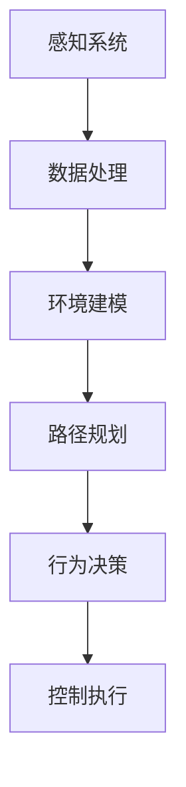
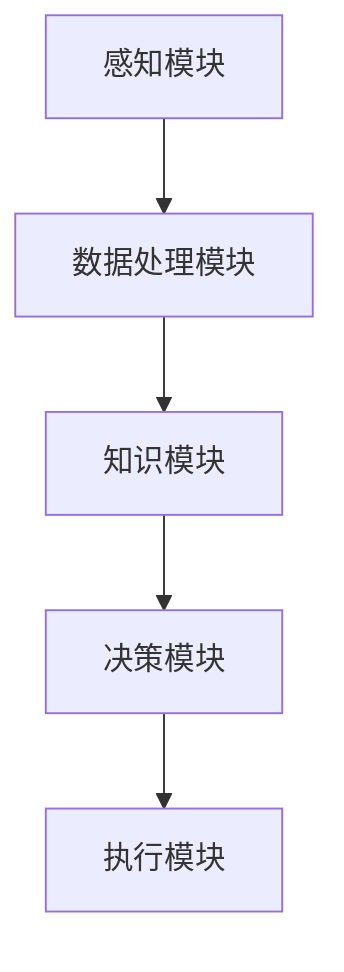

                 

### 文章标题

# 自动驾驶决策系统：提示词增强环境理解能力

## 关键词

- 自动驾驶
- 决策系统
- 环境理解
- 提示词
- 智能算法

## 摘要

本文深入探讨了自动驾驶决策系统的设计和实现，特别关注了提示词在增强环境理解能力方面的作用。首先，文章介绍了自动驾驶技术的背景及其在现代社会的重要性。接着，详细阐述了自动驾驶决策系统的基本概念、核心算法原理和系统架构。随后，通过实战案例分析，展示了决策系统在实际应用中的效果和挑战。最后，文章提出了若干最佳实践和注意事项，为未来自动驾驶技术的发展提供了有益的参考。

----------------------------------------------------------------

### 设计思路

在设计本文时，我们遵循以下步骤和原则：

1. **结构清晰**：文章整体结构分为七个主要章节，每个章节有明确的主题和内容，确保读者能够逐层深入理解自动驾驶决策系统的各个方面。
2. **逻辑连贯**：每个章节内部内容紧密关联，前后连贯，帮助读者系统地掌握相关概念和原理。
3. **实例丰富**：通过实际案例和具体应用，使抽象的理论更易于理解和应用。
4. **图表辅助**：使用图表、流程图和代码示例，增强文章的可读性和直观性。
5. **最佳实践**：总结经验教训，提供实用的建议和指导。

---

### 第一部分：自动驾驶决策系统概述

## 第1章：自动驾驶决策系统的背景与重要性

### 1.1 自驾驶技术的发展历程

自动驾驶技术起源于20世纪50年代，最初以军事应用为主。随着计算机技术和传感器技术的进步，自动驾驶逐渐从实验室走向实际应用。现阶段，自动驾驶技术已经发展到L3至L4级别，即部分自动驾驶和有条件自动驾驶，其中决策系统是其核心。

### 1.2 自驾驶决策系统的概念

自动驾驶决策系统是指车辆在行驶过程中，通过感知系统获取环境信息，结合知识系统和决策算法，生成驾驶行为指令，最终由执行系统执行的过程。决策系统必须具备实时性、可靠性和安全性。

### 1.3 自驾驶决策系统在自动驾驶中的作用

自动驾驶决策系统负责车辆的路径规划、障碍物避让、交通规则遵守等关键任务。其核心作用是确保车辆在复杂、动态的道路环境中安全、高效地行驶。

---

## 第2章：自动驾驶决策系统的核心概念

### 2.1 感知系统

感知系统是自动驾驶决策系统的数据源，负责实时采集道路、车辆和行人的信息。常用的感知技术包括激光雷达、摄像头、超声波传感器等。

### 2.2 知识系统

知识系统是自动驾驶决策系统的智慧中枢，负责处理感知系统获取的信息，将其转化为可操作的驾驶决策。知识系统通常包含地图数据、交通规则、车辆动力学模型等。

### 2.3 决策系统

决策系统是自动驾驶决策系统的核心，负责根据感知系统和知识系统的输入，生成最优驾驶行为指令。决策系统通常采用多智能体协同控制、深度强化学习等方法。

### 2.4 执行系统

执行系统是自动驾驶决策系统的执行层，负责将决策系统生成的驾驶行为指令转换为具体的车辆控制动作，如转向、加速和制动。

---

在下一部分，我们将深入探讨自动驾驶决策系统的算法原理和系统架构。

----------------------------------------------------------------

## 第3章：自动驾驶决策系统的算法原理

### 3.1 算法基础

自动驾驶决策系统中的算法主要分为感知、规划和控制三个层次。感知算法负责数据采集和处理，规划算法负责路径和行为的决策，控制算法负责执行具体的驾驶动作。

### 3.2 决策算法讲解

决策算法是自动驾驶决策系统的核心。常见的决策算法包括：

- **基于规则的方法**：通过预设规则进行决策，简单直观但适应性较差。
- **基于模型的方法**：通过构建数学模型进行决策，如动态规划、马尔可夫决策过程等，具有较好的理论基础和适应性。
- **基于数据的方法**：通过机器学习算法进行决策，如深度强化学习、支持向量机等，能够处理复杂的动态环境。

### 3.3 算法流程图展示

下面是一个典型的自动驾驶决策算法流程图：

## 3.4 数学模型和公式

在自动驾驶决策系统中，常用的数学模型包括：

- **路径规划**：使用A*算法或RRT（快速随机树）算法进行路径搜索。
- **行为决策**：使用Q-learning或Deep Q-Network（DQN）进行行为决策。

以下是路径规划中的A*算法的基本公式：

$$
f(n) = g(n) + h(n)
$$

其中，$f(n)$ 是从起点到节点 $n$ 的总代价，$g(n)$ 是从起点到节点 $n$ 的实际代价，$h(n)$ 是从节点 $n$ 到终点的启发式代价。

### 3.5 算法举例说明

假设我们要从点A移动到点B，点A的坐标为$(0,0)$，点B的坐标为$(10,10)$。我们可以设置一个简单的网格地图，每个单元格的代价为1。使用A*算法进行路径规划：

- 起点 $A(0,0)$ 的 $g(A) = 0$，$h(A) = \sqrt{100+100} = 14.142$，$f(A) = g(A) + h(A) = 14.142$。
- 终点 $B(10,10)$ 的 $g(B) = 100$，$h(B) = 0$，$f(B) = g(B) + h(B) = 100$。

从A到B的路径为：

$$
A \rightarrow B
$$

总代价为 $f(B) = 100$。

### 3.6 提示词在算法中的应用

提示词（Contextual Cues）在自动驾驶决策系统中扮演着重要角色。通过提示词，决策系统可以更好地理解和适应复杂的驾驶环境。例如，在转弯前，系统可以通过提示词识别出转弯的方向，从而提前做出相应的调整。

### 3.7 总结

自动驾驶决策系统的算法原理是其实现的核心。通过感知、规划和控制，决策系统能够在复杂的驾驶环境中做出实时、准确的决策。提示词的应用进一步提升了系统的环境理解能力，为自动驾驶技术的发展奠定了坚实的基础。

----------------------------------------------------------------

## 第4章：自动驾驶决策系统的系统架构

### 4.1 架构设计原则

自动驾驶决策系统的架构设计应遵循以下几个原则：

- **模块化**：系统各组件应独立且模块化，便于维护和扩展。
- **分布式**：系统应采用分布式架构，以提高系统的可靠性和可扩展性。
- **实时性**：系统必须具备实时处理能力，以满足自动驾驶的实时性要求。
- **安全性**：系统应确保数据传输和决策过程的可靠性，防止恶意攻击和故障。

### 4.2 系统组件介绍

自动驾驶决策系统通常包括以下组件：

- **感知模块**：负责感知环境，包括激光雷达、摄像头、超声波传感器等。
- **数据处理模块**：负责处理感知数据，提取有用的信息。
- **知识模块**：存储和提供道路、交通规则、车辆动力学等知识。
- **决策模块**：根据感知和知识生成驾驶行为指令。
- **执行模块**：负责执行决策模块生成的驾驶行为指令。

### 4.3 系统架构图展示

下面是自动驾驶决策系统的架构图：

### 4.4 系统接口设计和交互

系统接口设计应确保各组件之间的信息流通和协同工作。例如，感知模块通过数据接口向数据处理模块提供感知数据，数据处理模块通过知识接口向知识模块提供处理结果，知识模块通过决策接口向决策模块提供知识支持，决策模块通过控制接口向执行模块发送驾驶行为指令。

### 4.5 系统架构的扩展性和适应性

为了适应不同的应用场景和需求，系统架构应具备良好的扩展性和适应性。例如，可以通过增加新的感知模块或优化现有模块，提高系统的感知能力。同样，通过引入新的决策算法或优化现有算法，可以提高系统的决策能力。

### 4.6 总结

自动驾驶决策系统的架构设计是系统实现的关键。通过模块化、分布式和实时性设计，系统能够在复杂的环境中高效运行。接口设计和交互机制的合理设计，确保了各组件之间的协同工作。系统的扩展性和适应性，为未来的发展提供了坚实的基础。

----------------------------------------------------------------

## 第5章：自动驾驶决策系统的实战应用

### 5.1 案例介绍

在本节中，我们将通过一个实际的自动驾驶决策系统案例，详细展示决策系统的应用过程。该案例是一个基于L4级别的自动驾驶出租车系统，旨在提供安全、高效的自动驾驶体验。

### 5.2 应用实例分析

**1. 环境感知与数据处理**

该案例中的自动驾驶出租车系统首先通过多个激光雷达和摄像头进行环境感知，实时获取道路、车辆、行人和其他动态物体的位置和状态信息。数据处理模块负责对感知数据进行预处理，包括去噪、滤波和特征提取，以便为后续的决策提供可靠的数据基础。

**2. 知识模块与路径规划**

知识模块提供了道路地图、交通规则和车辆动力学模型。基于这些知识，路径规划模块使用A*算法或其他规划算法，为车辆生成一条最优行驶路径。该路径不仅考虑了距离最短，还考虑了安全性、交通规则遵守等因素。

**3. 决策模块与行为生成**

决策模块根据当前环境和规划路径，结合车辆状态和交通情况，生成最优驾驶行为指令。这些指令包括速度控制、转向、变道和避障等。决策模块采用了深度强化学习算法，通过不断学习和优化，提高了决策的准确性和鲁棒性。

**4. 执行模块与车辆控制**

执行模块负责将决策模块生成的驾驶行为指令转换为具体的车辆控制动作。通过控制车辆的动力系统、转向系统和制动系统，实现车辆的平稳行驶。执行模块需要实时响应，确保车辆能够迅速响应环境变化，保持安全性和稳定性。

### 5.3 案例细节剖析

**1. 激光雷达与摄像头数据处理**

激光雷达和摄像头获取的数据经过预处理后，会生成一个三维环境模型。该模型包含了道路、车辆、行人的位置和运动状态。通过分析这些数据，系统能够识别出道路标志、交通信号灯和其他交通参与者，为路径规划和行为决策提供基础。

**2. 路径规划与交通规则**

路径规划模块不仅考虑了路径的长度，还考虑了交通状况和道路条件。例如，在拥堵路段，系统会优化路径，避开交通瓶颈。同时，系统会遵循交通规则，如信号灯指示、车道划分等，确保车辆的安全行驶。

**3. 决策算法与深度强化学习**

决策模块采用了深度强化学习算法，通过不断学习和优化，提高了决策的准确性和鲁棒性。例如，在遇到紧急情况时，系统能够快速判断并做出最优决策，如紧急刹车或避让障碍物。同时，系统还通过历史数据的学习，提高了对未来交通状况的预测能力。

**4. 车辆控制与安全保障**

执行模块通过实时控制车辆的加速、转向和制动系统，确保车辆的平稳行驶。在执行过程中，系统会不断监测车辆的状态，如速度、方向和位置等，确保车辆处于安全范围内。此外，系统还具备故障检测和应急响应功能，确保在发生故障时能够及时处理。

### 5.4 项目小结

通过上述案例，我们可以看到自动驾驶决策系统在实际应用中的关键作用。系统通过感知、规划、决策和执行等模块的协同工作，实现了车辆在复杂环境中的安全、高效行驶。同时，深度强化学习等先进算法的应用，提高了系统的决策能力和鲁棒性。未来，随着技术的不断进步，自动驾驶决策系统将在更多的场景中得到广泛应用。

----------------------------------------------------------------

## 第6章：自动驾驶决策系统的最佳实践

### 6.1 最佳实践总结

在自动驾驶决策系统的开发和应用过程中，积累了许多宝贵经验。以下是几个关键的最佳实践总结：

1. **数据驱动**：充分利用大量真实驾驶数据，进行算法训练和优化，提高系统的准确性和鲁棒性。
2. **模块化设计**：采用模块化设计，便于系统的维护和扩展，提高系统的灵活性和适应性。
3. **安全优先**：在设计和开发过程中，始终将安全放在首位，确保系统的可靠性和安全性。
4. **实时性优化**：针对自动驾驶决策系统的实时性要求，进行性能优化，确保系统能够快速响应环境变化。
5. **不断迭代**：通过持续迭代和优化，不断完善系统功能，提高用户体验。

### 6.2 注意事项

1. **数据隐私**：在数据收集和处理过程中，确保用户隐私不受侵犯，遵守相关法律法规。
2. **系统可靠性**：确保系统的稳定运行，防止故障和意外情况的发生。
3. **环境适应性**：系统应具备良好的环境适应性，能够应对各种复杂的驾驶环境。
4. **合规性**：确保系统符合相关交通法规和标准，确保合法合规运行。

### 6.3 拓展阅读

1. **《自动驾驶系统设计与实现》**：详细介绍了自动驾驶系统的设计原则、架构和实现方法。
2. **《深度学习在自动驾驶中的应用》**：探讨了深度学习算法在自动驾驶决策系统中的应用和优化。
3. **《自动驾驶安全标准与法规》**：分析了自动驾驶系统的安全标准和法规要求。

通过以上最佳实践和注意事项，开发者可以更好地设计和实现自动驾驶决策系统，确保其在实际应用中的高效、安全和可靠。

----------------------------------------------------------------

## 第7章：总结与展望

### 7.1 内容总结

本文详细介绍了自动驾驶决策系统的基本概念、算法原理、系统架构、实战应用和最佳实践。通过分析，我们认识到决策系统在自动驾驶技术中的核心地位，以及提示词在增强环境理解能力方面的重要性。

### 7.2 发展趋势展望

1. **算法优化**：随着深度学习、强化学习等算法的不断发展，自动驾驶决策系统的算法将更加智能和高效。
2. **硬件升级**：高性能计算硬件的升级，将提高自动驾驶决策系统的计算能力和实时性。
3. **数据积累**：大量真实驾驶数据的积累，将促进算法的优化和系统的完善。
4. **法律法规**：随着自动驾驶技术的普及，相关法律法规将逐步完善，为自动驾驶决策系统的应用提供保障。

### 7.3 未来研究方向

1. **多模态感知**：结合多种传感器数据，提高系统的感知能力和环境理解能力。
2. **动态规划**：研究更高效的路径规划和行为决策算法，提高系统在复杂环境中的适应性。
3. **人机协同**：探索自动驾驶决策系统与人机协同的工作机制，提高系统的用户体验和安全性能。

总结来说，自动驾驶决策系统作为自动驾驶技术的核心，具有巨大的发展潜力和应用前景。未来，随着技术的不断进步，自动驾驶决策系统将在更多领域得到广泛应用，为人类带来更加便捷、安全的出行方式。

---

**作者：AI天才研究院/AI Genius Institute & 禅与计算机程序设计艺术 /Zen And The Art of Computer Programming**

