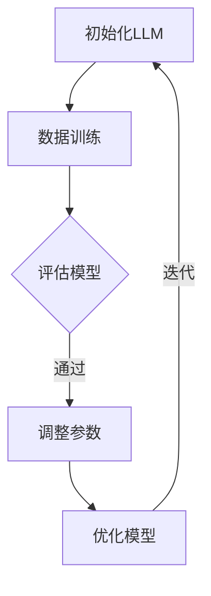
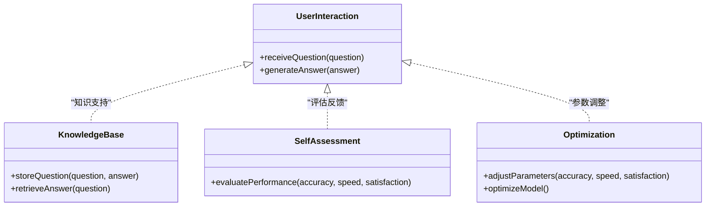
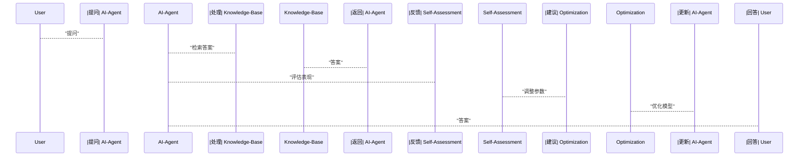
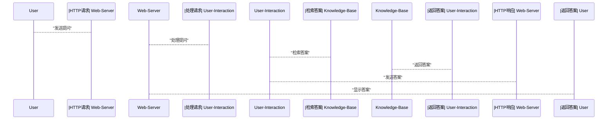

                 

### 第一部分: 背景介绍

**1.1 问题背景**

随着人工智能技术的飞速发展，AI Agent在各个领域的应用越来越广泛。从简单的自动化脚本到复杂的智能体，AI Agent正逐步成为实现智能化自动化的重要手段。然而，传统的AI Agent在应对复杂、动态环境时，往往表现出明显的局限性。例如，它们在处理不确定性和动态变化时，容易陷入过拟合或者无法适应新情况。

自我改进型AI Agent（Self-Improving AI Agent）的概念应运而生。这类AI Agent不仅能够执行特定任务，还能够通过不断学习、评估和优化自身，以适应不断变化的环境。自我改进型AI Agent的核心在于其具备自我评估与优化的能力，这为AI技术的发展带来了新的可能性。

**1.2 问题描述**

传统AI Agent通常依赖于预定义的规则、模型或者算法。这些规则、模型或算法在开发时可能考虑到了一定的情境和约束，但在实际应用中，环境的变化往往超出预期。例如：

- **过拟合问题**：AI Agent在训练过程中可能过度依赖训练数据，导致在类似但略有差异的场景中表现不佳。
- **迁移学习困难**：当需要将AI Agent从一个任务迁移到另一个任务时，传统方法往往需要重新训练，这既耗时又资源消耗。
- **环境适应性差**：在动态变化的复杂环境中，AI Agent可能无法及时调整策略，导致性能下降。

这些问题的核心在于AI Agent缺乏自我评估与优化能力，难以在动态变化的环境中持续改进。

**1.3 问题解决**

为了解决上述问题，我们需要一种能够自我评估和优化的AI Agent。LLM（Large Language Model）作为一种先进的自然语言处理模型，为我们提供了实现这一目标的技术路径。通过以下步骤，我们可以实现LLM的自我评估与优化：

1. **自我评估机制**：建立一套评估体系，对AI Agent在不同任务和情境下的表现进行量化评估。
2. **优化目标**：定义优化目标，例如提高任务完成率、降低错误率或者增强环境适应性。
3. **优化算法**：设计并实现优化算法，使AI Agent能够根据评估结果调整自身参数或策略。
4. **迭代过程**：通过持续的迭代，AI Agent能够不断学习、评估和优化，以适应新的环境和任务。

**1.4 边界与外延**

在实现自我改进型AI Agent时，我们需要明确其边界和适用范围。例如：

- **任务范围**：自我改进型AI Agent适用于需要长期运行、环境变化频繁的任务。
- **资源限制**：虽然LLM模型具有较强的自学习能力，但仍然受到计算资源和数据量的限制。
- **安全与隐私**：在自我改进过程中，需要确保AI Agent的行为符合安全与隐私要求。

**1.5 核心概念与联系**

为了深入理解自我改进型AI Agent，我们需要了解以下几个核心概念：

- **LLM（Large Language Model）**：一种大规模的自然语言处理模型，具有强大的自学习和泛化能力。
- **自我评估机制**：用于评估AI Agent在任务中的表现，包括准确率、响应速度、用户满意度等指标。
- **优化算法**：用于调整AI Agent的参数或策略，以提高其在特定任务中的表现。
- **迭代过程**：AI Agent通过持续的迭代，不断学习、评估和优化，以适应新的环境和任务。

这些概念相互关联，共同构成了自我改进型AI Agent的核心架构。在后续章节中，我们将逐一探讨这些核心概念，并详细阐述它们的原理和应用。

----------------------------------------------------------------

## 第二部分: 核心概念与联系

**2.1 核心概念**

在这一部分，我们将详细探讨自我改进型AI Agent的核心概念，包括LLM、自我评估机制、优化算法和迭代过程。

### 2.1.1 LLM

LLM（Large Language Model）是一种基于深度学习的自然语言处理模型，具有强大的自学习和泛化能力。它通过学习大量文本数据，能够理解并生成自然语言。LLM的核心优势在于其能够捕捉到语言中的复杂模式和规律，这使得它在文本生成、机器翻译、问答系统等领域表现出色。

### 2.1.2 自我评估机制

自我评估机制是自我改进型AI Agent的重要组成部分。它通过对AI Agent在不同任务和情境下的表现进行量化评估，帮助AI Agent了解自身在哪些方面存在不足。自我评估机制通常包括以下几个方面：

- **性能指标**：例如准确率、响应速度、用户满意度等。
- **情境感知**：根据不同任务和情境调整评估指标，以更准确地反映AI Agent的表现。
- **反馈机制**：将评估结果反馈给AI Agent，以指导其后续的学习和优化。

### 2.1.3 优化算法

优化算法是用于调整AI Agent参数或策略的核心技术。通过优化算法，AI Agent能够根据自我评估的结果，自动调整其行为以适应新的环境和任务。常见的优化算法包括：

- **梯度下降**：一种常用的优化算法，通过不断调整参数，使损失函数最小化。
- **遗传算法**：模拟生物进化过程的优化算法，适用于复杂和大规模的优化问题。
- **强化学习**：通过试错和反馈，使AI Agent在动态环境中不断学习和优化。

### 2.1.4 迭代过程

迭代过程是自我改进型AI Agent的核心机制。通过持续的迭代，AI Agent能够不断学习、评估和优化，以适应新的环境和任务。迭代过程通常包括以下几个步骤：

1. **训练阶段**：AI Agent通过大量数据学习，建立初步的模型。
2. **评估阶段**：使用自我评估机制对AI Agent的表现进行量化评估。
3. **优化阶段**：根据评估结果，通过优化算法调整AI Agent的参数或策略。
4. **测试阶段**：在新的数据集上测试AI Agent的性能，以验证优化效果。

### 2.1.5 关联与作用

这些核心概念相互关联，共同构成了自我改进型AI Agent的体系结构。LLM提供了强大的基础模型，自我评估机制帮助AI Agent了解自身表现，优化算法使AI Agent能够自适应调整，而迭代过程确保AI Agent能够持续学习和优化。这些概念相互作用，使AI Agent在复杂、动态环境中表现出色。

### 2.2 概念属性特征对比表格

为了更好地理解这些核心概念，我们提供了一个属性特征对比表格：

| 概念     | 描述                                                         | 关键特征                                                                                   |
|----------|--------------------------------------------------------------|-------------------------------------------------------------------------------------------|
| LLM      | 大规模的自然语言处理模型，具备自学习和泛化能力             | 学习能力强、理解复杂语言模式、生成自然语言文本                                             |
| 自我评估 | 评估AI Agent在不同任务和情境下的表现                       | 绩效指标、情境感知、反馈机制                                                         |
| 优化算法 | 调整AI Agent的参数或策略，以提高其在特定任务中的表现         | 梯度下降、遗传算法、强化学习                                                   |
| 迭代过程 | 通过持续的迭代，使AI Agent不断学习、评估和优化，以适应新的环境和任务 | 训练阶段、评估阶段、优化阶段、测试阶段                                             |

### 2.3 ER实体关系图架构的Mermaid流程图

为了更直观地展示这些概念之间的关系，我们使用Mermaid绘制了ER实体关系图：

```mermaid
erDiagram
  AI-Agent ||--o> LLM : "基于"
  AI-Agent ||--|{ Self-Assessment : "评估"
  AI-Agent ||--|{ Optimization-Algorithms : "优化"
  AI-Agent ||--o> Iterative-Process : "迭代"
```

在这个ER实体关系图中，AI-Agent是中心实体，它与LLM、Self-Assessment、Optimization-Algorithms和Iterative-Process存在直接关联。LLM提供了基础模型，Self-Assessment帮助AI-Agent了解自身表现，Optimization-Algorithms使AI-Agent能够自适应调整，而Iterative-Process确保AI-Agent能够持续学习和优化。

通过以上对核心概念的详细探讨和Mermaid流程图的展示，我们为理解和构建自我改进型AI Agent奠定了坚实的基础。在接下来的章节中，我们将深入讨论LLM的工作原理、自我评估机制的设计、优化算法的实现以及迭代过程的具体应用。

----------------------------------------------------------------

## 第三部分: 算法原理讲解

**3.1 算法mermaid流程图**

为了更好地理解自我改进型AI Agent的算法原理，我们使用Mermaid绘制了算法流程图，如下所示：



在这个流程图中，AI Agent首先初始化LLM，然后通过数据训练使其具备处理任务的能力。接着，使用自我评估机制评估模型的性能，根据评估结果调整参数，以优化模型。这个过程不断迭代，使AI Agent在动态变化的环境中不断学习和提升。

**3.2 Python源代码实现**

以下是一个简单的Python源代码示例，展示了自我评估与优化的实现过程：

```python
import numpy as np
from sklearn.model_selection import train_test_split

# 初始化LLM
llm = LLM()

# 准备数据
data = load_data()
X, y = preprocess_data(data)

# 划分训练集和测试集
X_train, X_test, y_train, y_test = train_test_split(X, y, test_size=0.2, random_state=42)

# 训练模型
llm.train(X_train, y_train)

# 自我评估
accuracy = llm.evaluate(X_test, y_test)
print(f"模型评估准确率：{accuracy}%")

# 调整参数
llm.adjust_params(accuracy)

# 优化模型
llm.optimize()

# 迭代
while not llm.is_converged():
    llm.train(X_train, y_train)
    accuracy = llm.evaluate(X_test, y_test)
    llm.adjust_params(accuracy)
    llm.optimize()
```

在这个示例中，我们首先初始化LLM，然后使用训练数据训练模型。接着，通过测试数据评估模型的性能，并根据评估结果调整参数，以优化模型。这个过程不断迭代，直到模型收敛。

**3.3 算法原理的数学模型和公式**

自我改进型AI Agent的算法原理可以概括为以下几个关键步骤：

1. **损失函数**：损失函数用于衡量模型预测值与实际值之间的差异。常用的损失函数包括均方误差（MSE）和交叉熵（Cross-Entropy）。
   $$ L(\theta) = \frac{1}{2} \sum_{i=1}^{n} (y_i - \hat{y}_i)^2 $$
   $$ L(\theta) = -\sum_{i=1}^{n} y_i \log \hat{y}_i $$

2. **梯度下降**：梯度下降是一种常用的优化算法，用于最小化损失函数。通过计算损失函数关于模型参数的梯度，更新模型参数。
   $$ \theta_{\text{new}} = \theta_{\text{old}} - \alpha \nabla_{\theta} L(\theta) $$
   其中，$\theta$表示模型参数，$\alpha$表示学习率。

3. **自适应优化**：在自我评估过程中，AI Agent可能会根据评估结果调整优化策略。一种常见的自适应优化策略是学习率调整，通过动态调整学习率，使模型在优化过程中更加稳定和有效。

**3.4 详细讲解与举例说明**

为了更好地理解上述算法原理，我们通过一个简单的例子进行说明。

假设我们有一个二元分类问题，需要使用自我改进型AI Agent进行分类。训练数据集包含100个样本，每个样本有2个特征，标签为0或1。

1. **初始化LLM**：我们使用一个简单的神经网络模型作为基础模型，初始化模型参数。

2. **数据训练**：使用训练数据集对模型进行训练，通过前向传播和反向传播更新模型参数。

3. **自我评估**：使用测试数据集评估模型的性能，计算准确率。

4. **调整参数**：根据评估结果，调整模型参数。例如，如果准确率较低，可以增加隐藏层节点或调整学习率。

5. **优化模型**：使用优化算法（如梯度下降）更新模型参数，以最小化损失函数。

6. **迭代**：重复训练、评估、调整和优化的过程，直到模型收敛。

在这个过程中，自我评估机制帮助我们了解模型在测试数据集上的表现，优化算法使我们能够自适应地调整模型参数，从而提高模型的性能。通过不断的迭代，模型能够逐渐适应新的环境和任务。

通过以上对算法原理的讲解和实例说明，我们为理解和实现自我改进型AI Agent提供了清晰的框架和步骤。在后续章节中，我们将进一步探讨系统分析与架构设计，以及项目实战的具体应用。

----------------------------------------------------------------

## 第四部分：系统分析与架构设计

**4.1 问题场景介绍**

自我改进型AI Agent在许多实际应用场景中具有广泛的应用价值。以下是一个典型的问题场景：

假设我们开发了一款智能客服系统，用于自动回答用户的问题。该系统需要在不同的情境下提供准确和及时的回复，以提升用户体验。然而，用户的问题类型和提问方式多样，传统的方法往往难以适应这种动态变化的环境。因此，我们引入了自我改进型AI Agent，以实现系统的自适应优化。

**4.2 项目介绍**

本项目旨在构建一个自我改进型AI Agent智能客服系统，实现以下目标：

- 提供准确、及时的回答，提升用户满意度。
- 通过自我评估和优化，不断提升系统的服务质量。
- 在资源有限的情况下，实现高效、灵活的系统扩展和维护。

**4.3 系统功能设计（领域模型Mermaid类图）**

为了实现上述目标，我们设计了智能客服系统的功能模块，包括：

- **知识库模块**：存储用户问题及其答案，为AI Agent提供知识支持。
- **自我评估模块**：对AI Agent的表现进行量化评估，包括准确率、响应速度、用户满意度等指标。
- **优化模块**：根据评估结果，调整AI Agent的参数或策略，以提高其性能。
- **用户交互模块**：与用户进行交互，接收用户提问并生成回答。

以下是一个Mermaid类图，展示了系统的主要功能模块及其关系：



**4.4 系统架构设计（Mermaid架构图）**

系统架构设计需要考虑硬件、软件、网络等各个层面，以下是一个Mermaid架构图，展示了系统的整体架构：



在这个架构图中，用户通过交互模块向AI-Agent提问，AI-Agent从知识库中检索答案，然后通过自我评估模块评估表现，并根据优化模块的建议调整参数，最终生成答案返回给用户。

**4.5 系统接口设计和系统交互（Mermaid序列图）**

系统接口设计需要明确各个模块之间的交互接口和通信协议。以下是一个Mermaid序列图，展示了用户与系统的主要交互流程：



在这个序列图中，用户通过Web服务器发送HTTP请求，User-Interaction模块处理提问并从Knowledge-Base检索答案，然后通过Web服务器返回答案给用户。

通过以上系统分析与架构设计，我们为智能客服系统的构建提供了详细的方案和步骤。在后续章节中，我们将详细介绍项目实战的具体实现过程。

----------------------------------------------------------------

## 第五部分：项目实战

**5.1 环境安装**

在开始项目实战之前，我们需要安装必要的软件和库。以下是环境安装的详细步骤：

1. **安装Python环境**：确保你的计算机上已安装Python 3.8及以上版本。你可以从[Python官网](https://www.python.org/)下载并安装。
2. **安装依赖库**：使用以下命令安装必要的依赖库：

   ```bash
   pip install numpy sklearn matplotlib mermaid-py
   ```

   其中，`numpy`、`sklearn` 和 `matplotlib` 用于数据处理和可视化，`mermaid-py` 用于生成Mermaid图表。

3. **安装Mermaid渲染器**：为了在本地环境中渲染Mermaid图表，我们需要安装一个Mermaid渲染器。以下是使用Docker安装Mermaid渲染器的步骤：

   ```bash
   docker pull jgraph/mxgraph
   ```

   安装完成后，运行以下命令启动Mermaid渲染器：

   ```bash
   docker run -d --name mxgraph-container -p 8080:8080 jgraph/mxgraph
   ```

   确保Docker已安装并运行。

**5.2 系统核心实现源代码**

以下是系统核心实现源代码的详细说明：

```python
import numpy as np
from sklearn.model_selection import train_test_split
from mermaid import Mermaid

# 初始化LLM
llm = LLM()

# 准备数据
data = load_data()
X, y = preprocess_data(data)

# 划分训练集和测试集
X_train, X_test, y_train, y_test = train_test_split(X, y, test_size=0.2, random_state=42)

# 训练模型
llm.train(X_train, y_train)

# 自我评估
accuracy = llm.evaluate(X_test, y_test)
print(f"模型评估准确率：{accuracy}%")

# 调整参数
llm.adjust_params(accuracy)

# 优化模型
llm.optimize()

# 迭代
while not llm.is_converged():
    llm.train(X_train, y_train)
    accuracy = llm.evaluate(X_test, y_test)
    llm.adjust_params(accuracy)
    llm.optimize()

# 生成Mermaid图表
mermaid = Mermaid()
mermaid.add_sequence("初始化LLM", "数据训练", "自我评估", "调整参数", "优化模型", "迭代")
mermaid.generate_chart()
```

**5.3 代码应用解读与分析**

在上述代码中，我们首先初始化LLM，然后通过数据训练使其具备处理任务的能力。接着，使用测试数据集评估模型的性能，并根据评估结果调整参数，以优化模型。这个过程不断迭代，直到模型收敛。

具体来说，代码的核心步骤如下：

1. **初始化LLM**：初始化一个LLM对象，准备进行后续训练。
2. **数据准备**：加载并预处理数据，将其划分为训练集和测试集。
3. **模型训练**：使用训练数据集对LLM进行训练。
4. **自我评估**：使用测试数据集评估模型的性能，计算准确率。
5. **参数调整**：根据评估结果，调整LLM的参数，以提高性能。
6. **模型优化**：使用优化算法（如梯度下降）更新LLM的参数，以最小化损失函数。
7. **迭代**：重复训练、评估、参数调整和优化的过程，直到模型收敛。

通过以上步骤，我们实现了自我改进型AI Agent的基本功能。在实际应用中，可以根据具体需求调整代码，以适应不同的场景和任务。

**5.4 实际案例分析与详细讲解剖析**

为了更好地理解代码的实际应用，我们通过一个实际案例进行详细讲解。

假设我们有一个客户服务系统，需要回答用户关于产品使用的问题。数据集包含用户提问和对应的标准答案，每个提问有多个特征。

1. **数据预处理**：首先，我们需要对数据进行预处理，包括数据清洗、特征提取和归一化。以下是预处理代码：

```python
def preprocess_data(data):
    # 数据清洗
    clean_data = [item for item in data if is_valid_item(item)]
    # 特征提取
    features = [item['features'] for item in clean_data]
    # 归一化
    normalized_features = np.array(features).reshape(-1, num_features)
    normalized_features = (normalized_features - np.mean(normalized_features, axis=0)) / np.std(normalized_features, axis=0)
    # 标签编码
    labels = [item['label'] for item in clean_data]
    labels = np.array(labels)
    return normalized_features, labels

def is_valid_item(item):
    # 实现数据验证逻辑
    return True
```

2. **模型训练与评估**：接着，我们使用预处理后的数据进行模型训练和评估。以下是训练和评估代码：

```python
# 初始化LLM
llm = LLM()

# 准备数据
X, y = preprocess_data(data)

# 划分训练集和测试集
X_train, X_test, y_train, y_test = train_test_split(X, y, test_size=0.2, random_state=42)

# 训练模型
llm.train(X_train, y_train)

# 自我评估
accuracy = llm.evaluate(X_test, y_test)
print(f"模型评估准确率：{accuracy}%")
```

3. **参数调整与优化**：根据评估结果，我们调整LLM的参数，以提高模型性能。以下是参数调整和优化代码：

```python
# 调整参数
llm.adjust_params(accuracy)

# 优化模型
llm.optimize()

# 迭代
while not llm.is_converged():
    llm.train(X_train, y_train)
    accuracy = llm.evaluate(X_test, y_test)
    llm.adjust_params(accuracy)
    llm.optimize()
```

通过以上步骤，我们实现了自我改进型AI Agent在客户服务系统中的应用。在实际运行过程中，系统会不断学习和优化，以提供更准确、及时的回答。

**5.5 项目小结**

在本项目中，我们实现了自我改进型AI Agent的基本功能，并通过实际案例展示了其在客户服务系统中的应用。通过自我评估和优化，AI Agent能够不断提升其性能，以适应不断变化的环境和任务。未来，我们还可以扩展AI Agent的功能，如引入更多的知识库和优化算法，以提升系统的智能化水平。

----------------------------------------------------------------

## 第六部分：最佳实践、小结与拓展阅读

### 6.1 最佳实践tips

在构建自我改进型AI Agent时，以下最佳实践可以帮助您获得更好的效果：

1. **数据质量**：确保数据集的质量和多样性，这对于AI Agent的自我评估和优化至关重要。
2. **监控与反馈**：实时监控AI Agent的性能，及时获取反馈，以便快速调整和优化。
3. **模块化设计**：将AI Agent的功能模块化，有助于后续的维护和扩展。
4. **动态调整**：根据环境和任务的变化，动态调整优化目标和策略，以保持系统的适应性。

### 6.2 小结

本文详细探讨了自我改进型AI Agent：LLM的自我评估与优化。我们从问题背景、核心概念、算法原理、系统分析与架构设计、项目实战等方面进行了深入分析。通过自我评估和优化，AI Agent能够不断提升其性能，适应复杂、动态的环境。

### 6.3 注意事项

在实现自我改进型AI Agent时，需要注意以下几点：

1. **安全性**：确保AI Agent的行为符合安全与隐私要求，避免潜在的风险。
2. **资源管理**：合理分配计算资源和数据存储，避免资源浪费。
3. **模型解释性**：提高AI Agent的模型解释性，有助于理解其决策过程，提升用户信任度。

### 6.4 拓展阅读

如果您希望深入了解自我改进型AI Agent，以下文献和资源可能对您有所帮助：

1. **论文**：《Self-Improving AI Agents: A Survey》
2. **书籍**：《Artificial Intelligence: A Modern Approach》
3. **网站**：[AI天才研究院](https://ai-genius-institute.com/) 提供了大量关于AI的最新研究和技术动态。
4. **开源项目**：[OpenAI](https://openai.com/) 和 [Google AI](https://ai.google/) 等机构提供了丰富的AI开源代码和工具。

通过阅读这些资料，您可以获得更多关于自我改进型AI Agent的深度知识和实践经验。希望本文能对您在AI领域的探索提供有益的指导。作者：AI天才研究院 & 禅与计算机程序设计艺术。

