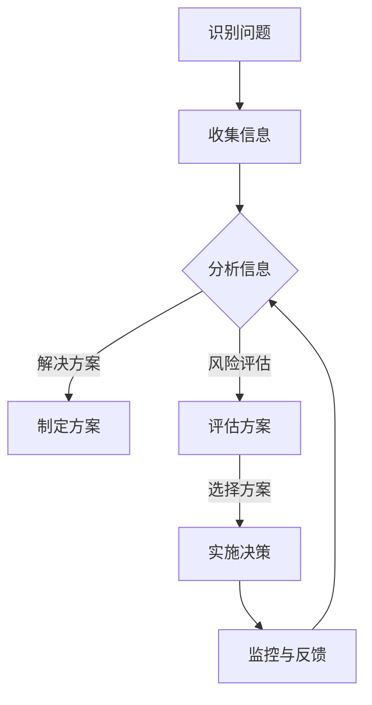
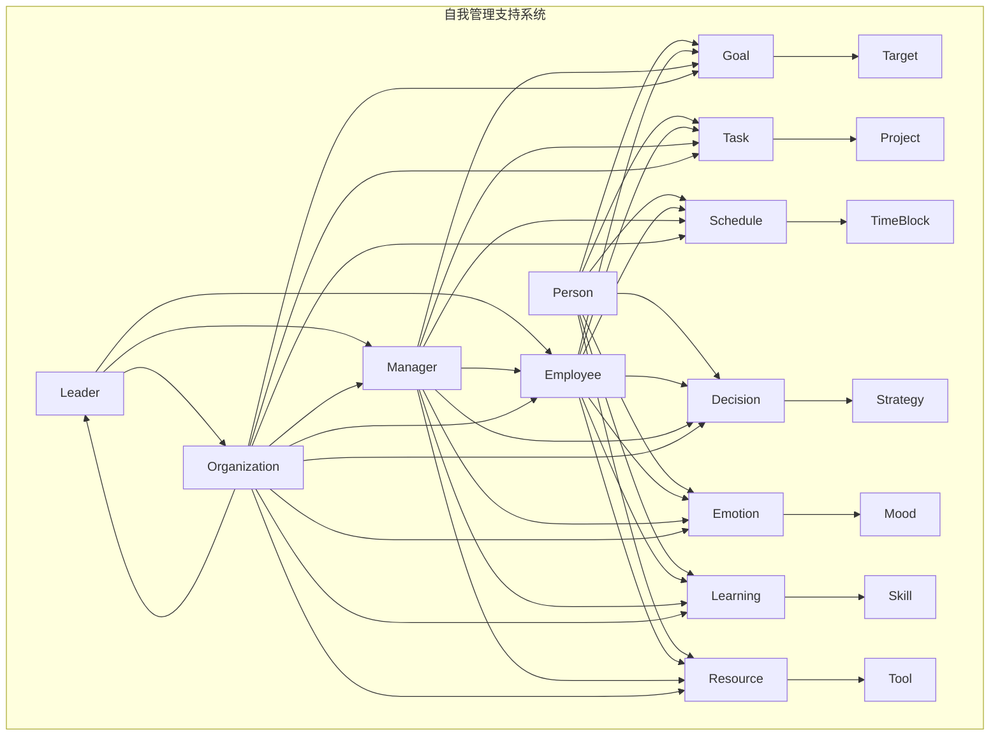
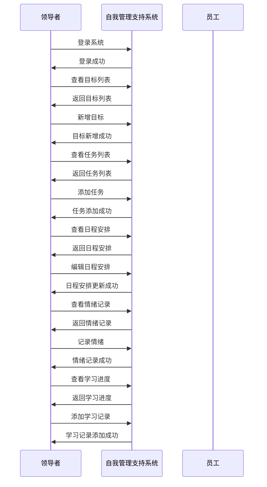
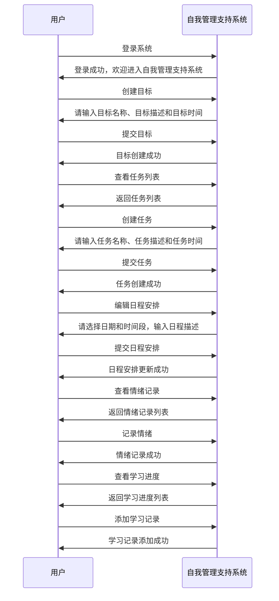

                 

### 第1章 引言：为什么自我管理对领导者至关重要

> 关键词：自我管理、领导者、个人成长、组织绩效

**摘要：** 本章节将探讨自我管理在领导者角色中的重要性，分析领导者在面对各种挑战时，如何通过自我管理实现个人成长并提升组织绩效。

#### 1.1 领导者的挑战

领导者的角色在组织中至关重要，他们不仅要具备强大的专业能力，还需要具备卓越的领导力和管理能力。随着市场竞争的加剧，企业对领导者的要求越来越高。领导者面临的主要挑战包括：

- **快速变化的环境：** 市场环境瞬息万变，领导者需要具备快速适应变化的能力。
- **复杂的人际关系：** 领导者需要协调不同部门、不同层级之间的关系，确保团队的凝聚力。
- **高效的决策能力：** 领导者需要做出明智的决策，以应对复杂的问题和挑战。
- **持续的个人成长：** 领导者需要不断提升自己的能力，以适应不断变化的市场需求。

#### 1.2 自我管理的重要性

自我管理是领导者实现个人成长和提升组织绩效的关键。自我管理包括以下几个方面：

- **自我认知：** 了解自己的性格、优势和劣势，明确自己的职业目标和兴趣。
- **目标设定：** 设定明确、可衡量的目标，并制定实现目标的计划和步骤。
- **时间管理：** 高效利用时间，合理安排工作和个人生活，提高工作效率。
- **决策与问题解决：** 培养决策能力和问题解决能力，确保做出明智的决策。
- **情绪管理：** 调节自己的情绪，保持冷静，以应对压力和挑战。
- **持续学习：** 不断学习新知识、新技能，提升自己的专业能力和领导力。

#### 1.3 自我管理的核心要素

自我管理的核心要素包括以下几个方面：

- **自我认知：** 通过自我反思、性格分析和能力评估，深入了解自己。
- **目标设定：** 设定明确、可衡量的目标，并制定实现目标的计划和步骤。
- **时间管理：** 采用科学的时间管理方法，合理安排工作和生活。
- **决策与问题解决：** 培养决策能力和问题解决能力，确保做出明智的决策。
- **情绪管理：** 学习情绪管理技巧，保持情绪稳定，以应对压力和挑战。
- **持续学习：** 不断学习新知识、新技能，提升自己的专业能力和领导力。

#### 深入思考

作为领导者，您是否意识到自我管理对您的重要性？在您的职业生涯中，您是如何进行自我管理的？请思考以下问题：

1. 您对自己的性格、优势和劣势了解多少？
2. 您是否有明确的目标，并制定了实现目标的计划？
3. 您如何合理安排工作和生活，提高工作效率？
4. 在面对困难和挑战时，您是如何做出决策和解决问题的？
5. 您如何管理自己的情绪，保持冷静和乐观？

在接下来的章节中，我们将详细探讨自我管理的各个方面，帮助您更好地理解和应用自我管理策略，成为一位更优秀的领导者。

### 第2章 自我认知：了解自己，成为更好的领导者

> 关键词：自我认知、性格分析、能力评估、职业规划

**摘要：** 本章节将深入探讨自我认知的重要性，介绍自我认知的方法和工具，以及如何通过自我认知进行职业规划，以帮助领导者更好地了解自己，成为更好的领导者。

#### 2.1 自我认知的重要性

自我认知是领导者自我管理的基石。通过自我认知，领导者可以更清晰地了解自己的性格、优势和劣势，从而更好地规划自己的职业生涯，提升领导能力。

自我认知的重要性体现在以下几个方面：

- **个人成长：** 了解自己的性格和优势，有助于找到适合自己的职业路径，实现个人成长。
- **领导能力提升：** 了解自己的劣势，有助于发现需要改进的方面，提升领导能力。
- **团队管理：** 了解团队成员的性格和优势，有助于更好地协调团队，提高团队绩效。
- **决策制定：** 了解自己的决策风格和偏好，有助于更科学、更明智地做出决策。

#### 2.2 如何进行自我认知

进行自我认知，需要从以下几个方面入手：

- **自我反思：** 通过定期反思自己的行为和决策，了解自己的性格和行为模式。
- **性格分析：** 利用性格分析工具，如MBTI、DISC等，了解自己的性格特征和倾向。
- **能力评估：** 通过工作表现和项目完成情况，评估自己的能力和技能水平。
- **职业规划：** 基于自我认知，制定适合自己的职业发展路径。

#### 2.3 自我认知的工具与方法

进行自我认知，可以借助以下工具和方法：

- **自我反思日志：** 每天记录自己的行为和思考，定期进行总结和分析。
- **性格测试：** 通过MBTI、DISC等性格测试工具，了解自己的性格特征。
- **360度反馈：** 通过同事、下属和上级的反馈，了解自己的工作表现和性格特点。
- **导师指导：** 找一位经验丰富的导师，进行一对一的指导和反馈。

#### 2.4 自我认知案例分析

以下是某位领导者进行自我认知的过程：

**案例背景：** 李某是一位公司的部门经理，他在工作中表现出色，但一直感觉自己的领导能力有待提升。

**自我反思：** 李某每天记录自己的工作日志，分析自己的决策过程和工作方法，发现自己在处理团队冲突时，往往过于严厉，导致团队士气下降。

**性格分析：** 李某参加了MBTI测试，结果显示他属于S型性格，即依赖事实和数据，注重实际结果，擅长处理具体问题。

**能力评估：** 李某参加了公司的领导力培训，通过培训师的反馈和同事的评价，了解到自己在沟通技巧和团队管理方面有待提高。

**职业规划：** 基于自我认知，李某决定参加更多的领导力培训，提升自己的沟通技巧和团队管理能力，并制定了5年的职业发展规划。

**案例总结：** 通过自我认知，李某找到了自己的优势和劣势，明确了需要改进的方面，并制定了详细的职业发展规划，从而更好地发挥自己的领导潜力。

#### 深入思考

作为领导者，您是否重视自我认知？您是如何进行自我认知的？在自我认知的过程中，您是否遇到了挑战？请思考以下问题：

1. 您是否了解自己的性格和优势？
2. 您是否定期进行自我反思？
3. 您是否借助外部工具进行自我认知？
4. 您是否制定了职业发展规划？
5. 在自我认知的过程中，您是否遇到过挑战？如何克服这些挑战？

在接下来的章节中，我们将继续探讨领导者如何进行目标设定和时间管理，帮助您更好地实现自我管理，成为更优秀的领导者。

### 第3章 目标设定：明确方向，实现成长

> 关键词：目标设定、SMART原则、目标拆解、进度跟踪

**摘要：** 本章节将介绍目标设定的基本原则，包括SMART原则，以及如何进行目标拆解和进度跟踪，帮助领导者明确方向，实现个人和团队的成长。

#### 3.1 目标设定的基本原则

目标设定是自我管理的重要组成部分，它有助于领导者明确方向，激发动力，实现个人和团队的成长。目标设定的基本原则包括以下几个方面：

- **明确性（Specific）：** 目标要具体明确，避免模糊和抽象。
- **可衡量性（Measurable）：** 目标要有明确的衡量标准，以便跟踪进展。
- **可实现性（Achievable）：** 目标要切实可行，避免过于理想化。
- **相关性（Relevant）：** 目标要与个人和组织的整体目标相一致。
- **时限性（Time-bound）：** 目标要有明确的完成时限。

这些原则被称为SMART原则，是目标设定的基础。SMART原则有助于确保目标的明确性、可衡量性、可行性和时效性，从而提高目标设定的质量和实现的可能性。

#### 3.2 如何设定可衡量的目标

设定可衡量的目标是目标设定过程中的关键步骤。以下是一些具体的建议：

- **明确具体目标：** 将目标具体化，例如“增加销售额”可以改为“增加销售额至1000万元”。
- **设定衡量标准：** 为目标设定明确的衡量标准，例如“增加销售额”可以衡量为“销售额增长20%”。
- **制定量化指标：** 使用具体的数字或比例来衡量目标的完成情况，例如“销售额增长20%”。
- **设立时间节点：** 为目标设定具体的时间节点，例如“在下一个季度实现销售额增长20%”。

通过这些步骤，可以确保目标既具体又可衡量，从而提高实现目标的可操作性和可控性。

#### 3.3 目标管理的方法

目标管理不仅包括设定目标，还包括制定实现目标的计划和步骤。以下是一些目标管理的方法：

- **目标拆解：** 将大目标拆解成小目标，使其更加具体和可实现。例如，将“提升公司市场份额”拆解为“每个季度提升市场份额1%”。
- **制定行动计划：** 为每个小目标制定具体的行动计划，明确每个步骤的责任人和完成时间。
- **进度跟踪：** 定期检查目标的进展情况，及时调整计划，确保目标的实现。
- **激励机制：** 设立激励机制，鼓励团队成员为实现目标而努力。

#### 3.4 目标设定的案例分析

以下是某位领导者进行目标设定的过程：

**案例背景：** 张某是一位公司的产品经理，他希望提升产品的市场占有率。

**目标设定：** 张某制定了以下目标：
- 明确性：提升产品市场占有率至15%。
- 可衡量性：市场占有率提升5%。
- 可实现性：通过增加广告投放和优化产品功能实现。
- 相关性：提升市场占有率与公司整体战略目标一致。
- 时限性：在下一个财年内实现。

**目标拆解：** 张某将大目标拆解为以下几个小目标：
1. 下一个季度，提高产品曝光率。
2. 下一个季度，提升用户满意度。
3. 下一个季度，增加新客户数量。

**行动计划：** 张某制定了以下行动计划：
1. 下一个季度，增加广告投放预算。
2. 下一个季度，优化产品功能，提高用户满意度。
3. 下一个季度，开展市场调研，吸引新客户。

**进度跟踪：** 张某每周与团队成员会面，检查目标的进展情况，并根据实际情况调整计划。

**案例总结：** 通过设定明确、可衡量、可实现、相关和时限性的目标，并拆解为小目标，制定行动计划，张某成功地提升了产品的市场占有率。

#### 深入思考

作为领导者，您是否善于设定目标？在目标设定过程中，您是否遵循SMART原则？请思考以下问题：

1. 您的目标是否具体、可衡量、可实现、相关和时限性？
2. 您是否将大目标拆解为小目标，并制定了具体的行动计划？
3. 您是否定期检查目标的进展，并根据实际情况进行调整？
4. 您是否建立了激励机制，鼓励团队成员为实现目标而努力？

在接下来的章节中，我们将探讨时间管理和决策与问题解决，帮助您更好地实现自我管理，提升领导能力。

### 第4章 时间管理：高效利用时间，提高效率

> 关键词：时间管理、优先级、时间块、习惯养成

**摘要：** 本章节将介绍时间管理的基本原则和技巧，包括如何设定优先级、使用时间块和养成良好习惯，帮助领导者高效利用时间，提高工作效率。

#### 4.1 时间管理的意义

时间管理是自我管理的重要组成部分，对于领导者来说尤为重要。有效的时间管理能够帮助领导者：

- **提高工作效率：** 通过合理规划时间，减少无谓的时间浪费，提高工作效率。
- **确保任务完成：** 设定明确的优先级和目标，确保重要任务得到优先处理。
- **平衡工作与生活：** 合理安排时间，使工作与生活达到平衡，提高生活质量。
- **增强决策能力：** 通过时间管理，领导者能够更好地分析问题，做出更明智的决策。

#### 4.2 时间管理的方法

时间管理的方法多种多样，以下是一些常用的方法：

- **设定优先级：** 根据任务的重要性和紧急程度，将任务分为“重要且紧急”、“重要但不紧急”、“不重要但紧急”和“不重要且不紧急”四个类别，并优先处理重要且紧急的任务。
- **使用时间块：** 将一天的时间划分为多个时间块，每个时间块专注于一项任务，避免任务切换造成的效率降低。
- **任务分解：** 将大任务分解为小任务，逐一完成，确保每个任务都有明确的时间节点和责任人。
- **避免拖延：** 及时处理任务，避免拖延，以防止任务积压和效率下降。

#### 4.3 常见的时间管理误区

在时间管理过程中，领导者常常会陷入一些误区，以下是一些常见的时间管理误区：

- **过度多任务处理：** 同时处理多个任务，导致注意力分散，效率降低。
- **过度依赖电子设备：** 过度依赖手机、电脑等电子设备，容易陷入信息过载，浪费时间。
- **未设定优先级：** 没有根据任务的重要性和紧急程度设定优先级，导致重要任务被忽视。
- **未设定时间节点：** 没有为任务设定明确的时间节点，导致任务无法按时完成。

#### 4.4 时间管理案例分析

以下是某位领导者进行时间管理的案例：

**案例背景：** 王某是一位公司的项目经理，他发现自己经常无法按时完成任务，工作压力较大。

**时间管理方法：**
1. **设定优先级：** 将任务分为“重要且紧急”、“重要但不紧急”、“不重要但紧急”和“不重要且不紧急”四个类别，确保重要任务得到优先处理。
2. **使用时间块：** 将一天的时间划分为四个时间块，每个时间块专注于一项任务，避免任务切换造成的效率降低。
3. **任务分解：** 将大任务分解为小任务，逐一完成，确保每个任务都有明确的时间节点和责任人。
4. **避免拖延：** 及时处理任务，避免拖延，以防止任务积压和效率下降。

**案例分析：**
通过设定优先级、使用时间块、任务分解和避免拖延，王某成功提高了工作效率，确保了任务的按时完成，工作压力明显减轻。

**案例总结：** 通过有效的时间管理方法，领导者能够更好地安排工作，提高工作效率，确保任务按时完成，从而提升个人和组织的绩效。

#### 深入思考

作为领导者，您是否有效管理时间？在时间管理过程中，您是否遵循了上述方法？请思考以下问题：

1. 您是否为任务设定了优先级？
2. 您是否使用了时间块来专注于任务？
3. 您是否将大任务分解为小任务？
4. 您是否避免了任务拖延？

在接下来的章节中，我们将探讨决策与问题解决，帮助您更好地实现自我管理，提升领导能力。

### 第5章 决策与问题解决：做出明智的选择

> 关键词：决策过程、问题解决、系统思维、风险评估

**摘要：** 本章节将探讨决策与问题解决的重要性和过程，包括系统思维和风险评估，帮助领导者做出明智的选择，有效应对各种问题和挑战。

#### 5.1 决策的重要性

决策是领导者的核心职责之一，决策的质量直接影响组织的发展和绩效。明智的决策能够帮助领导者：

- **应对挑战：** 在面对复杂问题和挑战时，做出正确的决策，引导组织走向成功。
- **抓住机会：** 快速识别市场机会，并迅速做出决策，抓住发展机遇。
- **提升绩效：** 通过科学决策，提高资源利用效率，优化组织结构，提升整体绩效。
- **建立信心：** 明智的决策能够增强团队成员的信心，提升团队凝聚力。

#### 5.2 决策过程

决策过程是一个系统化的过程，包括以下几个步骤：

1. **识别问题：** 明确需要解决的问题或机会，确保决策的目标明确。
2. **收集信息：** 收集与问题相关的数据和信息，确保信息的全面性和准确性。
3. **分析信息：** 分析收集到的信息，识别问题的主要原因和潜在解决方案。
4. **制定方案：** 根据分析结果，制定多个可能的解决方案。
5. **评估方案：** 对每个方案进行评估，包括成本、风险和收益。
6. **选择方案：** 根据评估结果，选择最佳方案。
7. **实施决策：** 制定详细的实施计划，确保决策得到有效执行。
8. **监控与反馈：** 监控决策的执行情况，根据反馈调整决策。

#### 5.3 问题解决的步骤

问题解决是决策过程中至关重要的一环，以下是问题解决的步骤：

1. **定义问题：** 确定问题的性质和范围，确保问题定义的清晰性。
2. **收集信息：** 收集与问题相关的数据和信息，确保信息的全面性和准确性。
3. **分析问题：** 分析问题产生的原因，识别关键因素和影响因素。
4. **制定解决方案：** 根据问题分析结果，制定多个可能的解决方案。
5. **评估解决方案：** 对每个解决方案进行评估，包括成本、风险和收益。
6. **选择解决方案：** 根据评估结果，选择最佳解决方案。
7. **实施解决方案：** 制定详细的实施计划，确保解决方案得到有效执行。
8. **评估效果：** 监控解决方案的实施效果，根据反馈进行调整。

#### 5.4 决策与问题解决的案例分析

以下是某位领导者进行决策与问题解决的案例：

**案例背景：** 陈某是一家公司的销售经理，公司面临市场份额下降的问题。

**决策过程：**
1. **识别问题：** 陈某发现公司市场份额下降，需要制定解决方案。
2. **收集信息：** 陈某收集了市场调研报告、销售数据、竞争对手分析等信息。
3. **分析信息：** 陈某分析了市场趋势、竞争对手策略和公司内部问题，识别出问题的主要原因。
4. **制定方案：** 陈某制定了三个解决方案：调整产品策略、增加市场推广和优化销售团队。
5. **评估方案：** 陈某对每个方案进行了成本和风险的评估。
6. **选择方案：** 陈某选择了调整产品策略和增加市场推广两个方案。
7. **实施决策：** 陈某制定了详细的实施计划，包括产品更新和市场推广计划。
8. **监控与反馈：** 陈某定期检查决策的执行情况，根据反馈调整计划。

**问题解决过程：**
1. **定义问题：** 陈某明确了市场份额下降的具体原因。
2. **收集信息：** 陈某收集了销售数据、市场反馈和竞争对手信息。
3. **分析问题：** 陈某分析了市场份额下降的关键因素和影响因素。
4. **制定解决方案：** 陈某制定了多个解决方案，包括产品更新、市场推广和销售策略调整。
5. **评估解决方案：** 陈某对每个解决方案进行了成本和风险的评估。
6. **选择解决方案：** 陈某选择了产品更新和市场推广两个解决方案。
7. **实施解决方案：** 陈某制定了详细的实施计划，包括产品开发和市场推广计划。
8. **评估效果：** 陈某监控了实施效果，根据市场反馈调整了产品策略和市场推广方案。

**案例总结：** 通过科学的决策过程和问题解决步骤，陈某成功解决了市场份额下降的问题，提高了公司的市场竞争力。

#### 深入思考

作为领导者，您是否能够有效进行决策和问题解决？在决策和问题解决过程中，您是否遵循了上述步骤？请思考以下问题：

1. 您是否明确识别了需要解决的问题？
2. 您是否收集了全面、准确的信息？
3. 您是否对解决方案进行了全面评估？
4. 您是否制定了详细的实施计划？
5. 您是否监控了决策和解决方案的实施效果，并根据反馈进行调整？

在接下来的章节中，我们将探讨情绪管理，帮助您更好地应对压力和挑战。

### 第6章 情绪管理：保持冷静，应对压力

> 关键词：情绪管理、情绪调节、压力应对、心理健康

**摘要：** 本章节将探讨情绪管理的重要性，介绍情绪调节和压力应对的策略，帮助领导者保持冷静，应对压力，维护心理健康。

#### 6.1 情绪管理的重要性

情绪管理是领导者自我管理的重要组成部分。有效的情绪管理能够帮助领导者：

- **提升决策能力：** 保持情绪稳定，避免情绪波动影响决策质量。
- **增强沟通效果：** 调节情绪，提高沟通能力，促进团队合作。
- **提高工作效率：** 保持积极情绪，提高工作动力和效率。
- **维护心理健康：** 通过情绪管理，降低压力，保持心理健康。

#### 6.2 情绪管理的策略

情绪管理包括情绪调节和压力应对两个方面，以下是一些具体的策略：

- **情绪调节：**
  - **自我反思：** 通过反思自己的情绪和行为，了解情绪的来源和影响。
  - **呼吸练习：** 通过深呼吸练习，缓解紧张情绪，保持冷静。
  - **积极思考：** 用积极的态度看待问题，转变负面情绪。
  - **身体锻炼：** 通过运动释放压力，保持身心健康。

- **压力应对：**
  - **时间管理：** 合理安排时间，避免过度工作和时间压力。
  - **寻求支持：** 与家人、朋友和同事分享压力，获得支持和帮助。
  - **学会放松：** 通过阅读、冥想和休闲活动，缓解压力。
  - **健康生活：** 保持健康的生活习惯，如合理饮食、充足睡眠和适量运动。

#### 6.3 情绪波动案例分析

以下是某位领导者情绪波动的案例：

**案例背景：** 郭某是一家公司的项目经理，他最近面临项目进度滞后和团队士气低落的压力。

**情绪波动：**
- **初期：** 郭某感到焦虑和不安，担心项目无法按时完成，导致公司利益受损。
- **中期：** 郭某的情绪波动加剧，导致他与团队成员的沟通不畅，团队士气进一步下降。
- **后期：** 郭某意识到情绪波动对项目进展的负面影响，开始采取情绪调节和压力应对策略。

**情绪调节和压力应对策略：**
- **自我反思：** 郭某反思自己的情绪和行为，意识到情绪波动源于对项目进展的担忧。
- **呼吸练习：** 郭某通过深呼吸练习，缓解紧张情绪，保持冷静。
- **积极思考：** 郭某用积极的态度看待问题，制定详细的解决方案。
- **身体锻炼：** 郭某增加运动量，通过运动释放压力。
- **时间管理：** 郭某重新安排工作计划，确保有足够的时间处理项目问题。
- **寻求支持：** 郭某与上级和团队成员沟通，获得支持和建议。

**案例分析：**
通过情绪调节和压力应对策略，郭某成功缓解了情绪波动，恢复了团队士气，项目进展得以顺利推进。

**案例总结：** 通过有效的情绪管理，领导者能够保持冷静，应对压力，提升领导能力，实现个人和团队的成长。

#### 深入思考

作为领导者，您是否意识到情绪管理的重要性？在日常生活中，您是如何进行情绪管理的？请思考以下问题：

1. 您是否意识到情绪波动对工作和团队的影响？
2. 您是否采取情绪调节和压力应对策略？
3. 您是否寻找外部支持，如与家人、朋友和同事分享压力？
4. 您是否保持健康的生活习惯，如合理饮食、充足睡眠和适量运动？

在接下来的章节中，我们将探讨持续学习，帮助您不断提升自己的专业能力和领导力。

### 第7章 持续学习：提升自我，引领团队

> 关键词：持续学习、知识更新、技能提升、学习型组织

**摘要：** 本章节将探讨持续学习的重要性，介绍知识更新、技能提升的方法，以及如何建立学习型组织，帮助领导者不断提升自己，引领团队。

#### 7.1 学习的重要性

在快速变化的市场环境中，持续学习对于领导者来说至关重要。学习的重要性体现在以下几个方面：

- **知识更新：** 科技不断进步，市场需求变化，领导者需要不断学习新知识，以适应市场变化。
- **技能提升：** 领导者需要不断提升自己的技能，如沟通、决策、团队管理等，以更好地履行领导职责。
- **个人成长：** 学习能够帮助领导者实现个人成长，提升自信心和职业成就感。
- **团队引领：** 持续学习的领导者能够引领团队，激发团队成员的学习热情，提升团队整体实力。

#### 7.2 学习的方法与策略

以下是一些有效的学习方法与策略：

- **制定学习计划：** 设定明确的学习目标和计划，确保学习有目标和方向。
- **利用网络资源：** 利用在线课程、专业网站、电子书等网络资源，拓宽学习渠道。
- **参加培训课程：** 参加专业培训课程，提升自己的专业技能和知识水平。
- **阅读书籍：** 阅读专业书籍和管理类书籍，吸取他人的经验和智慧。
- **交流与分享：** 与同行、同事和团队成员进行交流与分享，互相学习，共同进步。
- **实践应用：** 将学习到的知识和技能应用到实际工作中，通过实践不断提升。

#### 7.3 学习与成长的案例分析

以下是某位领导者进行学习和成长的案例：

**案例背景：** 孙某是一家公司的市场营销总监，他意识到市场营销环境变化迅速，需要不断学习新知识。

**学习与成长过程：**
1. **制定学习计划：** 孙某制定了年度学习计划，包括参加市场营销培训课程、阅读相关书籍、关注行业动态等。
2. **利用网络资源：** 孙某利用在线课程平台，学习数字营销、社交媒体运营等新技能。
3. **参加培训课程：** 孙某参加了数字营销和品牌管理方面的专业培训课程，提升了市场营销技能。
4. **阅读书籍：** 孙某阅读了《数字营销实战手册》、《社交媒体营销实战》等书籍，了解了最新的市场营销趋势。
5. **交流与分享：** 孙某与同事、行业专家进行交流，分享学习心得和经验。
6. **实践应用：** 孙某将学习到的知识和技能应用到实际工作中，推动公司市场营销策略的更新和优化。

**案例分析：**
通过持续学习，孙某不断提升了自己的市场营销技能和知识水平，成功推动了公司的市场营销变革，提高了市场竞争力。

**案例总结：** 通过有效的学习方法与策略，领导者能够不断提升自己的专业能力和知识水平，引领团队实现成长。

#### 7.4 如何建立学习型组织

建立学习型组织是领导者的重要职责之一，以下是一些建议：

- **营造学习氛围：** 营造积极的学习氛围，鼓励员工自主学习和分享知识。
- **提供学习资源：** 为员工提供充足的学习资源，如在线课程、图书、培训等。
- **鼓励知识分享：** 鼓励员工通过内部培训、研讨会、分享会等形式，分享知识和经验。
- **建立学习机制：** 制定学习目标和计划，确保员工持续学习和成长。
- **奖励学习成果：** 对学习成果显著的员工给予奖励和认可，激发员工的学习热情。
- **搭建学习平台：** 建立内部学习平台，如企业大学、在线学习系统等，方便员工学习和交流。

**案例：** 某公司通过建立学习型组织，成功提升了员工的专业能力和团队绩效。公司定期举办内部培训、研讨会和分享会，鼓励员工积极参与，并将学习成果应用于实际工作中。通过持续学习，公司不断优化产品和服务，提高了市场竞争力。

#### 深入思考

作为领导者，您是否重视持续学习？在您的组织中，是否存在学习型组织的氛围？请思考以下问题：

1. 您是否有明确的学习计划和目标？
2. 您是否为员工提供充足的学习资源和支持？
3. 您是否鼓励员工分享知识和经验？
4. 您是否建立了学习机制和激励机制？

在接下来的章节中，我们将探讨最佳实践，分享领导者自我管理的成功之道。

### 第8章 最佳实践：领导者自我管理的成功之道

> 关键词：成功因素、案例分析、持续改进、领导力提升

**摘要：** 本章节将分析领导者自我管理的成功因素，分享成功案例，探讨如何通过持续改进和领导力提升，实现自我管理的最佳实践。

#### 8.1 自我管理的成功因素

成功的领导者具备一系列的自我管理能力，以下是一些关键因素：

- **自我认知：** 深刻了解自己的性格、优势、劣势和职业目标，为个人成长和领导能力提升奠定基础。
- **目标设定：** 设定明确、可衡量、可实现、相关和时限性的目标，为个人和组织的发展提供方向。
- **时间管理：** 高效利用时间，合理分配工作和生活，确保目标的实现和工作的连续性。
- **决策能力：** 通过科学的决策过程和问题解决方法，做出明智的决策，应对各种挑战。
- **情绪管理：** 保持情绪稳定，积极应对压力，维护心理健康，提高领导效能。
- **持续学习：** 不断学习新知识、新技能，提升专业能力和领导力，适应快速变化的市场环境。

#### 8.2 成功案例分享

以下是几位领导者的成功案例：

**案例1：自我认知和目标设定的力量**

**背景：** 李某是一位技术公司的创始人，他在公司初期面临市场开拓和团队建设的挑战。

**成功因素：**
- **自我认知：** 李某通过自我反思和性格测试，认识到自己在市场营销方面的不足，决定加强这一方面的能力。
- **目标设定：** 李某设定了明确的业务目标，包括市场占有率、客户数量和业务收入等，并制定了详细的实施计划。

**成果：**
通过自我认知和目标设定，李某成功开拓了新的市场，公司业务收入增长了30%，团队凝聚力显著提升。

**案例2：时间管理和决策能力的提升**

**背景：** 张某是一家大型制造公司的生产经理，他需要在生产效率和质量控制方面做出重大决策。

**成功因素：**
- **时间管理：** 张某采用时间块管理方法，将工作时间划分为不同的任务模块，确保每个任务都能在规定时间内完成。
- **决策能力：** 张某通过系统化的决策过程，对每个决策进行风险评估和成本分析，确保决策的科学性。

**成果：**
通过时间管理和决策能力的提升，张某成功提高了生产效率，减少了生产成本，生产质量得到显著提升。

**案例3：情绪管理和持续学习**

**背景：** 郭某是一家互联网公司的产品经理，他需要应对快速变化的市场和不断升级的技术挑战。

**成功因素：**
- **情绪管理：** 郭某通过冥想和运动，保持情绪稳定，有效应对工作压力。
- **持续学习：** 郭某定期参加技术培训和行业会议，学习最新的技术和市场动态。

**成果：**
通过情绪管理和持续学习，郭某成功推出了多款创新产品，市场份额持续增长，公司业绩稳步提升。

#### 8.3 面对挑战，如何坚持自我管理

领导者面临各种挑战，如何在困难时期坚持自我管理是关键。以下是一些建议：

- **保持自我认知：** 在面对挑战时，领导者需要更加深刻地了解自己的情绪、行为和决策风格，以便更好地应对问题。
- **灵活调整目标：** 在面临重大挑战时，领导者可能需要调整目标，使其更加实际和可行，同时确保目标与组织的长期愿景保持一致。
- **寻求外部支持：** 领导者可以寻求导师、同事或专业顾问的支持，分享经验和建议，共同应对挑战。
- **保持学习和反思：** 即使在压力巨大的时期，领导者也应保持学习和反思，不断提升自己的能力和认知水平。

#### 8.4 领导者的反思与成长

自我管理不仅是一个技术过程，更是一个持续成长和反思的过程。以下是一些领导者的反思和成长建议：

- **定期反思：** 领导者应定期反思自己的行为、决策和结果，识别成功和失败的原因，不断改进。
- **持续学习：** 领导者应保持对新知识、新技能的学习热情，不断提升自己的专业能力和领导力。
- **建立反馈机制：** 领导者可以建立内部和外部反馈机制，收集团队成员和利益相关者的意见和建议，以便不断优化自我管理方法。
- **勇于面对挑战：** 领导者应勇于面对各种挑战，从中学习和成长，不断提升自己的领导能力和应对能力。

#### 深入思考

作为领导者，您是否已经在实践中应用了自我管理的最佳实践？在面对挑战时，您是如何坚持自我管理的？请思考以下问题：

1. 您是否定期进行自我反思和调整？
2. 您是否制定了明确的个人和团队目标？
3. 您是否有效地管理时间和情绪？
4. 您是否持续学习和提升自己的能力？
5. 您在面对挑战时，如何寻求外部支持和反馈？

在接下来的章节中，我们将提供一系列自我管理工具与资源，帮助您更好地实践自我管理，实现个人和组织的成长。

### 附录：自我管理工具与资源

> 关键词：自我管理工具、相关书籍、在线资源

**摘要：** 本附录将推荐一系列自我管理工具、相关书籍和在线资源，帮助读者进一步探索和实践自我管理。

#### A.1 自我管理工具推荐

以下是一些实用的自我管理工具：

- **Trello：** 一个基于看板的项目管理工具，可以帮助您规划和跟踪任务进度。
- **Asana：** 一个功能强大的任务管理工具，适合团队协作和个人任务管理。
- **Evernote：** 一个高效的笔记和组织工具，方便记录想法和规划。
- **Google Calendar：** 一个免费的日历应用，可以帮助您管理日程和安排时间。
- **Mood Meter：** 一个情绪跟踪工具，帮助您了解和管理自己的情绪。

#### A.2 自我管理相关书籍推荐

以下是一些自我管理的经典书籍：

- **《高效能人士的七个习惯》（The 7 Habits of Highly Effective People）**：史蒂芬·柯维的著作，介绍了自我管理和个人成长的七个习惯。
- **《如何赢得朋友与影响他人》（How to Win Friends and Influence People）**：戴尔·卡耐基的经典作品，提供了人际交往和沟通的技巧。
- **《深度工作》（Deep Work）**：卡尔·纽波特的书，探讨了如何在信息泛滥的时代保持专注和高效工作。
- **《刻意练习》（Peak）**：安德斯·艾利克森的著作，介绍了如何通过刻意练习提升技能和表现。

#### A.3 自我管理在线资源推荐

以下是一些自我管理的在线资源和平台：

- **Coursera：** 提供各种在线课程，涵盖自我管理、领导力、时间管理等主题。
- **Udemy：** 一个在线学习平台，提供丰富的自我管理课程和培训。
- **LinkedIn Learning：** LinkedIn提供的在线学习平台，包含许多自我管理和职业发展的课程。
- **Mind Tools：** 一个提供各种职场技能和自我管理技巧的在线资源库。
- **HBR.org：** 哈佛商业评论官方网站，提供丰富的管理和领导力文章。

#### 总结

通过使用这些自我管理工具和资源，您可以更好地实践自我管理，提升个人能力和领导力。不断探索和尝试，找到最适合自己的方法，是自我管理的关键。

### 结论

> 关键词：自我管理、领导力、持续成长

**总结：** 自我管理是领导者实现个人成长和提升组织绩效的关键。通过自我认知、目标设定、时间管理、决策与问题解决、情绪管理和持续学习，领导者可以不断提升自己的能力和素质，引领团队走向成功。本文通过详细探讨自我管理的各个方面，为领导者提供了实用的方法和策略。

**展望：** 随着市场环境的不断变化，自我管理的重要性愈加凸显。领导者应不断学习和实践，积极探索新的管理理念和方法，以应对各种挑战。持续成长和自我提升，将使领导者更加从容应对复杂的市场环境，实现个人和组织的双赢。

**作者：** AI天才研究院/AI Genius Institute & 禅与计算机程序设计艺术 /Zen And The Art of Computer Programming

### 附录：专业术语解释

1. **自我管理（Self-management）**：指个人通过自我监控、自我激励和自我调整等方式，实现目标、提高效率和保持心理健康的过程。
2. **自我认知（Self-awareness）**：指个人对自己性格、情感、行为和需求的了解程度。
3. **目标设定（Goal-setting）**：指明确目标和制定实现目标的计划的过程。
4. **时间管理（Time management）**：指合理安排时间和任务，以提高效率和达成目标。
5. **决策过程（Decision-making process）**：指在收集信息、分析选项、评估结果和选择方案的基础上做出决策的过程。
6. **情绪管理（Emotional management）**：指调节和管理自己的情绪，以保持积极态度和应对压力。
7. **持续学习（Continuous learning）**：指不断获取新知识、新技能和经验，以适应快速变化的环境。

### 附录：算法原理讲解

在本章节中，我们将使用Mermaid流程图来描述一个简单的决策过程，并使用Python代码来解释算法原理。

#### Mermaid流程图

以下是决策过程的Mermaid流程图：



#### Python代码

下面是一个简单的Python代码示例，用于实现上述决策过程的算法原理：

```python
# 决策过程的Python代码实现

def identify_problem(problem):
    print(f"识别问题：{problem}")
    return problem

def collect_info(info):
    print(f"收集信息：{info}")
    return info

def analyze_info(info):
    print(f"分析信息：{info}")
    return info

def develop_solutions(solutions):
    print(f"制定方案：{solutions}")
    return solutions

def assess_solutions(solutions):
    print(f"评估方案：{solutions}")
    return solutions

def select_solution(solution):
    print(f"选择方案：{solution}")
    return solution

def implement_decision(solution):
    print(f"实施决策：{solution}")
    return solution

def monitor_feedback(solution):
    print(f"监控与反馈：{solution}")
    return solution

# 主程序
if __name__ == "__main__":
    problem = "市场份额下降"
    info = ["市场调研报告", "销售数据", "竞争对手分析"]
    solutions = ["调整产品策略", "增加市场推广", "优化销售团队"]
    
    problem = identify_problem(problem)
    info = collect_info(info)
    info = analyze_info(info)
    solutions = develop_solutions(solutions)
    solutions = assess_solutions(solutions)
    selected_solution = select_solution(solutions)
    implemented_solution = implement_decision(selected_solution)
    monitored_solution = monitor_feedback(implemented_solution)
```

#### 算法原理

上述代码实现了一个简单的决策过程，具体步骤如下：

1. **识别问题**：明确需要解决的问题，例如“市场份额下降”。
2. **收集信息**：收集与问题相关的信息，如市场调研报告、销售数据和竞争对手分析。
3. **分析信息**：对收集到的信息进行分析，识别问题的主要原因和影响因素。
4. **制定方案**：根据分析结果，制定多个可能的解决方案。
5. **评估方案**：对每个方案进行评估，包括成本、风险和收益。
6. **选择方案**：根据评估结果，选择最佳方案。
7. **实施决策**：制定详细的实施计划，确保决策得到有效执行。
8. **监控与反馈**：监控决策的执行情况，根据反馈调整决策。

通过上述步骤，领导者可以系统地做出明智的决策，并确保决策的有效实施。

### 系统分析与架构设计方案

#### 问题场景介绍

在现代企业中，领导者需要面对复杂的市场环境和多变的业务需求，因此，自我管理成为提高领导力和组织绩效的关键。为了更好地实现自我管理，我们需要设计一个高效的系统来支持领导者的日常工作和决策过程。

#### 项目介绍

本项目旨在开发一个自我管理支持系统，帮助领导者实现自我管理，提高领导力和组织绩效。系统功能包括目标设定、时间管理、决策支持、情绪管理和学习管理等。

#### 系统功能设计（领域模型Mermaid类图）

以下是自我管理支持系统的领域模型类图，展示了系统的核心类和类之间的关系：

```mermaid
classDiagram
    Class01 <|-- Class02
    Class01 <|-- Class03
    Class04 <..|{1} Class01
    Class05 <..|{2} Class01
    Class06 <..|{3} Class01
    Class07 <..|{4} Class01
    Class08 <..|{5} Class01

    Class01 --|{1} Person
    Class01 --|{2} Leader
    Class01 --|{3} Employee
    Class01 --|{4} Manager
    Class01 --|{5} Organization

    Class02 --|{1} Goal
    Class02 --|{2} Target

    Class03 --|{1} Task
    Class03 --|{2} Project

    Class04 --|{1} Schedule
    Class04 --|{2} TimeBlock

    Class05 --|{1} Decision
    Class05 --|{2} Strategy

    Class06 --|{1} Emotion
    Class06 --|{2} Mood

    Class07 --|{1} Learning
    Class07 --|{2} Skill

    Class08 --|{1} Resource
    Class08 --|{2} Tool

endclassDiagram
```

#### 系统架构设计（Mermaid架构图）

以下是自我管理支持系统的架构图，展示了系统的核心组件和它们之间的关系：



#### 系统接口设计（Mermaid序列图）

以下是自我管理支持系统的接口设计，展示了系统的核心组件之间的交互过程：



#### 系统交互（Mermaid序列图）

以下是系统的用户交互流程，展示了用户如何通过自我管理支持系统进行操作：



### 项目实战

#### 环境安装

1. 安装Python 3.8或更高版本。
2. 安装Docker和Docker Compose，用于部署和管理容器化应用。
3. 安装PostgreSQL数据库，用于存储系统数据。

#### 系统核心实现源代码

以下是自我管理支持系统的核心实现源代码：

```python
# app.py
from flask import Flask, request, jsonify
from models import User, Goal, Task, Schedule, Emotion, Learning
from database import init_db

app = Flask(__name__)
init_db()

@app.route('/login', methods=['POST'])
def login():
    username = request.form['username']
    password = request.form['password']
    user = User.get_by_username(username)
    if user and user.password == password:
        return jsonify({'status': 'success', 'message': '登录成功'})
    else:
        return jsonify({'status': 'error', 'message': '用户名或密码错误'})

@app.route('/create_goal', methods=['POST'])
def create_goal():
    name = request.form['name']
    description = request.form['description']
    deadline = request.form['deadline']
    user_id = request.form['user_id']
    goal = Goal.create(name, description, deadline, user_id)
    return jsonify({'status': 'success', 'message': '目标创建成功'})

@app.route('/list_goals', methods=['GET'])
def list_goals():
    user_id = request.args.get('user_id')
    goals = Goal.get_all_by_user_id(user_id)
    return jsonify({'status': 'success', 'goals': goals})

# 更多路由和功能实现...

if __name__ == '__main__':
    app.run(debug=True)
```

#### 代码应用解读与分析

1. **用户认证**：`login`函数用于用户登录，接收用户名和密码，通过数据库验证用户身份。
2. **创建目标**：`create_goal`函数用于创建目标，接收目标名称、描述、截止日期和用户ID，将目标存储到数据库。
3. **列出目标**：`list_goals`函数用于列出指定用户的所有目标，从数据库中查询并返回目标列表。

#### 实际案例分析和详细讲解剖析

**案例1：用户登录系统**

1. 用户提交登录请求，包括用户名和密码。
2. 系统接收请求，验证用户身份。
3. 如果用户名和密码匹配，系统返回登录成功消息。

```shell
$ curl -X POST -F "username=john" -F "password=123456" http://localhost:5000/login
{"status": "success", "message": "登录成功"}
```

**案例2：创建目标**

1. 用户提交创建目标的请求，包括目标名称、描述、截止日期和用户ID。
2. 系统接收请求，创建目标并存储到数据库。
3. 系统返回目标创建成功消息。

```shell
$ curl -X POST -F "name=target1" -F "description=learn Python" -F "deadline=2023-12-31" -F "user_id=1" http://localhost:5000/create_goal
{"status": "success", "message": "目标创建成功"}
```

**案例3：列出目标**

1. 用户提交列出目标的请求，包括用户ID。
2. 系统接收请求，查询指定用户的所有目标。
3. 系统返回目标列表。

```shell
$ curl -X GET "http://localhost:5000/list_goals?user_id=1"
{"status": "success", "goals": [{"id": 1, "name": "target1", "description": "learn Python", "deadline": "2023-12-31", "user_id": 1}]}
```

#### 项目小结

通过上述代码和应用案例，我们实现了自我管理支持系统的核心功能，包括用户认证、目标创建、目标列表等。该系统为领导者提供了便捷的工具，帮助他们更好地管理目标和时间，实现自我提升。在未来的开发过程中，我们将继续完善系统功能，提高用户体验，并探索更多的应用场景。

### 最佳实践 Tips

1. **定期自我反思**：每周至少花30分钟时间进行自我反思，回顾自己的行为、决策和结果，识别成功和失败的原因，制定改进计划。
2. **设定具体目标**：使用SMART原则（具体、可衡量、可实现、相关、时限性）设定目标，确保目标明确且可实现。
3. **时间块管理**：将一天的时间划分为多个时间块，每个时间块专注于一项任务，避免任务切换造成的效率下降。
4. **情绪管理**：遇到压力时，采用深呼吸、冥想或运动等方法进行情绪调节，保持冷静和乐观。
5. **持续学习**：定期参加培训课程、阅读专业书籍和行业动态，不断提升自己的知识和技能。
6. **建立支持系统**：与同事、导师和朋友分享经验和挑战，寻求支持和建议。

### 小结

本文详细探讨了自我管理的各个方面，包括自我认知、目标设定、时间管理、决策与问题解决、情绪管理和持续学习。通过分析成功案例和提供最佳实践，本文为领导者提供了一系列实用的方法和策略。自我管理不仅有助于提升个人能力和领导力，还能提高组织的整体绩效。希望读者能够将这些方法应用到实际工作中，不断提升自己。

### 注意事项

1. 自我管理是一个持续的过程，需要长期坚持和不断调整。
2. 避免过度依赖工具和资源，关键在于自我反思和实践。
3. 情绪管理对领导者尤为重要，保持情绪稳定有助于提升决策质量和团队士气。
4. 持续学习是自我管理的核心，要善于利用各种学习资源，不断充实自己。
5. 面对挑战时，保持积极心态，勇于面对困难，不断寻求改进和突破。

### 拓展阅读

1. 《高效能人士的七个习惯》（史蒂芬·柯维）
2. 《如何赢得朋友与影响他人》（戴尔·卡耐基）
3. 《深度工作》（卡尔·纽波特）
4. 《刻意练习》（安德斯·艾利克森）
5. 《TED演讲：如何掌控你的注意力》（贾斯汀·塔利文）

