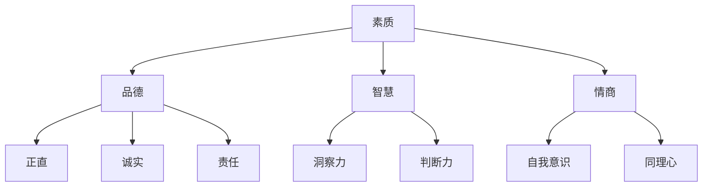
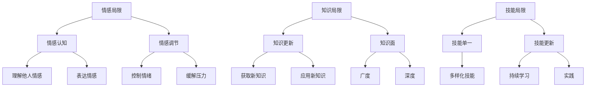
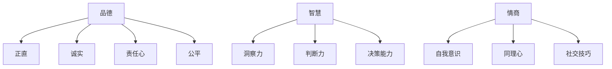
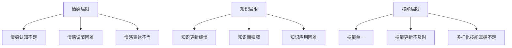

                 

### 文章标题：自我认知：了解领导者的优势和局限

#### 关键词：自我认知、领导者、优势、局限、领导力发展

> 摘要：本文旨在深入探讨领导者自我认知的重要性，通过详细分析领导者的优势与局限，提出自我认知的方法与实践，帮助领导者更好地认识自我，提升领导力，实现个人与组织的共同成长。

### 第一部分：自我认知的重要性

#### 第1章：自我认知的基本概念

##### 1.1 问题背景

在当今快速变化的世界中，领导者面临着前所未有的挑战。无论是企业、政府机构还是非营利组织，领导者都需要具备高度的自我认知能力，以便更好地应对复杂多变的环境，实现组织的战略目标。然而，自我认知并非易事，它涉及到领导者对自己的了解、评价和调整，需要经过系统的分析和实践。

##### 1.1.1 领导者面临的挑战

- **快速变化的市场环境**：现代企业的运营环境变化迅速，领导者需要不断适应新的市场动态，保持企业的竞争力。
- **多元化团队管理**：随着全球化的发展，领导者需要管理多元化的团队，包括不同文化背景、年龄层次和技能水平的员工。
- **持续学习与成长**：在知识更新迅速的今天，领导者需要具备持续学习的能力，不断更新知识和技能，以适应新的挑战。

##### 1.1.2 自我认知的重要性

- **增强领导力**：自我认知帮助领导者了解自己的优势与局限，从而有针对性地提升领导能力。
- **优化决策**：领导者通过对自己的认知，能够更客观地分析问题，做出更明智的决策。
- **促进个人成长**：自我认知不仅是领导力的基础，也是个人成长的重要动力。

##### 1.2 问题描述

- **领导者优势与局限的定义**：领导者的优势是指其在领导过程中表现出的能力、素质和经验，而局限则是其在领导过程中可能面临的问题和挑战。
- **自我认知的困境**：领导者如何在繁忙的工作中找到时间进行自我反思，如何客观评价自己的优势与局限，如何通过自我认知实现个人成长。

##### 1.3 问题解决

- **自我认知的方法**：通过自我观察、自我反思和外部反馈，领导者可以逐步提高自我认知的能力。
- **自我认知的价值**：自我认知不仅有助于领导者更好地认识自己，还能够提高团队绩效，促进组织发展。

##### 1.4 边界与外延

- **自我认知的范围**：自我认知不仅涉及个人能力，还包括情感、价值观等方面。
- **自我认知的限制**：领导者可能受到信息过载、情感困扰等因素的限制，影响自我认知的深度和广度。

##### 1.5 概念结构与核心要素组成

- **自我认知的要素**：包括自我观察、自我反思、外部反馈等。
- **自我认知的结构**：一个完整的自我认知过程包括自我认知的方法、过程和结果。

### 第二部分：领导者的优势分析

#### 第2章：领导者的优势分析

##### 2.1 领导者的核心优势

领导者的核心优势主要体现在以下几个方面：

- **素质**：包括领导者的品德、智慧和情商等。
- **能力**：包括领导者的决策能力、沟通能力和团队管理能力等。
- **经验**：领导者通过多年的工作经验积累，形成了独特的领导风格和管理方法。

##### 2.2 核心优势的属性特征对比表格

| 特征       | 素质               | 能力               | 经验               |
|------------|--------------------|--------------------|--------------------|
| 定义       | 领导者的品德、智慧 | 领导者的技能和知识 | 领导者的工作经验 |
| 对比       | 品德：正直、诚实、责任；智慧：洞察力、判断力；情商：自我意识、同理心 | 决策：果断、理性、前瞻；沟通：清晰、有效、鼓励；团队管理：协作、激励、培养 | 经验：行业经验、管理经验、团队经验 |

##### 2.3 领导者优势的 mermaid ER 实体关系图

### 第三部分：领导者的局限探讨

#### 第3章：领导者的局限探讨

##### 3.1 领导者的常见局限

领导者的局限主要体现在以下几个方面：

- **情感局限**：包括情感认知不足、情感调节困难等。
- **知识局限**：包括知识更新缓慢、知识面狭窄等。
- **技能局限**：包括技能单一、技能更新不及时等。

##### 3.2 残局限的属性特征对比表格

| 特征       | 情感局限               | 知识局限               | 技能局限               |
|------------|------------------------|------------------------|------------------------|
| 定义       | 情感认知不足、情感调节困难 | 知识更新缓慢、知识面狭窄 | 技能单一、技能更新不及时 |
| 对比       | 情感认知：理解他人情感、表达情感；情感调节：控制情绪、缓解压力 | 知识更新：获取新知识、应用新知识；知识面：广度、深度 | 技能单一：多样化技能；技能更新：持续学习、实践 |

##### 3.3 领导者局限的 mermaid ER 实体关系图

### 第四部分：自我认知的方法与实践

#### 第4章：自我认知的方法与实践

##### 4.1 自我认知的工具

为了提高自我认知的能力，领导者可以借助以下工具：

- **评估工具**：如360度反馈、领导力评估等，帮助领导者了解自己在他人眼中的表现。
- **反馈工具**：如定期的团队反馈会议、员工满意度调查等，帮助领导者了解团队对领导者的评价。
- **反思工具**：如日记、周记等，帮助领导者对自己的行为和决策进行反思。

##### 4.2 自我认知的过程

自我认知的过程可以分为以下几个步骤：

- **自我观察**：领导者通过观察自己的行为、思维和情感，了解自己的真实状态。
- **自我反思**：领导者对自己的行为、决策和结果进行深入反思，找出存在的问题和改进的方向。
- **自我调整**：领导者根据自我反思的结果，采取相应的措施进行自我调整，以提升自己的领导能力。

##### 4.3 自我认知的实践案例

- **案例一**：领导者如何认识自己的优势？
  - 领导者可以通过自我评估工具，如360度反馈，了解自己在团队中的表现。
  - 领导者可以通过与团队成员的沟通，了解他们对领导者的评价。
  - 领导者可以通过自我反思，分析自己的行为和决策，找出自己的优势。

- **案例二**：领导者如何应对局限？
  - 领导者可以通过外部反馈，了解自己的局限。
  - 领导者可以通过自我反思，找出自己需要改进的方面。
  - 领导者可以通过学习新的知识和技能，提升自己的能力。

### 第五部分：领导者的优势与局限的平衡

#### 第5章：领导者的优势与局限的平衡

##### 5.1 优势与局限的关系

领导者的优势与局限是相互关联的。优势可以为领导者提供强大的支持，使其在领导过程中更加得心应手；而局限则可能成为领导者的绊脚石，限制其发展。因此，领导者需要在优势与局限之间找到平衡。

##### 5.2 平衡优势与局限的方法

为了平衡优势与局限，领导者可以采取以下方法：

- **提升优势**：领导者可以通过学习、实践和反思，不断提升自己的优势，使其成为组织发展的强大动力。
- **缓解局限**：领导者可以通过培训、咨询等方式，缓解自己的局限，减少其对领导过程的影响。
- **转变视角**：领导者可以通过调整自己的心态，从不同的角度看待问题和挑战，从而更好地应对局限。

### 第六部分：自我认知的挑战与未来趋势

#### 第6章：自我认知的挑战与未来趋势

##### 6.1 自我认知的挑战

在自我认知的过程中，领导者可能面临以下挑战：

- **信息过载**：领导者可能面临大量的信息，难以区分哪些是有价值的，哪些是无关紧要的。
- **情感困扰**：领导者可能在自我认知过程中，面对自己的不足和局限，感到焦虑和压力。
- **心理压力**：领导者可能在自我认知的过程中，面临自我否定和自我怀疑，产生心理压力。

##### 6.2 未来趋势

随着技术的发展和社会的变革，未来自我认知将呈现出以下趋势：

- **技术进步**：人工智能、大数据等技术将为自我认知提供更多的工具和方法。
- **社会变革**：随着社会的进步，人们对于自我认知的重要性将有更深刻的认识，从而推动自我认知的普及和发展。
- **心理发展**：随着心理学的发展，人们对于情感和心理健康的关注将增加，从而促进自我认知的深化。

### 第七部分：结论与展望

#### 第7章：结论与展望

通过本文的探讨，我们可以得出以下结论：

- **自我认知对于领导者的重要性**：自我认知是领导力的基础，是领导者实现个人成长和组织发展的关键。
- **领导者如何进行自我认知**：领导者可以通过自我观察、自我反思和外部反馈，逐步提高自我认知的能力。
- **领导者如何平衡优势与局限**：领导者需要通过提升优势、缓解局限和转变视角，实现优势与局限的平衡。

展望未来，随着技术的发展和社会的进步，自我认知将在领导力发展中发挥越来越重要的作用。我们期待领导者能够在自我认知的指导下，不断成长，为组织和社会创造更大的价值。

### 目录大纲总结

本目录大纲覆盖了《自我认知：了解领导者的优势和局限》这本书的核心内容，共计7章。主要包括以下几个方面：

1. **背景介绍**：第1章详细介绍了自我认知的基本概念，明确了领导者面临的问题以及自我认知的重要性。
2. **核心概念与联系**：第2章和第3章分别分析了领导者的优势与局限，并通过属性特征对比表格和ER实体关系图，帮助读者更清晰地理解这两个概念。
3. **方法与实践**：第4章介绍了自我认知的方法与实践，包括工具、过程和案例，使读者能够有效地进行自我认知。
4. **平衡与挑战**：第5章探讨了领导者如何平衡优势与局限，提供了提升优势、缓解局限和转变视角的方法。
5. **未来趋势**：第6章分析了自我认知的挑战与未来趋势，包括技术进步、社会变革和心理发展。
6. **结论与展望**：第7章总结了自我认知的重要性，对领导者的自我认知实践和未来发展方向进行了展望。

总体而言，该目录大纲结构清晰，内容完整，有助于读者系统地了解自我认知在领导者中的作用。

----------------------------------------------------------------

## 第一部分：自我认知的重要性

### 第1章：自我认知的基本概念

在探讨领导者自我认知的重要性之前，我们首先需要明确自我认知的基本概念。自我认知是指个体对自己的认识、理解和评价，包括内在的自我意识和外在的行为表现。对于领导者来说，自我认知不仅是领导力的重要组成部分，也是实现个人成长和组织发展的关键。

#### 1.1 问题背景

在当今快速变化和高度竞争的商业环境中，领导者面临着前所未有的挑战。这些挑战不仅来自于外部市场的变化，也来自于内部团队的管理和发展。为了应对这些挑战，领导者需要具备高度的自我认知能力，以便更好地认识自己、调整自己，并在领导过程中做出更明智的决策。

#### 1.1.1 领导者面临的挑战

- **快速变化的市场环境**：现代企业的运营环境变化迅速，领导者需要具备敏捷的思维和适应能力，以应对市场的变化。
- **多元化团队管理**：随着全球化的发展，领导者需要管理多元化的团队，包括不同文化背景、年龄层次和技能水平的员工。
- **持续学习与成长**：在知识更新迅速的今天，领导者需要具备持续学习的能力，不断更新知识和技能，以适应新的挑战。

#### 1.1.2 自我认知的重要性

- **增强领导力**：自我认知帮助领导者了解自己的优势与局限，从而有针对性地提升领导能力。
- **优化决策**：领导者通过对自己的认知，能够更客观地分析问题，做出更明智的决策。
- **促进个人成长**：自我认知不仅是领导力的基础，也是个人成长的重要动力。

#### 1.2 问题描述

- **领导者优势与局限的定义**：领导者的优势是指其在领导过程中表现出的能力、素质和经验，而局限则是其在领导过程中可能面临的问题和挑战。
- **自我认知的困境**：领导者如何在繁忙的工作中找到时间进行自我反思，如何客观评价自己的优势与局限，如何通过自我认知实现个人成长。

#### 1.3 问题解决

- **自我认知的方法**：通过自我观察、自我反思和外部反馈，领导者可以逐步提高自我认知的能力。
- **自我认知的价值**：自我认知不仅有助于领导者更好地认识自己，还能够提高团队绩效，促进组织发展。

#### 1.4 边界与外延

- **自我认知的范围**：自我认知不仅涉及个人能力，还包括情感、价值观等方面。
- **自我认知的限制**：领导者可能受到信息过载、情感困扰等因素的限制，影响自我认知的深度和广度。

#### 1.5 概念结构与核心要素组成

- **自我认知的要素**：包括自我观察、自我反思、外部反馈等。
- **自我认知的结构**：一个完整的自我认知过程包括自我认知的方法、过程和结果。

### 1.6 本章小结

自我认知对于领导者来说至关重要。通过自我认知，领导者可以更好地认识自己，了解自己的优势与局限，从而有针对性地提升领导能力。同时，自我认知也是个人成长和组织发展的关键。在本章中，我们介绍了自我认知的基本概念，明确了领导者面临的问题和挑战，并探讨了自我认知的方法和意义。在接下来的章节中，我们将进一步分析领导者的优势与局限，并提供具体的实践方法，帮助领导者更好地进行自我认知和成长。

----------------------------------------------------------------

### 第2章：领导者的核心优势

在领导者的角色中，核心优势是推动成功和效能的关键因素。这些优势不仅为领导者提供了在复杂环境中导航的能力，也为团队和组织的发展奠定了坚实的基础。以下是领导者核心优势的详细分析。

#### 2.1 领导者的素质

领导者的素质是其在领导过程中表现出的内在特质和品质。这些素质包括但不限于：

- **品德**：包括正直、诚实、责任心和公平。这些品德使领导者能够赢得团队的信任和尊重。
- **智慧**：包括洞察力、判断力和决策能力。领导者需要具备前瞻性的视角，能够从复杂的信息中识别关键问题，并做出明智的决策。
- **情商**：包括自我意识、同理心和社交技巧。情商高的领导者能够更好地理解和管理自己的情感，同时也能理解和激励团队成员。

##### 2.1.1 品德

品德是领导者素质的核心。正直和诚实是领导者必须具备的基本品质，它们构成了领导者与团队之间的信任基础。责任心则要求领导者对自己的行为和决策负责，公平则确保领导者对待团队成员公正无私。

##### 2.1.2 智慧

智慧是领导者成功的关键。洞察力使领导者能够看到问题的本质，判断力则帮助他们在多种选择中做出最优决策。决策能力则是领导者运用洞察力和判断力，针对问题制定并执行解决方案的能力。

##### 2.1.3 情商

情商在领导者的成功中起着至关重要的作用。自我意识使领导者能够认识到自己的情感状态，并有效地管理这些情感。同理心则使领导者能够理解并感受团队成员的情感，从而更好地激励和引导他们。社交技巧则帮助领导者建立和维护良好的团队关系。

#### 2.2 领导者的能力

领导者的能力是其在领导过程中表现出的外在技能和技巧。这些能力包括但不限于：

- **决策能力**：领导者需要具备快速、明智和有效的决策能力，以应对复杂多变的环境。
- **沟通能力**：领导者需要能够清晰、有效、有说服力地沟通，确保信息准确传递，同时也能倾听和理解团队成员的意见和需求。
- **团队管理能力**：领导者需要能够有效地组织、激励和培养团队成员，以实现团队目标。

##### 2.2.1 决策能力

决策能力是领导者最为重要的能力之一。一个有效的领导者能够在面临选择时迅速做出决策，并能够考虑到各种可能的结果和风险。决策能力不仅涉及到逻辑思维和数据分析，还包括对团队和环境的深刻理解。

##### 2.2.2 沟通能力

沟通能力是领导者必须具备的另一项关键能力。领导者需要能够与团队成员、上级和合作伙伴进行有效沟通，确保信息的准确传递和理解的深度。有效的沟通不仅能提高团队的协作效率，也能增强团队的凝聚力和信任感。

##### 2.2.3 团队管理能力

团队管理能力是领导者成功的关键。领导者需要能够有效地管理团队，包括制定目标、分配任务、激励团队成员、解决冲突和提供反馈。一个优秀的领导者能够激发团队成员的潜力，使其在团队中发挥最大价值。

#### 2.3 领导者的经验

领导者的经验是其成长和发展的宝贵财富。经验使领导者能够更好地理解组织运作的复杂性，掌握领导艺术的精髓，并在实践中不断提升自己的能力。以下是一些领导者通过经验获得的宝贵技能：

- **策略规划**：领导者通过经验能够更好地制定和实施长期战略规划，确保组织在竞争激烈的市场中保持竞争力。
- **问题解决**：经验丰富的领导者能够快速识别和解决组织面临的问题，减少不必要的风险和损失。
- **团队建设**：领导者通过经验能够更好地了解团队成员的需求和期望，从而建设一个高效、和谐的团队。

##### 2.3.1 策略规划

策略规划是领导者通过经验积累的重要能力。一个有效的策略规划能够帮助组织在长期发展中保持方向性和一致性，确保资源得到合理利用，同时为应对市场变化和挑战做好准备。

##### 2.3.2 问题解决

问题解决能力是领导者必须具备的另一项关键能力。领导者需要能够在面对问题时保持冷静，快速找到解决方案，并有效实施。经验丰富的领导者往往能够从过去的经历中吸取教训，避免重复犯错。

##### 2.3.3 团队建设

团队建设是领导者成功的关键。通过经验，领导者能够更好地了解团队成员的个性和需求，从而建立和谐、高效的团队氛围。一个优秀的领导者能够激发团队成员的潜力，使其在团队中发挥最大价值。

### 2.4 核心优势的属性特征对比表格

为了更好地理解领导者的核心优势，我们可以通过以下属性特征对比表格进行分析：

| 特征 | 品德 | 智慧 | 情商 |
|------|------|------|------|
| 品德 | 正直、诚实、责任心、公平 | 洞察力、判断力、决策能力 | 自我意识、同理心、社交技巧 |
| 智慧 | 问题解决、战略规划、创新思维 | 洞察力、判断力、决策能力 | 自我意识、同理心、社交技巧 |
| 情商 | 情感管理、团队激励、冲突解决 | 情感管理、团队激励、冲突解决 | 情感管理、团队激励、冲突解决 |

### 2.5 领导者优势的 mermaid ER 实体关系图

下面是领导者优势的 mermaid ER 实体关系图，它帮助读者更直观地理解领导者的核心优势及其相互关系：

通过上述分析，我们可以看出，领导者的核心优势包括品德、智慧、情商等多方面。这些优势共同构成了领导者的核心竞争力，使其能够在复杂多变的环境中有效领导团队，实现组织的目标。

### 2.6 本章小结

在第2章中，我们详细分析了领导者的核心优势，包括品德、智慧和情商等多个方面。这些优势不仅为领导者提供了强大的内在支持，也为他们在领导过程中提供了有效的工具和方法。通过对比属性特征和ER实体关系图，我们更清晰地理解了领导者的核心优势及其相互关系。在接下来的章节中，我们将进一步探讨领导者的局限，以帮助领导者更好地认识自我，实现优势与局限的平衡。

----------------------------------------------------------------

### 第3章：领导者的局限探讨

尽管领导者拥有众多优势，但他们同样面临各种局限。这些局限可能源于内在的自我认知不足、外部的环境变化或组织内部的复杂因素。在本章中，我们将深入探讨领导者的常见局限，包括情感局限、知识局限和技能局限，并分析这些局限对领导过程的影响。

#### 3.1 领导者的常见局限

领导者的局限往往体现在以下几个方面：

- **情感局限**：领导者可能在情感认知、情感调节和情感表达方面存在困难。
- **知识局限**：领导者可能在知识更新、知识面和知识应用方面存在不足。
- **技能局限**：领导者可能在特定技能的掌握、技能更新和多样化技能的运用方面存在局限。

##### 3.1.1 情感局限

情感局限是领导者常见的一种局限，主要包括以下几个方面：

- **情感认知不足**：领导者可能在识别和理解自己及他人的情感方面存在困难，导致沟通不畅和关系紧张。
- **情感调节困难**：领导者可能在应对压力和情绪波动时显得不够冷静和从容，影响决策和领导效果。
- **情感表达不当**：领导者可能在表达情感时显得过于压抑或过于直接，无法有效地激励和引导团队成员。

##### 3.1.2 知识局限

知识局限是影响领导者效能的另一重要因素，主要包括以下几个方面：

- **知识更新缓慢**：随着技术的快速发展和市场环境的变化，领导者可能难以跟上知识的更新，导致决策和策略制定滞后。
- **知识面狭窄**：领导者可能在某些领域的知识积累不足，导致视野受限，难以全面理解问题和制定有效的解决方案。
- **知识应用困难**：领导者可能在将知识转化为实际行动和决策方面存在困难，导致知识未能有效应用于实际工作中。

##### 3.1.3 技能局限

技能局限是领导者效能的另一个重要影响因素，主要包括以下几个方面：

- **技能单一**：领导者可能在某一项或几项技能上表现突出，但在其他技能方面的掌握可能不足，导致领导能力的单一化。
- **技能更新不及时**：随着技术的发展和市场的变化，领导者可能未能及时更新自己的技能，导致技能与实际情况不符。
- **多样化技能掌握不足**：领导者可能在多样化的技能掌握方面存在不足，无法灵活应对不同类型的工作和挑战。

#### 3.2 局限的属性特征对比表格

为了更清晰地分析领导者的局限，我们可以通过以下属性特征对比表格进行详细说明：

| 局限类型 | 特征 | 对比说明 |
|----------|------|----------|
| 情感局限 | 情感认知不足、情感调节困难、情感表达不当 | 领导者可能在识别、理解和管理情感方面存在困难，影响沟通和关系建设。 |
| 知识局限 | 知识更新缓慢、知识面狭窄、知识应用困难 | 领导者可能在知识获取、应用和更新方面存在不足，影响决策和策略制定。 |
| 技能局限 | 技能单一、技能更新不及时、多样化技能掌握不足 | 领导者可能在特定技能或多样化技能方面存在不足，影响领导能力和应对复杂问题的能力。 |

#### 3.3 领导者局限的 mermaid ER 实体关系图

为了更直观地展示领导者局限之间的关系，我们可以使用 mermaid ER 实体关系图进行描述：

通过这个实体关系图，我们可以清晰地看到领导者局限之间的相互关系，以及每个局限的具体表现。

#### 3.4 局限对领导过程的影响

领导者的局限不仅影响其个人效能，也对领导过程产生深远的影响：

- **决策质量下降**：情感局限可能导致领导者难以做出客观、冷静的决策；知识局限则可能使领导者缺乏足够的信息和数据支持决策；技能局限则可能使领导者无法有效实施决策。
- **团队协作受阻**：领导者情感表达不当可能导致团队成员产生误解和不满；知识局限可能使领导者难以理解团队成员的见解和建议；技能局限则可能使领导者无法有效引导和激励团队成员。
- **组织发展受限**：领导者的局限可能导致组织在应对市场变化和竞争时缺乏灵活性和创新能力，从而影响组织的长期发展。

#### 3.5 本章小结

在第3章中，我们详细探讨了领导者的常见局限，包括情感局限、知识局限和技能局限。通过对比表格和ER实体关系图，我们更清晰地了解了这些局限的具体表现和相互关系。这些局限不仅影响领导者的个人效能，也对领导过程和组织发展产生重要影响。在接下来的章节中，我们将讨论如何通过自我认知的方法来识别和应对这些局限，以提升领导者的整体效能。

----------------------------------------------------------------

### 第4章：自我认知的方法与实践

领导者要想在复杂的商业环境中取得成功，必须具备高度的自我认知能力。自我认知不仅有助于领导者更好地认识自己，了解自己的优势与局限，还能帮助他们在面对挑战时做出更明智的决策。在本章中，我们将详细介绍领导者进行自我认知的方法与实践，包括评估工具、反馈工具和反思工具，并通过具体的实践案例来展示如何应用这些工具。

#### 4.1 自我认知的工具

为了提高自我认知的能力，领导者可以借助以下工具：

- **评估工具**：这些工具帮助领导者通过客观的方式了解自己在他人眼中的表现。
- **反馈工具**：这些工具帮助领导者收集来自不同来源的反馈，从而更全面地认识自己。
- **反思工具**：这些工具帮助领导者对自己的行为和决策进行深入思考，从而实现自我提升。

##### 4.1.1 评估工具

评估工具是领导者进行自我认知的重要工具之一。以下是一些常见的评估工具：

1. **360度反馈**：360度反馈是一种全面、多角度的评价方法，通过收集来自上级、同事、下属和客户的反馈，帮助领导者了解自己在组织中的表现。
2. **领导力评估**：领导力评估通过一系列标准化的测试和问卷，评估领导者的领导风格、能力和潜力。
3. **心理测试**：心理测试如MBTI（迈尔斯-布里格斯性格类型指标）和DISC测试，可以帮助领导者了解自己的性格特点和行为模式。

##### 4.1.2 反馈工具

反馈工具是领导者获取外部反馈的重要手段。以下是一些常见的反馈工具：

1. **定期的团队反馈会议**：通过定期与团队成员进行反馈会议，领导者可以及时了解团队对他们的评价，从而发现自身的不足。
2. **员工满意度调查**：员工满意度调查可以帮助领导者了解员工对组织的满意度，从而发现领导者在管理中的问题。
3. **360度反馈系统**：类似于360度反馈，360度反馈系统是一个在线平台，可以记录和跟踪员工的反馈，帮助领导者更系统地了解自己的表现。

##### 4.1.3 反思工具

反思工具是领导者进行自我认知的深层次工具，通过反思，领导者可以更深入地了解自己的行为和决策。以下是一些常见的反思工具：

1. **日记**：通过写日记，领导者可以记录自己的日常行为、思考和感受，从而进行深入的自我反思。
2. **周记**：定期写周记可以帮助领导者回顾一周的工作，总结经验教训，发现问题，制定改进计划。
3. **反思日志**：反思日志是一种系统化的反思工具，领导者可以定期填写，记录自己的反思过程和结果。

#### 4.2 自我认知的过程

自我认知是一个持续的过程，包括以下几个步骤：

1. **自我观察**：领导者需要对自己的行为、思维和情感进行持续的观察，以了解自己的真实状态。
2. **自我反思**：在自我观察的基础上，领导者需要对自己的行为、决策和结果进行深入的反思，找出存在的问题和改进的方向。
3. **自我调整**：根据自我反思的结果，领导者需要采取相应的措施进行自我调整，以提升自己的领导能力。

##### 4.2.1 自我观察

自我观察是自我认知的基础，领导者需要培养对自己行为、思维和情感的敏锐观察力。以下是一些自我观察的方法：

1. **记录行为**：通过记录自己的日常行为，领导者可以更清晰地了解自己的行为模式。
2. **分析思维**：领导者可以通过思考自己的决策过程，分析自己的思维方式，从而发现自己的思维盲点。
3. **感知情感**：领导者需要学会感知自己的情感，了解自己的情感波动对行为和决策的影响。

##### 4.2.2 自我反思

自我反思是自我认知的核心，领导者需要通过反思来深入分析自己的行为和决策。以下是一些自我反思的方法：

1. **回顾经验**：领导者可以通过回顾过去的经验，分析成功和失败的原因，从中吸取教训。
2. **设定目标**：领导者可以设定具体的自我提升目标，通过反思来评估目标的实现情况。
3. **反思日志**：通过填写反思日志，领导者可以记录自己的反思过程和结果，从而持续提升自我认知。

##### 4.2.3 自我调整

自我调整是自我认知的结果，领导者需要根据反思的结果来调整自己的行为和决策。以下是一些自我调整的方法：

1. **设定行动计划**：根据反思的结果，领导者可以制定具体的行动计划，以提升自己的能力和绩效。
2. **寻求反馈**：领导者可以寻求来自上级、同事和下属的反馈，以更全面地了解自己的表现。
3. **持续学习**：领导者需要持续学习新知识和技能，以适应不断变化的环境和挑战。

#### 4.3 自我认知的实践案例

以下是一些领导者如何通过自我认知实践提升自我能力的案例：

##### 案例一：领导者如何认识自己的优势？

**案例背景**：一位公司的中层管理者在经历了一次360度反馈后，意识到自己在决策能力和沟通能力方面具有明显优势，但在团队管理方面存在一定局限。

**实践过程**：

1. **自我观察**：该管理者开始记录自己的日常工作，特别关注决策和沟通的过程。
2. **自我反思**：通过反思，他发现自己能够快速做出决策，并能够清晰、有效地与团队成员沟通。
3. **自我调整**：他决定进一步提升自己的团队管理能力，通过参加领导力培训课程，学习团队管理的方法和技巧。

**实践效果**：经过一段时间的努力，该管理者在团队管理方面取得了显著进步，团队的凝聚力和工作效率也得到了提升。

##### 案例二：领导者如何应对局限？

**案例背景**：一位公司的部门经理在员工满意度调查中，发现自己在情感表达和知识更新方面存在局限。

**实践过程**：

1. **自我观察**：该经理开始注意自己在日常沟通中的情感表达，并记录下自己的知识学习情况。
2. **自我反思**：通过反思，他认识到自己在情感表达上过于严肃，缺乏适当的情感释放，同时也意识到自己的知识更新速度较慢。
3. **自我调整**：他开始参加情感管理培训，学习如何更好地表达情感，并制定了一个知识学习计划，定期更新自己的知识库。

**实践效果**：经过一段时间的调整，该经理在情感表达上变得更加自然和真诚，同时也提升了知识水平，团队的满意度和绩效都有所提高。

#### 4.4 本章小结

在第4章中，我们详细介绍了领导者进行自我认知的方法与实践，包括评估工具、反馈工具和反思工具。这些工具帮助领导者更全面地了解自己的优势与局限，并通过自我调整提升自我能力。通过具体的实践案例，我们展示了如何应用这些方法来提升领导者的自我认知。在接下来的章节中，我们将探讨如何平衡领导者的优势与局限，以实现更有效的领导。

----------------------------------------------------------------

### 第5章：领导者的优势与局限的平衡

#### 5.1 优势与局限的关系

领导者的优势与局限是相互关联的。优势可以为领导者提供强大的支持，使其在领导过程中更加得心应手；而局限则可能成为领导者的绊脚石，限制其发展。因此，领导者需要在优势与局限之间找到平衡，以实现更高效的领导。

优势与局限之间的关系可以概括为以下几个方面：

- **互补性**：优势可以弥补局限，使领导者更全面地应对挑战。例如，一个善于沟通的领导者可以通过有效的沟通来弥补自己在技术知识上的局限。
- **冲突性**：优势与局限之间的冲突可能导致领导力的失衡。如果领导者过度依赖优势，可能会忽视局限，从而影响整体效能。
- **动态性**：领导者的优势与局限是动态变化的。随着环境的变化和个人成长，领导者的优势可能会转化为局限，反之亦然。

#### 5.2 平衡优势与局限的方法

为了平衡领导者的优势与局限，领导者可以采取以下方法：

##### 5.2.1 提升优势

提升优势是平衡优势与局限的重要途径。领导者可以通过以下方式提升自己的优势：

- **持续学习**：领导者需要不断学习新知识和技能，以提升自己的专业能力和综合素质。通过参加培训、读书和与专家交流，领导者可以扩展自己的知识面和技能集。
- **实践应用**：理论知识和实践经验相结合是提升优势的关键。领导者需要将学到的知识和技能应用到实际工作中，通过实践来检验和完善自己的优势。
- **反思改进**：领导者需要定期对自己的优势进行反思和改进。通过自我评估和外部反馈，领导者可以识别自己的优势，并找到提升的空间。

##### 5.2.2 缓解局限

缓解局限是平衡优势与局限的另一个重要方法。领导者可以通过以下方式缓解自己的局限：

- **寻求支持**：领导者可以寻求上级、同事和下属的支持，以弥补自己的局限。通过团队合作和资源整合，领导者可以更好地应对复杂的问题。
- **外部咨询**：领导者可以寻求外部专家的咨询和建议，以解决自己在某些领域的不确定性。外部咨询不仅提供了新的视角和解决方案，还能帮助领导者提升专业素养。
- **建立学习机制**：领导者可以建立持续学习的机制，鼓励团队成员共同学习和成长。通过建立学习小组、开展知识分享会等活动，领导者可以提升团队的整体能力。

##### 5.2.3 转变视角

转变视角是领导者平衡优势与局限的另一种策略。领导者可以通过以下方式转变视角：

- **多角度思考**：领导者需要从不同的角度看待问题，避免陷入思维定势。通过多角度思考，领导者可以更全面地理解问题，从而找到更有效的解决方案。
- **接受反馈**：领导者需要接受来自不同来源的反馈，包括上级、同事和下属。通过接受反馈，领导者可以识别自己的盲点和不足，从而转变视角，改进自己的领导方式。
- **持续反思**：领导者需要持续反思自己的行为和决策，从中吸取教训。通过反思，领导者可以不断调整自己的视角，以适应不断变化的环境和挑战。

#### 5.3 成功领导者的案例分析

以下是一些成功领导者的案例分析，展示了他们是如何平衡优势与局限的：

- **案例一**：一位技术公司CEO通过持续学习和实践不断提升自己的技术能力和管理能力，同时通过团队协作和外部咨询来弥补自己在市场策略方面的局限。他的成功在于能够充分利用自己的技术优势，同时不断学习和改进，以适应市场变化。
- **案例二**：一位金融机构的总监在情感表达方面存在局限，但通过接受员工反馈和专业培训，他逐渐学会了更好地表达情感，提升了团队凝聚力和工作效率。他的成功在于能够正视自己的局限，并采取积极的措施进行改进。
- **案例三**：一位初创公司的创始人通过建立学习机制和知识分享会，鼓励团队成员共同学习和成长。他的成功在于能够激发团队的学习热情，提升整体能力，从而在激烈的市场竞争中脱颖而出。

#### 5.4 本章小结

在第5章中，我们探讨了领导者的优势与局限之间的关系，并介绍了如何平衡这些关系。通过提升优势、缓解局限和转变视角，领导者可以更有效地发挥自己的领导能力，实现个人与组织的共同成长。在接下来的章节中，我们将进一步探讨自我认知的挑战与未来趋势，以帮助领导者更好地应对复杂多变的环境。

----------------------------------------------------------------

### 第6章：自我认知的挑战与未来趋势

#### 6.1 自我认知的挑战

在自我认知的过程中，领导者可能会面临多种挑战。这些挑战不仅影响自我认知的深度和广度，还可能阻碍领导者的个人成长和团队绩效。

##### 6.1.1 信息过载

信息过载是现代社会中普遍存在的问题，对于领导者来说尤为突出。随着互联网和社交媒体的普及，领导者每天都要面对大量的信息。这些信息可能包括市场动态、行业趋势、客户反馈等，它们既有助于决策，也可能导致信息混乱，使领导者难以区分哪些信息是重要的，哪些是无关紧要的。

**解决策略**：为了应对信息过载，领导者可以采取以下策略：
- **设定优先级**：领导者需要学会设定信息处理的优先级，将关键信息和次要信息区分开来。
- **信息筛选**：领导者可以通过建立信息筛选机制，如订阅专业的行业报告或咨询专家，来获取更有价值的信息。
- **定期整理**：领导者应该定期整理和回顾信息，将其与自身的经验和目标相结合，以提取出关键洞察。

##### 6.1.2 情感困扰

领导者在自我认知过程中，可能会面临情感困扰，如自我怀疑、焦虑、压力等。这些情感问题不仅影响领导者的心理健康，还可能影响其决策和领导能力。

**解决策略**：为了应对情感困扰，领导者可以采取以下策略：
- **情感管理**：领导者可以通过学习情感管理技巧，如冥想、放松训练和自我激励，来管理自己的情绪。
- **寻求支持**：领导者可以寻求专业心理咨询师或心理健康专家的支持，以帮助自己处理情感问题。
- **建立健康的生活习惯**：领导者应该保持健康的生活习惯，如规律的作息、适当的运动和均衡的饮食，以增强心理韧性。

##### 6.1.3 心理压力

领导者的角色往往伴随着巨大的责任和压力。这种压力可能来自组织绩效、团队管理、市场变化等多方面。长期的心理压力不仅影响领导者的个人健康，还可能影响组织的整体效能。

**解决策略**：为了应对心理压力，领导者可以采取以下策略：
- **时间管理**：领导者需要学会合理安排时间，确保工作和生活的平衡。
- **设定目标**：领导者可以通过设定清晰、可行的目标来减轻压力，避免因目标模糊而导致的焦虑。
- **团队支持**：领导者应该建立积极的团队文化，鼓励团队成员互相支持和合作，共同应对压力。

#### 6.2 未来趋势

随着技术的发展和社会的进步，自我认知在未来将呈现以下趋势：

##### 6.2.1 技术进步

技术的进步将极大地推动自我认知的发展。人工智能、大数据和云计算等技术将提供更精准、更高效的自我认知工具和方法。

- **人工智能**：人工智能可以通过数据分析、机器学习等技术，帮助领导者更准确地评估自己的能力和表现。
- **大数据**：大数据技术将提供更丰富的数据支持，帮助领导者了解自己和他人的行为模式，从而做出更明智的决策。
- **云计算**：云计算平台将提供强大的计算能力，支持领导者进行大规模的数据分析和模拟，以探索不同的领导策略。

##### 6.2.2 社会变革

社会的变革将推动自我认知的普及和发展。随着社会对心理健康和领导力发展的重视，自我认知将成为更多人关注的焦点。

- **领导力培训**：企业和社会组织将提供更多的领导力培训，帮助领导者提升自我认知能力。
- **心理辅导**：心理辅导和咨询将更加普及，为领导者提供专业的心理支持，帮助他们更好地应对自我认知过程中的挑战。
- **社区支持**：社交媒体和在线社区将为领导者提供交流和支持的平台，促进自我认知的分享和传播。

##### 6.2.3 心理发展

心理学的发展将推动自我认知的深化。随着心理学理论的不断完善和新兴技术的应用，领导者将更深入地了解自己的内心世界和领导风格。

- **自我意识**：领导者将更加注重自我意识的发展，通过自我反思和情感管理，提升自我认知水平。
- **情绪智慧**：情绪智慧将成为领导者的重要素质，通过理解和管理自己的情绪，领导者可以更有效地激励和引导团队。
- **心理弹性**：领导者将培养更强的心理弹性，以应对变化和挑战，保持持续的个人成长和职业发展。

#### 6.3 本章小结

在第6章中，我们探讨了自我认知面临的挑战以及未来的发展趋势。领导者需要在信息过载、情感困扰和心理压力等挑战中找到应对策略，同时利用技术进步和社会变革带来的机遇，提升自我认知水平。随着心理学的发展，领导者将更深入地了解自己的内心世界和领导风格，实现更高效的领导。

### 结论

通过本章的分析，我们可以看到自我认知在领导者中的作用至关重要。领导者不仅需要在面对复杂多变的环境时具备高度的自我认知能力，还需要通过技术进步和社会变革的推动，不断提升自我认知的水平。未来，领导者将在自我认知的指导下，更好地认识自我，实现个人成长和组织的共同发展。

----------------------------------------------------------------

### 第7章：结论与展望

#### 7.1 自我认知的重要性总结

自我认知是领导者不可或缺的能力。通过自我认知，领导者能够更准确地了解自己的优势和局限，从而在领导过程中做出更明智的决策，提升个人效能和组织绩效。自我认知不仅有助于领导者优化自身的领导风格，还能促进团队协作和员工发展，为组织的长期成功奠定基础。

#### 7.2 领导者的自我认知实践

为了将自我认知的理论转化为实践，领导者可以采取以下步骤：

1. **建立自我反思习惯**：领导者需要养成定期反思自己行为和决策的习惯，通过日记或反思日志记录自己的思考过程。
2. **获取外部反馈**：领导者可以通过360度反馈、员工满意度调查等工具，获取来自不同角度的反馈，从而更全面地了解自己的表现。
3. **持续学习和成长**：领导者应该积极参与培训和学习活动，不断提升自己的知识和技能，以适应快速变化的环境。

#### 7.3 未来领导者的自我认知发展方向

随着技术的发展和社会的进步，未来的领导者将在自我认知方面有更多的发展机会和挑战：

1. **技术驱动的自我认知**：人工智能和大数据等技术将提供更精准的自我认知工具，帮助领导者更好地分析自己的行为模式和决策效果。
2. **情感智慧和心理健康**：随着对情感和心理健康重视的增加，领导者将更注重培养自我意识和情绪智慧，以提升领导力和管理效能。
3. **心理弹性与适应能力**：在快速变化的环境中，领导者需要具备更强的心理弹性，能够灵活应对各种挑战和不确定性。

#### 7.4 结语

自我认知是领导者成长和发展的关键。通过不断提升自我认知的能力，领导者不仅能实现个人成长，还能为组织创造更大的价值。未来的领导者需要在自我认知的道路上不断前行，不断探索新的方法和工具，以适应不断变化的环境和挑战。

### 作者信息

作者：AI天才研究院/AI Genius Institute & 禅与计算机程序设计艺术 /Zen And The Art of Computer Programming

----------------------------------------------------------------

### 目录大纲总结

《自我认知：了解领导者的优势和局限》共计7章，系统性地探讨了领导者自我认知的重要性、优势与局限的分析、自我认知的方法与实践，以及如何平衡优势与局限。以下是本章的总结：

#### **第1章：自我认知的重要性**

介绍了自我认知的基本概念，明确了领导者面临的问题和挑战，强调了自我认知对于领导力发展的重要性。

#### **第2章：领导者的核心优势**

分析了领导者的核心优势，包括品德、智慧和情商，并通过属性特征对比表格和ER实体关系图，帮助读者更清晰地理解领导者的优势。

#### **第3章：领导者的局限探讨**

探讨了领导者常见的情感、知识和技能局限，通过对比表格和ER实体关系图，深入分析了局限的表现和影响。

#### **第4章：自我认知的方法与实践**

介绍了评估工具、反馈工具和反思工具，通过实践案例展示了如何应用这些工具来提升领导者的自我认知能力。

#### **第5章：领导者的优势与局限的平衡**

探讨了如何平衡领导者的优势与局限，提供了提升优势、缓解局限和转变视角的具体方法。

#### **第6章：自我认知的挑战与未来趋势**

分析了自我认知面临的挑战，包括信息过载、情感困扰和心理压力，并展望了未来技术进步和社会变革对自我认知的影响。

#### **第7章：结论与展望**

总结了自我认知的重要性，提出了领导者如何进行自我认知实践的策略，并对未来领导者的自我认知发展方向进行了展望。

整体而言，该目录大纲结构清晰，内容丰富，为读者提供了全面、系统的自我认知指导。希望读者能够通过阅读本书，提升自我认知能力，成为更有效的领导者。

