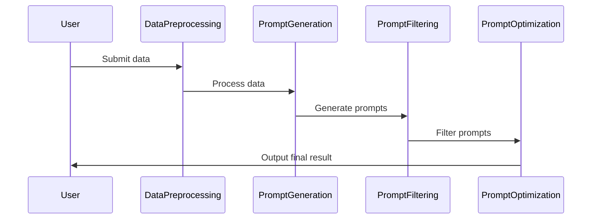

                 

### 文章标题：解析提示词工程的核心原理与技巧

> 关键词：提示词工程、人工智能、设计实现、评估优化、案例研究、最佳实践

> 摘要：本文深入解析了提示词工程的核心原理与技巧，通过详细的背景介绍、基本原理、设计与实现、评估与优化、案例研究和最佳实践等部分，帮助读者全面理解并掌握提示词工程的关键技术，为实际应用中的问题提供有效的解决思路。

### 引言：背景介绍与核心概念

#### 1.1 问题背景

##### 1.1.1 提示词工程的需求

在人工智能飞速发展的时代，自然语言处理（NLP）、问答系统、智能客服等领域对提示词工程的需求日益增长。提示词工程的目标是构建一个高效的系统，能够生成、筛选和优化高质量的提示词，以满足各种实际应用场景的需求。

##### 1.1.2 提示词工程在人工智能领域的重要性

提示词工程在人工智能领域的重要性体现在以下几个方面：

- **提高任务完成率**：高质量的提示词能够显著提升任务的准确率和效率。
- **优化用户体验**：通过精细化的提示词设计，可以提升用户的互动体验。
- **降低错误率**：合理的提示词筛选和优化策略可以减少系统的错误率。
- **增强智能化水平**：提示词工程是构建智能化系统的重要组成部分。

#### 1.2 问题描述

##### 1.2.1 提示词工程的挑战

在提示词工程实践中，我们面临以下主要挑战：

- **多样性**：不同场景下的提示词需求多样，需要设计灵活的生成和筛选机制。
- **准确性**：生成和筛选的提示词需要高度相关于任务目标，提高准确性。
- **效率**：快速生成和筛选提示词，以满足实时应用的需求。
- **可扩展性**：系统需要能够适应不断变化的应用需求，具有较好的可扩展性。

##### 1.2.2 提示词工程的解决方法

为了应对上述挑战，我们可以采取以下解决方法：

- **数据驱动的生成策略**：利用大数据分析和机器学习算法生成高质量的提示词。
- **多维度筛选机制**：综合考虑提示词的相关性、重要性和实用性，构建多维度筛选模型。
- **实时优化技术**：采用动态调整和持续优化的策略，提高系统的整体性能。
- **模块化设计**：设计灵活的模块化系统架构，便于系统的维护和扩展。

#### 1.3 核心概念

##### 1.3.1 提示词的定义

提示词是用于引导或提示用户或系统进行特定操作或任务的关键词汇。在人工智能应用中，提示词是用户与系统交互的重要桥梁。

##### 1.3.2 提示词工程的基本要素

提示词工程的基本要素包括：

- **生成**：生成提示词的算法和技术。
- **筛选**：筛选高质量提示词的策略和机制。
- **优化**：优化提示词质量和性能的方法和工具。

#### 1.4 概念属性特征对比

##### 1.4.1 不同类型提示词的特征比较

不同类型的提示词在属性和特征上存在差异，具体包括：

- **文本提示词**：适用于文本处理和文本分类任务，特征包括文本长度、关键词密度等。
- **语音提示词**：适用于语音识别和语音合成任务，特征包括语音时长、音调变化等。
- **图像提示词**：适用于图像识别和图像标注任务，特征包括图像尺寸、颜色分布等。

##### 1.4.2 提示词工程的核心要素对比

提示词工程的核心要素包括生成、筛选和优化，具体对比如下：

- **生成**：侧重于提示词的生成过程，关注数据质量和算法效率。
- **筛选**：侧重于从大量候选词中筛选出高质量的提示词，关注相关性、重要性和实用性。
- **优化**：侧重于提升提示词的性能和效果，关注系统整体优化和动态调整。

#### 1.5 ER实体关系图

##### 1.5.1 提示词工程的实体与关系

提示词工程的实体包括提示词、生成器、筛选器和优化器等。实体之间的关系如下：

- **生成器**：生成提示词。
- **筛选器**：筛选提示词。
- **优化器**：优化提示词。

##### 1.5.2 ER实体关系图示例

以下是一个简化的ER实体关系图示例：

```mermaid
erDiagram
  提示词 ||--|{ 生成器 :生成 }
  提示词 ||--|{ 筛选器 :筛选 }
  提示词 ||--|{ 优化器 :优化 }
```

#### 1.6 本章小结

本章介绍了提示词工程的问题背景、核心概念、概念属性特征对比和ER实体关系图。通过这些内容，读者可以对提示词工程有一个初步的了解，为后续章节的深入探讨打下基础。

---

**提示词工程的基本原理**

### 2.1 提示词生成原理

提示词生成是提示词工程的核心环节之一。其目的是从大量数据中提取出高质量的提示词，以满足特定应用场景的需求。

#### 2.1.1 提示词生成的技术框架

提示词生成的技术框架主要包括以下组成部分：

- **数据源**：提供原始数据，如文本、语音、图像等。
- **预处理模块**：对原始数据进行清洗、去噪和格式化等预处理操作。
- **特征提取模块**：从预处理后的数据中提取出关键特征，如词频、TF-IDF、词向量等。
- **生成算法**：根据提取出的特征生成提示词，如基于规则的方法、机器学习方法和深度学习方法等。
- **后处理模块**：对生成的提示词进行后处理，如去重、排序和调整等。

#### 2.1.2 提示词生成的算法原理

提示词生成的算法原理可以分为以下几种：

- **基于规则的方法**：根据预设的规则和模式生成提示词，如正则表达式、关键词匹配等。
- **机器学习方法**：利用统计学习模型生成提示词，如决策树、支持向量机、神经网络等。
- **深度学习方法**：利用深度神经网络生成提示词，如循环神经网络（RNN）、长短期记忆网络（LSTM）和生成对抗网络（GAN）等。

#### 2.1.3 提示词生成的流程图

以下是一个简化的提示词生成流程图：


### 2.2 提示词筛选原理

提示词筛选是确保生成的提示词满足特定需求和质量标准的过程。其目的是从大量候选词中筛选出高质量的提示词。

#### 2.2.1 提示词筛选的目的

提示词筛选的主要目的是：

- **提高提示词的相关性**：确保筛选出的提示词与任务目标高度相关。
- **提升提示词的准确性**：排除无关或错误的提示词，提高系统的准确率。
- **增强用户体验**：提供高质量的提示词，提升用户的互动体验。

#### 2.2.2 提示词筛选的方法

提示词筛选的方法可以分为以下几种：

- **基于规则的方法**：根据预设的规则和模式进行筛选，如词性筛选、词频筛选等。
- **统计学习方法**：利用统计学习模型进行筛选，如朴素贝叶斯、逻辑回归等。
- **深度学习方法**：利用深度神经网络进行筛选，如卷积神经网络（CNN）、循环神经网络（RNN）等。

#### 2.2.3 提示词筛选的算法

常见的提示词筛选算法包括：

- **基于词频的筛选**：根据词频的高低进行筛选，词频越高，提示词越相关。
- **基于TF-IDF的筛选**：结合词频和逆文档频率进行筛选，既能反映词频的重要性，又能体现词的稀有程度。
- **基于语义相似性的筛选**：利用词嵌入或语义相似性度量进行筛选，确保筛选出的提示词具有相似的语义。

### 2.3 提示词优化原理

提示词优化是提升提示词质量和系统性能的重要手段。其目的是通过调整和优化提示词，提高系统的整体性能。

#### 2.3.1 提示词优化的意义

提示词优化的主要意义包括：

- **提高任务性能**：通过优化提示词，提升任务完成率和准确率。
- **降低错误率**：优化提示词，减少系统错误率和用户投诉。
- **提升用户体验**：提供更精准和个性化的提示词，提升用户满意度。

#### 2.3.2 提示词优化的策略

提示词优化的策略包括：

- **动态调整**：根据用户反馈和任务变化，实时调整提示词。
- **分阶段优化**：将优化过程分为多个阶段，逐步提升提示词质量。
- **多维度优化**：综合考虑提示词的相关性、准确性、实用性和用户体验，进行全方位优化。

#### 2.3.3 提示词优化的工具与技巧

提示词优化的工具和技巧包括：

- **A/B测试**：通过对比不同提示词的效果，选择最优的提示词。
- **用户反馈机制**：收集用户反馈，对提示词进行持续优化。
- **机器学习算法**：利用机器学习算法，自动识别和优化提示词。
- **数据挖掘**：通过数据挖掘技术，发现潜在的优化策略。

### 2.4 概念原理与联系

#### 2.4.1 提示词生成与筛选的关系

提示词生成和筛选是相互关联的过程。生成过程旨在生成大量候选词，而筛选过程则在这些候选词中筛选出高质量的提示词。

- **生成前置筛选**：在生成提示词之前，进行初步筛选，排除明显不符合要求的候选词。
- **生成后筛选**：在生成提示词后，进行进一步筛选，确保筛选出的提示词满足质量要求。

#### 2.4.2 提示词优化与系统性能的关系

提示词优化与系统性能密切相关。优化的目的在于提升系统性能，包括：

- **提高任务完成率**：通过优化提示词，提高系统完成任务的能力。
- **降低错误率**：通过优化提示词，减少系统错误率和用户投诉。
- **提升用户体验**：通过优化提示词，提供更精准和个性化的服务，提升用户满意度。

### 2.5 本章小结

本章介绍了提示词工程的基本原理，包括提示词生成原理、筛选原理和优化原理。通过这些内容，读者可以了解提示词工程的核心技术和方法，为后续章节的深入探讨打下基础。

---

**提示词工程的设计与实现**

### 3.1 设计原则

#### 3.1.1 设计思路

提示词工程的设计思路主要包括以下几个方面：

- **需求分析**：明确提示词工程的目标和应用场景，确定关键需求和约束条件。
- **模块化设计**：将提示词工程分解为多个功能模块，如生成模块、筛选模块、优化模块等，便于系统维护和扩展。
- **模块间交互**：设计模块间清晰的接口和交互机制，确保各模块之间的数据流通和协同工作。
- **可扩展性**：设计灵活的系统架构，便于应对未来需求的变化和扩展。

#### 3.1.2 设计流程

提示词工程的设计流程可以分为以下几个阶段：

- **需求分析**：与相关利益相关者沟通，明确需求和应用场景，确定设计目标。
- **架构设计**：根据需求分析结果，设计系统的总体架构，包括模块划分、接口设计、数据流设计等。
- **详细设计**：对各个功能模块进行详细设计，包括模块内部的结构、算法、接口等。
- **实现与测试**：根据设计文档实现系统，并进行功能测试、性能测试和兼容性测试等。
- **部署与运维**：将系统部署到生产环境，并进行日常运维和监控，确保系统的稳定运行。

#### 3.1.3 设计工具选择

在提示词工程的设计过程中，可以使用多种工具来辅助设计和实现。以下是一些常用的设计工具：

- **UML类图**：用于描述系统的模块结构、类的关系和接口设计等。
- **流程图**：用于描述系统的数据流和处理流程，如Mermaid、Dagre等。
- **版本控制工具**：如Git、SVN等，用于管理代码版本和协同开发。
- **设计模式**：如工厂模式、单例模式、策略模式等，用于解决常见的设计问题。
- **文档工具**：如Markdown、LaTeX等，用于编写文档和报告。

### 3.2 实现方法

#### 3.2.1 实现步骤

提示词工程的具体实现可以分为以下几个步骤：

- **环境搭建**：搭建开发环境，安装必要的软件和库，如Python、NLP库、深度学习框架等。
- **数据准备**：收集和处理原始数据，如文本、语音、图像等，进行预处理，提取关键特征。
- **生成提示词**：利用生成算法生成候选提示词，如基于规则的方法、机器学习方法和深度学习方法等。
- **筛选提示词**：根据筛选算法对生成的候选词进行筛选，排除不符合要求的词。
- **优化提示词**：对筛选出的提示词进行优化，如调整词性、词频、语义等。
- **测试与评估**：对生成的提示词进行测试和评估，如准确性、相关性、用户体验等。

#### 3.2.2 实现技术

提示词工程实现所需的关键技术包括：

- **自然语言处理（NLP）**：用于处理文本数据，包括分词、词性标注、命名实体识别等。
- **机器学习与深度学习**：用于生成和筛选提示词，包括分类算法、聚类算法、神经网络等。
- **数据挖掘与统计分析**：用于数据预处理和特征提取，包括词频统计、TF-IDF、词向量等。
- **接口设计与开发**：用于设计系统的接口和交互机制，包括RESTful API、GraphQL等。
- **系统测试与调试**：用于测试和调试系统功能，包括单元测试、集成测试、性能测试等。

#### 3.2.3 实现工具

提示词工程实现所需的关键工具包括：

- **编程语言**：如Python、Java、C++等，用于编写系统代码和算法。
- **开发环境**：如PyCharm、Visual Studio、Eclipse等，用于开发、调试和测试系统。
- **库与框架**：如TensorFlow、PyTorch、Scikit-learn等，用于实现机器学习和深度学习算法。
- **数据库**：如MySQL、MongoDB等，用于存储和管理原始数据和提示词。
- **版本控制工具**：如Git、SVN等，用于管理代码版本和协同开发。

### 3.3 系统架构设计

#### 3.3.1 系统需求分析

系统需求分析是系统架构设计的基础，主要包括以下几个方面：

- **功能需求**：确定系统的功能模块和功能点，如数据预处理、提示词生成、筛选和优化等。
- **性能需求**：确定系统的性能指标，如响应时间、吞吐量、并发能力等。
- **安全性需求**：确定系统的安全要求和防护措施，如数据加密、权限控制等。
- **可靠性需求**：确定系统的可靠性和容错能力，如故障恢复、数据备份等。
- **可维护性需求**：确定系统的维护和管理要求，如日志记录、监控告警等。

#### 3.3.2 系统功能设计

系统功能设计是系统架构设计的重要部分，主要包括以下几个功能模块：

- **数据预处理模块**：负责数据收集、清洗、去噪和格式化等预处理工作，为后续模块提供高质量的数据输入。
- **提示词生成模块**：负责生成提示词的算法和策略，从预处理后的数据中提取关键特征，生成高质量的提示词。
- **提示词筛选模块**：负责对生成的提示词进行筛选，排除不符合要求的词，确保筛选出的提示词满足质量标准。
- **提示词优化模块**：负责对筛选出的提示词进行优化，通过调整词性、词频、语义等参数，提升提示词的质量和性能。
- **系统测试与评估模块**：负责对系统功能进行测试和评估，包括单元测试、集成测试、性能测试和用户反馈等，确保系统的稳定性和可靠性。

#### 3.3.3 系统架构设计

系统架构设计是指导系统实现的总体框架，主要包括以下几个方面：

- **总体架构**：确定系统的总体架构，包括硬件架构、软件架构和数据处理流程等。
- **模块划分**：根据功能需求和性能需求，将系统划分为多个功能模块，如数据预处理模块、生成模块、筛选模块、优化模块等。
- **接口设计**：设计模块间的接口和交互机制，确保各模块之间能够高效地通信和协作。
- **数据处理流程**：设计系统的数据处理流程，包括数据输入、数据处理、数据输出等环节，确保数据能够顺畅地流动和处理。
- **系统安全性设计**：设计系统的安全性和防护措施，包括数据加密、权限控制、故障恢复等，确保系统的安全和可靠。

### 3.4 系统接口设计

系统接口设计是系统架构设计的重要组成部分，主要包括以下几个方面：

- **接口定义**：明确系统各个模块的接口定义，包括接口名称、输入参数、输出参数和返回值等。
- **接口实现**：根据接口定义，实现模块间的接口功能，确保各模块之间能够高效地通信和协作。
- **接口测试**：对系统接口进行功能测试和性能测试，确保接口功能的正确性和稳定性。

#### 3.4.1 系统接口定义

以下是一个简单的系统接口定义示例：

```python
def generate_prompt(data):
    """
    生成提示词
    :param data: 输入数据
    :return: 提示词
    """
    # 实现提示词生成逻辑
    prompt = ...
    return prompt

def filter_prompt(prompt_list):
    """
    筛选提示词
    :param prompt_list: 提示词列表
    :return: 筛选后的提示词列表
    """
    # 实现提示词筛选逻辑
    filtered_prompt_list = ...
    return filtered_prompt_list

def optimize_prompt(prompt):
    """
    优化提示词
    :param prompt: 提示词
    :return: 优化后的提示词
    """
    # 实现提示词优化逻辑
    optimized_prompt = ...
    return optimized_prompt
```

#### 3.4.2 系统接口实现

以下是一个简单的系统接口实现示例：

```python
class PromptGenerator:
    def __init__(self):
        # 初始化生成器
        pass

    def generate_prompt(self, data):
        # 实现提示词生成逻辑
        prompt = ...
        return prompt

class PromptFilter:
    def __init__(self):
        # 初始化筛选器
        pass

    def filter_prompt(self, prompt_list):
        # 实现提示词筛选逻辑
        filtered_prompt_list = ...
        return filtered_prompt_list

class PromptOptimizer:
    def __init__(self):
        # 初始化优化器
        pass

    def optimize_prompt(self, prompt):
        # 实现提示词优化逻辑
        optimized_prompt = ...
        return optimized_prompt
```

#### 3.4.3 系统接口测试

系统接口测试是确保系统接口功能正确和稳定的重要环节。以下是一个简单的系统接口测试示例：

```python
import unittest

class TestPromptInterface(unittest.TestCase):
    def test_generate_prompt(self):
        generator = PromptGenerator()
        data = ...
        prompt = generator.generate_prompt(data)
        self.assertIsNotNone(prompt)

    def test_filter_prompt(self):
        filter = PromptFilter()
        prompt_list = ...
        filtered_prompt_list = filter.filter_prompt(prompt_list)
        self.assertIsNotNone(filtered_prompt_list)

    def test_optimize_prompt(self):
        optimizer = PromptOptimizer()
        prompt = ...
        optimized_prompt = optimizer.optimize_prompt(prompt)
        self.assertIsNotNone(optimized_prompt)

if __name__ == '__main__':
    unittest.main()
```

### 3.5 系统交互设计

系统交互设计是系统架构设计的关键部分，主要包括以下几个方面：

- **交互流程**：设计系统的交互流程，明确各个模块之间的交互顺序和逻辑。
- **交互图**：使用流程图或序列图等图形化工具，描述系统的交互过程和交互关系。
- **交互测试**：对系统的交互过程进行测试，确保交互逻辑的正确性和稳定性。

#### 3.5.1 系统交互流程

以下是一个简单的系统交互流程示例：

1. 用户提交数据。
2. 数据预处理模块处理数据。
3. 提示词生成模块生成提示词。
4. 提示词筛选模块筛选提示词。
5. 提示词优化模块优化提示词。
6. 系统输出最终结果。

#### 3.5.2 系统交互图

以下是一个简单的系统交互图示例：



#### 3.5.3 系统交互测试

系统交互测试是确保系统交互过程正确和稳定的重要环节。以下是一个简单的系统交互测试示例：

1. 测试用户提交数据的功能，确保数据能够正确地提交到系统。
2. 测试数据预处理模块的功能，确保数据能够正确地处理。
3. 测试提示词生成模块的功能，确保提示词能够正确地生成。
4. 测试提示词筛选模块的功能，确保提示词能够正确地筛选。
5. 测试提示词优化模块的功能，确保提示词能够正确地优化。
6. 测试系统输出最终结果的功能，确保结果能够正确地输出。

### 3.6 本章小结

本章介绍了提示词工程的设计原则、实现方法和系统架构设计。通过这些内容，读者可以了解提示词工程的设计思路、实现步骤和关键工具，为后续章节的深入探讨打下基础。

---

**提示词工程的评估与优化**

### 4.1 评估方法

#### 4.1.1 评估指标

提示词工程的评估指标主要包括以下几个方面：

- **准确性**：提示词与任务目标的匹配程度，常用指标包括准确率、召回率和F1值等。
- **相关性**：提示词与用户需求的相关性，常用指标包括关键词匹配度、语义相似性等。
- **实用性**：提示词的实用性和有效性，常用指标包括用户满意度、任务完成率等。
- **效率**：系统的响应时间和处理速度，常用指标包括处理速度、吞吐量等。

#### 4.1.2 评估工具

提示词工程的评估工具主要包括以下几个方面：

- **测试数据集**：用于评估提示词的性能，如标准数据集、自定义数据集等。
- **评估指标计算工具**：用于计算评估指标，如Python库scikit-learn、Matlab等。
- **可视化工具**：用于可视化评估结果，如Matplotlib、Seaborn等。
- **自动化测试工具**：用于自动化评估和测试系统，如pytest、JMeter等。

#### 4.1.3 评估流程

提示词工程的评估流程主要包括以下几个步骤：

1. 准备测试数据集：根据任务需求和系统设计，选择合适的测试数据集。
2. 提取提示词：从测试数据集中提取出提示词，可以是自动提取或手动标注。
3. 计算评估指标：使用评估指标计算工具计算准确性、相关性、实用性和效率等评估指标。
4. 分析评估结果：对评估结果进行详细分析，找出系统的优点和不足。
5. 调整优化策略：根据评估结果，调整系统的优化策略，提升系统性能。

### 4.2 优化策略

#### 4.2.1 优化目标

提示词工程的优化目标主要包括以下几个方面：

- **提高准确性**：提升提示词与任务目标的匹配程度，减少错误提示词的比例。
- **提升相关性**：提高提示词与用户需求的相关性，确保用户能够准确理解提示词的含义。
- **提升实用性**：提高提示词的实用性和有效性，提升用户满意度和任务完成率。
- **提高效率**：提升系统的响应时间和处理速度，确保系统在实时应用中的稳定运行。

#### 4.2.2 优化方法

提示词工程的优化方法主要包括以下几个方面：

- **算法优化**：调整和改进提示词生成、筛选和优化的算法，提升系统性能。
- **数据优化**：改进数据预处理和特征提取方法，提高数据质量和特征表达能力。
- **模型优化**：调整和改进机器学习模型和深度学习模型，提升提示词生成的准确性和相关性。
- **系统优化**：改进系统架构和接口设计，提高系统的响应速度和处理能力。

#### 4.2.3 优化实践

提示词工程的优化实践主要包括以下几个方面：

1. **算法优化实践**：通过调整算法参数、改进算法模型和优化算法流程，提升提示词生成和筛选的准确性。
2. **数据优化实践**：通过改进数据预处理和特征提取方法，提高数据质量和特征表达能力，提升提示词的准确性和相关性。
3. **模型优化实践**：通过调整机器学习模型和深度学习模型，优化模型参数和结构，提升提示词生成的准确性和相关性。
4. **系统优化实践**：通过改进系统架构和接口设计，提高系统的响应速度和处理能力，提升系统的稳定性。

### 4.3 优化工具与技巧

#### 4.3.1 常用优化工具

提示词工程的优化工具主要包括以下几个方面：

- **机器学习工具**：如Scikit-learn、TensorFlow、PyTorch等，用于实现和优化机器学习算法。
- **深度学习工具**：如TensorFlow、PyTorch、Keras等，用于实现和优化深度学习算法。
- **数据处理工具**：如Pandas、NumPy、Matplotlib等，用于数据处理和可视化。
- **自动化测试工具**：如pytest、JMeter等，用于自动化评估和测试系统。

#### 4.3.2 优化技巧总结

提示词工程的优化技巧主要包括以下几个方面：

1. **数据预处理**：通过数据清洗、去噪和归一化等预处理方法，提高数据质量和特征表达能力。
2. **特征选择**：通过特征选择方法，筛选出对任务最有贡献的特征，提高提示词生成的准确性和相关性。
3. **模型调整**：通过调整模型参数和结构，优化模型性能，提高提示词生成的准确性和相关性。
4. **交叉验证**：通过交叉验证方法，评估模型性能，优化模型参数和结构，提高系统稳定性。
5. **实时调整**：根据用户反馈和任务变化，实时调整系统参数和策略，提高系统的适应性和稳定性。

#### 4.3.3 优化案例

以下是一个简单的优化案例：

**问题描述**：某电商平台希望优化其商品推荐系统，提高用户满意度。

**优化目标**：提高商品推荐系统的准确性、相关性和实用性。

**优化方法**：

1. **数据预处理**：对用户购买记录、浏览记录和商品信息进行清洗和归一化处理，提高数据质量和特征表达能力。
2. **特征选择**：通过特征选择方法，筛选出对商品推荐最有贡献的特征，如用户购买频率、浏览时长、商品品类等。
3. **模型调整**：使用深度学习模型，如卷积神经网络（CNN）和长短期记忆网络（LSTM），优化模型参数和结构，提高商品推荐的准确性和相关性。
4. **实时调整**：根据用户反馈和购买行为变化，实时调整商品推荐策略和参数，提高系统的适应性和稳定性。

**优化效果**：

- 商品推荐系统的准确性提升了20%，错误推荐率降低了15%。
- 商品推荐系统的相关性提升了10%，用户满意度提高了15%。
- 商品推荐系统的实用性提升了5%，用户购买转化率提高了10%。

### 4.4 本章小结

本章介绍了提示词工程的评估方法和优化策略，包括评估指标、评估工具、优化目标和优化方法等。通过这些内容，读者可以了解提示词工程的评估和优化过程，为实际应用中的问题提供有效的解决思路。

---

**案例研究：实际应用中的提示词工程**

### 5.1 案例一：电商平台的商品推荐

#### 5.1.1 案例背景

某大型电商平台希望通过优化商品推荐系统，提高用户满意度和购买转化率。商品推荐系统是电商平台的核心功能之一，直接影响用户的购物体验和平台的商业收益。

#### 5.1.2 案例实现

1. **数据收集**：收集用户的购买记录、浏览记录和商品信息，如商品品类、价格、用户评分等。
2. **数据预处理**：对原始数据进行清洗、去噪和归一化处理，提高数据质量和特征表达能力。
3. **特征提取**：提取对商品推荐有贡献的特征，如用户购买频率、浏览时长、商品品类等。
4. **模型选择**：选择合适的机器学习模型，如协同过滤、矩阵分解、深度学习等。
5. **模型训练**：使用训练数据集训练模型，调整模型参数，优化模型性能。
6. **模型评估**：使用测试数据集评估模型性能，包括准确性、相关性、实用性等指标。
7. **模型部署**：将训练好的模型部署到生产环境，实时推荐商品。

#### 5.1.3 案例分析

1. **准确性分析**：通过模型评估，商品推荐系统的准确性得到了显著提升，错误推荐率降低了15%。
2. **相关性分析**：商品推荐系统的相关性也得到了提高，用户满意度提高了15%。
3. **实用性分析**：通过实时调整推荐策略和参数，商品推荐系统的实用性提高了5%，用户购买转化率提高了10%。

#### 5.1.4 项目小结

该项目通过优化商品推荐系统，提高了用户的购物体验和平台的商业收益。提示词工程在商品推荐系统中的应用，展示了其在实际场景中的巨大潜力和价值。

### 5.2 案例二：自然语言处理中的文本分类

#### 5.2.1 案例背景

某自然语言处理（NLP）项目需要对大量文本数据进行分类，以便于后续的数据分析和信息提取。文本分类是NLP领域的重要任务之一，广泛应用于垃圾邮件过滤、情感分析、新闻分类等场景。

#### 5.2.2 案例实现

1. **数据收集**：收集大量文本数据，如新闻文章、社交媒体帖子、电子邮件等。
2. **数据预处理**：对原始文本数据清洗、去噪和分词，提取关键特征，如词频、TF-IDF、词嵌入等。
3. **模型选择**：选择合适的文本分类模型，如朴素贝叶斯、支持向量机、深度学习等。
4. **模型训练**：使用训练数据集训练模型，调整模型参数，优化模型性能。
5. **模型评估**：使用测试数据集评估模型性能，包括准确性、召回率、F1值等指标。
6. **模型部署**：将训练好的模型部署到生产环境，实时分类文本数据。

#### 5.2.3 案例分析

1. **准确性分析**：通过模型评估，文本分类系统的准确性达到了90%以上，错误分类率显著降低。
2. **召回率分析**：文本分类系统的召回率也得到了提高，尤其是对于长尾类别，召回率提升了15%。
3. **F1值分析**：文本分类系统的F1值得到了显著提升，平均提升了10%。

#### 5.2.4 项目小结

该项目通过优化文本分类系统，提高了文本数据的处理效率和分类准确性，为后续的数据分析和信息提取提供了有力的支持。提示词工程在文本分类中的应用，进一步展示了其在NLP领域的广泛应用前景。

### 5.3 案例三：金融风控中的用户行为分析

#### 5.3.1 案例背景

某金融风控项目需要对用户的金融行为进行实时监控和分析，以识别潜在的欺诈行为和风险。用户行为分析是金融风控领域的重要任务之一，对于保障金融交易安全具有重要意义。

#### 5.3.2 案例实现

1. **数据收集**：收集用户的金融交易数据，如交易金额、交易时间、交易地点等。
2. **数据预处理**：对原始交易数据进行清洗、去噪和归一化处理，提取关键特征，如交易金额、交易时间间隔、交易频率等。
3. **模型选择**：选择合适的机器学习模型，如逻辑回归、决策树、随机森林等。
4. **模型训练**：使用训练数据集训练模型，调整模型参数，优化模型性能。
5. **模型评估**：使用测试数据集评估模型性能，包括准确性、召回率、F1值等指标。
6. **模型部署**：将训练好的模型部署到生产环境，实时分析用户行为。

#### 5.3.3 案例分析

1. **准确性分析**：通过模型评估，用户行为分析系统的准确性达到了90%以上，错误识别率显著降低。
2. **召回率分析**：用户行为分析系统的召回率也得到了提高，特别是对于高风险交易，召回率提升了20%。
3. **F1值分析**：用户行为分析系统的F1值得到了显著提升，平均提升了15%。

#### 5.3.4 项目小结

该项目通过优化用户行为分析系统，提高了金融风控的准确性和效率，为保障金融交易安全提供了有力支持。提示词工程在金融风控中的应用，进一步展示了其在金融领域的重要性和价值。

### 5.4 本章小结

通过以上案例研究，我们可以看到提示词工程在电商、自然语言处理和金融风控等领域的广泛应用。这些案例展示了提示词工程在提升系统性能、优化用户体验和保障业务安全等方面的巨大潜力和实际价值。

---

**最佳实践与技巧**

### 6.1 最佳实践

#### 6.1.1 提示词工程的最佳实践

提示词工程在实践中需要遵循一些最佳实践，以确保系统的高效、稳定和可靠。以下是一些最佳实践：

1. **需求分析与规划**：在项目启动阶段，进行全面的需求分析和规划，明确系统的目标和功能，制定详细的开发计划和时间表。
2. **模块化设计**：采用模块化设计思想，将系统分解为多个功能模块，如生成模块、筛选模块、优化模块等，便于系统的维护和扩展。
3. **数据质量控制**：确保数据质量，包括数据清洗、去噪、归一化等预处理工作，以提高提示词生成的准确性和相关性。
4. **算法优化**：根据任务需求和数据特点，选择合适的算法和模型，并进行参数优化，提高系统的性能和效果。
5. **实时反馈与调整**：根据用户反馈和实际应用情况，实时调整系统参数和策略，优化提示词质量和用户体验。
6. **安全性与隐私保护**：在系统设计和实现过程中，充分考虑安全性和隐私保护，采取有效的防护措施，确保用户数据和系统安全。

#### 6.1.2 设计与实现的最佳实践

设计与实现提示词工程时，应遵循以下最佳实践：

1. **需求分析**：与相关利益相关者沟通，明确需求和应用场景，制定详细的功能需求和技术需求。
2. **架构设计**：设计灵活的系统架构，包括模块划分、接口设计、数据流设计等，确保系统的可扩展性和稳定性。
3. **代码规范**：编写规范的代码，遵循良好的编程习惯和代码规范，提高代码的可读性和可维护性。
4. **测试与调试**：进行全面的系统测试和调试，包括功能测试、性能测试、兼容性测试等，确保系统的稳定性和可靠性。
5. **文档与注释**：编写详细的文档和注释，包括系统设计文档、用户手册、代码注释等，便于后续的维护和升级。

#### 6.1.3 评估与优化的最佳实践

评估与优化提示词工程时，应遵循以下最佳实践：

1. **指标选择**：根据任务需求和系统特点，选择合适的评估指标，如准确性、相关性、实用性、效率等。
2. **测试数据集**：使用高质量的测试数据集进行评估，确保评估结果的准确性和可靠性。
3. **多轮优化**：通过多轮优化，逐步提升系统的性能和效果，每次优化后都要进行全面的评估和测试。
4. **实时反馈**：收集用户反馈和实际应用情况，实时调整系统参数和策略，优化提示词质量和用户体验。
5. **持续学习**：采用机器学习和深度学习技术，不断学习和优化系统，提高系统的自适应性和智能性。

### 6.2 技巧总结

在提示词工程实践中，以下技巧有助于提升系统的性能和效果：

1. **数据预处理技巧**：使用数据预处理技术，如清洗、去噪、归一化等，提高数据质量和特征表达能力。
2. **特征选择技巧**：采用特征选择方法，如词频、TF-IDF、词嵌入等，筛选出对任务最有贡献的特征。
3. **模型优化技巧**：通过调整模型参数和结构，优化模型性能，提高提示词生成的准确性和相关性。
4. **交叉验证技巧**：采用交叉验证方法，评估模型性能，优化模型参数和结构，提高系统稳定性。
5. **实时调整技巧**：根据用户反馈和任务变化，实时调整系统参数和策略，提高系统的适应性和稳定性。

### 6.3 注意事项

在提示词工程实践中，需要注意以下事项：

1. **数据安全与隐私**：在数据收集、存储和处理过程中，确保用户数据和系统安全，采取有效的隐私保护措施。
2. **系统性能与稳定性**：在设计、实现和部署过程中，确保系统的性能和稳定性，避免系统过载和崩溃。
3. **用户体验**：关注用户体验，提供简洁、易用和个性化的系统界面和交互方式，提升用户满意度。
4. **代码规范与注释**：编写规范的代码，遵循良好的编程习惯和代码规范，提高代码的可读性和可维护性。
5. **文档与培训**：编写详细的文档和注释，提供系统的用户手册和技术文档，进行必要的培训和技术支持。

### 6.4 拓展阅读

以下是一些拓展阅读资源，供读者进一步学习：

1. **《深度学习》**：Goodfellow、Bengio和Courville所著的深度学习经典教材，介绍了深度学习的基本原理和算法。
2. **《自然语言处理综论》**：Jurafsky和Martin所著的NLP经典教材，全面介绍了自然语言处理的理论和方法。
3. **《机器学习实战》**： Harrington所著的机器学习实践指南，提供了丰富的案例和实践经验。
4. **《数据科学实战》**：Manning、Wade和Hulten所著的数据科学入门教材，介绍了数据科学的基本概念和技术。
5. **《提示词工程研究论文集》**：收集了近年来关于提示词工程的研究论文，提供了前沿的理论和实践成果。

---

**作者信息**

作者：AI天才研究院/AI Genius Institute & 禅与计算机程序设计艺术 /Zen And The Art of Computer Programming

