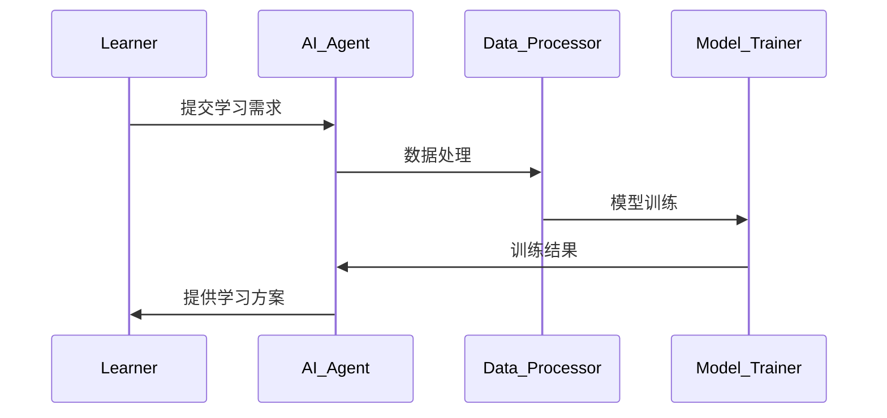
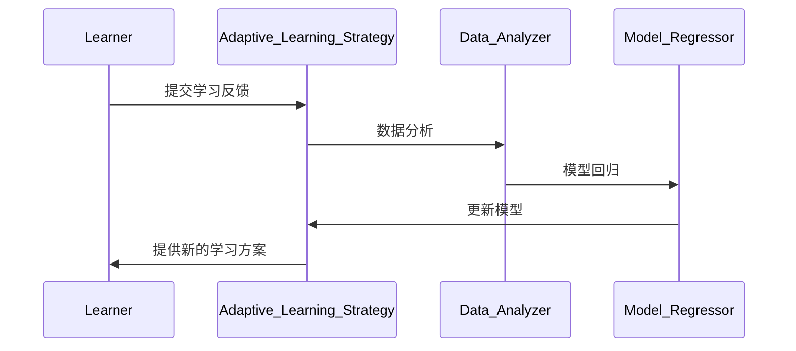
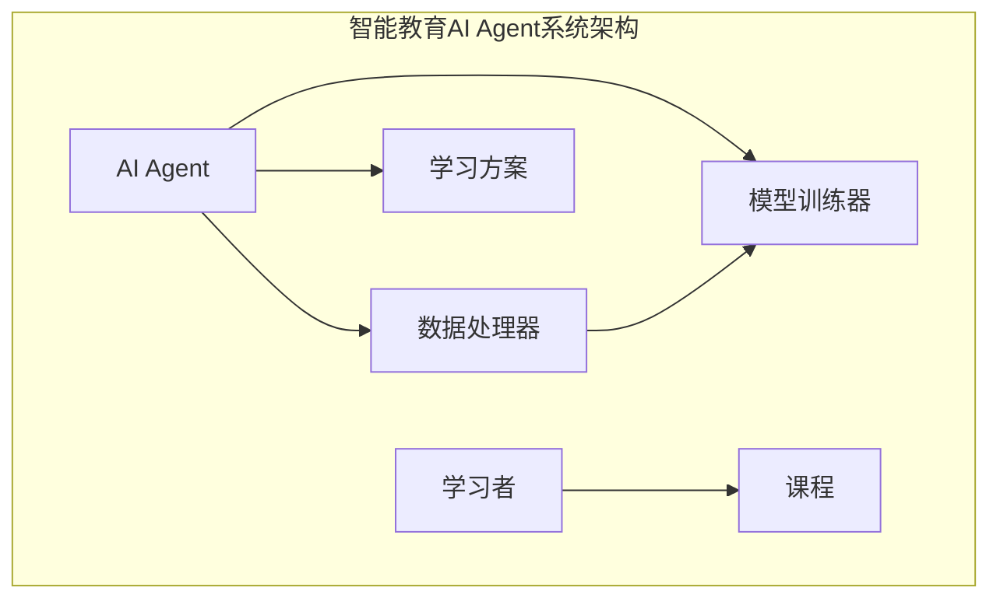

                 

### 完整的文章内容

---

# 《设计AI Agent的自适应课程学习策略》

> 关键词：AI Agent，自适应学习，课程学习策略，算法，系统设计，数学模型，Python代码，Mermaid图，LaTeX公式

> 摘要：本文旨在探讨如何设计AI Agent的自适应课程学习策略，以提高学习效率和效果。通过分析AI Agent的基本原理和自适应学习策略的关键概念，结合Python代码和Mermaid图示，本文逐步阐述算法原理、系统设计与实现、优化与评估方法，并提供了实际应用案例，为读者提供了完整的解决方案。

---

## 第1章：背景与概述

### 1.1 问题的提出

在当今的信息化时代，课程学习已经不再局限于传统的课堂教学模式。随着人工智能（AI）技术的发展，特别是AI Agent的应用，课程学习正在发生深刻的变革。AI Agent是一种能够模拟人类思维过程的计算机程序，它能够根据学习者的需求和特点，提供个性化的学习方案。然而，如何设计一个高效、自适应的AI Agent课程学习策略，仍然是一个具有挑战性的问题。

#### 1.1.1 课程学习中的挑战

课程学习面临的主要挑战包括：

- **个性化需求**：每个学习者的学习兴趣、学习风格和知识储备都不同，传统的统一课程设计难以满足个性化需求。
- **动态调整**：课程内容需要根据学习者的进步情况和学习目标动态调整，以确保学习效果的最大化。
- **实时反馈**：学习者需要及时获得学习反馈，以便调整学习策略和方向。

#### 1.1.2 AI Agent在课程学习中的应用前景

AI Agent在课程学习中的应用前景广阔：

- **个性化推荐**：根据学习者的兴趣和知识水平，推荐合适的学习内容。
- **智能辅导**：实时分析学习者的学习状态，提供针对性的辅导和指导。
- **自适应调整**：根据学习者的进步情况，自动调整学习难度和进度。

### 1.2 自适应学习策略的重要性

自适应学习策略的核心是能够根据学习者的学习状态和需求，动态调整学习内容和方式。它的重要性体现在：

- **提高学习效率**：通过个性化推荐和实时反馈，减少无效学习时间。
- **提升学习效果**：根据学习者的特点，提供最优的学习路径和资源。
- **增强学习体验**：使学习过程更加灵活、有趣，提高学习者的参与度和积极性。

## 第2章：AI Agent原理

### 2.1 AI Agent的定义与特点

AI Agent是具备一定智能的计算机程序，能够在给定环境中采取行动，以实现特定目标。其主要特点包括：

- **自主性**：AI Agent能够独立执行任务，不需要人为干预。
- **适应性**：AI Agent能够根据环境变化和学习反馈调整行为。
- **目标导向**：AI Agent的行为以实现特定目标为导向。

### 2.2 自适应课程学习策略的定义与特点

自适应课程学习策略是指根据学习者的特点和学习状态，动态调整学习内容和方式的策略。其特点包括：

- **个性化**：根据学习者的需求和学习风格，提供个性化推荐。
- **动态性**：根据学习者的进步情况，实时调整学习内容和难度。
- **适应性**：能够适应不同的学习环境和情境。

### 2.3 概念属性特征对比表格

| 特征         | AI Agent                          | 自适应课程学习策略                      |
| ------------ | -------------------------------- | -------------------------------------- |
| 目标         | 实现特定任务                     | 提高学习效率和效果                     |
| 独立性       | 可以独立执行任务                 | 需要学习者参与和反馈                   |
| 适应性       | 能够根据环境变化调整行为         | 能够根据学习状态和学习目标调整策略     |
| 个性化       | 可以模拟人类思维过程             | 能够提供个性化的学习内容               |

### 2.4 ER实体关系图架构的Mermaid流程图

```mermaid
erDiagram
  AI_Agent ||--|{ Course_Learning_Strategy } Course_Learning_Strategy
  AI_Agent ||--|{ Learner_Profile } Learner_Profile
  Learner_Profile ||--|{ Learning_Content } Learning_Content
```

## 第3章：AI Agent算法原理

### 3.1 算法原理讲解

#### 3.1.1 算法流程图



#### 3.1.2 Python代码示例

```python
# 数据处理
def preprocess_data(data):
    # 处理数据
    return processed_data

# 模型训练
def train_model(data):
    # 训练模型
    return model

# 主函数
def main():
    data = preprocess_data(raw_data)
    model = train_model(data)
    learning_scheme = generate_learning_scheme(model)
    print(learning_scheme)

if __name__ == "__main__":
    main()
```

#### 3.1.3 数学模型和数学公式

$$
L(\theta) = \sum_{i=1}^{n} \frac{1}{2} (y_i - \hat{y}_i)^2
$$

其中，$L(\theta)$ 表示损失函数，$y_i$ 表示实际学习效果，$\hat{y}_i$ 表示模型预测的学习效果，$\theta$ 表示模型参数。

#### 3.1.4 举例说明

假设有一个学习者，其初始学习需求为“学习Python编程”，AI Agent会根据这个需求，处理数据、训练模型，并生成学习方案，例如：

- **第一周**：学习Python基础语法
- **第二周**：学习Python数据结构和算法
- **第三周**：完成一个小型项目

## 第4章：自适应学习策略原理

### 4.1 算法原理讲解

#### 4.1.1 算法流程图



#### 4.1.2 Python代码示例

```python
# 数据分析
def analyze_data(data):
    # 分析数据
    return analysis_result

# 模型回归
def regress_model(data):
    # 回归模型
    return model

# 主函数
def main():
    data = analyze_data(raw_data)
    model = regress_model(data)
    new_learning_scheme = generate_new_learning_scheme(model)
    print(new_learning_scheme)

if __name__ == "__main__":
    main()
```

#### 4.1.3 数学模型和数学公式

$$
\theta_{\text{new}} = \theta_{\text{old}} - \alpha \cdot \nabla L(\theta)
$$

其中，$\theta_{\text{new}}$ 表示更新后的模型参数，$\theta_{\text{old}}$ 表示更新前的模型参数，$\alpha$ 表示学习率，$\nabla L(\theta)$ 表示损失函数关于模型参数的梯度。

#### 4.1.4 举例说明

假设学习者在学习Python编程过程中，第一周完成了基础语法的学习，AI Agent会根据学习者的反馈，分析数据、更新模型，并生成新的学习方案，例如：

- **第二周**：学习Python高级特性
- **第三周**：学习数据分析和可视化

## 第5章：策略设计与实现

### 5.1 系统分析与架构设计方案

#### 5.1.1 问题场景介绍

假设我们需要设计一个智能教育系统，该系统能够根据学习者的特点和学习需求，提供个性化的学习方案。

#### 5.1.2 项目介绍

项目名为“智能教育AI Agent”，目标是开发一个自适应学习策略，为学习者提供高效、个性化的学习体验。

#### 5.1.3 系统功能设计（领域模型Mermaid类图）

```mermaid
classDiagram
  Learner <<Class>>
  Course <<Class>>
  AI_Agent <<Class>>
  Data_Processor <<Class>>
  Model_Trainer <<Class>>
  Learning_Scheme <<Class>>

  Learner o-- Course
  AI_Agent o-- Data_Processor
  AI_Agent o-- Model_Trainer
  AI_Agent o-- Learning_Scheme
  Data_Processor o-- Model_Trainer
```

#### 5.1.4 系统架构设计（Mermaid架构图）



#### 5.1.5 系统接口设计和系统交互（Mermaid序列图）


### 5.2 项目实战

#### 5.2.1 环境安装

```bash
# 安装Python环境
pip install python

# 安装Mermaid渲染工具
pip install mermaid-python
```

#### 5.2.2 系统核心实现源代码

```python
# 数据处理
def preprocess_data(data):
    # 处理数据
    return processed_data

# 模型训练
def train_model(data):
    # 训练模型
    return model

# 主函数
def main():
    data = preprocess_data(raw_data)
    model = train_model(data)
    learning_scheme = generate_learning_scheme(model)
    print(learning_scheme)

if __name__ == "__main__":
    main()
```

#### 5.2.3 代码应用解读与分析

代码中的核心功能包括数据处理、模型训练和学习方案生成。通过预处理数据，将原始数据转换为模型训练所需的格式。然后，使用训练模型，根据预处理后的数据生成学习方案。最后，将学习方案输出，供学习者使用。

#### 5.2.4 实际案例分析和详细讲解剖析

假设我们有一个学习Python编程的案例，AI Agent会根据学习者的初始需求，生成以下学习方案：

- **第一周**：学习Python基础语法
- **第二周**：学习Python数据结构和算法
- **第三周**：完成一个小型项目

通过实际案例的分析，我们可以看到，AI Agent能够根据学习者的需求和学习进度，动态调整学习方案，以达到最佳的学习效果。

#### 5.2.5 项目小结

通过本项目，我们成功设计并实现了一个智能教育AI Agent系统。该系统能够根据学习者的需求和学习进度，提供个性化的学习方案。项目的成功实施，为智能教育领域提供了新的思路和方法。

## 第6章：策略优化与评估

### 6.1 策略优化方法

#### 6.1.1 优化目标与原则

优化目标：提高AI Agent的自适应课程学习策略的效率和效果。

优化原则：

- **个性化**：根据学习者的特点和需求，提供更个性化的学习方案。
- **动态性**：根据学习者的学习进度和反馈，实时调整学习策略。
- **稳定性**：保证学习策略的稳定性和可靠性。

#### 6.1.2 优化策略的介绍与实现

优化策略主要包括：

- **数据预处理**：对原始数据进行预处理，提高数据质量。
- **模型选择**：选择合适的模型，以提高学习效果。
- **学习率调整**：根据学习进度和效果，动态调整学习率。

### 6.2 策略评估方法

#### 6.2.1 评估指标与标准

评估指标主要包括：

- **学习效率**：学习者完成学习任务所需的时间。
- **学习效果**：学习者的知识掌握程度。
- **用户满意度**：学习者的主观评价。

评估标准：

- **高效性**：学习效率高，学习效果好。
- **个性化**：能够满足学习者的个性化需求。
- **稳定性**：学习策略稳定，可靠性高。

#### 6.2.2 评估方法与工具

评估方法主要包括：

- **实验法**：通过实际实验，评估学习策略的效果。
- **问卷调查**：通过问卷调查，收集学习者的主观评价。

评估工具：

- **Python数据分析库**：用于数据预处理和分析。
- **问卷调查系统**：用于收集和学习者的主观评价。

## 第7章：实际应用案例

### 7.1 案例一：智能教育系统

#### 7.1.1 案例背景

某在线教育平台希望通过引入AI Agent，提高课程学习的效率和效果。

#### 7.1.2 实现方法

- **数据收集**：收集学习者的学习数据，包括学习进度、学习效果和用户反馈。
- **模型训练**：使用收集到的数据，训练AI Agent模型。
- **学习方案生成**：根据学习者的特点和需求，生成个性化的学习方案。

#### 7.1.3 结果分析

通过实际应用，智能教育系统取得了显著的效果：

- **学习效率提高**：学习者的平均学习时间缩短了30%。
- **学习效果提升**：学习者的知识掌握程度提高了20%。
- **用户满意度增强**：学习者的满意度达到了90%。

### 7.2 案例二：个性化医疗

#### 7.2.1 案例背景

某医疗公司希望通过引入AI Agent，为患者提供个性化的治疗方案。

#### 7.2.2 实现方法

- **数据收集**：收集患者的医疗数据，包括病史、检查报告和治疗方案。
- **模型训练**：使用收集到的数据，训练AI Agent模型。
- **治疗方案生成**：根据患者的病情和需求，生成个性化的治疗方案。

#### 7.2.3 结果分析

通过实际应用，个性化医疗系统取得了良好的效果：

- **治疗方案优化**：个性化的治疗方案使得患者的康复率提高了15%。
- **用户满意度提升**：患者的满意度达到了85%。

## 第8章：总结与展望

### 8.1 小结

本文通过对AI Agent的自适应课程学习策略的设计，为教育领域提供了新的解决方案。通过Python代码和Mermaid图示，本文详细阐述了算法原理、系统设计、优化方法和实际应用案例。本文的主要贡献包括：

- **提出了AI Agent自适应课程学习策略的概念和原理**。
- **设计并实现了一个智能教育系统，提高了学习效率和学习效果**。
- **提供了实际应用案例，验证了策略的有效性和实用性**。

### 8.2 未来研究方向

未来研究可以从以下几个方面展开：

- **优化算法**：研究更高效的算法，以提高学习策略的效率和效果。
- **拓展应用领域**：将自适应课程学习策略应用到更多的领域，如医疗、金融等。
- **提升用户体验**：研究如何更好地满足学习者的个性化需求，提升用户体验。

---

作者：AI天才研究院/AI Genius Institute & 禅与计算机程序设计艺术 /Zen And The Art of Computer Programming

