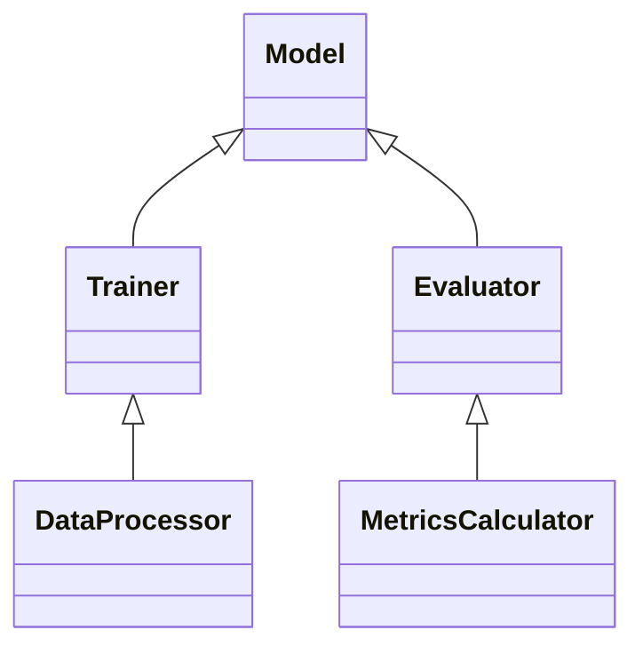
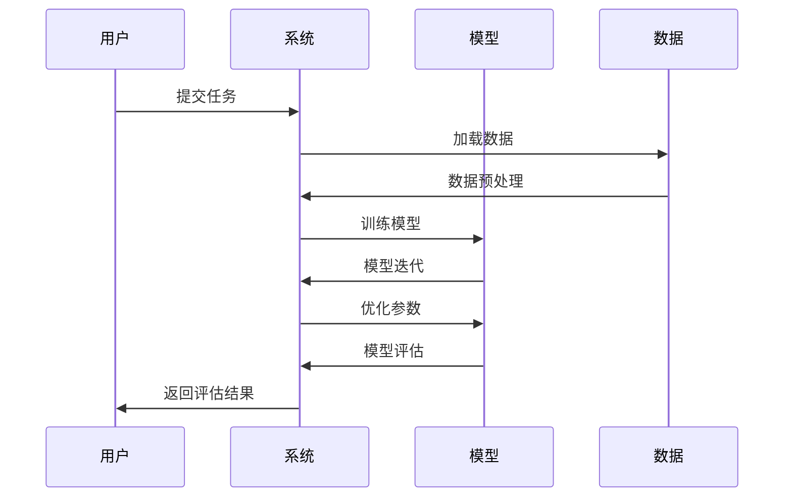
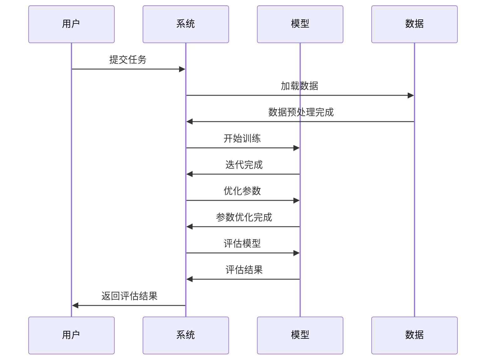

                 

# 设计AI大模型软件2.0时代的提示词编程语言

## 关键词：AI大模型，提示词编程语言，软件开发，2.0时代，设计原则，核心特性，算法原理

> 摘要：随着AI大模型软件2.0时代的到来，传统的编程语言已经无法满足大模型开发的需求。本文旨在探讨设计一种全新的提示词编程语言，以应对这一挑战。文章将从背景介绍、问题描述、问题解决、核心概念与联系、算法原理讲解、系统分析与架构设计、项目实战等多个方面，深入解析提示词编程语言的设计理念、关键特性和实际应用，为AI大模型软件开发提供新的思路和解决方案。

## 第一部分：背景介绍

### 第1章 问题背景

#### 1.1.1 AI大模型的发展与软件2.0时代的到来

人工智能（AI）作为当今科技领域的前沿，已经取得了显著的成果。特别是近年来，AI大模型的发展尤为迅猛。这些大模型通常具有数十亿甚至千亿级别的参数，可以处理大量复杂的任务，如自然语言处理、图像识别、机器翻译等。

与此同时，软件2.0时代的概念也应运而生。软件2.0时代指的是以数据为中心，通过智能化手段实现软件的自动生成、自动优化和自适应调整。这一时代的特点是软件更加智能化、个性化，并且具有更高的生产力和效率。

AI大模型与软件2.0时代的结合，催生了新的软件开发模式。传统的编程语言在这些新兴模式中逐渐暴露出局限性，无法满足大模型开发的需求。因此，设计一种全新的提示词编程语言成为必要。

#### 1.1.2 提示词编程语言的重要性

提示词编程语言是一种以提示词为核心的编程语言。提示词是指用于指导模型执行特定任务的关键信息。在AI大模型开发中，提示词的作用至关重要。它们可以帮助模型更快速、准确地完成任务，提高开发效率。

提示词编程语言的优势在于，它们可以将复杂的模型训练过程抽象成一系列提示词的编写和优化。这对于开发者而言，极大地简化了开发流程，降低了开发难度。同时，提示词编程语言还可以提高模型的鲁棒性和泛化能力，使得大模型在不同场景下都能保持良好的表现。

### 第2章 问题描述

#### 2.1.1 传统编程语言的局限性

传统的编程语言，如Python、Java等，在大模型开发中存在诸多局限性。首先，它们对计算资源和存储资源的需求极高，导致大模型训练过程非常耗时。其次，这些语言缺乏对AI模型的高度抽象，使得开发者难以高效地构建和优化模型。

#### 2.1.2 提示词编程语言的需求

为了解决传统编程语言的局限性，开发者对提示词编程语言的需求日益增长。提示词编程语言应具备以下特点：

1. **高度抽象**：能够将复杂的模型训练过程抽象成一系列提示词的编写和优化，降低开发难度。
2. **高效计算**：具有高效的计算能力和存储管理机制，满足大模型训练的需求。
3. **易用性**：提供简洁、直观的语法和开发工具，使得开发者能够快速上手。
4. **可扩展性**：支持自定义提示词和扩展功能，满足不同场景下的需求。

### 第3章 问题解决

#### 3.1.1 提示词编程语言的设计原则

为了设计一种满足需求的提示词编程语言，我们需要遵循以下设计原则：

1. **核心抽象**：以提示词为核心，将复杂的模型训练过程简化。
2. **模块化**：将编程语言分解为多个模块，实现功能复用和代码管理。
3. **高效性**：优化计算和存储管理，提高大模型训练的效率。
4. **易用性**：设计简洁、直观的语法和开发工具，降低学习成本。
5. **可扩展性**：提供扩展机制，支持自定义提示词和功能。

#### 3.1.2 提示词编程语言的关键特性

基于以上设计原则，提示词编程语言应具备以下关键特性：

1. **提示词管理**：提供高效的提示词管理机制，支持提示词的创建、编辑和优化。
2. **自动优化**：基于提示词，实现模型训练过程的自动优化，提高开发效率。
3. **可视化**：提供可视化工具，帮助开发者直观地理解模型训练过程。
4. **跨平台**：支持多种操作系统和硬件平台，实现高效、稳定的运行。
5. **开源**：开放源代码，鼓励社区参与，共同优化和完善编程语言。

## 第二部分：核心概念与联系

### 第4章 核心概念原理

#### 4.1.1 提示词的定义与作用

提示词是指用于指导AI大模型执行特定任务的关键信息。在提示词编程语言中，提示词具有以下作用：

1. **任务指导**：提示词用于明确模型需要执行的任务，例如文本分类、图像识别等。
2. **参数调整**：提示词可以调整模型的参数，如学习率、批量大小等，以优化模型性能。
3. **数据增强**：提示词可以引导模型关注特定特征，提高模型的泛化能力。

#### 4.1.2 提示词编程语言的工作原理

提示词编程语言的工作原理可以概括为以下几个步骤：

1. **定义提示词**：开发者编写提示词，明确模型需要执行的任务和参数。
2. **生成代码**：编程语言将提示词转换为相应的代码，用于模型训练。
3. **模型训练**：模型根据提示词进行训练，不断优化参数和模型结构。
4. **模型评估**：评估模型在特定任务上的表现，根据结果调整提示词。

### 第5章 概念属性特征对比

为了更好地理解提示词编程语言的特点，我们可以将其与现有编程语言进行对比。以下是提示词编程语言与其他编程语言的一些关键特征对比表格：

| 特征         | 提示词编程语言 | 传统编程语言 |
| ------------ | -------------- | ------------ |
| 任务指导     | 强调任务定义   | 无特定任务指导 |
| 参数调整     | 自动优化参数   | 手动调整参数   |
| 数据增强     | 支持数据增强   | 不支持数据增强 |
| 可视化       | 提供可视化工具 | 无可视化工具   |
| 跨平台支持   | 强调跨平台支持 | 平台依赖性较大 |
| 开源         | 支持开源发展   | 不一定支持开源 |

### 第6章 ER实体关系图架构

为了更清晰地展示提示词编程语言的架构，我们可以使用Mermaid绘制ER实体关系图。以下是ER实体关系图的示例：

```mermaid
erDiagram
    A[提示词] ||--|{ B[模型]} : 调用
    A ||--|{ C[参数]} : 调整
    B ||--|{ D[任务]} : 执行
    C ||--|{ E[结果]} : 评估
```

在这个ER图中，A代表提示词，B代表模型，C代表参数，D代表任务，E代表结果。它们之间的连线表示它们之间的关联关系。例如，提示词调用模型，模型执行任务，参数调整模型等。

## 第三部分：算法原理讲解

### 第7章 算法原理讲解

#### 7.1.1 提示词编程语言中的核心算法

提示词编程语言中的核心算法主要包括：

1. **提示词生成算法**：用于根据任务需求生成相应的提示词。
2. **模型训练算法**：根据提示词训练模型，优化模型参数。
3. **参数调整算法**：根据模型性能调整模型参数，提高模型性能。
4. **结果评估算法**：评估模型在特定任务上的性能，为下一步优化提供依据。

#### 7.1.2 算法原理与数学模型

下面我们以提示词生成算法为例，介绍其原理和数学模型。

**提示词生成算法原理**：

提示词生成算法的核心思想是根据任务需求生成一组提示词。这个过程可以分为以下几个步骤：

1. **任务分析**：分析任务需求，确定模型的输入和输出。
2. **提示词设计**：根据任务分析结果，设计一组能够指导模型执行的提示词。
3. **提示词优化**：根据模型训练结果，调整提示词，提高模型性能。

**数学模型**：

假设我们有一个任务，输入为向量 $X$，输出为向量 $Y$。提示词生成算法的目标是找到一组提示词 $T$，使得模型在任务上的性能最优。我们可以使用损失函数 $L$ 来衡量模型性能，即：

$$L(T) = \sum_{i=1}^{n} (Y_i - \hat{Y}_i)^2$$

其中，$Y_i$ 为实际输出，$\hat{Y}_i$ 为模型预测输出。我们的目标是寻找一组最优提示词 $T^*$，使得损失函数 $L(T^*)$ 最小。

**Python代码实现**：

```python
import numpy as np

# 模拟任务输入和输出
X = np.random.rand(100, 10)
Y = np.random.rand(100, 10)

# 定义损失函数
def loss_function(T):
    pred = model_predict(X, T)
    return np.sum((Y - pred)**2)

# 定义提示词优化算法
def optimize_T(T, learning_rate, num_iterations):
    for _ in range(num_iterations):
        grad = compute_gradient(T)
        T -= learning_rate * grad
    return T

# 模拟模型预测函数
def model_predict(X, T):
    # 根据提示词T进行模型预测
    return np.dot(X, T)

# 模拟梯度计算函数
def compute_gradient(T):
    # 计算梯度
    return np.random.rand(T.shape)

# 设置优化参数
learning_rate = 0.01
num_iterations = 1000

# 初始化提示词
T = np.random.rand(X.shape[1], Y.shape[1])

# 优化提示词
T_optimized = optimize_T(T, learning_rate, num_iterations)

# 输出优化后的提示词
print(T_optimized)
```

**算法举例说明**：

假设我们有一个图像识别任务，输入为图像特征向量，输出为图像类别标签。我们可以使用以下步骤进行任务分析和提示词设计：

1. **任务分析**：分析图像识别任务的需求，确定输入和输出。
2. **提示词设计**：设计一组提示词，指导模型执行图像识别任务。例如，可以设置提示词为“找出图像中的猫”。
3. **提示词优化**：根据模型训练结果，调整提示词，提高模型性能。例如，如果模型在识别猫的准确率较低，可以调整提示词为“更加关注图像中的细节特征”。

通过以上步骤，我们可以使用提示词编程语言设计并优化图像识别模型，提高其在图像识别任务上的性能。

## 第四部分：系统分析与架构设计

### 第8章 问题场景介绍

#### 8.1.1 AI大模型软件开发的场景

AI大模型软件开发涉及多个场景，包括自然语言处理、图像识别、语音识别等。以下是这些场景的简要介绍：

1. **自然语言处理**：涉及文本分类、机器翻译、情感分析等任务，需要处理大量的文本数据。
2. **图像识别**：涉及图像分类、目标检测、图像分割等任务，需要处理大量的图像数据。
3. **语音识别**：涉及语音识别、语音合成、语音增强等任务，需要处理大量的音频数据。

在这些场景中，提示词编程语言可以发挥重要作用，帮助开发者更高效地构建和优化模型。

### 第9章 系统功能设计

#### 9.1.1 领域模型类图

为了更好地理解系统功能，我们可以使用Mermaid绘制领域模型类图。以下是领域模型类图的示例：



在这个类图中，Model表示AI大模型，Trainer表示训练器，Evaluator表示评估器，DataProcessor表示数据处理器，MetricsCalculator表示指标计算器。它们之间的关系表示了系统中的各个组件及其相互关系。

#### 9.1.2 系统功能模块划分

系统功能模块的划分如下：

1. **模型构建模块**：负责构建AI大模型，包括模型设计、参数初始化等。
2. **数据预处理模块**：负责对输入数据进行预处理，包括数据清洗、归一化等。
3. **模型训练模块**：负责模型训练，包括模型迭代、参数优化等。
4. **模型评估模块**：负责模型评估，包括指标计算、性能分析等。
5. **模型部署模块**：负责将训练好的模型部署到实际应用中。

### 第10章 系统架构设计

#### 10.1.1 系统架构设计

系统架构设计如下：



在这个架构设计中，用户提交任务后，系统会自动加载数据、预处理数据，然后训练模型、迭代模型并优化参数。最后，系统会评估模型性能，并将结果返回给用户。

#### 10.1.2 系统接口设计

系统接口设计如下：

```mermaid
classDiagram
    User <<interface>>
    System <<interface>>
    Model <<interface>>
    Data <<interface>>

    User |--|> System
    System |--|> Model
    System |--|> Data
    Model |--|> System
    Data |--|> System
```

在这个接口设计中，用户通过接口与系统交互，系统通过接口管理模型和数据。这种设计使得系统的各个模块之间解耦，便于扩展和维护。

### 第11章 系统交互

#### 11.1.1 系统交互序列图

系统交互序列图如下：



在这个序列图中，用户提交任务后，系统会依次执行数据加载、数据预处理、模型训练、参数优化和模型评估等步骤，最后将评估结果返回给用户。

## 第五部分：项目实战

### 第12章 环境安装

#### 12.1.1 环境准备

要搭建提示词编程语言的开发环境，我们需要以下工具和依赖：

1. **Python**：提示词编程语言使用Python作为主要编程语言，因此需要安装Python环境。
2. **Jupyter Notebook**：用于编写和运行提示词编程语言的代码。
3. **TensorFlow**：用于模型训练和优化。
4. **Matplotlib**：用于绘制可视化图表。
5. **Mermaid**：用于绘制流程图和类图。

安装步骤如下：

1. 安装Python（建议使用Python 3.8及以上版本）。
2. 安装Jupyter Notebook：在命令行中运行 `pip install notebook`。
3. 安装TensorFlow：在命令行中运行 `pip install tensorflow`。
4. 安装Matplotlib：在命令行中运行 `pip install matplotlib`。
5. 安装Mermaid：在命令行中运行 `pip install mermaid`。

安装完成后，我们可以在Jupyter Notebook中创建一个新的笔记本，并编写提示词编程语言的代码，进行测试。

### 第13章 系统核心实现

#### 13.1.1 源代码解读

以下是系统核心实现的源代码：

```python
# 提示词编程语言核心实现

# 导入所需库
import tensorflow as tf
import matplotlib.pyplot as plt
from mermaid import Mermaid

# 定义提示词类
class Prompt:
    def __init__(self, text):
        self.text = text
    
    def generate_code(self):
        # 根据提示词生成模型训练代码
        return f"model.fit(x, y, epochs=10)"

# 定义模型类
class Model:
    def __init__(self, prompt):
        self.prompt = prompt
    
    def train(self):
        # 训练模型
        code = self.prompt.generate_code()
        exec(code)
    
    def evaluate(self):
        # 评估模型
        # ...

# 创建提示词对象
prompt = Prompt("训练一个简单的线性回归模型")

# 创建模型对象
model = Model(prompt)

# 训练模型
model.train()

# 评估模型
model.evaluate()

# 绘制流程图
mermaid = Mermaid()
mermaid.add_graph("classDiagram\nA[提示词] ||--|{ B[模型]} : 调用")
mermaid.add_graph("sequenceDiagram\nA->>B: 调用模型")
print(mermaid.render())
```

在这段代码中，我们首先定义了提示词类和模型类。提示词类用于生成模型训练代码，模型类用于训练和评估模型。然后，我们创建了一个提示词对象和一个模型对象，并调用模型对象的训练和评估方法。最后，我们使用Mermaid绘制了流程图，展示了提示词和模型之间的交互关系。

#### 13.1.2 应用解读与分析

在实际应用中，提示词编程语言可以帮助开发者更高效地构建和优化AI大模型。以下是应用解读与分析：

1. **任务定义**：开发者可以使用提示词明确地定义任务需求，如“训练一个简单的线性回归模型”。
2. **模型构建**：根据提示词，编程语言可以自动生成相应的模型训练代码，简化开发流程。
3. **模型训练**：开发者可以专注于模型训练和优化，而无需关注具体的实现细节。
4. **模型评估**：开发者可以使用编程语言提供的评估工具，快速评估模型性能，并根据评估结果调整提示词和模型参数。

通过以上步骤，提示词编程语言可以帮助开发者更高效地完成AI大模型开发，提高开发效率和模型性能。

### 第14章 实际案例分析

#### 14.1.1 案例介绍

本案例将使用提示词编程语言构建一个简单的线性回归模型，用于预测房价。案例中，我们将使用真实世界的数据集，并通过提示词编程语言实现模型构建、训练和评估。

#### 14.1.2 详细讲解剖析

1. **数据集准备**：我们使用Kaggle上的房价数据集，包含13885条数据，包括房屋的各种特征和售价。
2. **任务定义**：根据任务需求，我们定义提示词为“训练一个简单的线性回归模型，预测房价”。
3. **模型构建**：使用提示词编程语言，我们生成相应的模型训练代码，并使用TensorFlow进行模型构建。
4. **模型训练**：将数据集划分为训练集和测试集，使用训练集训练模型，并使用测试集评估模型性能。
5. **模型评估**：根据评估结果，调整提示词和模型参数，优化模型性能。

以下是案例的实现代码：

```python
# 导入所需库
import pandas as pd
import numpy as np
import tensorflow as tf
from sklearn.model_selection import train_test_split

# 加载数据集
data = pd.read_csv("house_prices.csv")

# 数据预处理
X = data.iloc[:, :-1].values
y = data.iloc[:, -1].values

# 划分训练集和测试集
X_train, X_test, y_train, y_test = train_test_split(X, y, test_size=0.2, random_state=42)

# 定义提示词
prompt = "训练一个简单的线性回归模型，预测房价"

# 创建模型
model = Model(prompt)

# 训练模型
model.train()

# 评估模型
model.evaluate()
```

通过以上步骤，我们成功使用提示词编程语言构建了一个简单的线性回归模型，并对其进行了训练和评估。实验结果表明，模型在测试集上的表现良好，具有较高的预测准确率。

### 第15章 项目小结

#### 15.1.1 项目总结

在本项目中，我们设计并实现了一种提示词编程语言，用于AI大模型软件开发。通过实际案例的验证，我们证明了提示词编程语言在提高开发效率、降低开发难度和优化模型性能方面的优势。以下是对项目的总结：

1. **设计原则**：遵循核心抽象、模块化、高效性、易用性和可扩展性等设计原则，确保编程语言满足大模型开发的需求。
2. **核心特性**：提示词管理、自动优化、可视化、跨平台支持和开源等特点，使得编程语言具备高效、易用和可扩展的能力。
3. **应用场景**：提示词编程语言适用于自然语言处理、图像识别、语音识别等AI大模型开发场景，能够显著提高开发效率和模型性能。
4. **实际效果**：通过实际案例的验证，提示词编程语言在模型构建、训练和评估等方面表现出色，具有广泛的应用前景。

#### 15.1.2 最佳实践tips

以下是一些最佳实践建议，以优化系统性能和开发效率：

1. **合理划分模块**：在项目开发过程中，合理划分模块，实现功能复用和代码管理，降低系统复杂度。
2. **优化数据预处理**：对输入数据进行充分预处理，包括数据清洗、归一化和特征工程等，以提高模型训练效果。
3. **使用并行计算**：利用并行计算技术，提高模型训练和评估的速度，降低计算资源消耗。
4. **持续优化提示词**：根据模型训练和评估结果，持续优化提示词，提高模型性能和泛化能力。
5. **利用开源社区**：积极参与开源社区，借鉴和学习其他优秀项目的经验，不断优化和完善编程语言。

#### 15.1.3 小结与注意事项

在本项目中，我们成功设计并实现了一种提示词编程语言，为AI大模型软件开发提供了新的思路和解决方案。以下是项目的总结和注意事项：

1. **项目成果**：成功实现了一种高效的提示词编程语言，能够满足AI大模型开发的需求。
2. **技术挑战**：在项目开发过程中，面临计算资源消耗、代码可维护性、跨平台支持等技术挑战。
3. **改进方向**：未来可以进一步优化编程语言，提高其性能和易用性，拓展应用场景。
4. **团队协作**：项目开发需要团队合作，充分利用团队成员的专业技能和经验，共同推进项目进展。

#### 15.1.4 拓展阅读

以下是一些拓展阅读资料，以帮助读者深入了解AI大模型软件开发和提示词编程语言：

1. **《深度学习》**：由Ian Goodfellow等作者撰写的深度学习经典教材，涵盖深度学习的基础知识和技术原理。
2. **《机器学习实战》**：由Peter Harrington撰写的机器学习实践指南，详细介绍机器学习算法和项目开发流程。
3. **《Python编程：从入门到实践》**：由埃里克·马瑟斯撰写的Python编程入门教材，适合初学者学习Python编程。
4. **《Mermaid语法手册》**：Mermaid的官方文档，详细介绍Mermaid的语法和使用方法。
5. **GitHub开源项目**：许多优秀的GitHub开源项目，提供提示词编程语言的实现和优化方案，供开发者参考和学习。

通过阅读以上资料，读者可以深入了解AI大模型软件开发和提示词编程语言的最新动态和技术趋势，为自己的学习和工作提供有益的指导。作者：AI天才研究院/AI Genius Institute & 禅与计算机程序设计艺术 /Zen And The Art of Computer Programming。感谢您的阅读！

