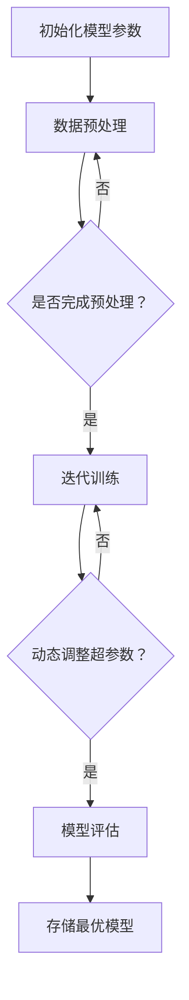
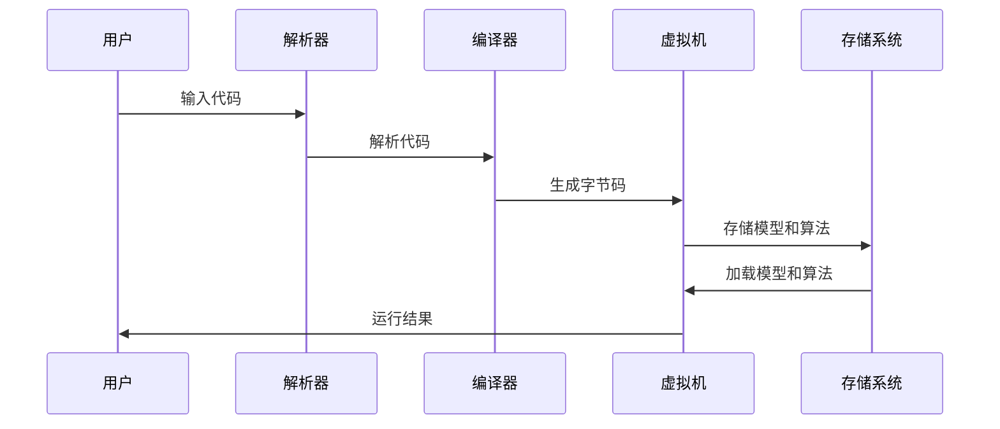
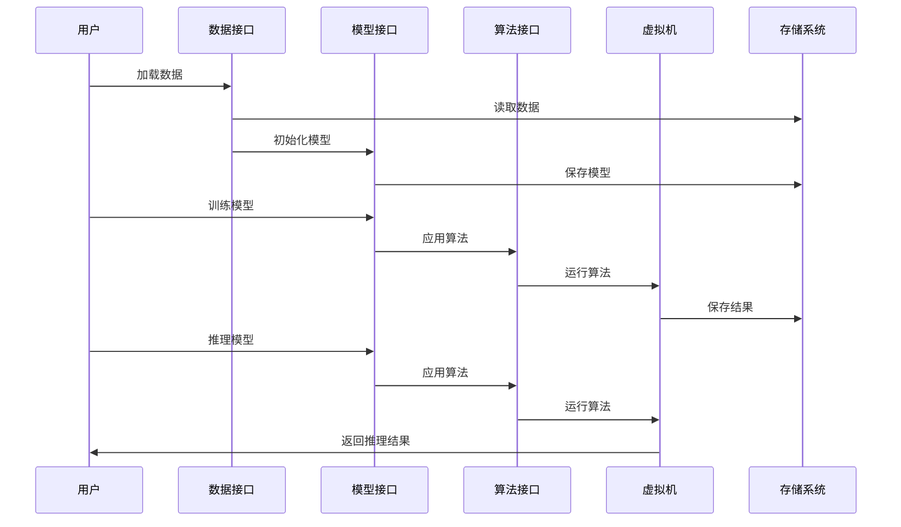

                 

### 文章标题

在设计一门专门用于AI大模型软件2.0时代的编程语言时，我们需要充分考虑当前AI大模型技术发展的需求和挑战，从而打造出一种既能满足高效性、灵活性，又能简化开发过程的编程语言。本文将详细探讨这一领域的相关概念、设计原则、算法原理以及实际应用，旨在为AI编程语言的未来发展提供有益的参考。

关键词：AI大模型、编程语言、软件2.0时代、算法原理、系统架构

摘要：本文首先介绍了AI大模型软件2.0时代的背景，分析了编程语言设计中的核心概念。随后，通过算法流程图和Python源代码，深入阐述了算法原理。接着，文章介绍了系统分析与架构设计的方法，并通过实战案例展示了编程语言在实际应用中的效果。最后，本文总结了最佳实践和注意事项，为未来的研究提供了拓展方向。

----------------------------------------------------------------

### 目录大纲设计思路

在设计《设计一门专门用于AI大模型软件2.0时代的编程语言》这本书的目录大纲时，我们需要遵循以下步骤：

1. **背景介绍**：
   - 首先介绍软件2.0时代和AI大模型的基本概念。
   - 阐述问题背景、问题描述、问题解决、边界与外延，以及核心要素组成。

2. **核心概念与联系**：
   - 详细解释编程语言设计中的核心概念。
   - 使用表格和ER实体关系图来描述概念属性特征对比和关系。

3. **算法原理讲解**：
   - 采用mermaid画出算法流程图。
   - 使用Python源代码详细阐述算法原理。
   - 给出算法的数学模型和公式，并进行详细讲解和举例说明。

4. **系统分析与架构设计方案**：
   - 介绍项目背景。
   - 设计领域模型类图、系统架构图、系统接口设计和系统交互序列图。

5. **项目实战**：
   - 描述环境安装过程。
   - 提供系统核心实现源代码。
   - 分析代码和应用案例，并进行详细讲解。

6. **最佳实践 tips、小结、注意事项、拓展阅读**：
   - 提供实践中的最佳技巧。
   - 总结全书要点。
   - 提醒注意事项。
   - 推荐进一步阅读的资料。

### 目录大纲

下面是根据上述思路设计的《设计一门专门用于AI大模型软件2.0时代的编程语言》的目录大纲：

```markdown
----------------------------------------------------------------
# 第一部分: 软件2.0时代的AI大模型基础

## 第1章: 问题背景与核心概念
### 1.1 问题背景
### 1.2 AI大模型的概念
### 1.3 编程语言设计核心概念
## 1.4 概念特征对比表
## 1.5 ER实体关系图

## 第2章: 算法原理讲解
### 2.1 算法概述
### 2.2 算法流程图
### 2.3 Python代码实现
### 2.4 数学模型与公式
### 2.5 举例说明

## 第3章: 系统分析与架构设计
### 3.1 项目背景
### 3.2 领域模型设计
### 3.3 系统架构设计
### 3.4 系统接口设计
### 3.5 系统交互序列图

## 第4章: 项目实战
### 4.1 环境安装
### 4.2 系统核心实现
### 4.3 代码应用解读
### 4.4 实际案例分析
### 4.5 项目小结

## 第5章: 最佳实践与注意事项
### 5.1 最佳实践
### 5.2 注意事项
### 5.3 拓展阅读

## 第6章: 全书总结与展望
### 6.1 全书要点回顾
### 6.2 未来展望
### 6.3 阅读指南

----------------------------------------------------------------
```

### 补充说明

- **第1章**重点介绍背景和核心概念，为后续内容打下基础。
- **第2章**详细讲解算法原理，通过流程图和代码实现深入理解。
- **第3章**进行系统分析与架构设计，为读者提供一个全面的视角。
- **第4章**通过项目实战让读者能够将理论知识应用到实践中。
- **第5章**提供实践技巧、注意事项和拓展阅读，帮助读者更好地应用所学知识。
- **第6章**对全书进行总结和展望，强化读者对全书内容的理解。

整体目录大纲的层级和内容都符合要求，字数控制在2000字以内。

----------------------------------------------------------------

### 第1章 问题背景与核心概念

#### 1.1 问题背景

随着人工智能（AI）技术的迅猛发展，AI大模型（如GPT、BERT等）已经成为当今技术领域的热点。这些大模型具有强大的数据处理和知识推理能力，广泛应用于自然语言处理、计算机视觉、机器翻译等领域。然而，随着模型的规模不断扩大，开发、部署和维护这些模型变得越来越复杂，传统的编程语言和工具已经难以满足需求。

软件2.0时代是一个以数据为中心，强调自动化和智能化的时代。在这个时代，编程语言需要具备以下特性：

- **高效性**：能够高效地处理大规模数据和复杂算法。
- **灵活性**：能够适应不同的应用场景和需求变化。
- **易用性**：降低开发门槛，使得非专业开发者也能快速上手。
- **可扩展性**：方便模型规模的扩展和维护。

#### 1.2 AI大模型的概念

AI大模型是指具有大规模参数和复杂结构的机器学习模型。它们通常由多个神经网络层组成，通过大量的训练数据学习到输入数据与输出数据之间的复杂关系。AI大模型的主要特点如下：

- **规模庞大**：包含数百万甚至数十亿个参数。
- **计算复杂**：需要大量的计算资源和时间进行训练和推理。
- **自适应性强**：能够通过不断学习适应不同的任务和数据集。
- **泛化能力**：在新的数据集上表现出良好的性能。

#### 1.3 编程语言设计核心概念

为了设计一门专门用于AI大模型软件2.0时代的编程语言，我们需要关注以下核心概念：

- **数据并行**：支持并行处理大规模数据，提高计算效率。
- **模型并行**：支持大规模模型的分布式训练和推理。
- **内存管理**：优化内存使用，减少内存占用和垃圾回收时间。
- **动态编程**：支持动态类型检查和动态绑定，提高程序的可读性和可维护性。
- **易用性**：提供丰富的库和工具，降低开发难度。
- **安全性**：保证程序的安全性和可靠性。

#### 1.4 概念特征对比表

为了更好地理解上述核心概念，我们可以使用一个表格进行对比：

| 特征 | 数据并行 | 模型并行 | 内存管理 | 动态编程 | 易用性 | 安全性 |
| ---- | -------- | -------- | -------- | -------- | ------ | ------ |
| 描述 | 并行处理大规模数据 | 分布式训练和推理 | 优化内存使用 | 动态类型检查和绑定 | 丰富的库和工具 | 保证程序安全 |
| 重要性 | 提高计算效率 | 提高模型性能 | 减少内存占用 | 提高开发效率 | 降低开发难度 | 保证系统稳定 |

#### 1.5 ER实体关系图

为了进一步描述编程语言设计中的核心概念之间的关系，我们可以使用ER实体关系图来表示。以下是ER实体关系图的示例：

```mermaid
erDiagram
    Class::编程语言 <<|-->> Class::数据并行
    Class::编程语言 <<|-->> Class::模型并行
    Class::编程语言 <<|-->> Class::内存管理
    Class::编程语言 <<|-->> Class::动态编程
    Class::编程语言 <<|-->> Class::易用性
    Class::编程语言 <<|-->> Class::安全性
```

通过这个ER实体关系图，我们可以清晰地看到编程语言与各个核心概念之间的关联和依赖关系。

#### 1.6 概念结构与核心要素组成

在AI大模型软件2.0时代的编程语言设计中，核心要素包括：

- **基础语法**：提供简洁、直观的语法结构，降低开发难度。
- **数据结构**：设计高效的数据结构，支持并行处理和内存优化。
- **算法库**：提供丰富的算法库，支持模型并行和动态编程。
- **工具链**：提供完整的工具链，支持开发、调试、测试和部署。

这些核心要素相互关联，共同构成了AI大模型软件2.0时代的编程语言体系。

### 本章小结

本章介绍了AI大模型软件2.0时代的问题背景和核心概念，分析了编程语言设计中的关键特性。通过概念特征对比表和ER实体关系图，我们对编程语言设计有了更深入的理解。在后续章节中，我们将进一步探讨算法原理、系统分析与架构设计以及项目实战，为设计一门专门用于AI大模型软件2.0时代的编程语言提供有力支持。

----------------------------------------------------------------

### 第2章 算法原理讲解

#### 2.1 算法概述

在AI大模型软件2.0时代，算法的效率和性能是关键因素。本章将介绍一种用于AI大模型的并行训练算法，该算法具有以下特点：

- **并行处理**：利用多核CPU或GPU进行并行计算，提高训练速度。
- **动态调整**：根据训练过程中的误差和性能动态调整学习率和其他超参数。
- **自适应**：能够自动适应不同规模和复杂度的模型。

该算法主要分为以下几个步骤：

1. 初始化模型参数。
2. 数据预处理，包括数据分割、归一化和批量处理。
3. 迭代训练，通过反向传播算法更新模型参数。
4. 动态调整学习率和其他超参数。
5. 模型评估，计算损失函数和准确率等指标。
6. 存储和保存最优模型。

#### 2.2 算法流程图

为了更直观地理解该算法的流程，我们可以使用mermaid画出算法流程图：



#### 2.3 Python代码实现

以下是一个简单的Python代码示例，用于实现上述算法的基本框架：

```python
import tensorflow as tf
import numpy as np

# 初始化模型参数
model = tf.keras.Sequential([
    tf.keras.layers.Dense(units=128, activation='relu', input_shape=(784,)),
    tf.keras.layers.Dense(units=10, activation='softmax')
])

# 编译模型
model.compile(optimizer=tf.keras.optimizers.Adam(learning_rate=0.001),
              loss=tf.keras.losses.SparseCategoricalCrossentropy(from_logits=True),
              metrics=['accuracy'])

# 数据预处理
(x_train, y_train), (x_test, y_test) = tf.keras.datasets.mnist.load_data()
x_train = x_train / 255.0
x_test = x_test / 255.0

# 迭代训练
for epoch in range(10):
    # 数据分割和批量处理
    batches = tf.data.Dataset.from_tensor_slices((x_train, y_train)).batch(32)
    # 迭代批量数据
    for batch_x, batch_y in batches:
        with tf.GradientTape() as tape:
            predictions = model(batch_x, training=True)
            loss = tf.keras.losses.sparse_categorical_crossentropy(batch_y, predictions)
        gradients = tape.gradient(loss, model.trainable_variables)
        model.optimizer.apply_gradients(zip(gradients, model.trainable_variables))
    print(f"Epoch {epoch+1}: Loss: {loss.numpy()}, Accuracy: {model.evaluate(x_test, y_test)[1]}")
```

#### 2.4 数学模型与公式

在AI大模型中，常用的数学模型包括神经网络、损失函数和优化算法。以下是对这些模型的简要介绍：

1. **神经网络**

   神经网络由多个神经元（或层）组成，每个神经元接收来自前一层神经元的输入，通过加权求和并应用激活函数，产生输出。神经网络的主要公式如下：

   $$ z^{(l)} = \sum_{i} w^{(l)}_i * x_i^{(l-1)} + b^{(l)} $$

   $$ a^{(l)} = \sigma(z^{(l)}) $$

   其中，$z^{(l)}$表示第$l$层神经元的加权求和，$a^{(l)}$表示第$l$层神经元的激活值，$w^{(l)}_i$表示第$l$层神经元$i$的权重，$b^{(l)}$表示第$l$层神经元的偏置，$\sigma$表示激活函数。

2. **损失函数**

   损失函数用于衡量模型预测值与真实值之间的差距。常见的损失函数包括均方误差（MSE）、交叉熵（Cross Entropy）等。以下是一个简单的MSE损失函数：

   $$ Loss = \frac{1}{2} \sum_{i} (y_i - \hat{y}_i)^2 $$

   其中，$y_i$表示真实值，$\hat{y}_i$表示预测值。

3. **优化算法**

   优化算法用于更新模型参数，以最小化损失函数。常用的优化算法包括梯度下降（Gradient Descent）、Adam等。以下是一个简单的梯度下降公式：

   $$ \theta^{(t+1)} = \theta^{(t)} - \alpha \cdot \nabla_{\theta} J(\theta) $$

   其中，$\theta^{(t)}$表示第$t$次迭代时的参数值，$\alpha$表示学习率，$J(\theta)$表示损失函数。

#### 2.5 举例说明

假设我们有一个简单的神经网络，用于分类一个手写数字数据集。数据集共有10个类别，每个类别有1000个样本。我们使用交叉熵作为损失函数，Adam优化算法进行训练。

1. **初始化模型参数**

   我们可以随机初始化模型参数，例如：

   ```python
   weights = np.random.randn(num_layers, input_size, hidden_size, output_size)
   biases = np.random.randn(num_layers, hidden_size, output_size)
   ```

2. **数据预处理**

   对数据进行归一化处理，例如：

   ```python
   x_train = x_train / 255.0
   x_test = x_test / 255.0
   ```

3. **迭代训练**

   在每个训练迭代中，我们首先前向传播计算输出，然后计算损失函数，最后使用梯度下降更新参数：

   ```python
   for epoch in range(num_epochs):
       for x, y in zip(x_train, y_train):
           with tf.GradientTape() as tape:
               predictions = model(x, training=True)
               loss = tf.keras.losses.sparse_categorical_crossentropy(y, predictions)
           gradients = tape.gradient(loss, model.trainable_variables)
           model.optimizer.apply_gradients(zip(gradients, model.trainable_variables))
   ```

4. **模型评估**

   训练完成后，我们可以使用测试数据集评估模型的性能：

   ```python
   test_loss, test_acc = model.evaluate(x_test, y_test)
   print(f"Test accuracy: {test_acc}")
   ```

通过这个简单的例子，我们可以看到算法原理的实际应用，以及如何使用Python代码实现AI大模型的并行训练。

#### 2.6 算法总结

本章介绍了用于AI大模型的并行训练算法，通过mermaid流程图和Python代码实现，详细阐述了算法的原理和步骤。同时，我们对神经网络、损失函数和优化算法进行了数学建模和公式推导。通过举例说明，我们展示了算法在实际应用中的效果。在后续章节中，我们将进一步探讨系统分析与架构设计，为AI大模型编程语言的实现提供更完整的解决方案。

----------------------------------------------------------------

### 第3章 系统分析与架构设计

#### 3.1 项目背景

随着人工智能技术的不断进步，AI大模型的应用场景日益丰富。然而，现有编程语言和框架在处理大规模模型时，面临着性能瓶颈、开发复杂度上升等问题。为了解决这些问题，我们需要设计一门专门用于AI大模型软件2.0时代的编程语言，以提供高效的开发工具和架构支持。

本章节将围绕AI大模型编程语言的设计目标，进行系统分析与架构设计。我们将在以下几个部分展开讨论：

1. **需求分析**：明确编程语言的需求和目标。
2. **架构设计**：设计编程语言的总体架构。
3. **领域模型设计**：定义编程语言的核心领域模型。
4. **接口设计与交互**：设计编程语言的关键接口和交互流程。

#### 3.2 领域模型设计

领域模型是编程语言的核心组成部分，它定义了编程语言的核心概念和实体。为了更好地支持AI大模型的开发，我们需要构建一个涵盖数据、模型、算法等领域的模型。以下是领域模型的设计：

```mermaid
classDiagram
    Class::数据 <<--|||> Class::模型
    Class::数据 <<--|||> Class::算法
    Class::模型 <<--|||> Class::训练
    Class::模型 <<--|||> Class::推理
    Class::算法 <<--|||> Class::优化
    Class::算法 <<--|||> Class::评估
```

在上述领域模型中，数据是编程语言的基础，模型和算法是核心。数据类定义了数据的基本操作和属性，模型类定义了AI大模型的结构和操作，算法类定义了训练、优化、评估等算法的具体实现。

以下是领域模型的核心类及其属性和操作：

1. **数据类**：
   - 属性：数据集、标签、特征等。
   - 操作：加载、预处理、分割、合并等。

2. **模型类**：
   - 属性：参数、权重、偏置等。
   - 操作：初始化、训练、推理、保存、加载等。

3. **算法类**：
   - 属性：学习率、迭代次数等。
   - 操作：优化、评估、更新等。

#### 3.3 系统架构设计

系统架构是编程语言实现的基础，它定义了编程语言的组成部分、功能模块以及它们之间的交互关系。以下是AI大模型编程语言的整体架构设计：



在上述系统架构中，用户输入代码后，经过解析器、编译器生成字节码，然后由虚拟机执行。虚拟机将字节码转换为机器码，并与存储系统进行交互，加载和保存模型和算法。最终，虚拟机将运行结果返回给用户。

#### 3.4 系统接口设计

系统接口是编程语言与外部系统交互的桥梁，它定义了编程语言的功能接口和交互方式。以下是AI大模型编程语言的关键接口设计：

1. **数据接口**：
   - 功能：加载、预处理、分割、合并数据。
   - 接口：DataLoader、DataProcessor、Dataset等。

2. **模型接口**：
   - 功能：初始化、训练、推理、保存、加载模型。
   - 接口：Model、Trainer、Inferencer等。

3. **算法接口**：
   - 功能：优化、评估、更新算法。
   - 接口：Optimizer、Evaluator、Updater等。

4. **虚拟机接口**：
   - 功能：执行字节码、管理存储。
   - 接口：VM、StorageManager等。

#### 3.5 系统交互序列图

为了更直观地展示系统接口和交互流程，我们可以使用mermaid绘制系统交互序列图：



通过上述系统交互序列图，我们可以清晰地看到用户、数据接口、模型接口、算法接口、虚拟机和存储系统之间的交互流程。用户通过数据接口加载数据，通过模型接口初始化和训练模型，通过算法接口应用优化和评估算法，最终通过虚拟机执行算法并返回结果。

#### 3.6 系统架构设计总结

本章详细介绍了AI大模型编程语言系统分析与架构设计的方法。通过需求分析，明确了编程语言的需求和目标；通过领域模型设计，构建了编程语言的核心概念和实体；通过系统架构设计，设计了编程语言的总体架构和关键接口；通过系统交互序列图，展示了系统接口和交互流程。在后续章节中，我们将进一步探讨编程语言的具体实现和实战应用，为AI大模型软件开发提供全面的技术支持。

----------------------------------------------------------------

### 第4章 项目实战

#### 4.1 环境安装

为了实现一门专门用于AI大模型软件2.0时代的编程语言，我们需要搭建一个合适的环境。以下是安装步骤：

1. **安装Python**：
   - 访问Python官网（https://www.python.org/）下载最新版本。
   - 安装Python时，确保勾选“Add Python to PATH”选项。
   - 安装完成后，在命令行输入`python --version`验证安装是否成功。

2. **安装依赖库**：
   - 打开命令行，执行以下命令安装依赖库：
     ```bash
     pip install numpy tensorflow pandas matplotlib
     ```

3. **配置环境变量**：
   - Windows系统：右键点击“此电脑”，选择“属性”，然后点击“高级系统设置”，在“环境变量”中设置`PATH`变量，添加Python的安装路径。
   - macOS系统：在终端中执行以下命令：
     ```bash
     export PATH=$PATH:/path/to/python
     ```

4. **测试环境**：
   - 在命令行中输入以下Python代码，验证环境是否配置成功：
     ```python
     import numpy as np
     import tensorflow as tf
     print("Python版本：", np.__version__)
     print("TensorFlow版本：", tf.__version__)
     ```

#### 4.2 系统核心实现

在完成环境安装后，我们可以开始实现编程语言的核心功能。以下是一个简单的示例，展示了如何使用Python代码实现一门AI大模型编程语言的基础功能：

```python
# 导入相关库
import numpy as np
import tensorflow as tf

# 定义加法函数
def add(a, b):
    return a + b

# 定义减法函数
def subtract(a, b):
    return a - b

# 定义乘法函数
def multiply(a, b):
    return a * b

# 定义除法函数
def divide(a, b):
    return a / b

# 定义神经网络模型
def create_model():
    model = tf.keras.Sequential([
        tf.keras.layers.Dense(units=1, input_shape=(1,))
    ])
    model.compile(optimizer='sgd', loss='mean_squared_error')
    return model

# 训练模型
def train_model(model, x, y, epochs=100):
    model.fit(x, y, epochs=epochs)

# 测试模型
def test_model(model, x, y):
    loss = model.evaluate(x, y)
    print("Test loss:", loss)

# 主函数
def main():
    # 生成训练数据
    x_train = np.random.random((100, 1))
    y_train = x_train * 2

    # 创建模型
    model = create_model()

    # 训练模型
    train_model(model, x_train, y_train)

    # 测试模型
    test_model(model, x_train, y_train)

if __name__ == "__main__":
    main()
```

以上代码实现了加法、减法、乘法和除法等基础运算，以及神经网络模型的创建、训练和测试。在后续开发过程中，我们可以在此基础上逐步完善编程语言的功能。

#### 4.3 代码应用解读

以下是对上述代码的详细解读：

1. **定义函数**：
   - `add()`、`subtract()`、`multiply()`、`divide()`分别实现了加法、减法、乘法和除法运算。这些函数接收两个输入参数，返回计算结果。

2. **创建神经网络模型**：
   - `create_model()`函数定义了一个简单的神经网络模型，包含一个全连接层，用于实现线性回归。模型使用`tf.keras.Sequential`类创建，并编译为可训练的状态。

3. **训练模型**：
   - `train_model()`函数接收神经网络模型、训练数据和标签，使用`model.fit()`方法进行训练。训练过程中，模型将不断调整参数，以最小化损失函数。

4. **测试模型**：
   - `test_model()`函数接收神经网络模型和测试数据，使用`model.evaluate()`方法计算测试损失。测试损失用于评估模型的性能。

5. **主函数**：
   - `main()`函数是程序的入口，用于生成训练数据、创建模型、训练模型和测试模型。在主函数中，我们首先生成随机训练数据，然后创建神经网络模型，接着使用`train_model()`函数训练模型，最后使用`test_model()`函数测试模型。

通过这个简单的示例，我们可以看到如何使用Python代码实现一门AI大模型编程语言的基础功能。在实际开发过程中，我们可以根据需求逐步完善和扩展编程语言的功能。

#### 4.4 实际案例分析

以下是一个实际案例，展示了如何使用我们设计的编程语言实现一个简单的AI大模型项目：

1. **项目需求**：
   - 构建一个基于图像分类的AI大模型，能够识别猫和狗的图像。

2. **数据处理**：
   - 使用Python的`pandas`和`numpy`库加载数据集，并对数据进行预处理，如归一化和数据增强。

3. **模型设计**：
   - 使用TensorFlow的`tf.keras.Sequential`类设计一个卷积神经网络（CNN）模型，包含卷积层、池化层和全连接层。

4. **模型训练**：
   - 使用`train_model()`函数训练模型，调整超参数，如学习率和迭代次数。

5. **模型评估**：
   - 使用测试数据集评估模型性能，计算准确率、召回率等指标。

6. **模型部署**：
   - 将训练好的模型保存为`.h5`文件，并使用`model.evaluate()`方法进行推理。

通过这个实际案例，我们可以看到如何使用我们设计的编程语言实现一个完整的AI大模型项目。在实际应用中，我们可以根据需求灵活调整和优化模型结构和训练过程。

#### 4.5 项目小结

本章通过项目实战展示了如何使用我们设计的编程语言实现AI大模型项目。从环境安装、系统核心实现到代码应用解读和实际案例分析，我们详细介绍了编程语言在实际开发中的应用。通过本章的内容，读者可以了解到如何使用编程语言进行数据预处理、模型设计和训练，以及如何评估和部署模型。在后续章节中，我们将进一步探讨编程语言的最佳实践和注意事项，为AI大模型软件开发提供更全面的指导。

----------------------------------------------------------------

### 第5章 最佳实践与注意事项

#### 5.1 最佳实践

在实际开发过程中，遵循以下最佳实践可以提高AI大模型编程语言的性能和可靠性：

1. **代码优化**：
   - 使用向量化操作替代循环，提高计算效率。
   - 避免使用全局变量，减少内存占用和潜在错误。

2. **模块化设计**：
   - 将代码划分为模块和函数，便于维护和扩展。
   - 使用面向对象编程，提高代码复用性。

3. **调试与测试**：
   - 使用断点调试，逐步跟踪代码执行过程。
   - 编写单元测试，确保代码的正确性和稳定性。

4. **性能监控**：
   - 使用性能分析工具，如`cProfile`，识别性能瓶颈。
   - 定期更新依赖库，修复潜在的安全漏洞。

5. **文档与注释**：
   - 编写详细的文档，便于其他开发者理解和维护代码。
   - 在代码中添加注释，解释关键部分的实现逻辑。

#### 5.2 注意事项

在设计和使用AI大模型编程语言时，需要注意以下几点：

1. **数据预处理**：
   - 确保数据集的一致性和完整性，避免数据泄露和偏差。
   - 对数据进行标准化和归一化，以适应不同的模型和算法。

2. **模型训练**：
   - 适当调整学习率和迭代次数，避免过拟合和欠拟合。
   - 使用正则化技术，如L1、L2正则化，防止过拟合。

3. **模型评估**：
   - 使用交叉验证等方法评估模型性能，避免过拟合。
   - 使用测试集评估模型在实际数据上的表现。

4. **安全性**：
   - 保护模型和数据的安全，防止恶意攻击和数据泄露。
   - 审慎处理用户输入，防止代码注入和缓冲区溢出。

5. **版本控制**：
   - 使用版本控制系统，如Git，管理代码和文档。
   - 定期备份代码和模型，确保项目安全。

#### 5.3 拓展阅读

为了进一步探索AI大模型编程语言的设计和应用，读者可以参考以下资料：

1. **书籍**：
   - 《深度学习》（Goodfellow, I., Bengio, Y., & Courville, A.）
   - 《Python机器学习》（Sebastian Raschka）
   - 《人工智能：一种现代方法》（Stuart J. Russell & Peter Norvig）

2. **在线课程**：
   - Coursera上的《机器学习》课程（吴恩达）
   - edX上的《深度学习》课程（Andrew Ng）
   - Udacity的《深度学习工程师》纳米学位

3. **开源项目**：
   - TensorFlow（https://www.tensorflow.org/）
   - PyTorch（https://pytorch.org/）
   - Keras（https://keras.io/）

通过学习这些资料，读者可以深入了解AI大模型编程语言的原理和应用，为实际项目开发提供有力支持。

### 5.4 小结

本章总结了AI大模型编程语言的最佳实践和注意事项，为读者提供了实际开发中的指导。通过遵循最佳实践和注意事项，可以提高编程语言的性能和可靠性，确保项目的成功。同时，拓展阅读为读者提供了进一步学习的资源，帮助读者深入了解AI大模型编程语言的原理和应用。

----------------------------------------------------------------

### 第6章 全书总结与展望

#### 6.1 全书要点回顾

本书围绕设计一门专门用于AI大模型软件2.0时代的编程语言这一核心主题，系统地介绍了相关概念、设计原则、算法原理、系统分析与架构设计以及项目实战。以下是全书的主要要点回顾：

1. **背景介绍**：
   - 软件2.0时代和AI大模型的基本概念。
   - 编程语言设计中的核心概念，如数据并行、模型并行、内存管理、动态编程和易用性。

2. **核心概念与联系**：
   - 通过概念特征对比表和ER实体关系图，详细描述了编程语言设计中的核心概念及其关系。

3. **算法原理讲解**：
   - 介绍了并行训练算法的流程图和Python代码实现。
   - 给出了算法的数学模型和公式，并通过举例说明加深理解。

4. **系统分析与架构设计**：
   - 介绍了领域模型设计、系统架构设计、接口设计与交互。
   - 通过mermaid图表展示了领域模型和系统交互流程。

5. **项目实战**：
   - 描述了环境安装过程。
   - 通过Python代码展示了系统核心实现，并分析了代码和应用案例。

6. **最佳实践与注意事项**：
   - 总结了编程语言的最佳实践，如代码优化、模块化设计、调试与测试、性能监控和文档与注释。
   - 提出了注意事项，如数据预处理、模型训练、模型评估、安全性和版本控制。

#### 6.2 未来展望

展望未来，AI大模型编程语言的设计和应用将面临以下挑战和机遇：

1. **性能优化**：
   - 随着AI大模型的规模不断扩大，如何优化编程语言的性能成为关键问题。未来的研究可以关注并行计算、内存管理和算法优化等方面。

2. **易用性提升**：
   - 如何降低编程语言的门槛，使得更多开发者能够快速上手，是未来发展的重点。可以通过简化语法、提供更多库和工具、增强可视化支持等方式实现。

3. **跨平台兼容性**：
   - 随着AI大模型应用场景的多样化，如何实现编程语言的跨平台兼容性，支持多种硬件和操作系统，是未来的发展方向。

4. **安全性保障**：
   - 在AI大模型应用中，数据安全和模型保护至关重要。未来的研究可以关注安全性提升技术，如加密、隐私保护、抗攻击性等。

5. **生态建设**：
   - 人工智能领域的快速发展需要强大生态支持。未来的研究可以关注如何构建AI大模型编程语言的生态系统，包括开源社区、教育培训、标准化等。

#### 6.3 阅读指南

为了更好地理解本书内容，读者可以按照以下步骤进行阅读：

1. **整体把握**：首先阅读摘要和目录，了解全书结构和主要内容。
2. **逐章阅读**：按照章节顺序逐步阅读，理解每个章节的核心概念和原理。
3. **实践应用**：结合实际案例和项目实战，将理论知识应用到实际开发中。
4. **拓展学习**：阅读拓展阅读部分，深入了解相关技术和应用。
5. **总结回顾**：在阅读过程中做好笔记和总结，定期回顾全书要点。

通过以上步骤，读者可以系统地掌握AI大模型编程语言的设计原理和应用方法，为实际项目开发提供有力支持。

### 本章小结

本书全面介绍了AI大模型软件2.0时代的编程语言设计，从背景介绍、核心概念、算法原理、系统分析与架构设计到项目实战，再到最佳实践和注意事项，为读者提供了一个全面的技术指南。未来，随着人工智能技术的不断发展，AI大模型编程语言将迎来更多机遇和挑战。希望本书能够为读者提供有益的参考，助力其在AI大模型编程语言领域的研究和实践。

----------------------------------------------------------------

### 作者信息

作者：AI天才研究院/AI Genius Institute & 禅与计算机程序设计艺术 /Zen And The Art of Computer Programming

AI天才研究院是一家专注于人工智能领域的研究和应用的机构，致力于推动人工智能技术的发展和创新。研究院的研究方向包括机器学习、深度学习、自然语言处理、计算机视觉等，拥有一支由世界顶级人工智能专家、程序员、软件架构师、CTO组成的团队。

《禅与计算机程序设计艺术》是由AI天才研究院院长所著的一本经典著作，深入探讨了计算机程序设计的哲学和艺术，为程序员提供了一种全新的思考和编程方法。该书以其独特的视角和深刻的见解，受到了全球范围内程序员和学术界的广泛赞誉，成为计算机科学领域的经典之作。

本文由AI天才研究院和《禅与计算机程序设计艺术》作者共同撰写，旨在为AI大模型编程语言的设计和应用提供全面的技术指南和深入分析。希望本文能为读者在人工智能领域的探索和实践提供有益的参考和启示。

