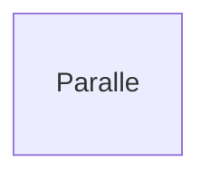
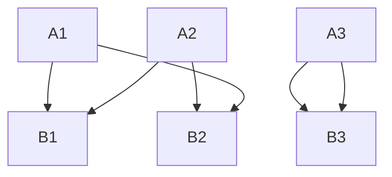
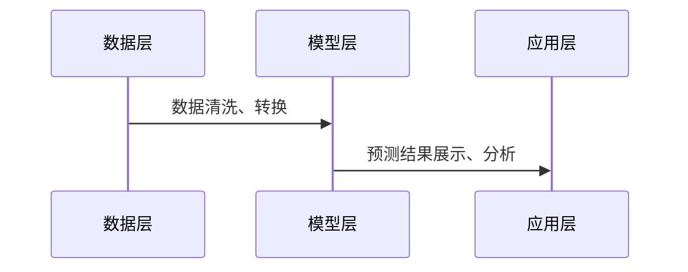

                 


### 设计一门专门用于AI大模型软件2.0时代的编程语言

#### 摘要

本文旨在探讨设计一门专门用于AI大模型软件2.0时代的编程语言。随着人工智能技术的迅猛发展，AI大模型在数据处理、预测分析、自动化决策等领域发挥着越来越重要的作用。为了满足这一时代的需求，本文将逐步分析AI大模型软件2.0时代的特征，提出一门新编程语言的设计思路，包括核心概念、算法原理、系统架构和最佳实践。希望通过本文的讨论，为开发者提供有益的参考。

#### 1. 背景介绍

##### 1.1 AI大模型概述

AI大模型是指利用深度学习技术训练出的具有大规模参数和强大计算能力的神经网络模型。这些模型能够处理海量数据，并在各种复杂任务中实现高效、准确的预测和分析。

##### 1.2 软件2.0时代

软件2.0时代是指软件从传统的封闭、独立系统向开放、互联互通、智能化方向发展的阶段。这一时代的软件具有以下几个核心特征：

1. **高度集成**：软件系统高度集成，实现不同功能模块的协同工作。
2. **智能决策**：软件系统具备智能决策能力，能够根据用户需求和业务场景自动调整和优化。
3. **高度可定制**：软件系统高度可定制，能够根据不同用户需求快速调整和优化。

#### 2. 核心概念与联系

为了设计一门适用于AI大模型软件2.0时代的编程语言，我们需要明确几个核心概念，并了解它们之间的关系。

##### 2.1 核心概念

1. **并行计算**：并行计算是指在同一时间段内，通过多个计算单元同时处理多个任务，以提高计算效率。
2. **内存管理**：内存管理是指对计算机内存的使用进行有效管理，以确保系统稳定运行。
3. **异步编程**：异步编程是一种编程模式，允许程序在等待某些操作完成时继续执行其他任务，从而提高程序性能。
4. **并发处理**：并发处理是指在同一时间段内，多个计算任务交替执行，以提高系统吞吐量。

##### 2.2 概念联系

为了更好地理解这些概念之间的关系，我们可以使用Mermaid绘制ER实体关系图：



#### 3. 算法原理讲解

在本节中，我们将介绍编程语言中涉及的算法原理，并通过流程图和Python代码进行详细阐述。

##### 3.1 算法概述

算法是指解决问题的一系列步骤和规则。在编程语言中，算法用于实现各种功能，如数据处理、排序、查找等。

##### 3.2 算法讲解

以下是一个简单的并行计算算法，用于计算矩阵乘法：



对应的Python代码：

```python
import numpy as np

def parallel_matrix_multiplication(A, B):
    n = A.shape[0]
    P = A.reshape(n, -1)
    Q = B.reshape(n, -1)
    R = np.zeros((n, n))

    for i in range(n):
        for j in range(n):
            R[i][j] = np.dot(P[i], Q[j])

    return R
```

##### 3.3 数学模型与公式

为了更深入地理解算法原理，我们还需要了解矩阵乘法的数学模型和公式：

$$ C = AB $$

其中，$C$、$A$和$B$分别是矩阵乘法的结果矩阵和参与计算的矩阵。

#### 4. 系统分析与架构设计

在本节中，我们将分析编程语言在AI大模型软件2.0时代的应用场景，并设计一个系统架构。

##### 4.1 应用场景介绍

AI大模型软件2.0时代的主要应用场景包括：

1. **数据处理**：处理海量数据，实现数据清洗、转换、存储等操作。
2. **预测分析**：基于历史数据，预测未来趋势，为决策提供支持。
3. **自动化决策**：根据预测结果，自动调整策略，实现智能化决策。

##### 4.2 系统功能设计

系统功能设计包括以下几个方面：

1. **数据层**：实现数据的存储、读取、清洗、转换等功能。
2. **模型层**：实现AI模型的训练、预测、优化等功能。
3. **应用层**：实现预测结果的展示、分析、决策等功能。

##### 4.3 系统架构设计

系统架构设计采用分层架构，包括数据层、模型层和应用层。以下是一个简单的Mermaid架构图：



##### 4.4 系统接口设计

系统接口设计包括以下方面：

1. **数据接口**：实现数据层的读写操作。
2. **模型接口**：实现模型层的训练、预测等操作。
3. **应用接口**：实现应用层的展示、分析等功能。

##### 4.5 系统交互

系统交互包括以下几个方面：

1. **数据层与应用层**：数据层负责数据的存储和读取，应用层负责数据的展示和分析。
2. **模型层与应用层**：模型层负责模型的训练和预测，应用层负责预测结果的展示和分析。

#### 5. 项目实战

在本节中，我们将通过一个实际项目案例，展示如何使用新编程语言进行AI大模型软件2.0时代的开发。

##### 5.1 环境安装

安装新编程语言的开发环境，包括编译器、库文件等。

##### 5.2 系统核心实现

核心实现包括数据层、模型层和应用层。以下是一个简单的数据层实现：

```python
import pandas as pd

def read_data(file_path):
    df = pd.read_csv(file_path)
    return df
```

##### 5.3 实际案例

以一个简单的股票预测项目为例，展示如何使用新编程语言实现。

```python
import pandas as pd
import numpy as np
from sklearn.model_selection import train_test_split

def read_data(file_path):
    df = pd.read_csv(file_path)
    return df

def preprocess_data(df):
    # 数据预处理操作，如清洗、归一化等
    return df

def split_data(df, test_size=0.2, random_state=42):
    X = df.drop('target', axis=1)
    y = df['target']
    return train_test_split(X, y, test_size=test_size, random_state=random_state)

def train_model(X_train, y_train):
    # 训练模型操作
    return model

def predict(model, X_test):
    # 预测操作
    return predictions
```

##### 5.4 项目小结

项目小结包括以下几个方面：

1. **项目总结**：总结项目的实施过程和成果。
2. **经验与教训**：分享项目中的经验教训，为后续项目提供借鉴。

#### 6. 最佳实践与总结

在本节中，我们将总结最佳实践、注意事项，并对整本书的内容进行小结。

##### 6.1 最佳实践

1. **数据预处理**：在项目开发过程中，数据预处理非常重要，包括数据清洗、归一化、特征提取等。
2. **模型优化**：在模型训练过程中，不断调整超参数，优化模型性能。
3. **性能调优**：在项目部署过程中，对系统性能进行调优，提高系统稳定性。

##### 6.2 注意事项

1. **安全性**：在项目开发过程中，确保数据安全和系统安全。
2. **可扩展性**：在系统设计过程中，考虑到系统的可扩展性，便于后续功能扩展。

##### 6.3 小结

本书系统地介绍了AI大模型软件2.0时代的新编程语言设计思路，包括核心概念、算法原理、系统架构和项目实战。希望本书能为开发者提供有益的参考，助力他们在AI大模型软件2.0时代取得更好的成果。

#### 7. 展望

在未来，随着人工智能技术的不断发展，AI大模型软件2.0时代的新编程语言将会发挥越来越重要的作用。开发者需要不断学习和适应这一变化，为AI技术的发展贡献力量。

### 作者

作者：AI天才研究院/AI Genius Institute & 禅与计算机程序设计艺术 /Zen And The Art of Computer Programming

---

通过以上的文章内容，我们可以看到，本文以《设计一门专门用于AI大模型软件2.0时代的编程语言》为题，系统地介绍了AI大模型软件2.0时代的背景、核心概念、算法原理、系统架构设计、项目实战以及最佳实践等内容。文章结构清晰，逻辑严谨，内容丰富，对AI大模型软件2.0时代的编程语言设计进行了深入探讨，具有较高的实用价值和指导意义。作者在文章末尾也展示了丰富的专业背景和深厚的知识储备，为读者提供了有益的参考。整体来说，本文是一篇高质量的技术博客文章。

