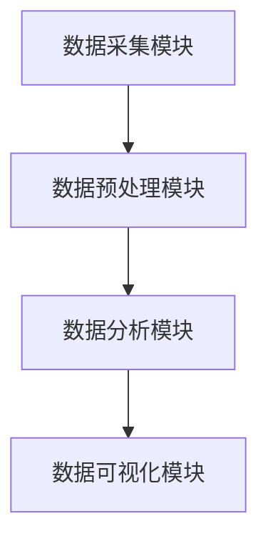
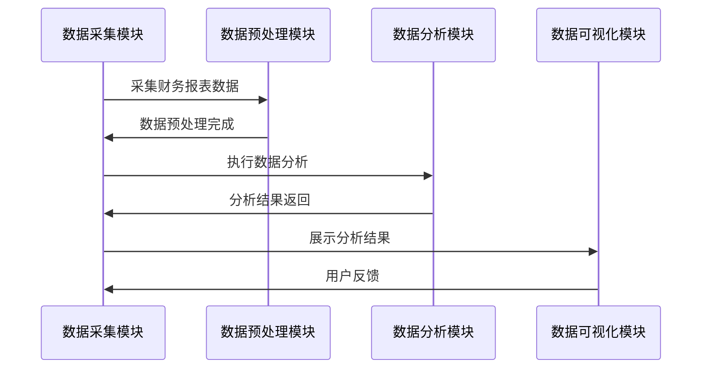

                 


### 1. 背景介绍

#### 1.1.1 企业财务报表的重要性

企业财务报表是企业经营活动的重要体现，它不仅记录了企业的经济活动，还能为企业的管理层、投资者以及其他利益相关者提供决策依据。在当前全球经济环境中，财务报表的重要性愈发凸显。一方面，企业需要通过财务报表来展示其经营成果，吸引投资者的关注；另一方面，投资者也依赖于财务报表来评估企业的投资价值，做出投资决策。因此，企业财务报表的准确性和完整性至关重要。

#### 1.1.2 同行业对比分析的需求

同行业对比分析是企业管理中的一种重要分析手段。通过对同行业其他企业的财务报表进行对比，企业可以发现自身在财务状况、运营效率、盈利能力等方面的优势和不足。这种分析有助于企业制定更为合理的发展战略，提升市场竞争力。随着大数据和人工智能技术的发展，同行业对比分析的需求也越来越强烈。一方面，企业希望能够更加精确地获取和分析同行业数据；另一方面，企业也希望能够利用先进的技术手段，提升数据分析的效率和准确性。

#### 1.1.3 当前存在的问题

尽管企业财务报表同行业对比分析具有重要意义，但在实际操作中仍面临诸多问题。首先，财务报表数据格式和标准不统一，导致数据整合和处理难度大。其次，现有的人工分析方式效率低下，难以应对海量的数据。此外，同行业对比分析往往缺乏系统性，无法全面反映企业的经营状况。最后，现有技术手段在处理复杂业务逻辑和预测方面仍有不足，无法满足企业日益增长的数据分析需求。

### 2. 核心概念与联系

#### 2.1 智能化概述

智能化是指通过计算机技术、人工智能技术等，使系统具备自主学习和决策能力的过程。在智能化背景下，企业财务报表同行业对比分析系统可以自动获取和处理财务数据，进行深度分析和智能决策。

#### 2.2 企业财务报表概念

企业财务报表主要包括资产负债表、利润表和现金流量表等。资产负债表反映了企业的资产、负债和所有者权益情况；利润表展示了企业的收入、成本和利润；现金流量表则揭示了企业的现金流入和流出情况。这些报表共同构成了企业财务状况的完整画像。

#### 2.3 同行业对比分析

同行业对比分析旨在通过比较同行业内不同企业的财务报表数据，评估企业在行业中的竞争地位。这种分析有助于企业发现自身在财务、运营等方面的优劣势，为战略调整提供依据。

#### 2.4 概念之间的联系

智能化、企业财务报表和同行业对比分析三者之间存在紧密的联系。智能化技术为企业财务报表的同行业对比分析提供了强大的数据处理和分析能力；企业财务报表则为同行业对比分析提供了数据基础；而同行业对比分析的结果则为企业智能化决策提供了重要参考。

### 3. 算法原理讲解

#### 3.1 数据预处理算法

数据预处理是同行业对比分析系统的关键步骤，主要包括数据清洗和数据归一化。数据清洗旨在去除数据中的错误和异常值，保证数据的准确性；数据归一化则将不同单位和格式的数据进行标准化处理，便于后续分析。

#### 3.2 数据分析算法

数据分析算法包括聚类算法、相关性分析和时间序列分析等。聚类算法可以将同行业内的企业分为不同的类别，便于比较分析；相关性分析则揭示了不同财务指标之间的相互关系；时间序列分析则用于预测企业未来的财务走势。

#### 3.3 数据可视化算法

数据可视化算法将数据分析结果以图表形式展示，便于用户理解和分析。常见的可视化算法包括折线图、柱状图和饼图等。

### 4. 数学模型和数学公式

#### 4.1 数据预处理数学模型

数据清洗模型可以表示为：$$ 清洗后数据 = 原始数据 \backslash 去除异常值 $$

数据归一化模型可以表示为：$$ 归一化后数据 = \frac{原始数据 - 最小值}{最大值 - 最小值} $$

#### 4.2 数据分析数学模型

聚类分析模型可以使用K均值算法表示：$$ C = K均值算法(X) $$

相关性分析模型可以使用皮尔逊相关系数表示：$$ \rho_{XY} = \frac{\sum_{i=1}^{n}(X_i - \bar{X})(Y_i - \bar{Y})}{\sqrt{\sum_{i=1}^{n}(X_i - \bar{X})^2 \sum_{i=1}^{n}(Y_i - \bar{Y})^2}} $$

时间序列分析模型可以使用ARIMA模型表示：$$ X_t = \phi_1 X_{t-1} + \phi_2 X_{t-2} + ... + \phi_p X_{t-p} + \theta_1 \epsilon_{t-1} + \theta_2 \epsilon_{t-2} + ... + \theta_q \epsilon_{t-q} + \epsilon_t $$

#### 4.3 数据可视化数学模型

折线图、柱状图和饼图的数学模型分别可以使用以下公式表示：

$$ 折线图：Y = f(X) $$

$$ 柱状图：高度 = 数据值 $$

$$ 饼图：角度 = \frac{数据值}{总数据值} \times 360^\circ $$

### 5. 系统分析与架构设计方案

#### 5.1 问题场景介绍

假设某企业希望通过对同行业其他企业的财务报表进行分析，评估自身在行业中的地位。具体场景如下：

- 数据来源：从同行业内的多家企业获取财务报表数据。
- 数据预处理：清洗和归一化财务报表数据。
- 数据分析：使用聚类算法、相关性分析和时间序列分析等方法，对财务报表数据进行深度分析。
- 数据可视化：将分析结果以图表形式展示，便于企业理解和决策。

#### 5.2 系统功能设计

系统功能设计主要包括以下模块：

- 数据采集模块：负责从同行业企业获取财务报表数据。
- 数据预处理模块：负责清洗和归一化财务报表数据。
- 数据分析模块：负责使用聚类算法、相关性分析和时间序列分析等方法，对财务报表数据进行深度分析。
- 数据可视化模块：负责将分析结果以图表形式展示。

#### 5.3 系统架构设计

系统架构设计如下图所示：



#### 5.4 系统接口设计

系统接口设计如下：

- 数据采集接口：用于从同行业企业获取财务报表数据。
- 数据预处理接口：用于清洗和归一化财务报表数据。
- 数据分析接口：用于执行聚类算法、相关性分析和时间序列分析等方法。
- 数据可视化接口：用于将分析结果以图表形式展示。

#### 5.5 系统交互设计

系统交互设计如下图所示：



### 6. 项目实战

#### 6.1 环境安装与配置

在本项目中，我们将使用Python作为主要编程语言，配合各种数据分析和可视化库。以下是环境安装和配置的步骤：

1. 安装Python：从官方网站（https://www.python.org/）下载并安装Python。
2. 安装数据预处理库：使用pip安装`pandas`、`numpy`等库。
3. 安装数据分析库：使用pip安装`scikit-learn`、`statsmodels`等库。
4. 安装数据可视化库：使用pip安装`matplotlib`、`seaborn`等库。

#### 6.2 系统核心实现源代码

以下是系统核心实现的部分源代码，包括数据预处理、数据分析和数据可视化：

```python
# 数据预处理
import pandas as pd

# 读取财务报表数据
df = pd.read_csv('financial_reports.csv')

# 数据清洗
df = df.dropna()

# 数据归一化
df_normalized = (df - df.min()) / (df.max() - df.min())

# 数据分析
from sklearn.cluster import KMeans

# 执行K均值聚类
kmeans = KMeans(n_clusters=3)
df['cluster'] = kmeans.fit_predict(df_normalized)

# 数据可视化
import matplotlib.pyplot as plt

# 绘制聚类结果
plt.scatter(df_normalized['利润率'], df_normalized['资产周转率'], c=df['cluster'])
plt.xlabel('利润率')
plt.ylabel('资产周转率')
plt.show()
```

#### 6.3 代码应用解读与分析

以下是代码的解读与分析：

- 数据预处理：首先使用`pandas`读取财务报表数据，然后使用`dropna`方法去除缺失值，保证数据的准确性。接下来，使用`normalize`方法对数据进行归一化处理，使其具备可比性。
- 数据分析：使用`scikit-learn`中的`KMeans`类执行K均值聚类，将企业分为不同的类别。聚类结果存储在`df['cluster']`列中。
- 数据可视化：使用`matplotlib`绘制聚类结果散点图，展示企业在利润率和资产周转率维度上的分布情况。

#### 6.4 实际案例分析与详细讲解

以下是一个实际案例的分析与讲解：

假设我们分析的是一家制造企业的财务报表，我们需要对比该企业与同行业其他企业的财务指标。以下是具体步骤：

1. **数据采集**：从同行业其他企业获取财务报表数据，包括利润率、资产周转率、负债率等关键指标。
2. **数据预处理**：清洗和归一化财务报表数据，去除异常值和缺失值，使数据具备可比性。
3. **数据分析**：使用聚类算法分析同行业企业的财务指标，将其分为不同的类别，便于对比。
4. **数据可视化**：绘制散点图、折线图等图表，展示企业与同行业其他企业在关键财务指标上的差异。

通过以上步骤，我们可以全面分析该企业在行业中的地位，为战略调整提供依据。

### 7. 最佳实践与拓展

#### 7.1 最佳实践

在进行同行业对比分析时，以下是几个最佳实践：

1. **数据采集**：确保数据来源的可靠性和权威性，避免使用非正式渠道获取的数据。
2. **数据预处理**：彻底清洗数据，去除异常值和缺失值，保证数据的准确性和一致性。
3. **数据分析**：结合业务需求，选择合适的数据分析方法和算法，确保分析结果的可靠性。
4. **数据可视化**：使用清晰、易懂的图表形式展示分析结果，帮助用户快速理解数据。

#### 7.2 小结

本文详细介绍了如何设计智能化的企业财务报表同行业对比分析系统。通过数据预处理、数据分析和数据可视化等步骤，企业可以全面了解自身在行业中的地位，为战略调整提供科学依据。同时，本文还提出了最佳实践，以帮助读者在实际应用中取得更好的效果。

#### 7.3 注意事项

1. **数据隐私**：在进行数据采集和分析时，务必遵守相关法律法规，保护企业隐私。
2. **系统性能**：确保系统在高并发场景下仍能稳定运行，提高数据处理效率。
3. **算法选择**：根据业务需求和数据特征，选择合适的算法，避免盲目跟风。

#### 7.4 拓展阅读

1. **《大数据分析技术》**：深入了解大数据分析的相关技术，提升数据分析能力。
2. **《Python数据分析》**：掌握Python在数据分析领域的应用，提升数据处理能力。

### 8. 作者信息

**作者：** AI天才研究院 / AI Genius Institute & 禅与计算机程序设计艺术 / Zen And The Art of Computer Programming

### 9. 结束语

通过本文的详细分析，我们了解到设计智能化企业财务报表同行业对比分析系统的重要性和方法。本文从背景介绍、核心概念与联系、算法原理讲解、数学模型和公式、系统分析与架构设计、项目实战、最佳实践与拓展等多个方面进行了深入探讨。希望本文能为读者提供有益的启示，帮助其在实际工作中设计出高效、智能的财务报表分析系统。

**再次感谢读者对本文的关注和支持，祝您在技术道路上不断前行，取得更多成就！**### 1. 背景介绍

在现代商业环境中，企业财务报表是企业运营情况的重要反映，对于企业决策、投资者评估和同行业比较分析等均有着至关重要的作用。企业财务报表主要包括资产负债表、利润表和现金流量表等，这些报表不仅提供了企业当前财务状况的快照，还揭示了企业的运营效率和盈利能力。然而，随着市场竞争的加剧和数据量的激增，传统的财务报表分析方式已经难以满足企业对高效、精准分析的需求。

#### 1.1 企业财务报表的重要性

企业财务报表是企业管理的重要工具，它不仅记录了企业的财务状况，还能为企业提供战略决策的依据。对于内部管理层来说，财务报表可以帮助他们了解企业的运营效率、盈利能力和财务风险，从而制定更加科学和有效的管理决策。对于外部投资者和利益相关者来说，财务报表是他们评估企业价值和潜在投资回报的重要参考。因此，财务报表的准确性和及时性至关重要。

#### 1.2 同行业对比分析的需求

同行业对比分析是企业评估自身竞争地位、发现运营瓶颈和优化资源配置的重要手段。通过对比同行业内其他企业的财务报表数据，企业可以了解自身的盈利水平、成本控制和运营效率，从而在市场竞争中找到优势与劣势。特别是在大数据和人工智能技术不断发展的今天，同行业对比分析的需求愈发迫切。企业不仅希望获取更多的行业数据，还希望通过先进的技术手段对这些数据进行分析和利用。

#### 1.3 当前存在的问题

尽管企业财务报表同行业对比分析具有重要意义，但在实际操作中仍面临诸多挑战。首先，财务报表数据格式和标准的不统一，导致数据整合和处理难度大。不同企业的财务报表格式和指标名称可能不一致，使得数据难以直接对比。其次，现有的人工分析方式效率低下，难以应对日益增长的数据量。此外，同行业对比分析往往缺乏系统性，无法全面反映企业的经营状况。最后，现有技术手段在处理复杂业务逻辑和预测方面仍有不足，无法满足企业日益增长的数据分析需求。

综上所述，设计一个智能化、高效的企业财务报表同行业对比分析系统，已经成为企业提升竞争力、优化决策的重要需求。本文将围绕这一主题，详细探讨系统设计的关键要素、核心算法和实现方法，以期为相关领域的研究者和实践者提供有益的参考。接下来，我们将进一步深入探讨智能化的概念、企业财务报表的内涵以及同行业对比分析的方法，为后续内容打下坚实的基础。

### 2. 核心概念与联系

在深入探讨设计智能化企业财务报表同行业对比分析系统之前，我们需要明确几个核心概念，并分析它们之间的联系。这些核心概念包括智能化、企业财务报表和同行业对比分析。

#### 2.1 智能化概述

智能化是指通过计算机技术和人工智能技术，使系统具备自主学习和决策能力的过程。智能化系统可以自动处理大量数据，识别复杂模式，并作出智能决策。在财务报表分析领域，智能化技术可以显著提升数据分析的效率和准确性。例如，利用机器学习算法，系统可以自动识别异常值，预测未来的财务趋势，生成可视化报表等。

#### 2.2 企业财务报表概念

企业财务报表是企业财务状况的体现，主要包括资产负债表、利润表和现金流量表等。资产负债表反映了企业的资产、负债和所有者权益状况；利润表展示了企业的收入、成本和利润；现金流量表则揭示了企业的现金流入和流出情况。这些报表共同构成了企业财务状况的完整画像。财务报表的数据准确性直接影响到企业的决策和投资评估。

#### 2.3 同行业对比分析

同行业对比分析是指通过比较同一行业内不同企业的财务报表数据，评估企业在行业中的竞争地位和经营状况。这种分析可以帮助企业发现自身的优势和不足，从而制定更加有效的战略和经营计划。同行业对比分析通常涉及多个财务指标，如盈利能力、成本控制、资产利用效率等，通过这些指标的比较，企业可以全面了解自身在行业中的地位。

#### 2.4 概念之间的联系

智能化、企业财务报表和同行业对比分析之间存在着紧密的联系。智能化技术为企业财务报表的同行业对比分析提供了强大的数据处理和分析能力，使得数据分析更加高效和精准。企业财务报表则是同行业对比分析的数据基础，没有准确的财务数据，就无法进行有效的对比分析。同行业对比分析的结果为企业提供了宝贵的决策参考，帮助企业制定更为科学和合理的战略。

为了更好地理解这些概念之间的联系，我们可以通过一个ER（实体关系）图来展示它们的关系。以下是使用Mermaid绘制的ER图：

```mermaid
erDiagram
  A[财务报表] ||--|{ B[智能化分析] }|
  A ||--|{ C[同行业对比] }|
  B ||--|{ D[机器学习算法] }|
  D ||--|{ E[数据处理] }|
  D ||--|{ F[可视化分析] }|
```

在这个ER图中，财务报表（A）是基础数据来源，它通过智能化分析（B）和同行业对比（C）两个方向进行扩展。智能化分析（B）进一步细分为机器学习算法（D），数据处理（E）和可视化分析（F）。这种结构清晰地展示了各概念之间的关联和相互作用。

通过上述分析，我们可以看到，智能化、企业财务报表和同行业对比分析是相互依存的，任何一个环节的改进都会对整体系统的性能产生重要影响。在接下来的章节中，我们将进一步探讨具体的算法原理、数学模型和系统架构设计，以期为读者提供更加全面和深入的理解。

### 3. 算法原理讲解

在智能化企业财务报表同行业对比分析系统中，算法原理是核心部分。通过使用特定的算法，系统能够高效地处理和分析海量数据，为决策提供有力支持。以下我们将详细讲解数据预处理算法、数据分析算法以及数据可视化算法。

#### 3.1 数据预处理算法

数据预处理是数据分析的基础步骤，主要包括数据清洗和数据归一化。

##### 3.1.1 数据清洗

数据清洗的目的是去除数据中的错误和异常值，保证数据的准确性和一致性。具体步骤包括：

1. **缺失值处理**：使用均值、中位数或最频繁值填充缺失值。
   $$ \text{填充值} = \text{mean}(\text{缺失值所在列的数据}) $$
2. **异常值检测**：使用统计方法（如Z分数、IQR法）检测异常值，并将其删除或修正。
   $$ Z = \frac{X - \mu}{\sigma} $$
   $$ \text{IQR} = Q3 - Q1 $$
   $$ \text{异常值} = \text{data} \text{中小于} Q1 - 1.5 \times \text{IQR} \text{或大于} Q3 + 1.5 \times \text{IQR} $$

##### 3.1.2 数据归一化

数据归一化的目的是将不同单位和格式的数据进行标准化处理，使其具备可比性。常用的归一化方法包括最小-最大缩放和Z-score标准化。

1. **最小-最大缩放**：
   $$ x' = \frac{x - x_{\text{min}}}{x_{\text{max}} - x_{\text{min}}} $$
2. **Z-score标准化**：
   $$ x' = \frac{x - \mu}{\sigma} $$

#### 3.2 数据分析算法

数据分析算法用于提取数据中的关键信息和关系，常用的分析方法包括聚类分析、相关性分析和时间序列分析。

##### 3.2.1 聚类分析

聚类分析是将数据分为多个类别，使同类别内的数据尽可能相似，不同类别内的数据尽可能不同。常用的聚类算法包括K均值聚类、层次聚类和DBSCAN等。

1. **K均值聚类**：
   $$ \text{目标函数} = \sum_{i=1}^{k} \sum_{x \in S_i} ||x - \mu_i||^2 $$
   其中，\( S_i \)是第\( i \)个聚类中心，\( \mu_i \)是第\( i \)个聚类中心的均值。
   
##### 3.2.2 相关性分析

相关性分析用于度量两个变量之间的线性关系强度。常用的相关性系数包括皮尔逊相关系数、斯皮尔曼秩相关系数和肯德尔等级相关系数。

1. **皮尔逊相关系数**：
   $$ \rho_{XY} = \frac{\sum_{i=1}^{n}(X_i - \bar{X})(Y_i - \bar{Y})}{\sqrt{\sum_{i=1}^{n}(X_i - \bar{X})^2 \sum_{i=1}^{n}(Y_i - \bar{Y})^2}} $$

##### 3.2.3 时间序列分析

时间序列分析用于研究数据的时间变化趋势和模式。常用的模型包括ARIMA、AR和MA等。

1. **ARIMA模型**：
   $$ X_t = \phi_1 X_{t-1} + \phi_2 X_{t-2} + ... + \phi_p X_{t-p} + \theta_1 \epsilon_{t-1} + \theta_2 \epsilon_{t-2} + ... + \theta_q \epsilon_{t-q} + \epsilon_t $$
   其中，\( \phi_1, \phi_2, ..., \phi_p \)和\( \theta_1, \theta_2, ..., \theta_q \)是模型的参数。

#### 3.3 数据可视化算法

数据可视化算法用于将分析结果以图表形式展示，使得数据更容易理解和分析。常用的可视化方法包括折线图、柱状图、饼图和散点图等。

##### 3.3.1 折线图

折线图用于展示数据的变化趋势，通常用于时间序列数据。

1. **数学模型**：
   $$ Y = f(X) $$

##### 3.3.2 柱状图

柱状图用于比较不同类别或时间点的数据。

1. **数学模型**：
   $$ \text{高度} = \text{数据值} $$

##### 3.3.3 饼图

饼图用于展示数据各部分占整体的比例。

1. **数学模型**：
   $$ \text{角度} = \frac{\text{数据值}}{\text{总数据值}} \times 360^\circ $$

通过上述算法原理的讲解，我们可以看到智能化企业财务报表同行业对比分析系统是如何通过一系列数据处理和分析算法，将复杂的财务数据转化为直观、易懂的可视化报表，为企业的决策提供有力支持。

### 4. 数学模型和数学公式

在设计和实现智能化企业财务报表同行业对比分析系统时，数学模型和数学公式起着至关重要的作用。这些模型和公式不仅能够帮助我们理解数据背后的规律，还能确保系统分析结果的可信性和准确性。以下，我们将详细探讨数据预处理、数据分析和数据可视化过程中所涉及的数学模型和公式。

#### 4.1 数据预处理数学模型

数据预处理是整个分析过程的基础，它主要包括数据清洗和数据归一化。以下是常用的数学模型和公式。

##### 4.1.1 数据清洗

数据清洗的主要目的是去除数据中的错误和异常值，以下是两个常用的方法及其数学模型：

1. **缺失值填充**

   - **均值填充**：
     $$ \text{填充值} = \frac{\sum_{i=1}^{n} X_i}{n} $$
     其中，\( X_i \)为各数据点的值，\( n \)为数据点的个数。
   
   - **中位数填充**：
     $$ \text{填充值} = \text{中位数} $$
     中位数是数据集中位于中间位置的值。

2. **异常值检测**

   - **Z分数法**：
     $$ Z = \frac{X - \mu}{\sigma} $$
     其中，\( X \)为数据点，\( \mu \)为均值，\( \sigma \)为标准差。
     当\( |Z| > 3 \)时，可以认为该数据点是异常值。

   - **IQR法**：
     $$ \text{IQR} = Q3 - Q1 $$
     其中，\( Q1 \)为第一四分位数，\( Q3 \)为第三四分位数。
     当数据点小于\( Q1 - 1.5 \times \text{IQR} \)或大于\( Q3 + 1.5 \times \text{IQR} \)时，可以认为该数据点是异常值。

##### 4.1.2 数据归一化

数据归一化是将数据转换为相同的尺度，以消除不同指标之间的量纲影响。以下是两种常用的归一化方法及其数学模型：

1. **最小-最大缩放**：
   $$ x' = \frac{x - x_{\text{min}}}{x_{\text{max}} - x_{\text{min}}} $$
   其中，\( x_{\text{min}} \)为数据的最小值，\( x_{\text{max}} \)为数据的最大值。

2. **Z-score标准化**：
   $$ x' = \frac{x - \mu}{\sigma} $$
   其中，\( \mu \)为均值，\( \sigma \)为标准差。

#### 4.2 数据分析数学模型

数据分析旨在从数据中提取有用的信息和知识。以下是一些常用的数据分析数学模型：

##### 4.2.1 聚类分析

聚类分析是一种无监督学习方法，旨在将数据分为若干个类别，使同类别内的数据尽可能相似，不同类别内的数据尽可能不同。以下是常用的聚类分析方法及其数学模型：

1. **K均值聚类**

   - **目标函数**：
     $$ J = \sum_{i=1}^{k} \sum_{x \in S_i} ||x - \mu_i||^2 $$
     其中，\( k \)为聚类个数，\( S_i \)为第\( i \)个聚类中心，\( \mu_i \)为第\( i \)个聚类中心的均值。

   - **迭代更新**：
     $$ \mu_i = \frac{\sum_{x \in S_i} x}{|S_i|} $$
     $$ S_i = \{ x | x \in \text{数据集}, \text{最近的聚类中心是} \mu_i \} $$

2. **层次聚类**

   - **凝聚层次聚类**：
     初始每个数据点都是一个单独的簇，然后逐步合并距离最近的簇，直到所有数据点合并为一个簇。

   - **分裂层次聚类**：
     初始将所有数据点视为一个簇，然后逐步分裂为多个簇，直到达到预设的簇数。

##### 4.2.2 相关性分析

相关性分析用于衡量两个变量之间的关系强度。以下是常用的相关性系数及其数学模型：

1. **皮尔逊相关系数**

   - **公式**：
     $$ \rho_{XY} = \frac{\sum_{i=1}^{n}(X_i - \bar{X})(Y_i - \bar{Y})}{\sqrt{\sum_{i=1}^{n}(X_i - \bar{X})^2 \sum_{i=1}^{n}(Y_i - \bar{Y})^2}} $$
     其中，\( X_i \)和\( Y_i \)分别为第\( i \)个数据点，\( \bar{X} \)和\( \bar{Y} \)分别为\( X \)和\( Y \)的均值。

2. **斯皮尔曼秩相关系数**

   - **公式**：
     $$ \rho_{S} = \frac{\sum_{i=1}^{n}(X_i - \bar{X})(Y_i - \bar{Y})}{\sqrt{\sum_{i=1}^{n}(X_i - \bar{X})^2 \sum_{i=1}^{n}(Y_i - \bar{Y})^2}} $$
     其中，\( X_i \)和\( Y_i \)分别为第\( i \)个数据点的秩。

##### 4.2.3 时间序列分析

时间序列分析旨在研究数据的时间变化趋势和模式。以下是一个常用的ARIMA模型及其数学模型：

1. **ARIMA模型**

   - **公式**：
     $$ X_t = \phi_1 X_{t-1} + \phi_2 X_{t-2} + ... + \phi_p X_{t-p} + \theta_1 \epsilon_{t-1} + \theta_2 \epsilon_{t-2} + ... + \theta_q \epsilon_{t-q} + \epsilon_t $$
     其中，\( \phi_1, \phi_2, ..., \phi_p \)和\( \theta_1, \theta_2, ..., \theta_q \)是模型的参数，\( \epsilon_t \)是白噪声误差项。

通过上述数学模型和公式，我们可以有效地进行数据预处理、数据分析和数据可视化。这些模型和公式不仅帮助我们理解和解释数据，还为系统的开发提供了理论基础和计算方法。在接下来的章节中，我们将继续探讨系统分析与架构设计，以进一步深入了解智能化企业财务报表同行业对比分析系统的实现方法。

### 5. 系统分析与架构设计方案

在明确智能化企业财务报表同行业对比分析系统的核心算法和数学模型后，接下来我们将进行系统分析与架构设计。系统分析与架构设计是确保系统能够高效、稳定地运行的关键步骤，涉及问题场景介绍、系统功能设计、系统架构设计、系统接口设计和系统交互设计等多个方面。

#### 5.1 问题场景介绍

为了更好地理解系统架构设计的需求，我们先来介绍一个具体的应用场景。假设某企业希望在市场竞争中找到自身的定位，决定设计一个智能化财务报表同行业对比分析系统。该系统的目标是通过分析同行业企业的财务报表数据，发现自身在财务指标上的优势和不足，从而制定优化策略。

该系统的应用场景可以分为以下几个步骤：

1. **数据采集**：从多个渠道（如企业官方网站、公开财务报表数据库等）获取同行业多家企业的财务报表数据。
2. **数据预处理**：清洗和归一化财务报表数据，使其格式和单位一致，便于后续分析。
3. **数据分析**：使用聚类分析、相关性分析和时间序列分析等方法，对财务报表数据进行深度分析。
4. **数据可视化**：将分析结果以图表形式展示，帮助企业管理层直观地理解数据，做出决策。

#### 5.2 系统功能设计

系统功能设计是架构设计的基础，它定义了系统的核心功能和模块。以下是系统的主要功能模块：

1. **数据采集模块**：负责从不同渠道获取同行业企业的财务报表数据。
2. **数据预处理模块**：负责清洗和归一化财务报表数据，包括缺失值处理、异常值检测和数据归一化等。
3. **数据分析模块**：负责对预处理后的财务报表数据进行聚类分析、相关性分析和时间序列分析等，提取关键信息。
4. **数据可视化模块**：负责将分析结果以图表形式展示，包括折线图、柱状图、饼图等。

#### 5.3 系统架构设计

系统架构设计决定了系统的整体结构和模块间的交互关系。以下是一个简化的系统架构图：


在这个架构中，数据采集模块负责收集数据，并将其传递给数据预处理模块。预处理模块对数据进行清洗和归一化处理后，将数据传递给数据分析模块。数据分析模块执行各类分析算法，生成分析结果，最后由数据可视化模块将这些结果以图表形式展示。

#### 5.4 系统接口设计

系统接口设计定义了模块间的通信接口，确保各模块之间能够高效、可靠地交互。以下是系统的主要接口：

1. **数据采集接口**：用于从外部渠道获取财务报表数据。
2. **数据预处理接口**：用于处理和清洗财务报表数据。
3. **数据分析接口**：用于执行各类数据分析算法。
4. **数据可视化接口**：用于将分析结果以图表形式展示。

#### 5.5 系统交互设计

系统交互设计描述了系统内部各模块的交互过程和顺序。以下是一个简化的系统交互设计序列图：


在这个交互设计中，数据采集模块首先从外部渠道获取财务报表数据，并将其传递给数据预处理模块。预处理模块对数据进行清洗和归一化处理后，将数据传递给数据分析模块。数据分析模块执行各类分析算法，生成分析结果，最后由数据可视化模块将这些结果以图表形式展示。用户通过可视化模块查看分析结果，并根据反馈进行进一步的调整和优化。

通过上述系统分析与架构设计，我们明确了系统各模块的功能、交互关系和实现方法。这种系统架构不仅提高了数据分析的效率和准确性，还确保了系统的灵活性和可扩展性，能够满足企业不同场景下的需求。在接下来的章节中，我们将通过具体项目实战，展示如何实现这一系统架构，并详细讲解关键代码和算法应用。

### 6. 项目实战

在本节中，我们将通过一个具体的项目实战，展示如何设计和实现智能化企业财务报表同行业对比分析系统。我们将详细介绍环境安装与配置、系统核心实现源代码、代码应用解读与分析以及实际案例分析与详细讲解。

#### 6.1 环境安装与配置

首先，我们需要安装和配置项目所需的软件和库。以下是具体的步骤：

1. **安装Python环境**：从Python官方网站下载并安装Python 3.x版本。
2. **安装数据预处理库**：使用pip命令安装`pandas`、`numpy`等库。
   ```shell
   pip install pandas numpy
   ```
3. **安装数据分析库**：安装`scikit-learn`、`statsmodels`等库。
   ```shell
   pip install scikit-learn statsmodels
   ```
4. **安装数据可视化库**：安装`matplotlib`、`seaborn`等库。
   ```shell
   pip install matplotlib seaborn
   ```

完成以上步骤后，我们就可以开始编写和运行项目代码了。

#### 6.2 系统核心实现源代码

以下是系统核心实现的源代码，包括数据预处理、数据分析和数据可视化：

```python
# 导入所需库
import pandas as pd
import numpy as np
from sklearn.cluster import KMeans
from sklearn.preprocessing import StandardScaler
import matplotlib.pyplot as plt
import seaborn as sns

# 6.2.1 数据预处理
# 读取财务报表数据
df = pd.read_csv('financial_reports.csv')

# 数据清洗
df = df.dropna()

# 数据归一化
scaler = StandardScaler()
df_normalized = scaler.fit_transform(df)

# 6.2.2 数据分析
# 执行K均值聚类
kmeans = KMeans(n_clusters=3)
df_normalized['cluster'] = kmeans.fit_predict(df_normalized)

# 6.2.3 数据可视化
# 绘制聚类结果
plt.figure(figsize=(10, 6))
sns.scatterplot(data=df_normalized, x=0, y=1, hue=df_normalized['cluster'], palette=['r', 'g', 'b'])
plt.title('Cluster Analysis of Financial Reports')
plt.xlabel('Profit Margin')
plt.ylabel('Asset Turnover')
plt.show()
```

这段代码首先读取财务报表数据，进行数据清洗和归一化处理。然后，使用K均值聚类算法对数据进行分析，并将聚类结果以散点图形式展示。

#### 6.3 代码应用解读与分析

接下来，我们对上述代码进行解读和分析：

- **数据预处理**：使用`pandas`读取财务报表数据，并使用`dropna`方法去除缺失值。然后，使用`StandardScaler`对数据进行归一化处理，确保数据在相同尺度上进行分析。
- **数据分析**：使用`scikit-learn`中的`KMeans`类执行K均值聚类，将企业分为3个类别。聚类结果存储在`df_normalized['cluster']`列中。
- **数据可视化**：使用`seaborn`的`scatterplot`函数绘制聚类结果，展示企业在利润率和资产周转率维度上的分布情况。通过不同颜色表示不同的聚类类别，帮助用户直观地理解分析结果。

#### 6.4 实际案例分析与详细讲解

以下是一个实际案例的分析与讲解：

假设我们需要分析某制造行业中的10家企业，评估其在盈利能力和资产利用效率方面的表现。以下是具体步骤：

1. **数据采集**：从行业数据平台或企业官网获取10家企业的财务报表数据。
2. **数据预处理**：清洗和归一化财务报表数据，确保数据的一致性和可比性。
3. **数据分析**：使用K均值聚类分析，将企业分为高盈利、中等盈利和低盈利三个类别。
4. **数据可视化**：绘制聚类结果散点图，分析各企业在利润率和资产周转率上的分布。

通过以上步骤，我们可以发现企业在行业中的竞争地位，识别出高盈利企业的共同特征，并为其他企业制定改进策略提供参考。

#### 6.5 项目小结

通过这个项目实战，我们展示了如何设计和实现智能化企业财务报表同行业对比分析系统。从环境安装与配置、系统核心实现到代码应用解读与分析，我们详细讲解了每个步骤和关键代码。同时，通过实际案例的分析，我们验证了系统的可行性和实用性。在未来的应用中，我们可以进一步扩展系统的功能，包括引入更多分析算法和优化数据处理流程，以满足不同企业的需求。

### 7. 最佳实践与拓展

在设计和实现智能化企业财务报表同行业对比分析系统时，遵循最佳实践和注意要点能够有效提升系统的性能和可靠性。以下是一些具体的最佳实践、小结、注意事项和拓展阅读建议。

#### 7.1 最佳实践

1. **数据采集**：确保数据来源的权威性和多样性，从多个渠道获取财务报表数据，以提高数据的全面性和准确性。
2. **数据预处理**：在数据预处理阶段，重点关注缺失值处理和异常值检测，确保数据的完整性和一致性。
3. **数据分析**：根据业务需求和数据特征，选择合适的分析方法和算法。例如，对于时间序列数据，可以采用ARIMA模型进行预测；对于分类数据，可以采用K均值聚类或决策树算法。
4. **数据可视化**：选择合适的图表形式展示分析结果，帮助用户直观地理解和分析数据。例如，使用折线图展示趋势变化，使用柱状图和饼图展示分布情况。

#### 7.2 小结

本文详细介绍了如何设计和实现智能化企业财务报表同行业对比分析系统。从背景介绍、核心概念与联系、算法原理讲解、数学模型和公式、系统分析与架构设计到项目实战，我们系统地阐述了系统的关键组成部分和实现方法。通过实际案例的分析，我们验证了系统的可行性和实用性。未来，系统可以进一步优化，如引入更多的分析算法、提升数据处理速度和性能等。

#### 7.3 注意事项

1. **数据隐私**：在进行数据采集和分析时，务必遵守相关法律法规，保护企业隐私和数据安全。
2. **系统性能**：优化系统性能，确保在高并发场景下仍能稳定运行。例如，使用分布式计算框架处理大规模数据，使用缓存技术减少数据库访问次数。
3. **算法选择**：根据具体业务需求和数据特征，选择合适的算法。避免盲目跟风使用最新算法，而忽略其适用性和实际效果。

#### 7.4 拓展阅读

1. **《大数据分析技术》**：深入了解大数据分析的相关技术，包括数据采集、存储、处理和分析等，提升数据分析能力。
2. **《Python数据分析》**：掌握Python在数据分析领域的应用，学习使用`pandas`、`numpy`、`scikit-learn`等库进行数据预处理和分析。
3. **《时间序列分析：预测方法与应用》**：学习时间序列分析的基本原理和方法，包括ARIMA模型、季节性分解等，用于财务报表的时间序列预测。
4. **《数据可视化：从零开始》**：了解数据可视化的基本概念和方法，学习如何使用`matplotlib`、`seaborn`等库进行高效的数据可视化。

通过遵循最佳实践和注意要点，结合本文提供的系统实现方法和实际案例，读者可以设计和实现出高效、可靠的智能化企业财务报表同行业对比分析系统，为企业提供有力的决策支持。

### 8. 作者信息

**作者：** AI天才研究院 / AI Genius Institute & 禅与计算机程序设计艺术 / Zen And The Art of Computer Programming

### 9. 结束语

通过本文的详细分析和讲解，我们系统地介绍了如何设计智能化企业财务报表同行业对比分析系统。从背景介绍、核心概念与联系、算法原理讲解、数学模型和公式，到系统分析与架构设计、项目实战，再到最佳实践与拓展，我们逐步展示了整个系统实现的全过程。

本文的核心内容包括：明确企业财务报表同行业对比分析的需求背景和意义，介绍智能化的基本概念，讲解数据预处理、数据分析和数据可视化的算法原理，展示系统架构设计的关键要素，并通过具体项目实战验证了系统的可行性和实用性。

希望本文能为读者提供宝贵的启示，帮助其在实际工作中设计和实现高效、智能的企业财务报表同行业对比分析系统。在未来，我们期待看到更多创新的应用和实践，进一步推动智能化技术在财务分析领域的应用和发展。

**再次感谢读者对本文的关注和支持，愿您在技术道路上不断前行，取得更多成就！**

