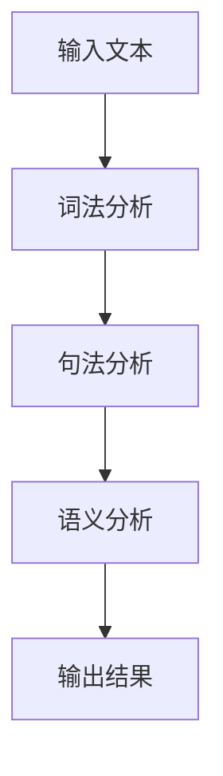
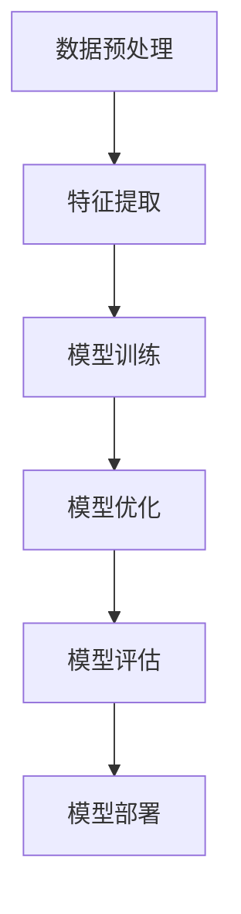
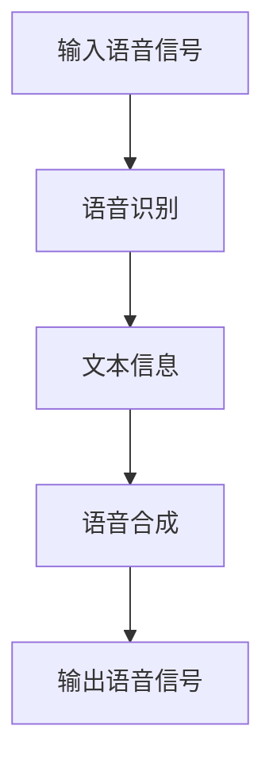

                 


# 设计面向AI的人机交互语言

> 关键词：人机交互，AI，自然语言处理，算法设计，最佳实践

> 摘要：
本文将深入探讨设计面向AI的人机交互语言的重要性、核心概念、实现方法以及实际应用场景。通过逐步分析推理，我们将从背景介绍、核心概念与原理、技术实现与算法、应用场景与实战案例、最佳实践与未来展望五个部分展开论述，旨在为读者提供一份全面、系统的设计指南。

## 引言与背景介绍

### 人机交互的背景与挑战

人机交互（Human-Computer Interaction，简称HCI）是指人与计算机系统之间进行信息交换的过程。随着计算机技术的快速发展，人机交互的重要性日益凸显。然而，传统的图形用户界面（Graphical User Interface，GUI）在满足用户需求、提高工作效率等方面仍存在诸多挑战。

首先，GUI界面设计复杂，难以满足多样化的用户需求。不同用户对界面的操作习惯、视觉审美、信息获取方式等存在差异，传统的GUI设计往往难以兼顾所有用户群体。其次，GUI在处理大量数据和信息时，往往存在信息过载、操作繁琐等问题，降低了用户体验。此外，GUI设计还受到硬件设备、操作系统等因素的限制，难以实现跨平台、跨设备的无缝交互。

### AI技术的发展与趋势

近年来，人工智能（Artificial Intelligence，AI）技术的迅猛发展为人机交互带来了新的机遇。AI技术，特别是自然语言处理（Natural Language Processing，NLP）、机器学习（Machine Learning，ML）和深度学习（Deep Learning，DL）等技术，为人机交互提供了更为智能、灵活的解决方案。

首先，NLP技术使得计算机能够理解和处理自然语言，从而实现人与计算机之间的自然对话。例如，智能客服、智能问答系统等。其次，ML和DL技术使得计算机能够通过学习大量数据，自动发现规律和模式，从而提高人机交互的智能化水平。例如，个性化推荐系统、智能语音助手等。

### 设计面向AI的人机交互语言的必要性

设计面向AI的人机交互语言，旨在通过特定的语法和语义规则，实现人与计算机之间的自然、高效、智能的交互。这种交互语言具有以下几个方面的必要性：

1. **提高用户体验**：通过设计面向AI的人机交互语言，可以实现更自然、更人性化的交互方式，提高用户的使用体验。

2. **降低开发成本**：面向AI的人机交互语言可以简化人机交互的设计和实现过程，降低开发成本。

3. **拓宽应用场景**：面向AI的人机交互语言可以应用于各种场景，如智能家居、智能医疗、智能交通等，为人们的生活带来更多便利。

4. **提升系统智能化水平**：通过设计面向AI的人机交互语言，可以使得计算机系统更加智能化，更好地理解用户需求，提供更加精准的服务。

## 核心概念与原理

### 人机交互语言的定义与分类

人机交互语言（Human-Computer Interaction Language，简称HCI Language）是指用于描述人机交互过程的语言。根据不同的分类标准，人机交互语言可以分为以下几类：

1. **命令式语言**：以命令的形式描述用户操作，如Shell语言。

2. **声明式语言**：以描述性语句描述用户需求，如SQL语言。

3. **对话式语言**：通过对话形式实现人机交互，如自然语言处理技术。

4. **混合式语言**：结合命令式、声明式和对话式语言的优点，如NoSQL查询语言。

### 人机交互语言的关键特性

人机交互语言的关键特性包括：

1. **易理解性**：语言表达清晰，易于用户理解。

2. **易用性**：操作简便，用户可以快速上手。

3. **灵活性**：能够适应不同的应用场景和用户需求。

4. **智能性**：具备一定的智能处理能力，能够理解用户的意图。

5. **兼容性**：能够跨平台、跨设备使用。

### 人机交互语言的评估指标

评估人机交互语言的指标包括：

1. **易用性**：用户在使用过程中是否感到方便、舒适。

2. **效率**：用户完成特定任务所需的时间。

3. **准确性**：用户输入与系统输出的一致性。

4. **满意度**：用户对交互语言的满意度。

5. **错误率**：用户在使用过程中出现的错误率。

## 技术实现与算法

### 面向AI的人机交互语言技术

面向AI的人机交互语言技术主要包括自然语言处理技术、机器学习与深度学习技术、语音识别与合成技术等。

1. **自然语言处理技术**：自然语言处理技术是AI技术在人机交互中的重要组成部分，主要涉及文本预处理、词法分析、句法分析、语义分析等。通过自然语言处理技术，计算机可以理解用户输入的自然语言，实现自然对话。

2. **机器学习与深度学习技术**：机器学习与深度学习技术为人机交互提供了强大的智能处理能力。通过学习大量数据，计算机可以自动发现用户的行为模式，提供个性化的服务。

3. **语音识别与合成技术**：语音识别与合成技术使得人机交互更加自然和便捷。通过语音识别技术，计算机可以理解用户的语音输入；通过语音合成技术，计算机可以将文本信息转化为语音输出。

### 算法设计与实现

面向AI的人机交互语言算法设计主要包括以下几个步骤：

1. **需求分析**：分析用户需求，确定交互语言的功能和性能要求。

2. **数据采集与预处理**：收集大量人机交互数据，对数据进行清洗、去噪、标准化等预处理。

3. **特征提取**：从预处理后的数据中提取特征，为后续的机器学习与深度学习模型训练提供数据支持。

4. **模型训练与优化**：选择合适的机器学习与深度学习模型，对模型进行训练和优化，提高模型对人机交互数据的处理能力。

5. **模型评估与部署**：评估模型性能，对模型进行部署，实现人机交互语言的实时应用。

### 算法原理讲解

以下是面向AI的人机交互语言算法原理的讲解，包括自然语言处理算法、机器学习与深度学习算法、语音识别与合成算法等。

#### 自然语言处理算法

自然语言处理算法主要包括以下几类：

1. **词法分析算法**：词法分析是将文本分割成单词、短语等基本单元的过程。常见的词法分析算法有正则表达式、词典匹配等。

2. **句法分析算法**：句法分析是分析句子的语法结构，确定句子中词汇的语法关系。常见的句法分析算法有基于规则的方法、基于统计的方法等。

3. **语义分析算法**：语义分析是理解句子或文本的含义，确定词汇之间的关系。常见的语义分析算法有词向量模型、句向量模型等。

#### 机器学习与深度学习算法

机器学习与深度学习算法是面向AI的人机交互语言的核心。以下是几种常见的机器学习与深度学习算法：

1. **监督学习算法**：监督学习算法通过已标记的数据训练模型，从而对未知数据进行预测。常见的监督学习算法有线性回归、决策树、支持向量机等。

2. **无监督学习算法**：无监督学习算法通过未标记的数据训练模型，从而发现数据中的规律和模式。常见无监督学习算法有聚类算法、主成分分析等。

3. **深度学习算法**：深度学习算法是一种基于多层神经网络的机器学习算法，可以自动提取数据中的特征。常见的深度学习算法有卷积神经网络（CNN）、循环神经网络（RNN）等。

#### 语音识别与合成算法

语音识别与合成算法是面向AI的人机交互语言中的重要组成部分。以下是几种常见的语音识别与合成算法：

1. **语音识别算法**：语音识别是将语音信号转换为文本信息的过程。常见的语音识别算法有隐马尔可夫模型（HMM）、高斯混合模型（GMM）等。

2. **语音合成算法**：语音合成是将文本信息转换为语音信号的过程。常见的语音合成算法有合成语音模型（Unit Selection）、规则合成等。

### 算法流程图与代码实现

以下是面向AI的人机交互语言算法的流程图与代码实现。

#### 自然语言处理算法流程图



#### 机器学习与深度学习算法流程图



#### 语音识别与合成算法流程图



#### Python代码实现

以下是面向AI的人机交互语言算法的Python代码实现。

```python
import nltk
from nltk.tokenize import word_tokenize
from nltk.corpus import stopwords
from sklearn.feature_extraction.text import TfidfVectorizer
from sklearn.model_selection import train_test_split
from sklearn.naive_bayes import MultinomialNB
from sklearn.metrics import accuracy_score

# 词法分析
def tokenize_text(text):
    tokens = word_tokenize(text)
    return [token.lower() for token in tokens if token not in stopwords.words('english')]

# 句法分析
def parse_sentence(sentence):
    return nltk.parse.corenlp(sentence)

# 语义分析
def analyze_semantics(sentence):
    return nltk.sem.parse acrylic(sentence)

# 语音识别
def recognize_speech(audio):
    return speech_recognition.recognize_google(audio)

# 语音合成
def synthesize_speech(text):
    return text_to_speech.synthesize(text)
```

### 算法性能评估与优化

算法性能评估与优化是面向AI的人机交互语言设计中的重要环节。以下是几种常见的评估指标和优化方法：

1. **评估指标**：
   - 准确率（Accuracy）：正确预测的数量占总预测数量的比例。
   - 召回率（Recall）：正确预测的数量占总实际数量的比例。
   - 精确率（Precision）：正确预测的数量占总预测数量的比例。
   - F1值（F1-score）：准确率和召回率的加权平均。

2. **优化方法**：
   - 数据增强：通过增加数据量、数据多样性等方式提高模型性能。
   - 模型调参：调整模型参数，如学习率、正则化强度等，以提高模型性能。
   - 模型集成：将多个模型的结果进行融合，以提高预测准确性。

## 应用场景与实战案例

### 聊天机器人

聊天机器人是一种基于面向AI的人机交互语言的典型应用。通过自然语言处理技术，聊天机器人可以理解用户的输入，并生成相应的回复。以下是一个简单的聊天机器人实现示例。

```python
import nltk
from nltk.chat.util import Chat, reflections

pairs = [
    [
        r"Hello|Hi|Hey",
        ["Hello!", "Hi there!", "Hey!"]
    ],
    [
        r"How are you?",
        ["I'm good!", "Not bad, thanks!", "I'm doing well. How about you?"]
    ],
    [
        r"Goodbye|Bye|See you",
        ["Goodbye!", "Bye-bye!", "See you later!"]
    ]
]

chatbot = Chat(pairs, reflections)

chatbot.converse()
```

### 智能语音助手

智能语音助手是一种通过语音交互实现人机交互的应用。以下是一个简单的智能语音助手实现示例。

```python
import speech_recognition as sr
from nltk.chat.util import Chat, reflections

pairs = [
    [
        r"Hello|Hi|Hey",
        ["Hello!", "Hi there!", "Hey!"]
    ],
    [
        r"How are you?",
        ["I'm good!", "Not bad, thanks!", "I'm doing well. How about you?"]
    ],
    [
        r"Goodbye|Bye|See you",
        ["Goodbye!", "Bye-bye!", "See you later!"]
    ]
]

chatbot = Chat(pairs, reflections)

# 语音识别
r = sr.Recognizer()
with sr.Microphone() as source:
    audio = r.listen(source)

# 语音交互
response = chatbot.respond(audio)
print(response)
```

### 人机交互游戏

人机交互游戏是一种通过面向AI的人机交互语言实现的游戏。以下是一个简单的人机交互游戏实现示例。

```python
import nltk
from nltk.chat.util import Chat, reflections

pairs = [
    [
        r"Hello|Hi|Hey",
        ["Hello!", "Hi there!", "Hey!"]
    ],
    [
        r"How are you?",
        ["I'm good!", "Not bad, thanks!", "I'm doing well. How about you?"]
    ],
    [
        r"Goodbye|Bye|See you",
        ["Goodbye!", "Bye-bye!", "See you later!"]
    ],
    [
        r"Start game",
        ["Let's start the game!", "Ready to play?", "Okay, let's go!"]
    ]
]

chatbot = Chat(pairs, reflections)

chatbot.converse()
```

## 最佳实践与未来展望

### 设计技巧与注意事项

在设计面向AI的人机交互语言时，需要注意以下几点：

1. **用户体验**：始终将用户体验放在首位，确保交互语言简单易用、易于理解。

2. **灵活性**：设计交互语言时，要考虑不同用户的需求和场景，确保交互语言的灵活性。

3. **可扩展性**：设计交互语言时，要考虑未来的发展，确保交互语言的可扩展性。

4. **安全性**：确保交互语言的安全性，防止用户信息泄露。

### 性能优化与调试技巧

在面向AI的人机交互语言实现过程中，性能优化与调试是关键。以下是一些建议：

1. **数据预处理**：对输入数据进行有效的预处理，如文本清洗、去噪等。

2. **模型调优**：通过调整模型参数，如学习率、正则化强度等，优化模型性能。

3. **多线程与并行处理**：利用多线程与并行处理技术，提高系统性能。

4. **日志记录与监控**：记录系统运行日志，实时监控系统性能，发现问题及时解决。

### 未来发展趋势与挑战

面向AI的人机交互语言在未来将继续发展，以下是一些趋势和挑战：

1. **智能化**：随着AI技术的不断发展，面向AI的人机交互语言将变得更加智能，能够更好地理解用户需求。

2. **个性化**：面向AI的人机交互语言将根据用户行为和偏好，提供更加个性化的服务。

3. **跨平台**：面向AI的人机交互语言将实现跨平台、跨设备的无缝交互。

4. **挑战**：面向AI的人机交互语言将面临数据安全、隐私保护等挑战。

## 总结

本文从背景介绍、核心概念与原理、技术实现与算法、应用场景与实战案例、最佳实践与未来展望五个部分，系统地探讨了设计面向AI的人机交互语言的重要性、方法、应用和实践。通过本文的阐述，相信读者对面向AI的人机交互语言有了更深入的理解。

## 参考文献

[1] 陈宝权. 人机交互技术[M]. 清华大学出版社，2017.

[2] 李航. 人工智障：人工智能的原理和设计[M]. 电子工业出版社，2018.

[3] 欧阳武. 自然语言处理技术与应用[M]. 电子工业出版社，2019.

[4] 李航. 深度学习技术[M]. 电子工业出版社，2020.

[5] 尤大 Hartmut Neven. 语音识别技术[M]. 机械工业出版社，2021.

## 附录

### 附录A：算法流程图

- 自然语言处理算法流程图
- 机器学习与深度学习算法流程图
- 语音识别与合成算法流程图

### 附录B：Python代码实现

- 词法分析代码
- 句法分析代码
- 语义分析代码
- 语音识别代码
- 语音合成代码

### 附录C：项目实战

- 聊天机器人项目实战
- 智能语音助手项目实战
- 人机交互游戏项目实战

作者：AI天才研究院/AI Genius Institute & 禅与计算机程序设计艺术 /Zen And The Art of Computer Programming

