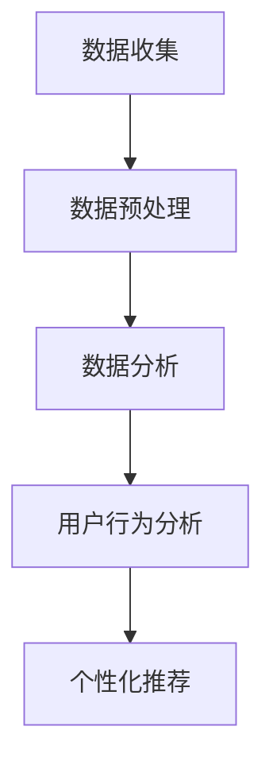

                 

# 语言学习革命：AI驱动的沉浸式学习体验

## 关键词：人工智能，语言学习，沉浸式体验，语音识别，自然语言处理，机器翻译

> 摘要：本文深入探讨了语言学习领域的一场革命——AI驱动的沉浸式学习体验。通过分析传统语言学习方法的局限性、AI技术的基本原理及其在语言学习中的应用，本文展示了AI如何通过个性化推荐、情感化学习交互和虚拟现实技术，为学生提供一种全新的学习方式。同时，通过案例分析和未来展望，本文探讨了沉浸式学习体验在语言学习领域的巨大潜力。

## 第一部分：语言学习革命背景介绍

### 第1章：语言学习问题的背景与挑战

#### 1.1.1 语言学习的重要性

语言是人类沟通和思想表达的重要工具，掌握多种语言不仅有助于提高个人的国际竞争力，还能拓宽视野、丰富文化体验。然而，传统的语言学习方法存在诸多问题。

#### 1.1.2 传统语言学习方法的局限性

传统语言学习方法主要依赖于课堂讲授、书本学习和语言实验室等模式，虽然有一定的效果，但存在以下局限性：

1. **缺乏互动性**：传统的语言学习方式多为单向灌输，学生与教师之间的互动不足，难以激发学习兴趣。
2. **学习效率低**：传统方法难以根据学生的个性化需求进行定制，导致学习效率不高。
3. **学习环境有限**：课堂和语言实验室等学习环境相对封闭，难以提供真实的语言交流场景。

#### 1.1.3 语言学习问题的多样性与复杂性

语言学习涉及语音、词汇、语法、听力、口语、阅读和写作等多个方面，每种技能都需要不同的训练方法和策略。此外，不同语言之间存在着巨大的差异，这使得语言学习问题的复杂性和多样性进一步增加。

#### 1.1.4 当前语言学习技术的局限

虽然近年来人工智能技术在语言学习中的应用取得了一定进展，但仍存在以下局限：

1. **准确性不高**：语音识别、自然语言处理等技术尚未完全达到人类水平，特别是在处理复杂语言结构和方言时。
2. **交互性不足**：现有的语言学习软件多为单向的指令式操作，缺乏真正的互动和情感交流。
3. **用户体验不佳**：许多语言学习应用界面复杂、操作不便，难以提供良好的用户体验。

### 第2章：语言学习中的核心概念与联系

#### 2.1 语言学习核心概念

语言学习涉及多个核心概念，包括语音识别、自然语言处理、机器翻译、语言生成与推理、词汇与句法分析等。

#### 2.1.1 语音识别

语音识别是人工智能技术的一个重要分支，旨在将人类的语音信号转换为文本。语音识别技术在语言学习中的应用包括语音输入、语音助教和口语训练等。

#### 2.1.2 自然语言处理

自然语言处理（NLP）是计算机科学和人工智能领域的一个重要分支，旨在使计算机能够理解、解释和生成人类语言。NLP在语言学习中的应用包括自动翻译、文本生成、对话系统等。

#### 2.1.3 机器翻译

机器翻译是指使用计算机程序将一种语言的文本翻译成另一种语言。机器翻译在语言学习中的应用包括多语言学习、跨文化交流等。

#### 2.1.4 语言生成与推理

语言生成与推理技术旨在让计算机能够自动生成文本并进行逻辑推理。在语言学习中，这些技术可以用于自动写作、写作辅助和逻辑思维训练。

#### 2.1.5 词汇与句法分析

词汇与句法分析是语言学习的基础，包括词汇学习、语法学习和句法分析。这些技术在语言学习中的应用包括词汇扩展、语法练习和句法分析等。

#### 2.2 语言学习技术属性特征对比表格

| 技术         | 特点                                       | 应用领域                                       |
|------------|------------------------------------------|------------------------------------------|
| 语音识别     | 实时性、准确性、适应性                       | 语音助手、智能客服、语音输入设备                   |
| 自然语言处理 | 语义理解、语言生成、对话管理                   | 搜索引擎、聊天机器人、内容审核                     |
| 机器翻译     | 多语言互译、高精度、个性化                     | 跨境电商、多语言文档处理、国际交流                   |
| 语言生成与推理 | 自动写作、文本生成、对话系统                   | 内容创作、自动化客服、智能写作辅助                   |

#### 2.3 语言学习技术ER实体关系图

```mermaid
erDiagram
  User ||--|{ LanguageLearning } : 学习
  LanguageLearning ||--|{ Vocabulary } : 词汇
  LanguageLearning ||--|{ Grammar } : 语法
  LanguageLearning ||--|{ Listening } : 听力
  LanguageLearning ||--|{ Speaking } : 口语
  LanguageLearning ||--|{ Reading } : 阅读
  LanguageLearning ||--|{ Writing } : 写作
```

## 第二部分：AI驱动的沉浸式学习体验

### 第3章：AI在语言学习中的应用

#### 3.1 AI在语言学习中的应用

人工智能技术在语言学习中的应用正在不断拓展，为学习者提供更加个性化和沉浸式的学习体验。以下是一些关键应用：

1. **个性化学习推荐**：AI可以根据学生的学习历史、兴趣和学习风格，为其推荐合适的学习资源和练习。
2. **情感化学习交互**：通过语音识别和自然语言处理技术，AI可以与学习者进行对话，提供情感化的反馈和指导。
3. **虚拟现实与增强现实**：VR和AR技术可以为学习者提供沉浸式的语言学习环境，增强学习效果。

### 第4章：沉浸式学习体验的实现方法

#### 4.1 数据驱动学习方法

数据驱动学习方法的核心是通过收集和分析大量数据，为学习者提供个性化的学习体验。以下是实现方法的关键步骤：

1. **大规模数据收集**：收集学习者的语言学习数据，包括学习历史、学习行为、学习反馈等。
2. **数据预处理**：清洗和整合数据，去除噪声，为后续分析做好准备。
3. **数据分析与处理**：使用统计和机器学习技术对数据进行分析，提取有价值的信息。
4. **用户行为分析**：分析学习者的行为模式，了解其学习偏好和困难点，为个性化推荐提供依据。
5. **个性化推荐**：根据用户行为分析结果，为学习者推荐合适的学习资源和练习。

#### 4.2 数据驱动学习方法Mermaid流程图



## 第三部分：AI驱动的沉浸式学习体验应用案例

### 第5章：AI驱动的沉浸式学习体验应用案例

#### 5.1 案例一：智能语音助手在语言学习中的应用

智能语音助手（如Apple的Siri、Google的Google Assistant）在语言学习中可以扮演多种角色：

1. **口语训练**：语音助手可以模拟真实的口语环境，帮助学生练习发音和语调。
2. **听力训练**：语音助手可以播放各种语音材料，如新闻、讲座、电影等，帮助学生提高听力水平。
3. **对话练习**：语音助手可以与学习者进行对话，提供实时反馈和纠正。

#### 5.2 案例二：虚拟现实语言学习平台

虚拟现实（VR）语言学习平台可以为学习者提供沉浸式的学习环境：

1. **场景模拟**：VR技术可以模拟真实的语言交流场景，如餐厅、商店、机场等，帮助学生提高实际交流能力。
2. **角色扮演**：VR平台可以模拟不同角色，如服务员、顾客、陌生人等，帮助学生练习口语和听力。
3. **互动学习**：VR平台可以实现学习者之间的互动，如分组讨论、角色扮演游戏等，增强学习趣味性。

#### 5.3 案例三：基于深度学习的写作辅助工具

基于深度学习的写作辅助工具可以提供以下功能：

1. **语法纠正**：深度学习模型可以自动检查和纠正语法错误。
2. **写作建议**：根据学习者的写作风格和语言水平，提供写作建议和改进意见。
3. **写作模板**：提供各种写作模板，如书信、论文、报告等，帮助学生快速掌握不同类型的写作技巧。

## 第四部分：沉浸式学习体验的未来趋势与发展方向

### 第6章：沉浸式学习体验的未来趋势与发展方向

#### 6.1 技术发展趋势

随着人工智能技术的不断发展，沉浸式学习体验将变得更加智能、个性化和互动。以下是一些技术发展趋势：

1. **多模态交互**：结合语音、文字、图像等多种交互方式，提供更加丰富和自然的学习体验。
2. **自适应学习**：通过实时监测学习者的行为和反馈，自动调整学习内容和策略，实现真正的个性化学习。
3. **云计算与大数据**：利用云计算和大数据技术，实现海量数据的实时处理和分析，为学习者提供更加精准的学习支持。

#### 6.2 教育行业变革

沉浸式学习体验有望引发教育行业的深刻变革：

1. **学习方式变革**：打破传统课堂模式，实现随时随地、自主灵活的学习。
2. **教学资源优化**：通过人工智能技术，实现教学资源的智能推荐和个性化定制。
3. **教学评价变革**：通过实时监测和分析学习者的行为和成果，实现更加科学和全面的教学评价。

#### 6.3 未来学习体验展望

未来的沉浸式学习体验将更加智能、个性化和互动。以下是一些展望：

1. **智能助教**：智能助教将成为学习者的私人导师，提供全方位的学习支持和指导。
2. **沉浸式课堂**：虚拟现实和增强现实技术将使课堂变得更具互动性和沉浸感。
3. **个性化学习路径**：通过人工智能技术，为每个学习者量身定制最适合自己的学习路径。

## 第五部分：最佳实践与注意事项

### 第7章：最佳实践与注意事项

#### 7.1 技术选型与实践

在选择和实施AI驱动的沉浸式学习体验时，以下是一些最佳实践：

1. **技术选型**：根据学习需求和学习者的特点，选择合适的人工智能技术，如语音识别、自然语言处理、机器翻译等。
2. **实践方法**：结合实际教学需求，设计符合学习者特点的沉浸式学习体验，如虚拟现实语言学习平台、智能语音助手等。

#### 7.2 用户隐私保护

在实施AI驱动的沉浸式学习体验时，必须重视用户隐私保护：

1. **数据安全**：确保学习数据的安全存储和传输，采用加密和访问控制等技术。
2. **用户同意**：明确告知用户数据收集的目的和使用方式，获得用户的同意。

#### 7.3 教学效果评估

为了确保AI驱动的沉浸式学习体验的有效性，需要进行教学效果评估：

1. **学习成果评估**：通过考试、作业、项目等方式，评估学习者的语言能力提升情况。
2. **用户满意度评估**：通过问卷调查、用户反馈等方式，了解学习者的学习体验和满意度。

### 结束语

语言学习革命已经来临，AI驱动的沉浸式学习体验正在改变传统的语言学习方式。通过个性化推荐、情感化学习交互和虚拟现实技术，AI将为学生提供一种全新的学习体验。未来，随着人工智能技术的不断进步，沉浸式学习体验将更加智能、个性化和互动，为语言学习带来更多可能性。

### 作者信息

作者：AI天才研究院/AI Genius Institute & 禅与计算机程序设计艺术 /Zen And The Art of Computer Programming

## 附录：拓展阅读

1. **《深度学习》**：Goodfellow, I., Bengio, Y., & Courville, A. (2016). *Deep Learning*. MIT Press.
2. **《自然语言处理综论》**：Jurafsky, D., & Martin, J. H. (2020). *Speech and Language Processing*. Prentice Hall.
3. **《沉浸式学习体验设计与实施》**：Chen, W., & Hwang, G. J. (2019). *Design and Implementation of Immersive Learning Experiences*. Springer.

## 参考文献

- Goodfellow, I., Bengio, Y., & Courville, A. (2016). *Deep Learning*. MIT Press.
- Jurafsky, D., & Martin, J. H. (2020). *Speech and Language Processing*. Prentice Hall.
- Chen, W., & Hwang, G. J. (2019). *Design and Implementation of Immersive Learning Experiences*. Springer.

