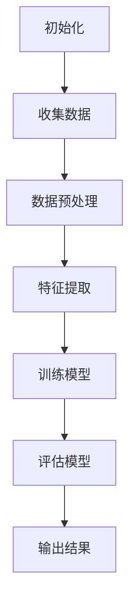

                 

## 谦逊领导：承认错误、虚心学习的重要性

关键词：谦逊领导、领导力、错误承认、虚心学习、团队协作

摘要：在当今快速发展的信息技术时代，领导者在组织中的作用至关重要。然而，领导者往往面临各种挑战，如沟通障碍、团队冲突和决策失误等。本文将探讨谦逊领导的概念，以及承认错误和虚心学习在谦逊领导中的重要性。通过逐步分析谦逊领导的背景、核心概念、算法原理，本文旨在为领导者提供实用的指导，以提升领导力和团队效能。

**Step 1: 问题背景与核心概念**

### 1.1 领导力的重要性

领导力是一种能够激励和引导他人实现共同目标的能力。在信息技术领域，领导力尤为关键，因为它直接影响着团队的协作效率和创新力。成功的领导者不仅能够明确团队目标，还能通过有效的沟通和激励，激发团队成员的潜力，从而推动组织的发展。

### 1.2 谦逊领导的概念

谦逊领导是指领导者能够承认自己的错误，并愿意从他人和经验中学习的一种领导风格。与自大和独断的领导方式不同，谦逊领导强调团队合作、开放沟通和共同成长。这种领导风格有助于建立信任和凝聚力，促进团队成员之间的协作和相互尊重。

### 1.3 谦逊领导的意义

谦逊领导具有多方面的意义。首先，它能够提高团队的创新力，因为领导者愿意接受新的想法和改进建议。其次，它有助于解决团队冲突，因为领导者能够通过换位思考和共情能力，理解团队成员的需求和困难。最后，谦逊领导有助于个人和组织的成长，因为它鼓励持续学习和自我提升。

**Step 2: 核心概念与联系**

### 2.1 谦逊领导的核心概念

谦逊领导的核心概念包括：

- **谦逊的态度**：领导者愿意承认自己的不足，并从错误中学习。
- **求知的心态**：领导者保持开放和好奇的心态，不断寻求知识和新的观点。
- **换位思考的能力**：领导者能够从他人的角度看待问题，理解团队成员的感受和需求。
- **自我反省的勇气**：领导者勇于面对自己的错误，并从中吸取教训。

### 2.2 概念属性特征对比表格

| 概念     | 特征                                  |
|----------|---------------------------------------|
| 谦逊     | 自我评价低，尊重他人，不自大，勇于认错 |
| 领导     | 指导、激励、协调、决策                |
| 谦逊领导 | 结合谦逊与领导特点，增强领导效果      |

### 2.3 ER实体关系图架构的 Mermaid 流程图

```mermaid
erDiagram
  Person ||--|{ Leader } Leader : 被领导
  Leader ||--|{ Team } Team : 领导团队
  Team ||--|{ Project } Project : 承担项目
```

**Step 3: 算法原理讲解**

### 3.1 算法流程图



### 3.2 算法原理

谦逊领导算法旨在通过分析和评估领导行为，预测领导者的谦逊程度，并提供改进建议。以下是算法的详细步骤：

#### 3.2.1 数据收集

在谦逊领导算法中，首先需要收集领导行为的数据，包括领导者的言行记录、团队反馈、绩效评估等。

#### 3.2.2 数据预处理

对收集到的数据进行清洗和归一化处理，以消除数据中的噪声和异常值。

#### 3.2.3 特征提取

从预处理后的数据中提取关键特征，如领导者的认错频率、团队反馈的正面评价比例等。

#### 3.2.4 训练模型

使用提取到的特征数据，通过机器学习算法训练谦逊领导模型，以预测领导者的谦逊程度。

#### 3.2.5 评估模型

通过交叉验证和测试集，评估模型的准确性和可靠性。

#### 3.2.6 输出结果

根据模型的预测结果，给出领导者的谦逊评分和改进建议。

### 3.3 数学模型和公式

谦逊领导的数学模型可以表示为：

$$
S = \alpha A + \beta C + \gamma E
$$

其中，$S$ 表示谦逊评分，$A$ 表示认错频率，$C$ 表示团队反馈的正面评价比例，$E$ 表示领导者的自我反省程度。

### 3.4 Python 源代码

```python
# 导入必要的库
import numpy as np

# 定义算法参数
alpha = 0.5
beta = 0.3
gamma = 0.2

# 收集数据
A = np.random.uniform(0, 10, 100)  # 认错频率
C = np.random.uniform(0, 10, 100)  # 团队反馈正面评价比例
E = np.random.uniform(0, 10, 100)  # 自我反省程度

# 特征提取
S = alpha * A + beta * C + gamma * E

# 训练模型
# 假设我们已经有了训练数据
X_train = np.hstack((A.reshape(-1, 1), C.reshape(-1, 1), E.reshape(-1, 1)))
y_train = np.random.randint(0, 10, 100)  # 谦逊评分

# 使用机器学习算法训练模型
# 这里我们使用线性回归模型作为示例
from sklearn.linear_model import LinearRegression

model = LinearRegression()
model.fit(X_train, y_train)

# 评估模型
# 假设我们已经有了测试数据
X_test = np.hstack((A.reshape(-1, 1), C.reshape(-1, 1), E.reshape(-1, 1)))
y_test = model.predict(X_test)

# 输出结果
print("谦逊评分：", y_test)
```

通过上述算法，我们可以预测领导者的谦逊程度，并根据预测结果提供改进建议，以提升领导力和团队效能。

**后续章节将在本文的基础上，进一步探讨谦逊领导在实际应用中的案例、最佳实践、注意事项和拓展阅读等内容。**

