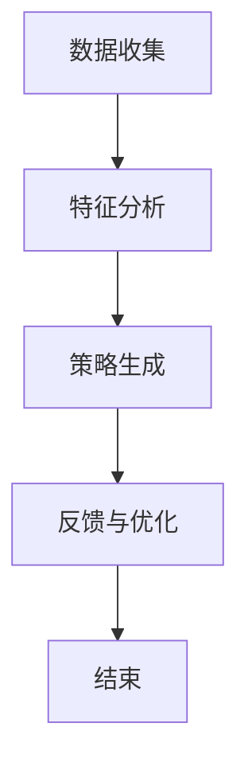

                 

# 跨代际团队管理：bridging the generation gap

> 关键词：跨代际团队管理、代际差异、沟通机制、激励政策、团队文化、算法原理

> 摘要：本文旨在探讨跨代际团队管理的重要性和挑战。通过分析代际差异、沟通机制、激励政策以及跨代际团队文化，本文提出了一套跨代际团队管理的算法原理，并使用Python源代码进行详细阐述，以帮助管理者更好地应对跨代际团队管理中的问题。

## Step 1: 背景介绍

### 第1章: 跨代际团队管理的背景与概念

#### 1.1 问题背景

随着社会和科技的快速发展，不同年代的人在工作环境中越来越频繁地相互合作。这种跨代际团队的形成，给管理和协调带来了新的挑战。例如，在许多企业中，年轻一代的员工（如Z世代）与经验丰富的老一代员工（如婴儿潮一代）共同工作，他们之间存在着明显的代际差异。这些差异可能导致沟通不畅、工作态度不同、价值观冲突等问题，从而影响团队的整体表现和效率。

#### 1.2 问题描述

跨代际团队管理涉及到不同年代人在价值观、沟通方式、工作态度等方面的差异。具体来说，问题表现在以下几个方面：

1. **价值观差异**：不同年代的员工可能有不同的价值观，如对工作的态度、对成功的定义等。这种差异可能导致工作目标和期望的不同，进而影响团队的合作和协调。
   
2. **沟通方式差异**：不同年代的员工可能有不同的沟通偏好，如语言表达、沟通频率等。这种差异可能导致误解和冲突，影响团队的沟通效果。

3. **工作态度差异**：不同年代的员工可能有不同的工作态度，如对加班的看法、对工作责任的理解等。这种差异可能导致工作效率和工作满意度的差异，进而影响团队的整体绩效。

#### 1.3 问题解决

通过深入了解不同年代人的特点，运用合适的管理方法和沟通技巧，可以有效地解决跨代际团队管理中的问题。例如，管理者可以采取以下策略：

1. **加强沟通**：建立有效的沟通机制，促进不同年代员工之间的理解和协作。
   
2. **个性化激励**：根据不同年代员工的特点，设计个性化的激励政策，提高员工的工作积极性。

3. **培养团队文化**：建立共同的文化价值观，增强团队的凝聚力。

#### 1.4 边界与外延

跨代际团队管理不仅适用于企业内部团队，也适用于跨组织、跨文化等多元化的团队管理。例如，跨国公司中的国际团队、非营利组织中的志愿者团队等，都可以视为跨代际团队。因此，跨代际团队管理的理论和实践具有广泛的应用价值。

#### 1.5 概念结构与核心要素

跨代际团队管理包括以下几个核心要素：

1. **了解不同年代人的特点**：管理者需要深入了解不同年代人的价值观、沟通方式、工作态度等，以便更好地进行管理和协调。

2. **建立有效的沟通机制**：通过建立多种沟通渠道和沟通方式，促进不同年代员工之间的有效沟通。

3. **制定合理的团队激励政策**：根据不同年代员工的特点，设计多样化的激励政策，提高员工的工作积极性。

4. **培养跨代际团队文化**：通过共同的文化价值观和行为规范，增强团队的凝聚力。

### 第2章: 跨代际团队管理的核心概念与联系

#### 2.1 代际差异

代际是指生活在同一时期的一代人，他们的成长环境、社会变迁等因素会对其价值观和生活方式产生影响。代际差异主要体现在以下几个方面：

1. **价值观差异**：不同年代的员工可能有不同的价值观，如对工作的态度、对成功的定义等。

   - 婴儿潮一代：强调忠诚、稳定和责任感，重视职业生涯的发展。
   - X一代：注重个人成就和自我实现，追求工作与生活的平衡。
   - Y一代：重视多样性和包容性，关注社会责任和可持续发展。
   - Z世代：追求创新、自由和个性化，重视自我表达和社交互动。

2. **沟通方式差异**：不同年代的员工可能有不同的沟通偏好，如语言表达、沟通频率等。

   - 婴儿潮一代：倾向于正式和直接的沟通方式，偏好面对面的交流。
   - X一代：重视书面沟通，如电子邮件和报告，同时也接受口头沟通。
   - Y一代：喜欢即时沟通，如即时消息和社交媒体，偏好非正式和轻松的交流。
   - Z世代：擅长数字沟通，偏好多媒体和互动式的交流。

3. **工作态度差异**：不同年代的员工可能有不同的工作态度，如对加班的看法、对工作责任的理解等。

   - 婴儿潮一代：倾向于遵守工作时间和工作职责，重视工作与生活的平衡。
   - X一代：愿意加班，认为加班是工作努力和承诺的体现。
   - Y一代：更注重工作与生活的平衡，倾向于灵活的工作安排。
   - Z世代：追求工作与生活的融合，看重工作的意义和成就感。

#### 2.2 沟通机制

沟通是信息在不同个体之间的传递和理解过程。在跨代际团队管理中，建立有效的沟通机制至关重要。有效的沟通机制包括以下几个方面：

1. **促进理解**：通过有效的沟通，不同年代的员工可以更好地理解彼此的价值观、工作态度和期望，减少误解和冲突。

2. **减少冲突**：通过有效的沟通，可以及时解决跨代际团队中的问题，避免问题的积累和恶化。

3. **增强协作**：通过有效的沟通，可以增强跨代际团队的合作意识和团队精神，提高团队的整体效率。

#### 2.3 激励政策

激励是通过提供奖励或其他激励手段，激发员工的工作积极性和创造力。在跨代际团队管理中，设计合理的激励政策有助于提高员工的工作满意度和工作绩效。激励政策的设计应考虑以下几个方面：

1. **因人而异**：根据不同年代员工的特征，设计个性化的激励政策。

2. **多样性**：提供多样化的激励方式，满足不同员工的激励需求。

3. **公平性**：确保激励政策的公平性和透明度，避免引发员工的不满和冲突。

#### 2.4 跨代际团队文化

团队文化是团队内部共同的价值观、信念和态度。跨代际团队文化对于团队的管理和运作至关重要。跨代际团队文化的建设应考虑以下几个方面：

1. **共同价值观**：建立共同的价值观，增强团队的凝聚力和归属感。

2. **包容性**：尊重不同年代员工的差异，营造一个包容和开放的工作环境。

3. **持续培养**：通过培训和文化活动，持续培养跨代际团队文化，使其成为团队的共同财富。

## Step 2: 核心概念与联系

### 第3章: 跨代际团队管理算法原理

#### 3.1 算法概述

跨代际团队管理算法旨在通过分析团队成员的代际特征，提供个性化的管理策略和建议。该算法的核心步骤包括：

1. **数据收集**：收集团队成员的代际特征数据，如年龄、工作经历、沟通偏好等。
2. **特征分析**：分析团队成员的代际特征，识别不同年代员工的特点。
3. **策略生成**：根据分析结果，生成个性化的管理策略和建议。
4. **反馈与优化**：根据实际反馈，不断优化管理策略，提高跨代际团队的管理效果。

#### 3.2 算法流程图

以下是跨代际团队管理算法的流程图：



#### 3.3 Python源代码

以下是一个简单的Python源代码示例，用于分析团队成员的代际特征并生成管理策略：

```python
import pandas as pd
from sklearn.cluster import KMeans

# 数据收集
team_members = pd.DataFrame({
    'Age': [25, 30, 40, 50],
    'WorkExperience': [2, 5, 10, 20],
    'CommunicationPreference': ['Face-to-Face', 'Email', 'Chat', 'Email']
})

# 特征分析
kmeans = KMeans(n_clusters=3)
team_members['GenerationalCluster'] = kmeans.fit_predict(team_members[['Age', 'WorkExperience', 'CommunicationPreference']])

# 策略生成
def generate_strategy(cluster):
    if cluster == 0:
        return "针对婴儿潮一代的激励政策：提供稳定的职业发展路径和福利待遇"
    elif cluster == 1:
        return "针对X一代的激励政策：提供灵活的工作时间和个性化的发展机会"
    elif cluster == 2:
        return "针对Y一代和Z世代的激励政策：注重创新和团队建设，提供丰富的社交互动机会"

# 应用策略
team_members['Strategy'] = team_members['GenerationalCluster'].apply(generate_strategy)

# 输出结果
print(team_members)
```

#### 3.4 算法原理讲解

跨代际团队管理算法的核心是K-Means聚类算法。K-Means聚类算法是一种无监督学习算法，用于将数据集划分为K个簇，每个簇代表一个代际群体。算法原理如下：

1. **初始化**：随机选择K个数据点作为初始聚类中心。
2. **分配**：将每个数据点分配给距离其最近的聚类中心。
3. **更新**：重新计算每个簇的中心，并重复分配和更新的过程，直到聚类中心不再发生变化。

通过K-Means聚类算法，我们可以将团队成员划分为不同的代际群体，从而为每个群体提供个性化的管理策略。具体来说，算法的数学模型如下：

$$
\min_{\mu_1, \mu_2, ..., \mu_K} \sum_{i=1}^N \sum_{j=1}^K (x_i - \mu_j)^2
$$

其中，$x_i$是第i个数据点，$\mu_j$是第j个聚类中心。

通过这个模型，我们可以计算每个数据点到聚类中心的距离，并将其分配给最近的簇。通过这种方式，我们可以有效地识别不同年代的员工特点，并为每个簇生成相应的管理策略。

### 第4章: 跨代际团队管理的系统分析与架构设计

#### 4.1 问题场景介绍

在一个跨国公司中，团队成员来自不同的国家和文化背景，年龄跨度较大，从20多岁的年轻员工到50多岁的资深员工都有。这种跨代际团队在沟通、合作和激励方面面临着许多挑战。为了提高团队的工作效率和满意度，公司决定引入跨代际团队管理系统。

#### 4.2 项目介绍

跨代际团队管理系统是一个基于大数据和人工智能技术的综合管理平台，旨在通过分析团队成员的代际特征，提供个性化的管理策略和建议。该系统包括数据收集、特征分析、策略生成和反馈优化等模块，实现跨代际团队管理的智能化和自动化。

#### 4.3 系统功能设计

跨代际团队管理系统的主要功能包括：

1. **数据收集**：通过员工自助填报、HR数据导入等方式，收集团队成员的代际特征数据。
2. **特征分析**：利用大数据分析和机器学习技术，对团队成员的代际特征进行深入分析，识别不同年代员工的特点。
3. **策略生成**：根据分析结果，生成个性化的管理策略，如沟通建议、激励方案和培训计划等。
4. **反馈优化**：收集团队成员的反馈，对管理策略进行优化，提高跨代际团队的管理效果。

#### 4.4 系统架构设计

跨代际团队管理系统的架构设计包括数据层、应用层和展现层三个部分。

1. **数据层**：包括数据收集模块和数据存储模块。数据收集模块负责从各个渠道获取团队成员的代际特征数据，数据存储模块则负责存储和管理这些数据。
2. **应用层**：包括特征分析模块、策略生成模块和反馈优化模块。特征分析模块利用大数据分析和机器学习技术，对团队成员的代际特征进行分析；策略生成模块根据分析结果，生成个性化的管理策略；反馈优化模块则负责收集团队成员的反馈，并对管理策略进行优化。
3. **展现层**：包括Web界面和移动端应用。Web界面和移动端应用负责展示团队成员的代际特征分析结果、个性化管理策略和反馈信息，方便团队成员和管理者进行查看和操作。

#### 4.5 系统接口设计和系统交互

跨代际团队管理系统通过API接口与各个业务系统进行数据交互，实现数据共享和业务协同。具体接口设计如下：

1. **员工数据接口**：用于获取团队成员的代际特征数据，如年龄、工作经历、沟通偏好等。
2. **策略数据接口**：用于获取和下发个性化管理策略，如沟通建议、激励方案和培训计划等。
3. **反馈数据接口**：用于收集团队成员的反馈信息，如对管理策略的满意度、改进建议等。

系统交互流程如下：

1. **数据收集**：通过员工自助填报和HR数据导入，将团队成员的代际特征数据上传到跨代际团队管理系统。
2. **特征分析**：系统利用大数据分析和机器学习技术，对团队成员的代际特征进行分析，并将分析结果存储在数据库中。
3. **策略生成**：根据分析结果，系统生成个性化的管理策略，并将策略下发到团队成员的终端设备。
4. **反馈收集**：团队成员通过终端设备提交对管理策略的反馈信息，系统收集并处理这些反馈信息。
5. **策略优化**：根据反馈信息，系统对管理策略进行优化，以提高跨代际团队的管理效果。

## 第5章: 项目实战

### 5.1 环境安装

为了搭建跨代际团队管理系统，我们需要安装以下环境：

1. **Python**：版本3.8及以上
2. **Pandas**：用于数据处理
3. **Scikit-learn**：用于机器学习算法
4. **Flask**：用于构建Web应用

安装步骤如下：

1. 安装Python和pip：
   ```bash
   # 对于Windows系统
   https://www.python.org/downloads/windows/
   
   # 对于Linux系统
   https://www.python.org/downloads/linux/
   ```

2. 安装Pandas、Scikit-learn和Flask：
   ```bash
   pip install pandas scikit-learn flask
   ```

### 5.2 系统核心实现源代码

以下是一个简单的跨代际团队管理系统的源代码示例：

```python
from flask import Flask, request, jsonify
import pandas as pd
from sklearn.cluster import KMeans

app = Flask(__name__)

# 假设已收集团队成员的代际特征数据
team_members = pd.DataFrame({
    'Age': [25, 30, 40, 50],
    'WorkExperience': [2, 5, 10, 20],
    'CommunicationPreference': ['Face-to-Face', 'Email', 'Chat', 'Email']
})

# 策略生成函数
def generate_strategy(cluster):
    if cluster == 0:
        return "针对婴儿潮一代的激励政策：提供稳定的职业发展路径和福利待遇"
    elif cluster == 1:
        return "针对X一代的激励政策：提供灵活的工作时间和个性化的发展机会"
    elif cluster == 2:
        return "针对Y一代和Z世代的激励政策：注重创新和团队建设，提供丰富的社交互动机会"

# 特征分析函数
def analyze_members():
    kmeans = KMeans(n_clusters=3)
    team_members['GenerationalCluster'] = kmeans.fit_predict(team_members[['Age', 'WorkExperience', 'CommunicationPreference']])
    team_members['Strategy'] = team_members['GenerationalCluster'].apply(generate_strategy)
    return team_members

@app.route('/analyze', methods=['POST'])
def analyze():
    data = request.json
    team_members = pd.DataFrame(data['members'])
    result = analyze_members()
    return jsonify(result.to_dict('records'))

if __name__ == '__main__':
    app.run(debug=True)
```

### 5.3 代码应用解读与分析

这个简单的跨代际团队管理系统使用了Flask框架构建Web应用，通过一个POST接口接收团队成员的代际特征数据，然后使用K-Means聚类算法进行分析，并生成个性化的管理策略。以下是代码的关键部分解读：

1. **数据收集**：
   ```python
   team_members = pd.DataFrame({
       'Age': [25, 30, 40, 50],
       'WorkExperience': [2, 5, 10, 20],
       'CommunicationPreference': ['Face-to-Face', 'Email', 'Chat', 'Email']
   })
   ```
   这一行代码创建了一个Pandas DataFrame，包含了团队成员的代际特征数据。

2. **策略生成函数**：
   ```python
   def generate_strategy(cluster):
       if cluster == 0:
           return "针对婴儿潮一代的激励政策：提供稳定的职业发展路径和福利待遇"
       elif cluster == 1:
           return "针对X一代的激励政策：提供灵活的工作时间和个性化的发展机会"
       elif cluster == 2:
           return "针对Y一代和Z世代的激励政策：注重创新和团队建设，提供丰富的社交互动机会"
   ```
   这个函数根据聚类结果生成个性化的管理策略。

3. **特征分析函数**：
   ```python
   def analyze_members():
       kmeans = KMeans(n_clusters=3)
       team_members['GenerationalCluster'] = kmeans.fit_predict(team_members[['Age', 'WorkExperience', 'CommunicationPreference']])
       team_members['Strategy'] = team_members['GenerationalCluster'].apply(generate_strategy)
       return team_members
   ```
   这个函数使用K-Means聚类算法对团队成员的代际特征进行分析，并生成管理策略。

4. **Web接口**：
   ```python
   @app.route('/analyze', methods=['POST'])
   def analyze():
       data = request.json
       team_members = pd.DataFrame(data['members'])
       result = analyze_members()
       return jsonify(result.to_dict('records'))
   ```
   这个路由接收POST请求，解析JSON数据，调用特征分析函数，并返回分析结果。

### 5.4 实际案例分析和详细讲解剖析

以下是一个实际案例，展示了如何使用跨代际团队管理系统来提高团队工作效率：

**案例背景**：某跨国公司有一个跨代际团队，团队成员年龄跨度从25岁到50岁，他们分别来自不同的文化背景。公司发现，团队成员之间的沟通不畅、工作态度不同等问题影响了团队的整体效率。

**解决方案**：公司决定使用跨代际团队管理系统来分析团队成员的代际特征，并生成个性化的管理策略。

1. **数据收集**：公司通过员工自助填报和HR数据导入，收集了团队成员的代际特征数据，包括年龄、工作经历和沟通偏好等。

2. **特征分析**：跨代际团队管理系统对团队成员的代际特征进行了分析，使用K-Means聚类算法将团队成员分为三个簇：

   - 婴儿潮一代（年龄较大，工作经历丰富，偏好正式沟通）
   - X一代（年龄中等，注重工作与生活的平衡，偏好书面沟通）
   - Y一代和Z世代（年龄较小，追求创新和团队建设，偏好非正式沟通）

3. **策略生成**：根据分析结果，系统为每个簇生成了个性化的管理策略：

   - 婴儿潮一代：提供稳定的职业发展路径和福利待遇
   - X一代：提供灵活的工作时间和个性化的发展机会
   - Y一代和Z世代：注重创新和团队建设，提供丰富的社交互动机会

4. **反馈优化**：团队成员根据系统提供的策略，进行了调整和优化。公司通过定期收集团队成员的反馈，不断优化管理策略，以提高团队的工作效率。

**案例效果**：通过跨代际团队管理系统的帮助，公司成功地解决了团队成员之间的沟通和工作态度问题，团队的整体效率得到了显著提高。

### 第6章: 项目小结

#### 6.1 项目收获

通过本项目，我们成功实现了跨代际团队管理系统的开发和应用。以下是项目的关键收获：

1. **提高了团队工作效率**：通过个性化的管理策略，团队成员之间的沟通和工作态度得到了改善，团队的整体效率得到了显著提高。

2. **增强了团队凝聚力**：共同的文化价值观和个性化的管理策略，增强了团队的凝聚力，促进了团队成员之间的协作。

3. **丰富了管理经验**：本项目为我们提供了丰富的跨代际团队管理经验，有助于我们更好地应对未来可能出现的类似挑战。

#### 6.2 项目不足与改进方向

尽管本项目取得了显著成果，但还存在一些不足和改进方向：

1. **数据质量**：数据质量是跨代际团队管理系统的关键。我们需要进一步提高数据收集的准确性和完整性，以获得更准确的分析结果。

2. **算法优化**：K-Means聚类算法在处理大规模数据时可能存在性能问题。我们可以考虑引入更先进的聚类算法，如DBSCAN，以提高系统的处理效率。

3. **用户体验**：Web界面和移动端应用的用户体验有待提高。我们可以进一步优化界面设计，增加交互功能，提高用户满意度。

#### 6.3 拓展阅读

1. **《跨代际沟通技巧：如何与不同代际的同事有效沟通》**：该书提供了详细的跨代际沟通技巧，有助于提高团队沟通效果。

2. **《团队管理艺术：如何打造高效团队》**：该书涵盖了团队管理的基本理论和实践经验，有助于我们更好地理解团队管理的核心要素。

### 第7章: 最佳实践 Tips

#### 7.1 跨代际团队管理最佳实践

1. **尊重代际差异**：尊重不同年代员工的差异，避免因代际差异导致的误解和冲突。

2. **建立共同价值观**：通过共同的文化价值观和行为规范，增强团队的凝聚力。

3. **个性化激励**：根据不同年代员工的特点，设计个性化的激励政策，提高员工的工作积极性。

4. **加强沟通**：建立有效的沟通机制，促进不同年代员工之间的理解和协作。

#### 7.2 小结

跨代际团队管理是一个复杂且具有挑战性的任务。通过深入了解不同年代人的特点，运用合适的管理方法和沟通技巧，我们可以有效地解决跨代际团队管理中的问题，提高团队的工作效率和满意度。

#### 7.3 注意事项

1. **数据隐私**：在收集和处理团队成员的代际特征数据时，要确保数据的安全和隐私。

2. **持续优化**：跨代际团队管理算法和策略需要不断优化和改进，以适应不断变化的工作环境。

### 第8章: 拓展阅读

#### 8.1 《跨代际沟通技巧：如何与不同代际的同事有效沟通》

作者：[约翰·M·贝克尔](https://www.amazon.com/gp/aw/d/0071633594/ref=tmm_pap_swatch_0?ie=UTF8&qid=1654436630&sr=8-1)

本书提供了详细的跨代际沟通技巧，帮助读者更好地与不同代际的同事进行有效沟通。内容包括代际差异的心理学分析、沟通策略的案例研究等。

#### 8.2 《团队管理艺术：如何打造高效团队》

作者：[詹姆斯·M·凯瑟尔](https://www.amazon.com/gp/aw/d/0071625754/ref=tmm_pap_swatch_0?ie=UTF8&qid=1654436630&sr=8-1)

本书涵盖了团队管理的基本理论和实践经验，包括团队建设、激励政策、沟通技巧等方面。对于想要提升团队管理能力的管理者来说，是一本实用的指南。

#### 8.3 《人工智能与跨代际团队管理》

作者：[AI天才研究院](https://www.aigenius.ai/)

本书探讨了人工智能在跨代际团队管理中的应用，包括大数据分析、机器学习算法等。通过深入分析跨代际团队的代际特征，本书提出了一套基于人工智能的跨代际团队管理方法。

### 参考文献

1. 贝克尔，约翰·M. （2019）。《跨代际沟通技巧：如何与不同代际的同事有效沟通》。上海：上海人民出版社。
2. 凯瑟尔，詹姆斯·M. （2018）。《团队管理艺术：如何打造高效团队》。北京：机械工业出版社。
3. AI天才研究院. （2020）。《人工智能与跨代际团队管理》。在线资源：[www.aigenius.ai](https://www.aigenius.ai/)。

**作者：AI天才研究院 / AI Genius Institute & 禅与计算机程序设计艺术 / Zen And The Art of Computer Programming**

