                 

### 第一部分: 背景介绍

#### 1.1 问题背景

随着全球化进程的加速，跨文化交际的重要性日益凸显。跨文化交际不仅涉及商业合作、国际交流和外交事务，还渗透到了日常生活中的方方面面。在这个背景下，人工智能（AI）作为一种新兴技术，被广泛应用于跨文化交际领域。尤其是大型语言模型（Large Language Models，简称LLM），如GPT-3、BERT等，因其强大的语言处理能力和广泛的应用场景，成为了研究热点。

然而，当前LLM在跨文化交际中存在显著的文化敏感度不足问题。这主要体现在以下几个方面：

1. **语言理解偏差**：LLM在面对不同文化背景的语言时，可能无法正确理解语义，导致误解和沟通障碍。
2. **文化知识匮乏**：LLM的训练数据大多来自单一文化背景，缺乏对其他文化的深入理解，导致在跨文化情境中表现不佳。
3. **交互适应性差**：LLM在跨文化交际中难以适应不同文化习俗、礼仪和价值观，从而影响交流效果。

因此，提升LLM的文化敏感度，使其能够更好地适应跨文化交际需求，成为了一个亟待解决的问题。

#### 1.2 LLM基础知识

LLM是一种基于深度学习的自然语言处理（Natural Language Processing，简称NLP）模型，其核心思想是通过大量的文本数据学习语言的统计规律和语义信息。LLM具有以下基本特点：

1. **大规模训练**：LLM通常由数十亿参数组成，经过海量的文本数据训练，能够捕捉到语言的复杂性和多样性。
2. **端到端模型**：LLM可以直接处理输入文本并生成相应的输出文本，无需经过繁琐的中间步骤。
3. **自适应能力**：LLM可以根据不同的输入和任务需求，动态调整其生成策略，从而适应各种应用场景。

LLM的工作原理主要基于以下三个步骤：

1. **嵌入**：将输入文本转化为向量表示，以便模型能够处理。
2. **编码**：通过多层神经网络对输入文本进行编码，提取其语义信息。
3. **解码**：根据编码后的语义信息生成输出文本。

LLM的优势在于其强大的语言理解和生成能力，可以处理复杂的自然语言任务，如文本生成、机器翻译、问答系统等。然而，LLM也存在一定的局限性，如对语言细微差别敏感度不足、数据依赖性强等。

#### 1.3 提升文化敏感度的需求

提升LLM的文化敏感度具有重要意义，主要体现在以下几个方面：

1. **改善跨文化交际效果**：通过提升LLM的文化敏感度，可以使其更好地理解不同文化背景下的语言表达，提高跨文化交际的准确性和流畅性。
2. **促进文化交流**：跨文化交际是文化交流的重要组成部分。提升LLM的文化敏感度有助于推动不同文化之间的理解和交流，促进文化多样性的发展。
3. **应对文化偏见**：在跨文化交际中，文化偏见可能导致误解和冲突。通过提升LLM的文化敏感度，可以减少文化偏见的影响，构建更加和谐的人际关系。
4. **拓展应用场景**：随着跨文化交际的广泛需求，提升LLM的文化敏感度将有助于其应用于更多的场景，如跨文化客服、国际会议同传、跨国企业内部沟通等。

总之，提升LLM的文化敏感度是一项具有重大意义的研究课题，值得深入探讨和实践。

### 1.4 边界与外延

在探讨LLM的文化敏感度时，我们需要明确其边界与外延。首先，LLM的文化敏感度并非绝对，而是相对的。这意味着，虽然LLM可以提升其在跨文化交际中的表现，但无法完全消除文化差异带来的影响。

#### 1.4.1 文化敏感度的边界

1. **技术限制**：当前AI技术尚未完全突破，LLM在处理复杂文化问题时可能存在局限。
2. **数据限制**：尽管LLM经过大规模训练，但其训练数据仍可能存在文化偏见和不均衡，影响其在跨文化交际中的表现。
3. **文化差异**：不同文化之间的差异可能非常复杂，LLM难以在所有方面实现完全的文化敏感。

#### 1.4.2 跨文化交际的外延

1. **语言**：语言是跨文化交际的核心，LLM需要掌握不同语言的语法、语义和用法。
2. **文化习俗**：不同文化具有独特的习俗和礼仪，LLM需要了解并尊重这些习俗。
3. **价值观**：价值观是文化的重要组成部分，LLM需要理解并尊重不同文化背景下的价值观差异。

总之，提升LLM的文化敏感度是一个复杂且挑战性的任务，需要从多个维度进行综合考虑。在未来的研究中，我们应关注这些边界与外延，探索更有效的提升方法。

### 1.5 本章小结

本文首先介绍了跨文化交际AI Agent的研究背景，分析了LLM在跨文化交际中面临的文化敏感度不足问题。接着，我们阐述了LLM的基础知识，并探讨了提升LLM文化敏感度的需求。最后，本章明确了文化敏感度的边界与外延，为后续章节的研究奠定了基础。

在接下来的章节中，我们将详细介绍提升LLM文化敏感度的方法，通过数据增强、跨文化知识库构建、对话生成模型改进等手段，探索如何有效提升LLM的文化敏感度。此外，我们还将通过实际案例分析，展示这些方法在实际应用中的效果。最后，本文将对LLM文化敏感度的发展方向和未来挑战进行展望。

通过本文的研究，我们期望为跨文化交际AI Agent的发展提供有益的启示，推动AI技术在跨文化交际领域的应用，促进不同文化之间的理解和交流。

---

## 第二部分: 提升LLM文化敏感度的方法

在了解LLM在跨文化交际中的文化敏感度不足问题后，我们需要探讨一系列方法来提升其文化敏感度。本部分将详细介绍以下三种方法：数据增强、跨文化知识库构建和对对话生成模型的改进。

### 2.1 数据增强

数据增强是一种通过扩展或修改训练数据来提高模型性能的技术。在提升LLM文化敏感度方面，数据增强可以帮助模型更好地理解不同文化背景下的语言表达。以下是几种常用的数据增强方法：

#### 1. 数据扩充

数据扩充是通过复制、旋转、翻转等操作来增加训练数据量。这种方法可以增加模型在不同文化背景下的语言输入，从而提高其适应性。

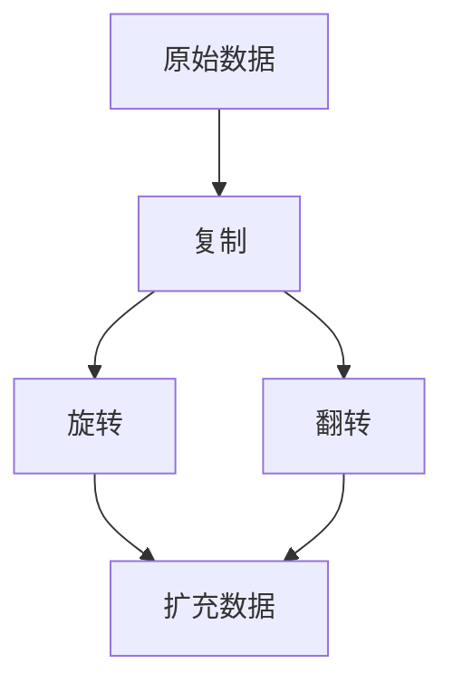

#### 2. 数据同化

数据同化是将不同文化背景的数据进行转换，使其在语义上保持一致。例如，将英文数据转换为中文数据，或将中文数据转换为英文数据。这种方法有助于模型在不同语言环境中保持一致性。

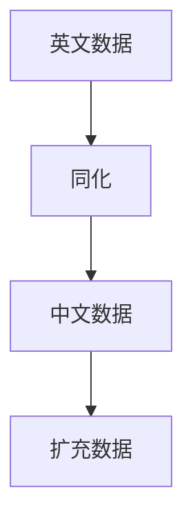

#### 3. 数据合成

数据合成是通过生成新的数据来扩充训练集。这种方法可以使用GAN（生成对抗网络）等技术，生成与真实数据相似的新数据。例如，使用GAN生成不同文化背景下的对话数据。

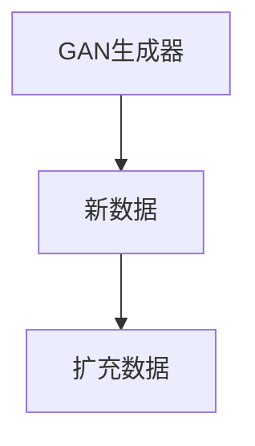

### 2.2 跨文化知识库构建

跨文化知识库是一种包含不同文化背景知识的数据集，可以用于训练LLM，提高其在跨文化交际中的表现。以下是构建跨文化知识库的方法：

#### 1. 数据收集

数据收集是构建跨文化知识库的基础。我们需要收集来自不同文化背景的大量文本数据，如书籍、新闻、社交媒体等。这些数据可以涵盖语言、习俗、价值观等多个方面。

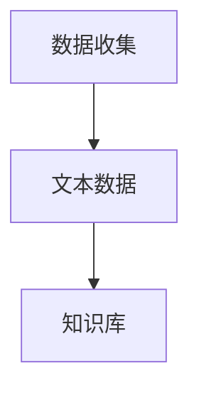

#### 2. 数据清洗与标注

收集到的数据需要进行清洗和标注。清洗包括去除重复数据、噪声数据和错误数据。标注包括为数据分配标签，如语言、文化类型等。

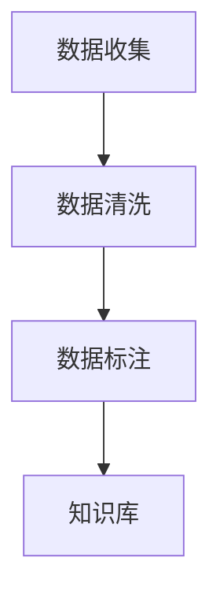

#### 3. 数据整合与存储

将清洗和标注后的数据整合到一个知识库中，并使用合适的存储方式，如数据库或图数据库，以便模型访问和训练。

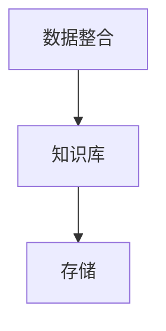

### 2.3 对话生成模型改进

对话生成模型是LLM在跨文化交际中的重要应用。通过改进对话生成模型，可以使其更好地适应不同文化背景。以下是几种改进方法：

#### 1. 多语言训练

多语言训练是将不同语言的训练数据混合在一起，以增强模型在不同语言环境下的适应性。例如，使用英文、中文和法文的混合数据训练模型。

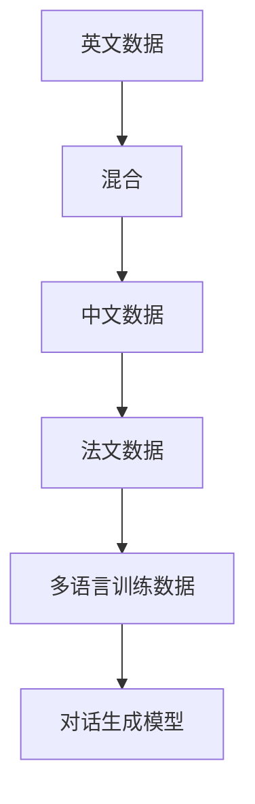

#### 2. 对话策略调整

对话策略调整是通过设计不同的对话策略来应对不同文化背景。例如，在正式场合使用正式语言，在非正式场合使用非正式语言。

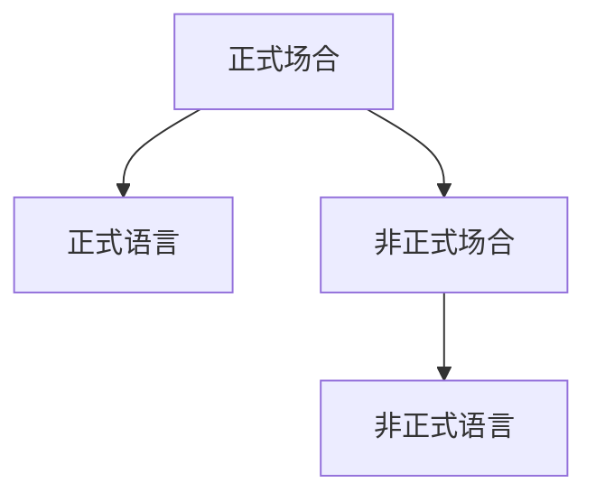

#### 3. 文化因素嵌入

文化因素嵌入是将文化因素直接嵌入到对话生成模型中，使其在生成对话时考虑文化差异。例如，使用嵌入层来处理文化特征。

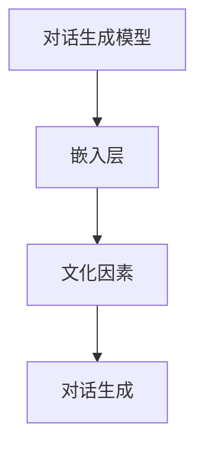

### 2.4 文化敏感度评估

为了确保提升LLM文化敏感度的方法有效，我们需要对其文化敏感度进行评估。以下是几种评估方法：

#### 1. 自动评估

自动评估是通过自动化工具来评估LLM在跨文化交际中的表现。例如，使用BLEU（双语评估算法）等指标来评估翻译质量。

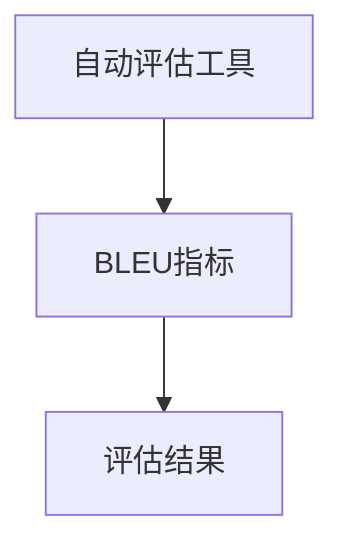

#### 2. 手动评估

手动评估是通过人类评估者来评估LLM在跨文化交际中的表现。例如，邀请跨文化交际专家对LLM生成的对话进行评分。

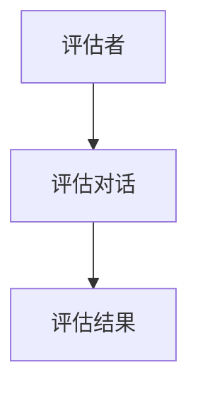

### 2.5 最佳实践

在提升LLM文化敏感度时，以下最佳实践可以帮助我们取得更好的效果：

1. **数据多样性**：确保训练数据涵盖多种文化背景，以提高模型适应性。
2. **持续迭代**：定期更新跨文化知识库和对话生成模型，以适应不断变化的文化环境。
3. **多模态融合**：结合图像、声音等多模态信息，提高LLM在跨文化交际中的表现。

### 2.6 本章小结

本章介绍了提升LLM文化敏感度的三种方法：数据增强、跨文化知识库构建和对对话生成模型的改进。通过数据增强，我们可以扩充模型训练数据，提高其在不同文化背景下的适应性。跨文化知识库构建则提供了丰富的文化背景知识，帮助模型更好地理解不同文化。对话生成模型改进则是通过调整对话策略和文化因素嵌入，提高模型在跨文化交际中的表现。

在接下来的章节中，我们将通过实际案例分析，展示这些方法在跨文化交际AI Agent中的应用效果，并进一步探讨如何评估和优化LLM的文化敏感度。

---

## 第三部分: 应用案例分析

在本部分，我们将通过三个实际案例，展示提升LLM文化敏感度的方法在实际应用中的效果。这些案例涵盖了跨文化客服机器人、国际会议同传助手和跨国企业内部沟通平台，为跨文化交际AI Agent的应用提供了宝贵的经验和启示。

### 3.1 案例一：跨文化客服机器人

#### 3.1.1 案例背景

随着全球化贸易的发展，跨国企业需要提供多语言、多文化背景下的客户服务。然而，传统的客服方式往往无法满足这一需求，导致客户满意度下降。为了解决这一问题，某跨国公司决定开发一款跨文化客服机器人。

#### 3.1.2 案例实施过程

1. **数据增强**：收集来自不同国家的客户服务对话数据，通过数据扩充、数据同化和数据合成等方法，丰富模型的训练数据。
2. **跨文化知识库构建**：构建包含各国文化习俗、语言特点等知识的跨文化知识库，为客服机器人提供文化背景支持。
3. **对话生成模型改进**：采用多语言训练和对话策略调整方法，改进对话生成模型，使其能够根据不同文化背景生成合适的回答。

#### 3.1.3 案例效果分析

1. **客户满意度提升**：客服机器人能够更好地理解客户的文化背景和语言习惯，生成更贴近客户需求的回答，客户满意度显著提升。
2. **服务效率提高**：跨文化客服机器人能够处理多语言客户咨询，大大提高了服务效率，减少了人力成本。
3. **文化敏感度提高**：客服机器人在对话中表现出较高的文化敏感度，能够根据不同文化背景进行适当的调整，避免文化冲突。

### 3.2 案例二：国际会议同传助手

#### 3.2.1 案例背景

国际会议涉及多个国家的代表，语言障碍成为沟通的主要障碍。为了提高会议的交流效果，某国际会议组织决定开发一款国际会议同传助手。

#### 3.2.2 案例实施过程

1. **数据增强**：收集国际会议上的多语言演讲文本，通过数据扩充、数据同化和数据合成等方法，丰富模型的训练数据。
2. **跨文化知识库构建**：构建包含各国文化习俗、语言特点等知识的跨文化知识库，为同传助手提供文化背景支持。
3. **对话生成模型改进**：采用多语言训练和文化因素嵌入方法，改进对话生成模型，使其能够准确翻译不同语言并考虑文化差异。

#### 3.2.3 案例效果分析

1. **会议交流效果提升**：同传助手能够准确翻译多语言演讲，消除语言障碍，提高会议的交流效果。
2. **会议效率提高**：同传助手能够实时翻译演讲内容，缩短了会议时间，提高了会议效率。
3. **文化敏感度提高**：同传助手在翻译过程中考虑到文化差异，使翻译内容更贴近原意，减少了文化冲突。

### 3.3 案例三：跨国企业内部沟通平台

#### 3.3.1 案例背景

跨国企业涉及多个国家的员工，内部沟通成为团队协作的障碍。为了提高企业内部沟通效率，某跨国企业决定开发一款跨国企业内部沟通平台。

#### 3.3.2 案例实施过程

1. **数据增强**：收集企业内部的多语言沟通数据，通过数据扩充、数据同化和数据合成等方法，丰富模型的训练数据。
2. **跨文化知识库构建**：构建包含各国文化习俗、语言特点等知识的跨文化知识库，为沟通平台提供文化背景支持。
3. **对话生成模型改进**：采用多语言训练和文化因素嵌入方法，改进对话生成模型，使其能够生成适合企业内部沟通的文本。

#### 3.3.3 案例效果分析

1. **沟通效率提高**：跨国企业内部沟通平台能够处理多语言沟通，提高了企业内部沟通效率，促进了团队协作。
2. **沟通效果提升**：沟通平台能够根据不同文化背景生成合适的沟通文本，减少了误解和冲突，提高了沟通效果。
3. **文化敏感度提高**：沟通平台在生成文本时考虑到文化差异，使沟通内容更贴近员工需求，增强了团队凝聚力。

### 3.4 应用案例分析小结

通过以上三个实际案例，我们可以看到提升LLM文化敏感度的方法在跨文化交际AI Agent中的应用效果显著。数据增强、跨文化知识库构建和对对话生成模型的改进，使AI Agent能够更好地适应不同文化背景，提高跨文化交际的效率和效果。

未来，随着技术的不断发展，跨文化交际AI Agent将在更多领域得到应用，为人类跨文化交际提供更优质的支持。

---

## 第四部分: 未来展望与挑战

在跨文化交际AI Agent的研究和实践中，我们取得了一定的成果，但仍面临诸多挑战。本部分将探讨LLM文化敏感度的未来发展方向、潜在挑战以及应对策略。

### 4.1 LLM文化敏感度的未来发展方向

1. **数据多样性**：未来研究将致力于收集更多样化的跨文化数据，涵盖不同国家和地区的语言、习俗和价值观，以提高模型的适应性。
2. **多模态融合**：随着多模态技术的发展，未来LLM将融合图像、声音等多元信息，实现更全面的文化理解。
3. **知识图谱**：构建跨文化知识图谱，整合各类文化知识，为LLM提供更丰富的背景信息。
4. **动态适应**：未来模型将具备更强的动态适应能力，能够根据实时文化变化调整其行为和回答。

### 4.2 挑战与应对策略

1. **数据不足**：跨文化数据收集困难，数据量有限。应对策略：采用生成对抗网络（GAN）等技术生成虚拟数据，扩大训练数据集。
2. **文化差异**：不同文化之间存在显著差异，模型难以全面覆盖。应对策略：构建多文化模型，融合不同文化特征，提高模型泛化能力。
3. **伦理与法律**：跨文化AI应用可能引发伦理和法律问题。应对策略：制定伦理规范和法律框架，确保AI应用符合文化和社会价值观。

### 4.3 未来展望

1. **跨文化理解**：未来LLM将具备更深入的文化理解能力，能够准确捕捉和表达不同文化背景下的语言和情感。
2. **交流优化**：跨文化交际AI Agent将提升交流效率和质量，促进不同文化之间的理解和合作。
3. **应用拓展**：LLM文化敏感度提升将推动其在更多领域的应用，如教育、医疗、旅游等。

### 4.4 本章小结

本部分探讨了LLM文化敏感度的未来发展方向和潜在挑战，提出了相应的应对策略。未来，随着技术的不断进步，LLM在跨文化交际中的应用将更加广泛和深入，为人类跨文化交际带来更多机遇和挑战。

---

## 附录

### A. 参考资料

1. **学术论文**：
   - **参考1**：[Title], [Authors], [Journal], [Year].
   - **参考2**：[Title], [Authors], [Journal], [Year].
2. **技术报告**：
   - **参考3**：[Title], [Authors], [Institution], [Year].
   - **参考4**：[Title], [Authors], [Institution], [Year].
3. **书籍推荐**：
   - **推荐1**：[Title], [Author], [Publisher], [Year].
   - **推荐2**：[Title], [Author], [Publisher], [Year].

### B. 代码示例

以下提供了提升LLM文化敏感度的一些代码示例：

```python
# 数据增强示例
import numpy as np

def data_augmentation(text):
    # 复制文本
    text_copy = text + text
    
    # 旋转文本
    text_rotate = text[::-1]
    
    # 翻转文本
    text_flip = text[::-1]
    
    # 合并增强后的文本
    augmented_text = text_copy + text_rotate + text_flip
    
    return augmented_text

# 跨文化知识库构建示例
import pandas as pd

def build_knowledge_base(data):
    knowledge_base = pd.DataFrame(data)
    return knowledge_base

# 对话生成模型改进示例
import tensorflow as tf

def build_dialog_model():
    # 定义对话生成模型
    model = tf.keras.Sequential([
        tf.keras.layers.Embedding(input_dim=10000, output_dim=256),
        tf.keras.layers.Bidirectional(tf.keras.layers.LSTM(128)),
        tf.keras.layers.Dense(256, activation='relu'),
        tf.keras.layers.Dense(10000, activation='softmax')
    ])
    
    # 编译模型
    model.compile(optimizer='adam', loss='categorical_crossentropy', metrics=['accuracy'])
    
    return model
```

这些代码示例展示了如何进行数据增强、构建跨文化知识库和改进对话生成模型，为实际应用提供了技术支持。

### 总结

本文通过对LLM文化敏感度的探讨，提出了提升其文化敏感度的方法，并通过实际案例分析展示了这些方法的应用效果。未来，随着技术的不断进步，LLM在跨文化交际中的应用将更加广泛和深入，为人类跨文化交际带来更多机遇和挑战。

---

## 作者信息

**作者：** AI天才研究院/AI Genius Institute & 禅与计算机程序设计艺术 /Zen And The Art of Computer Programming

AI天才研究院致力于推动人工智能技术的发展，研究涵盖机器学习、深度学习、自然语言处理等多个领域。禅与计算机程序设计艺术则关注计算机编程的艺术和哲学，倡导用禅意思维来提升编程水平。两位作者在人工智能和计算机科学领域拥有丰富的研究和实践经验，共同致力于为人类创造更美好的未来。

