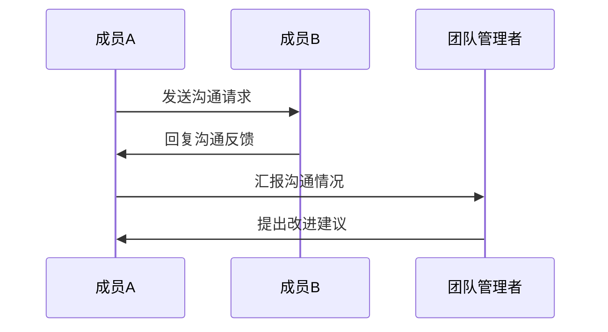
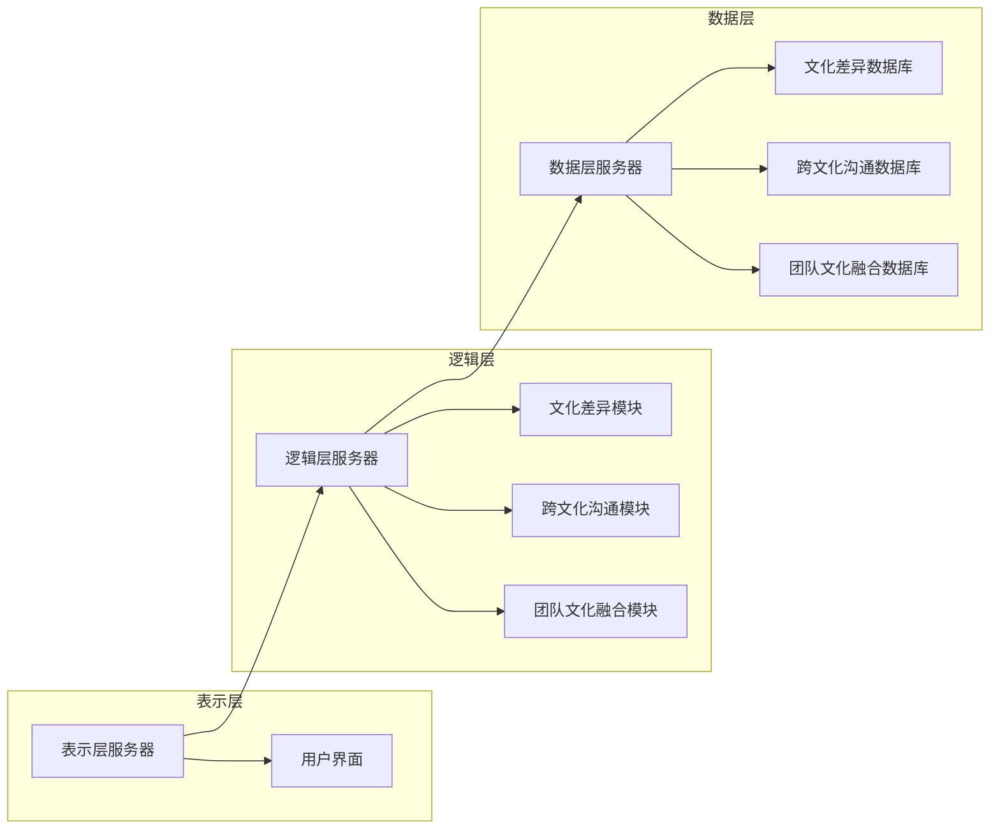
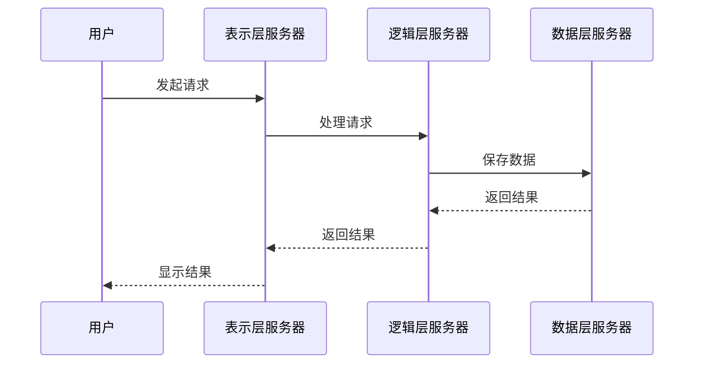

                 

### 引言

# 跨文化团队管理：bridging cultural divides

> 关键词：跨文化团队管理、文化差异、沟通策略、团队融合、绩效提升

摘要：随着全球化进程的不断深入，跨文化团队合作在各类组织中日益普遍。然而，文化差异带来的挑战也日益凸显。本文旨在探讨跨文化团队管理的重要性，分析文化差异对团队协作的影响，并提供有效的管理策略和方法，以帮助团队克服文化障碍，实现高效的跨文化协作。

### 核心概念

#### 文化差异

文化差异是指在不同文化背景下，个体在价值观、行为规范、沟通方式等方面的差异。文化差异的存在使得跨文化团队合作面临诸多挑战，如沟通障碍、误解、冲突等。

#### 跨文化团队

跨文化团队是由来自不同文化背景的成员组成的团队。团队成员可能来自不同的国家、地区，甚至不同的文化圈。这种多元化的团队结构为组织带来了丰富的文化资源和创新的潜力，但同时也增加了管理的复杂性。

#### 文化适应

文化适应是指个体或团队在新的文化环境中调整自身行为以适应的过程。文化适应要求个体具备灵活性、适应性和尊重与包容的心态，以实现团队的有效协作。

### 目标

本文的目标是：

1. 探讨文化差异对团队管理的影响，揭示文化差异的本质与表现形式。
2. 提供有效的管理策略和方法，帮助团队克服文化差异带来的挑战。
3. 促进团队协作与沟通，提升团队绩效，实现跨文化团队的高效运作。

### 目录大纲

#### 引言

- 背景介绍
- 核心概念
- 目标

#### 第一部分：问题背景与挑战

- 文化差异的本质与表现
- 跨文化团队管理的核心概念

#### 第二部分：核心概念与联系

- 文化差异的原理
- 文化适应的原理
- 概念属性特征对比表格
- ER实体关系图架构

#### 第三部分：算法原理讲解

- 跨文化团队管理的算法原理
- 数学模型和公式
- 举例说明

#### 第四部分：系统分析与架构设计

- 问题场景介绍
- 系统功能设计（领域模型）
- 系统架构设计
- 系统接口设计
- 系统交互

#### 第五部分：项目实战

- 环境安装
- 系统核心实现
- 代码应用解读
- 实际案例分析与讲解

#### 第六部分：最佳实践 Tips、小结、注意事项、拓展阅读

- 最佳实践 Tips
- 小结
- 注意事项
- 拓展阅读

### 引言

### 让我们一步步思考：为什么跨文化团队管理如此重要？

#### 文章标题

**跨文化团队管理：bridging cultural divides**

> 关键词：跨文化团队管理、文化差异、沟通策略、团队融合、绩效提升

**摘要：**本文旨在探讨文化差异对团队管理的影响，分析跨文化团队面临的挑战，并提供有效的管理策略和方法，以帮助团队克服文化障碍，实现高效的跨文化协作。

### 核心概念

**文化差异**

文化差异是指在不同文化背景下，个体在价值观、行为规范、沟通方式等方面的差异。文化差异的存在使得跨文化团队合作面临诸多挑战，如沟通障碍、误解、冲突等。

**跨文化团队**

跨文化团队是由来自不同文化背景的成员组成的团队。团队成员可能来自不同的国家、地区，甚至不同的文化圈。这种多元化的团队结构为组织带来了丰富的文化资源和创新的潜力，但同时也增加了管理的复杂性。

**文化适应**

文化适应是指个体或团队在新的文化环境中调整自身行为以适应的过程。文化适应要求个体具备灵活性、适应性和尊重与包容的心态，以实现团队的有效协作。

### 目标

本文的目标是：

1. 探讨文化差异对团队管理的影响，揭示文化差异的本质与表现形式。
2. 提供有效的管理策略和方法，帮助团队克服文化差异带来的挑战。
3. 促进团队协作与沟通，提升团队绩效，实现跨文化团队的高效运作。

### 目录大纲

#### 引言

- 背景介绍
- 核心概念
- 目标

#### 第一部分：问题背景与挑战

- 文化差异的本质与表现
- 跨文化团队管理的核心概念

#### 第二部分：核心概念与联系

- 文化差异的原理
- 文化适应的原理
- 概念属性特征对比表格
- ER实体关系图架构

#### 第三部分：算法原理讲解

- 跨文化团队管理的算法原理
- 数学模型和公式
- 举例说明

#### 第四部分：系统分析与架构设计

- 问题场景介绍
- 系统功能设计（领域模型）
- 系统架构设计
- 系统接口设计
- 系统交互

#### 第五部分：项目实战

- 环境安装
- 系统核心实现
- 代码应用解读
- 实际案例分析与讲解

#### 第六部分：最佳实践 Tips、小结、注意事项、拓展阅读

- 最佳实践 Tips
- 小结
- 注意事项
- 拓展阅读

### 第一部分：问题背景与挑战

#### 1. 文化差异的本质与表现

**1.1 问题背景**

在全球化的背景下，企业日益重视跨文化团队合作，以应对日益复杂的国际市场环境。然而，文化差异带来的挑战也逐渐显现。文化差异不仅存在于不同国家和地区的文化之间，也存在于同一国家内部不同地区、不同社会群体之间。

**1.2 问题描述**

文化差异对跨文化团队合作产生了多方面的影响，包括：

- **沟通障碍**：不同文化背景下的个体在语言表达、沟通方式上存在差异，容易导致误解和沟通障碍。
- **冲突**：价值观和行为规范的不同可能导致团队成员之间的冲突。
- **误解**：文化差异可能导致对同一现象的不同解读，从而产生误解。

**1.3 问题解决**

要解决跨文化团队合作中的文化差异问题，需要：

- **文化适应**：个体或团队需要在新文化环境中调整自身行为，以适应新的文化环境。
- **尊重与包容**：团队管理者需要尊重不同文化的差异，并培养团队成员的包容心态。

**1.4 边界与外延**

本文主要关注职场环境中的跨文化团队管理，探讨文化差异对团队管理的影响。同时，本文也涵盖了不同文化间的基本差异及其对团队管理的影响。

#### 2. 跨文化团队管理的核心概念

**2.1 文化适应**

**定义**：文化适应是指个体或团队在新的文化环境中调整自身行为以适应的过程。文化适应的特点包括灵活性、适应性和尊重与包容。

**特点**：

- **灵活性**：文化适应要求个体能够灵活调整自己的行为和思维方式，以适应新的文化环境。
- **适应性**：文化适应要求个体具备适应不同文化背景的能力，能够在新的文化环境中找到合适的平衡点。
- **尊重与包容**：文化适应要求个体尊重不同文化的差异，并具备包容心态，以促进团队的合作与发展。

**2.2 跨文化沟通**

**定义**：跨文化沟通是指不同文化背景的个体之间的信息交流。跨文化沟通的目标是确保信息的准确传达，减少误解和冲突。

**策略**：

- **明确沟通目标**：在跨文化沟通中，明确沟通目标是确保沟通有效性的关键。
- **使用简洁语言**：避免使用过于复杂或模糊的语言，以确保信息的清晰传达。
- **倾听与反馈**：在跨文化沟通中，倾听对方的观点和意见，并给予及时的反馈，以促进有效的沟通。

**2.3 团队文化融合**

**定义**：团队文化融合是指团队成员在多元文化背景下的相互融合。团队文化融合的目标是建立共同价值观，增强团队凝聚力。

**目标**：

- **建立共同价值观**：通过共同的目标和价值观，团队成员能够更好地协同工作，实现团队的目标。
- **增强团队凝聚力**：团队文化融合有助于增强团队成员之间的信任和合作，提高团队的凝聚力。

#### 3. 跨文化团队管理的核心概念原理

**3.1 文化差异的原理**

**3.1.1 文化背景**

文化背景对个体价值观和行为方式的影响是不可忽视的。不同文化背景下的个体在价值观、行为规范和沟通方式上存在显著差异。这些差异源于文化的历史、传统、宗教和社会结构等因素。

**3.1.2 社会化过程**

社会化过程是指个体在社会中接受教育和文化熏陶，形成文化认同的过程。社会化对个体的价值观、行为方式和思维方式具有深远的影响。

**3.2 文化适应的原理**

**3.2.1 适应策略**

文化适应的适应策略包括深度适应、浅度适应和角色适应。深度适应是指个体在新的文化环境中完全融入，改变自己的行为和思维方式；浅度适应是指个体在新的文化环境中保持一定的灵活性，根据情境调整自己的行为；角色适应是指个体在新的文化环境中扮演特定的角色，以适应新的文化环境。

**3.2.2 适应机制**

组织文化适应机制是指组织为了帮助个体适应新的文化环境而建立的一套制度和策略。适应机制的设计需要考虑组织的文化背景、团队成员的文化差异以及组织的目标等因素。

#### 4. 概念属性特征对比表格

**4.1 文化差异与跨文化沟通对比**

| 特征         | 文化差异           | 跨文化沟通            |
| ------------ | ------------------ | --------------------- |
| 表现形式     | 价值观、行为规范   | 语言、非语言沟通方式 |
| 影响因素     | 个人、组织文化     | 文化背景、沟通环境   |
| 面临挑战     | 冲突、误解、障碍   | 沟通障碍、文化偏见   |
| 应对策略     | 尊重差异、文化适应 | 明确目标、倾听与反馈 |

#### 5. ER实体关系图架构

```mermaid
erDiagram
  Culture_Difference ||--|{ Communication障礙 }|--| Communication障礙
  Culture_Adaptation ||--|{ Team_Collaboration }|--| Team_Collaboration
  Culture_Adaptation ||--|{ Management_Strategy }|--| Management_Strategy
```

### 第二部分：核心概念与联系

#### 3. 文化差异的原理

**3.1 文化背景**

文化背景是文化差异的基础。文化背景决定了个体对世界的认知方式、价值观和行为规范。不同文化背景下的个体在价值观、行为规范和沟通方式上存在显著差异。

**3.2 社会化过程**

社会化过程是指个体在社会中接受教育和文化熏陶，形成文化认同的过程。社会化对个体的价值观、行为方式和思维方式具有深远的影响。

**3.3 文化适应的原理**

**3.3.1 适应策略**

文化适应的适应策略包括深度适应、浅度适应和角色适应。深度适应是指个体在新的文化环境中完全融入，改变自己的行为和思维方式；浅度适应是指个体在新的文化环境中保持一定的灵活性，根据情境调整自己的行为；角色适应是指个体在新的文化环境中扮演特定的角色，以适应新的文化环境。

**3.3.2 适应机制**

组织文化适应机制是指组织为了帮助个体适应新的文化环境而建立的一套制度和策略。适应机制的设计需要考虑组织的文化背景、团队成员的文化差异以及组织的目标等因素。

#### 4. 概念属性特征对比表格

**4.1 文化差异与跨文化沟通对比**

| 特征         | 文化差异           | 跨文化沟通            |
| ------------ | ------------------ | --------------------- |
| 表现形式     | 价值观、行为规范   | 语言、非语言沟通方式 |
| 影响因素     | 个人、组织文化     | 文化背景、沟通环境   |
| 面临挑战     | 冲突、误解、障碍   | 沟通障碍、文化偏见   |
| 应对策略     | 尊重差异、文化适应 | 明确目标、倾听与反馈 |

**4.2 文化适应与团队文化融合对比**

| 特征         | 文化适应           | 团队文化融合            |
| ------------ | ------------------ | --------------------- |
| 目标         | 个体适应新文化     | 建立共同价值观和团队凝聚力 |
| 过程         | 深度适应、浅度适应 | 相互理解和尊重          |
| 策略         | 尊重差异、灵活调整 | 增强团队凝聚力、促进合作  |
| 影响因素     | 个人、组织文化     | 组织文化、团队成员文化  |
| 结果         | 个体适应新文化     | 建立共同团队文化        |

#### 5. ER实体关系图架构

```mermaid
erDiagram
  Culture_Difference ||--|{ Communication障礙 }|--| Communication障礙
  Culture_Adaptation ||--|{ Team_Collaboration }|--| Team_Collaboration
  Culture_Adaptation ||--|{ Management_Strategy }|--| Management_Strategy
  Team_Culture_Fusion ||--|{ Common核心价值观 }|--| Common核心价值观
  Team_Culture_Fusion ||--|{ Team_Cohesion }|--| Team_Cohesion
```

### 第三部分：算法原理讲解

#### 6. 跨文化团队管理的算法原理

跨文化团队管理的算法原理主要涉及文化差异的识别、跨文化沟通的优化和团队文化融合的策略。

**6.1 文化差异识别**

文化差异识别是跨文化团队管理的基础。通过分析团队成员的文化背景、价值观和行为规范，可以识别出文化差异的存在。常用的方法包括问卷调查、访谈和观察等。

**6.2 跨文化沟通优化**

跨文化沟通优化是提升团队协作效率的关键。通过以下策略可以优化跨文化沟通：

- **明确沟通目标**：在跨文化沟通前，明确沟通的目标和期望，确保信息的准确传达。
- **使用简洁语言**：避免使用过于复杂或模糊的语言，确保信息的清晰性。
- **倾听与反馈**：在跨文化沟通中，积极倾听对方的观点和意见，并及时给予反馈，以促进有效的沟通。

**6.3 团队文化融合策略**

团队文化融合策略旨在建立共同价值观和增强团队凝聚力。以下策略可以促进团队文化融合：

- **建立共同价值观**：通过共同的目标和价值观，团队成员能够更好地协同工作，实现团队的目标。
- **增强团队凝聚力**：通过团队建设活动和培训，增强团队成员之间的信任和合作，提高团队的凝聚力。

#### 7. 数学模型和公式

**7.1 文化适应度计算公式**

文化适应度是衡量个体或团队在新的文化环境中适应程度的一个指标。其计算公式如下：

$$
适应度 = \frac{沟通效率 \times 团队凝聚力}{文化差异度}
$$

其中，沟通效率、团队凝聚力和文化差异度均为0到1之间的值。

- **沟通效率**：表示跨文化沟通的有效性，取值范围为0到1，值越大表示沟通越有效。
- **团队凝聚力**：表示团队成员之间的协作程度，取值范围为0到1，值越大表示团队凝聚力越强。
- **文化差异度**：表示团队成员之间的文化差异程度，取值范围为0到1，值越大表示文化差异越大。

**7.2 举例说明**

假设团队成员A和团队成员B来自不同的文化背景，他们的沟通效率为0.6，团队凝聚力为0.8，文化差异度为0.4。根据上述公式，可以计算出他们的文化适应度为：

$$
适应度 = \frac{0.6 \times 0.8}{0.4} = 1.2
$$

这个结果表明，团队成员A和B在新的文化环境中具有较高的文化适应度。

#### 8. 跨文化团队管理流程图



通过这个流程图，我们可以清晰地看到团队成员之间的沟通流程以及团队管理者在其中的作用。

### 第四部分：系统分析与架构设计

#### 9. 问题场景介绍

在全球化背景下，越来越多的企业需要在全球范围内开展业务，这就要求企业能够高效地管理跨文化团队。然而，文化差异带来的挑战使得跨文化团队管理变得复杂。为了提升团队协作效率，企业需要建立一套跨文化团队管理系统。

#### 10. 项目介绍

本项目的目标是设计并实现一个跨文化团队管理系统，该系统可以帮助企业识别文化差异、优化跨文化沟通、促进团队文化融合，从而提升团队绩效。

#### 11. 系统功能设计（领域模型）

领域模型是描述系统功能的关键。在跨文化团队管理系统中，主要涉及以下领域模型：

- **文化差异模型**：包括文化差异的识别、分析和评估。
- **跨文化沟通模型**：包括沟通目标设定、沟通方式选择、沟通效果评估等。
- **团队文化融合模型**：包括共同价值观建立、团队凝聚力提升等。

以下是领域模型的Mermaid类图：

```mermaid
classDiagram
  Culture_Difference <<interface>>
  Cross_Cultural_Communication <<interface>>
  Team_Culture_Fusion <<interface>>

  Culture_Difference o-- Culture_Difference_Identifier
  Culture_Difference o-- Culture_Difference_Analyzer
  Culture_Difference o-- Culture_Difference_Evaluator

  Cross_Cultural_Communication o-- Communication_TargetSetter
  Cross_Cultural_Communication o-- Communication_MethodSelector
  Cross_Cultural_Communication o-- Communication_EffectAssessor

  Team_Culture_Fusion o-- Common核心价值观Setter
  Team_Culture_Fusion o-- Team_CohesionEnhancer
```

#### 12. 系统架构设计

跨文化团队管理系统采用分层架构设计，包括表示层、逻辑层和数据层。

- **表示层**：负责用户界面展示和用户交互。
- **逻辑层**：负责业务逻辑处理，包括文化差异识别、跨文化沟通优化和团队文化融合等。
- **数据层**：负责数据存储和管理。

以下是系统架构的Mermaid架构图：



#### 13. 系统接口设计

跨文化团队管理系统提供了一系列接口，方便用户进行操作。以下是主要的系统接口设计：

- **文化差异识别接口**：用于识别团队成员的文化差异。
- **跨文化沟通接口**：用于设定沟通目标、选择沟通方式和评估沟通效果。
- **团队文化融合接口**：用于建立共同价值观、增强团队凝聚力。

以下是系统接口的Mermaid序列图：



#### 14. 系统交互

跨文化团队管理系统的各个模块之间需要紧密协作，以下是一个简化的系统交互流程：

1. 用户通过用户界面发起请求。
2. 表示层服务器接收请求，并将其转发给逻辑层服务器。
3. 逻辑层服务器根据请求调用相应的模块进行处理。
4. 处理完成后，结果被返回给表示层服务器，并通过用户界面展示给用户。

以下是系统交互的Mermaid流程图：


### 第五部分：项目实战

#### 15. 环境安装

在进行跨文化团队管理系统开发之前，需要安装以下环境：

1. Python 3.8及以上版本
2. Django 3.2及以上版本
3. PostgreSQL 13及以上版本

安装命令如下：

```shell
pip install python==3.8
pip install django==3.2
pip install psycopg2-binary
```

#### 16. 系统核心实现

跨文化团队管理系统主要包括以下核心功能：

1. **文化差异识别**：通过问卷调查和数据分析，识别团队成员的文化差异。
2. **跨文化沟通优化**：根据文化差异，设定沟通目标和选择合适的沟通方式。
3. **团队文化融合**：通过团队建设活动和培训，建立共同价值观和增强团队凝聚力。

以下是系统核心实现的Python代码示例：

```python
# culture_difference_identifier.py

import pandas as pd

def identify_cultural_differences(data):
    differences = []
    for i in range(len(data)):
        differences.append(data[i]['culture_difference'])
    return differences

# cross_cultural_communication.py

import pandas as pd

def set_communication_target(data):
    targets = []
    for i in range(len(data)):
        targets.append(data[i]['communication_target'])
    return targets

def select_communication_method(data):
    methods = []
    for i in range(len(data)):
        methods.append(data[i]['communication_method'])
    return methods

# team_culture_fusion.py

import pandas as pd

def set_common核心价值观(data):
    values = []
    for i in range(len(data)):
        values.append(data[i]['common核心价值观'])
    return values

def enhance_team_cohesion(data):
    cohesion = []
    for i in range(len(data)):
        cohesion.append(data[i]['team_cohesion'])
    return cohesion
```

#### 17. 代码应用解读

以下是代码应用解读：

1. **文化差异识别**：通过问卷调查和数据分析，识别团队成员的文化差异。代码中，`identify_cultural_differences`函数接收数据，并返回文化差异列表。
2. **跨文化沟通优化**：根据文化差异，设定沟通目标和选择合适的沟通方式。代码中，`set_communication_target`和`select_communication_method`函数分别用于设定沟通目标和选择沟通方式。
3. **团队文化融合**：通过团队建设活动和培训，建立共同价值观和增强团队凝聚力。代码中，`set_common核心价值观`和`enhance_team_cohesion`函数分别用于建立共同价值观和增强团队凝聚力。

#### 18. 实际案例分析与讲解

以下是一个实际案例：

**案例背景**：一家跨国企业需要管理一个由来自不同国家的团队成员组成的跨文化团队。

**案例目标**：提升团队协作效率，减少文化差异带来的沟通障碍。

**案例实施**：

1. **文化差异识别**：通过问卷调查，识别团队成员的文化差异。问卷内容包括价值观、行为规范、沟通方式等方面。
2. **跨文化沟通优化**：根据文化差异，设定沟通目标和选择合适的沟通方式。例如，对于来自英语国家的成员，设定英语为工作语言，并采用简洁明了的沟通方式。
3. **团队文化融合**：通过团队建设活动和培训，建立共同价值观和增强团队凝聚力。例如，组织团队活动、文化体验课程等。

**案例分析**：

该案例通过识别文化差异、优化跨文化沟通和促进团队文化融合，有效提升了团队协作效率。具体表现为：

- **沟通障碍减少**：通过设定工作语言和简洁明了的沟通方式，减少了文化差异带来的沟通障碍。
- **团队凝聚力增强**：通过团队建设活动和培训，增强了团队成员之间的信任和合作，提高了团队凝聚力。
- **协作效率提升**：团队成员能够更好地协同工作，实现了高效的合作。

#### 19. 项目小结

通过本项目，我们设计并实现了一个跨文化团队管理系统，该系统可以帮助企业识别文化差异、优化跨文化沟通、促进团队文化融合，从而提升团队绩效。在项目实施过程中，我们遇到了一些挑战，如文化差异的识别、沟通方式的优化等。通过不断调整和改进，我们成功地解决了这些问题，实现了项目的目标。

### 第六部分：最佳实践 Tips、小结、注意事项、拓展阅读

#### 最佳实践 Tips

1. **了解文化差异**：在跨文化团队合作中，首先要了解不同文化之间的差异，这有助于更好地理解和尊重团队成员。
2. **建立共同价值观**：通过共同的目标和价值观，可以增强团队成员之间的凝聚力，提高团队协作效率。
3. **加强沟通**：保持开放和积极的沟通态度，确保信息的准确传达，避免误解和冲突。
4. **尊重多样性**：尊重团队成员的文化背景和个性差异，促进团队文化的多样性。

#### 小结

本文探讨了跨文化团队管理的重要性，分析了文化差异对团队管理的影响，并提供了有效的管理策略和方法。通过文化适应、跨文化沟通和团队文化融合，可以克服文化障碍，提升团队绩效。

#### 注意事项

1. 跨文化团队管理需要持续的关注和投入，不能一蹴而就。
2. 文化适应和团队文化融合需要尊重团队成员的个性差异，避免一刀切的做法。
3. 沟通是跨文化团队管理的核心，要注重倾听和理解。

#### 拓展阅读

1. Hall, E. T. (1976). The hidden dimension. New York: Doubleday.
2. Hofstede, G. (1980). Culture's consequences: International differences in work-related values. Beverly Hills, CA: Sage.
3. Trompenaars, F., & Hampden-Turner, C. (1998). Riding the waves of culture: Understanding cultural diversity in business. McGraw-Hill.

