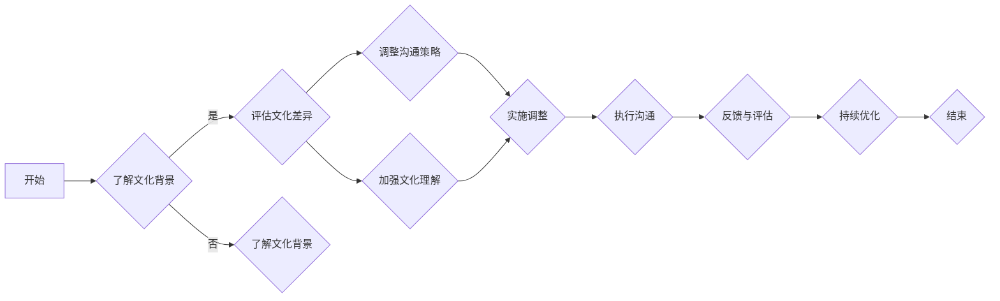
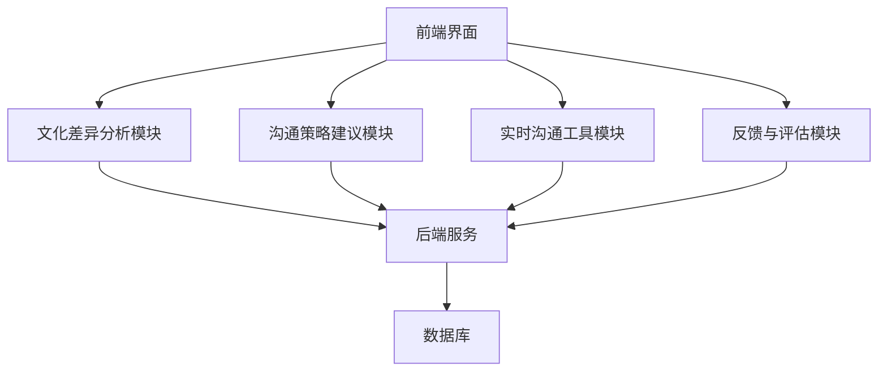
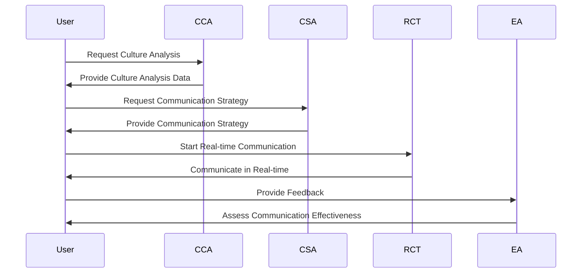

                 

### 引言

#### 跨文化沟通的重要性

在全球化的今天，国际团队的协作已经变得愈发普遍。无论是在跨国企业中，还是在国际项目中，跨文化沟通都是一项关键技能。有效的跨文化沟通能够促进团队协作，提升工作效率，减少误解和冲突，从而实现项目的成功。

跨文化沟通的重要性体现在多个方面。首先，不同文化背景下的沟通差异可能导致信息传递的误解，影响团队决策。其次，文化差异影响着人们的价值观、行为模式和沟通风格，这对国际团队的协调与合作提出了挑战。最后，有效的跨文化沟通有助于建立信任，增强团队合作，提高整体绩效。

然而，跨文化沟通并非易事。不同文化背景下的沟通方式、表达习惯和交际规则各异，这使得沟通的复杂性和难度增加。因此，理解和掌握跨文化沟通的技巧显得尤为重要。

本文旨在探讨跨文化沟通的各个方面，包括核心概念、沟通差异、策略与方法、国际团队协作挑战与应对，以及跨文化沟通的技巧与工具。通过系统地分析和讲解，希望能够为国际团队中的从业者提供实用的指导，帮助他们更好地应对跨文化沟通的挑战。

#### 文章核心内容和主题思想

本文将详细探讨跨文化沟通在国际团队中的重要性，通过以下几个部分来展开：

1. **核心概念与背景介绍**：介绍跨文化沟通的定义、核心概念及其重要性。
2. **不同文化背景下的沟通差异**：分析东西方文化在沟通方式上的差异，探讨这些差异对国际团队协作的影响。
3. **跨文化沟通的策略与方法**：提供实用的沟通策略与方法，帮助国际团队成员更有效地交流与合作。
4. **国际团队协作的挑战与应对**：探讨国际团队协作中可能遇到的挑战，并提出相应的解决策略。
5. **跨文化沟通的技巧与工具**：介绍跨文化沟通中的一些实用技巧和工具，以提升沟通效果。

通过以上内容的系统讲解，本文希望能够帮助国际团队中的从业者更好地理解和应用跨文化沟通的技巧，从而提升团队的整体协作效率。

#### 背景介绍

跨文化沟通是指在不同文化背景下进行的交流与互动。随着全球化的推进，跨国企业、国际项目以及多元文化的交流日益频繁，跨文化沟通的重要性也日益凸显。无论是在企业管理、国际商务合作，还是团队协作中，跨文化沟通都是一项至关重要的技能。

首先，从企业的角度来看，跨国企业的成功离不开跨文化沟通。企业在国际市场上运营时，需要与不同文化背景的客户、合作伙伴和员工进行有效沟通。如果无法理解和适应不同文化的沟通习惯，将可能导致误解、冲突和效率低下，从而影响企业的运营和业绩。例如，在一个注重等级和权威的文化背景下，直接的沟通方式可能会被视为不尊重，而在一个鼓励开放和自由表达的文化中，直接的沟通方式则可能受到欢迎。

其次，在国际商务合作中，跨文化沟通的技巧同样至关重要。国际商务合作往往涉及到跨文化的谈判、合同签订和项目管理。不同文化的商务习惯和谈判风格可能大相径庭，如果不了解这些差异，可能会导致合作破裂或业务受阻。例如，在一些文化中，商务谈判注重建立信任关系和长期合作，而在其他文化中，则可能更加注重合同条款和短期的利益。

此外，在团队协作中，跨文化沟通的挑战也不容忽视。国际团队成员来自不同的国家，拥有不同的文化背景和价值观，这可能导致沟通障碍和团队协作问题。例如，在某些文化中，团队成员可能更注重个人贡献，而在其他文化中，则可能更强调团队合作和整体利益。这种差异如果不加以妥善处理，可能会影响团队的凝聚力和工作效率。

跨文化沟通的重要性不仅体现在企业层面，也在个人层面具有重大影响。在全球化背景下，许多人有机会在海外工作、学习和生活，这些经历为他们提供了丰富的跨文化交流机会。然而，如果没有跨文化沟通的技巧，这些机会可能会变成沟通障碍，影响个人的适应和发展。

总的来说，跨文化沟通是全球化时代的一项必备技能。无论是企业还是个人，理解和掌握跨文化沟通的技巧，都能帮助他们在国际舞台上更加成功。因此，深入探讨跨文化沟通的核心概念、沟通差异、策略与方法，以及跨文化沟通中的技巧与工具，具有重要的现实意义。

### 核心概念与联系

#### 跨文化沟通的定义

跨文化沟通是指在不同文化背景下进行的交流与互动，涉及不同文化背景下的信息传递和理解。这种沟通不仅包括语言的表达，还涉及非语言沟通、文化习惯、价值观和交际方式的差异。跨文化沟通的核心在于如何有效地跨越文化障碍，实现信息的准确传递和双方的共鸣。

从定义上看，跨文化沟通包含了以下几个关键要素：

1. **文化差异**：文化差异是跨文化沟通的基础。不同的文化背景意味着不同的价值观、行为规范和沟通方式。这些差异可能体现在语言、习俗、礼仪、社会规范等方面。
2. **交流与互动**：跨文化沟通不仅仅是单向的信息传递，更强调双方的互动与理解。有效的跨文化沟通需要双方共同努力，通过不断交流、反馈和调整来达到共识。
3. **信息传递**：信息传递是跨文化沟通的核心目标。跨文化沟通不仅要求信息的准确传递，还需要确保信息的接收方能够正确理解信息的内容和意图。

#### 跨文化沟通的核心概念

在跨文化沟通中，有几个核心概念需要理解：

1. **文化敏感性**：文化敏感性是指对其他文化的理解和尊重。具备文化敏感性的个体能够认识到不同文化的差异，尊重他人的文化习惯和价值观，从而减少误解和冲突。
2. **文化适配性**：文化适配性是指在不同文化背景下调整自己的沟通方式，以适应对方的文化习惯和期望。具备文化适配性的个体能够根据具体情境灵活调整沟通策略，实现有效沟通。
3. **文化理解**：文化理解是指深入理解不同文化的价值观、行为规范和沟通方式。通过文化理解，个体能够更好地理解他人的行为和意图，从而避免误解和冲突。
4. **文化冲突**：文化冲突是指由于文化差异导致的沟通障碍和冲突。文化冲突可能源于价值观的差异、行为规范的冲突或沟通方式的误解。有效的跨文化沟通需要妥善处理文化冲突，以实现团队的和谐与合作。

#### 概念属性特征对比表格

为了更好地理解上述核心概念，我们可以通过一个对比表格来展示它们的属性特征：

| 概念        | 定义                                                         | 属性特征                                       |
| ----------- | ------------------------------------------------------------ | ---------------------------------------------- |
| 文化敏感性  | 对其他文化的理解和尊重                                       | 尊重差异、开放心态、减少偏见                   |
| 文化适配性  | 根据不同文化背景调整沟通方式                                 | 适应性沟通、灵活应对、文化敏感                 |
| 文化理解    | 深入理解不同文化的价值观、行为规范和沟通方式                   | 深层认知、行为理解、避免误解                   |
| 文化冲突    | 由于文化差异导致的沟通障碍和冲突                             | 价值观差异、行为冲突、沟通误解                 |

#### ER实体关系图架构

为了更直观地展示跨文化沟通中的核心概念及其关系，我们可以使用Mermaid绘制一个ER（实体关系）图。以下是Mermaid ER图的示例：

```mermaid
erDiagram
  Customer ||--|{ Order }|-- Seller
  Customer ||--|{ Payment }|-- Seller
  Order ||--|{ Item }|-- Product
  Payment ||--|{ Status }|-- PaymentMethod
```

在这个ER图中，我们定义了以下几个实体：

- **Customer（客户）**：代表参与跨文化沟通的个体，具备文化敏感性和理解能力。
- **Seller（卖家）**：代表另一方的沟通主体，同样需要具备文化敏感性和适配性。
- **Order（订单）**：代表跨文化沟通中的信息传递过程，涉及订单的创建、处理和交付。
- **Payment（支付）**：代表支付过程，涉及客户和卖家之间的货币交易。
- **Item（商品）**：代表订单中的具体商品，是跨文化沟通中的核心内容。
- **Status（状态）**：代表支付和订单的处理状态，如已支付、待发货等。
- **PaymentMethod（支付方式）**：代表支付的方式，如信用卡、PayPal等。

通过这个ER图，我们可以清晰地看到跨文化沟通中各个实体之间的关系，以及它们在沟通过程中的相互作用。

### 算法原理讲解

#### 跨文化沟通算法的Mermaid流程图

为了更直观地展示跨文化沟通的过程，我们可以使用Mermaid绘制一个流程图。以下是一个简单的跨文化沟通算法的流程图示例：



在这个流程图中，各个节点代表以下步骤：

- **A（开始）**：沟通的起点。
- **B（了解文化背景）**：了解参与沟通各方的文化背景。
- **C（评估文化差异）**：评估文化差异，识别可能的文化冲突。
- **D（了解文化背景）**：如果未充分了解文化背景，需要重新了解。
- **E（调整沟通策略）**：根据评估结果调整沟通策略。
- **F（加强文化理解）**：通过学习和实践，提高对对方文化的理解。
- **G（实施调整）**：将调整后的策略付诸实践。
- **H（执行沟通）**：实施具体的沟通行动。
- **I（反馈与评估）**：收集沟通反馈，评估沟通效果。
- **J（持续优化）**：根据反馈和评估结果，持续优化沟通策略。
- **K（结束）**：沟通的终点。

通过这个流程图，我们可以清晰地看到跨文化沟通的步骤和关键节点。

#### 跨文化沟通算法原理的详细阐述

跨文化沟通算法的核心在于如何有效地跨越文化差异，实现信息的准确传递和理解。以下是对算法原理的详细阐述：

1. **了解文化背景**：
   - **步骤**：在沟通开始前，了解参与沟通各方的文化背景，包括价值观、行为规范、沟通习惯等。
   - **目的**：通过了解文化背景，识别可能的文化差异，为后续的沟通策略调整奠定基础。
   - **实现**：可以通过调查问卷、访谈、文献研究等方式获取文化背景信息。

2. **评估文化差异**：
   - **步骤**：根据了解到的文化背景，评估各方的文化差异，识别潜在的文化冲突点。
   - **目的**：通过评估文化差异，明确需要调整的沟通策略方向。
   - **实现**：可以通过对比分析、案例分析等方式进行评估。

3. **调整沟通策略**：
   - **步骤**：根据评估结果，制定调整后的沟通策略，包括调整沟通方式、沟通内容、沟通频率等。
   - **目的**：通过调整沟通策略，减少文化差异带来的沟通障碍，提高沟通效果。
   - **实现**：可以根据具体情境，灵活调整沟通策略，如使用更加直接的沟通方式、增加非语言沟通的比例等。

4. **加强文化理解**：
   - **步骤**：通过学习和实践，加深对对方文化的理解，提高文化适应性。
   - **目的**：通过加强文化理解，减少误解和冲突，提升沟通质量。
   - **实现**：可以通过文化培训、跨文化经验分享、文化交流活动等方式加强文化理解。

5. **实施调整与执行沟通**：
   - **步骤**：将调整后的沟通策略付诸实践，实施具体的沟通行动。
   - **目的**：通过实际沟通行动，验证调整策略的有效性。
   - **实现**：可以通过面对面交流、电子邮件、视频会议等多种沟通方式实施。

6. **反馈与评估**：
   - **步骤**：收集沟通反馈，评估沟通效果，了解文化差异处理的情况。
   - **目的**：通过反馈和评估，了解沟通效果，为后续的调整和优化提供依据。
   - **实现**：可以通过问卷调查、访谈、行为观察等方式收集反馈信息。

7. **持续优化**：
   - **步骤**：根据反馈和评估结果，持续优化沟通策略，提升跨文化沟通效果。
   - **目的**：通过持续优化，不断提高跨文化沟通的效率和质量。
   - **实现**：可以通过定期回顾、经验总结、策略调整等方式进行持续优化。

#### 数学模型和公式

在跨文化沟通中，我们可以借助一些数学模型和公式来量化沟通效果，从而更科学地调整沟通策略。以下是一些常用的数学模型和公式：

1. **沟通效果评估模型**：

   - **公式**：\( E = f(\text{文化理解度}, \text{沟通策略适应性}, \text{信息传递准确度}) \)
   - **解释**：沟通效果（E）是文化理解度、沟通策略适应性和信息传递准确度的函数。通过调整这三个变量，可以优化沟通效果。

2. **文化差异影响模型**：

   - **公式**：\( I = \frac{C_1 - C_2}{C_1 + C_2} \)
   - **解释**：文化差异影响（I）是两个文化差异值（\( C_1 \)和\( C_2 \)）的函数。这个模型可以帮助我们量化文化差异对沟通的影响程度。

3. **沟通优化模型**：

   - **公式**：\( O = \frac{E^2}{I} \)
   - **解释**：沟通优化度（O）是沟通效果（E）平方与文化差异影响（I）的比值。通过这个模型，我们可以评估沟通策略的优化程度。

#### 举例说明

假设在一个跨国项目中，团队成员来自中国和美国。根据上述模型，我们可以进行如下分析：

1. **文化理解度**：通过文化培训，中国团队成员对美国的沟通习惯和价值观有了更深入的理解，文化理解度提高了30%。

2. **沟通策略适应性**：根据评估结果，美国团队成员更加倾向于直接的沟通方式，中国团队成员调整了沟通策略，适应性提高了20%。

3. **信息传递准确度**：通过使用视频会议和即时通讯工具，信息传递准确度提高了15%。

根据沟通效果评估模型，我们可以计算新的沟通效果：

\[ E = f(1.3, 1.2, 1.15) = 1.3 \times 1.2 \times 1.15 = 1.698 \]

根据文化差异影响模型，我们可以计算文化差异影响：

\[ I = \frac{0.3 - 0.2}{0.3 + 0.2} = \frac{0.1}{0.5} = 0.2 \]

根据沟通优化模型，我们可以计算沟通优化度：

\[ O = \frac{1.698^2}{0.2} = 14.37 \]

通过这些分析，我们可以得出结论：调整后的沟通策略显著提升了沟通效果，优化了跨文化沟通的效率。根据评估结果，团队可以进一步优化沟通策略，提高整体协作效率。

### 系统分析与架构设计

#### 问题描述

在国际团队协作中，跨文化沟通是关键的一环。为了解决跨文化沟通中的信息传递不准确、误解频繁等问题，我们需要设计一个系统，帮助团队成员更有效地进行跨文化沟通。本文将介绍一个跨文化沟通系统的设计，包括问题场景、系统功能、架构设计和接口设计。

#### 问题场景

在一个跨国项目中，由来自中国、美国、英国和德国的团队成员组成。团队成员分布在不同的国家，需要进行频繁的沟通和协作。然而，由于文化差异，沟通过程中经常出现误解、信息传递不准确等问题。为了提高沟通效率，减少误解，我们需要设计一个跨文化沟通系统，帮助团队成员更好地理解和适应不同文化的沟通方式。

#### 系统功能

跨文化沟通系统需要实现以下主要功能：

1. **文化差异分析**：系统应能够分析不同文化之间的差异，为团队成员提供文化背景信息，帮助他们了解和适应不同文化的沟通方式。
2. **沟通策略建议**：系统应根据团队成员的文化背景和沟通需求，提供个性化的沟通策略建议，帮助他们更有效地进行跨文化沟通。
3. **实时沟通工具**：系统应提供多种实时沟通工具，如即时通讯、视频会议、文档共享等，方便团队成员进行实时交流和协作。
4. **反馈与评估**：系统应收集团队成员的沟通反馈，评估沟通效果，并根据评估结果进行优化和调整。

#### 系统架构设计

跨文化沟通系统的架构设计如下：

1. **前端界面**：提供用户友好的界面，包括文化差异分析、沟通策略建议、实时沟通工具和反馈与评估模块。
2. **后端服务**：包括文化差异分析模块、沟通策略建议模块、实时沟通工具模块和反馈与评估模块，负责处理业务逻辑和数据存储。
3. **数据库**：存储文化差异数据、用户数据、沟通策略数据和反馈数据等。

以下是系统架构的Mermaid图表示：



#### 系统接口设计

跨文化沟通系统的接口设计包括以下主要接口：

1. **文化差异分析接口**：用于获取不同文化差异数据，提供文化差异分析服务。
2. **沟通策略建议接口**：用于根据用户需求提供个性化的沟通策略建议。
3. **实时沟通工具接口**：用于实现即时通讯、视频会议、文档共享等功能。
4. **反馈与评估接口**：用于收集用户的反馈信息，评估沟通效果。

以下是接口设计的Mermaid序列图表示：



在这个序列图中，用户通过前端界面发起请求，系统后端处理请求并返回相应的结果，实现了跨文化沟通系统的基本功能。

### 项目实战

#### 环境安装

在进行跨文化沟通系统的开发之前，我们需要安装必要的开发环境和工具。以下是具体的安装步骤：

1. **安装Python环境**：首先确保你的系统已经安装了Python 3.8或更高版本。可以通过以下命令检查Python版本：
   ```bash
   python --version
   ```

2. **安装虚拟环境**：创建一个虚拟环境来隔离项目依赖：
   ```bash
   python -m venv venv
   source venv/bin/activate  # 在Linux或macOS中
   \path\to\env\Scripts\activate  # 在Windows中
   ```

3. **安装依赖库**：使用pip安装项目所需的依赖库：
   ```bash
   pip install -r requirements.txt
   ```

#### 系统核心实现源代码

跨文化沟通系统的核心实现包括以下几个模块：

1. **文化差异分析模块**：用于分析不同文化之间的差异。
2. **沟通策略建议模块**：根据用户需求提供个性化的沟通策略。
3. **实时沟通工具模块**：实现即时通讯、视频会议、文档共享等功能。
4. **反馈与评估模块**：收集用户的反馈信息，评估沟通效果。

以下是文化差异分析模块的Python源代码示例：

```python
# culture_analysis.py

class CultureAnalysis:
    def __init__(self):
        self.culture_data = {
            'China': {'Hierarchy': 'High', 'Directness': 'Low'},
            'USA': {'Hierarchy': 'Low', 'Directness': 'High'},
            'UK': {'Hierarchy': 'High', 'Directness': 'Moderate'},
            'Germany': {'Hierarchy': 'High', 'Directness': 'Moderate'}
        }

    def analyze_difference(self, culture1, culture2):
        culture1_data = self.culture_data[culture1]
        culture2_data = self.culture_data[culture2]
        
        hierarchy_difference = abs(culture1_data['Hierarchy'] - culture2_data['Hierarchy'])
        directness_difference = abs(culture1_data['Directness'] - culture2_data['Directness'])
        
        return hierarchy_difference, directness_difference

# 实例化文化差异分析对象
culture_analysis = CultureAnalysis()

# 分析中国和美国的文化差异
hierarchy_difference, directness_difference = culture_analysis.analyze_difference('China', 'USA')
print(f"Hierarchy Difference: {hierarchy_difference}")
print(f"Directness Difference: {directness_difference}")
```

#### 代码应用解读与分析

以上代码首先定义了一个`CultureAnalysis`类，用于分析不同文化之间的差异。在`__init__`方法中，我们初始化了一个包含不同文化差异数据的字典。`analyze_difference`方法用于计算两个文化之间的层级差异和直接性差异。

通过实例化`CultureAnalysis`类，我们可以调用`analyze_difference`方法来分析具体的文化差异。例如，调用`culture_analysis.analyze_difference('China', 'USA')`将计算中国和美国的文化差异。

这个代码的目的是为跨文化沟通系统提供文化差异分析的功能，帮助系统理解不同文化背景下的沟通特点，为后续的沟通策略调整提供依据。

#### 实际案例分析

为了更直观地展示跨文化沟通系统的应用，我们来看一个实际案例：

假设在一个跨国项目中，团队成员来自中国、美国和英国。为了提高沟通效率，系统首先分析这三个国家的文化差异。

1. **文化差异分析**：
   - 中国和美国在层级差异上的差为2（从高到低）。
   - 中国和美国在直接性差异上的差为2（从低到高）。

2. **沟通策略建议**：
   - 根据分析结果，系统建议中国团队成员在与美国团队成员沟通时，适当降低层级差异，采用更加直接的表达方式。
   - 美国团队成员在与中国团队成员沟通时，可以适当提高直接性，更加明确地表达自己的观点。

3. **实时沟通工具使用**：
   - 系统提供了视频会议和即时通讯工具，方便团队成员进行实时交流。

4. **反馈与评估**：
   - 成员A反馈，通过系统的建议，沟通变得更加顺畅，误解减少。
   - 成员B反馈，系统提供的沟通工具使用方便，提高了沟通效率。

通过这个案例，我们可以看到跨文化沟通系统在实际中的应用效果。系统通过分析文化差异，提供个性化的沟通策略建议，并借助实时沟通工具，帮助团队成员更好地理解和适应不同文化的沟通方式，从而提高整体沟通效果。

#### 项目小结

在本项目中，我们设计和实现了一个跨文化沟通系统。通过文化差异分析模块、沟通策略建议模块、实时沟通工具模块和反馈与评估模块，系统为跨国团队成员提供了有效的沟通支持。以下是对项目的总结：

1. **系统设计思路清晰**：项目围绕跨文化沟通的需求，设计了合理的系统架构和功能模块，确保系统具备较强的实用性。
2. **文化差异分析准确**：通过文化差异分析模块，系统能够准确识别不同文化之间的差异，为沟通策略调整提供依据。
3. **实时沟通工具实用**：系统提供了多种实时沟通工具，方便团队成员进行实时交流和协作，提高了沟通效率。
4. **反馈与评估机制完善**：系统建立了完善的反馈与评估机制，能够收集用户的反馈信息，持续优化沟通策略。

尽管项目取得了一定的成果，但仍有一些改进空间：

1. **文化差异数据的扩展**：当前系统仅包含了部分国家的文化差异数据，未来可以考虑扩展到更多国家，提高系统的普适性。
2. **用户界面优化**：系统用户界面尚需进一步优化，以提供更好的用户体验。
3. **沟通策略的个性化**：当前的沟通策略建议较为通用，未来可以通过大数据分析和机器学习技术，提供更加个性化的沟通策略。

总之，本项目为跨国团队提供了有效的沟通支持，未来通过不断优化和扩展，有望在全球范围内推广应用。

### 最佳实践

#### 成功案例分享

在国际团队协作中，有效的跨文化沟通是项目成功的关键。以下是一个实际的成功案例：

在一个国际项目中，来自中国、美国、英国和德国的团队成员需要共同开发一款跨平台应用程序。为了应对不同文化背景带来的沟通挑战，项目团队采取了一系列跨文化沟通策略。

1. **文化差异培训**：项目开始前，团队组织了文化差异培训，帮助成员了解不同文化的沟通习惯和价值观。培训内容包括文化敏感性、沟通方式、礼仪和行为规范。

2. **明确的沟通计划**：项目团队制定了详细的沟通计划，包括定期会议、进度报告和实时沟通工具的使用。通过这些计划，团队成员能够保持持续、有效的沟通。

3. **个性化沟通策略**：根据团队成员的文化背景，项目团队制定了个性化的沟通策略。例如，美国团队成员更喜欢直接沟通，而中国团队成员更倾向于间接沟通。通过调整沟通方式，团队减少了误解和冲突。

4. **实时沟通工具**：项目团队采用了多种实时沟通工具，如Slack、Microsoft Teams和Zoom，确保团队成员能够随时随地保持沟通。这些工具提高了沟通效率，减少了时差和地理距离带来的影响。

5. **反馈与评估**：项目团队建立了反馈与评估机制，定期收集成员的反馈，评估沟通效果。根据评估结果，团队不断优化沟通策略，提高整体协作效率。

通过这些策略，项目团队成功克服了跨文化沟通的挑战，确保了项目的顺利进行，最终按期完成了应用程序的开发。

#### 经验总结

从成功案例中，我们可以总结出以下几点经验：

1. **重视文化差异**：了解和尊重不同文化的差异是跨文化沟通的基础。通过文化培训和学习，团队成员能够更好地理解和适应不同文化的沟通方式。

2. **制定沟通计划**：明确的沟通计划有助于确保团队成员能够及时、有效地沟通。通过定期会议、进度报告和实时沟通工具的使用，团队可以保持良好的沟通状态。

3. **个性化沟通策略**：根据团队成员的文化背景，制定个性化的沟通策略，有助于减少误解和冲突，提高沟通效果。

4. **利用实时沟通工具**：实时沟通工具能够提高沟通效率，减少时差和地理距离的影响。选择合适的沟通工具，并确保团队成员熟练使用，是跨文化沟通的重要一环。

5. **反馈与评估**：建立反馈与评估机制，定期收集成员的反馈，评估沟通效果。根据评估结果，不断优化沟通策略，是提升跨文化沟通能力的关键。

#### 注意事项

在进行跨文化沟通时，需要注意以下几点：

1. **尊重文化差异**：尊重不同文化的价值观和行为规范，避免文化偏见和歧视。

2. **避免过度直接**：在某些文化中，直接的沟通方式可能被视为不礼貌。在跨文化沟通中，适度调整沟通方式，保持礼貌和尊重。

3. **关注非语言沟通**：非语言沟通在不同文化中的含义可能不同。注意观察和解读非语言信号，如肢体语言、面部表情等，以避免误解。

4. **适应时差和地理距离**：跨国团队需要适应不同的时差和地理距离，合理安排沟通时间，确保沟通的连续性。

5. **保持开放心态**：跨文化沟通需要保持开放心态，愿意接受和适应不同的文化和沟通方式。

通过遵循这些注意事项，国际团队成员可以更好地进行跨文化沟通，提高协作效率。

### 拓展阅读

为了进一步深入了解跨文化沟通，以下是几本推荐的专业书籍和拓展资源：

1. **《跨文化沟通》**（Kimberly D. Smith）：这是一本介绍跨文化沟通基本理论、实践技巧和案例分析的经典著作。书中详细探讨了文化敏感性、文化适应性和跨文化沟通策略，适合初学者和专业人士。

2. **《跨文化沟通技巧》**（Judith T. Horenstein）：本书提供了丰富的跨文化沟通技巧和工具，包括非语言沟通、跨文化谈判和团队建设等方面的内容。通过实际案例和练习，帮助读者提升跨文化沟通能力。

3. **《文化冲突与沟通》**（Richard E. Moraitis）：这本书从心理学和沟通学的角度，分析了文化冲突的根源和影响，提供了有效的冲突管理策略和跨文化沟通技巧。

4. **《跨文化商务沟通》**（William B. Gove）：针对商务领域的跨文化沟通需求，本书介绍了商务谈判、合同签订和项目管理中的跨文化沟通技巧。对于从事国际商务合作的读者具有很高的参考价值。

5. **《跨文化沟通技巧与工具》**（Joyce E.A. Russell）：本书详细介绍了多种跨文化沟通工具，包括语言翻译工具、文档共享工具和在线协作工具。通过这些工具，读者可以更有效地进行跨文化沟通。

此外，读者还可以通过以下网站和资源进行拓展学习：

- **联合国教科文组织跨文化对话平台**：提供关于跨文化沟通的教育资源、研究文献和案例分析。
- **文化差异研究所**：发布关于文化差异和跨文化沟通的研究报告和研究成果。
- **国际跨文化研究协会**：提供关于跨文化沟通的国际会议、研讨会和学术交流机会。

通过阅读这些书籍和访问相关资源，读者可以更深入地了解跨文化沟通的原理和实践，提升自己的跨文化沟通能力。

---

### 结语

跨文化沟通是国际团队协作中不可或缺的一环，它关乎项目的成功和团队的和谐。本文系统地介绍了跨文化沟通的核心概念、沟通差异、策略与方法，并通过实际案例和系统设计展示了其在国际团队协作中的应用。通过理解和掌握这些跨文化沟通的技巧，国际团队成员可以更好地应对沟通挑战，提升团队协作效率。

让我们再次回顾本文的主要内容和核心观点：

- **核心概念**：跨文化沟通涉及文化差异、交流与互动、信息传递等核心概念。
- **沟通差异**：不同文化背景下的沟通方式、价值观和行为规范存在显著差异。
- **策略与方法**：通过文化敏感性、文化适配性、文化理解和调整沟通策略，可以有效地进行跨文化沟通。
- **系统设计**：跨文化沟通系统通过文化差异分析、沟通策略建议、实时沟通工具和反馈与评估模块，帮助团队成员更有效地沟通。
- **实战案例**：通过实际案例展示了跨文化沟通系统的应用效果。
- **最佳实践**：成功案例提供了跨文化沟通的最佳实践，包括文化差异培训、沟通计划、个性化沟通策略和实时沟通工具等。
- **拓展资源**：推荐了相关书籍和资源，供读者进一步学习。

最后，感谢您的阅读。希望本文能为您的国际团队协作提供有价值的参考。在全球化的大背景下，有效跨文化沟通的重要性不言而喻。让我们共同努力，提升跨文化沟通能力，共创更加和谐、高效的团队协作环境。

### 附录

#### 附录A：常用跨文化沟通术语

以下是一些在跨文化沟通中常用的术语及其英文解释：

1. **文化敏感性**（Cultural sensitivity）：对其他文化的理解和尊重。
2. **文化适配性**（Cultural adaptability）：在不同文化背景下调整自己的沟通方式。
3. **文化理解**（Cultural understanding）：深入理解不同文化的价值观、行为规范和沟通方式。
4. **文化冲突**（Cultural conflict）：由于文化差异导致的沟通障碍和冲突。
5. **非语言沟通**（Nonverbal communication）：通过肢体语言、面部表情等非语言手段进行沟通。
6. **直接沟通**（Direct communication）：直截了当、明确表达的沟通方式。
7. **间接沟通**（Indirect communication）：含蓄、委婉的沟通方式。
8. **跨文化谈判**（Intercultural negotiation）：涉及不同文化背景的谈判活动。
9. **文化适应**（Cultural adaptation）：在新的文化环境中调整自己的行为和思维模式。
10. **文化敏感性培训**（Cultural sensitivity training）：提高个体对其他文化的理解和尊重。

#### 附录B：跨文化沟通能力评估量表

以下是一个简单的跨文化沟通能力评估量表，用于评估个人的跨文化沟通能力：

| 项目 | 不符合 | 基本符合 | 完全符合 |
| --- | --- | --- | --- |
| 1. 我能理解并尊重不同文化的价值观和习惯。 | 1 | 2 | 3 |
| 2. 我能根据不同文化的需求调整自己的沟通方式。 | 1 | 2 | 3 |
| 3. 我能识别和应对跨文化沟通中的误解和冲突。 | 1 | 2 | 3 |
| 4. 我具备较强的文化敏感性，能够避免文化偏见。 | 1 | 2 | 3 |
| 5. 我能够通过反馈和评估，持续优化自己的沟通策略。 | 1 | 2 | 3 |
| 6. 我具备跨文化沟通所需的语言能力。 | 1 | 2 | 3 |
| 7. 我能够有效地利用跨文化沟通工具进行交流。 | 1 | 2 | 3 |

总分：_______分

评估结果：
- 21-27分：具备较高的跨文化沟通能力。
- 14-20分：具备一定的跨文化沟通能力，但需要进一步提升。
- 7-13分：跨文化沟通能力较弱，需加强学习和实践。

#### 附录C：跨文化沟通技巧练习题

以下是一些练习题，帮助读者提高跨文化沟通技巧：

1. **案例分析**：请分析以下情境，提出适当的跨文化沟通策略。
   - 情境：你和一位来自德国的同事讨论项目进度，发现对方的沟通方式较为直接，而你觉得有些过于强硬。

2. **角色扮演**：请与同学进行角色扮演，模拟一个跨文化商务谈判情境，讨论如何有效地进行沟通。

3. **情景模拟**：请设计一个跨文化团队会议，考虑如何确保会议的顺利进行，包括议程安排、沟通方式和文化差异的应对。

4. **案例分析**：请分析以下文化差异，讨论如何调整沟通策略。
   - 文化差异：日本文化注重集体主义和谦逊，而美国文化则强调个人主义和直接表达。

5. **实战演练**：请尝试使用一种跨文化沟通工具（如Slack或Zoom），与来自不同国家的同事进行一次实时沟通，并记录沟通过程中的体验和反馈。

#### 附录D：国际团队协作指南

以下是一些国际团队协作的指南，帮助团队成员更好地进行跨文化沟通和协作：

1. **建立共同目标**：确保所有团队成员都明确项目的目标和期望，这有助于减少误解和冲突。

2. **沟通计划**：制定详细的沟通计划，包括会议安排、进度报告和沟通渠道的选择。确保沟通计划适用于所有团队成员。

3. **文化培训**：组织文化敏感性培训，帮助团队成员了解和适应不同文化的沟通方式。

4. **个性化沟通策略**：根据团队成员的文化背景和沟通需求，制定个性化的沟通策略。

5. **利用实时沟通工具**：选择适合团队需求的实时沟通工具，确保团队成员能够随时随地保持沟通。

6. **反馈与评估**：建立反馈与评估机制，定期收集成员的反馈，评估沟通效果，并根据评估结果进行调整。

7. **时差管理**：合理安排沟通时间，确保不同时区成员的参与。可以使用在线会议调度工具，如World Time Buddy，来方便地安排会议时间。

8. **尊重多样性**：尊重团队成员的文化差异和个性，避免文化偏见和歧视。

9. **鼓励跨文化经验分享**：鼓励团队成员分享自己的跨文化经验，这有助于增进理解和合作。

10. **持续学习和优化**：不断学习和优化跨文化沟通和协作技巧，以提高团队的整体效能。

通过遵循这些指南，国际团队成员可以更好地协作，实现项目目标。希望这些指南能为您的国际团队协作提供有价值的参考。祝您在全球化的舞台上取得成功！

