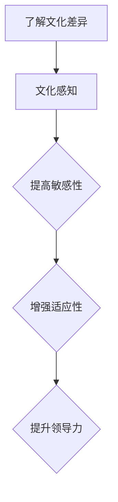
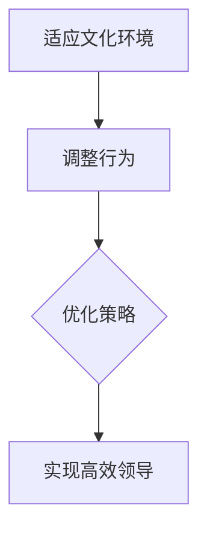
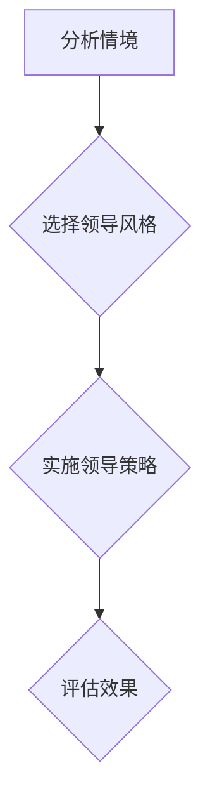
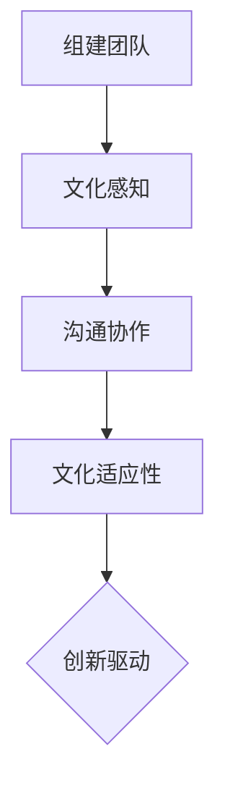
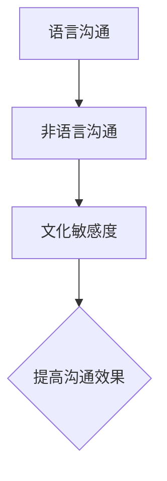

                 

# 跨文化领导力：在全球化环境中的成功之道

## 关键词

- 跨文化领导力
- 全球化
- 领导风格
- 沟通技巧
- 团队建设

## 摘要

本文探讨了在全球化环境中，如何通过有效的跨文化领导力实现组织成功。通过定义跨文化领导力的核心概念，分析其在全球化背景下的重要性，以及提出实用的方法和策略，本文旨在为IT领域的领导者提供一套系统的跨文化领导力框架，帮助他们在多元化的团队中实现高效领导和团队协作。

## 目录大纲设计过程

在设计《跨文化领导力：在全球化环境中的成功之道》的目录大纲时，我们需要遵循以下步骤：

1. **了解书的核心主题**：首先，我们需要深入了解书的核心主题——跨文化领导力。这包括了解跨文化的定义、跨文化领导力的概念、其重要性以及在全球化环境中的应用。

2. **确定大纲结构**：根据书的主题和目标读者，确定大纲的基本结构。大纲通常包含以下几个部分：引言、背景介绍、核心概念与理论、案例分析、实践指南、总结与展望。

3. **细化章节内容**：在每个部分下细化章节内容，确保每个章节都有明确的主题和目的。例如，在背景介绍部分，可以包含跨文化领导力的起源、发展历程以及其在全球化中的重要性。

4. **设计子章节**：在每个主要章节下，设计子章节，进一步细化内容。例如，在核心概念与理论部分，可以包含跨文化领导力的核心概念、关键理论以及不同文化间的差异分析。

5. **构建流程图与公式**：为了更好地阐述概念和理论，我们可以使用Mermaid流程图和LaTeX公式来展示算法原理、系统架构等。

6. **整合所有内容**：最后，将所有章节内容整合到一起，确保整个目录大纲的逻辑性和完整性。

### 目录大纲

---

## 第一部分：跨文化领导力基础

### 第1章：跨文化领导力的起源与发展

- **1.1 引言**
  - 问题背景
  - 问题描述
  - 问题解决
  - 边界与外延

- **1.2 跨文化领导力的定义与概念**
  - 核心概念
  - 概念属性特征对比表格
  - ER实体关系图架构

- **1.3 全球化环境下的领导力挑战**
  - 跨文化差异对领导力的影响
  - 领导力需求的变化
  - 成功的跨文化领导力标准

- **1.4 跨文化领导力的核心理论**
  - 文化维度理论
  - 自我认知理论
  - 领导风格理论

- **1.5 本章小结**

---

## 第二部分：跨文化领导力核心概念与联系

### 第2章：跨文化领导力的核心概念

- **2.1 文化感知能力**
  - 概念原理
  - Mermaid流程图

- **2.2 文化适应性**
  - 概念原理
  - Mermaid流程图

- **2.3 情境领导**
  - 概念原理
  - Mermaid流程图

- **2.4 建立跨文化团队**
  - 概念原理
  - Mermaid流程图

- **2.5 跨文化沟通技巧**
  - 概念原理
  - Mermaid流程图

- **2.6 本章小结**

---

## 第三部分：跨文化领导力案例分析

### 第3章：全球知名企业的跨文化领导力实践

- **3.1 谷歌的跨文化领导力实践**
  - 案例分析
  - 实践解读

- **3.2 苹果公司的跨文化领导力**
  - 案例分析
  - 实践解读

- **3.3 跨国银行在新兴市场的领导力策略**
  - 案例分析
  - 实践解读

- **3.4 本章小结**

---

## 第四部分：跨文化领导力的实践指南

### 第4章：提升跨文化领导力的方法与策略

- **4.1 增强文化感知能力**
  - 实践方法
  - 成功案例

- **4.2 提高文化适应性**
  - 实践方法
  - 成功案例

- **4.3 构建跨文化团队**
  - 实践方法
  - 成功案例

- **4.4 跨文化沟通技巧提升**
  - 实践方法
  - 成功案例

- **4.5 跨文化领导力的持续发展**
  - 实践方法
  - 成功案例

- **4.6 本章小结**

---

## 第五部分：跨文化领导力的未来展望

### 第5章：跨文化领导力的未来趋势与挑战

- **5.1 跨文化领导力的未来趋势**
  - 全球化背景下领导力的演变
  - 新兴文化的影响

- **5.2 跨文化领导力面临的挑战**
  - 多元文化冲突
  - 领导力的转型需求

- **5.3 跨文化领导力的持续发展路径**
  - 教育与培训
  - 组织文化变革

- **5.4 本章小结**

---

## 第六部分：附录

### 第6章：跨文化领导力工具与资源

- **6.1 常用跨文化评估工具**
  - 描述
  - 使用指南

- **6.2 跨文化领导力研究资源**
  - 学术期刊
  - 研究报告
  - 优秀案例

- **6.3 跨文化领导力书籍推荐**
  - 推荐书籍
  - 评价与推荐理由

- **6.4 本章小结**

---

以上就是《跨文化领导力：在全球化环境中的成功之道》的完整目录大纲。

### 背景介绍

在全球化的浪潮下，跨文化领导力的重要性愈发凸显。随着全球商业活动的频繁，组织在跨国界运营中面临着前所未有的挑战。这不仅包括如何管理多元化的团队，还涉及到如何在不同文化背景下实现高效的领导和协作。跨文化领导力，作为一种应对全球化挑战的领导艺术，成为了现代领导者必备的核心能力。

**核心概念术语说明**：
- **跨文化领导力**：指在多元化文化环境中，领导者通过理解和适应不同文化特点，从而有效管理和激励团队，实现组织目标的能力。
- **全球化**：指全球范围内的经济、政治、文化等领域的相互联系和互动。
- **领导力**：指领导者通过影响力、指导、激励等方式，引导和影响他人实现共同目标的能力。

**问题背景**：
全球化带来了人才流动、商业合作、技术创新等方面的机遇，但也带来了文化差异、沟通障碍、价值观冲突等挑战。这些挑战要求领导者具备跨文化领导力，以适应多元化环境，提升组织竞争力。

**问题描述**：
在全球化环境中，如何培养和提升跨文化领导力，以实现组织的成功和可持续发展？

**问题解决**：
通过深入理解跨文化领导力的核心概念、理论基础和实践方法，领导者可以有效地应对全球化带来的挑战，实现跨文化团队的高效运作。

**边界与外延**：
本文主要探讨跨文化领导力在商业环境中的应用，但跨文化领导力的概念和方法同样适用于其他领域，如教育、医疗等。

### 跨文化领导力的定义与概念

**核心概念**：

跨文化领导力是一种在多元化文化环境中，领导者通过理解和适应不同文化特点，从而有效管理和激励团队，实现组织目标的能力。它不仅涉及对文化差异的感知和适应，还包括领导者个人价值观、态度和行为的变化。

**概念属性特征对比表格**：

| 概念         | 属性特征                     | 对比分析                                                   |
| ------------ | ---------------------------- | ---------------------------------------------------------- |
| 文化感知能力 | 对不同文化的认知和感知       | 提高文化感知能力有助于更好地理解和适应多元文化环境           |
| 文化适应性   | 适应不同文化的能力           | 文化适应性强的领导者能更好地融入和影响多元文化团队           |
| 情境领导     | 根据不同情境调整领导风格     | 灵活运用情境领导理论，能提升领导效果                         |
| 团队建设     | 建立多元化团队的能力         | 强调团队多元化的重要性，有助于提升团队协作和创新能力         |
| 沟通技巧     | 有效沟通和协调不同文化背景的人 | 提高跨文化沟通技巧，能减少误解和冲突，增强团队凝聚力       |

**ER实体关系图架构**：

```mermaid
erDiagram
  产品 -->|1| 领导者
  团队    -->|1| 领导者
  文化    -->|1| 领导者
  环境    -->|1| 领导者
```

在这个ER图中，领导者是核心实体，与产品、团队、文化和环境等实体之间存在关联关系。这表明跨文化领导力涉及多个维度的因素，需要领导者全面考虑和应对。

### 全球化环境下的领导力挑战

**跨文化差异对领导力的影响**：

在全球化环境中，领导者面临的第一个挑战就是跨文化差异。不同文化在价值观、沟通方式、决策过程、工作习惯等方面存在显著差异。这些差异可能导致以下问题：

1. **沟通障碍**：文化差异可能导致沟通不畅，信息传递效率降低。
2. **决策困难**：不同文化对决策过程和决策风格有不同的偏好，可能导致决策过程复杂化。
3. **团队冲突**：多元文化背景的团队成员可能有不同的价值观和期望，容易产生冲突。

**领导力需求的变化**：

为了应对跨文化差异，领导者需要具备以下能力：

1. **文化感知能力**：领导者需要了解和感知不同文化的特点，提高对文化差异的敏感性。
2. **文化适应性**：领导者需要具备适应不同文化环境的能力，能够灵活调整领导风格和策略。
3. **情境领导**：领导者需要根据不同情境和团队成员的文化背景，采取适当的领导风格和方法。

**成功的跨文化领导力标准**：

成功的跨文化领导力标准包括以下几个方面：

1. **团队凝聚力**：领导者能够建立和维持一个团结协作的团队，成员之间相互信任和理解。
2. **文化适应性**：领导者能够适应不同文化环境，有效管理和激励多元化团队。
3. **决策能力**：领导者能够在跨文化背景下做出高效、合理的决策。
4. **创新能力**：领导者能够利用多元文化的优势，推动团队创新和持续发展。

### 跨文化领导力的核心理论

**文化维度理论**：

文化维度理论是由Hofstede提出的，用于描述不同文化在价值观和沟通方式上的差异。文化维度理论主要包括以下五个方面：

1. **权力距离**：指社会内部权力分配的不平等程度。
2. **不确定性规避**：指社会成员对不确定性和模糊性的容忍程度。
3. **个体主义与集体主义**：指社会成员对个人与集体的重视程度。
4. **男性主义与女性主义**：指社会成员对竞争和关怀的价值观偏好。
5. **长期取向与短期取向**：指社会成员对未来的规划和重视程度。

**自我认知理论**：

自我认知理论强调领导者对自己的认知和理解，包括自我意识、自我价值观和自我效能感等方面。自我认知理论认为，领导者需要深刻理解自己的价值观和行为模式，以提高领导效果。

**领导风格理论**：

领导风格理论包括多种模型，如费德勒模型、路径-目标模型、变革型领导理论等。这些理论描述了领导者在不同情境下应采取的领导风格，以实现团队的高效运作。

### 第2章：跨文化领导力的核心概念

**2.1 文化感知能力**

**概念原理**：

文化感知能力是指领导者对文化差异的感知和认知能力。它包括了解不同文化的价值观、沟通方式、工作习惯等方面，从而提高对文化差异的敏感性。

**Mermaid流程图**：



**2.2 文化适应性**

**概念原理**：

文化适应性是指领导者适应不同文化环境的能力。它包括领导者能够根据不同文化背景调整自己的行为和策略，以实现高效领导和团队协作。

**Mermaid流程图**：



**2.3 情境领导**

**概念原理**：

情境领导是指领导者根据不同情境和团队成员的文化背景，采取适当的领导风格和方法。情境领导强调灵活性和适应性，以实现团队的高效运作。

**Mermaid流程图**：



**2.4 建立跨文化团队**

**概念原理**：

建立跨文化团队是指领导者通过多元化团队的组建和管理，实现团队的高效运作和创新能力。它包括团队成员的文化感知、沟通协作和文化适应性等方面。

**Mermaid流程图**：



**2.5 跨文化沟通技巧**

**概念原理**：

跨文化沟通技巧是指领导者在不同文化背景下，有效沟通和协调不同文化背景的人的能力。它包括语言沟通、非语言沟通和文化敏感度等方面。

**Mermaid流程图**：



### 全球知名企业的跨文化领导力实践

**3.1 谷歌的跨文化领导力实践**

谷歌作为全球知名的科技公司，其成功的一个重要因素就是其跨文化领导力。谷歌在全球范围内招聘多元化人才，并在组织内部推行平等、包容和开放的价值观。以下是一些具体的实践：

1. **多元文化团队的组建**：谷歌鼓励跨文化团队的形成，通过多元化团队的创新和协作，推动公司的发展。

2. **文化感知培训**：谷歌为员工提供文化感知培训，帮助他们了解不同文化的特点和沟通方式，提高文化敏感度。

3. **领导力发展计划**：谷歌通过领导力发展计划，培养领导者跨文化领导力，提高其在多元化团队中的管理能力。

**实践解读**：

谷歌的跨文化领导力实践表明，多元化团队和文化感知能力是跨文化领导力的关键。通过组建多元文化团队和文化感知培训，谷歌能够激发员工的创造力，提高团队的协作效率。

**3.2 苹果公司的跨文化领导力**

苹果公司在全球范围内拥有庞大的用户群体和供应链网络，其跨文化领导力在实践中也起到了重要作用。以下是一些具体的实践：

1. **全球化领导团队**：苹果公司拥有一支全球化领导团队，成员来自不同的国家和地区，他们在公司内部推行跨文化管理和协作。

2. **文化适应性策略**：苹果公司根据不同市场的文化特点，调整其产品和服务策略，以适应不同文化需求。

3. **员工文化培训**：苹果公司为员工提供跨文化培训，帮助他们了解不同文化的价值观和沟通方式，提高跨文化沟通能力。

**实践解读**：

苹果公司的跨文化领导力实践表明，全球化领导团队和文化适应性策略是跨文化领导力的关键。通过组建全球化领导团队和员工文化培训，苹果公司能够更好地适应全球市场的需求，提高其在全球范围内的竞争力。

**3.3 跨国银行在新兴市场的领导力策略**

跨国银行在新兴市场运营时，面临着复杂的跨文化环境。以下是一些具体的实践：

1. **本土化领导团队**：跨国银行在新兴市场组建本土化领导团队，成员来自当地，他们对当地文化和市场有深刻的理解。

2. **文化敏感性培训**：跨国银行为员工提供文化敏感性培训，帮助他们了解当地文化习俗和价值观。

3. **定制化服务策略**：跨国银行根据不同市场的文化特点，提供定制化的金融服务，以满足当地客户的需求。

**实践解读**：

跨国银行在新兴市场的跨文化领导力实践表明，本土化领导团队和文化敏感性培训是跨文化领导力的关键。通过组建本土化领导团队和文化敏感性培训，跨国银行能够更好地适应新兴市场的需求，提高市场竞争力。

### 提升跨文化领导力的方法与策略

**4.1 增强文化感知能力**

**实践方法**：

1. **参与跨文化培训**：参加专门针对跨文化领导力的培训，学习不同文化的特点和沟通方式。

2. **文化交流项目**：参与文化交流项目，与不同文化背景的人交流和互动，提高文化感知能力。

3. **阅读跨文化书籍**：阅读关于跨文化的书籍和资料，了解不同文化的价值观和习惯。

**成功案例**：

某跨国公司在招聘过程中，特别注重候选人的跨文化能力。公司为所有新员工提供跨文化培训，帮助他们更好地适应公司多元化的工作环境。通过这些实践，公司提高了员工的文化感知能力，减少了文化冲突，提高了团队协作效率。

**4.2 提高文化适应性**

**实践方法**：

1. **灵活调整领导风格**：根据不同文化背景的团队成员，灵活调整领导风格和方法，以适应不同文化环境。

2. **建立跨文化团队**：组建多元化的团队，促进团队成员之间的文化交流和合作。

3. **文化适应性培训**：为员工提供文化适应性培训，帮助他们更好地适应不同文化环境。

**成功案例**：

某跨国公司在全球范围内运营，公司领导层根据不同国家和地区的文化特点，灵活调整管理策略。公司还组建了多个跨文化团队，促进团队成员之间的文化交流和合作。通过这些实践，公司提高了员工的文化适应性，增强了团队的凝聚力，提高了整体运营效率。

**4.3 构建跨文化团队**

**实践方法**：

1. **多元化团队组建**：在团队组建过程中，注重多元化，吸纳不同文化背景的成员。

2. **团队文化培训**：为团队成员提供文化培训，提高团队成员的文化感知能力和沟通技巧。

3. **促进团队协作**：通过团队建设活动，促进团队成员之间的交流和协作，建立信任和合作关系。

**成功案例**：

某跨国公司为了提高团队的创新能力，组建了一个多元化团队。团队成员来自不同的国家和地区，公司为他们提供了文化培训，帮助他们更好地理解彼此的文化背景。通过团队建设活动和定期交流，团队成员建立了深厚的信任关系，团队的创新能力和协作效率得到了显著提升。

**4.4 跨文化沟通技巧提升**

**实践方法**：

1. **有效沟通技巧培训**：为员工提供有效的沟通技巧培训，提高员工的跨文化沟通能力。

2. **定期跨文化交流**：组织定期的跨文化交流会议，促进团队成员之间的沟通和合作。

3. **建立反馈机制**：建立有效的反馈机制，及时解决跨文化沟通中的问题和误解。

**成功案例**：

某跨国公司定期组织跨文化交流会议，员工可以在这个平台上分享自己的经验和观点。公司还建立了反馈机制，员工可以匿名反馈跨文化沟通中的问题和建议。通过这些实践，公司有效地提高了员工的跨文化沟通技巧，减少了误解和冲突，提高了团队的整体沟通效果。

**4.5 跨文化领导力的持续发展**

**实践方法**：

1. **领导力发展计划**：为领导者提供持续的领导力发展计划，帮助他们提高跨文化领导力。

2. **跨文化领导力评估**：定期对领导者的跨文化领导力进行评估，了解其优势和不足，制定改进计划。

3. **跨文化领导力研讨会**：定期组织跨文化领导力研讨会，分享经验和最佳实践，促进领导者之间的交流和合作。

**成功案例**：

某跨国公司定期组织跨文化领导力研讨会，领导者们可以在这个平台上分享自己的经验和教训。公司还为领导者提供了持续的领导力发展计划，帮助他们提高跨文化领导力。通过这些实践，公司有效地提升了领导者的跨文化领导力，推动了公司的全球化发展。

### 跨文化领导力的未来趋势与挑战

**跨文化领导力的未来趋势**：

1. **技术推动的变革**：随着人工智能、大数据等技术的发展，跨文化领导力将更加依赖于数据分析和智能化工具，以提高决策效率和沟通效果。

2. **多元文化的融合**：全球化进程将加速多元文化的融合，领导者需要具备更加广泛的文化感知能力和适应性。

3. **可持续发展的关注**：跨文化领导力将更加关注可持续发展，领导者需要平衡经济、社会和环境三方面的利益。

**跨文化领导力面临的挑战**：

1. **文化冲突**：随着多元文化的融合，文化冲突将变得更加复杂，领导者需要有效管理和解决文化冲突。

2. **领导力的转型**：领导者需要不断学习和适应新的领导模式，以应对全球化带来的变化。

3. **文化敏感度不足**：一些领导者可能在文化敏感度方面存在不足，需要通过培训和经验积累来提升。

**跨文化领导力的持续发展路径**：

1. **教育培训**：建立系统的教育培训体系，提高领导者的跨文化领导力。

2. **组织文化变革**：推动组织文化的变革，建立包容、开放和多元的组织文化。

3. **国际化战略**：制定国际化战略，将跨文化领导力作为组织发展的核心能力。

### 附录

**6.1 常用跨文化评估工具**

- **文化适应量表（Cultural Adaptation Scale, CAS）**：用于评估个体在跨文化环境中的适应程度。
- **跨文化沟通量表（Cultural Communication Inventory,CCI）**：用于评估个体在跨文化沟通中的表现。

**6.2 跨文化领导力研究资源**

- **学术期刊**：《跨文化管理杂志》（Journal of Cross-Cultural Psychology）、《国际领导力杂志》（International Journal of Leadership）等。
- **研究报告**：世界银行、联合国等国际组织发布的关于跨文化领导力的研究报告。
- **优秀案例**：谷歌、苹果公司等企业的跨文化领导力实践案例。

**6.3 跨文化领导力书籍推荐**

- **《跨文化领导力：如何在多元化团队中实现高效领导》**：作者通过丰富的实践案例，详细阐述了跨文化领导力的核心概念和实际应用。
- **《全球化时代的领导力》**：作者分析了全球化背景下领导力的变化，提出了适应全球化环境的领导力策略。

### 作者信息

- 作者：AI天才研究院/AI Genius Institute & 禅与计算机程序设计艺术 /Zen And The Art of Computer Programming

---

综上所述，跨文化领导力在全球化环境中具有重要意义。通过理解核心概念、掌握实践方法，领导者可以有效地应对全球化带来的挑战，推动组织的可持续发展。希望本文能为读者提供有价值的参考和启示。

