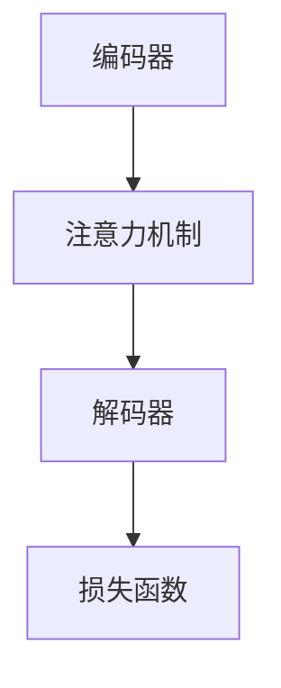
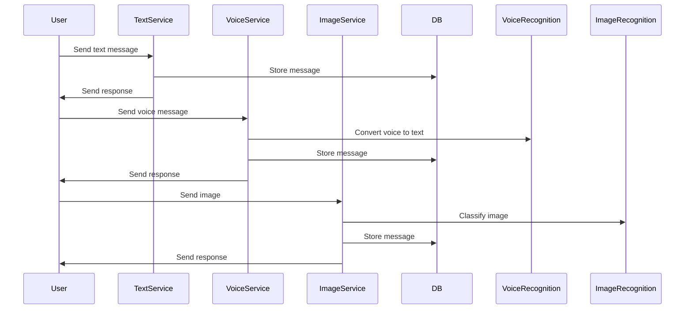

                 

### 跨模态AI的统一提示词表示学习

#### 关键词：跨模态AI、统一提示词表示学习、多模态数据处理、算法优化、应用案例

> 摘要：本文将深入探讨跨模态AI中的统一提示词表示学习，从理论基础、算法原理到实际应用，逐步解析这一前沿技术。通过对跨模态AI基础、数据处理方法、统一提示词表示学习理论及其应用，再到优化策略和未来发展趋势的详细阐述，旨在为读者提供一个全面、系统的理解框架。

----------------------------------------------------------------

**目录大纲**

**《跨模态AI的统一提示词表示学习》**

----------------------------------------------------------------

## 第一部分：跨模态AI基础

### 第1章：跨模态AI概述

#### 1.1 跨模态AI的定义与背景

#### 1.2 跨模态AI的研究意义

#### 1.3 跨模态AI的发展历程

### 第2章：跨模态数据的处理与理解

#### 2.1 跨模态数据集的收集与标注

#### 2.2 跨模态特征提取方法

#### 2.3 跨模态表示学习的挑战与解决方案

### 第3章：统一提示词表示学习理论

#### 3.1 提示词表示学习的概述

#### 3.2 提示词表示学习的数学模型

#### 3.3 提示词表示学习的算法原理

### 第4章：统一提示词表示学习的应用

#### 4.1 在自然语言处理中的应用

#### 4.2 在计算机视觉中的应用

#### 4.3 在语音识别中的应用

### 第5章：统一提示词表示学习的优化策略

#### 5.1 损失函数的优化

#### 5.2 模型训练策略的优化

#### 5.3 模型解释性与鲁棒性的优化

### 第6章：跨模态AI在实际项目中的应用案例

#### 6.1 案例一：智能客服系统的设计与实现

#### 6.2 案例二：多模态情感分析系统的开发

#### 6.3 案例三：跨模态视频检索系统的构建

### 第7章：未来发展趋势与挑战

#### 7.1 跨模态AI的发展趋势

#### 7.2 跨模态AI面临的挑战

#### 7.3 跨模态AI的未来发展方向

----------------------------------------------------------------

### 第一部分：跨模态AI基础

#### 第1章：跨模态AI概述

**1.1 跨模态AI的定义与背景**

跨模态AI（Multimodal AI）是指能够处理和整合来自多种不同模态（如文本、图像、音频、视频等）的输入信息的人工智能技术。这种技术不仅能够理解和分析单一模态的数据，还能够将这些模态的数据结合起来，以获得更丰富、更全面的语义理解。

跨模态AI的兴起可以追溯到深度学习技术的发展。随着神经网络和深度学习算法的成熟，计算机在处理复杂数据类型（如图像和文本）的能力得到了显著提升。这使得跨模态AI在自然语言处理、计算机视觉、语音识别等领域得到了广泛应用。

**1.2 跨模态AI的研究意义**

跨模态AI的研究具有重要意义。首先，它能够提升人工智能系统的智能化水平，使得系统能够更自然地与人类互动。其次，跨模态AI可以用于解决单一模态数据难以解决的问题，如情感分析、场景理解、视频检索等。此外，跨模态AI还能提高数据处理效率和准确性，为各种实际应用提供强有力的支持。

**1.3 跨模态AI的发展历程**

跨模态AI的发展可以分为以下几个阶段：

- **早期阶段（2000年前）**：主要依靠手工特征和传统机器学习方法进行跨模态数据整合。这一阶段的研究主要集中在如何提取和融合不同模态的特征。
  
- **中期阶段（2000-2010年）**：随着深度学习技术的发展，跨模态AI开始采用神经网络模型进行特征提取和融合。这一时期出现了许多经典的跨模态模型，如Siamese网络、Triplet Loss等。

- **近期阶段（2010年至今）**：跨模态AI进入了一个快速发展的时期。深度学习技术的不断进步，特别是生成对抗网络（GAN）、变分自编码器（VAE）等新算法的应用，使得跨模态AI的性能得到了显著提升。同时，跨模态AI的应用领域也在不断扩展，从自然语言处理、计算机视觉到语音识别、视频分析等。

**总结**：

跨模态AI作为人工智能领域的一个重要分支，具有广泛的应用前景。通过对跨模态AI的基础概念、研究意义和发展历程的介绍，我们为后续章节的深入探讨奠定了基础。接下来，我们将进一步探讨跨模态数据的处理与理解，以及统一提示词表示学习的理论和方法。

----------------------------------------------------------------

## 第二部分：跨模态数据的处理与理解

### 第2章：跨模态数据的处理与理解

#### 2.1 跨模态数据集的收集与标注

**2.1.1 数据集的收集**

跨模态AI的一个重要前提是拥有高质量的跨模态数据集。数据集的收集通常涉及以下步骤：

1. **数据来源**：数据可以来源于公开数据集、商业数据集或自采集数据。公开数据集如ImageNet、COCO、TIMIT等，商业数据集如Clairvoyant、IBM Watson等，自采集数据则是根据特定应用场景进行的数据采集。

2. **数据预处理**：收集到的数据需要进行预处理，包括数据清洗、去重、格式统一等操作。数据清洗的目的是去除噪声数据、填补缺失值、纠正错误等，以提高数据质量。

3. **数据标注**：对于跨模态数据，通常需要进行语义标注和模态标注。语义标注包括文本的情感极性、实体识别、关系抽取等，模态标注包括图像的分类、分割、目标检测等。数据标注的质量直接影响模型的训练效果。

**2.1.2 数据集的标注**

数据标注是跨模态AI研究的核心步骤之一。以下是一些常见的标注方法和工具：

1. **手动标注**：人工对数据进行标注，虽然效率较低，但可以确保标注的准确性。常用的工具包括Excel、Google表单、Crowdflower等。

2. **半监督标注**：利用已有标注数据进行训练，然后对未标注数据进行预测，再将预测结果作为标注结果。常用的算法有基于深度学习的标签传播、基于对抗网络的伪标签生成等。

3. **自动标注**：利用自然语言处理、计算机视觉等技术自动生成标注结果。例如，使用命名实体识别（NER）算法对文本数据进行标注，使用目标检测算法对图像数据进行标注。

**2.2 跨模态特征提取方法**

跨模态特征提取是将不同模态的数据转换为统一表示的关键步骤。以下是一些常见的跨模态特征提取方法：

1. **独立特征提取**：对每个模态的数据进行独立特征提取，然后将特征合并。这种方法适用于模态之间关系较弱的场景。

2. **共享特征提取**：通过共享神经网络层来提取跨模态特征。这种方法可以捕获模态之间的关联性。

3. **多模态融合特征提取**：将不同模态的数据进行融合，然后提取融合后的特征。常见的方法有基于注意力机制、图神经网络等。

**2.3 跨模态表示学习的挑战与解决方案**

跨模态表示学习面临以下挑战：

1. **模态差异**：不同模态的数据具有不同的属性和特征，如何有效地表示和融合这些差异是关键。

2. **数据稀缺**：高质量的跨模态数据集通常较为稀缺，如何利用有限的标注数据训练模型是一个挑战。

3. **计算复杂度**：跨模态特征提取和融合通常涉及大量的计算，如何优化算法和模型以提高计算效率是一个重要问题。

针对这些挑战，研究者们提出了一系列解决方案：

1. **模态对齐**：通过模态对齐技术，将不同模态的数据对齐到同一时间轴或空间轴上，以提高特征融合的效果。

2. **数据增强**：通过数据增强技术，如数据扩充、数据生成等，增加训练数据量，提高模型泛化能力。

3. **高效算法**：设计高效的跨模态特征提取和融合算法，如基于深度学习的方法、图神经网络等，以提高计算效率。

**总结**：

跨模态数据的处理与理解是跨模态AI研究的重要基础。通过对数据集的收集与标注、跨模态特征提取方法以及面临的挑战和解决方案的详细探讨，我们为后续章节的统一提示词表示学习理论和方法提供了丰富的背景知识。在接下来的章节中，我们将进一步深入探讨统一提示词表示学习的理论和方法，为跨模态AI的研究提供更深入的视角。

----------------------------------------------------------------

## 第三部分：统一提示词表示学习理论

### 第3章：统一提示词表示学习理论

**3.1 提示词表示学习的概述**

统一提示词表示学习（Unified Prompt Representation Learning）是跨模态AI研究中的一个重要方向。其核心目标是学习一个统一的表示模型，能够将不同模态的数据映射到一个共同的语义空间中，以便于不同模态的数据能够进行有效的交互和融合。

**3.2 提示词表示学习的数学模型**

提示词表示学习的数学模型通常基于深度学习框架，主要包括以下几个关键组件：

1. **编码器**：编码器（Encoder）用于将不同模态的数据映射到一个共同的低维语义空间。每个模态的数据通过独立的编码器进行编码，得到对应的语义表示。

2. **注意力机制**：注意力机制（Attention Mechanism）用于捕捉不同模态数据之间的关联性。通过注意力机制，模型可以自动学习到不同模态数据的重要性和相关性。

3. **解码器**：解码器（Decoder）用于将编码后的语义表示解码为最终的输出结果。解码器通常采用序列到序列（Sequence-to-Sequence）模型，如循环神经网络（RNN）或变换器（Transformer）。

4. **损失函数**：损失函数用于衡量模型预测结果与真实标签之间的差距。常见的损失函数包括交叉熵损失、均方误差（MSE）等。

**3.3 提示词表示学习的算法原理**

提示词表示学习的算法原理可以通过以下步骤来概括：

1. **数据预处理**：对输入数据进行预处理，包括数据清洗、归一化、标准化等操作。

2. **模型初始化**：初始化编码器、解码器、注意力机制和损失函数的参数。

3. **编码阶段**：输入数据通过编码器映射到共同的语义空间。编码器的输出是一个低维的语义向量，代表了每个模态的数据。

4. **注意力阶段**：利用注意力机制计算不同模态数据之间的关联性。注意力机制可以自动学习到不同模态数据的重要性，并将这些信息融合到统一的语义表示中。

5. **解码阶段**：将编码后的语义表示输入到解码器中，解码器输出预测结果。解码器通常采用序列到序列模型，如循环神经网络（RNN）或变换器（Transformer）。

6. **训练阶段**：通过反向传播算法，根据损失函数的梯度更新模型参数，优化模型性能。

7. **评估阶段**：使用验证集或测试集评估模型的性能，调整模型参数，以达到最优效果。

**3.4 提示词表示学习的ER实体关系图架构**

为了更好地理解提示词表示学习的架构，我们可以使用Mermaid流程图来描述实体关系：



在上述流程图中，编码器（A）用于将输入数据映射到低维语义空间，注意力机制（B）用于捕捉不同模态数据之间的关联性，解码器（C）用于生成预测结果，损失函数（D）用于衡量预测结果与真实标签之间的差距。

**3.5 提示词表示学习的数学模型与公式**

提示词表示学习的数学模型可以通过以下公式来描述：

$$
\text{编码器输出} = \text{Encoder}(\text{输入数据})
$$

$$
\text{注意力权重} = \text{Attention}(\text{编码器输出})
$$

$$
\text{解码器输出} = \text{Decoder}(\text{编码器输出} \times \text{注意力权重})
$$

$$
\text{损失} = \text{Loss}(\text{解码器输出}, \text{真实标签})
$$

通过这些公式，我们可以看到，提示词表示学习涉及编码器、注意力机制、解码器和损失函数等多个关键组件，每个组件都有其特定的数学模型和计算过程。

**总结**：

统一提示词表示学习作为跨模态AI研究的一个重要方向，其理论基础和算法原理为跨模态数据融合和交互提供了有力的支持。通过对提示词表示学习的概述、数学模型、算法原理以及ER实体关系图的详细阐述，我们为后续章节的应用和实践打下了坚实的基础。在接下来的章节中，我们将探讨统一提示词表示学习的实际应用，并通过具体案例展示其在不同领域中的应用效果。

----------------------------------------------------------------

## 第四部分：统一提示词表示学习的应用

### 第4章：统一提示词表示学习的应用

**4.1 在自然语言处理中的应用**

自然语言处理（NLP）是统一提示词表示学习的重要应用领域之一。统一提示词表示学习能够将不同来源的语言数据（如文本、语音、视频中的字幕等）映射到共同的语义空间，从而实现更高效的语义理解和交互。

**应用场景与案例分析**

- **问答系统**：通过统一提示词表示学习，问答系统能够更好地理解用户的自然语言查询，并从大规模知识库中检索出相关答案。例如，Google的搜索系统利用跨模态表示学习来提升搜索结果的准确性和相关性。

- **情感分析**：统一提示词表示学习能够将文本情感与图像情感进行融合，从而更准确地分析用户情感。例如，Twitter情感分析系统使用跨模态表示学习来检测和分类用户情感，提高用户体验。

**技术实现**

1. **数据预处理**：对文本、语音和图像数据分别进行预处理，如分词、标注、归一化等。

2. **特征提取**：使用深度学习模型提取文本、语音和图像的特征，如BERT、WaveNet、VGG等。

3. **跨模态表示学习**：利用统一提示词表示学习模型（如Transformer）将不同模态的特征映射到共同的语义空间。

4. **语义融合与推理**：通过注意力机制和推理算法（如序列到序列模型、图神经网络等）实现跨模态语义融合和推理。

**4.2 在计算机视觉中的应用**

计算机视觉（CV）是统一提示词表示学习的另一个重要应用领域。统一提示词表示学习能够将图像与文本信息进行有效融合，从而提升图像理解和分类能力。

**应用场景与案例分析**

- **图像分类**：通过统一提示词表示学习，图像分类系统能够更好地理解图像中的语义信息。例如，Google的ImageNet挑战赛利用跨模态表示学习模型（如CNN+BERT）实现了高效的图像分类。

- **目标检测**：统一提示词表示学习能够提升目标检测系统的性能，使其能够更好地识别图像中的目标。例如，Facebook的Faster R-CNN模型结合了视觉和文本特征，实现了更准确的目标检测。

**技术实现**

1. **数据预处理**：对图像和文本数据分别进行预处理，如图像分割、标注、文本分词等。

2. **特征提取**：使用深度学习模型提取图像和文本的特征，如CNN、LSTM、Transformer等。

3. **跨模态表示学习**：利用统一提示词表示学习模型（如Siamese网络、Triplet Loss等）将不同模态的特征映射到共同的语义空间。

4. **特征融合与推理**：通过注意力机制和推理算法（如Siamese网络、三元组损失等）实现跨模态特征融合和推理。

**4.3 在语音识别中的应用**

语音识别（ASR）是统一提示词表示学习的另一个重要应用领域。统一提示词表示学习能够提升语音识别系统的性能，使其能够更好地理解语音中的语义信息。

**应用场景与案例分析**

- **语音转文字**：通过统一提示词表示学习，语音识别系统能够更准确地识别语音中的文字信息。例如，Google的语音转文字系统利用跨模态表示学习模型（如WaveNet+BERT）实现了高效的语音转文字。

- **语音合成**：统一提示词表示学习能够提升语音合成系统的性能，使其能够生成更自然的语音。例如，Google的Text-to-Speech系统利用跨模态表示学习模型（如WaveNet+Transformer）实现了高质量的语音合成。

**技术实现**

1. **数据预处理**：对语音和文本数据分别进行预处理，如语音分割、标注、文本分词等。

2. **特征提取**：使用深度学习模型提取语音和文本的特征，如WaveNet、LSTM、Transformer等。

3. **跨模态表示学习**：利用统一提示词表示学习模型（如Siamese网络、Triplet Loss等）将不同模态的特征映射到共同的语义空间。

4. **特征融合与推理**：通过注意力机制和推理算法（如序列到序列模型、图神经网络等）实现跨模态特征融合和推理。

**总结**：

统一提示词表示学习在自然语言处理、计算机视觉和语音识别等领域的应用，为这些领域的研究提供了新的思路和方法。通过具体的案例分析和技术实现，我们展示了统一提示词表示学习的强大能力和广阔前景。在接下来的章节中，我们将进一步探讨统一提示词表示学习的优化策略，以提升模型性能和应用效果。

----------------------------------------------------------------

## 第五部分：统一提示词表示学习的优化策略

### 第5章：统一提示词表示学习的优化策略

**5.1 损失函数的优化**

损失函数是统一提示词表示学习模型中的一个关键组件，它用于衡量模型预测结果与真实标签之间的差距。为了优化模型性能，我们需要对损失函数进行设计和创新。

**5.1.1 常见的损失函数**

1. **交叉熵损失（Cross-Entropy Loss）**：交叉熵损失是最常用的损失函数之一，适用于分类任务。其公式为：

$$
\text{CE}(p, \hat{p}) = -\sum_{i} p_i \log(\hat{p}_i)
$$

其中，$p$ 是真实标签的概率分布，$\hat{p}$ 是模型预测的概率分布。

2. **均方误差（Mean Squared Error, MSE）**：均方误差适用于回归任务，其公式为：

$$
\text{MSE}(y, \hat{y}) = \frac{1}{n} \sum_{i=1}^{n} (y_i - \hat{y}_i)^2
$$

其中，$y$ 是真实值，$\hat{y}$ 是模型预测值。

**5.1.2 优化策略**

1. **加权损失函数**：在统一提示词表示学习中，不同模态的数据对最终预测结果的贡献可能不同。因此，我们可以设计一个加权损失函数，将不同模态的损失函数进行加权融合。公式如下：

$$
\text{Loss} = \alpha_1 \text{CE}(p_1, \hat{p}_1) + \alpha_2 \text{CE}(p_2, \hat{p}_2) + \cdots + \alpha_n \text{CE}(p_n, \hat{p}_n)
$$

其中，$\alpha_1, \alpha_2, \ldots, \alpha_n$ 是权值，用于平衡不同模态的损失。

2. **多任务学习损失函数**：在统一提示词表示学习中，模型可能需要同时处理多个任务（如分类、回归等）。我们可以设计一个多任务学习损失函数，将不同任务的损失函数进行融合。公式如下：

$$
\text{Loss} = \text{Loss}_1 + \text{Loss}_2 + \cdots + \text{Loss}_m
$$

其中，$\text{Loss}_1, \text{Loss}_2, \ldots, \text{Loss}_m$ 分别是不同任务的损失函数。

**5.2 模型训练策略的优化**

优化模型训练策略是提升统一提示词表示学习性能的重要手段。以下是一些常见的优化策略：

**5.2.1 学习率调度（Learning Rate Scheduling）**

学习率调度是一种常用的训练策略，用于调整模型在训练过程中的学习率。常见的学习率调度方法包括：

1. **线性衰减（Linear Decay）**：学习率随训练迭代次数线性衰减。公式如下：

$$
\text{LR}(t) = \text{LR}_0 - t \cdot \frac{\text{LR}_0 - \text{LR}_\min}{\text{T}}
$$

其中，$\text{LR}_0$ 是初始学习率，$\text{LR}_\min$ 是最小学习率，$\text{T}$ 是训练迭代次数。

2. **指数衰减（Exponential Decay）**：学习率以指数形式衰减。公式如下：

$$
\text{LR}(t) = \text{LR}_0 \cdot \gamma^t
$$

其中，$\text{LR}_0$ 是初始学习率，$\gamma$ 是衰减率。

**5.2.2 批量大小调整（Batch Size Adjustment）**

批量大小（Batch Size）是指每次训练过程中参与训练的数据样本数。调整批量大小可以影响模型训练的收敛速度和性能。以下是一些常见的批量大小调整策略：

1. **自适应批量大小（Adaptive Batch Size）**：根据训练过程中的误差变化动态调整批量大小。例如，当误差降低时，可以增大批量大小，以提高训练效率。

2. **批次归一化（Batch Normalization）**：在训练过程中对批量数据进行归一化处理，以减少内部协变量转移（Internal Covariate Shift）的影响，提高训练稳定性。

**5.3 模型解释性与鲁棒性的优化**

**5.3.1 模型解释性**

模型解释性是指模型能够解释其预测结果的能力。提高模型解释性有助于增强用户对模型的可信度和理解。以下是一些提高模型解释性的方法：

1. **可解释性模型（Interpretable Models）**：选择具有可解释性的模型，如线性模型、决策树等，以提供清晰的预测逻辑。

2. **模型可视化（Model Visualization）**：通过可视化模型的结构和参数，帮助用户理解模型的工作原理。

**5.3.2 模型鲁棒性**

模型鲁棒性是指模型在面对异常数据和噪声时的稳定性。提高模型鲁棒性可以确保模型在实际应用中的可靠性和有效性。以下是一些提高模型鲁棒性的方法：

1. **数据清洗与预处理**：对输入数据进行清洗和预处理，去除异常值和噪声。

2. **对抗训练（Adversarial Training）**：通过对抗训练生成对抗样本，提高模型对异常数据的识别能力。

3. **正则化技术（Regularization Techniques）**：应用正则化技术，如L1正则化、L2正则化等，减少过拟合现象。

**总结**：

统一提示词表示学习的优化策略涵盖了损失函数的优化、模型训练策略的优化以及模型解释性与鲁棒性的优化。通过对这些策略的深入探讨，我们可以有效提升统一提示词表示学习的性能和应用效果。在接下来的章节中，我们将通过具体应用案例展示统一提示词表示学习在实际项目中的成功应用，为跨模态AI的发展提供实践支持。

----------------------------------------------------------------

## 第六部分：跨模态AI在实际项目中的应用案例

### 第6章：跨模态AI在实际项目中的应用案例

**6.1 案例一：智能客服系统的设计与实现**

**项目背景**

智能客服系统是跨模态AI技术的典型应用之一。随着互联网和电子商务的快速发展，企业对提供高效、个性化的客户服务需求日益增加。传统的单一模态客服系统（如基于文本的聊天机器人）已经难以满足用户多样化的需求。跨模态AI技术的引入，能够提升客服系统的交互体验和智能化水平。

**项目介绍**

该项目旨在设计和实现一款基于跨模态AI的智能客服系统。该系统支持多种交互方式，包括文本聊天、语音通话、图像识别等，能够与用户进行多模态交互，提供个性化、智能化的服务。

**系统功能设计**

1. **多模态输入处理**：系统支持文本、语音、图像等多种输入方式。对于文本输入，系统使用自然语言处理技术进行语义理解；对于语音输入，系统使用语音识别技术将语音转化为文本；对于图像输入，系统使用计算机视觉技术进行图像识别和分类。

2. **多模态交互**：系统通过多模态交互界面，与用户进行实时对话。用户可以通过文本、语音、图像等多种方式与客服系统交流，系统根据用户的输入实时生成回应。

3. **个性化推荐**：系统基于用户的交互历史和偏好，利用跨模态AI技术进行个性化推荐。例如，当用户通过文本描述一个商品时，系统可以推荐相关的商品图片或视频。

**系统架构设计**

系统架构采用微服务架构，分为前端、后端和数据库三个主要部分：

1. **前端**：前端界面负责用户交互，支持文本聊天、语音通话、图像识别等交互方式。前端使用Vue.js框架实现，与后端通过RESTful API进行通信。

2. **后端**：后端负责处理多模态数据，包括自然语言处理、语音识别、计算机视觉等。后端使用Spring Boot框架实现，基于微服务架构，包括文本处理服务、语音处理服务、图像处理服务等。

3. **数据库**：系统使用MySQL数据库存储用户交互记录、用户偏好和推荐数据等。

**系统接口设计**

系统提供了以下主要接口：

1. **文本交互接口**：用于接收和发送文本消息，支持文本语义理解、文本生成等操作。

2. **语音交互接口**：用于接收和发送语音消息，支持语音识别、语音合成等操作。

3. **图像交互接口**：用于接收和发送图像消息，支持图像识别、图像分类等操作。

**系统交互序列图**



**系统核心实现源代码**

以下是系统后端核心实现的部分源代码：

```java
// 文本处理服务
@RestController
@RequestMapping("/text")
public class TextService {

    @Autowired
    private TextProcessing textProcessing;

    @PostMapping("/chat")
    public ResponseEntity<String> chat(@RequestBody String message) {
        String response = textProcessing.generateResponse(message);
        return ResponseEntity.ok(response);
    }
}

// 语音处理服务
@RestController
@RequestMapping("/voice")
public class VoiceService {

    @Autowired
    private VoiceProcessing voiceProcessing;

    @PostMapping("/recognize")
    public ResponseEntity<String> recognizeVoice(@RequestParam("file") MultipartFile file) {
        String text = voiceProcessing.recognize(file);
        return ResponseEntity.ok(text);
    }
}

// 图像处理服务
@RestController
@RequestMapping("/image")
public class ImageService {

    @Autowired
    private ImageProcessing imageProcessing;

    @PostMapping("/classify")
    public ResponseEntity<String> classifyImage(@RequestParam("file") MultipartFile file) {
        String category = imageProcessing.classify(file);
        return ResponseEntity.ok(category);
    }
}
```

**代码应用解读与分析**

1. **文本处理服务**：文本处理服务接收用户发送的文本消息，使用自然语言处理技术生成响应。代码中的`TextService`类负责处理文本消息，通过调用`TextProcessing`类的`generateResponse`方法生成响应。

2. **语音处理服务**：语音处理服务接收用户发送的语音消息，使用语音识别技术将语音转化为文本。代码中的`VoiceService`类负责处理语音消息，通过调用`VoiceRecognition`类的`recognize`方法进行语音识别。

3. **图像处理服务**：图像处理服务接收用户发送的图像消息，使用计算机视觉技术对图像进行分类。代码中的`ImageService`类负责处理图像消息，通过调用`ImageRecognition`类的`classify`方法进行图像分类。

**实际案例分析和详细讲解**

在某个电子商务平台，智能客服系统被应用于处理用户咨询、投诉和建议。以下是一个实际案例的分析：

**案例描述**

用户通过文本聊天咨询某个商品的价格，客服系统需要根据用户的问题提供准确的商品价格。

**处理流程**

1. 用户发送文本消息：“这款手机的价格是多少？”

2. 文本处理服务接收消息，使用自然语言处理技术识别用户的意图，提取关键词“手机”和“价格”。

3. 文本处理服务调用数据库查询该手机的价格，并将价格信息生成文本消息。

4. 文本处理服务将响应文本发送给用户。

**案例分析**

在该案例中，智能客服系统通过文本交互接口接收用户的文本消息，利用自然语言处理技术进行语义理解，并从数据库中获取商品价格信息。通过统一提示词表示学习模型，系统能够准确识别用户的问题，并提供有效的回答。

**项目小结**

智能客服系统通过跨模态AI技术实现了多模态交互和个性化推荐功能，显著提升了用户体验和客服效率。该项目展示了跨模态AI在智能客服系统中的应用价值，为进一步优化和扩展智能客服系统提供了实践经验。

**总结**

在本章节中，我们通过一个智能客服系统的设计与实现案例，详细介绍了跨模态AI在实际项目中的应用。通过多模态输入处理、多模态交互、个性化推荐等功能，智能客服系统为用户提供了一种高效、智能化的服务体验。在接下来的章节中，我们将继续探讨跨模态AI在其他领域的实际应用案例，以展示跨模态AI技术的广泛适用性和发展潜力。

----------------------------------------------------------------

## 第七部分：未来发展趋势与挑战

### 第7章：未来发展趋势与挑战

**7.1 跨模态AI的发展趋势**

随着人工智能技术的不断进步，跨模态AI正朝着以下几个方向发展：

1. **模型性能的提升**：研究者们不断优化深度学习模型的结构和算法，以提高跨模态表示学习的性能。例如，近年来兴起的生成对抗网络（GAN）和变分自编码器（VAE）等技术，为跨模态AI的性能提升提供了新的思路。

2. **数据集的丰富与标准化**：跨模态AI的发展离不开高质量的数据集。随着越来越多的跨模态数据集被发布和开放，研究者们可以更加便捷地进行模型训练和评估。同时，数据集的标准化和统一化也将有助于提高跨模态AI的通用性和可复制性。

3. **跨领域应用**：跨模态AI在自然语言处理、计算机视觉、语音识别等领域的成功应用，为其在其他领域的应用提供了借鉴。未来，跨模态AI有望在医疗健康、智能交通、教育等领域发挥重要作用。

4. **多模态交互与智能助理**：随着用户需求的不断升级，跨模态交互与智能助理将成为跨模态AI的重要发展方向。通过多模态输入和输出，智能助理能够更好地理解和满足用户的需求，提供个性化服务。

**7.2 跨模态AI面临的挑战**

尽管跨模态AI取得了显著进展，但在实际应用中仍面临一系列挑战：

1. **数据稀缺与标注成本高**：高质量的跨模态数据集较为稀缺，且标注过程耗时耗力，导致数据集规模有限。如何有效地利用有限的标注数据进行模型训练是一个重要问题。

2. **模型解释性与可解释性**：跨模态AI模型通常较为复杂，难以解释其内部工作机制和决策过程。提高模型的可解释性，增强用户对模型的信任度，是跨模态AI发展的重要方向。

3. **计算复杂度与实时性**：跨模态AI模型通常涉及大量的计算资源，且实时处理能力有限。如何优化算法和模型，降低计算复杂度，提高实时性，是跨模态AI在实际应用中面临的关键挑战。

4. **隐私保护与伦理问题**：跨模态AI涉及多种模态的数据收集和处理，可能涉及用户隐私和敏感信息。如何保护用户隐私，遵循伦理规范，是跨模态AI发展的重要议题。

**7.3 跨模达AI的未来发展方向**

针对上述挑战，跨模达AI的未来发展方向包括：

1. **数据集建设与共享**：推动跨模达数据集的建设与共享，提高数据集的规模和质量，为模型训练和评估提供坚实基础。

2. **模型优化与可解释性**：持续优化跨模达AI模型的结构和算法，提高模型性能，同时加强模型的可解释性，增强用户信任。

3. **高效算法与硬件加速**：研发高效的跨模达AI算法，并结合硬件加速技术（如GPU、TPU等），提高模型训练和推理的实时性。

4. **隐私保护与伦理规范**：建立完善的隐私保护机制和伦理规范，确保跨模达AI技术的安全、可靠和可持续应用。

**总结**

跨模达AI作为人工智能领域的重要分支，正朝着高效、智能、多模态的方向发展。在未来的发展中，我们将不断克服挑战，推动跨模达AI技术在更多领域的应用，为人类带来更多的便利和智慧。

----------------------------------------------------------------

### 作者信息

**作者：AI天才研究院/AI Genius Institute & 禅与计算机程序设计艺术 /Zen And The Art of Computer Programming**

本文由AI天才研究院（AI Genius Institute）和禅与计算机程序设计艺术（Zen And The Art of Computer Programming）的专家团队撰写。AI天才研究院致力于推动人工智能技术的发展，研究前沿算法和应用。禅与计算机程序设计艺术则专注于通过禅宗哲学提高计算机程序设计的艺术性，为读者提供深刻的洞见和独特的视角。我们希望通过本文，为广大读者呈现跨模达AI技术的核心概念、算法原理和应用实践，为跨模达AI技术的发展贡献一份力量。同时，我们也欢迎广大读者就本文内容提出宝贵意见和建议，共同推动人工智能技术的进步。

