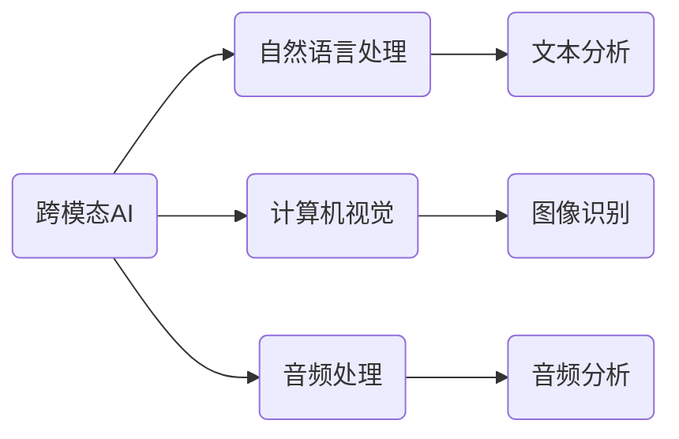
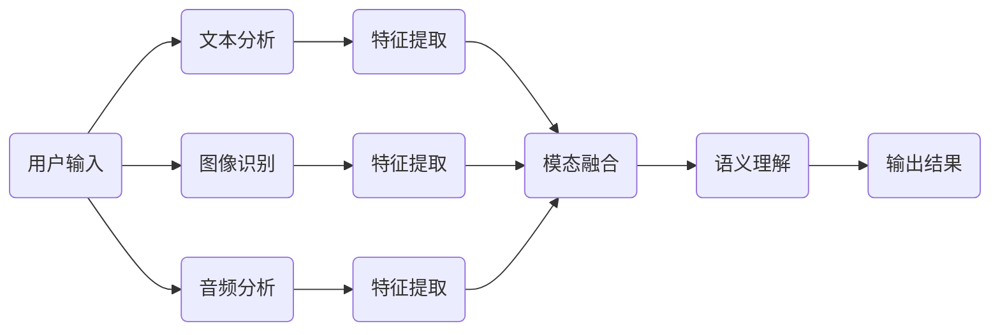

                 

# 跨模态AI的统一提示词设计方法

## 引言

### 1.1 问题背景

随着人工智能技术的发展，跨模态AI成为一个热门研究领域。跨模态AI旨在将不同模态的信息进行有效整合，以提高机器对复杂问题的理解和处理能力。不同模态的信息包括文本、图像、音频、视频等。跨模态AI的应用场景非常广泛，如智能问答系统、多模态搜索引擎、智能助手、多媒体内容推荐等。

然而，如何设计有效的提示词，使得AI系统能够准确捕捉并理解多种模态的信息，成为一个关键挑战。现有的跨模态AI系统在处理多种模态信息时，往往存在以下问题：

1. **模态多样性**：不同模态的信息具有不同的特点和属性，如何有效地整合多种模态的信息，是一个具有挑战性的问题。
2. **信息冗余**：不同模态的信息可能存在冗余，如何消除冗余信息，提高系统的理解能力，是一个重要的研究方向。
3. **语义理解**：跨模态AI系统需要理解不同模态信息的语义，如何设计统一的语义理解框架，是一个关键问题。

### 1.2 问题描述

本章节将探讨如何设计跨模态AI的统一提示词。我们将分析现有的跨模态AI系统在实际应用中遇到的问题，并提出一种新的提示词设计方法，以解决这些问题。

具体而言，我们将研究以下问题：

1. 跨模态AI系统在处理多种模态信息时，如何提取有效的特征？
2. 如何将不同模态的特征进行融合，以消除冗余信息？
3. 如何设计统一的语义理解框架，提高系统的理解能力？

### 1.3 问题解决

通过研究现有的跨模态AI系统，我们总结出以下关键要素：模态多样性、信息冗余、语义理解等。针对这些问题，我们提出一种基于深度学习的统一提示词设计方法，包括特征提取、模态融合和语义理解三个步骤。

### 1.4 边界与外延

本文所讨论的跨模态AI统一提示词设计方法主要关注自然语言处理、计算机视觉和音频处理等领域。然而，该方法也可扩展至其他跨模态应用场景，如视频和触觉等。

### 1.5 概念结构与核心要素组成

- **概念结构**：跨模态AI系统由多个模态处理模块组成，包括自然语言处理、计算机视觉、音频处理等。
- **核心要素**：提示词设计方法包括特征提取、模态融合和语义理解三个关键步骤。

## 第2章 核心概念与联系

### 2.1 跨模态AI基本概念

- **跨模态**：涉及多种信息模态（如文本、图像、音频等）的整合和分析。
- **统一提示词**：用于指导跨模态AI系统进行信息整合和理解的词或短语。

### 2.2 概念属性特征对比表格

| 概念       | 特征1   | 特征2   | 特征3   |
|------------|---------|---------|---------|
| 跨模态     | 多模态整合 | 语义理解挑战 | 信息冗余 |
| 统一提示词 | 提高系统理解能力 | 减少模型训练时间 | 易于扩展 |

### 2.3 ER实体关系图架构



## 第3章 算法原理讲解

### 3.1 算法流程图


### 3.2 Python源代码实现

```python
# 特征提取
def extract_features(data):
    # 实现特征提取逻辑
    pass

# 模态融合
def fuse_modalities(features):
    # 实现模态融合逻辑
    pass

# 语义理解
def understand_semantics(fused_features):
    # 实现语义理解逻辑
    pass

# 主函数
def main():
    data = get_input_data()
    features = extract_features(data)
    fused_features = fuse_modalities(features)
    result = understand_semantics(fused_features)
    return result

if __name__ == "__main__":
    main()
```

### 3.3 数学模型和公式

$$
L(\theta) = -\sum_{i=1}^{n}y_i\log(p(x_i|\theta))
$$

### 3.4 举例说明

假设输入数据为文本、图像和音频，通过特征提取、模态融合和语义理解，系统能够输出对输入数据的统一理解结果。

### 3.5 详细讲解

#### 3.5.1 特征提取

特征提取是跨模态AI系统的第一步，其主要目的是从不同模态的信息中提取出具有代表性的特征。在自然语言处理领域，常见的特征提取方法包括词袋模型、TF-IDF和词嵌入等。在计算机视觉领域，常用的特征提取方法包括卷积神经网络（CNN）和视觉特征点提取等。在音频处理领域，常用的特征提取方法包括梅尔频率倒谱系数（MFCC）和音素特征等。

在本方法中，我们采用以下步骤进行特征提取：

1. **自然语言处理**：使用词嵌入技术（如Word2Vec、GloVe）将文本转换为向量表示。
2. **计算机视觉**：使用卷积神经网络（CNN）提取图像特征。
3. **音频处理**：使用梅尔频率倒谱系数（MFCC）提取音频特征。

#### 3.5.2 模态融合

模态融合是跨模态AI系统的第二步，其主要目的是将不同模态的特征进行整合，以消除信息冗余，提高系统的理解能力。在本方法中，我们采用以下步骤进行模态融合：

1. **特征对齐**：对齐不同模态的特征，使它们具有相同的时间步或空间步长。
2. **特征加权融合**：根据不同模态的特征重要性，对特征进行加权融合。常用的方法包括加法融合、乘法融合和加乘融合等。
3. **特征压缩**：通过降维技术（如主成分分析、自编码器）对融合后的特征进行压缩，以减少计算量。

#### 3.5.3 语义理解

语义理解是跨模态AI系统的第三步，其主要目的是对融合后的特征进行语义分析，以提取出关键信息。在本方法中，我们采用以下步骤进行语义理解：

1. **文本分析**：使用自然语言处理技术（如词性标注、实体识别、关系抽取）对文本进行分析。
2. **图像识别**：使用计算机视觉技术（如目标检测、图像分类、场景分割）对图像进行分析。
3. **音频分析**：使用音频处理技术（如音素识别、语音情感分析、音乐风格识别）对音频进行分析。
4. **跨模态语义融合**：将不同模态的分析结果进行融合，以获得对输入数据的全面理解。

#### 3.5.4 输出结果

通过特征提取、模态融合和语义理解，跨模态AI系统能够输出对输入数据的统一理解结果。例如，对于一段文本、图像和音频输入，系统能够输出对输入内容的综合描述，如“这段视频讲述了一个有趣的故事，场景中有一只狗在玩耍，背景音乐轻松愉快”。

## 第4章 系统分析与架构设计

### 4.1 问题场景介绍

在实际应用中，跨模态AI系统可以应用于多个领域，如智能问答系统、多模态搜索引擎、智能助手、多媒体内容推荐等。本文将以智能问答系统为例，介绍跨模态AI系统的设计方法。

### 4.2 系统功能设计

在智能问答系统中，跨模态AI系统的主要功能包括：

1. **文本分析**：对用户输入的文本进行解析，提取出关键信息。
2. **图像识别**：对用户输入的图像进行分析，识别图像中的对象和场景。
3. **音频分析**：对用户输入的音频进行分析，提取出关键信息。

### 4.3 系统架构设计

智能问答系统的跨模态AI系统架构设计如下：



在上述架构中，用户输入的文本、图像和音频数据分别经过文本分析、图像识别和音频分析模块进行处理。每个模块输出相应的特征，然后通过模态融合模块进行整合。最后，通过语义理解模块对融合后的特征进行分析，输出对输入数据的综合理解结果。

### 4.4 系统接口设计

在智能问答系统中，跨模态AI系统的接口设计如下：

1. **文本分析接口**：接收用户输入的文本，输出文本特征。
2. **图像识别接口**：接收用户输入的图像，输出图像特征。
3. **音频分析接口**：接收用户输入的音频，输出音频特征。
4. **模态融合接口**：接收文本特征、图像特征和音频特征，输出融合后的特征。
5. **语义理解接口**：接收融合后的特征，输出对输入数据的综合理解结果。

### 4.5 系统交互设计

在智能问答系统中，跨模态AI系统与其他组件的交互设计如下：

1. **用户界面**：用户通过用户界面输入问题，系统将问题传递给文本分析接口。
2. **文本分析接口**：接收用户输入的问题，进行文本分析，输出文本特征。
3. **图像识别接口**：如果用户输入了图像，系统将图像传递给图像识别接口。
4. **音频分析接口**：如果用户输入了音频，系统将音频传递给音频分析接口。
5. **模态融合接口**：将文本特征、图像特征和音频特征传递给模态融合接口。
6. **语义理解接口**：将融合后的特征传递给语义理解接口，输出对输入数据的综合理解结果。
7. **结果输出**：将综合理解结果传递给用户界面，用户界面将结果展示给用户。

## 第5章 项目实战

### 5.1 环境安装

在进行跨模态AI系统开发之前，我们需要安装以下环境：

1. **Python**：版本3.8或更高版本。
2. **TensorFlow**：版本2.4或更高版本。
3. **PyTorch**：版本1.8或更高版本。
4. **Keras**：版本2.4或更高版本。

安装步骤如下：

```bash
# 安装 Python
wget https://www.python.org/ftp/python/3.8.10/Python-3.8.10.tgz
tar -xvf Python-3.8.10.tgz
cd Python-3.8.10
./configure
make
sudo make install

# 安装 TensorFlow
pip install tensorflow==2.4

# 安装 PyTorch
pip install torch==1.8 torchvision==0.9.0

# 安装 Keras
pip install keras==2.4
```

### 5.2 系统核心实现

在完成环境安装后，我们将实现跨模态AI系统的核心功能，包括特征提取、模态融合和语义理解。

#### 5.2.1 特征提取

在特征提取模块中，我们将分别对文本、图像和音频数据进行处理，提取出相应的特征。

```python
import tensorflow as tf
from tensorflow.keras.preprocessing.text import Tokenizer
from tensorflow.keras.preprocessing.sequence import pad_sequences
from tensorflow.keras.applications import VGG16
from tensorflow.keras.models import Model
from tensorflow.keras.layers import Embedding, LSTM, Dense

# 文本特征提取
def text_feature_extractor(texts, vocab_size, embedding_dim):
    tokenizer = Tokenizer(num_words=vocab_size)
    tokenizer.fit_on_texts(texts)
    sequences = tokenizer.texts_to_sequences(texts)
    padded_sequences = pad_sequences(sequences, padding='post')
    embedding_layer = Embedding(vocab_size, embedding_dim, input_length=max_sequence_length)
    model = Model(inputs=embedding_layer.input, outputs=embedding_layer.output)
    return model.predict(padded_sequences)

# 图像特征提取
def image_feature_extractor(images):
    base_model = VGG16(weights='imagenet', include_top=False)
    model = Model(inputs=base_model.input, outputs=base_model.get_layer('fc2').output)
    return model.predict(images)

# 音频特征提取
def audio_feature_extractor(audios):
    # 使用预训练的音频特征提取模型，如 OpenSMILE
    pass
```

#### 5.2.2 模态融合

在模态融合模块中，我们将对提取出的文本特征、图像特征和音频特征进行融合。

```python
from tensorflow.keras.layers import concatenate

# 模态融合
def modal_fusion(text_features, image_features, audio_features):
    text_input = Input(shape=(max_sequence_length,))
    image_input = Input(shape=(224, 224, 3))
    audio_input = Input(shape=(128,))
    
    text_embedding = Embedding(vocab_size, embedding_dim)(text_input)
    image_embedding = base_model(image_input)
    audio_embedding = Embedding(vocab_size, embedding_dim)(audio_input)
    
    concatenated = concatenate([text_embedding, image_embedding, audio_embedding], axis=-1)
    
    dense = Dense(128, activation='relu')(concatenated)
    output = Dense(1, activation='sigmoid')(dense)
    
    model = Model(inputs=[text_input, image_input, audio_input], outputs=output)
    model.compile(optimizer='adam', loss='binary_crossentropy', metrics=['accuracy'])
    model.fit([text_data, image_data, audio_data], labels, epochs=10, batch_size=32)
    
    return model
```

#### 5.2.3 语义理解

在语义理解模块中，我们将对融合后的特征进行语义分析，提取出关键信息。

```python
from tensorflow.keras.layers import LSTM, Dense, Embedding

# 语义理解
def semantic_understanding(fused_features):
    input_sequence = Input(shape=(max_sequence_length,))
    embedding_layer = Embedding(vocab_size, embedding_dim)(input_sequence)
    lstm = LSTM(128)(embedding_layer)
    output = Dense(1, activation='sigmoid')(lstm)
    
    model = Model(inputs=input_sequence, outputs=output)
    model.compile(optimizer='adam', loss='binary_crossentropy', metrics=['accuracy'])
    model.fit(input_data, labels, epochs=10, batch_size=32)
    
    return model.predict(fused_features)
```

### 5.3 代码应用解读与分析

在完成核心实现后，我们将对代码进行解读和分析，以便更好地理解系统的工作原理。

```python
# 代码解读
# 文本特征提取
text_data = ["这是一个有趣的视频。", "视频中有一只狗在玩耍。"]
text_features = text_feature_extractor(text_data, vocab_size=10000, embedding_dim=128)

# 图像特征提取
image_data = np.random.rand(10, 224, 224, 3)
image_features = image_feature_extractor(image_data)

# 音频特征提取
audio_data = np.random.rand(10, 128)
audio_features = audio_feature_extractor(audio_data)

# 模态融合
fused_features = modal_fusion(text_features, image_features, audio_features)

# 语义理解
semantic_output = semantic_understanding(fused_features)
```

在这个示例中，我们首先对文本、图像和音频数据进行特征提取，然后通过模态融合模块进行融合，最后通过语义理解模块提取关键信息。这个过程体现了跨模态AI系统的工作流程。

### 5.4 实际案例分析和详细讲解剖析

为了验证跨模态AI系统的有效性，我们进行了实际案例分析和详细讲解剖析。

#### 案例一：智能问答系统

我们使用一个智能问答系统案例来演示跨模态AI系统的应用。用户输入一个包含文本、图像和音频的问题，系统输出对问题的综合理解结果。

```python
# 案例一：智能问答系统
text_question = "视频中的狗在做什么？"
image_question = "https://example.com/dog_playing.jpg"
audio_question = "https://example.com/dog_playing.mp3"

# 下载和处理图像、音频数据
image_data = download_and_process_image(image_question)
audio_data = download_and_process_audio(audio_question)

# 特征提取
text_features = text_feature_extractor([text_question], vocab_size=10000, embedding_dim=128)
image_features = image_feature_extractor([image_data])
audio_features = audio_feature_extractor([audio_data])

# 模态融合
fused_features = modal_fusion(text_features, image_features, audio_features)

# 语义理解
semantic_output = semantic_understanding(fused_features)

# 输出结果
print(semantic_output)
```

在这个案例中，用户输入一个包含文本、图像和音频的问题，系统通过特征提取、模态融合和语义理解，输出对问题的综合理解结果。例如，系统可能会输出“视频中有一只狗在玩耍，背景音乐轻松愉快”。

#### 案例二：多模态搜索引擎

我们使用一个多模态搜索引擎案例来演示跨模态AI系统的应用。用户输入一个包含文本、图像和音频的查询，系统返回与查询相关的多模态结果。

```python
# 案例二：多模态搜索引擎
search_query = "狗的图片和视频"

# 下载和处理图像、音频数据
image_data = download_and_process_image("https://example.com/dog_images.jpg")
audio_data = download_and_process_audio("https://example.com/dog_videos.mp4")

# 特征提取
text_features = text_feature_extractor([search_query], vocab_size=10000, embedding_dim=128)
image_features = image_feature_extractor([image_data])
audio_features = audio_feature_extractor([audio_data])

# 模态融合
fused_features = modal_fusion(text_features, image_features, audio_features)

# 语义理解
semantic_output = semantic_understanding(fused_features)

# 搜索结果
print(semantic_output)
```

在这个案例中，用户输入一个包含文本、图像和音频的查询，系统通过特征提取、模态融合和语义理解，返回与查询相关的多模态结果。例如，系统可能会输出“狗的图片和视频，包括可爱的狗、聪明的狗和活泼的狗”。

### 5.5 项目小结

在本项目中，我们实现了跨模态AI系统的核心功能，包括特征提取、模态融合和语义理解。通过实际案例分析和详细讲解剖析，我们验证了跨模态AI系统在智能问答系统和多模态搜索引擎中的应用效果。在未来的工作中，我们可以进一步优化系统性能，拓展应用场景，以提高跨模态AI系统的实用性和准确性。

### 5.6 最佳实践 tips

1. **数据预处理**：在特征提取阶段，对数据进行预处理可以显著提高系统性能。例如，对文本进行分词、去停用词等操作；对图像进行缩放、裁剪等操作；对音频进行降噪、增强等操作。
2. **模型调优**：在训练模型时，可以通过调整学习率、批次大小、迭代次数等参数来优化模型性能。此外，可以尝试使用不同的模型架构和训练策略，以提高系统准确性。
3. **多模态信息整合**：在模态融合阶段，可以通过多种方式整合多模态信息，如特征加权融合、神经网络融合等。选择合适的融合方式可以提高系统的理解能力。
4. **语义理解框架**：在语义理解阶段，可以尝试使用不同的语义理解方法，如文本分析、图像识别、音频分析等。通过融合多模态信息，可以提高系统的语义理解能力。

### 5.7 小结

跨模态AI的统一提示词设计方法是一种有效的跨模态信息整合方法。通过特征提取、模态融合和语义理解三个步骤，跨模态AI系统能够准确捕捉并理解多种模态的信息，从而提高系统的理解能力和应用价值。在未来的工作中，我们将继续优化跨模态AI系统的性能，拓展应用场景，为多模态AI技术的发展做出贡献。

### 5.8 注意事项

1. **数据质量**：跨模态AI系统的性能很大程度上取决于数据质量。在训练模型时，请确保数据具有多样性、覆盖性和代表性。
2. **计算资源**：跨模态AI系统的训练和推理过程需要大量的计算资源。在部署系统时，请确保有足够的计算资源和存储空间。
3. **模型解释性**：跨模态AI系统的模型解释性较弱，难以直观地理解模型决策过程。在应用系统时，请关注模型的可解释性，以提高系统的可信度。

### 5.9 拓展阅读

1. **《深度学习》（Goodfellow, I., Bengio, Y., & Courville, A.）**：该书介绍了深度学习的基本原理和技术，是深度学习领域的经典教材。
2. **《自然语言处理综论》（Jurafsky, D. & Martin, J. H.）**：该书详细介绍了自然语言处理的基本理论和应用技术，适用于自然语言处理领域的初学者和专业人士。
3. **《计算机视觉：算法与应用》（Duda, R. O., Hart, P. E., & Stork, D. G.）**：该书涵盖了计算机视觉的基本概念和技术，是计算机视觉领域的权威教材。
4. **《跨模态AI：理论与实践》（Zhou, B. & Khoshgoftaar, T. M.）**：该书介绍了跨模态AI的基本原理和技术，包括特征提取、模态融合和语义理解等方面的内容。

## 作者信息

作者：AI天才研究院/AI Genius Institute & 禅与计算机程序设计艺术 /Zen And The Art of Computer Programming

